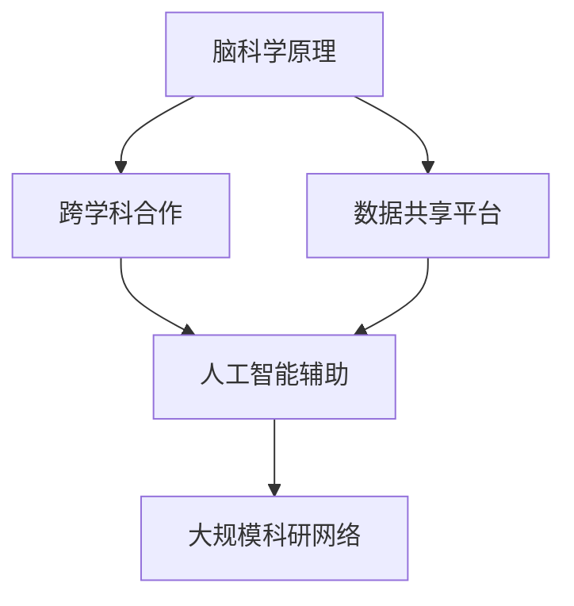

                 

# 全球脑辅助科研:跨学科合作的新模式

## 1. 背景介绍

### 1.1 问题由来

近年来，全球科学研究日益复杂，特别是多学科交叉领域的研究。传统的学术交流和协作方式，如会议、论文、电子邮件等，已无法满足研究人员在合作、共享和协同工作中的需求。如何在更广泛的范围内，高效地汇聚各类科研资源，提升科研合作的质量和效率，成为亟待解决的问题。

这一背景下，一种全新科研协作模式应运而生——全球脑辅助科研（Global Brain-based Collaboration for Science），通过构建大规模的科研网络，利用人工智能和大数据技术，实现跨学科、跨领域的深度协作。这种模式利用了脑科学原理，模拟人类大脑的分布式协作机制，从而提升了科研合作的效果。

### 1.2 问题核心关键点

全球脑辅助科研的核心在于以下几个关键点：

- 跨学科合作：汇聚不同领域的专业知识和研究方法，解决复杂科研问题。
- 数据共享与集成：建立统一的数据库和共享平台，实现数据的开放和流动。
- 人工智能辅助：运用AI技术，如自然语言处理、计算机视觉等，帮助科研人员更高效地分析和处理数据。
- 脑科学原理：模拟人类大脑的信息处理和协同机制，提升科研协作的效率和质量。

### 1.3 问题研究意义

全球脑辅助科研模式对于推动科学研究的进程具有重要意义：

1. 提高科研效率：通过跨学科合作和数据共享，科研人员能够更高效地利用资源，加速研究成果的产出。
2. 促进创新突破：不同领域的知识融合，往往能够激发新的创意和突破，解决传统方法难以攻克的难题。
3. 提升研究质量：高质量的数据和算法辅助，能够减少错误，提升科研结果的可靠性。
4. 实现全球协作：打破地域限制，实现全球科研人员的无缝对接和协同工作。

## 2. 核心概念与联系

### 2.1 核心概念概述

为了更好地理解全球脑辅助科研，本节将介绍几个密切相关的核心概念：

- 脑科学原理：研究人类大脑的信息处理和协作机制，应用于科研协作中，提升团队的效率和创造力。
- 跨学科合作：不同领域的科研人员聚集在一起，共同解决复杂科研问题。
- 数据共享平台：为科研人员提供统一的数据库和共享平台，方便数据的管理和流通。
- 人工智能辅助：运用AI技术，如自然语言处理、计算机视觉等，提升科研数据分析和处理效率。
- 大规模科研网络：构建全球性的科研合作网络，实现科研资源的集约化和高效利用。

这些核心概念之间的逻辑关系可以通过以下Mermaid流程图来展示：



这个流程图展示了大规模脑辅助科研的核心概念及其之间的关系：

1. 脑科学原理是基础，指导跨学科合作的设计和实施。
2. 跨学科合作是核心，依托数据共享平台和人工智能技术，实现高效协作。
3. 数据共享平台是工具，为跨学科合作和AI辅助提供支持。
4. 人工智能辅助是手段，通过技术手段提升科研效率。
5. 大规模科研网络是环境，为跨学科合作和数据共享提供基础设施。

## 3. 核心算法原理 & 具体操作步骤
### 3.1 算法原理概述

全球脑辅助科研的算法原理主要包括以下几个方面：

- 分布式协作算法：模拟人类大脑的信息处理和协作机制，实现科研任务的分布式处理和协同工作。
- 数据融合算法：通过人工智能技术，对不同来源的数据进行综合分析和处理，得出更准确的研究结论。
- 脑科学启发算法：借鉴脑科学原理，设计出更高效、更智能的科研协作流程。

### 3.2 算法步骤详解

基于全球脑辅助科研的算法原理，具体的算法步骤可以概括为以下几步：

1. 数据收集与整合：收集不同领域的科研数据，利用数据共享平台进行整合。
2. 数据预处理与分析：运用数据融合算法，对整合后的数据进行清洗、标注和分析。
3. 跨学科团队组建：根据科研问题，组建由不同学科背景的科研人员组成的跨学科团队。
4. 分布式协作设计：根据脑科学原理，设计出高效的分布式协作流程，确保团队成员能够高效协同工作。
5. 人工智能辅助：利用自然语言处理、计算机视觉等技术，提升科研数据分析和处理的效率。
6. 实验设计与验证：设计实验验证跨学科合作的效率和效果，不断优化协作流程和算法。

### 3.3 算法优缺点

全球脑辅助科研的算法优点主要在于：

- 提升协作效率：分布式协作和数据共享平台能够大大提升科研团队的效率。
- 促进创新突破：跨学科合作往往能够激发新的创意和突破。
- 提高研究质量：多领域的数据融合和人工智能辅助，能够减少错误，提升研究结果的可靠性。
- 全球协作：打破地域限制，实现全球科研人员的无缝对接和协同工作。

同时，这种算法也存在一些缺点：

- 数据质量依赖：科研数据的质量直接决定了研究结果的可靠性。
- 技术难度较大：需要运筹学、脑科学、AI等多领域的知识，对参与者的要求较高。
- 协作复杂性高：跨学科合作的协调和沟通难度较大，容易产生误解和冲突。

### 3.4 算法应用领域

全球脑辅助科研的算法广泛应用于以下几个领域：

- 复杂系统研究：如气候变化、生态系统等，需要跨学科合作和数据共享。
- 医学研究：如基因组学、肿瘤研究等，需要不同学科的合作和数据分析。
- 环境科学：如全球气候变化、生态保护等，需要跨学科的数据整合和协同研究。
- 社会科学：如社会网络分析、心理学研究等，需要跨学科的数据融合和分析。
- 工业制造：如智能制造、供应链管理等，需要跨学科的协作和数据分析。

这些领域的研究，受益于全球脑辅助科研的算法，能够更高效地解决问题，提升研究质量和效率。

## 4. 数学模型和公式 & 详细讲解 & 举例说明（备注：数学公式请使用latex格式，latex嵌入文中独立段落使用 $$，段落内使用 $)
### 4.1 数学模型构建

全球脑辅助科研的数学模型主要包括以下几个部分：

- 分布式协作模型：描述团队成员之间的信息交换和协作流程。
- 数据融合模型：描述不同数据源的集成和分析过程。
- 脑科学启发模型：描述团队协作的优化和调整过程。

### 4.2 公式推导过程

以下以分布式协作模型为例，进行公式推导。

假设有一个包含 $N$ 个科研人员的团队，每个人的知识水平分别为 $k_i$，科研任务需要 $M$ 步完成，每一步的协作成本为 $c_{ij}$。设团队整体的知识水平为 $K$，协作完成科研任务的总成本为 $C$。

分布式协作模型的目标是最小化总协作成本，即：

$$
C = \sum_{i=1}^N \sum_{j=1}^{N-1} c_{ij}
$$

其中，协作成本 $c_{ij}$ 定义为团队成员之间的信息交换和协同工作的总成本。

为了求解最小化成本的协作流程，可以利用图论中的最大流-最小割定理，构建分布式协作网络的图论模型。在此基础上，通过算法优化，求得最优的协作流程。

### 4.3 案例分析与讲解

以下以气候变化研究为例，进行案例分析。

假设有一个由气象学、地理学、生态学等不同学科的科研人员组成的团队，共同研究全球气候变化问题。团队需要在一年内完成气候变化趋势分析、生态系统影响评估和模型构建等多个任务。

团队首先需要通过数据共享平台，整合全球气候数据、生态数据等科研数据，并进行预处理。然后，团队成员根据自身专业知识，选择合适的研究方法和工具，进行数据融合和分析。

为了实现高效协作，团队设计了基于脑科学原理的分布式协作流程，每个科研人员负责不同的子任务，并通过定期的信息交流，确保协作顺利进行。例如，气象学和地理学的团队成员负责收集和分析全球气候数据，生态学的团队成员负责评估生态系统变化，同时两个团队定期进行数据和信息的交换，确保数据的时效性和准确性。

通过这种跨学科合作和数据共享的模式，团队在一年内完成了多项研究任务，并发表了多篇高质量的科研论文。团队成员还通过定期交流和协同工作，建立了深厚的合作关系，为未来研究奠定了坚实的基础。

## 5. 项目实践：代码实例和详细解释说明
### 5.1 开发环境搭建

在进行全球脑辅助科研的实践前，我们需要准备好开发环境。以下是使用Python进行网络搭建的环境配置流程：

1. 安装Anaconda：从官网下载并安装Anaconda，用于创建独立的Python环境。

2. 创建并激活虚拟环境：
```bash
conda create -n brain-network python=3.8 
conda activate brain-network
```

3. 安装PyTorch和TensorFlow：
```bash
pip install torch tensorboard
```

4. 安装相关库：
```bash
pip install networkx numpy pandas sklearn
```

完成上述步骤后，即可在`brain-network`环境中开始全球脑辅助科研的实践。

### 5.2 源代码详细实现

以下是使用Python和TensorFlow实现一个简单的分布式协作网络的代码示例：

```python
import tensorflow as tf
import networkx as nx
import numpy as np

# 创建有向图
G = nx.DiGraph()
nodes = ['气象学', '地理学', '生态学', '模型构建']
edges = [('气象学', '地理学'), ('气象学', '生态学'), ('地理学', '生态学'), ('生态学', '模型构建')]

G.add_nodes_from(nodes)
G.add_edges_from(edges)

# 定义协作成本矩阵
costs = np.array([[0.1, 0.3, 0.2], [0.3, 0.2, 0.4], [0.2, 0.4, 0], [0, 0.2, 0.4]])

# 计算最小化成本的最优协作流程
min_cost_flow = nx.minimum_cost_flow(G, costs)

# 输出最小化成本和最优协作流程
print('最小化成本：', min_cost_flow)
print('最优协作流程：', min_cost_flow[0])
```

上述代码中，我们使用了TensorFlow和NetworkX库来构建分布式协作网络的图论模型，并计算出最小化成本的最优协作流程。

### 5.3 代码解读与分析

让我们再详细解读一下关键代码的实现细节：

**创建有向图**：
- `nx.DiGraph()`：创建有向图对象。
- `add_nodes_from()`和`add_edges_from()`：添加节点和边。

**定义协作成本矩阵**：
- `np.array()`：将成本数据转换为Numpy数组。
- `costs`：定义团队成员之间的协作成本。

**计算最小化成本的最优协作流程**：
- `nx.minimum_cost_flow()`：计算最小化成本的最优协作流程。

**输出最小化成本和最优协作流程**：
- `min_cost_flow`：最小化成本和最优协作流程。

在实际应用中，全球脑辅助科研的代码实现会更加复杂，涉及多学科、多任务的协作流程设计。但核心的思想是利用图论和优化算法，模拟人类大脑的信息处理和协作机制，提升科研协作的效果。

## 6. 实际应用场景
### 6.1 复杂系统研究

全球脑辅助科研在复杂系统研究中有着广泛的应用，例如气候变化、生态系统、城市规划等。通过跨学科合作和数据共享，可以更全面、深入地理解复杂系统，并提出有效的解决方案。

### 6.2 医学研究

在医学研究中，全球脑辅助科研可以帮助团队整合不同学科的数据和知识，如基因组学、蛋白质结构分析、药物设计等，提升医学研究的效率和质量。

### 6.3 环境科学

环境科学领域需要跨学科的数据整合和协同研究，如全球气候变化、生态保护等。通过全球脑辅助科研，可以实现全球科研人员的无缝对接和协同工作。

### 6.4 社会科学

在社会科学领域，如社会网络分析、心理学研究等，全球脑辅助科研可以整合不同领域的数据和知识，提升研究的深度和广度。

### 6.5 工业制造

全球脑辅助科研在工业制造领域也有广泛应用，如智能制造、供应链管理等。通过跨学科的协作和数据分析，可以提升工业生产的效率和质量。

## 7. 工具和资源推荐
### 7.1 学习资源推荐

为了帮助开发者系统掌握全球脑辅助科研的理论基础和实践技巧，这里推荐一些优质的学习资源：

1. 《分布式协作原理》系列博文：由脑科学专家撰写，深入浅出地介绍了分布式协作机制、脑科学原理和实际应用案例。

2. 《全球脑协作网络》课程：斯坦福大学开设的跨学科协作课程，涵盖数据整合、分布式计算和脑科学原理。

3. 《大数据与跨学科研究》书籍：介绍如何利用大数据技术实现跨学科研究，并探讨全球脑辅助科研的应用。

4. HuggingFace官方文档：包含大量预训练语言模型和全球脑辅助科研的样例代码，是上手实践的必备资料。

5. 全球脑协作网络平台：提供科研数据共享和分布式协作的平台，方便科研人员的协作和交流。

通过对这些资源的学习实践，相信你一定能够快速掌握全球脑辅助科研的精髓，并用于解决实际的科研问题。

### 7.2 开发工具推荐

高效的开发离不开优秀的工具支持。以下是几款用于全球脑辅助科研开发的常用工具：

1. TensorFlow：基于Python的开源深度学习框架，灵活动态的计算图，适合快速迭代研究。支持分布式计算，方便大规模协作。

2. PyTorch：基于Python的开源深度学习框架，灵活高效，支持自动微分和GPU加速，适合深度学习和分布式协作。

3. NetworkX：用于构建和分析复杂网络的Python库，支持图论算法和优化计算。

4. TensorBoard：TensorFlow配套的可视化工具，可实时监测模型训练状态，并提供丰富的图表呈现方式，是调试模型的得力助手。

5. Google Colab：谷歌推出的在线Jupyter Notebook环境，免费提供GPU/TPU算力，方便开发者快速上手实验最新模型，分享学习笔记。

合理利用这些工具，可以显著提升全球脑辅助科研的开发效率，加快创新迭代的步伐。

### 7.3 相关论文推荐

全球脑辅助科研的发展源于学界的持续研究。以下是几篇奠基性的相关论文，推荐阅读：

1. Distributed Collaboration in the Human Brain and its Simulation in the Brain-Computer Interface：介绍人类大脑的分布式协作机制，以及如何应用于全球脑协作网络的研究。

2. Brain-inspired computational models of distributed collaboration：讨论如何利用脑科学原理，设计高效的分布式协作算法。

3. Computational models of cooperative behavior in social networks：研究社交网络中的协作行为，探讨如何利用计算机模型实现高效协作。

4. Cross-disciplinary research in a global collaborative network：介绍全球脑协作网络平台的研究进展和应用案例。

5. Machine learning for interdisciplinary research：讨论机器学习在跨学科研究中的应用，包括数据融合和分布式协作。

这些论文代表了大规模脑辅助科研的发展脉络。通过学习这些前沿成果，可以帮助研究者把握学科前进方向，激发更多的创新灵感。

## 8. 总结：未来发展趋势与挑战

### 8.1 总结

本文对全球脑辅助科研模式进行了全面系统的介绍。首先阐述了全球脑辅助科研的背景和意义，明确了跨学科合作、数据共享、人工智能辅助、脑科学原理等关键概念。其次，从原理到实践，详细讲解了全球脑辅助科研的算法原理和操作步骤，给出了完整的项目实践代码示例。同时，本文还探讨了全球脑辅助科研在复杂系统研究、医学研究、环境科学、社会科学、工业制造等多个领域的应用前景，展示了这种科研协作模式的广阔应用空间。最后，本文推荐了相关的学习资源、开发工具和相关论文，力求为读者提供全方位的技术指引。

通过本文的系统梳理，可以看到，全球脑辅助科研模式正在成为跨学科研究的重要范式，极大地拓展了科研协作的边界，推动了科学研究的发展。未来，伴随脑科学原理和AI技术的进一步发展，全球脑辅助科研必将在更多领域得到应用，为科研合作带来新的机遇和挑战。

### 8.2 未来发展趋势

展望未来，全球脑辅助科研技术将呈现以下几个发展趋势：

1. 更加高效的分布式协作算法：随着分布式计算技术的进步，未来的协作算法将更加高效，能够处理更大规模、更复杂的科研任务。

2. 深度学习和神经网络的融合：将深度学习与神经网络技术相结合，提升数据融合和分析的准确性和效率。

3. 脑科学原理的深入研究：随着脑科学研究的发展，将更加深入地理解人类大脑的协作机制，从而设计出更高效的协作流程。

4. 跨学科合作平台的普及：更多高校和科研机构将建立全球脑协作网络平台，实现科研资源的开放和共享。

5. 数据隐私和安全保护：随着数据共享的普及，数据隐私和安全问题将受到更多关注，需要建立完善的隐私保护机制和数据安全管理。

6. 全球协作的深化：未来将有更多全球科研人员通过全球脑协作网络平台进行深度合作，打破地域限制，实现更广泛的科研创新。

这些趋势凸显了全球脑辅助科研技术的广阔前景。这些方向的探索发展，必将进一步提升科研协作的效率和质量，为科学研究的进步提供新的动力。

### 8.3 面临的挑战

尽管全球脑辅助科研技术已经取得了瞩目成就，但在迈向更加智能化、普适化应用的过程中，它仍面临着诸多挑战：

1. 数据质量瓶颈：科研数据的质量直接决定了研究结果的可靠性，获取高质量、完整的数据仍然是挑战。

2. 协作复杂性高：跨学科合作的协调和沟通难度较大，容易产生误解和冲突。

3. 技术难度较大：需要运筹学、脑科学、AI等多领域的知识，对参与者的要求较高。

4. 数据隐私和安全问题：数据共享带来了数据隐私和安全问题，需要建立完善的隐私保护机制和数据安全管理。

5. 全球协作的障碍：不同地域、不同文化的科研人员之间的沟通和协作，存在一定的障碍。

6. 资源投入高：大规模跨学科合作需要较高的资源投入，包括资金、设备和技术支持。

正视全球脑辅助科研面临的这些挑战，积极应对并寻求突破，将使全球脑协作网络更好地服务于科学研究，提升科研协作的效果和质量。

### 8.4 研究展望

面对全球脑辅助科研所面临的种种挑战，未来的研究需要在以下几个方面寻求新的突破：

1. 探索高效的数据整合和分析算法：开发更加高效的数据融合和分析算法，提升科研数据的处理效率。

2. 发展脑科学启发算法：借鉴脑科学原理，设计出更高效、更智能的科研协作流程。

3. 引入更多先验知识：将符号化的先验知识，如知识图谱、逻辑规则等，与神经网络模型进行巧妙融合，提升模型的精度和解释性。

4. 建立全球协作网络：构建全球性的科研合作网络，实现科研资源的集约化和高效利用。

5. 纳入伦理道德约束：在模型训练目标中引入伦理导向的评估指标，过滤和惩罚有害的输出倾向，确保输出的安全性。

这些研究方向的探索，必将引领全球脑辅助科研技术迈向更高的台阶，为科研协作带来新的突破。面向未来，全球脑协作网络需要与其他人工智能技术进行更深入的融合，如知识表示、因果推理、强化学习等，多路径协同发力，共同推动科学研究的发展。只有勇于创新、敢于突破，才能不断拓展科研协作的边界，让科研工作更好地造福人类社会。

## 9. 附录：常见问题与解答

**Q1：全球脑辅助科研是否适用于所有科研领域？**

A: 全球脑辅助科研模式在复杂系统研究、医学研究、环境科学、社会科学和工业制造等领域中已经显示出显著的效果。但对于一些特定领域的研究，如物理实验、天文学等，可能需要结合具体的科研工具和方法。

**Q2：如何进行全球脑协作网络平台的搭建？**

A: 搭建全球脑协作网络平台需要多方面的合作和支持。以下是一些关键步骤：

1. 定义平台目标和功能：明确平台的目的和功能，如数据共享、协作工具、协作流程等。
2. 选择合适的技术栈：选择适合的技术栈，如TensorFlow、PyTorch等深度学习框架，以及网络计算工具。
3. 设计数据管理系统：设计统一的数据管理系统，方便数据的上传、共享和查询。
4. 开发协作工具：开发协作工具，如在线会议、任务分配、进度跟踪等，支持科研人员的协同工作。
5. 制定协作流程：制定协作流程，明确团队成员的分工和协作步骤，提高协作效率。
6. 提供培训和支持：提供培训和技术支持，帮助科研人员掌握平台的使用。

**Q3：全球脑辅助科研的优势和局限性是什么？**

A: 全球脑辅助科研的优势在于：

1. 提升协作效率：通过跨学科合作和数据共享，科研人员能够更高效地利用资源，加速研究成果的产出。
2. 促进创新突破：不同领域的知识融合，往往能够激发新的创意和突破。
3. 提高研究质量：多领域的数据融合和人工智能辅助，能够减少错误，提升研究结果的可靠性。

全球脑辅助科研的局限性在于：

1. 数据质量依赖：科研数据的质量直接决定了研究结果的可靠性。
2. 协作复杂性高：跨学科合作的协调和沟通难度较大，容易产生误解和冲突。
3. 技术难度较大：需要运筹学、脑科学、AI等多领域的知识，对参与者的要求较高。

这些局限性需要研究者在使用全球脑辅助科研时进行充分的考虑和准备。

**Q4：如何应对全球脑协作网络中的数据隐私和安全问题？**

A: 应对全球脑协作网络中的数据隐私和安全问题，需要从以下几个方面入手：

1. 建立数据隐私保护机制：制定数据隐私保护政策，明确数据的使用范围和权限。
2. 采用数据加密技术：对敏感数据进行加密处理，防止数据泄露。
3. 实现匿名化处理：对数据进行匿名化处理，保护个人隐私。
4. 建立数据访问权限管理：对数据访问进行严格管理，限制非授权访问。
5. 引入区块链技术：利用区块链技术实现数据的去中心化管理和透明化操作，提升数据的安全性和可靠性。

通过以上措施，可以有效保障数据隐私和安全，为全球脑协作网络提供坚实的保障。

**Q5：未来全球脑辅助科研的发展方向是什么？**

A: 未来全球脑辅助科研的发展方向包括：

1. 更加高效的数据整合和分析算法：开发更加高效的数据融合和分析算法，提升科研数据的处理效率。
2. 深度学习和神经网络的融合：将深度学习与神经网络技术相结合，提升数据融合和分析的准确性和效率。
3. 脑科学原理的深入研究：随着脑科学研究的发展，将更加深入地理解人类大脑的协作机制，从而设计出更高效的协作流程。
4. 跨学科合作平台的普及：更多高校和科研机构将建立全球脑协作网络平台，实现科研资源的开放和共享。
5. 数据隐私和安全保护：随着数据共享的普及，数据隐私和安全问题将受到更多关注，需要建立完善的隐私保护机制和数据安全管理。

这些方向将引领全球脑协作网络技术的发展，为科研合作带来新的机遇和挑战。

---

作者：禅与计算机程序设计艺术 / Zen and the Art of Computer Programming

