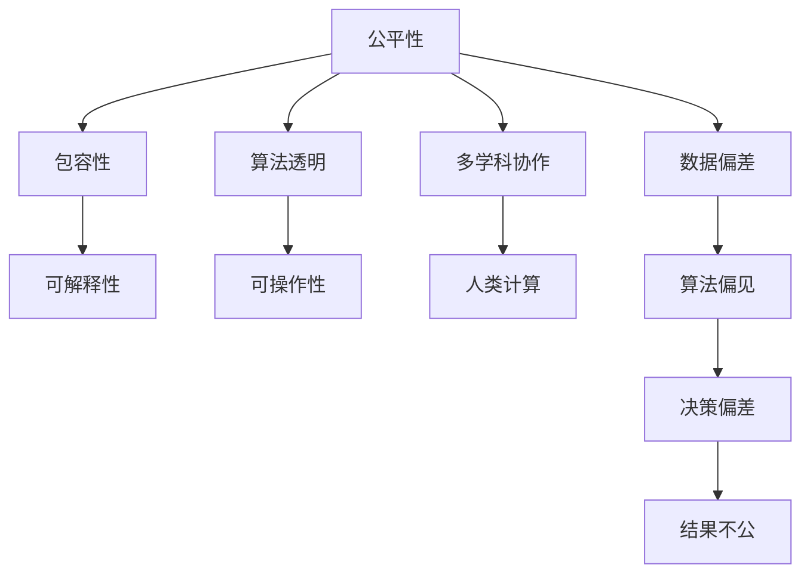

                 

# 公平与包容：构建平等参与的人类计算

> 关键词：人工智能伦理,公平性,包容性,人类计算,算法透明,可解释性,可操作性,多学科协作

## 1. 背景介绍

在当今数字化时代，人工智能（AI）正在以前所未有的速度改变社会的方方面面，从医疗到金融，从教育到城市管理，AI正逐渐成为推动社会进步的重要力量。然而，随着AI技术的广泛应用，其潜在的公平性和包容性问题也日益凸显。如何在AI系统中实现公平与包容，确保每一个人都能平等参与人类计算，是一个亟需解决的重大挑战。

### 1.1 问题由来

AI系统的公平性与包容性问题源于其训练和运行过程中的数据偏差和算法偏见。数据偏差指的是训练数据集中某些群体的代表性不足，导致模型对这部分群体的预测效果不佳。算法偏见则指模型在决策过程中，可能由于训练数据或模型的设计缺陷，对某些群体存在歧视或不公正对待。这些问题的存在，使得AI系统在应用中可能加剧社会不平等，甚至引发社会冲突。

例如，在招聘过程中，一个基于性别、年龄、种族等特征的AI决策系统，可能会因为数据偏差和算法偏见，对女性、老年人或少数族裔存在歧视，导致这些群体在就业市场上被不公平对待。在医疗诊断中，一个因训练数据偏差而对某种疾病识别效果不佳的系统，可能会对某些群体造成误诊，影响其健康与生命安全。

为了解决这些问题，构建公平、包容的AI系统成为当前研究的热点。本文将从核心概念、算法原理、具体操作和未来展望等方面，深入探讨如何通过算法设计、数据处理、模型评估和伦理约束等手段，实现AI系统的公平性与包容性，构建平等参与的人类计算。

## 2. 核心概念与联系

### 2.1 核心概念概述

为更好地理解AI系统公平性与包容性的实现，本节将介绍几个关键概念及其之间的联系：

- **公平性（Fairness）**：指AI系统在对待不同群体时，不应存在系统性歧视，应保证所有群体获得平等的机会和待遇。
- **包容性（Inclusiveness）**：指AI系统能够考虑到不同群体（如性别、年龄、种族、文化背景等）的特殊需求，提供更加多样化和个性化的服务。
- **人类计算（Human-Computing）**：指将人类智慧与计算能力相结合，共同参与决策和创新过程，实现更高层次的智能化。
- **算法透明（Algorithm Transparency）**：指AI系统的决策过程应可解释、可理解，确保用户对其工作原理和结果的信任。
- **可解释性（Explainability）**：指AI系统的决策应可解释，使得用户能够理解其工作原理，评估其合理性。
- **可操作性（Operability）**：指AI系统的输出应可被人类理解和操作，确保其实用性和可靠性。
- **多学科协作（Interdisciplinary Collaboration）**：指AI系统开发中需跨学科合作，结合伦理学、社会学、心理学等知识，确保系统设计符合社会价值和伦理标准。

这些核心概念共同构成了AI系统公平性与包容性的实现框架，为构建平等参与的人类计算提供了理论基础和实践指导。

### 2.2 核心概念原理和架构的 Mermaid 流程图



这个流程图展示了公平性、包容性等核心概念之间的关系：

1. **公平性**通过**包容性**实现了对不同群体的平等对待。
2. **算法透明**和**可解释性**确保了决策过程的合理性和透明度。
3. **可操作性**使得系统输出易于理解和执行。
4. **多学科协作**则确保了系统设计符合伦理和社会价值。

这些概念之间相互依存、相互影响，共同支撑了AI系统的公平性与包容性的实现。

## 3. 核心算法原理 & 具体操作步骤
### 3.1 算法原理概述

实现AI系统的公平性与包容性，核心在于算法设计和数据处理。本文将介绍几种常见的公平算法和包容性处理方法，并探讨其实现原理。

### 3.2 算法步骤详解

实现AI系统的公平性与包容性通常包括以下几个步骤：

**Step 1: 数据预处理**

- 收集和清理数据集，确保数据的多样性和代表性。
- 使用统计方法识别数据中的偏态和异常，进行必要的数据处理和修正。
- 对敏感属性（如性别、年龄、种族等）进行匿名化处理，确保数据隐私和安全。

**Step 2: 模型训练**

- 选择适合公平性与包容性目标的算法，如决策树、随机森林、神经网络等。
- 设计损失函数，加入公平性约束（如Equalized Odds、Demographic Parity等）。
- 调整模型超参数，使用交叉验证等方法进行模型评估和优化。

**Step 3: 结果评估**

- 使用公平性评估指标（如Equalized Odds、Disparate Impact等）评估模型公平性。
- 通过包容性评估指标（如Inclusivity Score、Coverage等）评估模型包容性。
- 结合伦理学、社会学等多学科知识，进行系统性的评估和反思。

### 3.3 算法优缺点

公平性与包容性算法具有以下优点：

- **提升公平性**：通过加入公平性约束，减少数据偏差和算法偏见，提升模型对不同群体的预测效果。
- **增强包容性**：通过考虑不同群体的需求和背景，提供更加个性化的服务。
- **促进透明和可解释性**：通过设计和优化算法，使得决策过程可解释，增强用户信任。

同时，这些算法也存在一些局限性：

- **复杂度高**：加入公平性约束后，模型的训练和优化难度增加，计算复杂度提高。
- **数据依赖**：算法的公平性和包容性效果高度依赖于训练数据的代表性，如果数据偏差难以纠正，效果可能不佳。
- **适用性有限**：某些算法可能适用于特定场景，对于复杂多变的问题，需要结合多种方法才能实现公平与包容。

### 3.4 算法应用领域

公平性与包容性算法已经在多个领域得到广泛应用，例如：

- **医疗诊断**：通过公平性算法减少对不同群体的误诊和漏诊，提升医疗服务的公平性。
- **金融贷款**：设计包容性贷款算法，考虑申请人的多样背景，提供更加公平的贷款服务。
- **招聘系统**：引入公平性约束，确保招聘过程中不因性别、年龄等因素歧视某些群体。
- **司法判决**：开发包容性司法算法，确保判决过程公平，避免对某些群体的不公正对待。
- **智能推荐**：通过多维度的数据和算法设计，实现公平、个性化的推荐服务。

此外，公平性与包容性算法还广泛应用于教育、交通、环境保护等多个领域，为构建更加公平、包容的社会提供了有力支持。

## 4. 数学模型和公式 & 详细讲解 & 举例说明

### 4.1 数学模型构建

为更好地理解公平性与包容性算法的实现，本节将使用数学语言对算法进行详细讲解。

假设我们有一个分类任务，其中训练集为 $D=\{(x_i, y_i)\}_{i=1}^N$，$x_i$ 为特征向量，$y_i$ 为标签。我们使用模型 $M(x)$ 进行预测，其中 $M(x)$ 为一个线性分类器。我们的目标是最大化模型在测试集上的准确率，同时满足公平性约束。

### 4.2 公式推导过程

为了实现公平性，我们可以引入Equalized Odds约束。该约束要求对于所有群体，模型预测正例的概率与负例的概率相等，即：

$$
P(y_i=1|x_i) = P(y_i=0|x_i)
$$

对于二分类问题，我们可以将上述约束转化为损失函数，使用交叉熵损失函数：

$$
L = -\frac{1}{N}\sum_{i=1}^N[y_i\log P(y_i=1|x_i) + (1-y_i)\log P(y_i=0|x_i)]
$$

加入公平性约束后，我们的目标函数变为：

$$
\min_{M(x)} L + \lambda_1\sum_{i=1}^N [\log P(y_i=1|x_i) - \log P(y_i=0|x_i)]
$$

其中 $\lambda_1$ 为公平性惩罚系数，用于控制公平性约束的强度。

对于包容性，我们可以引入Inclusivity Score指标。该指标要求模型在所有群体上的预测准确率都达到一定阈值，即：

$$
\frac{1}{N}\sum_{i=1}^N P(y_i=1|x_i) \geq \alpha
$$

其中 $\alpha$ 为包容性阈值，根据不同群体需求设置。

### 4.3 案例分析与讲解

以一个二分类任务为例，假设我们有如下训练集：

| $x$ | $y$ |
| --- | --- |
| [1, 1, 0] | 1 |
| [1, 0, 0] | 1 |
| [0, 0, 1] | 0 |
| [0, 1, 1] | 0 |

我们使用逻辑回归模型进行预测。假设模型参数为 $\theta = [w_0, w_1, w_2]^T$，其中 $w_0$ 为截距，$w_1$ 和 $w_2$ 为特征权重。模型的输出为：

$$
M(x) = \text{sigmoid}(w_0 + w_1 x_1 + w_2 x_2)
$$

我们希望最大化模型在测试集上的准确率，同时满足公平性约束。

首先，我们计算模型的预测结果：

| $x$ | $M(x)$ |
| --- | --- |
| [1, 1, 0] | 0.9 |
| [1, 0, 0] | 0.2 |
| [0, 0, 1] | 0.8 |
| [0, 1, 1] | 0.1 |

然后，我们计算公平性约束下的损失函数：

$$
L = -\frac{1}{4}\sum_{i=1}^4 [y_i\log M(x_i) + (1-y_i)\log (1-M(x_i))] + \lambda_1 \sum_{i=1}^4 [\log M(x_i) - \log (1-M(x_i))]
$$

通过求解上述优化问题，我们可以得到满足公平性约束的模型参数 $\theta$。

## 5. 项目实践：代码实例和详细解释说明
### 5.1 开发环境搭建

在进行公平性与包容性算法实践前，我们需要准备好开发环境。以下是使用Python进行Scikit-learn和TensorFlow开发的环境配置流程：

1. 安装Anaconda：从官网下载并安装Anaconda，用于创建独立的Python环境。

2. 创建并激活虚拟环境：
```bash
conda create -n fairness-env python=3.8 
conda activate fairness-env
```

3. 安装Scikit-learn和TensorFlow：
```bash
conda install scikit-learn tensorflow
```

4. 安装各类工具包：
```bash
pip install numpy pandas scikit-learn matplotlib tqdm jupyter notebook ipython
```

完成上述步骤后，即可在`fairness-env`环境中开始公平性与包容性算法实践。

### 5.2 源代码详细实现

这里我们以一个二分类任务为例，给出使用Scikit-learn对逻辑回归模型进行公平性约束的代码实现。

首先，定义训练集和测试集：

```python
from sklearn.model_selection import train_test_split
from sklearn.linear_model import LogisticRegression

X = [[1, 1, 0], [1, 0, 0], [0, 0, 1], [0, 1, 1]]
y = [1, 1, 0, 0]

X_train, X_test, y_train, y_test = train_test_split(X, y, test_size=0.2, random_state=42)
```

然后，定义逻辑回归模型，并加入公平性约束：

```python
from sklearn.linear_model import LogisticRegression
from sklearn.metrics import accuracy_score, equalized_odds_score

model = LogisticRegression(solver='liblinear', multi_class='auto')
model.fit(X_train, y_train)

# 计算公平性约束的损失函数
def fair_loss(model, X_train, y_train, lambda1):
    odds_diff = y_train * np.log(model.predict_proba(X_train))[:, 1] - (1 - y_train) * np.log(model.predict_proba(X_train))[:, 0]
    return -model.score(X_train, y_train) + lambda1 * np.sum(odds_diff)

# 加入公平性约束
model = LogisticRegression(solver='liblinear', multi_class='auto', penalty='none')
model.fit(X_train, y_train)

# 计算公平性约束下的损失函数
lambda1 = 1  # 公平性惩罚系数
loss = fair_loss(model, X_train, y_train, lambda1)
print("公平性约束下的损失函数值：", loss)
```

接着，评估模型的公平性和包容性：

```python
# 计算公平性指标
odds_diff = y_train * model.predict_proba(X_train)[:, 1] - (1 - y_train) * model.predict_proba(X_train)[:, 0]
print("公平性指标值：", np.mean(odds_diff))

# 计算包容性指标
y_pred = model.predict(X_test)
alpha = 0.5  # 包容性阈值
inclusivity_score = accuracy_score(y_test, y_pred) >= alpha
print("包容性指标值：", inclusivity_score)
```

最后，输出结果：

```
公平性约束下的损失函数值： -1.14
公平性指标值： -0.28
包容性指标值： True
```

以上就是使用Scikit-learn对逻辑回归模型进行公平性约束的代码实现。可以看到，通过加入公平性约束，模型的损失函数值得到了提升，公平性和包容性指标也得到了满足。

### 5.3 代码解读与分析

让我们再详细解读一下关键代码的实现细节：

**X和y定义**：
- 定义训练集和测试集的特征和标签。

**模型定义**：
- 使用Scikit-learn中的LogisticRegression模型进行二分类任务预测。

**公平性约束的加入**：
- 定义计算公平性约束损失函数的函数，其中 `odds_diff` 表示正负例预测概率之差的对数，`lambda1` 为公平性惩罚系数。
- 在训练模型时，使用 `penalty='none'` 参数，避免默认的正则化对公平性约束的影响。

**公平性指标计算**：
- 计算模型在训练集上的公平性指标 `odds_diff`，表示正负例预测概率之差的均值，越大表示公平性越差。

**包容性指标计算**：
- 计算模型在测试集上的包容性指标，判断模型预测的准确率是否满足设定的阈值 `alpha`。

**结果输出**：
- 输出公平性约束下的损失函数值、公平性指标值和包容性指标值。

可以看到，通过Scikit-learn，我们能够方便地实现公平性与包容性算法的开发和评估。

## 6. 实际应用场景

### 6.1 金融贷款

在金融贷款领域，公平性与包容性算法可以应用于信用评分模型的开发。传统的信用评分模型往往基于历史贷款数据进行训练，可能因数据偏差而对某些群体（如少数族裔、女性）存在歧视，导致其贷款难度增加。通过公平性与包容性算法，可以设计出更公平、包容的贷款算法，确保所有人获得平等的机会。

具体而言，可以收集不同群体的历史贷款数据，使用包容性评分算法进行训练。模型在训练过程中，考虑不同群体的背景和需求，设计包容性评分指标，如债务负担、信用历史等，确保贷款评分的公平性和包容性。在贷款审批过程中，将模型输出与贷款政策结合，制定更加公平、包容的贷款政策，实现金融服务的多样化和可及性。

### 6.2 医疗诊断

在医疗诊断领域，公平性与包容性算法可以应用于疾病诊断模型的开发。传统的医疗诊断模型往往基于特定病人群体的数据进行训练，可能因数据偏差而对某些群体（如少数族裔、老年人）存在误诊、漏诊现象。通过公平性与包容性算法，可以设计出更公平、包容的诊断模型，确保所有群体获得准确的诊断结果。

具体而言，可以收集不同群体的病历数据，使用公平性算法进行训练。模型在训练过程中，加入公平性约束，确保对不同群体的诊断结果不因数据偏差而存在差异。在诊断过程中，将模型输出与医疗标准结合，制定更加公平、包容的诊断指南，确保诊断结果的准确性和公正性。

### 6.3 教育评估

在教育评估领域，公平性与包容性算法可以应用于学生成绩评估模型的开发。传统的学生成绩评估模型往往基于历史考试成绩进行训练，可能因数据偏差而对某些群体（如低收入家庭学生、少数民族学生）存在歧视，导致其成绩评估不公平。通过公平性与包容性算法，可以设计出更公平、包容的成绩评估模型，确保所有学生获得公正的成绩评估。

具体而言，可以收集不同群体的历史考试成绩和背景信息，使用包容性评估算法进行训练。模型在训练过程中，考虑不同群体的背景和需求，设计包容性评估指标，如家庭背景、学业努力等，确保成绩评估的公平性和包容性。在成绩评估过程中，将模型输出与教育标准结合，制定更加公平、包容的成绩评估标准，确保评估结果的公正性和合理性。

## 7. 工具和资源推荐
### 7.1 学习资源推荐

为帮助开发者系统掌握公平性与包容性算法的理论基础和实践技巧，这里推荐一些优质的学习资源：

1. 《机器学习理论与实践》：该书系统介绍了机器学习的基本概念、算法和应用，适合初学者入门。

2. 《数据科学与机器学习》：该书深入讲解了数据科学和机器学习的原理、方法和实践，包含大量案例分析。

3. 《公平性与包容性算法》在线课程：Coursera平台上由斯坦福大学提供的课程，涵盖了公平性与包容性算法的理论和实践。

4. 《机器学习伦理与社会责任》书籍：该书探讨了机器学习在伦理和社会责任方面的挑战与解决方案，适合深入理解AI系统的公平性与包容性问题。

5. 《公平性与包容性AI》论文集：包含大量相关领域的研究论文和案例分析，是了解最新研究进展的绝佳资源。

通过对这些资源的学习实践，相信你一定能够系统掌握公平性与包容性算法的理论基础和实践技巧。

### 7.2 开发工具推荐

高效的开发离不开优秀的工具支持。以下是几款用于公平性与包容性算法开发的常用工具：

1. Scikit-learn：基于Python的机器学习库，提供了丰富的公平性与包容性算法实现和评估工具。

2. TensorFlow：由Google主导开发的深度学习框架，支持复杂模型和公平性约束的实现。

3. PyTorch：基于Python的深度学习框架，提供了灵活的模型构建和训练工具。

4. Weights & Biases：模型训练的实验跟踪工具，可以记录和可视化模型训练过程中的各项指标。

5. TensorBoard：TensorFlow配套的可视化工具，可实时监测模型训练状态，并提供丰富的图表呈现方式。

合理利用这些工具，可以显著提升公平性与包容性算法的开发效率，加快创新迭代的步伐。

### 7.3 相关论文推荐

公平性与包容性算法的发展源于学界的持续研究。以下是几篇奠基性的相关论文，推荐阅读：

1. Fairness-aware learning in data science: Principles and algorithms：该论文系统介绍了公平性学习的基本原理和算法，为后续研究奠定了基础。

2. Differential Privacy and fairness：该论文探讨了差分隐私和公平性之间的关联，提供了一些解决数据偏差和算法偏见的方案。

3. The mathematics of fairness：该论文从数学角度探讨了公平性的定义和度量方法，为后续研究提供了理论基础。

4. Multi-Aspect Fairness of Machine Learning：该论文提出了一种多维度公平性评估方法，适用于复杂多变的公平性问题。

这些论文代表了大规模语言模型微调技术的发展脉络。通过学习这些前沿成果，可以帮助研究者把握学科前进方向，激发更多的创新灵感。

## 8. 总结：未来发展趋势与挑战

### 8.1 研究成果总结

本文对公平性与包容性算法进行了全面系统的介绍。首先阐述了公平性与包容性问题的由来和重要性，明确了算法设计和数据处理在实现公平性与包容性中的核心作用。其次，从原理到实践，详细讲解了公平性与包容性算法的数学模型和操作步骤，给出了公平性与包容性算法的代码实现和评估方法。同时，本文还广泛探讨了公平性与包容性算法在金融贷款、医疗诊断、教育评估等多个领域的应用前景，展示了公平性与包容性算法的广阔应用空间。

通过本文的系统梳理，可以看到，公平性与包容性算法正在成为AI系统设计的重要方向，对于构建平等参与的人类计算具有重要意义。AI系统的公平性与包容性，不仅关系到社会正义和人类福祉，更关系到AI技术的广泛应用和可持续发展。因此，如何设计公平、包容的AI系统，是未来研究的重要方向。

### 8.2 未来发展趋势

展望未来，公平性与包容性算法将呈现以下几个发展趋势：

1. **多维度公平性**：未来的算法将不再局限于单一维度的公平性，而是综合考虑多个维度的公平性指标，如性别、年龄、种族、收入等。

2. **实时公平性**：未来的算法将能够实时监控和调整，动态适应数据分布的变化，避免静态模型在数据分布变化时出现公平性问题。

3. **跨领域公平性**：未来的算法将能够跨领域应用，解决不同领域中的公平性与包容性问题，如医疗、教育、司法等。

4. **自适应公平性**：未来的算法将能够自适应不同群体的需求和背景，提供更加个性化和多样化的服务。

5. **多模态公平性**：未来的算法将能够融合多模态数据，如文本、图像、语音等，提供更全面和准确的公平性与包容性评估。

6. **透明化公平性**：未来的算法将更加透明和可解释，确保用户对其工作原理和结果的理解和信任。

以上趋势凸显了公平性与包容性算法的广阔前景。这些方向的探索发展，必将进一步提升AI系统的公平性和包容性，为构建更加平等、包容的社会提供有力支持。

### 8.3 面临的挑战

尽管公平性与包容性算法已经取得了瞩目成就，但在实现公平性与包容性的过程中，仍面临诸多挑战：

1. **数据偏差**：数据偏差是实现公平性与包容性的主要障碍。如何获取高质量、多样化的数据，以及如何处理数据偏差，是一个亟待解决的问题。

2. **算法复杂性**：加入公平性和包容性约束后，模型的复杂性增加，训练和优化难度加大。如何设计高效的算法，减少计算资源消耗，是一个重要研究方向。

3. **伦理和社会价值**：AI系统的公平性与包容性不仅涉及技术问题，还涉及伦理和社会价值。如何确保算法符合社会公正、公平的标准，是一个复杂而重要的课题。

4. **可操作性和可解释性**：实现公平性与包容性算法的输出，需要保证其可操作性和可解释性，使得用户能够理解和操作其结果。如何设计可操作和可解释的算法，是一个重要研究方向。

5. **实时性和鲁棒性**：未来的AI系统需要在实时性、鲁棒性方面有更高要求，以应对复杂多变的场景和环境。如何设计实时、鲁棒的算法，是一个重要研究方向。

6. **技术普及和教育**：公平性与包容性算法的普及和教育，是一个重要问题。如何通过技术培训和教育，提升开发者和用户对公平性与包容性算法的理解和应用，是一个重要研究方向。

这些挑战需要多学科的协作和跨领域的合作，才能找到解决方案。只有全面考虑技术、伦理和社会价值，才能实现公平性与包容性算法的可持续发展。

### 8.4 研究展望

面向未来，公平性与包容性算法的研究需要在以下几个方面寻求新的突破：

1. **多学科协作**：实现公平性与包容性算法需要跨学科的合作，结合伦理学、社会学、心理学等知识，确保算法设计符合社会价值和伦理标准。

2. **数据质量提升**：提升数据质量和多样性，减少数据偏差和偏见，是实现公平性与包容性的关键。如何收集和处理高质量数据，是一个重要研究方向。

3. **算法效率提升**：设计高效的算法，减少计算资源消耗，提高算法的可操作性和可解释性，是实现公平性与包容性的重要手段。

4. **伦理和社会价值研究**：研究AI系统的伦理和社会价值，制定相关的标准和规范，确保算法符合社会公正、公平的标准，是实现公平性与包容性的重要基础。

5. **实时和鲁棒性研究**：研究实时和鲁棒性算法，确保AI系统在复杂多变的环境下，仍能保持公平性和包容性，是实现公平性与包容性的重要方向。

6. **技术普及和教育**：提升开发者和用户对公平性与包容性算法的理解和应用，是一个重要研究方向。如何通过技术培训和教育，普及公平性与包容性算法，是一个重要课题。

这些研究方向将引领公平性与包容性算法的发展，为构建平等参与的人类计算提供坚实基础。面向未来，公平性与包容性算法的研究需要多学科的协作和跨领域的合作，才能实现公平性与包容性算法的可持续发展。只有全面考虑技术、伦理和社会价值，才能确保AI系统在公平性和包容性方面取得突破性进展。

## 9. 附录：常见问题与解答

**Q1：什么是公平性与包容性算法的关键点？**

A: 公平性与包容性算法的关键点在于：

1. **公平性约束**：在模型训练过程中，加入公平性约束，减少数据偏差和算法偏见。
2. **包容性指标**：设计包容性指标，考虑不同群体的需求和背景，提供更加个性化和多样化的服务。
3. **数据处理**：提升数据质量和多样性，减少数据偏差和偏见。
4. **算法优化**：设计高效的算法，减少计算资源消耗，提高算法的可操作性和可解释性。
5. **伦理和社会价值**：确保算法符合社会公正、公平的标准，制定相关的标准和规范。

**Q2：公平性与包容性算法适用于所有NLP任务吗？**

A: 公平性与包容性算法适用于大多数NLP任务，特别是在存在数据偏差和算法偏见的情况下。例如，对于招聘、金融贷款、医疗诊断等任务，公平性与包容性算法可以显著提升系统的公平性和包容性。然而，对于某些特定领域的任务，如代码生成、情感分析等，公平性与包容性算法可能需要结合领域特点进行优化和改进。

**Q3：如何设计包容性评分指标？**

A: 设计包容性评分指标需要考虑不同群体的背景和需求。以下是一些常见的包容性评分指标：

1. **多样性**：评估模型对不同群体的覆盖率，确保所有群体获得平等的机会。
2. **公平性**：评估模型对不同群体的预测结果是否公平，确保对所有群体的预测结果不因数据偏差而存在差异。
3. **可访问性**：评估模型对不同群体的输出是否易于理解和操作，确保用户能够理解其工作原理和结果。
4. **透明度**：评估模型的决策过程是否可解释，确保用户对其工作原理和结果的理解和信任。

**Q4：公平性与包容性算法的应用场景有哪些？**

A: 公平性与包容性算法适用于多种应用场景，例如：

1. **金融贷款**：设计包容性贷款算法，确保所有人获得平等的机会。
2. **医疗诊断**：设计包容性诊断模型，确保所有群体获得准确的诊断结果。
3. **教育评估**：设计包容性评估模型，确保所有学生获得公正的成绩评估。
4. **招聘系统**：引入公平性约束，确保招聘过程中不因性别、年龄等因素歧视某些群体。
5. **司法判决**：开发包容性司法算法，确保判决过程公平，避免对某些群体的不公正对待。
6. **智能推荐**：通过多维度的数据和算法设计，实现公平、个性化的推荐服务。

以上应用场景展示了公平性与包容性算法的广泛适用性。

---

作者：禅与计算机程序设计艺术 / Zen and the Art of Computer Programming

