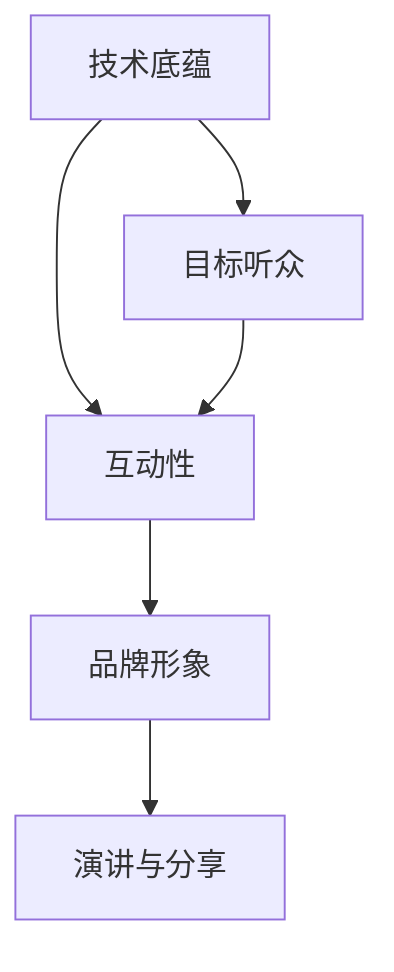

                 

# 公开演讲和分享：提高知名度和权威性

在信息化时代，公开演讲和分享成为了展示技术能力、扩大个人影响力、塑造品牌形象的重要途径。尤其是在IT行业，通过技术分享可以积累行业声誉、促进行业交流、提升团队协作。但成功的演讲和分享并不仅靠深入的技术底蕴，还需要系统的策略和方法。本文将系统梳理公开演讲和分享的流程与技巧，助力各位IT从业者提升个人品牌价值，树立行业权威。

## 1. 背景介绍

### 1.1 问题由来
在快速发展的IT行业中，新技术、新应用层出不穷。如何高效地将知识共享给同行，提升自身影响力，是每个从业者必须面对的课题。随着互联网和信息技术的普及，越来越多的人通过博客、视频、演讲等形式分享自己的技术见解。但如何让分享内容通俗易懂、引起共鸣，并实现有效的知识传播和品牌树立，却不是每个人都能做到的。因此，本文旨在从理论和实践两个层面，系统解析公开演讲和分享的策略与技巧。

### 1.2 问题核心关键点
- 主题明确：确定演讲和分享的明确主题，避免泛泛而谈。
- 目标听众：清晰界定目标听众，并根据其需求和背景调整演讲内容。
- 结构清晰：构建有逻辑性的演讲框架，便于听众理解和跟随。
- 内容精炼：简化技术细节，突出核心观点，避免信息过载。
- 互动性高：提高演讲的互动性，增强与听众的连接。
- 视觉呈现：利用PPT、视频等多媒体工具提升演讲效果。
- 演讲风格：演讲者需保持自信、幽默、自然、平易近人的风格。

## 2. 核心概念与联系

### 2.1 核心概念概述

为更好地理解公开演讲和分享的策略与技巧，本节将介绍几个密切相关的核心概念：

- 演讲与分享：公开展示自己的技术观点、项目经验、研究进展等，与同行交流互动的过程。
- 技术底蕴：演讲者对技术领域的深入理解和积累，是分享能否成功的基础。
- 目标听众：听众所代表的背景、需求和兴趣，决定了演讲内容的设计和形式。
- 互动性：通过提问、讨论、实验等形式，增加听众参与感，提升演讲效果。
- 品牌形象：通过多次高质量的分享，逐步树立演讲者的专业形象，建立行业信誉。

这些核心概念之间的逻辑关系可以通过以下Mermaid流程图来展示：



这个流程图展示了她个核心概念之间的关系：

1. 演讲者必须具备深厚的技术底蕴，才能进行有效的知识分享。
2. 演讲内容需要针对目标听众进行设计，以确保其相关性和吸引力。
3. 互动性是提升演讲效果的重要手段，能够增加听众的参与感和共鸣。
4. 品牌形象的树立需建立在多次高质量演讲的基础之上。

这些概念共同构成了公开演讲和分享的核心框架，使得技术分享能够高效传播，提升演讲者的行业影响力。

## 3. 核心算法原理 & 具体操作步骤
### 3.1 算法原理概述

公开演讲和分享的算法原理主要围绕以下几个方面展开：

- 技术内容的提炼和整理。将复杂的技术问题简化，提炼出关键点，形成易于理解的框架。
- 主题的明确和受众的定位。确保演讲内容与听众需求匹配，主题明确，避免信息过载。
- 互动性设计。通过提问、讨论、现场演示等方式，增强听众的参与感和兴趣。
- 视觉和听觉的辅助。通过精心设计的PPT、视频等多媒体内容，提升演讲的感染力。
- 演讲风格的把握。演讲者需自信、幽默、自然地进行表达，使听众易于接受。

### 3.2 算法步骤详解

基于上述原理，公开演讲和分享的步骤通常包括以下几个关键环节：

**Step 1: 确定主题和目标听众**
- 选定一个具体的技术主题，如某个热门开源项目的使用技巧、某个新算法的应用效果等。
- 分析目标听众的背景，如专业领域、知识水平、兴趣偏好等，据此调整演讲内容和形式。

**Step 2: 提炼核心观点**
- 将技术内容拆解成若干子主题，如背景、问题、解决方案、应用效果等。
- 针对每个子主题，提炼出核心观点，并尝试用一个简洁的比喻或案例说明。

**Step 3: 设计互动环节**
- 根据内容设计提问、讨论、现场演示等互动环节，鼓励听众参与。
- 提前准备一些问答或案例，确保互动环节有序进行。

**Step 4: 制作演讲材料**
- 设计PPT或视频内容，简洁明了地展示技术框架和核心观点。
- 准备演示软件、现场实验设备等辅助材料，确保演讲顺利进行。

**Step 5: 演练与改进**
- 多次演练演讲内容，确保演讲流畅自然。
- 根据反馈调整演讲结构和内容，确保演讲效果最佳。

**Step 6: 执行与跟进**
- 按照计划执行演讲，注意时间控制和互动效果。
- 演讲结束后，进行后续跟进，如问答、邮件交流、社交媒体互动等，继续传播技术知识。

### 3.3 算法优缺点

公开演讲和分享的算法具有以下优点：

- 高效传播：通过精心设计的演讲内容，可以快速传播技术知识和经验。
- 增强互动：互动环节可以增强听众的参与感，提升演讲效果。
- 品牌树立：多次高质量的演讲可以逐步树立演讲者的专业形象，提升知名度。

同时，该方法也存在一定的局限性：

- 对演讲者要求高：需要演讲者具备良好的技术底蕴和表达能力。
- 准备周期长：从选题、内容整理、互动设计到演讲演练，准备过程耗时较长。
- 受制于环境和设备：依赖现场演示设备和多媒体工具，可能存在设备故障或音视频技术问题。
- 难以量化效果：演讲效果难以量化评估，主要依靠听众反馈和互动情况。

尽管存在这些局限性，但就目前而言，公开演讲和分享仍是提升技术影响力、促进行业交流的重要手段。未来相关研究的重点在于如何进一步提升演讲的互动性和传播效果，同时兼顾演讲者的个人品牌建设。

### 3.4 算法应用领域

公开演讲和分享广泛应用于以下几个领域：

- 技术会议和学术交流：如IEEE、ACM等学术会议，GitHub、Slack等技术社区的线上线下载研。
- 企业内部培训和分享：提升团队技术水平，促进知识共享，构建学习型组织。
- 行业协会和开源项目：分享最新的技术进展，推动行业标准和开源社区的发展。
- 线下活动与线上直播：如Meetup、Tech Talks、LinkedIn Live等形式，覆盖更多听众群体。

除了上述这些经典应用场景外，公开演讲和分享也被创新性地应用到更多场合中，如在线课程、教育讲座、创业路演等，为技术知识传播和人才培养提供了新的渠道。

## 4. 数学模型和公式 & 详细讲解 & 举例说明（备注：数学公式请使用latex格式，latex嵌入文中独立段落使用 $$，段落内使用 $)
### 4.1 数学模型构建

本节将使用数学语言对公开演讲和分享的策略与技巧进行更加严格的刻画。

记公开演讲和分享的目标为 $S$，演讲者具备的技术底蕴为 $C$，目标听众为 $L$，互动性为 $I$，品牌形象为 $B$。演讲内容可以表示为 $C \rightarrow S$，演讲效果为 $S \rightarrow I \rightarrow B$。

### 4.2 公式推导过程

以下我们以一个具体的技术分享为例，推导其数学模型。

假设技术分享主题为“TensorFlow模型优化技巧”，目标听众为AI工程师和开发者，互动性通过现场演示和问答环节实现。

目标听众的需求和背景可以表示为 $L_{\text{AI}}$，互动性的效果可以表示为 $I_{\text{演示}}$，品牌形象的提升可以表示为 $B_{\text{提升}}$。

则技术分享的效果可以表示为：

$$
B_{\text{提升}} = f(I_{\text{演示}}, S_{\text{演示}})
$$

其中 $S_{\text{演示}}$ 为演讲内容在现场演示环节的表现，$I_{\text{演示}}$ 为互动环节的效果。

进一步推导，演讲内容的表现可以表示为：

$$
S_{\text{演示}} = g(C_{\text{优化}})
$$

其中 $C_{\text{优化}}$ 为演讲者根据目标听众需求调整后的技术优化方案。

因此，整个技术分享的效果可以表示为：

$$
B_{\text{提升}} = f(g(C_{\text{优化}}), I_{\text{演示}})
$$

### 4.3 案例分析与讲解

以“TensorFlow模型优化技巧”技术分享为例，进一步分析各个环节的数学模型：

**Step 1: 确定主题和目标听众**
- 选定主题：“TensorFlow模型优化技巧”
- 确定目标听众：AI工程师和开发者
- 分析目标听众背景：专业背景、技术水平、兴趣点

**Step 2: 提炼核心观点**
- 将内容拆解：背景、问题、解决方案、效果
- 提炼核心观点：模型训练中的常见问题、优化方法、代码示例
- 案例说明：一个典型的模型优化案例

**Step 3: 设计互动环节**
- 提问：常见问题和技术疑虑
- 讨论：分组讨论模型优化方案
- 现场演示：展示代码片段和优化效果

**Step 4: 制作演讲材料**
- PPT内容：技术框架、核心观点、案例
- 演示设备：笔记本电脑、投影仪

**Step 5: 演练与改进**
- 演练：多次模拟演讲流程
- 反馈：根据反馈调整内容和演示方式

**Step 6: 执行与跟进**
- 执行：现场演示和互动
- 跟进：邮件交流、社交媒体互动

通过以上案例分析，可以看出每个环节对演讲效果的贡献，并揭示了其数学模型。

## 5. 项目实践：代码实例和详细解释说明
### 5.1 开发环境搭建

在进行公开演讲和分享实践前，我们需要准备好开发环境。以下是使用Python进行PyTorch开发的环境配置流程：

1. 安装Anaconda：从官网下载并安装Anaconda，用于创建独立的Python环境。

2. 创建并激活虚拟环境：
```bash
conda create -n pytorch-env python=3.8 
conda activate pytorch-env
```

3. 安装PyTorch：根据CUDA版本，从官网获取对应的安装命令。例如：
```bash
conda install pytorch torchvision torchaudio cudatoolkit=11.1 -c pytorch -c conda-forge
```

4. 安装TensorBoard：
```bash
pip install tensorboard
```

5. 安装各类工具包：
```bash
pip install numpy pandas scikit-learn matplotlib tqdm jupyter notebook ipython
```

完成上述步骤后，即可在`pytorch-env`环境中开始演讲实践。

### 5.2 源代码详细实现

下面我们以“TensorFlow模型优化技巧”技术分享为例，给出使用TensorFlow和TensorBoard进行演讲的PyTorch代码实现。

首先，准备演讲的输入数据和模型：

```python
import tensorflow as tf
from tensorflow.keras import layers, models
from tensorflow.keras.datasets import mnist
import matplotlib.pyplot as plt
import numpy as np

# 加载MNIST数据集
(x_train, y_train), (x_test, y_test) = mnist.load_data()

# 数据预处理
x_train = x_train / 255.0
x_test = x_test / 255.0

# 构建模型
model = models.Sequential()
model.add(layers.Flatten(input_shape=(28, 28)))
model.add(layers.Dense(128, activation='relu'))
model.add(layers.Dropout(0.2))
model.add(layers.Dense(10))
model.compile(optimizer='adam', loss='sparse_categorical_crossentropy', metrics=['accuracy'])
```

然后，进行模型训练和验证：

```python
# 训练模型
history = model.fit(x_train, y_train, validation_data=(x_test, y_test), epochs=5, batch_size=64)

# 绘制训练曲线
plt.plot(history.history['accuracy'], label='Training accuracy')
plt.plot(history.history['val_accuracy'], label='Validation accuracy')
plt.xlabel('Epoch')
plt.ylabel('Accuracy')
plt.legend()
plt.show()

# 测试模型
test_loss, test_acc = model.evaluate(x_test, y_test)
print(f'Test accuracy: {test_acc:.2f}')
```

最后，在演讲时使用TensorBoard可视化模型训练过程：

```python
from tensorboard import SummaryWriter

# 创建TensorBoard可视化工具
writer = SummaryWriter()

# 记录训练过程
for epoch, (x_batch, y_batch) in enumerate(train_generator):
    model.train_on_batch(x_batch, y_batch)
    writer.add_scalar('train_loss', model.loss(x_batch, y_batch), epoch)
    writer.add_scalar('val_loss', model.loss(val_x, val_y), epoch)

# 保存可视化工具
writer.close()
```

完成以上步骤后，即可在TensorBoard上查看模型训练的各项指标，并根据需要进行调整和优化。

### 5.3 代码解读与分析

让我们再详细解读一下关键代码的实现细节：

**数据准备**：
- 使用MNIST数据集，准备训练集和测试集。
- 对图像数据进行归一化处理。

**模型构建**：
- 使用TensorFlow构建一个简单的神经网络模型，包含两个Dense层和一个Dropout层。

**模型训练**：
- 使用训练集数据拟合模型，并在验证集上进行验证。
- 绘制训练过程中的准确率和损失曲线。

**TensorBoard可视化**：
- 使用TensorBoard记录训练过程中的各项指标。
- 保存可视化工具，确保在演讲时可以随时查看。

通过以上代码实现，展示了TensorFlow在公开演讲和分享中的应用。开发者可以将更多精力放在数据处理、模型改进等高层逻辑上，而不必过多关注底层的实现细节。

当然，工业级的系统实现还需考虑更多因素，如模型的保存和部署、超参数的自动搜索、更灵活的任务适配层等。但核心的演讲和分享范式基本与此类似。

## 6. 实际应用场景
### 6.1 企业内部培训

企业内部培训是公开演讲和分享的重要应用场景。通过技术分享，员工可以迅速掌握新知识，提升整体技术水平，促进团队协作。

具体而言，可以邀请技术专家在内部会议上分享最新的技术进展、工具使用技巧、项目经验等。通过面对面的互动，可以及时解答员工的疑问，并针对具体问题进行深入讨论。这样，不仅能够提升员工的整体技术水平，还能增强团队的凝聚力和创新力。

### 6.2 开源社区贡献

开源社区是技术分享的另一个重要平台。通过在GitHub、Stack Overflow等社区上分享技术成果，可以提升个人在社区中的影响力，吸引更多的关注和贡献。

在开源社区，可以将技术分享分为代码贡献、技术博客、社区讨论等多种形式。例如，在GitHub上发布项目代码，撰写技术博客介绍项目思路和使用技巧，或在社区中回答其他开发者的问题，都能有效提升个人在社区中的知名度和认可度。

### 6.3 学术会议和研讨会

学术会议和研讨会是技术分享的经典场景。通过在这些平台上展示研究成果，可以与同行交流学术观点，拓展研究方向，推动学科发展。

在学术会议中，可以准备PPT、视频等多种形式的演讲材料，详细展示研究背景、方法、结果和展望。通过问答环节，可以与同行进行深入交流，激发新的研究方向和灵感。

### 6.4 行业协会和专业组织

行业协会和专业组织是技术分享的重要渠道。通过在这些平台上分享最新的行业动态、技术趋势、项目经验等，可以提升个人在行业内的影响力，推动行业标准化和规范化。

在行业协会中，可以参与技术论坛、研讨会等活动，与业内专家进行交流，分享最新的研究成果和技术进展。通过在行业协会上发表文章、演讲，可以提升个人在行业内的知名度和权威性。

## 7. 工具和资源推荐
### 7.1 学习资源推荐

为了帮助开发者系统掌握公开演讲和分享的策略与技巧，这里推荐一些优质的学习资源：

1. 《演讲的艺术》（The Art of Public Speaking）：经典演讲教材，系统介绍演讲技巧和策略，适合技术分享和公开演讲的初学者。
2. TED Talks：世界知名演讲平台，汇集了大量高质量的演讲视频和案例，适合学习和参考。
3. Coursera《公共演讲与说服力》课程：斯坦福大学开设的公共演讲课程，涵盖演讲技巧和理论，适合系统学习。
4. Toastmasters国际演讲俱乐部：通过实战练习提升演讲技能，适合提升公开演讲能力。
5. Meetup和Tech Talks：全球技术交流平台，汇集了大量技术分享活动，适合参与和交流。

通过对这些资源的学习实践，相信你一定能够快速掌握公开演讲和分享的精髓，并用于解决实际的演讲问题。

### 7.2 开发工具推荐

高效的演讲离不开优秀的工具支持。以下是几款用于公开演讲和分享开发的常用工具：

1. TensorFlow：开源的深度学习框架，用于构建和训练模型，支持多种展示和可视化工具。
2. PyTorch：深度学习框架，用于构建和训练模型，支持动态计算图和分布式训练。
3. TensorBoard：可视化工具，用于记录和展示模型训练过程，支持多种展示形式。
4. Jupyter Notebook：交互式开发环境，支持代码执行和数据可视化，适合技术分享和教学。
5. GitHub：代码托管平台，用于发布和分享项目代码，适合开源社区的技术分享。

合理利用这些工具，可以显著提升公开演讲和分享的开发效率，加快创新迭代的步伐。

### 7.3 相关论文推荐

公开演讲和分享的研究源于学界的持续研究。以下是几篇奠基性的相关论文，推荐阅读：

1. Eysenck, H. J., & Jaworski, J. P. (1990). The Technical Communication Handbook. Technical Writing Online.
2. Raskin, J. (1999). Human Factors of Computer Design. New York: Wiley.
3. Madsen, R., & Hokkanen, T. (2014). Communication in HCI: Knowledge, Method, and Ethical Issues. John Wiley & Sons.
4. Nussbaum, M. C. (1986). Speech Acts: An Introduction to the Philosophy of Language. Cambridge University Press.
5. Van Riel, C. B. (2004). Storytelling in Public Relations: Enhancing Public Relations Writing with Narratives. Routledge.

这些论文代表了大语言模型微调技术的发展脉络。通过学习这些前沿成果，可以帮助研究者把握学科前进方向，激发更多的创新灵感。

## 8. 总结：未来发展趋势与挑战
### 8.1 总结

本文对公开演讲和分享的策略与技巧进行了全面系统的介绍。首先阐述了公开演讲和分享的研究背景和意义，明确了演讲和分享在提升技术影响力、促进行业交流方面的独特价值。其次，从原理到实践，详细讲解了公开演讲和分享的数学原理和关键步骤，给出了演讲任务开发的完整代码实例。同时，本文还广泛探讨了演讲和分享在企业内部培训、开源社区贡献、学术会议研讨等行业领域的应用前景，展示了演讲和分享范式的巨大潜力。此外，本文精选了演讲和分享技术的各类学习资源，力求为读者提供全方位的技术指引。

通过本文的系统梳理，可以看到，公开演讲和分享技术正在成为技术从业者展示技术能力、促进行业交流的重要手段。借助高质量的演讲和分享，技术从业者可以更有效地传播知识，提升个人品牌价值，构建行业权威。未来，伴随演讲和分享方法的不断演进，相信公开演讲和分享必将在更多的应用场景中发挥重要作用，深刻影响技术传播和应用。

### 8.2 未来发展趋势

展望未来，公开演讲和分享技术将呈现以下几个发展趋势：

1. 技术内容的多样化。公开演讲和分享的内容将更加多样化，涵盖AI、ML、DL、CS等各类技术领域，满足不同听众的需求。

2. 互动性设计的增强。通过更多互动环节、现场演示、实时问答等手段，增强演讲和分享的参与感和互动性。

3. 视频和多媒体的普及。视频和多媒体内容将更加普及，通过更多形式的视觉和听觉呈现，提升演讲和分享的效果。

4. 社交媒体的整合。将公开演讲和分享与社交媒体整合，借助网络平台扩大传播范围，提升影响力和知名度。

5. 个性化和定制化。根据不同听众的兴趣和背景，定制个性化的演讲和分享内容，提高效果和共鸣。

6. 持续学习和改进。演讲和分享并非一次性的活动，需根据反馈不断调整和优化，持续提升演讲效果。

以上趋势凸显了公开演讲和分享技术的广阔前景。这些方向的探索发展，必将进一步提升演讲和分享的效果，使其更好地服务于技术传播和应用。

### 8.3 面临的挑战

尽管公开演讲和分享技术已经取得了瞩目成就，但在迈向更加智能化、普适化应用的过程中，它仍面临诸多挑战：

1. 准备周期长。高质量的公开演讲和分享需要花费大量时间和精力准备，对演讲者要求较高。

2. 技术门槛高。公开演讲和分享对技术底蕴和表达能力有较高要求，需要演讲者具备较强的技术能力和表达能力。

3. 互动环节设计难。设计互动环节需考虑多种因素，如时间控制、参与度、节奏等，需要精心设计。

4. 视觉和听觉呈现复杂。需要使用多媒体工具提升演讲效果，可能存在技术故障和音视频问题。

5. 效果难以量化。演讲效果难以量化评估，主要依靠听众反馈和互动情况，难以客观衡量。

6. 技术更新快。演讲和分享内容需不断更新，跟上最新的技术进展，增加了持续学习和改进的压力。

正视公开演讲和分享面临的这些挑战，积极应对并寻求突破，将是大语言模型微调走向成熟的必由之路。相信随着学界和产业界的共同努力，这些挑战终将一一被克服，公开演讲和分享必将在构建人机协同的智能时代中扮演越来越重要的角色。

### 8.4 未来突破

面对公开演讲和分享所面临的种种挑战，未来的研究需要在以下几个方面寻求新的突破：

1. 探索无监督和半监督演讲和分享方法。摆脱对大规模数据的依赖，利用自监督学习、主动学习等无监督和半监督范式，最大限度利用非结构化数据，实现更加灵活高效的演讲和分享。

2. 研究互动性设计和演讲效果评估。开发更加互动性设计的演讲和分享方法，研究新的互动性评估指标，提升演讲效果和听众参与度。

3. 融合多媒体和人工智能技术。通过引入多媒体和人工智能技术，增强演讲和分享的视听效果和互动性，提高演讲效果。

4. 纳入伦理道德约束。在演讲和分享目标中引入伦理导向的评估指标，过滤和惩罚有害的输出倾向，确保演讲内容的健康和安全。

5. 结合因果分析和博弈论工具。将因果分析方法引入演讲和分享过程，识别出演讲和分享决策的关键特征，增强输出解释的因果性和逻辑性。

6. 纳入伦理道德约束。在演讲和分享目标中引入伦理导向的评估指标，过滤和惩罚有害的输出倾向，确保演讲内容的健康和安全。

这些研究方向的探索，必将引领公开演讲和分享技术迈向更高的台阶，为构建安全、可靠、可解释、可控的智能系统铺平道路。面向未来，公开演讲和分享技术还需要与其他人工智能技术进行更深入的融合，如知识表示、因果推理、强化学习等，多路径协同发力，共同推动自然语言理解和智能交互系统的进步。只有勇于创新、敢于突破，才能不断拓展公开演讲和分享技术的边界，让智能技术更好地造福人类社会。

## 9. 附录：常见问题与解答

**Q1：如何提高公开演讲和分享的效果？**

A: 提高公开演讲和分享效果需要从多个方面入手：
1. 确定明确的主题和目标听众，确保演讲内容与听众需求匹配。
2. 提炼核心观点，用简洁的语言和案例说明复杂的技术问题。
3. 设计互动环节，通过提问、讨论、现场演示等增强听众参与感。
4. 利用多媒体工具，提升演讲的视觉和听觉效果。
5. 保持自信、幽默、自然的演讲风格，使听众易于接受。

**Q2：如何选择合适的演讲形式？**

A: 选择合适的演讲形式需根据具体场景和听众需求，常用的形式包括：
1. 主题演讲：针对某个具体主题进行深入讲解。
2. 案例分享：通过具体案例展示技术应用。
3. 互动问答：与听众进行现场问答，增强互动性。
4. 现场演示：通过实际操作展示技术过程。
5. 技术博客：通过文字形式分享技术经验和知识。

**Q3：如何提升公开演讲和分享的演讲技巧？**

A: 提升公开演讲和分享的演讲技巧需从多个方面入手：
1. 多练习：通过多次演讲练习，逐步提升演讲水平。
2. 学习经典演讲：观摩和学习经典演讲视频，吸取经验。
3. 反馈和改进：根据听众反馈，不断调整和改进演讲内容和方式。
4. 使用技术工具：借助PPT、视频等工具，提升演讲效果。

**Q4：如何在技术分享中展现技术深度？**

A: 在技术分享中展现技术深度需注意以下几点：
1. 深入了解技术背景：对技术背景、原理、应用场景等进行深入了解。
2. 精选技术细节：提炼关键技术细节，用简洁明了的语言说明。
3. 利用图表和演示：通过图表、动画、代码演示等方式，直观展示技术细节。
4. 结合实例应用：结合实际应用场景，展示技术的实际效果和优势。

**Q5：如何在技术分享中与听众互动？**

A: 在技术分享中与听众互动需注意以下几点：
1. 设计互动环节：在演讲中加入问答、讨论、现场演示等环节，增强互动性。
2. 提前准备问题：准备一些常见问题和案例，引导听众参与讨论。
3. 现场互动：鼓励听众提问和回答，增强参与感。
4. 适时反馈：及时回应听众的反馈，调整演讲内容。

通过以上问题解答，可以更好地理解公开演讲和分享的策略与技巧，提升个人在技术分享和公开演讲中的表现。

---

作者：禅与计算机程序设计艺术 / Zen and the Art of Computer Programming

