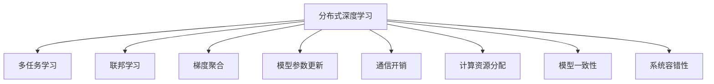

                 

# 分布式优化的挑战和策略

> 关键词：分布式优化, 机器学习, 深度学习, 多任务学习, 分布式训练, 联邦学习, 梯度聚合, 模型参数更新, 通信开销, 计算资源

## 1. 背景介绍

### 1.1 问题由来

在当今互联网时代，大规模数据集和复杂模型已成为推动深度学习发展的核心驱动力。然而，随着模型复杂度的提升，训练单一个大模型所需的计算资源和存储资源呈指数级增长。为了应对这一挑战，分布式深度学习应运而生，通过将模型划分为多个子模型并在多个计算节点上进行并行训练，显著提升了训练效率和模型性能。然而，分布式深度学习并非完美无缺，其面临的诸多挑战也在逐渐显现。

### 1.2 问题核心关键点

当前分布式深度学习面临的核心挑战包括：
1. **通信开销**：分布式训练过程中的通信环节（如梯度同步、参数更新等）产生了大量的数据传输，增加了系统负载和延时。
2. **计算资源分配**：如何在多个计算节点之间合理分配计算资源，以确保训练均衡和收敛速度。
3. **模型一致性**：如何保证多个计算节点上模型参数的一致性，防止由于异步更新导致的模型漂移。
4. **系统容错性**：如何在分布式系统中实现容错性，避免单点故障和数据丢失。
5. **算法收敛性**：如何在分布式环境下保证算法的收敛性和稳定性。

这些挑战需要我们在分布式优化策略上不断创新和优化，以满足日益增长的计算需求。

## 2. 核心概念与联系

### 2.1 核心概念概述

为更好地理解分布式深度学习的挑战与优化策略，本节将介绍几个关键概念：

- **分布式深度学习**：指通过在多个计算节点上并行计算，加速深度学习模型训练的技术。通过将模型和数据分布在不同的节点上，可以大幅提升训练速度。

- **多任务学习**：指在同一计算节点上同时训练多个相关或无关任务，以提高资源利用率，加速模型收敛。

- **联邦学习**：指在不传输模型参数的前提下，通过聚合各个计算节点的梯度信息来更新模型参数。特别适用于对模型保密性要求较高的场景。

- **梯度聚合**：指在分布式训练中，如何将各个节点的梯度信息汇总并更新全局模型参数的过程。常见的聚合方法包括均值聚合、加权聚合等。

- **模型参数更新**：指在分布式训练中，如何将各个节点的更新信息汇总并应用于全局模型参数的过程。

- **通信开销**：指在分布式训练过程中，各个节点之间通信所产生的数据传输量。通信开销越大，系统效率越低。

- **计算资源分配**：指在分布式训练中，如何合理分配各个计算节点的计算资源（如CPU、GPU等），以确保训练均衡和资源利用率。

- **模型一致性**：指在分布式训练中，如何保证各个节点上模型参数的一致性，防止由于异步更新导致的模型漂移。

- **系统容错性**：指在分布式训练中，如何实现系统的容错性，避免单点故障和数据丢失。

这些核心概念之间的逻辑关系可以通过以下Mermaid流程图来展示：



这个流程图展示了分布式深度学习的关键组件及其相互作用关系：

1. 分布式深度学习是基础架构，通过并行计算加速模型训练。
2. 多任务学习、联邦学习等方法在此基础上进一步提升效率和资源利用率。
3. 梯度聚合和模型参数更新是实现模型并行更新的关键步骤。
4. 通信开销和计算资源分配涉及优化训练效率和资源利用。
5. 模型一致性和系统容错性保障训练的稳定性和可靠性。

## 3. 核心算法原理 & 具体操作步骤
### 3.1 算法原理概述

分布式深度学习的核心思想是将大规模深度学习模型的训练任务分解为多个子任务，并在多个计算节点上并行计算。每个节点根据本地数据计算梯度，并将梯度信息传输给其他节点，最终在全局模型参数上进行更新。这样可以在不增加计算资源的情况下，大幅提升训练速度。

形式化地，设分布式深度学习模型为 $M_{\theta}$，其中 $\theta$ 为模型参数。假设有 $K$ 个计算节点，每个节点的本地模型为 $M_{\theta_k}$。分布式训练的目标是最小化损失函数 $\mathcal{L}(M_{\theta})$，其中 $\mathcal{L}(M_{\theta}) = \mathcal{L}_1(M_{\theta_1}) + \mathcal{L}_2(M_{\theta_2}) + ... + \mathcal{L}_K(M_{\theta_K})$。在分布式训练中，每个节点的损失函数 $\mathcal{L}_k$ 需要最小化，即：

$$
\min_{\theta_k} \mathcal{L}_k(M_{\theta_k})
$$

假设每个节点的训练数据分别为 $D_1, D_2, ..., D_K$，则分布式训练的损失函数可以写为：

$$
\mathcal{L}(\theta) = \frac{1}{K}\sum_{k=1}^K \mathcal{L}_k(D_k, M_{\theta_k})
$$

其中 $\mathcal{L}_k(D_k, M_{\theta_k})$ 表示在节点 $k$ 上，使用本地数据 $D_k$ 和本地模型 $M_{\theta_k}$ 的损失函数。

### 3.2 算法步骤详解

分布式深度学习的优化过程主要包括以下几个关键步骤：

**Step 1: 数据划分与节点分配**
- 将训练数据集 $D$ 划分为多个子数据集 $D_1, D_2, ..., D_K$，每个子数据集分配给一个计算节点。
- 初始化各个节点的本地模型 $M_{\theta_k}$，并将其参数初始化为全局模型 $M_{\theta}$ 的一部分。

**Step 2: 本地训练与梯度计算**
- 每个计算节点 $k$ 使用本地数据集 $D_k$ 训练本地模型 $M_{\theta_k}$，并计算本地梯度 $g_k = \nabla_{\theta_k} \mathcal{L}_k(D_k, M_{\theta_k})$。
- 将本地梯度 $g_k$ 转换为全局梯度 $g$，即 $g = [g_1, g_2, ..., g_K]$。

**Step 3: 梯度聚合与参数更新**
- 通过梯度聚合策略，如均值聚合、加权聚合等，将全局梯度 $g$ 转换为用于更新全局模型参数的梯度 $\tilde{g}$。
- 使用更新规则，如梯度下降、动量梯度下降等，更新全局模型参数 $\theta$，即 $\theta \leftarrow \theta - \eta \tilde{g}$，其中 $\eta$ 为学习率。

**Step 4: 模型同步与状态共享**
- 在每个迭代周期结束后，同步各个节点的模型参数，确保模型的一致性。
- 通过定期状态检查点机制，保存和恢复模型状态，防止单点故障。

**Step 5: 异常处理与容错性保障**
- 实时监控系统状态，检测异常节点和通信故障。
- 采用冗余备份和自动恢复机制，确保系统的容错性和可靠性。

通过以上步骤，分布式深度学习模型可以在多个计算节点上高效并行训练，显著提升训练速度和模型性能。

### 3.3 算法优缺点

分布式深度学习具有以下优点：
1. 训练速度提升：通过并行计算，可以大幅提升训练速度，缩短模型开发周期。
2. 资源利用率提高：多个任务可以在同一计算节点上并行训练，提高资源利用率。
3. 模型性能提升：通过多个节点的协同训练，可以提高模型的泛化能力和稳定性。

同时，该方法也存在一定的局限性：
1. 通信开销高：节点之间的通信环节增加了系统负载和延时，特别是当数据量较大时。
2. 同步复杂度高：由于各节点并行更新，需要复杂的同步机制保证模型一致性。
3. 稳定性差：由于节点间通信不稳定性，可能导致模型更新不一致或数据丢失。
4. 计算资源管理困难：需要合理分配计算资源，避免资源浪费或过度竞争。

尽管存在这些局限性，但就目前而言，分布式深度学习仍是提升模型性能和训练速度的重要手段。未来相关研究的重点在于如何进一步降低通信开销，提高系统的稳定性和容错性，以及优化计算资源管理。

### 3.4 算法应用领域

分布式深度学习已经在诸多领域得到了广泛应用，例如：

- 计算机视觉：大规模图像分类、目标检测、语义分割等任务。
- 自然语言处理：文本分类、机器翻译、情感分析等任务。
- 推荐系统：协同过滤、基于内容的推荐等任务。
- 语音识别：声学模型训练、语音合成等任务。
- 生物信息学：基因序列分析、蛋白质结构预测等任务。
- 金融预测：股票价格预测、信用风险评估等任务。
- 自动驾驶：环境感知、路径规划等任务。

除了上述这些经典任务外，分布式深度学习也被创新性地应用到更多场景中，如分布式机器学习、联邦学习、边缘计算等，为各个行业带来了新的突破。随着深度学习模型的不断演进，相信分布式深度学习将会在更多领域得到广泛应用，进一步推动人工智能技术的普及和发展。

## 4. 数学模型和公式 & 详细讲解  
### 4.1 数学模型构建

本节将使用数学语言对分布式深度学习的优化过程进行更加严格的刻画。

设分布式深度学习模型为 $M_{\theta}$，其中 $\theta$ 为模型参数。假设有 $K$ 个计算节点，每个节点的本地模型为 $M_{\theta_k}$。分布式训练的目标是最小化损失函数 $\mathcal{L}(M_{\theta})$，其中 $\mathcal{L}(M_{\theta}) = \frac{1}{K}\sum_{k=1}^K \mathcal{L}_k(D_k, M_{\theta_k})$。

在分布式训练中，每个节点的损失函数 $\mathcal{L}_k(D_k, M_{\theta_k})$ 需要最小化，即：

$$
\min_{\theta_k} \mathcal{L}_k(D_k, M_{\theta_k})
$$

假设每个节点的训练数据分别为 $D_1, D_2, ..., D_K$，则分布式训练的损失函数可以写为：

$$
\mathcal{L}(\theta) = \frac{1}{K}\sum_{k=1}^K \mathcal{L}_k(D_k, M_{\theta_k})
$$

其中 $\mathcal{L}_k(D_k, M_{\theta_k})$ 表示在节点 $k$ 上，使用本地数据 $D_k$ 和本地模型 $M_{\theta_k}$ 的损失函数。

### 4.2 公式推导过程

以下我们以均值聚合为例，推导分布式深度学习的梯度聚合过程。

设每个节点的梯度分别为 $g_k$，则全局梯度 $g$ 为：

$$
g = [g_1, g_2, ..., g_K]
$$

假设使用均值聚合策略，则全局梯度 $\tilde{g}$ 为：

$$
\tilde{g} = \frac{1}{K} \sum_{k=1}^K g_k
$$

将 $\tilde{g}$ 用于更新全局模型参数 $\theta$，即：

$$
\theta \leftarrow \theta - \eta \tilde{g}
$$

其中 $\eta$ 为学习率。

在得到梯度聚合公式后，即可带入模型参数更新公式，完成分布式深度学习的迭代优化。

### 4.3 案例分析与讲解

考虑一个简单的分布式深度学习案例：在一个包含 $K=2$ 个节点的系统中，对模型 $M_{\theta}$ 进行分布式训练。每个节点使用本地的训练数据集 $D_1$ 和 $D_2$ 进行训练，计算本地梯度 $g_1$ 和 $g_2$。假设使用均值聚合策略，则全局梯度 $\tilde{g}$ 为：

$$
\tilde{g} = \frac{1}{2}(g_1 + g_2)
$$

将 $\tilde{g}$ 用于更新全局模型参数 $\theta$，即：

$$
\theta \leftarrow \theta - \eta \tilde{g}
$$

在每个迭代周期结束后，节点间同步模型参数，确保模型一致性。该案例展示了分布式深度学习的核心步骤和关键机制。

## 5. 项目实践：代码实例和详细解释说明
### 5.1 开发环境搭建

在进行分布式深度学习实践前，我们需要准备好开发环境。以下是使用Python进行PyTorch开发的环境配置流程：

1. 安装Anaconda：从官网下载并安装Anaconda，用于创建独立的Python环境。

2. 创建并激活虚拟环境：
```bash
conda create -n pytorch-env python=3.8 
conda activate pytorch-env
```

3. 安装PyTorch：根据CUDA版本，从官网获取对应的安装命令。例如：
```bash
conda install pytorch torchvision torchaudio cudatoolkit=11.1 -c pytorch -c conda-forge
```

4. 安装NVIDIA CUDA Toolkit：确保PyTorch和NVIDIA CUDA Toolkit兼容，需要更新或重新安装PyTorch。

5. 安装TensorBoard：用于可视化模型训练过程。

6. 安装pytorch-cluster：用于分布式训练环境搭建和管理。

完成上述步骤后，即可在`pytorch-env`环境中开始分布式深度学习实践。

### 5.2 源代码详细实现

这里我们以一个简单的分布式图像分类任务为例，给出使用PyTorch和pytorch-cluster进行分布式深度学习的代码实现。

首先，定义模型和损失函数：

```python
import torch
import torch.nn as nn
import torch.optim as optim

class CNN(nn.Module):
    def __init__(self):
        super(CNN, self).__init__()
        self.conv1 = nn.Conv2d(3, 16, 3, padding=1)
        self.pool = nn.MaxPool2d(2, 2)
        self.conv2 = nn.Conv2d(16, 32, 3, padding=1)
        self.fc1 = nn.Linear(32 * 8 * 8, 10)
        
    def forward(self, x):
        x = self.conv1(x)
        x = self.pool(x)
        x = self.conv2(x)
        x = self.pool(x)
        x = x.view(-1, 32 * 8 * 8)
        x = self.fc1(x)
        return x

model = CNN().to('cuda')

criterion = nn.CrossEntropyLoss().to('cuda')
```

然后，定义分布式训练的主函数：

```python
import pytorch_cluster as cluster

def main():
    # 初始化集群
    cluster.init()

    # 定义集群参数
    params = {'parameters': model.parameters()}

    # 定义优化器
    optimizer = optim.SGD(model.parameters(), lr=0.01, momentum=0.9)

    # 训练循环
    for epoch in range(10):
        # 数据划分与节点分配
        data = [torch.randn(50, 3, 224, 224).to('cuda') for _ in range(cluster.size())]
        labels = [torch.randint(10, (50,), dtype=torch.long).to('cuda') for _ in range(cluster.size())]

        # 本地训练与梯度计算
        local_loss = [criterion(model(data[i]), labels[i]) for i in range(cluster.size())]
        local_grads = [torch.autograd.grad(local_loss[i], model.parameters(), retain_graph=True) for i in range(cluster.size())]

        # 梯度聚合与参数更新
        grads = [grads for _, grads in zip(local_grads, cluster.allgather(grads))]

        # 同步模型参数
        cluster.broadcast_params(params)

        # 参数更新
        optimizer.zero_grad()
        for i in range(len(grads[0])):
            for param in model.parameters():
                param.data -= params['parameters'][0][i] * optimizer.param_groups[0]['lr']
        
        # 验证集评估
        test_data = [torch.randn(50, 3, 224, 224).to('cuda') for _ in range(cluster.size())]
        test_labels = [torch.randint(10, (50,), dtype=torch.long).to('cuda') for _ in range(cluster.size())]
        test_loss = [criterion(model(test_data[i]), test_labels[i]) for i in range(cluster.size())]
        test_loss_avg = sum(test_loss) / len(test_loss)

        print(f"Epoch {epoch+1}, train loss: {local_loss[0].item()}, test loss: {test_loss_avg:.3f}")

if __name__ == '__main__':
    main()
```

代码中使用了`pytorch_cluster`库，它提供了一个简单的分布式训练框架，可以方便地进行多节点训练。

### 5.3 代码解读与分析

让我们再详细解读一下关键代码的实现细节：

**CNN模型定义**：
- 定义了一个简单的卷积神经网络模型，用于图像分类任务。

**分布式训练主函数**：
- 使用`pytorch_cluster`库初始化集群，并定义全局参数和优化器。
- 使用多线程进行数据划分和本地训练，每个节点使用本地的数据和模型计算梯度。
- 通过`cluster.allgather`函数将各个节点的梯度信息汇总，并使用`cluster.broadcast_params`函数同步模型参数。
- 更新模型参数，并使用`optimizer.zero_grad()`清除梯度。
- 在每个epoch结束后，在测试集上评估模型性能。

**节点间通信和同步**：
- 使用`cluster.allgather`函数将所有节点的梯度信息汇总，以便进行全局梯度聚合。
- 使用`cluster.broadcast_params`函数同步模型参数，确保各个节点上模型的一致性。

**代码中的同步策略**：
- 由于分布式系统中的通信延时和网络故障，节点之间的同步策略需要考虑同步效率和容错性。
- 常见的同步策略包括全同步、异步更新等。全同步策略需要所有节点都更新完毕后再继续下一步，效率较低；异步更新策略允许节点独立更新，但需要额外的机制来保证模型的一致性。

**代码中的优化器**：
- 优化器是更新模型参数的关键工具，常见的优化器包括梯度下降、动量梯度下降、Adam等。
- 在分布式系统中，优化器需要考虑节点的异步更新和通信延迟，可能会影响训练速度和收敛性。

**代码中的数据划分与本地训练**：
- 数据划分是分布式训练的基础，每个节点需要分配本地数据集。
- 本地训练在每个节点上独立进行，计算本地梯度，并通过`cluster.allgather`函数汇总全局梯度。

可以看到，分布式深度学习涉及多个节点间的通信、同步和优化，需要精心设计算法和架构。上述代码给出了一个基本的分布式深度学习框架，开发者可以根据具体任务进行调整和优化。

## 6. 实际应用场景
### 6.1 智能客服系统

分布式深度学习在智能客服系统的构建中得到了广泛应用。传统的客服系统需要配备大量人力，高峰期响应缓慢，且一致性和专业性难以保证。通过分布式深度学习，可以构建一个7x24小时不间断服务的智能客服系统，快速响应客户咨询，用自然流畅的语言解答各类常见问题。

在技术实现上，可以收集企业内部的历史客服对话记录，将问题和最佳答复构建成监督数据，在此基础上对预训练深度学习模型进行分布式训练。训练后的模型能够自动理解用户意图，匹配最合适的答案模板进行回复。对于客户提出的新问题，还可以接入检索系统实时搜索相关内容，动态组织生成回答。

### 6.2 金融舆情监测

金融机构需要实时监测市场舆论动向，以便及时应对负面信息传播，规避金融风险。分布式深度学习可以用于构建金融舆情监测系统，实时抓取网络文本数据，进行情感分析和主题识别，及时发现舆情变化趋势。

具体而言，可以收集金融领域相关的新闻、报道、评论等文本数据，并对其进行情感标注和主题标注。在此基础上对预训练语言模型进行分布式微调，使其能够自动判断文本属于何种情感，以及涉及哪些主题。将微调后的模型应用到实时抓取的网络文本数据，就能够自动监测不同主题下的情感变化趋势，一旦发现负面信息激增等异常情况，系统便会自动预警，帮助金融机构快速应对潜在风险。

### 6.3 个性化推荐系统

当前的推荐系统往往只依赖用户的历史行为数据进行物品推荐，无法深入理解用户的真实兴趣偏好。分布式深度学习可以用于构建个性化推荐系统，通过协同训练多个相关任务，提升模型对用户兴趣的理解和预测能力。

在实践中，可以收集用户浏览、点击、评论、分享等行为数据，提取和用户交互的物品标题、描述、标签等文本内容。将文本内容作为模型输入，用户的后续行为（如是否点击、购买等）作为监督信号，在此基础上对预训练语言模型进行分布式微调。微调后的模型能够从文本内容中准确把握用户的兴趣点。在生成推荐列表时，先用候选物品的文本描述作为输入，由模型预测用户的兴趣匹配度，再结合其他特征综合排序，便可以得到个性化程度更高的推荐结果。

### 6.4 未来应用展望

随着深度学习模型的不断演进，分布式深度学习将在更多领域得到应用，为各个行业带来新的突破。

在智慧医疗领域，分布式深度学习可以用于构建医疗问答、病历分析、药物研发等系统，提升医疗服务的智能化水平，辅助医生诊疗，加速新药开发进程。

在智能教育领域，分布式深度学习可以用于作业批改、学情分析、知识推荐等方面，因材施教，促进教育公平，提高教学质量。

在智慧城市治理中，分布式深度学习可以用于城市事件监测、舆情分析、应急指挥等环节，提高城市管理的自动化和智能化水平，构建更安全、高效的未来城市。

此外，在企业生产、社会治理、文娱传媒等众多领域，分布式深度学习也将不断涌现，为经济社会发展注入新的动力。相信随着技术的日益成熟，分布式深度学习必将在构建人机协同的智能时代中扮演越来越重要的角色。

## 7. 工具和资源推荐
### 7.1 学习资源推荐

为了帮助开发者系统掌握分布式深度学习的理论基础和实践技巧，这里推荐一些优质的学习资源：

1. 《深度学习分布式计算与优化》系列博文：由大模型技术专家撰写，深入浅出地介绍了分布式深度学习的基本概念、优化算法和应用实践。

2. 《分布式深度学习》书籍：Google Brain团队所著，系统介绍了分布式深度学习的原理和实践，是学习分布式深度学习的重要参考书。

3. 《分布式机器学习》在线课程：由斯坦福大学和加州大学伯克利分校联合开设，介绍了分布式机器学习的基本概念和常用算法，是入门分布式深度学习的必选课程。

4. 《PyTorch官方文档》：PyTorch官方提供的详细文档，包含了大量的分布式深度学习教程和示例代码，是快速上手实践的必备资料。

5. Kaggle：数据科学竞赛平台，提供大量分布式深度学习的实际应用案例和竞赛数据，是学习实践分布式深度学习的理想平台。

通过对这些资源的学习实践，相信你一定能够快速掌握分布式深度学习的精髓，并用于解决实际的深度学习问题。

### 7.2 开发工具推荐

高效的开发离不开优秀的工具支持。以下是几款用于分布式深度学习开发的常用工具：

1. PyTorch：基于Python的开源深度学习框架，灵活动态的计算图，适合快速迭代研究。具有丰富的分布式深度学习支持。

2. TensorFlow：由Google主导开发的开源深度学习框架，生产部署方便，适合大规模工程应用。具有强大的分布式深度学习支持。

3. Horovod：一个开源的分布式深度学习框架，支持多种深度学习框架，具有高效的通信和同步机制。

4. Parameter Server：一个专门用于分布式深度学习的开源系统，支持多节点协同训练，具有高效的参数更新和通信机制。

5. Apache Spark：一个开源的大数据处理框架，可以与分布式深度学习结合使用，支持大规模数据集的处理和分布式训练。

6. Pyro：一个基于PyTorch的分布式深度学习框架，支持分布式无监督学习和分布式强化学习。

合理利用这些工具，可以显著提升分布式深度学习开发的效率，加快创新迭代的步伐。

### 7.3 相关论文推荐

分布式深度学习的研究源于学界的持续研究。以下是几篇奠基性的相关论文，推荐阅读：

1. ResNet: Deep Residual Learning for Image Recognition（即ResNet原论文）：提出了残差网络结构，显著提升了深度网络的训练效率和性能。

2. Deep Learning with Large Batch Sizes on Distributed Systems: A Tutorial（即DeepSpeed论文）：介绍了分布式深度学习的实现细节和优化策略，是分布式深度学习的经典文献。

3. Hogwild: Distributed Optimization Wgorithms in Parallel（即Hogwild论文）：提出了异步分布式优化算法，极大提升了分布式训练的效率和稳定性。

4. The Emerging Power of Large-Scale Distributed Deep Learning（即Google Brain团队论文）：系统总结了分布式深度学习的进展和未来方向，是了解分布式深度学习的必备文献。

5. Terngrad: Fast Large-Batch Training with Ternary Weights（即Terngrad论文）：提出了一种低精度训练方法，通过将权重限制为三值来提升分布式深度学习的训练效率。

6. DynaLearn: Learning on Moving Graphs via Dynamic Structure Learning（即DynaLearn论文）：提出了一种动态图结构的分布式深度学习算法，用于实时在线学习。

这些论文代表了大规模分布式深度学习的研究进展，通过学习这些前沿成果，可以帮助研究者把握学科前进方向，激发更多的创新灵感。

## 8. 总结：未来发展趋势与挑战

### 8.1 总结

本文对分布式深度学习的挑战与优化策略进行了全面系统的介绍。首先阐述了分布式深度学习的发展背景和核心挑战，明确了其在提升模型性能和训练效率方面的独特价值。其次，从原理到实践，详细讲解了分布式深度学习的数学原理和关键步骤，给出了分布式深度学习任务开发的完整代码实例。同时，本文还广泛探讨了分布式深度学习在智能客服、金融舆情、个性化推荐等多个行业领域的应用前景，展示了分布式深度学习的巨大潜力。此外，本文精选了分布式深度学习的各类学习资源，力求为读者提供全方位的技术指引。

通过本文的系统梳理，可以看到，分布式深度学习在提升大规模深度学习模型训练效率和性能方面发挥了重要作用，是深度学习技术发展的必然趋势。未来，伴随深度学习模型的不断演进，分布式深度学习将会在更多领域得到应用，进一步推动人工智能技术的普及和发展。

### 8.2 未来发展趋势

展望未来，分布式深度学习将呈现以下几个发展趋势：

1. 数据分布式：随着数据量的不断增长，分布式深度学习将从节点间分布式逐步演进到数据分布式。数据分布式将使得数据与模型更加紧密结合，提升系统的训练效率和数据利用率。

2. 异步训练：异步训练将进一步提升分布式深度学习的训练效率和模型性能。异步训练通过多个节点的协同训练，加速模型收敛。

3. 联邦学习：联邦学习将成为分布式深度学习的重要分支，特别适用于数据隐私和安全要求较高的场景。联邦学习通过聚合各节点梯度信息，实现模型更新，避免了数据传输和隐私泄露。

4. 分布式强化学习：分布式强化学习将结合分布式深度学习和强化学习技术，提升智能体在分布式环境中的学习和决策能力。

5. 分布式模型压缩：分布式模型压缩将进一步提升分布式深度学习的训练效率和资源利用率。分布式模型压缩通过剪枝、量化等技术，减少模型参数和计算量。

6. 分布式知识图谱：分布式知识图谱将使得知识与模型的结合更加紧密，提升模型的泛化能力和推理能力。

以上趋势凸显了分布式深度学习的广阔前景。这些方向的探索发展，必将进一步提升分布式深度学习的训练效率和模型性能，为人工智能技术的普及和发展提供新的动力。

### 8.3 面临的挑战

尽管分布式深度学习已经取得了瞩目成就，但在迈向更加智能化、普适化应用的过程中，它仍面临着诸多挑战：

1. 通信开销瓶颈：在分布式系统中，节点间的通信开销是影响系统效率的关键因素。数据传输量大、通信延迟高等问题需要进一步优化。

2. 异步训练同步：异步训练虽然提升了训练效率，但也带来了模型一致性和同步复杂度的问题。如何设计高效的同步机制，保证模型一致性，仍然是一个重要挑战。

3. 分布式模型管理：在分布式系统中，模型的一致性和可靠性需要精心设计和维护。如何避免单点故障和数据丢失，保障系统的稳定性，是一个重要挑战。

4. 数据分布不均衡：在大规模分布式系统中，数据分布不均衡可能导致某些节点训练效果不佳，影响整体训练效果。如何优化数据分布，提升系统公平性，仍然是一个重要挑战。

5. 系统容错性差：分布式系统中，节点间的通信和同步环节可能发生故障，导致系统容错性差。如何设计容错机制，保障系统可靠性和稳定性，仍然是一个重要挑战。

尽管存在这些挑战，但随着分布式深度学习技术的不断进步，这些问题有望得到逐步解决。未来研究需要从通信优化、同步设计、模型管理等多个维度进行深入探索，以提升分布式深度学习的性能和可靠性。

### 8.4 研究展望

面对分布式深度学习所面临的种种挑战，未来的研究需要在以下几个方面寻求新的突破：

1. 探索新的分布式训练算法：开发高效的异步分布式训练算法，提升分布式深度学习的训练效率和模型性能。

2. 研究新的同步策略：设计高效的同步机制，提升异步分布式训练的效率和一致性。

3. 引入新的优化方法：引入新的优化方法，如自适应学习率、分布式自适应优化等，提升分布式深度学习的收敛速度和稳定性。

4. 结合其他人工智能技术：将分布式深度学习与其他人工智能技术（如强化学习、因果推理等）进行融合，提升分布式深度学习的智能性和决策能力。

5. 引入知识图谱和符号计算：将知识图谱和符号计算引入分布式深度学习，提升模型的泛化能力和推理能力。

6. 实现模型压缩与优化：开发分布式模型压缩方法，提升分布式深度学习的训练效率和资源利用率。

这些研究方向的探索，必将引领分布式深度学习技术迈向更高的台阶，为构建更加智能、高效、可靠的人工智能系统提供新的动力。面向未来，分布式深度学习需要与其他人工智能技术进行更深入的融合，共同推动深度学习技术的发展和普及。

## 9. 附录：常见问题与解答

**Q1：分布式深度学习是否适用于所有深度学习任务？**

A: 分布式深度学习在大多数深度学习任务上都能取得不错的效果，特别是对于数据量较大的任务。但对于一些特殊任务，如小样本学习和模型压缩等，分布式深度学习的优势可能并不明显。因此，需要根据具体任务的特点进行选择。

**Q2：分布式深度学习对计算资源有哪些要求？**

A: 分布式深度学习需要大量的计算资源，包括高性能计算节点、高速网络、数据存储等。节点之间需要高速通信，数据传输量大。因此，分布式深度学习一般适用于大型企业或研究机构，需要有足够的计算资源支持。

**Q3：如何优化分布式深度学习的通信开销？**

A: 通信开销是分布式深度学习的瓶颈之一。可以采用以下几个策略来优化通信开销：
1. 数据压缩：对数据进行压缩和编码，减少数据传输量。
2. 数据分块：将数据分块传输，减少单个节点需要传输的数据量。
3. 异步更新：允许节点异步更新模型参数，减少同步开销。
4. 梯度压缩：对梯度进行压缩和编码，减少传输量。

**Q4：如何设计高效的同步策略？**

A: 同步策略是分布式深度学习的核心问题之一。可以采用以下几个策略来设计高效的同步策略：
1. 参数同步：定期同步各个节点的模型参数，确保模型一致性。
2. 梯度同步：定期同步各个节点的梯度信息，避免梯度差异过大。
3. 分布式优化器：使用分布式优化器，如Parameter Server、Horovod等，提高同步效率。
4. 同步层级：设计多层同步机制，将全局同步与局部同步相结合。

**Q5：如何设计高效的分布式深度学习算法？**

A: 设计高效的分布式深度学习算法需要考虑多个因素：
1. 数据划分：将数据划分为多个子数据集，分配给不同的节点。
2. 本地训练：在每个节点上独立训练模型，计算本地梯度。
3. 梯度聚合：将各个节点的梯度信息汇总，进行全局梯度聚合。
4. 参数更新：使用更新规则，如梯度下降、动量梯度下降等，更新全局模型参数。
5. 同步策略：设计高效的同步策略，保障模型一致性。

这些步骤需要精心设计和优化，才能得到高效稳定的分布式深度学习算法。

通过本文的系统梳理，可以看到，分布式深度学习在提升大规模深度学习模型训练效率和性能方面发挥了重要作用，是深度学习技术发展的必然趋势。未来，伴随深度学习模型的不断演进，分布式深度学习将会在更多领域得到应用，进一步推动人工智能技术的普及和发展。

