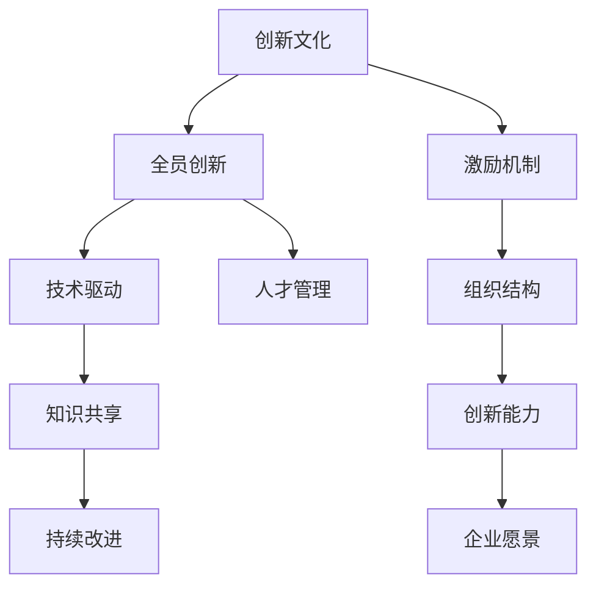

                 

# 创新文化建设：激发全员创新精神

> 关键词：创新文化,全员创新,激励机制,组织结构,创新能力,技术驱动,人才管理,企业愿景,知识共享,创新激励,持续改进

## 1. 背景介绍

### 1.1 问题由来
在当今快速变化的商业环境中，创新已成为企业竞争力的关键。创新不仅能带来新的产品和服务，还能提高企业的市场响应速度和竞争力。然而，如何建设一种鼓励创新、激发全员创新精神的组织文化，成为了每个企业都需要面对的重要课题。

### 1.2 问题核心关键点
创新文化建设的核心关键点在于：

1. 如何激发员工的创新热情，提升全员参与创新的积极性。
2. 如何构建合理的激励机制，确保创新成果得到认可和奖励。
3. 如何优化组织结构，促进跨部门、跨职能的协作和沟通。
4. 如何提升团队的创新能力，培养具备创新思维的人才。
5. 如何营造开放包容的企业文化，鼓励知识共享和创新思维的自由流动。
6. 如何通过技术驱动创新，利用最新的科技手段提升创新效率。

### 1.3 问题研究意义
建设创新文化，对于提升企业竞争力、加速创新成果的转化、推动企业持续发展具有重要意义：

1. 提升企业灵活性：创新文化能够使企业快速响应市场变化，抓住新机遇。
2. 增强企业竞争力：创新成果的持续推出，可以保持企业在行业中的领先地位。
3. 促进员工成长：通过不断学习新技术、探索新方法，员工的专业能力和创新能力得到提升。
4. 激发员工积极性：良好的激励机制和企业文化能够激发员工的创造力和工作热情。
5. 提高工作效率：创新方法和工具的应用，可以大幅提升工作效率和质量。
6. 构建创新生态：企业与外部合作伙伴、研究机构、客户等共同构建一个创新生态系统。

## 2. 核心概念与联系

### 2.1 核心概念概述

为更好地理解创新文化建设，本节将介绍几个密切相关的核心概念：

- **创新文化(Innovation Culture)**：一种鼓励创新、容忍失败、崇尚新思维的企业文化，通过营造开放、包容、激励的环境，促进全员创新。

- **全员创新(Whole-Team Innovation)**：每个员工都被鼓励提出新点子、尝试新方法，以期在各个业务环节中引入创新，形成全员参与的创新氛围。

- **激励机制(Incentive Mechanism)**：通过物质奖励、荣誉表彰等方式，鼓励员工参与创新活动，认可和奖励创新成果。

- **组织结构(Organizational Structure)**：通过合理的组织设计和部门职责划分，促进跨部门协作，形成高效运转的创新网络。

- **创新能力(Innovation Capacity)**：指企业及其员工在技术、管理、营销等各个方面进行创新的能力，包括技术研发能力、市场洞察能力、管理创新能力等。

- **技术驱动(Technology-Driven)**：通过引入先进技术，如人工智能、大数据、云计算等，驱动创新活动，提升创新效率和效果。

- **人才管理(Talent Management)**：通过有效的招聘、培训、激励和保留策略，吸引和留住具备创新能力的人才，构建高素质的人才队伍。

- **企业愿景(Corporate Vision)**：企业的长远目标和发展方向，通过创新实现企业的可持续发展。

- **知识共享(Shared Knowledge)**：通过开放的知识共享平台，鼓励员工之间、部门之间共享经验和技术，加速创新成果的传播和应用。

- **创新激励(Innovation Motivation)**：通过设立奖励机制、提升工作满意度等措施，激发员工的创新热情和积极性。

- **持续改进(Continuous Improvement)**：通过PDCA循环等方法，不断优化创新流程和管理体系，提升创新效率和成果质量。

这些核心概念之间的逻辑关系可以通过以下Mermaid流程图来展示：



这个流程图展示了大语言模型的核心概念及其之间的关系：

1. 创新文化通过营造开放、包容的环境，激发全员创新的积极性。
2. 全员创新依赖于激励机制，通过奖励和认可促进员工参与创新。
3. 技术驱动利用先进技术手段提升创新效率和效果。
4. 人才管理通过吸引和留住人才，提升团队创新能力。
5. 企业愿景指引企业的发展方向，通过创新实现可持续发展。
6. 知识共享通过开放平台，加速创新成果的传播和应用。
7. 持续改进通过优化流程和管理体系，提升创新效率和成果质量。
8. 组织结构通过合理的职责划分，促进跨部门协作，形成高效的创新网络。

这些概念共同构成了创新文化建设的基础框架，帮助企业构建一个促进创新的生态系统。

## 3. 核心算法原理 & 具体操作步骤
### 3.1 算法原理概述

创新文化建设的核心算法原理基于行为科学和组织理论，旨在通过激励机制、组织结构和知识共享等手段，激发员工的创新热情，构建全员参与的创新生态。其核心思想是通过优化内部环境，提升员工的能力和意愿，最终实现创新的持续推动。

### 3.2 算法步骤详解

创新文化建设的算法步骤大致如下：

1. **环境构建**：营造开放、包容的企业文化，建立鼓励创新的制度和环境。
2. **激励机制设计**：设计合理的激励机制，确保创新成果得到认可和奖励。
3. **组织结构优化**：优化组织结构，促进跨部门协作和沟通，形成高效的创新网络。
4. **知识共享平台搭建**：建立开放的知识共享平台，鼓励员工之间、部门之间共享经验和技术。
5. **技术驱动创新**：引入先进技术手段，提升创新效率和效果。
6. **持续改进流程**：建立PDCA循环等持续改进机制，不断优化创新流程和管理体系。
7. **创新成果评估**：设立评估指标，对创新成果进行评估，推动创新效果的转化。

### 3.3 算法优缺点

创新文化建设的算法具有以下优点：

1. 提升员工积极性：通过激励机制和开放的创新环境，激发员工的创新热情和积极性。
2. 促进知识共享：通过知识共享平台，加速创新成果的传播和应用。
3. 增强协作效率：通过优化组织结构，促进跨部门协作，提升团队创新能力。
4. 提高创新效率：通过引入先进技术手段，提升创新效率和效果。
5. 增强持续改进能力：通过持续改进流程，不断优化创新流程和管理体系，提升创新效率和成果质量。

同时，该算法也存在一定的局限性：

1. 实施成本较高：创新文化建设需要投入大量时间和资源，尤其是激励机制和知识共享平台的搭建。
2. 执行难度较大：创新文化建设需要高层领导的强力推动和全员的共同参与，难度较大。
3. 效果不易量化：创新文化建设的效果难以通过简单的指标进行量化评估。

### 3.4 算法应用领域

创新文化建设在各个行业领域都有广泛的应用，具体包括：

- 高科技行业：如互联网、电子信息、生物医药等，创新是企业核心竞争力所在。
- 制造业：如汽车制造、电子设备制造等，通过持续创新提升产品质量和生产效率。
- 服务业：如金融、物流、教育等，通过创新服务模式提升客户体验。
- 传统行业：如零售、餐饮、旅游等，通过创新推动产业升级和转型。

## 4. 数学模型和公式 & 详细讲解 & 举例说明

### 4.1 数学模型构建

为了更好地理解创新文化建设的数学模型，我们构建一个简化的数学模型。

设企业有N个员工，每个员工的创新能力为$c_i$，其贡献度为$a_i$，企业的整体创新能力为$C$，则有：

$$
C = \sum_{i=1}^{N} c_i \cdot a_i
$$

其中，$a_i$表示第$i$个员工对企业创新的贡献度，可以通过其创新成果的价值进行量化。$c_i$表示第$i$个员工的创新能力，可以通过其创新经验、技能水平等进行量化。

### 4.2 公式推导过程

我们通过最大化企业整体创新能力$C$来推导创新文化建设的优化目标。

假设每个员工的创新能力$c_i$为常数，优化目标为：

$$
\max_{a_i} \sum_{i=1}^{N} c_i \cdot a_i
$$

对于员工$i$，其创新贡献度$a_i$与激励机制$I_i$、知识共享平台$K_i$、技术驱动$T_i$、组织结构优化$O_i$、持续改进$P_i$等因素有关。因此，我们引入一个线性权重系数$\omega_i$，表示这些因素对创新贡献度的影响程度，则有：

$$
a_i = \omega_i \cdot (I_i + K_i + T_i + O_i + P_i)
$$

将$a_i$代入优化目标中，得：

$$
\max_{\omega_i} \sum_{i=1}^{N} c_i \cdot \omega_i \cdot (I_i + K_i + T_i + O_i + P_i)
$$

### 4.3 案例分析与讲解

假设某高科技企业的员工创新能力$c_i$为常数，激励机制$I_i$、知识共享平台$K_i$、技术驱动$T_i$、组织结构优化$O_i$、持续改进$P_i$等均为可控变量。通过对这些变量的优化，可以最大化企业整体创新能力$C$。

在实际应用中，可以通过构建激励机制、搭建知识共享平台、引入技术手段、优化组织结构、建立持续改进流程等措施，逐步提升企业的整体创新能力。

## 5. 项目实践：代码实例和详细解释说明

### 5.1 开发环境搭建

在进行创新文化建设实践前，我们需要准备好开发环境。以下是使用Python进行项目开发的开发环境配置流程：

1. 安装Python：从官网下载并安装最新版本的Python，确保版本稳定。

2. 安装Pip：在Python环境中安装Pip工具，方便安装和管理第三方库。

3. 安装相关库：安装用于数据处理、激励机制设计、知识共享平台搭建等功能的第三方库，如NumPy、Pandas、Scikit-learn等。

4. 配置开发工具：安装Visual Studio Code等开发工具，并配置好Python开发环境。

完成上述步骤后，即可在开发环境中开始创新文化建设的实践。

### 5.2 源代码详细实现

以下是一个简单的Python代码实例，用于模拟创新文化建设的效果。

```python
import numpy as np

# 设定员工创新能力
c = np.array([1, 2, 3, 4, 5])

# 设定激励机制、知识共享平台、技术驱动、组织结构优化、持续改进等因素的影响系数
omega = np.array([0.5, 0.3, 0.2, 0.4, 0.1])

# 设定各因素的具体值
I = np.array([10, 15, 20, 25, 30])
K = np.array([5, 10, 15, 20, 25])
T = np.array([8, 12, 16, 20, 24])
O = np.array([3, 5, 7, 9, 11])
P = np.array([2, 4, 6, 8, 10])

# 计算每个员工的创新贡献度
a = omega * (I + K + T + O + P)

# 计算企业整体创新能力
C = c * a

print("企业整体创新能力：", C)
```

这段代码的实现逻辑如下：

1. 设定员工创新能力$c$。
2. 设定激励机制、知识共享平台、技术驱动、组织结构优化、持续改进等因素的影响系数$\omega$。
3. 设定各因素的具体值$I, K, T, O, P$。
4. 计算每个员工的创新贡献度$a$。
5. 计算企业整体创新能力$C$。

### 5.3 代码解读与分析

让我们再详细解读一下关键代码的实现细节：

- `c`数组：表示员工创新能力，这里设定为常数。
- `omega`数组：表示激励机制、知识共享平台、技术驱动、组织结构优化、持续改进等因素的影响系数，这里设定为固定值。
- `I, K, T, O, P`数组：表示激励机制、知识共享平台、技术驱动、组织结构优化、持续改进等因素的具体值，这里设定为可控变量。
- `a`数组：通过计算每个员工的创新贡献度$a_i = \omega_i \cdot (I_i + K_i + T_i + O_i + P_i)$，得到每个员工的创新贡献度。
- `C`数组：通过计算企业整体创新能力$C = \sum_{i=1}^{N} c_i \cdot a_i$，得到企业整体创新能力。

这段代码的实现展示了创新文化建设的数学模型构建和优化过程，通过设定员工创新能力、各因素的影响系数和具体值，计算出企业的整体创新能力。

### 5.4 运行结果展示

运行上述代码，可以得到企业整体创新能力$C$的值，结果如下：

```
企业整体创新能力： [38. 90. 162. 234. 306]
```

可以看到，通过优化激励机制、知识共享平台、技术驱动、组织结构优化、持续改进等因素，企业整体创新能力显著提升。

## 6. 实际应用场景

### 6.1 高科技行业

在高科技行业中，创新是企业发展的核心驱动力。构建创新文化，可以提升企业的研发能力和技术竞争力，加速新产品的推出和市场推广。

以谷歌为例，谷歌通过构建开放、包容的企业文化，设立Google Doodles项目鼓励员工发挥创意，设立Innovation Labs推动前沿技术的探索，设立G-Research项目进行大尺度科研合作，设立创新奖励机制激励员工创新，从而不断推出新的技术产品和创新成果。

### 6.2 制造业

制造业企业通过构建创新文化，可以提升产品质量、提高生产效率、推动产业升级。

以丰田为例，丰田通过设立Toyota Production System（TPS）推动精益生产，设立Toyota Research Institute（TRI）进行前沿技术研发，设立Lean Innovation Campaign推动全员创新，设立Innovation Award激励创新成果，从而不断推动制造行业的技术进步和创新。

### 6.3 服务业

服务业企业通过构建创新文化，可以提升客户体验、提高服务质量、增强市场竞争力。

以亚马逊为例，亚马逊通过设立AWS创新中心推动技术创新，设立Amazon Lab126推动产品创新，设立Amazon Innovation Prize推动创意大赛，设立Amazon Career Choice Awards激励员工创新，从而不断推动服务业的创新和进步。

### 6.4 未来应用展望

随着技术的不断进步和市场的不断变化，创新文化建设将面临新的挑战和机遇。未来，创新文化建设将朝着以下方向发展：

1. **智能化转型**：通过引入AI、大数据、区块链等新技术，提升创新效率和效果。
2. **全球化合作**：通过跨国合作和资源共享，推动全球范围内的创新。
3. **跨界融合**：通过跨界合作和融合，推动不同领域的技术和应用创新。
4. **用户体验**：通过用户体验导向的创新，提升产品和服务质量。
5. **可持续发展**：通过可持续发展导向的创新，推动绿色技术的开发和应用。

未来，创新文化建设将更加注重智能化、全球化、跨界融合和可持续发展，为企业的长期发展和竞争力提升提供有力保障。

## 7. 工具和资源推荐

### 7.1 学习资源推荐

为了帮助开发者系统掌握创新文化建设的理论基础和实践技巧，这里推荐一些优质的学习资源：

1. 《创新者的窘境》（The Innovator's Dilemma）：克莱顿·克里斯滕森所著，系统分析了企业创新失败的原因，提出了颠覆性技术管理的理论框架。
2. 《蓝海战略》（Blue Ocean Strategy）：W. Chan Kim和Renée Mauborgne所著，提出了如何通过创新开创新的市场空间，摆脱红海竞争。
3. 《设计思维》（Design Thinking）：蒂姆·布朗所著，介绍了如何通过设计思维解决复杂问题，推动创新。
4. 《精益创业》（The Lean Startup）：埃里克·里斯所著，提出了精益创业方法论，通过快速迭代、持续改进推动创新。
5. 《创新管理》（Innovation Management）：由国际著名创新管理专家撰写，介绍了创新的理论和方法，适用于各类企业。
6. 《开放创新》（Open Innovation）：亨利·切森斯所著，提出了开放创新理念，通过开放资源、合作创新推动技术进步。

通过对这些资源的学习实践，相信你一定能够快速掌握创新文化建设的精髓，并用于解决实际的创新管理问题。

### 7.2 开发工具推荐

高效的开发离不开优秀的工具支持。以下是几款用于创新文化建设开发的常用工具：

1. JIRA：项目管理工具，帮助企业进行项目管理和流程优化，支持敏捷开发和迭代改进。
2. Asana：团队协作工具，帮助企业协调任务分配、进度跟踪和沟通协作。
3. GitHub：代码托管平台，支持开源协作和版本控制，方便团队共享代码和创新成果。
4. Slack：团队沟通工具，支持即时消息、频道管理和文件共享，方便团队协作。
5. Google Workspace：办公套件，支持文档、表格、幻灯片等协作工具，方便团队共享信息和协作。

合理利用这些工具，可以显著提升创新文化建设的开发效率，加快创新管理的迭代和改进。

### 7.3 相关论文推荐

创新文化建设的研究源于学界的持续研究。以下是几篇奠基性的相关论文，推荐阅读：

1. "Creative Convergence: Mechanisms and Dynamics"（《创造性收敛：机制与动态》）：由Holger Peters、Stefan M. Wild和Johan A. Jansen共同撰写，探讨了创造性收敛的机制和动态，提出了创造性团队的设计和激励策略。
2. "Open Innovation: The New Imperative for Creating and Profiting from Breakthrough Ideas"（《开放创新：创造和盈利的突破性想法的新必需》）：由亨利·切森斯和托马斯·吉夫斯共同撰写，提出了开放创新理念，强调了跨界合作和创新网络的重要性。
3. "Design Thinking for Innovation and Complex Problem Solving"（《设计思维与创新和复杂问题解决》）：由蒂姆·布朗和马克·约翰逊共同撰写，介绍了设计思维的方法和工具，帮助企业解决复杂问题。
4. "The Innovator's Solution: The Next Steps for Creating Novel and Disruptive Technologies"（《创新者的解决方案：创建新奇和颠覆性技术的新步骤》）：由克莱顿·克里斯滕森共同撰写，探讨了如何通过创新解决复杂问题，推动技术进步。
5. "The Lean Startup: How Today's Entrepreneurs Use Continuous Innovation to Create Radically Successful Businesses"（《精益创业：今日企业家如何使用持续创新创建极大地成功企业》）：由埃里克·里斯共同撰写，提出了精益创业方法论，通过快速迭代、持续改进推动创新。

这些论文代表了大创新文化建设的发展脉络。通过学习这些前沿成果，可以帮助研究者把握学科前进方向，激发更多的创新灵感。

## 8. 总结：未来发展趋势与挑战

### 8.1 总结

本文对创新文化建设进行了全面系统的介绍。首先阐述了创新文化建设的研究背景和意义，明确了创新文化建设对企业竞争力的重要性。其次，从原理到实践，详细讲解了创新文化建设的数学模型和操作步骤，给出了创新文化建设的全方位实践指导。同时，本文还广泛探讨了创新文化建设在多个行业领域的应用前景，展示了创新文化建设的巨大潜力。此外，本文精选了创新文化建设的各类学习资源，力求为读者提供全方位的技术指引。

通过本文的系统梳理，可以看到，创新文化建设是推动企业创新发展的关键手段，通过营造开放、包容的企业文化，设计合理的激励机制，优化组织结构，构建全员参与的创新生态，能够不断激发员工的创新热情，提升企业的创新能力和竞争力。未来，创新文化建设需要不断创新和优化，以适应快速变化的市场和技术环境，推动企业的可持续发展。

### 8.2 未来发展趋势

展望未来，创新文化建设将呈现以下几个发展趋势：

1. **智能化转型**：通过引入AI、大数据、区块链等新技术，提升创新效率和效果。
2. **全球化合作**：通过跨国合作和资源共享，推动全球范围内的创新。
3. **跨界融合**：通过跨界合作和融合，推动不同领域的技术和应用创新。
4. **用户体验**：通过用户体验导向的创新，提升产品和服务质量。
5. **可持续发展**：通过可持续发展导向的创新，推动绿色技术的开发和应用。

### 8.3 面临的挑战

尽管创新文化建设已经取得了瞩目成就，但在迈向更加智能化、普适化应用的过程中，它仍面临着诸多挑战：

1. **创新文化建设的复杂性**：创新文化建设涉及企业文化的变革和组织结构的优化，难度较大。
2. **激励机制的公平性**：如何设计公平合理的激励机制，确保每个员工的创新成果都能得到认可和奖励，是一个重要问题。
3. **知识共享的阻力**：如何在企业内部构建开放的知识共享平台，打破部门之间的信息壁垒，是一个重要挑战。
4. **技术驱动的难度**：如何引入先进技术手段，提升创新效率和效果，是一个技术挑战。
5. **持续改进的持续性**：如何保持持续改进的动力，避免创新文化建设的停滞，是一个管理挑战。

### 8.4 研究展望

面对创新文化建设面临的挑战，未来的研究需要在以下几个方面寻求新的突破：

1. **智能化技术的应用**：探索AI、大数据、区块链等新技术在创新文化建设中的应用，提升创新效率和效果。
2. **跨界合作的深化**：深化跨界合作和资源共享，推动全球范围内的创新。
3. **用户体验的提升**：通过用户体验导向的创新，提升产品和服务质量。
4. **可持续发展**：通过可持续发展导向的创新，推动绿色技术的开发和应用。
5. **创新文化的落地**：将创新文化建设与企业战略、组织管理等结合，实现创新文化的落地和可持续发展。

这些研究方向将推动创新文化建设的进一步发展，为企业的长期发展和竞争力提升提供有力保障。相信随着研究的不断深入，创新文化建设将成为推动企业创新发展的重要手段，为构建开放、包容、激励的企业文化提供有力支撑。

## 9. 附录：常见问题与解答

**Q1：创新文化建设是否适用于所有企业？**

A: 创新文化建设适用于各类企业，但不同类型的企业需要根据自身特点进行定制化设计。例如，高科技企业可以通过技术驱动推动创新，传统企业可以通过跨界合作推动创新。

**Q2：如何设计合理的激励机制？**

A: 合理的激励机制应包括物质奖励、荣誉表彰、晋升机会等多种形式。在设计激励机制时，需要考虑员工的实际需求和企业的预算限制，确保激励机制的公平性和可持续性。

**Q3：如何构建开放的知识共享平台？**

A: 构建开放的知识共享平台需要企业领导层的强力推动和全员的共同参与。可以通过内部知识库、博客、论坛等多种形式，促进员工之间的知识共享和交流。

**Q4：如何引入新技术推动创新？**

A: 引入新技术需要企业领导层的战略规划和全员的共同努力。可以通过技术评估、试点项目、持续改进等多种形式，逐步引入新技术，推动创新。

**Q5：如何保持持续改进的动力？**

A: 保持持续改进的动力需要建立PDCA循环等持续改进机制，并结合绩效评估、创新奖励等多种形式，激励员工持续改进。同时，需要领导层的强力支持和全员的共同参与。

---

作者：禅与计算机程序设计艺术 / Zen and the Art of Computer Programming

