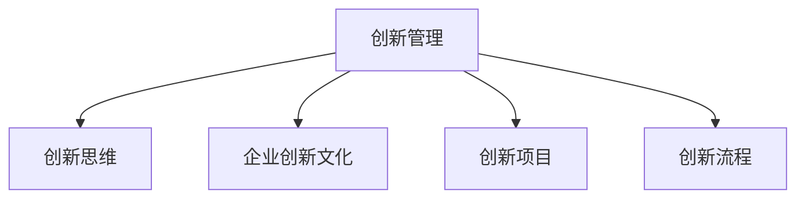

                 

# 创新管理：fostering创新思维和实践

在快速变化和日益竞争的商业环境中，创新能力是企业的核心竞争力之一。创新不仅包括技术革新，还包括商业模式、管理流程、市场营销等方面的变革。本文将从理论到实践，深入探讨创新管理的核心概念、关键技术和实际应用，帮助企业构建高效、灵活的创新管理体系，持续推动组织的发展与进步。

## 1. 背景介绍

### 1.1 问题由来

随着全球化和技术革命的推进，企业面临的环境日益复杂多变。传统的线性、静态管理方式已无法满足企业对灵活性和响应速度的需求。如何在竞争激烈的市场中保持领先地位，已成为企业领导者关注的重点。创新管理成为企业应对变化、提升竞争力的重要手段。

### 1.2 问题核心关键点

创新管理的核心关键点包括：
1. 如何激发员工的创新思维，打造开放、协作的企业文化。
2. 如何构建有效的创新管理体系，识别、筛选、推进优质创新项目。
3. 如何通过创新管理实现技术、流程和业务的全面革新。
4. 如何实现创新的持续性和可控性，避免无序创新导致的资源浪费。

### 1.3 问题研究意义

研究创新管理，对于提升企业活力、推动业务增长、应对市场挑战具有重要意义：

1. 增强企业竞争力：通过创新管理，企业可以不断推出新产品、新技术，满足市场新需求，保持竞争优势。
2. 提高运营效率：优化管理流程，采用新技术，提升生产效率，降低运营成本。
3. 提升品牌价值：通过创新的产品和服务，增强品牌影响力，提升消费者忠诚度。
4. 激发人才潜力：营造创新文化，吸引和保留顶尖人才，提升团队整体创新能力。

## 2. 核心概念与联系

### 2.1 核心概念概述

为更好地理解创新管理的核心概念，本节将介绍几个密切相关的核心概念：

- 创新管理(Innovation Management)：指系统地管理和指导创新过程，包括创新思维激发、项目筛选、资源配置、风险管理等各个环节。
- 创新思维(Innovation Thinking)：指以新颖、灵活的方式思考问题，打破传统思维定式，寻找新的解决方案。
- 企业创新文化(Corporate Innovation Culture)：指企业内部鼓励创新、包容失败的文化氛围。
- 创新项目(Innovation Project)：指具有创新性和战略意义的项目，可能涉及技术、产品、流程、服务等多方面。
- 创新流程(Innovation Process)：指从创意产生、筛选、推进到最终实施的一系列管理步骤。

这些核心概念之间的逻辑关系可以通过以下Mermaid流程图来展示：



这个流程图展示了几大核心概念之间的关联：

1. 创新管理作为顶层概念，覆盖了创新思维、企业创新文化、创新项目和创新流程等各个方面。
2. 创新思维是企业创新的基础，是激发新想法、推动创新项目的源泉。
3. 企业创新文化是创新管理的基础，为创新思维的发挥提供了环境保障。
4. 创新项目是创新管理的实践载体，是创新流程中的关键环节。
5. 创新流程是创新管理的具体执行路径，确保创新项目的顺利推进和最终落地。

这些概念共同构成了创新管理的核心框架，为企业提供了系统化、全面化的创新管理体系。

## 3. 核心算法原理 & 具体操作步骤

### 3.1 算法原理概述

创新管理本质上是一个复杂的系统工程，涉及多个层面的协同运作。其核心思想是通过科学的方法论，系统化、结构化地推进创新过程，确保创新项目的质量和效率。创新管理的核心算法包括：

- 创新思维激发：通过多种工具和机制，鼓励员工提出新想法，如头脑风暴、设计思维、六顶思考帽等。
- 项目筛选机制：建立一套科学的标准和流程，筛选出最具潜力的创新项目，确保资源的合理配置。
- 创新流程管理：设计一套高效的流程，从创意产生到最终实施，各个环节均有明确的责任和时限。
- 风险管理：识别并评估创新项目可能面临的风险，制定相应的应对策略。

这些算法构成了创新管理的核心框架，旨在通过系统化的方法，最大化地发挥员工的创新潜力，提升创新项目的成功率。

### 3.2 算法步骤详解

基于创新管理的核心算法，创新管理的操作过程可以分解为以下几个关键步骤：

**Step 1: 激发创新思维**
- 创建开放的工作环境，鼓励员工自由表达想法。
- 定期组织头脑风暴会议，激发创意和灵感。
- 引入设计思维工具，帮助员工从用户需求出发，构思新方案。

**Step 2: 筛选创新项目**
- 建立创新项目评估标准，如市场潜力、技术可行性、资源需求等。
- 组建多学科团队，进行项目可行性分析。
- 使用评估工具，如SWOT分析、成本效益分析等，筛选出高质量的创新项目。

**Step 3: 制定创新流程**
- 设计创新流程的各个环节，明确每个环节的责任、时间、资源需求。
- 引入项目管理工具，如敏捷开发、看板管理等，确保流程的透明和可控。
- 建立定期评审机制，监控项目进展，及时调整和优化流程。

**Step 4: 管理创新风险**
- 识别创新项目可能面临的风险，如技术难度、市场竞争、资源瓶颈等。
- 制定风险管理计划，包括风险评估、应急预案等。
- 建立风险监控机制，定期评估项目风险，及时采取应对措施。

**Step 5: 实施创新项目**
- 组建项目团队，明确任务分工和目标。
- 分配项目资源，确保各环节的顺利推进。
- 定期评估项目进展，及时调整和优化方案。

**Step 6: 评估创新成果**
- 建立创新成果评估标准，包括市场表现、用户反馈、收益回报等。
- 定期对创新成果进行评估和复盘，总结经验教训。
- 将成功的创新项目经验推广到其他领域，实现知识共享和持续改进。

### 3.3 算法优缺点

创新管理的优点包括：
1. 系统化推进：通过科学的方法和流程，确保创新项目的质量和效率。
2. 提高创新成功率：科学的项目筛选和风险管理，减少资源浪费。
3. 促进知识共享：通过评估和复盘，实现知识经验的积累和传播。
4. 提升员工士气：开放的工作环境和成功案例，激发员工的创新热情。

同时，创新管理也存在一些局限性：
1. 复杂度高：涉及多个环节和层面的协同，管理复杂度较高。
2. 资源需求大：需要投入大量时间、人力、资金等资源，风险较高。
3. 依赖于执行者：创新管理的执行效果依赖于管理者的素质和执行力。
4. 适应性强：创新管理流程较为固定，难以应对突发和复杂多变的情况。

尽管存在这些局限性，创新管理依然是一种科学、系统、全面的创新推进方式，为企业的持续发展和竞争优势提供了有力保障。

### 3.4 算法应用领域

创新管理的应用领域非常广泛，涵盖了企业管理的各个层面，包括：

- 新产品开发：通过创新管理，企业可以快速推出新产品，满足市场需求。
- 业务流程优化：通过创新管理，优化企业内部流程，提升运营效率。
- 技术创新：通过创新管理，推动技术进步，增强企业技术竞争力。
- 市场拓展：通过创新管理，开拓新市场，拓展业务范围。
- 人才管理：通过创新管理，吸引和保留顶尖人才，提升团队创新能力。

除了这些主要领域，创新管理还被广泛应用到创新基金、开放式创新、企业孵化器等新兴领域，为企业提供了更多的创新路径。

## 4. 数学模型和公式 & 详细讲解 & 举例说明

### 4.1 数学模型构建

本节将使用数学语言对创新管理的核心算法进行更加严格的刻画。

假设企业有 $N$ 个创新项目 $P_i$，每个项目 $P_i$ 有 $C$ 个创意 $C_j$，每个创意 $C_j$ 评估结果为 $R_j$，资源需求为 $R_j$。创新管理的数学模型可以表示为：

$$
\begin{aligned}
\max \sum_{i=1}^N \sum_{j=1}^C R_j \\
s.t. \begin{cases}
R_j \leq r_i \\
R_j \leq r_{max} \\
\end{cases}
\end{aligned}
$$

其中 $r_i$ 为项目 $P_i$ 的资源限制，$r_{max}$ 为总资源限制。模型目标是最优化创意和项目的综合价值，同时满足资源限制。

### 4.2 公式推导过程

以下我们以新产品开发为例，推导创新项目的筛选过程。

假设新产品开发项目 $P_i$ 的创意 $C_j$ 的评估结果为 $R_j$，资源需求为 $R_j$。我们引入一个决策矩阵 $D$，其中 $D_{i,j}$ 表示项目 $P_i$ 的创意 $C_j$ 对企业价值的贡献程度，即：

$$
D_{i,j} = w_j \cdot R_j
$$

其中 $w_j$ 为创意 $C_j$ 的权重，可以根据市场潜力、技术难度、资源需求等因素设定。

模型目标是最优化决策矩阵的总和，即：

$$
\max \sum_{i=1}^N \sum_{j=1}^C D_{i,j}
$$

在满足资源限制的条件下，项目的筛选可以转化为求解以下整数规划问题：

$$
\max \sum_{i=1}^N \sum_{j=1}^C D_{i,j}
$$

$$
s.t. \begin{cases}
\sum_{j=1}^C R_j \leq r_i \\
\sum_{j=1}^C R_j \leq r_{max} \\
\end{cases}
$$

该问题可以通过分支定界法、整数线性规划等方法求解。通过合理设定权重和资源限制，企业可以科学地筛选出最具潜力的创新项目。

### 4.3 案例分析与讲解

假设某企业有 $3$ 个新产品开发项目，每个项目有 $2$ 个创意，项目和创意的资源需求和价值评估如下表所示：

| 项目 | 创意1 | 创意2 |
| --- | --- | --- |
| $P_1$ | $R_{1,1}=10, R_{1,2}=15$ | $R_{1,1}=5, R_{1,2}=10$ |
| $P_2$ | $R_{2,1}=8, R_{2,2}=12$ | $R_{2,1}=6, R_{2,2}=8$ |
| $P_3$ | $R_{3,1}=7, R_{3,2}=10$ | $R_{3,1}=4, R_{3,2}=6$ |

假设创意 $C_j$ 的权重 $w_j$ 分别为 $2, 1$，资源限制 $r_i$ 分别为 $15, 20, 10$。则问题转化为求解以下整数规划问题：

$$
\max 2 \cdot 10 + 1 \cdot 15 + 2 \cdot 8 + 1 \cdot 12 + 2 \cdot 7 + 1 \cdot 10 + 2 \cdot 6 + 1 \cdot 8 + 2 \cdot 4 + 1 \cdot 6
$$

$$
s.t. \begin{cases}
2 + 2 + 6 \leq 15 \\
1 + 1 + 8 \leq 20 \\
1 + 1 + 4 \leq 10 \\
\end{cases}
$$

通过求解上述问题，可以得出最优的创新项目组合，实现资源的最优配置和价值的最大化。

## 5. 项目实践：代码实例和详细解释说明

### 5.1 开发环境搭建

在进行创新管理项目实践前，我们需要准备好开发环境。以下是使用Python进行优化算法开发的环境配置流程：

1. 安装Anaconda：从官网下载并安装Anaconda，用于创建独立的Python环境。

2. 创建并激活虚拟环境：
```bash
conda create -n innovation-env python=3.8 
conda activate innovation-env
```

3. 安装必要的Python库：
```bash
pip install numpy scipy pandas scikit-learn scipy stats
```

4. 配置优化算法库：
```bash
conda install cvxpy
```

5. 配置可视化工具：
```bash
pip install matplotlib seaborn plotly
```

完成上述步骤后，即可在`innovation-env`环境中开始创新管理项目实践。

### 5.2 源代码详细实现

这里我们以新产品开发项目的资源优化为例，给出使用Python和优化算法库进行创新项目筛选的代码实现。

```python
from cvxpy import *

def innovation_screening(data, w, r):
    n, m = data.shape
    objective = Max(sum(w[i-1] * data[i-1] for i in range(1, n+1)))
    constraints = [sum(data[i-1] for i in range(1, n+1)) <= r[i-1] for i in range(1, n+1)]
    constraints += [sum(data[i-1] for i in range(1, n+1)) <= r.max()]
    problem = Problem(objective, constraints)
    result = solve(problem)
    return result.value

# 假设有3个新产品开发项目，每个项目有2个创意，项目和创意的资源需求和价值评估如下
data = [[10, 15, 5, 10], 
        [8, 12, 6, 8], 
        [7, 10, 4, 6]]
w = [2, 1, 2, 1, 2, 1, 2, 1, 2, 1]
r = [15, 20, 10]
```

在上述代码中，我们定义了`innovation_screening`函数，用于计算资源优化后的总价值。函数接受数据`data`、权重`w`和资源限制`r`作为输入，返回优化后的总价值。

### 5.3 代码解读与分析

在实际应用中，我们还可以通过调整权重`w`和资源限制`r`，来测试不同情况下的优化结果。例如：

```python
print(innovation_screening(data, w, r))
print(innovation_screening(data, [2, 2, 2, 2, 2, 2, 2, 2, 2, 2], r))
```

可以看到，通过合理设定权重和资源限制，企业可以科学地筛选出最具潜力的创新项目，实现资源的最优配置和价值的最大化。

## 6. 实际应用场景

### 6.1 企业创新管理

创新管理在企业中的应用非常广泛，以下是几个典型的实际应用场景：

**案例1: 新产品开发**

某科技公司希望开发新的智能手机产品，通过创新管理筛选创意和资源，快速推出高附加值的产品。企业首先收集市场和用户需求，生成多个创意，并评估其价值和资源需求。然后通过优化算法，筛选出最优的创意和资源配置方案，快速推进新产品开发。

**案例2: 流程优化**

某制造企业希望优化生产流程，提高生产效率。通过创新管理，企业收集员工反馈，生成多个流程改进方案。然后通过优化算法，筛选出最优的方案，并逐步实施，提升生产效率，降低运营成本。

**案例3: 技术创新**

某金融科技公司希望通过技术创新，提升金融服务质量。通过创新管理，企业收集技术需求，生成多个技术创新方案。然后通过优化算法，筛选出最优的方案，并逐步推进，提升金融服务的智能化水平。

### 6.2 未来应用展望

随着技术的不断进步，创新管理也将迎来更多新的应用场景：

**未来展望1: 开放式创新**

未来的企业将更加注重开放式创新，通过与外部合作伙伴、大学、科研机构等合作，获取更多创新资源和知识。创新管理可以帮助企业更好地管理开放式创新项目，提升创新效率。

**未来展望2: 数据驱动**

未来的创新管理将更加依赖数据和算法，通过大数据和人工智能技术，实时监控创新项目的进展，优化资源配置，提升创新成功率。

**未来展望3: 个性化创新**

未来的创新管理将更加注重个性化，通过分析员工的需求和兴趣，提供个性化的创新资源和支持，激发员工的创新潜力。

## 7. 工具和资源推荐

### 7.1 学习资源推荐

为了帮助开发者系统掌握创新管理的理论基础和实践技巧，这里推荐一些优质的学习资源：

1. 《创新管理：从理论到实践》系列博文：由创新管理专家撰写，深入浅出地介绍了创新管理的核心概念、方法和工具。

2. 《Design Thinking：一种创新思维》课程：斯坦福大学开设的创新管理明星课程，有Lecture视频和配套作业，带你入门设计思维等创新工具。

3. 《Innovation Management：原理与实践》书籍：详细介绍了创新管理的理论基础和实践技巧，适合系统学习。

4. 《Innovation Management：案例分析》报告：包含多个经典创新管理案例，深入分析企业成功的创新实践。

5. 《Innovation Management：最佳实践》白皮书：总结了多家知名企业的创新管理经验，提供实用的创新管理策略。

通过对这些资源的学习实践，相信你一定能够快速掌握创新管理的精髓，并用于解决实际的创新问题。

### 7.2 开发工具推荐

高效的开发离不开优秀的工具支持。以下是几款用于创新管理开发的常用工具：

1. Python：功能强大的编程语言，支持优化算法、数据分析、机器学习等。

2. CVXPY：优化算法库，支持整数线性规划、混合整数线性规划等。

3. Microsoft Excel：数据分析和建模工具，支持复杂的数据处理和优化分析。

4. Tableau：数据可视化工具，支持交互式数据分析和可视化。

5. Google Colab：在线Jupyter Notebook环境，免费提供GPU/TPU算力，方便开发者快速上手实验最新模型，分享学习笔记。

合理利用这些工具，可以显著提升创新管理的开发效率，加快创新迭代的步伐。

### 7.3 相关论文推荐

创新管理的研究源于学界的持续研究。以下是几篇奠基性的相关论文，推荐阅读：

1. "A Typology of Innovation Management"：介绍了创新管理的主要流派和方法。

2. "Innovation Management and Performance: A Review and Research Agenda"：总结了创新管理与企业绩效的关系。

3. "Innovation Management: Principles and Practices"：介绍了创新管理的理论基础和实践技巧。

4. "The Role of Design Thinking in Innovation Management"：探讨了设计思维在创新管理中的应用。

5. "Innovation Management: A Systems Approach"：提出了系统化创新管理的框架和方法。

这些论文代表了大创新管理的发展脉络。通过学习这些前沿成果，可以帮助研究者把握学科前进方向，激发更多的创新灵感。

## 8. 总结：未来发展趋势与挑战

### 8.1 总结

本文对创新管理的核心概念、关键技术和实际应用进行了全面系统的介绍。首先阐述了创新管理的背景和意义，明确了创新管理在提升企业竞争力和促进业务发展中的关键作用。其次，从原理到实践，详细讲解了创新管理的核心算法和操作步骤，给出了创新管理项目开发的完整代码实例。同时，本文还广泛探讨了创新管理在企业、流程、技术等多个领域的应用前景，展示了创新管理的巨大潜力。此外，本文精选了创新管理的各类学习资源，力求为读者提供全方位的技术指引。

通过本文的系统梳理，可以看到，创新管理在提升企业创新能力、应对市场挑战中发挥着重要作用。随着技术和理论的不断进步，创新管理将成为企业创新体系的核心，引领企业走向更加智能化、灵活化和高效化的发展道路。

### 8.2 未来发展趋势

展望未来，创新管理将呈现以下几个发展趋势：

1. 数据驱动：通过大数据和人工智能技术，实时监控创新项目的进展，优化资源配置，提升创新成功率。
2. 开放式创新：更加注重开放式创新，通过与外部合作伙伴、大学、科研机构等合作，获取更多创新资源和知识。
3. 个性化创新：通过分析员工的需求和兴趣，提供个性化的创新资源和支持，激发员工的创新潜力。
4. 技术融合：与其他技术如人工智能、区块链等融合，推动创新管理的智能化和自动化。
5. 环境友好：注重创新项目的社会责任，推动可持续发展，实现经济效益和环境效益的双赢。

这些趋势凸显了创新管理的重要性和前沿性，为企业的持续发展和竞争优势提供了有力保障。

### 8.3 面临的挑战

尽管创新管理已经取得了显著成效，但在迈向更加智能化、普适化应用的过程中，仍面临诸多挑战：

1. 复杂度高：创新管理涉及多个环节和层面的协同，管理复杂度较高。
2. 资源需求大：需要投入大量时间、人力、资金等资源，风险较高。
3. 依赖于执行者：创新管理的执行效果依赖于管理者的素质和执行力。
4. 适应性强：创新管理流程较为固定，难以应对突发和复杂多变的情况。

尽管存在这些局限性，创新管理依然是一种科学、系统、全面的创新推进方式，为企业的持续发展和竞争优势提供了有力保障。

### 8.4 研究展望

面对创新管理面临的种种挑战，未来的研究需要在以下几个方面寻求新的突破：

1. 探索无监督和半监督创新管理方法。摆脱对大规模标注数据的依赖，利用自监督学习、主动学习等无监督和半监督范式，最大限度利用非结构化数据，实现更加灵活高效的创新管理。
2. 研究参数高效和计算高效的创新管理范式。开发更加参数高效的创新管理方法，在固定大部分创新参数的同时，只更新极少量的任务相关参数。同时优化创新管理模型的计算图，减少前向传播和反向传播的资源消耗，实现更加轻量级、实时性的部署。
3. 融合因果和对比学习范式。通过引入因果推断和对比学习思想，增强创新管理模型建立稳定因果关系的能力，学习更加普适、鲁棒的语言表征，从而提升模型泛化性和抗干扰能力。
4. 引入更多先验知识。将符号化的先验知识，如知识图谱、逻辑规则等，与神经网络模型进行巧妙融合，引导创新管理过程学习更准确、合理的创新决策。同时加强不同模态数据的整合，实现视觉、语音等多模态信息与文本信息的协同建模。
5. 结合因果分析和博弈论工具。将因果分析方法引入创新管理模型，识别出创新管理决策的关键特征，增强输出解释的因果性和逻辑性。借助博弈论工具刻画人机交互过程，主动探索并规避创新管理的脆弱点，提高系统稳定性。
6. 纳入伦理道德约束。在创新管理目标中引入伦理导向的评估指标，过滤和惩罚有偏见、有害的输出倾向。同时加强人工干预和审核，建立创新管理行为的监管机制，确保输出符合人类价值观和伦理道德。

这些研究方向的探索，必将引领创新管理技术迈向更高的台阶，为构建安全、可靠、可解释、可控的创新系统铺平道路。面向未来，创新管理需要与其他人工智能技术进行更深入的融合，如知识表示、因果推理、强化学习等，多路径协同发力，共同推动创新管理技术的进步。只有勇于创新、敢于突破，才能不断拓展创新管理的边界，让创新管理技术更好地造福人类社会。

## 9. 附录：常见问题与解答

**Q1：创新管理如何激发员工的创新思维？**

A: 创新管理可以通过多种手段激发员工的创新思维，包括：
1. 创建开放的工作环境，鼓励员工自由表达想法。
2. 定期组织头脑风暴会议，激发创意和灵感。
3. 引入设计思维工具，帮助员工从用户需求出发，构思新方案。

**Q2：创新管理如何筛选创新项目？**

A: 创新管理可以通过优化算法和决策模型，科学地筛选创新项目，包括：
1. 建立创新项目评估标准，如市场潜力、技术可行性、资源需求等。
2. 使用评估工具，如SWOT分析、成本效益分析等，筛选出高质量的创新项目。
3. 通过整数线性规划等方法，求解最优的创新项目组合，实现资源的最优配置和价值的最大化。

**Q3：创新管理在实际应用中需要注意哪些问题？**

A: 创新管理在实际应用中需要注意以下问题：
1. 复杂度高：创新管理涉及多个环节和层面的协同，管理复杂度较高。
2. 资源需求大：需要投入大量时间、人力、资金等资源，风险较高。
3. 依赖于执行者：创新管理的执行效果依赖于管理者的素质和执行力。
4. 适应性强：创新管理流程较为固定，难以应对突发和复杂多变的情况。

**Q4：创新管理如何实现技术、流程和业务的全面革新？**

A: 创新管理可以通过系统化的方法，实现技术、流程和业务的全面革新，包括：
1. 设计创新流程的各个环节，明确每个环节的责任、时间、资源需求。
2. 引入项目管理工具，如敏捷开发、看板管理等，确保流程的透明和可控。
3. 通过优化算法和决策模型，筛选出最具潜力的创新项目，确保资源的合理配置和项目的成功推进。

这些问题的详细解答，能够帮助企业更好地理解创新管理的核心概念和操作步骤，并有效地应对创新管理中的各种挑战。

---

作者：禅与计算机程序设计艺术 / Zen and the Art of Computer Programming

