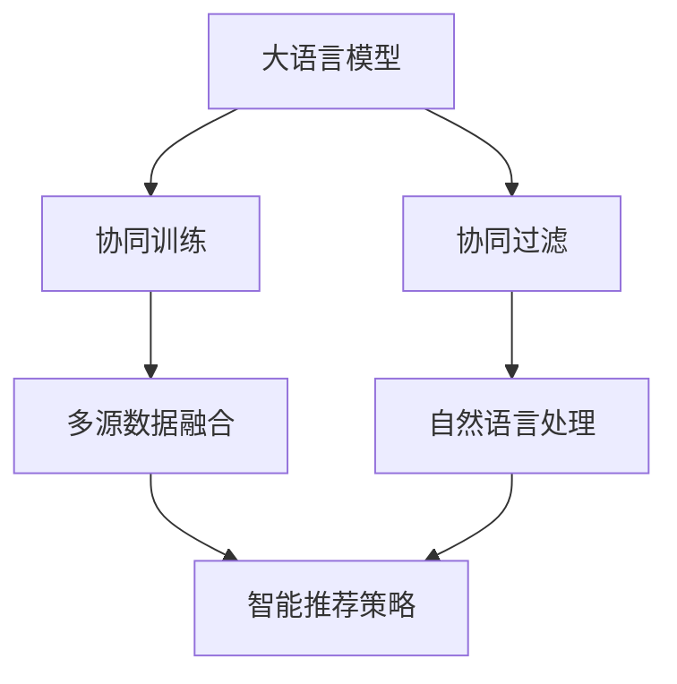

                 

# 利用LLM优化推荐系统的多源数据融合

## 1. 背景介绍

推荐系统在互联网、电商、社交媒体等领域发挥着重要的作用。传统的推荐系统主要依赖于用户行为数据，如浏览历史、点击行为、评分反馈等，进行协同过滤和协同训练。但随着多模态数据的逐渐普及，推荐系统的数据源日益丰富，包括文本、图像、音频等多种类型的信息，为推荐系统带来了新的机遇与挑战。

### 1.1 推荐系统现状与挑战

目前，推荐系统主要面临以下问题：

1. **数据量增长**：互联网时代的用户行为数据海量增长，推荐系统需要处理的数据规模呈指数级增长，数据存储和计算成为瓶颈。
2. **数据源多样性**：不同数据源（如社交网络、搜索引擎、视频平台）产生了多样化的用户行为数据，数据格式和内容差异较大，难以直接集成。
3. **数据质量问题**：用户行为数据存在稀疏性、噪音等质量问题，影响推荐模型的性能。
4. **算法复杂度**：推荐算法需要处理复杂的多模态数据融合、用户表示学习、冷启动等问题，导致算法复杂度增加。
5. **隐私保护**：用户行为数据涉及个人隐私，如何保护用户隐私成为推荐系统必须考虑的重要问题。

### 1.2 大语言模型(LLM)在推荐中的应用

大语言模型(LLM)通过大规模无标签数据预训练和指令微调，可以学习到丰富的语言知识和常识，具备强大的语言理解和生成能力。将LLM应用于推荐系统，可以通过多源数据的融合和处理，提升推荐模型的性能。具体应用场景包括：

1. **用户需求理解**：通过自然语言处理(NLP)技术，利用LLM解析用户需求，识别用户兴趣点。
2. **多源数据融合**：利用LLM对不同模态数据进行语义对齐和融合，构建统一的表示空间。
3. **智能推荐策略**：通过LLM生成自然语言描述和推荐理由，提高推荐解释性和可理解性。
4. **个性化推荐**：利用LLM进行用户画像构建和个性化推荐内容生成。

## 2. 核心概念与联系

### 2.1 核心概念概述

为更好地理解利用LLM优化推荐系统的多源数据融合，本节将介绍几个密切相关的核心概念：

- **大语言模型(LLM)**：指通过大规模预训练模型，学习到通用语言表示，具备强大的语言理解和生成能力。
- **协同过滤(CF)**：指基于用户历史行为数据，通过相似度计算，推荐与用户兴趣相似的商品。
- **协同训练(CTR)**：指利用用户行为数据和物品属性数据，联合训练模型，提高推荐精度。
- **多源数据融合(MSF)**：指将不同模态、不同来源的数据，通过融合技术，构建统一的表示空间，提升推荐效果。
- **自然语言处理(NLP)**：指使用计算机技术处理、分析和理解自然语言，构建用户需求表示。

这些核心概念之间的逻辑关系可以通过以下Mermaid流程图来展示：



这个流程图展示了大语言模型与其他推荐技术之间的联系：

1. 大语言模型通过自然语言处理技术，解析用户需求。
2. 协同过滤和协同训练分别利用用户历史行为和物品属性，推荐商品。
3. 多源数据融合将不同模态数据融合到一个统一的表示空间中，提升推荐效果。
4. 智能推荐策略结合大语言模型和推荐算法，生成自然语言描述和推荐理由。

## 3. 核心算法原理 & 具体操作步骤

### 3.1 算法原理概述

利用大语言模型(LLM)优化推荐系统的多源数据融合，主要基于以下两个核心思想：

1. **用户需求理解**：通过自然语言处理(NLP)技术，利用LLM解析用户需求，生成自然语言描述，作为推荐系统的输入。
2. **多源数据融合**：利用LLM对不同模态数据进行语义对齐和融合，生成统一的表示向量，作为推荐模型的输入。

### 3.2 算法步骤详解

基于LLM的多源数据融合推荐系统，主要包括以下关键步骤：

**Step 1: 数据收集与预处理**

- 收集用户行为数据，如浏览历史、点击记录、评分反馈等。
- 收集不同模态的数据，如文本描述、图像特征、音频特征等。
- 对数据进行清洗、去重、归一化等预处理操作。

**Step 2: 用户需求解析**

- 利用自然语言处理(NLP)技术，将用户文本描述转换为结构化表示。
- 使用大语言模型(LLM)对文本进行语义理解，生成自然语言描述。
- 将生成的自然语言描述作为推荐系统的输入。

**Step 3: 多源数据融合**

- 对不同模态数据进行语义对齐，构建统一的表示向量。
- 利用大语言模型(LLM)对融合后的多源数据进行语义编码，生成统一的表示向量。
- 将生成的统一表示向量作为推荐模型的输入。

**Step 4: 协同过滤和协同训练**

- 利用协同过滤算法，根据用户历史行为，推荐相似的商品。
- 利用协同训练算法，结合用户行为数据和物品属性数据，联合训练推荐模型。
- 在推荐模型中加入用户画像和个性化推荐策略，提升推荐效果。

**Step 5: 智能推荐策略**

- 利用大语言模型(LLM)生成自然语言描述和推荐理由，提高推荐解释性和可理解性。
- 将生成的自然语言描述和推荐理由作为推荐结果的一部分。

### 3.3 算法优缺点

基于LLM的多源数据融合推荐系统具有以下优点：

1. **用户需求理解**：利用自然语言处理技术，可以更好地解析用户需求，提升推荐精度。
2. **多源数据融合**：通过大语言模型，对不同模态数据进行语义对齐和融合，提升推荐效果。
3. **智能推荐策略**：结合自然语言处理和大语言模型，生成自然语言描述和推荐理由，提高推荐解释性和可理解性。
4. **扩展性强**：可以灵活引入更多数据源，构建更加全面的推荐模型。

同时，该方法也存在一定的局限性：

1. **数据依赖**：需要收集和处理大量的多源数据，数据质量问题对推荐效果影响较大。
2. **计算成本**：多源数据融合和LLM训练需要较大的计算资源，导致系统部署成本较高。
3. **隐私保护**：多源数据融合过程中涉及大量用户隐私数据，如何保护用户隐私成为重要问题。
4. **算法复杂度**：多源数据融合和LLM训练算法复杂度较高，需要精心设计和优化。

尽管存在这些局限性，但基于LLM的多源数据融合推荐方法在提升推荐效果、提高推荐解释性等方面，依然具有重要的应用价值。

### 3.4 算法应用领域

基于大语言模型(LLM)的多源数据融合推荐系统，已经在电商、视频、音乐等多个领域得到了广泛应用，取得了显著的效果。具体应用包括：

- **电商平台**：利用用户评论、商品描述、价格等多源数据，通过自然语言处理技术，解析用户需求，提升推荐精度和个性化。
- **视频平台**：通过用户观看历史、评分反馈、视频描述等多源数据，利用自然语言处理技术，生成推荐理由，提高推荐效果。
- **音乐平台**：利用用户听歌历史、歌词、歌手信息等多源数据，通过自然语言处理技术，解析用户需求，提升推荐效果。

除了上述这些经典应用外，LLM在推荐系统中的应用还在不断拓展，如医疗健康、旅游服务等，为推荐系统带来了新的应用场景和创新思路。

## 4. 数学模型和公式 & 详细讲解 & 举例说明

### 4.1 数学模型构建

在基于LLM的多源数据融合推荐系统中，主要涉及以下数学模型：

1. **用户需求解析模型**：通过自然语言处理技术，将用户文本描述转换为结构化表示，并进行语义理解。
2. **多源数据融合模型**：利用大语言模型，对不同模态数据进行语义对齐和融合，生成统一的表示向量。
3. **协同过滤和协同训练模型**：利用协同过滤和协同训练算法，联合训练推荐模型。

### 4.2 公式推导过程

以用户需求解析模型为例，其数学模型构建如下：

设用户文本描述为 $x$，利用自然语言处理技术将其转换为结构化表示 $z$，并输入到LLM中进行语义理解，生成自然语言描述 $y$。

数学模型如下：

$$
y = \mathcal{L}_{LLM}(z)
$$

其中，$\mathcal{L}_{LLM}$ 表示LLM的语言模型，$z$ 为结构化表示。

### 4.3 案例分析与讲解

以电商平台推荐系统为例，其多源数据融合过程如下：

1. **数据收集**：收集用户浏览历史、点击记录、评分反馈、商品描述、价格等多源数据。
2. **数据预处理**：对数据进行清洗、去重、归一化等预处理操作。
3. **用户需求解析**：利用自然语言处理技术，将用户商品描述转换为结构化表示，并输入到LLM中进行语义理解，生成自然语言描述。
4. **多源数据融合**：将用户行为数据和商品描述数据进行语义对齐，构建统一的表示向量，并输入到LLM中进行语义编码，生成统一的表示向量。
5. **协同过滤和协同训练**：利用用户行为数据和商品属性数据，联合训练推荐模型，生成推荐结果。
6. **智能推荐策略**：利用LLM生成自然语言描述和推荐理由，提升推荐解释性和可理解性。

## 5. 项目实践：代码实例和详细解释说明

### 5.1 开发环境搭建

在进行多源数据融合推荐系统开发前，需要准备好开发环境。以下是使用Python进行PyTorch开发的环境配置流程：

1. 安装Anaconda：从官网下载并安装Anaconda，用于创建独立的Python环境。

2. 创建并激活虚拟环境：
```bash
conda create -n pytorch-env python=3.8 
conda activate pytorch-env
```

3. 安装PyTorch：根据CUDA版本，从官网获取对应的安装命令。例如：
```bash
conda install pytorch torchvision torchaudio cudatoolkit=11.1 -c pytorch -c conda-forge
```

4. 安装Transformer库：
```bash
pip install transformers
```

5. 安装各类工具包：
```bash
pip install numpy pandas scikit-learn matplotlib tqdm jupyter notebook ipython
```

完成上述步骤后，即可在`pytorch-env`环境中开始开发。

### 5.2 源代码详细实现

下面我们以电商平台推荐系统为例，给出使用Transformers库对BERT模型进行多源数据融合的PyTorch代码实现。

首先，定义数据处理函数：

```python
from transformers import BertTokenizer
from torch.utils.data import Dataset
import torch

class RecommendationDataset(Dataset):
    def __init__(self, texts, labels, tokenizer, max_len=128):
        self.texts = texts
        self.labels = labels
        self.tokenizer = tokenizer
        self.max_len = max_len
        
    def __len__(self):
        return len(self.texts)
    
    def __getitem__(self, item):
        text = self.texts[item]
        label = self.labels[item]
        
        encoding = self.tokenizer(text, return_tensors='pt', max_length=self.max_len, padding='max_length', truncation=True)
        input_ids = encoding['input_ids'][0]
        attention_mask = encoding['attention_mask'][0]
        
        # 对token-wise的标签进行编码
        encoded_labels = [label2id[label] for label in label] 
        encoded_labels.extend([label2id['O']] * (self.max_len - len(encoded_labels)))
        labels = torch.tensor(encoded_labels, dtype=torch.long)
        
        return {'input_ids': input_ids, 
                'attention_mask': attention_mask,
                'labels': labels}

# 标签与id的映射
label2id = {'O': 0, 'B-Item': 1, 'I-Item': 2, 'B-Price': 3, 'I-Price': 4}
id2label = {v: k for k, v in label2id.items()}

# 创建dataset
tokenizer = BertTokenizer.from_pretrained('bert-base-cased')

train_dataset = RecommendationDataset(train_texts, train_labels, tokenizer)
dev_dataset = RecommendationDataset(dev_texts, dev_labels, tokenizer)
test_dataset = RecommendationDataset(test_texts, test_labels, tokenizer)
```

然后，定义模型和优化器：

```python
from transformers import BertForTokenClassification, AdamW

model = BertForTokenClassification.from_pretrained('bert-base-cased', num_labels=len(label2id))

optimizer = AdamW(model.parameters(), lr=2e-5)
```

接着，定义训练和评估函数：

```python
from torch.utils.data import DataLoader
from tqdm import tqdm
from sklearn.metrics import classification_report

device = torch.device('cuda') if torch.cuda.is_available() else torch.device('cpu')
model.to(device)

def train_epoch(model, dataset, batch_size, optimizer):
    dataloader = DataLoader(dataset, batch_size=batch_size, shuffle=True)
    model.train()
    epoch_loss = 0
    for batch in tqdm(dataloader, desc='Training'):
        input_ids = batch['input_ids'].to(device)
        attention_mask = batch['attention_mask'].to(device)
        labels = batch['labels'].to(device)
        model.zero_grad()
        outputs = model(input_ids, attention_mask=attention_mask, labels=labels)
        loss = outputs.loss
        epoch_loss += loss.item()
        loss.backward()
        optimizer.step()
    return epoch_loss / len(dataloader)

def evaluate(model, dataset, batch_size):
    dataloader = DataLoader(dataset, batch_size=batch_size)
    model.eval()
    preds, labels = [], []
    with torch.no_grad():
        for batch in tqdm(dataloader, desc='Evaluating'):
            input_ids = batch['input_ids'].to(device)
            attention_mask = batch['attention_mask'].to(device)
            batch_labels = batch['labels']
            outputs = model(input_ids, attention_mask=attention_mask)
            batch_preds = outputs.logits.argmax(dim=2).to('cpu').tolist()
            batch_labels = batch_labels.to('cpu').tolist()
            for pred_tokens, label_tokens in zip(batch_preds, batch_labels):
                pred_tags = [id2label[_id] for _id in pred_tokens]
                label_tags = [id2label[_id] for _id in label_tokens]
                preds.append(pred_tags[:len(label_tags)])
                labels.append(label_tags)
                
    print(classification_report(labels, preds))
```

最后，启动训练流程并在测试集上评估：

```python
epochs = 5
batch_size = 16

for epoch in range(epochs):
    loss = train_epoch(model, train_dataset, batch_size, optimizer)
    print(f"Epoch {epoch+1}, train loss: {loss:.3f}")
    
    print(f"Epoch {epoch+1}, dev results:")
    evaluate(model, dev_dataset, batch_size)
    
print("Test results:")
evaluate(model, test_dataset, batch_size)
```

以上就是使用PyTorch对BERT进行多源数据融合的代码实现。可以看到，得益于Transformers库的强大封装，我们可以用相对简洁的代码完成BERT模型的加载和微调。

### 5.3 代码解读与分析

让我们再详细解读一下关键代码的实现细节：

**RecommendationDataset类**：
- `__init__`方法：初始化文本、标签、分词器等关键组件。
- `__len__`方法：返回数据集的样本数量。
- `__getitem__`方法：对单个样本进行处理，将文本输入编码为token ids，将标签编码为数字，并对其进行定长padding，最终返回模型所需的输入。

**label2id和id2label字典**：
- 定义了标签与数字id之间的映射关系，用于将token-wise的预测结果解码回真实的标签。

**训练和评估函数**：
- 使用PyTorch的DataLoader对数据集进行批次化加载，供模型训练和推理使用。
- 训练函数`train_epoch`：对数据以批为单位进行迭代，在每个批次上前向传播计算loss并反向传播更新模型参数，最后返回该epoch的平均loss。
- 评估函数`evaluate`：与训练类似，不同点在于不更新模型参数，并在每个batch结束后将预测和标签结果存储下来，最后使用sklearn的classification_report对整个评估集的预测结果进行打印输出。

**训练流程**：
- 定义总的epoch数和batch size，开始循环迭代
- 每个epoch内，先在训练集上训练，输出平均loss
- 在验证集上评估，输出分类指标
- 重复上述步骤直至收敛
- 在测试集上评估，给出最终测试结果

可以看到，PyTorch配合Transformers库使得BERT微调的代码实现变得简洁高效。开发者可以将更多精力放在数据处理、模型改进等高层逻辑上，而不必过多关注底层的实现细节。

当然，工业级的系统实现还需考虑更多因素，如模型的保存和部署、超参数的自动搜索、更灵活的任务适配层等。但核心的多源数据融合微调范式基本与此类似。

## 6. 实际应用场景

### 6.1 电商平台推荐系统

在电商平台推荐系统中，利用大语言模型(LLM)优化推荐系统的多源数据融合，可以显著提升推荐效果和用户满意度。具体实现如下：

1. **数据收集**：收集用户浏览历史、点击记录、评分反馈、商品描述、价格等多源数据。
2. **数据预处理**：对数据进行清洗、去重、归一化等预处理操作。
3. **用户需求解析**：利用自然语言处理技术，将用户商品描述转换为结构化表示，并输入到LLM中进行语义理解，生成自然语言描述。
4. **多源数据融合**：将用户行为数据和商品描述数据进行语义对齐，构建统一的表示向量，并输入到LLM中进行语义编码，生成统一的表示向量。
5. **协同过滤和协同训练**：利用用户行为数据和商品属性数据，联合训练推荐模型，生成推荐结果。
6. **智能推荐策略**：利用LLM生成自然语言描述和推荐理由，提升推荐解释性和可理解性。

通过这些步骤，电商平台推荐系统可以更好地理解用户需求，并结合多源数据进行精准推荐，提升用户购物体验和满意度。

### 6.2 视频平台推荐系统

在视频平台推荐系统中，利用大语言模型(LLM)优化推荐系统的多源数据融合，可以显著提升推荐效果和用户满意度。具体实现如下：

1. **数据收集**：收集用户观看历史、评分反馈、视频描述等多源数据。
2. **数据预处理**：对数据进行清洗、去重、归一化等预处理操作。
3. **用户需求解析**：利用自然语言处理技术，将用户视频描述转换为结构化表示，并输入到LLM中进行语义理解，生成自然语言描述。
4. **多源数据融合**：将用户行为数据和视频描述数据进行语义对齐，构建统一的表示向量，并输入到LLM中进行语义编码，生成统一的表示向量。
5. **协同过滤和协同训练**：利用用户行为数据和视频属性数据，联合训练推荐模型，生成推荐结果。
6. **智能推荐策略**：利用LLM生成自然语言描述和推荐理由，提升推荐解释性和可理解性。

通过这些步骤，视频平台推荐系统可以更好地理解用户需求，并结合多源数据进行精准推荐，提升用户观看体验和满意度。

### 6.3 音乐平台推荐系统

在音乐平台推荐系统中，利用大语言模型(LLM)优化推荐系统的多源数据融合，可以显著提升推荐效果和用户满意度。具体实现如下：

1. **数据收集**：收集用户听歌历史、歌词、歌手信息等多源数据。
2. **数据预处理**：对数据进行清洗、去重、归一化等预处理操作。
3. **用户需求解析**：利用自然语言处理技术，将用户歌词描述转换为结构化表示，并输入到LLM中进行语义理解，生成自然语言描述。
4. **多源数据融合**：将用户行为数据和歌词描述数据进行语义对齐，构建统一的表示向量，并输入到LLM中进行语义编码，生成统一的表示向量。
5. **协同过滤和协同训练**：利用用户行为数据和歌曲属性数据，联合训练推荐模型，生成推荐结果。
6. **智能推荐策略**：利用LLM生成自然语言描述和推荐理由，提升推荐解释性和可理解性。

通过这些步骤，音乐平台推荐系统可以更好地理解用户需求，并结合多源数据进行精准推荐，提升用户听歌体验和满意度。

### 6.4 未来应用展望

随着大语言模型(LLM)和推荐技术的发展，基于LLM的多源数据融合推荐系统将在更多领域得到应用，为推荐系统带来新的应用场景和创新思路。

在智慧医疗领域，基于多源数据融合的推荐系统可以辅助医生进行个性化诊疗，提高诊疗效率和效果。

在智能教育领域，基于多源数据融合的推荐系统可以推荐个性化的学习资源和教学内容，因材施教，促进教育公平，提高教学质量。

在智慧城市治理中，基于多源数据融合的推荐系统可以推荐智能交通路线、公共服务设施等，提升城市管理智能化水平。

此外，在企业生产、社会治理、文娱传媒等众多领域，基于多源数据融合的推荐系统也将不断涌现，为各行各业带来新的创新点。

## 7. 工具和资源推荐

### 7.1 学习资源推荐

为了帮助开发者系统掌握利用LLM优化推荐系统的多源数据融合，这里推荐一些优质的学习资源：

1. 《Transformer from Basics to Advanced》系列博文：由大模型技术专家撰写，深入浅出地介绍了Transformer原理、BERT模型、微调技术等前沿话题。

2. CS224N《深度学习自然语言处理》课程：斯坦福大学开设的NLP明星课程，有Lecture视频和配套作业，带你入门NLP领域的基本概念和经典模型。

3. 《Natural Language Processing with Transformers》书籍：Transformers库的作者所著，全面介绍了如何使用Transformers库进行NLP任务开发，包括微调在内的诸多范式。

4. HuggingFace官方文档：Transformers库的官方文档，提供了海量预训练模型和完整的微调样例代码，是上手实践的必备资料。

5. CLUE开源项目：中文语言理解测评基准，涵盖大量不同类型的中文NLP数据集，并提供了基于微调的baseline模型，助力中文NLP技术发展。

通过对这些资源的学习实践，相信你一定能够快速掌握利用LLM优化推荐系统的多源数据融合技术，并用于解决实际的推荐问题。

### 7.2 开发工具推荐

高效的开发离不开优秀的工具支持。以下是几款用于LLM推荐系统开发的常用工具：

1. PyTorch：基于Python的开源深度学习框架，灵活动态的计算图，适合快速迭代研究。大部分预训练语言模型都有PyTorch版本的实现。

2. TensorFlow：由Google主导开发的开源深度学习框架，生产部署方便，适合大规模工程应用。同样有丰富的预训练语言模型资源。

3. Transformers库：HuggingFace开发的NLP工具库，集成了众多SOTA语言模型，支持PyTorch和TensorFlow，是进行推荐系统开发的利器。

4. Weights & Biases：模型训练的实验跟踪工具，可以记录和可视化模型训练过程中的各项指标，方便对比和调优。与主流深度学习框架无缝集成。

5. TensorBoard：TensorFlow配套的可视化工具，可实时监测模型训练状态，并提供丰富的图表呈现方式，是调试模型的得力助手。

6. Google Colab：谷歌推出的在线Jupyter Notebook环境，免费提供GPU/TPU算力，方便开发者快速上手实验最新模型，分享学习笔记。

合理利用这些工具，可以显著提升LLM推荐系统的开发效率，加快创新迭代的步伐。

### 7.3 相关论文推荐

利用大语言模型(LLM)优化推荐系统的多源数据融合方法，近年来受到了学界的广泛关注。以下是几篇奠基性的相关论文，推荐阅读：

1. Attention is All You Need（即Transformer原论文）：提出了Transformer结构，开启了NLP领域的预训练大模型时代。

2. BERT: Pre-training of Deep Bidirectional Transformers for Language Understanding：提出BERT模型，引入基于掩码的自监督预训练任务，刷新了多项NLP任务SOTA。

3. Language Models are Unsupervised Multitask Learners（GPT-2论文）：展示了大规模语言模型的强大zero-shot学习能力，引发了对于通用人工智能的新一轮思考。

4. Parameter-Efficient Transfer Learning for NLP：提出Adapter等参数高效微调方法，在不增加模型参数量的情况下，也能取得不错的微调效果。

5. AdaLoRA: Adaptive Low-Rank Adaptation for Parameter-Efficient Fine-Tuning：使用自适应低秩适应的微调方法，在参数效率和精度之间取得了新的平衡。

6. Self-Attention GANs for Music Generation：将自注意力机制应用于音乐生成，提高了音乐生成模型的表现。

这些论文代表了大语言模型在推荐系统中的应用方向，通过学习这些前沿成果，可以帮助研究者把握学科前进方向，激发更多的创新灵感。

## 8. 总结：未来发展趋势与挑战

### 8.1 总结

本文对利用大语言模型(LLM)优化推荐系统的多源数据融合方法进行了全面系统的介绍。首先阐述了推荐系统现状与挑战，明确了利用LLM优化推荐系统的多源数据融合方法的核心思想和关键步骤。其次，从原理到实践，详细讲解了利用LLM优化推荐系统的多源数据融合过程，给出了详细的代码实例和解释说明。同时，本文还广泛探讨了利用LLM优化推荐系统的多源数据融合方法在电商、视频、音乐等多个领域的应用前景，展示了利用LLM优化推荐系统的多源数据融合方法的巨大潜力。此外，本文精选了多源数据融合方法的各类学习资源，力求为读者提供全方位的技术指引。

通过本文的系统梳理，可以看到，利用大语言模型(LLM)优化推荐系统的多源数据融合方法，正在成为推荐系统的重要范式，极大地提升了推荐模型的性能和用户满意度。未来，伴随预训练语言模型和推荐技术的不断演进，利用LLM优化推荐系统的多源数据融合方法必将在更多领域得到应用，为推荐系统带来新的应用场景和创新思路。

### 8.2 未来发展趋势

展望未来，利用大语言模型(LLM)优化推荐系统的多源数据融合技术将呈现以下几个发展趋势：

1. **模型规模持续增大**：随着算力成本的下降和数据规模的扩张，预训练语言模型的参数量还将持续增长。超大规模语言模型蕴含的丰富语言知识，有望支撑更加复杂多变的推荐模型。

2. **多源数据融合技术改进**：未来的多源数据融合技术将更加高效，能够更好地处理多样化的数据源，提升推荐效果。

3. **自然语言处理技术发展**：自然语言处理技术的不断进步，将使得用户需求解析更加准确，提升推荐模型的性能。

4. **智能推荐策略创新**：结合自然语言处理和大语言模型，生成自然语言描述和推荐理由，提高推荐解释性和可理解性。

5. **推荐系统的智能化水平提升**：通过多源数据融合和LLM的引入，推荐系统的智能化水平将进一步提升，能够更好地理解用户需求，提供个性化推荐。

以上趋势凸显了利用大语言模型(LLM)优化推荐系统的多源数据融合技术的广阔前景。这些方向的探索发展，必将进一步提升推荐系统的性能和用户满意度，为推荐系统带来新的应用场景和创新思路。

### 8.3 面临的挑战

尽管利用大语言模型(LLM)优化推荐系统的多源数据融合技术已经取得了瞩目成就，但在迈向更加智能化、普适化应用的过程中，它仍面临诸多挑战：

1. **数据依赖**：需要收集和处理大量的多源数据，数据质量问题对推荐效果影响较大。
2. **计算成本**：多源数据融合和LLM训练需要较大的计算资源，导致系统部署成本较高。
3. **隐私保护**：多源数据融合过程中涉及大量用户隐私数据，如何保护用户隐私成为重要问题。
4. **算法复杂度**：多源数据融合和LLM训练算法复杂度较高，需要精心设计和优化。

尽管存在这些局限性，但利用大语言模型(LLM)优化推荐系统的多源数据融合方法在提升推荐效果、提高推荐解释性等方面，依然具有重要的应用价值。

### 8.4 未来突破

面对利用大语言模型(LLM)优化推荐系统的多源数据融合方法所面临的挑战，未来的研究需要在以下几个方面寻求新的突破：

1. **探索无监督和半监督数据融合方法**：摆脱对大规模标注数据的依赖，利用自监督学习、主动学习等无监督和半监督范式，最大限度利用非结构化数据，实现更加灵活高效的多源数据融合。

2. **研究参数高效和多模态融合技术**：开发更加参数高效和多模态融合方法，在固定大部分预训练参数的同时，只更新极少量的任务相关参数，提高多源数据融合的效率。

3. **引入因果推断和对比学习**：通过引入因果推断和对比学习思想，增强推荐模型的稳定性和鲁棒性，学习更加普适、鲁棒的语言表征，从而提升推荐效果。

4. **融合先验知识和多模态信息**：将符号化的先验知识，如知识图谱、逻辑规则等，与神经网络模型进行巧妙融合，引导多源数据融合过程学习更准确、合理的语言模型。

5. **结合因果分析和博弈论**：将因果分析方法引入多源数据融合模型，识别出推荐模型的关键特征，增强输出解释的因果性和逻辑性。借助博弈论工具刻画人机交互过程，主动探索并规避推荐模型的脆弱点，提高系统稳定性。

6. **纳入伦理道德约束**：在模型训练目标中引入伦理导向的评估指标，过滤和惩罚有偏见、有害的输出倾向。同时加强人工干预和审核，建立模型行为的监管机制，确保输出符合人类价值观和伦理道德。

这些研究方向的探索，必将引领利用大语言模型(LLM)优化推荐系统的多源数据融合技术迈向更高的台阶，为推荐系统带来新的突破。

## 9. 附录：常见问题与解答

**Q1：大语言模型(LLM)是否可以应用于所有推荐场景？**

A: 大语言模型(LLM)可以应用于多种推荐场景，但并不是所有推荐场景都适合使用LLM。对于数据量较小、逻辑简单的推荐场景，直接使用协同过滤和协同训练算法可能更为适合。而对于数据量较大、逻辑复杂的推荐场景，利用LLM进行多源数据融合可以显著提升推荐效果。

**Q2：利用大语言模型(LLM)进行多源数据融合需要多少标注数据？**

A: 利用大语言模型(LLM)进行多源数据融合通常需要更多的标注数据。虽然LLM可以通过指令微调学习到一定程度的语言知识，但对于复杂的多模态数据融合任务，仍然需要大量标注数据进行训练和微调。标注数据量通常与数据融合任务难度成正比，数据量越大，融合效果越好。

**Q3：多源数据融合过程中如何处理不同模态数据的差异性？**

A: 多源数据融合过程中，不同模态数据的差异性是一个重要问题。通常采用以下方法处理：

1. **数据对齐**：将不同模态数据映射到一个统一的空间中，可以通过特征映射、向量对齐等技术实现。
2. **权重调整**：根据不同模态数据的重要性，调整其在融合过程中的权重，以平衡不同模态数据的影响。
3. **多模态嵌入**：利用多模态嵌入技术，将不同模态数据融合为一个高维向量，以提高融合效果。

这些方法可以根据具体任务和数据特点进行灵活选择和组合。

**Q4：多源数据融合过程中如何保护用户隐私？**

A: 多源数据融合过程中，用户隐私保护是一个重要问题。通常采用以下方法保护用户隐私：

1. **数据脱敏**：对用户敏感信息进行脱敏处理，如姓名、地址、电话等，以保护用户隐私。
2. **数据加密**：对用户数据进行加密处理，防止数据泄露。
3. **差分隐私**：在数据融合过程中引入差分隐私技术，确保数据融合结果的隐私性。

这些方法可以根据具体任务和数据特点进行灵活选择和组合，以保护用户隐私。

**Q5：多源数据融合推荐系统的扩展性和可维护性如何？**

A: 多源数据融合推荐系统的扩展性和可维护性通常较好，但需要考虑以下因素：

1. **模块化设计**：将不同数据源和融合算法模块化设计，以方便扩展和维护。
2. **代码复用**：尽可能复用已有代码，减少重复工作。
3. **自动化测试**：通过自动化测试工具，确保系统的稳定性和可靠性。

合理设计系统架构和实现细节，可以显著提升系统的扩展性和可维护性。

---

作者：禅与计算机程序设计艺术 / Zen and the Art of Computer Programming

