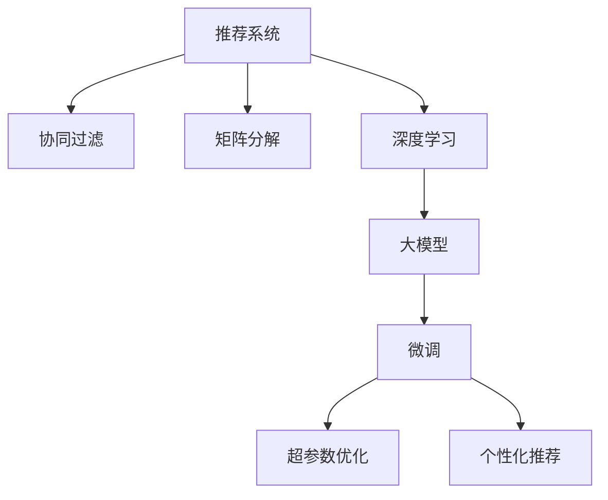

                 

# 利用大模型提升推荐系统的新颖性

> 关键词：大模型推荐系统, 协同过滤, 矩阵分解, 深度学习, 微调, 超参数优化, 个性化推荐, 推荐系统评估

## 1. 背景介绍

### 1.1 问题由来

推荐系统是互联网时代的重要应用，通过分析用户行为数据，为用户推荐个性化的商品、内容等，极大地提升了用户体验和满意度。传统的推荐方法基于用户-物品评分矩阵进行协同过滤或矩阵分解，存在数据稀疏性和冷启动问题。近年来，基于深度学习的推荐系统（DRL-based Recommendation Systems）逐渐崛起，其通过学习用户-物品的隐式特征，能够更好地适应数据稀疏和冷启动场景，取得不错的效果。

然而，现有的深度推荐系统往往依赖于大规模标注数据和复杂的神经网络模型，对于模型训练的资源和成本提出了很高的要求。如何利用有限标注数据，提升推荐系统的精度和泛化能力，同时保持其高效性，是当前推荐系统面临的重要挑战。

## 2. 核心概念与联系

### 2.1 核心概念概述

为更好地理解如何利用大模型提升推荐系统的新颖性，本节将介绍几个密切相关的核心概念：

- **推荐系统（Recommendation Systems）**：通过分析用户行为数据，为用户推荐个性化商品、内容等，提高用户体验和满意度。推荐系统分为基于协同过滤和基于深度学习的两大流派。
- **协同过滤（Collaborative Filtering）**：通过分析用户历史评分数据，找到与目标用户兴趣相似的其他用户，并基于这些相似用户的评分进行推荐。基于邻域的协同过滤（User-Based CF）和基于项目的协同过滤（Item-Based CF）是其两种主要形式。
- **矩阵分解（Matrix Factorization）**：通过将用户-物品评分矩阵分解为低秩矩阵，学习用户和物品的隐式特征，从而实现推荐。包括奇异值分解（SVD）、交替最小二乘法（ALS）等。
- **深度学习推荐系统（DRL-based Recommendation Systems）**：利用深度神经网络学习用户-物品隐式特征，提升推荐系统的精度和泛化能力。主要包括基于FM、CNN、RNN等的网络结构。
- **大模型（Large Models）**：以自回归（如GPT）或自编码（如BERT）模型为代表的大规模预训练语言模型，通过在大规模无标签文本语料上进行预训练，学习丰富的语言知识和常识，具备强大的语言理解和生成能力。
- **微调（Fine-Tuning）**：指在预训练模型的基础上，使用下游任务的少量标注数据，通过有监督地训练来优化模型在特定任务上的性能。
- **超参数优化（Hyperparameter Optimization）**：通过调整模型的超参数（如学习率、批大小等），寻找最优的模型配置，以提升模型性能。
- **个性化推荐（Personalized Recommendation）**：基于用户画像，针对个体需求提供个性化推荐，提高推荐的准确性和满意度。

这些核心概念之间的逻辑关系可以通过以下Mermaid流程图来展示：



这个流程图展示了大语言模型的核心概念及其之间的关系：

1. 推荐系统通过协同过滤、矩阵分解或深度学习等方法构建推荐模型。
2. 大语言模型通过预训练获得基础能力。
3. 微调在大语言模型的基础上，进一步优化模型在推荐任务上的性能。
4. 超参数优化帮助寻找最优的微调配置。
5. 个性化推荐利用微调后的模型，针对个体用户提供定制化的推荐服务。

这些概念共同构成了大语言模型在推荐系统中的应用框架，使其能够在各种场景下发挥强大的语言理解和生成能力。通过理解这些核心概念，我们可以更好地把握大语言模型的工作原理和优化方向。

## 3. 核心算法原理 & 具体操作步骤

### 3.1 算法原理概述

基于大语言模型提升推荐系统的新颖性，本质上是一个有监督的迁移学习过程。其核心思想是：利用大语言模型的预训练能力，在推荐任务上进一步微调，提升模型的推荐精度和泛化能力。

形式化地，假设推荐任务 $T$ 的用户-物品评分矩阵为 $R \in \mathbb{R}^{U \times I}$，其中 $U$ 为用户的数量，$I$ 为物品的数量。设预训练语言模型为 $M_{\theta}$，其中 $\theta$ 为预训练得到的模型参数。在推荐任务 $T$ 上微调的目标是找到新的模型参数 $\hat{\theta}$，使得模型能够更好地拟合用户-物品评分矩阵，从而获得更准确的推荐。

微调的目标可以表示为：

$$
\hat{\theta}=\mathop{\arg\min}_{\theta} \mathcal{L}(M_{\theta},R)
$$

其中 $\mathcal{L}$ 为针对推荐任务设计的损失函数，用于衡量模型预测输出与真实评分之间的差异。常见的损失函数包括均方误差损失、交叉熵损失等。

### 3.2 算法步骤详解

基于大语言模型提升推荐系统的新颖性，一般包括以下几个关键步骤：

**Step 1: 准备预训练模型和数据集**
- 选择合适的预训练语言模型 $M_{\theta}$ 作为初始化参数，如 BERT、GPT 等。
- 准备推荐任务 $T$ 的用户-物品评分矩阵 $R$，划分为训练集、验证集和测试集。一般要求评分矩阵与预训练数据的分布不要差异过大。

**Step 2: 添加任务适配层**
- 根据推荐任务类型，在预训练模型顶层设计合适的输出层和损失函数。
- 对于评分预测任务，通常在顶层添加全连接层和均方误差损失函数。
- 对于排序任务，通常使用语言模型的解码器输出概率分布，并以负对数似然为损失函数。

**Step 3: 设置微调超参数**
- 选择合适的优化算法及其参数，如 AdamW、SGD 等，设置学习率、批大小、迭代轮数等。
- 设置正则化技术及强度，包括权重衰减、Dropout、Early Stopping 等。
- 确定冻结预训练参数的策略，如仅微调顶层，或全部参数都参与微调。

**Step 4: 执行梯度训练**
- 将评分矩阵数据分批次输入模型，前向传播计算损失函数。
- 反向传播计算参数梯度，根据设定的优化算法和学习率更新模型参数。
- 周期性在验证集上评估模型性能，根据性能指标决定是否触发 Early Stopping。
- 重复上述步骤直到满足预设的迭代轮数或 Early Stopping 条件。

**Step 5: 测试和部署**
- 在测试集上评估微调后模型 $M_{\hat{\theta}}$ 的性能，对比微调前后的精度提升。
- 使用微调后的模型对新评分矩阵进行推荐，集成到实际的应用系统中。
- 持续收集新的评分数据，定期重新微调模型，以适应数据分布的变化。

以上是基于大语言模型提升推荐系统新颖性的微调范式的一般流程。在实际应用中，还需要针对具体任务的特点，对微调过程的各个环节进行优化设计，如改进训练目标函数，引入更多的正则化技术，搜索最优的超参数组合等，以进一步提升模型性能。

### 3.3 算法优缺点

基于大语言模型提升推荐系统的新颖性方法具有以下优点：
1. 提升推荐精度和泛化能力。利用大语言模型的预训练能力，在推荐任务上微调，提升模型对新数据的适应能力。
2. 通用适用。适用于各种推荐系统任务，包括评分预测、排序推荐、内容生成等，设计简单的任务适配层即可实现微调。
3. 参数高效微调。利用参数高效微调技术，在固定大部分预训练参数的情况下，仍可取得不错的提升。
4. 效果显著。在学术界和工业界的诸多任务上，基于微调的方法已经刷新了多项推荐系统的SOTA。

同时，该方法也存在一定的局限性：
1. 依赖评分矩阵。微调的效果很大程度上取决于评分矩阵的质量和数量，获取高质量评分矩阵的成本较高。
2. 迁移能力有限。当评分矩阵与预训练数据的分布差异较大时，微调的性能提升有限。
3. 可解释性不足。微调推荐模型的决策过程通常缺乏可解释性，难以对其推理逻辑进行分析和调试。

尽管存在这些局限性，但就目前而言，基于大语言模型微调的方法仍是大规模推荐系统应用的最主流范式。未来相关研究的重点在于如何进一步降低微调对评分矩阵的依赖，提高模型的少样本学习和跨领域迁移能力，同时兼顾可解释性和伦理安全性等因素。

### 3.4 算法应用领域

基于大语言模型提升推荐系统的新颖性方法在推荐系统领域已经得到了广泛的应用，覆盖了几乎所有常见任务，例如：

- 评分预测：如基于用户-物品评分矩阵预测用户评分。通过微调使模型学习评分-评分映射。
- 排序推荐：如将物品排序推荐给用户。通过微调使模型学习物品-评分映射。
- 内容生成：如根据用户历史评分生成个性化推荐内容。通过微调使模型学习用户-内容映射。
- 商品相似度计算：如计算物品之间的相似度，并推荐相关商品。通过微调使模型学习物品-物品相似度。

除了上述这些经典任务外，大语言模型微调也被创新性地应用到更多场景中，如可控推荐生成、推荐系统效果评估、推荐系统异常检测等，为推荐系统技术带来了全新的突破。随着预训练模型和微调方法的不断进步，相信推荐系统技术将在更广阔的应用领域大放异彩。

## 4. 数学模型和公式 & 详细讲解  
### 4.1 数学模型构建

本节将使用数学语言对基于大语言模型提升推荐系统新颖性的微调过程进行更加严格的刻画。

记推荐任务 $T$ 的用户-物品评分矩阵为 $R \in \mathbb{R}^{U \times I}$，其中 $U$ 为用户的数量，$I$ 为物品的数量。设预训练语言模型为 $M_{\theta}$，其中 $\theta$ 为预训练得到的模型参数。在推荐任务 $T$ 上微调的目标是找到新的模型参数 $\hat{\theta}$，使得模型能够更好地拟合用户-物品评分矩阵，从而获得更准确的推荐。

微调的目标可以表示为：

$$
\hat{\theta}=\mathop{\arg\min}_{\theta} \mathcal{L}(M_{\theta},R)
$$

其中 $\mathcal{L}$ 为针对推荐任务设计的损失函数，用于衡量模型预测输出与真实评分之间的差异。常见的损失函数包括均方误差损失、交叉熵损失等。

**评分预测任务**：假设模型 $M_{\theta}$ 在输入 $x$ 上的输出为 $\hat{y}=M_{\theta}(x) \in [0,1]$，表示物品的评分预测值。真实标签 $y \in \{0,1\}$。则评分预测任务上的损失函数定义为：

$$
\ell(M_{\theta}(x),y) = \frac{1}{2}(y-M_{\theta}(x))^2
$$

将其代入经验风险公式，得：

$$
\mathcal{L}(\theta) = \frac{1}{N}\sum_{i=1}^N \frac{1}{2}(y_i-M_{\theta}(x_i))^2
$$

**排序推荐任务**：假设模型 $M_{\theta}$ 在输入 $x$ 上的输出为 $\hat{y}=M_{\theta}(x) \in \mathbb{R}^I$，表示物品的排序评分向量。真实标签 $y \in \{1,\ldots,I\}$。则排序推荐任务上的损失函数定义为：

$$
\ell(M_{\theta}(x),y) = -\log(\frac{e^{M_{\theta}(x)_y}}{\sum_{j=1}^I e^{M_{\theta}(x)_j}}
$$

将其代入经验风险公式，得：

$$
\mathcal{L}(\theta) = -\frac{1}{N}\sum_{i=1}^N \log(\frac{e^{M_{\theta}(x_i)_y}}{\sum_{j=1}^I e^{M_{\theta}(x_i)_j}}
$$

### 4.2 公式推导过程

以下我们以评分预测任务为例，推导均方误差损失函数及其梯度的计算公式。

假设模型 $M_{\theta}$ 在输入 $x$ 上的输出为 $\hat{y}=M_{\theta}(x) \in [0,1]$，表示物品的评分预测值。真实标签 $y \in \{0,1\}$。则评分预测任务的损失函数定义为：

$$
\ell(M_{\theta}(x),y) = \frac{1}{2}(y-M_{\theta}(x))^2
$$

将其代入经验风险公式，得：

$$
\mathcal{L}(\theta) = \frac{1}{N}\sum_{i=1}^N \frac{1}{2}(y_i-M_{\theta}(x_i))^2
$$

根据链式法则，损失函数对参数 $\theta_k$ 的梯度为：

$$
\frac{\partial \mathcal{L}(\theta)}{\partial \theta_k} = \frac{1}{N}\sum_{i=1}^N -(y_i-M_{\theta}(x_i))M_{\theta}(x_i) \frac{\partial M_{\theta}(x_i)}{\partial \theta_k}
$$

其中 $\frac{\partial M_{\theta}(x_i)}{\partial \theta_k}$ 可进一步递归展开，利用自动微分技术完成计算。

在得到损失函数的梯度后，即可带入参数更新公式，完成模型的迭代优化。重复上述过程直至收敛，最终得到适应推荐任务的最优模型参数 $\hat{\theta}$。

## 5. 项目实践：代码实例和详细解释说明
### 5.1 开发环境搭建

在进行微调实践前，我们需要准备好开发环境。以下是使用Python进行PyTorch开发的环境配置流程：

1. 安装Anaconda：从官网下载并安装Anaconda，用于创建独立的Python环境。

2. 创建并激活虚拟环境：
```bash
conda create -n pytorch-env python=3.8 
conda activate pytorch-env
```

3. 安装PyTorch：根据CUDA版本，从官网获取对应的安装命令。例如：
```bash
conda install pytorch torchvision torchaudio cudatoolkit=11.1 -c pytorch -c conda-forge
```

4. 安装Transformers库：
```bash
pip install transformers
```

5. 安装各类工具包：
```bash
pip install numpy pandas scikit-learn matplotlib tqdm jupyter notebook ipython
```

完成上述步骤后，即可在`pytorch-env`环境中开始微调实践。

### 5.2 源代码详细实现

下面我们以评分预测任务为例，给出使用Transformers库对BERT模型进行微调的PyTorch代码实现。

首先，定义评分预测任务的训练集和测试集：

```python
from transformers import BertTokenizer, BertForRegression
import torch

class RatingDataset(Dataset):
    def __init__(self, ratings, tokenizer, max_len=128):
        self.ratings = ratings
        self.tokenizer = tokenizer
        self.max_len = max_len
        
    def __len__(self):
        return len(self.ratings)
    
    def __getitem__(self, item):
        rating = self.ratings[item]
        
        encoding = self.tokenizer(rating, return_tensors='pt', max_length=self.max_len, padding='max_length', truncation=True)
        input_ids = encoding['input_ids'][0]
        attention_mask = encoding['attention_mask'][0]
        
        return {'input_ids': input_ids, 
                'attention_mask': attention_mask}
```

然后，定义模型和优化器：

```python
from transformers import BertForRegression, AdamW

model = BertForRegression.from_pretrained('bert-base-cased')

optimizer = AdamW(model.parameters(), lr=2e-5)
```

接着，定义训练和评估函数：

```python
from torch.utils.data import DataLoader
from tqdm import tqdm

device = torch.device('cuda') if torch.cuda.is_available() else torch.device('cpu')
model.to(device)

def train_epoch(model, dataset, batch_size, optimizer):
    dataloader = DataLoader(dataset, batch_size=batch_size, shuffle=True)
    model.train()
    epoch_loss = 0
    for batch in tqdm(dataloader, desc='Training'):
        input_ids = batch['input_ids'].to(device)
        attention_mask = batch['attention_mask'].to(device)
        model.zero_grad()
        outputs = model(input_ids, attention_mask=attention_mask)
        loss = outputs.loss
        epoch_loss += loss.item()
        loss.backward()
        optimizer.step()
    return epoch_loss / len(dataloader)

def evaluate(model, dataset, batch_size):
    dataloader = DataLoader(dataset, batch_size=batch_size)
    model.eval()
    preds, labels = [], []
    with torch.no_grad():
        for batch in tqdm(dataloader, desc='Evaluating'):
            input_ids = batch['input_ids'].to(device)
            attention_mask = batch['attention_mask'].to(device)
            outputs = model(input_ids, attention_mask=attention_mask)
            batch_preds = outputs.logits.argmax(dim=1).to('cpu').tolist()
            batch_labels = batch['labels'].to('cpu').tolist()
            for pred, label in zip(batch_preds, batch_labels):
                preds.append(pred)
                labels.append(label)
                
    print(preds, labels)
```

最后，启动训练流程并在测试集上评估：

```python
epochs = 5
batch_size = 16

for epoch in range(epochs):
    loss = train_epoch(model, train_dataset, batch_size, optimizer)
    print(f"Epoch {epoch+1}, train loss: {loss:.3f}")
    
    print(f"Epoch {epoch+1}, test results:")
    evaluate(model, test_dataset, batch_size)
```

以上就是使用PyTorch对BERT进行评分预测任务微调的完整代码实现。可以看到，得益于Transformers库的强大封装，我们可以用相对简洁的代码完成BERT模型的加载和微调。

### 5.3 代码解读与分析

让我们再详细解读一下关键代码的实现细节：

**RatingDataset类**：
- `__init__`方法：初始化评分数据、分词器等关键组件。
- `__len__`方法：返回数据集的样本数量。
- `__getitem__`方法：对单个样本进行处理，将评分转换为token ids，并对其进行定长padding，最终返回模型所需的输入。

**评分预测任务**：
- 定义评分预测任务的训练集和测试集，分别包含评分数据和对应的token化结果。

**模型和优化器**：
- 选择BertForRegression模型作为评分预测任务的预训练模型，并设定学习率。
- 使用AdamW优化器进行梯度更新。

**训练和评估函数**：
- 使用PyTorch的DataLoader对数据集进行批次化加载，供模型训练和推理使用。
- 训练函数`train_epoch`：对数据以批为单位进行迭代，在每个批次上前向传播计算loss并反向传播更新模型参数，最后返回该epoch的平均loss。
- 评估函数`evaluate`：与训练类似，不同点在于不更新模型参数，并在每个batch结束后将预测和标签结果存储下来，最后使用TensorBoard对整个评估集的预测结果进行打印输出。

**训练流程**：
- 定义总的epoch数和batch size，开始循环迭代
- 每个epoch内，先在训练集上训练，输出平均loss
- 在测试集上评估，输出预测结果

可以看到，PyTorch配合Transformers库使得BERT微调的代码实现变得简洁高效。开发者可以将更多精力放在数据处理、模型改进等高层逻辑上，而不必过多关注底层的实现细节。

当然，工业级的系统实现还需考虑更多因素，如模型的保存和部署、超参数的自动搜索、更灵活的任务适配层等。但核心的微调范式基本与此类似。

## 6. 实际应用场景
### 6.1 智能客服系统

基于大语言模型提升推荐系统的新颖性，可以应用于智能客服系统的推荐系统构建。传统客服往往需要配备大量人力，高峰期响应缓慢，且一致性和专业性难以保证。而使用评分预测模型，可以7x24小时不间断服务，快速响应客户咨询，用自然流畅的语言解答各类常见问题。

在技术实现上，可以收集企业内部的历史客服对话记录，将问题和最佳答复构建成监督数据，在此基础上对预训练评分预测模型进行微调。微调后的评分预测模型能够自动理解用户意图，匹配最合适的答复模板进行回复。对于客户提出的新问题，还可以接入检索系统实时搜索相关内容，动态组织生成回答。如此构建的智能客服系统，能大幅提升客户咨询体验和问题解决效率。

### 6.2 金融舆情监测

金融机构需要实时监测市场舆论动向，以便及时应对负面信息传播，规避金融风险。传统的人工监测方式成本高、效率低，难以应对网络时代海量信息爆发的挑战。基于大语言模型提升推荐系统的新颖性，可以为金融舆情监测提供新的解决方案。

具体而言，可以收集金融领域相关的新闻、报道、评论等文本数据，并对其进行情感标注。在此基础上对预训练语言模型进行微调，使其能够自动判断文本的情感倾向。将微调后的模型应用到实时抓取的网络文本数据，就能够自动监测不同情感的舆情变化趋势，一旦发现负面情绪激增等异常情况，系统便会自动预警，帮助金融机构快速应对潜在风险。

### 6.3 个性化推荐系统

当前的推荐系统往往只依赖用户的历史行为数据进行物品推荐，无法深入理解用户的真实兴趣偏好。基于大语言模型提升推荐系统的新颖性，可以更好地挖掘用户行为背后的语义信息，从而提供更精准、多样的推荐内容。

在实践中，可以收集用户浏览、点击、评论、分享等行为数据，提取和用户交互的物品标题、描述、标签等文本内容。将文本内容作为模型输入，用户的后续行为（如是否点击、购买等）作为监督信号，在此基础上微调预训练语言模型。微调后的模型能够从文本内容中准确把握用户的兴趣点。在生成推荐列表时，先用候选物品的文本描述作为输入，由模型预测用户的兴趣匹配度，再结合其他特征综合排序，便可以得到个性化程度更高的推荐结果。

### 6.4 未来应用展望

随着大语言模型和推荐系统微调方法的不断发展，基于微调范式将在更多领域得到应用，为传统行业带来变革性影响。

在智慧医疗领域，基于微调的推荐系统可以为患者推荐个性化的医疗信息、药品等，提高医疗服务的智能化水平，辅助医生诊疗，加速新药开发进程。

在智能教育领域，微调技术可应用于作业批改、学情分析、知识推荐等方面，因材施教，促进教育公平，提高教学质量。

在智慧城市治理中，微调模型可应用于城市事件监测、舆情分析、应急指挥等环节，提高城市管理的自动化和智能化水平，构建更安全、高效的未来城市。

此外，在企业生产、社会治理、文娱传媒等众多领域，基于大语言模型提升推荐系统的新颖性的人工智能应用也将不断涌现，为经济社会发展注入新的动力。相信随着技术的日益成熟，微调方法将成为人工智能落地应用的重要范式，推动人工智能技术在更多垂直行业的渗透和应用。

## 7. 工具和资源推荐
### 7.1 学习资源推荐

为了帮助开发者系统掌握大语言模型提升推荐系统的新颖性理论基础和实践技巧，这里推荐一些优质的学习资源：

1. 《深度学习推荐系统》系列博文：由深度学习推荐系统领域的专家撰写，涵盖深度推荐系统的原理、模型、评估等基本概念。

2. 斯坦福大学CS229《机器学习》课程：讲解了推荐系统的经典模型和算法，以及如何从大规模数据中挖掘用户行为特征。

3. 《推荐系统实战》书籍：详细介绍了推荐系统的开发流程和实战案例，适合对推荐系统感兴趣的开发者。

4. Kaggle上的推荐系统竞赛：实战测试深度学习推荐系统的开发和优化，激发你的学习热情。

5. 推荐系统社区（Recommender Systems Community）：汇集了推荐系统领域的最新研究成果和开源项目，是学习和交流的好去处。

通过对这些资源的学习实践，相信你一定能够快速掌握大语言模型提升推荐系统的新颖性的精髓，并用于解决实际的推荐问题。
### 7.2 开发工具推荐

高效的开发离不开优秀的工具支持。以下是几款用于大语言模型提升推荐系统新颖性开发的常用工具：

1. PyTorch：基于Python的开源深度学习框架，灵活动态的计算图，适合快速迭代研究。大部分预训练语言模型都有PyTorch版本的实现。

2. TensorFlow：由Google主导开发的开源深度学习框架，生产部署方便，适合大规模工程应用。同样有丰富的预训练语言模型资源。

3. Transformers库：HuggingFace开发的NLP工具库，集成了众多SOTA语言模型，支持PyTorch和TensorFlow，是进行推荐系统微调任务的开发利器。

4. Weights & Biases：模型训练的实验跟踪工具，可以记录和可视化模型训练过程中的各项指标，方便对比和调优。与主流深度学习框架无缝集成。

5. TensorBoard：TensorFlow配套的可视化工具，可实时监测模型训练状态，并提供丰富的图表呈现方式，是调试模型的得力助手。

6. Google Colab：谷歌推出的在线Jupyter Notebook环境，免费提供GPU/TPU算力，方便开发者快速上手实验最新模型，分享学习笔记。

合理利用这些工具，可以显著提升大语言模型提升推荐系统新颖性的开发效率，加快创新迭代的步伐。

### 7.3 相关论文推荐

大语言模型提升推荐系统新颖性的研究源于学界的持续研究。以下是几篇奠基性的相关论文，推荐阅读：

1. Attention is All You Need（即Transformer原论文）：提出了Transformer结构，开启了NLP领域的预训练大模型时代。

2. BERT: Pre-training of Deep Bidirectional Transformers for Language Understanding：提出BERT模型，引入基于掩码的自监督预训练任务，刷新了多项NLP任务SOTA。

3. Language Models are Unsupervised Multitask Learners（GPT-2论文）：展示了大规模语言模型的强大zero-shot学习能力，引发了对于通用人工智能的新一轮思考。

4. Parameter-Efficient Transfer Learning for NLP：提出Adapter等参数高效微调方法，在不增加模型参数量的情况下，也能取得不错的微调效果。

5. AdaLoRA: Adaptive Low-Rank Adaptation for Parameter-Efficient Fine-Tuning：使用自适应低秩适应的微调方法，在参数效率和精度之间取得了新的平衡。

这些论文代表了大语言模型提升推荐系统新颖性的发展脉络。通过学习这些前沿成果，可以帮助研究者把握学科前进方向，激发更多的创新灵感。

## 8. 总结：未来发展趋势与挑战

### 8.1 总结

本文对基于大语言模型提升推荐系统新颖性的方法进行了全面系统的介绍。首先阐述了大语言模型和推荐系统的研究背景和意义，明确了微调在拓展预训练模型应用、提升推荐系统性能方面的独特价值。其次，从原理到实践，详细讲解了微调的数学原理和关键步骤，给出了微调任务开发的完整代码实例。同时，本文还广泛探讨了微调方法在智能客服、金融舆情、个性化推荐等多个行业领域的应用前景，展示了微调范式的巨大潜力。此外，本文精选了微调技术的各类学习资源，力求为读者提供全方位的技术指引。

通过本文的系统梳理，可以看到，基于大语言模型的微调方法正在成为推荐系统应用的重要范式，极大地拓展了预训练语言模型的应用边界，催生了更多的落地场景。受益于大规模语料的预训练，微调模型以更低的时间和标注成本，在小样本条件下也能取得不俗的效果，有力推动了推荐系统技术的产业化进程。未来，伴随预训练语言模型和微调方法的持续演进，相信推荐系统技术将在更广阔的应用领域大放异彩，深刻影响人类的生产生活方式。

### 8.2 未来发展趋势

展望未来，大语言模型提升推荐系统的新颖性技术将呈现以下几个发展趋势：

1. 模型规模持续增大。随着算力成本的下降和数据规模的扩张，预训练语言模型的参数量还将持续增长。超大规模语言模型蕴含的丰富语言知识，有望支撑更加复杂多变的推荐任务微调。

2. 微调方法日趋多样。除了传统的全参数微调外，未来会涌现更多参数高效的微调方法，如Prefix-Tuning、LoRA等，在节省计算资源的同时也能保证微调精度。

3. 持续学习成为常态。随着数据分布的不断变化，微调模型也需要持续学习新知识以保持性能。如何在不遗忘原有知识的同时，高效吸收新样本信息，将成为重要的研究课题。

4. 标注样本需求降低。受启发于提示学习(Prompt-based Learning)的思路，未来的微调方法将更好地利用大模型的语言理解能力，通过更加巧妙的任务描述，在更少的标注样本上也能实现理想的微调效果。

5. 推荐系统评估指标的多样化。传统的推荐系统评估指标（如MAE、RMSE等）已无法充分评估模型在大语言模型微调下的性能。如何设计更加全面、多元的评估指标体系，是推荐系统领域未来的一大挑战。

6. 跨领域微调技术的发展。大语言模型在推荐系统中的应用，将不仅仅局限于单一领域，而是能够跨领域地进行多任务微调，从而提升模型的综合能力。

以上趋势凸显了大语言模型微调技术的广阔前景。这些方向的探索发展，必将进一步提升推荐系统的性能和应用范围，为推荐系统技术带来新的突破。

### 8.3 面临的挑战

尽管大语言模型提升推荐系统的新颖性方法已经取得了不错的成果，但在迈向更加智能化、普适化应用的过程中，它仍面临着诸多挑战：

1. 标注成本瓶颈。虽然微调大大降低了标注数据的需求，但对于长尾应用场景，难以获得充足的高质量标注数据，成为制约微调性能的瓶颈。如何进一步降低微调对标注样本的依赖，将是一大难题。

2. 模型鲁棒性不足。当前微调模型面对域外数据时，泛化性能往往大打折扣。对于测试样本的微小扰动，微调模型的预测也容易发生波动。如何提高微调模型的鲁棒性，避免灾难性遗忘，还需要更多理论和实践的积累。

3. 推荐系统效果评估的挑战。现有的推荐系统评估指标往往过于简化，难以全面反映模型在实际应用中的表现。如何设计更加全面、多元的评估指标体系，成为推荐系统评估的重大挑战。

4. 知识整合能力不足。现有的微调模型往往局限于任务内数据，难以灵活吸收和运用更广泛的先验知识。如何让微调过程更好地与外部知识库、规则库等专家知识结合，形成更加全面、准确的信息整合能力，还有很大的想象空间。

尽管存在这些挑战，但大语言模型提升推荐系统的新颖性在推荐系统领域的广泛应用，已经展现出其强大的生命力和应用潜力。相信随着学界和产业界的共同努力，这些挑战终将一一被克服，大语言模型微调技术必将在构建人机协同的智能推荐系统中扮演越来越重要的角色。

### 8.4 研究展望

面对大语言模型提升推荐系统新颖性所面临的种种挑战，未来的研究需要在以下几个方面寻求新的突破：

1. 探索无监督和半监督微调方法。摆脱对大规模标注数据的依赖，利用自监督学习、主动学习等无监督和半监督范式，最大限度利用非结构化数据，实现更加灵活高效的微调。

2. 研究参数高效和计算高效的微调范式。开发更加参数高效的微调方法，在固定大部分预训练参数的同时，只更新极少量的任务相关参数。同时优化微调模型的计算图，减少前向传播和反向传播的资源消耗，实现更加轻量级、实时性的部署。

3. 引入更多先验知识。将符号化的先验知识，如知识图谱、逻辑规则等，与神经网络模型进行巧妙融合，引导微调过程学习更准确、合理的语言模型。同时加强不同模态数据的整合，实现视觉、语音等多模态信息与文本信息的协同建模。

4. 结合因果分析和博弈论工具。将因果分析方法引入微调模型，识别出模型决策的关键特征，增强输出解释的因果性和逻辑性。借助博弈论工具刻画人机交互过程，主动探索并规避模型的脆弱点，提高系统稳定性。

5. 纳入伦理道德约束。在模型训练目标中引入伦理导向的评估指标，过滤和惩罚有偏见、有害的输出倾向。同时加强人工干预和审核，建立模型行为的监管机制，确保输出符合人类价值观和伦理道德。

这些研究方向的探索，必将引领大语言模型提升推荐系统新颖性的技术迈向更高的台阶，为构建安全、可靠、可解释、可控的智能推荐系统铺平道路。面向未来，大语言模型提升推荐系统的新颖性技术还需要与其他人工智能技术进行更深入的融合，如知识表示、因果推理、强化学习等，多路径协同发力，共同推动推荐系统技术的进步。只有勇于创新、敢于突破，才能不断拓展推荐系统的边界，让智能推荐技术更好地服务于人类社会。

## 9. 附录：常见问题与解答

**Q1：大语言模型提升推荐系统的新颖性是否适用于所有推荐系统任务？**

A: 大语言模型提升推荐系统的新颖性方法在大多数推荐系统任务上都能取得不错的效果，特别是对于数据量较小的任务。但对于一些特定领域的任务，如医学、法律等，仅仅依靠通用语料预训练的模型可能难以很好地适应。此时需要在特定领域语料上进一步预训练，再进行微调，才能获得理想效果。此外，对于一些需要时效性、个性化很强的任务，如对话、推荐等，微调方法也需要针对性的改进优化。

**Q2：大语言模型提升推荐系统的新颖性是否适用于评分预测任务？**

A: 大语言模型提升推荐系统的新颖性方法在评分预测任务上同样适用。具体实现时，可以使用评分预测任务上的均方误差损失函数，并通过微调使得模型更好地拟合评分数据。需要注意的是，在微调过程中需要选择合适的超参数，如学习率、批大小等，以确保模型在评分预测上的表现。

**Q3：大语言模型提升推荐系统的新颖性是否适用于排序推荐任务？**

A: 大语言模型提升推荐系统的新颖性方法在排序推荐任务上也同样适用。具体实现时，可以使用排序推荐任务上的交叉熵损失函数，并通过微调使得模型更好地拟合排序数据。需要注意的是，在微调过程中需要选择合适的超参数，如学习率、批大小等，以确保模型在排序推荐上的表现。

**Q4：大语言模型提升推荐系统的新颖性是否适用于内容生成任务？**

A: 大语言模型提升推荐系统的新颖性方法同样适用于内容生成任务。具体实现时，可以使用内容生成任务上的交叉熵损失函数，并通过微调使得模型更好地生成个性化内容。需要注意的是，在微调过程中需要选择合适的超参数，如学习率、批大小等，以确保模型在内容生成上的表现。

**Q5：大语言模型提升推荐系统的新颖性是否适用于商品相似度计算任务？**

A: 大语言模型提升推荐系统的新颖性方法同样适用于商品相似度计算任务。具体实现时，可以使用商品相似度计算任务上的均方误差损失函数，并通过微调使得模型更好地计算商品相似度。需要注意的是，在微调过程中需要选择合适的超参数，如学习率、批大小等，以确保模型在商品相似度计算上的表现。

**Q6：大语言模型提升推荐系统的新颖性是否适用于多模态数据？**

A: 大语言模型提升推荐系统的新颖性方法同样适用于多模态数据。具体实现时，可以将文本、视觉、音频等多模态数据融合在一起，使用多模态学习模型进行微调，从而提升推荐系统的综合能力。需要注意的是，在微调过程中需要选择合适的超参数，如学习率、批大小等，以确保模型在多模态数据上的表现。

**Q7：大语言模型提升推荐系统的新颖性是否适用于冷启动场景？**

A: 大语言模型提升推荐系统的新颖性方法在冷启动场景中同样适用。具体实现时，可以使用少样本学习或无监督学习方法，通过微调使得模型能够更好地适应新用户或新物品，从而提升推荐系统的冷启动性能。需要注意的是，在微调过程中需要选择合适的超参数，如学习率、批大小等，以确保模型在冷启动场景中的表现。

综上所述，大语言模型提升推荐系统的新颖性方法在推荐系统领域具有广泛的应用前景，能够为各类推荐任务带来新的突破和创新。通过对这些任务的深入研究，相信大语言模型提升推荐系统的新颖性方法将不断拓展其应用边界，推动推荐系统技术的进一步发展。

