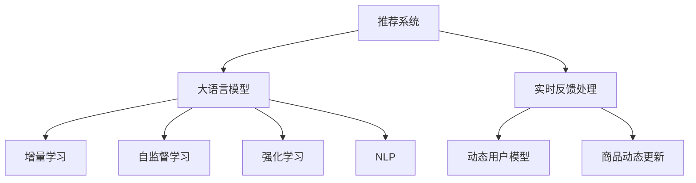

                 

# 利用大模型改进推荐系统的实时反馈处理

> 关键词：推荐系统, 实时反馈, 大语言模型, 增量学习, 自监督学习, 强化学习, 自然语言处理(NLP)

## 1. 背景介绍

### 1.1 问题由来
随着互联网和移动互联网的迅速发展，推荐系统已成为了各大平台提升用户体验和商业价值的重要手段。传统的推荐系统基于用户的兴趣模型和历史行为数据，通过相似性计算和协同过滤算法，为用户推荐感兴趣的商品、内容、服务。然而，这些推荐算法存在计算复杂度高、模型僵化、更新缓慢等问题。

近年来，随着深度学习和大规模预训练语言模型（Large Language Models, LLMs）的崛起，推荐系统开始探索利用这些模型来解决上述问题。具体来说，利用大语言模型可以捕获用户与商品之间的复杂语义关系，通过自监督学习方式学习用户偏好的高维向量表示，从而提升推荐系统的精准度和动态性。

### 1.2 问题核心关键点
如何有效地利用大语言模型进行推荐系统改进，实现实时反馈处理，成为了当前研究的热点。实时反馈处理指的是通过用户对推荐结果的即时互动，动态更新用户模型和商品信息，从而不断优化推荐策略，提升用户体验。

该问题的核心在于：
- 如何在大模型预训练-微调的过程中，融入实时反馈信息，以提升模型的动态适应性。
- 如何在大模型中建立动态用户模型，实时更新用户偏好，以适应变化的环境和行为。
- 如何在大模型中高效更新商品信息，实现商品属性动态演变和丰富，提升推荐精准度。

### 1.3 问题研究意义
利用大语言模型改进推荐系统的实时反馈处理，对于提升推荐系统的精准度、实时性和用户体验具有重要意义：

1. 精准度提升：大模型能够捕捉用户与商品之间的复杂语义关系，结合实时反馈信息，动态更新用户模型，能够更好地理解用户的真实需求和兴趣，从而提升推荐精准度。
2. 实时性增强：通过实时反馈，推荐系统能够迅速响应用户行为，快速调整推荐策略，提升用户体验和满意度。
3. 用户满意度提高：实时反馈能够及时发现用户的满意度变化，快速优化推荐内容，使用户获得更符合期望的推荐结果。
4. 系统可扩展性增强：大模型可以通过增量学习的方式，不断吸收新数据和新反馈，提升系统的可扩展性和适应性。

## 2. 核心概念与联系

### 2.1 核心概念概述

为更好地理解利用大模型改进推荐系统实时反馈处理的方法，本节将介绍几个密切相关的核心概念：

- 推荐系统（Recommendation System）：基于用户行为和商品属性，为用户推荐感兴趣的商品、内容或服务的系统。
- 大语言模型（Large Language Model, LLM）：通过在大规模无标签文本数据上自监督学习，学习通用语言表示的深度学习模型。
- 增量学习（Incremental Learning）：指在已有模型基础上，逐步加入新数据和新反馈，更新模型参数，提升模型性能的过程。
- 自监督学习（Self-Supervised Learning）：指在没有明确标签的情况下，通过预定义的任务（如掩码语言模型、预测上下文等），自动生成训练数据，训练深度学习模型。
- 强化学习（Reinforcement Learning, RL）：通过奖励反馈，指导模型进行优化决策，逐步提升模型性能的过程。
- 自然语言处理（Natural Language Processing, NLP）：研究计算机如何理解、处理和生成自然语言的技术。

这些核心概念之间的逻辑关系可以通过以下Mermaid流程图来展示：



这个流程图展示了大语言模型和推荐系统的核心概念及其之间的关系：

1. 推荐系统通过大语言模型获取用户的兴趣表示，推荐相应的商品。
2. 大语言模型通过增量学习、自监督学习和强化学习方式不断优化。
3. 实时反馈处理动态更新用户模型和商品信息，不断提升推荐效果。
4. 自然语言处理技术帮助理解和生成推荐文本，提升用户体验。

这些概念共同构成了利用大模型改进推荐系统的基础框架，使其能够更好地应对复杂多变的用户需求和商品信息。

## 3. 核心算法原理 & 具体操作步骤
### 3.1 算法原理概述

利用大模型改进推荐系统的实时反馈处理，本质上是一个通过实时反馈信息进行模型微调和更新的过程。其核心思想是：将大语言模型看作一个"知识图谱"，通过用户和商品的实时互动信息，动态更新模型中的用户偏好和商品属性，从而不断优化推荐结果。

形式化地，假设用户为 $U$，商品为 $I$，用户的实时反馈为 $F$，商品的属性信息为 $P$。初始化时，用户模型 $u$ 和商品模型 $i$ 由大模型预训练得到。微调过程通过动态更新用户模型和商品模型，逐步优化推荐策略。

微调的优化目标是最小化推荐误差，即：

$$
\hat{u}, \hat{i} = \mathop{\arg\min}_{u,i} \mathcal{L}(u,i,F)
$$

其中 $\mathcal{L}$ 为推荐误差损失函数，用于衡量推荐模型与用户真实行为之间的差异。常见的推荐误差损失函数包括均方误差、交叉熵损失等。

通过梯度下降等优化算法，微调过程不断更新用户模型 $u$ 和商品模型 $i$，最小化推荐误差损失函数 $\mathcal{L}$，使得推荐模型 $M$ 输出逼近真实行为。由于用户模型 $u$ 和商品模型 $i$ 已经通过预训练获得了较好的初始化，因此即便在实时反馈条件下进行微调，也能较快收敛到理想的模型参数。

### 3.2 算法步骤详解

基于大语言模型改进推荐系统的实时反馈处理一般包括以下几个关键步骤：

**Step 1: 准备预训练模型和数据集**
- 选择合适的预训练语言模型 $M_{\theta}$ 作为初始化参数，如 BERT、GPT 等。
- 准备推荐系统数据集，包括用户行为数据 $D=\{(x_i,y_i)\}_{i=1}^N$，其中 $x_i$ 表示用户对商品 $y_i$ 的交互行为，如点击、购买等。

**Step 2: 添加任务适配层**
- 根据任务类型，在预训练模型顶层设计合适的输出层和损失函数。
- 对于分类任务，通常在顶层添加线性分类器和交叉熵损失函数。
- 对于排序任务，通常使用语言模型的解码器输出概率分布，并以负对数似然为损失函数。

**Step 3: 设置微调超参数**
- 选择合适的优化算法及其参数，如 AdamW、SGD 等，设置学习率、批大小、迭代轮数等。
- 设置正则化技术及强度，包括权重衰减、Dropout、Early Stopping 等。
- 确定冻结预训练参数的策略，如仅微调顶层，或全部参数都参与微调。

**Step 4: 执行梯度训练**
- 将训练集数据分批次输入模型，前向传播计算损失函数。
- 反向传播计算参数梯度，根据设定的优化算法和学习率更新模型参数。
- 周期性在验证集上评估模型性能，根据性能指标决定是否触发 Early Stopping。
- 重复上述步骤直到满足预设的迭代轮数或 Early Stopping 条件。

**Step 5: 实时反馈处理**
- 收集用户的实时反馈信息 $F=\{f_i\}_{i=1}^N$，如点击次数、停留时间、评分等。
- 使用强化学习等方法，将反馈信息转换为模型可以理解的信号。
- 根据新收集的反馈信息，动态更新用户模型 $u$ 和商品模型 $i$。
- 重新执行梯度训练，以新模型参数为基础进行微调。
- 重复上述步骤，不断迭代更新，直至收敛。

以上是基于大语言模型改进推荐系统实时反馈处理的一般流程。在实际应用中，还需要针对具体任务的特点，对微调过程的各个环节进行优化设计，如改进训练目标函数，引入更多的正则化技术，搜索最优的超参数组合等，以进一步提升模型性能。

### 3.3 算法优缺点

利用大语言模型改进推荐系统的实时反馈处理，具有以下优点：
1. 动态性增强。通过实时反馈信息动态更新用户模型和商品信息，可以更好地适应用户行为和市场变化，提升推荐精准度。
2. 可扩展性提高。大模型可以通过增量学习的方式，不断吸收新数据和新反馈，实现系统的快速迭代和扩展。
3. 精度提升。大语言模型能够捕捉用户与商品之间的复杂语义关系，结合实时反馈信息，动态更新用户模型，能够更好地理解用户的真实需求和兴趣，从而提升推荐精度。
4. 用户满意度提高。实时反馈能够及时发现用户的满意度变化，快速优化推荐内容，使用户获得更符合期望的推荐结果。

同时，该方法也存在一定的局限性：
1. 计算复杂度高。实时反馈处理需要频繁更新模型参数，计算复杂度较高，对算力资源要求高。
2. 模型训练时间延长。实时反馈处理需要不断进行模型微调，训练时间较长，可能影响系统的实时性。
3. 反馈质量影响。实时反馈的质量直接影响到模型微调的效果，低质量反馈可能导致模型性能下降。
4. 数据隐私问题。实时反馈处理涉及用户隐私数据，数据收集和处理需要符合相关法律法规要求。

尽管存在这些局限性，但就目前而言，利用大语言模型改进推荐系统的实时反馈处理，仍然是大规模推荐系统优化的一个重要范式。未来相关研究的重点在于如何进一步降低计算复杂度，提高实时反馈处理的效率和效果，同时兼顾数据隐私和安全性等因素。

### 3.4 算法应用领域

利用大语言模型改进推荐系统的实时反馈处理，已经在多个推荐系统中得到了广泛应用，如电商推荐、音乐推荐、视频推荐、新闻推荐等，为推荐系统带来了显著的效果提升。

**电商推荐**
电商推荐系统通过利用大模型改进实时反馈处理，能够实时捕捉用户的购物行为和偏好，动态调整推荐内容，提升转化率和销售额。

**音乐推荐**
音乐推荐系统通过实时反馈处理，能够快速响应用户的听歌行为，推荐符合用户口味的音乐，提升用户满意度和粘性。

**视频推荐**
视频推荐系统通过实时反馈处理，能够及时调整推荐内容，推荐用户感兴趣的视频，提升用户的观看时间和观看体验。

**新闻推荐**
新闻推荐系统通过实时反馈处理，能够动态更新用户兴趣，推荐最新和用户感兴趣的新闻内容，提升用户的阅读量和互动性。

除了这些常见应用外，利用大语言模型改进推荐系统的实时反馈处理，还将在更多领域得到应用，如社交媒体推荐、广告推荐、商品推荐等，为推荐系统带来新的突破。

## 4. 数学模型和公式 & 详细讲解  
### 4.1 数学模型构建

本节将使用数学语言对利用大语言模型改进推荐系统实时反馈处理的过程进行更加严格的刻画。

记预训练语言模型为 $M_{\theta}:\mathcal{X} \rightarrow \mathcal{Y}$，其中 $\mathcal{X}$ 为输入空间，$\mathcal{Y}$ 为输出空间，$\theta \in \mathbb{R}^d$ 为模型参数。假设推荐系统的训练集为 $D=\{(x_i,y_i)\}_{i=1}^N$，其中 $x_i$ 表示用户对商品 $y_i$ 的交互行为，如点击、购买等。

定义推荐系统在用户行为数据上的推荐误差损失函数为 $\ell(M_{\theta}(x),y)$，则在数据集 $D$ 上的经验风险为：

$$
\mathcal{L}(\theta) = \frac{1}{N} \sum_{i=1}^N \ell(M_{\theta}(x_i),y_i)
$$

其中 $\ell$ 为推荐误差损失函数，用于衡量推荐模型与用户真实行为之间的差异。常见的推荐误差损失函数包括均方误差、交叉熵损失等。

### 4.2 公式推导过程

以下我们以二分类任务为例，推导推荐误差损失函数及其梯度的计算公式。

假设推荐系统推荐给用户 $x$ 商品的评分 $y$，模型预测的评分 $\hat{y}=M_{\theta}(x)$。则二分类交叉熵损失函数定义为：

$$
\ell(M_{\theta}(x),y) = -[y\log \hat{y} + (1-y)\log (1-\hat{y})]
$$

将其代入经验风险公式，得：

$$
\mathcal{L}(\theta) = -\frac{1}{N}\sum_{i=1}^N [y_i\log M_{\theta}(x_i)+(1-y_i)\log(1-M_{\theta}(x_i))]
$$

根据链式法则，推荐误差损失函数对参数 $\theta_k$ 的梯度为：

$$
\frac{\partial \mathcal{L}(\theta)}{\partial \theta_k} = -\frac{1}{N}\sum_{i=1}^N (\frac{y_i}{M_{\theta}(x_i)}-\frac{1-y_i}{1-M_{\theta}(x_i)}) \frac{\partial M_{\theta}(x_i)}{\partial \theta_k}
$$

其中 $\frac{\partial M_{\theta}(x_i)}{\partial \theta_k}$ 可进一步递归展开，利用自动微分技术完成计算。

在得到推荐误差损失函数的梯度后，即可带入参数更新公式，完成模型的迭代优化。重复上述过程直至收敛，最终得到适应推荐系统任务的模型参数 $\theta^*$。

## 5. 项目实践：代码实例和详细解释说明
### 5.1 开发环境搭建

在进行微调实践前，我们需要准备好开发环境。以下是使用Python进行PyTorch开发的环境配置流程：

1. 安装Anaconda：从官网下载并安装Anaconda，用于创建独立的Python环境。

2. 创建并激活虚拟环境：
```bash
conda create -n pytorch-env python=3.8 
conda activate pytorch-env
```

3. 安装PyTorch：根据CUDA版本，从官网获取对应的安装命令。例如：
```bash
conda install pytorch torchvision torchaudio cudatoolkit=11.1 -c pytorch -c conda-forge
```

4. 安装Transformers库：
```bash
pip install transformers
```

5. 安装各类工具包：
```bash
pip install numpy pandas scikit-learn matplotlib tqdm jupyter notebook ipython
```

完成上述步骤后，即可在`pytorch-env`环境中开始微调实践。

### 5.2 源代码详细实现

这里我们以电商推荐系统为例，给出使用Transformers库对BERT模型进行微调的PyTorch代码实现。

首先，定义电商推荐系统的数据处理函数：

```python
from transformers import BertTokenizer
from torch.utils.data import Dataset
import torch

class EcommDataset(Dataset):
    def __init__(self, texts, labels, tokenizer, max_len=128):
        self.texts = texts
        self.labels = labels
        self.tokenizer = tokenizer
        self.max_len = max_len
        
    def __len__(self):
        return len(self.texts)
    
    def __getitem__(self, item):
        text = self.texts[item]
        label = self.labels[item]
        
        encoding = self.tokenizer(text, return_tensors='pt', max_length=self.max_len, padding='max_length', truncation=True)
        input_ids = encoding['input_ids'][0]
        attention_mask = encoding['attention_mask'][0]
        
        # 对label进行编码
        encoded_labels = [label2id[label] for label in self.labels] 
        encoded_labels.extend([label2id['none']] * (self.max_len - len(encoded_labels)))
        labels = torch.tensor(encoded_labels, dtype=torch.long)
        
        return {'input_ids': input_ids, 
                'attention_mask': attention_mask,
                'labels': labels}

# 标签与id的映射
label2id = {'buy': 0, 'view': 1, 'cart': 2, 'none': 3}
id2label = {v: k for k, v in label2id.items()}

# 创建dataset
tokenizer = BertTokenizer.from_pretrained('bert-base-cased')

train_dataset = EcommDataset(train_texts, train_labels, tokenizer)
dev_dataset = EcommDataset(dev_texts, dev_labels, tokenizer)
test_dataset = EcommDataset(test_texts, test_labels, tokenizer)
```

然后，定义模型和优化器：

```python
from transformers import BertForTokenClassification, AdamW

model = BertForTokenClassification.from_pretrained('bert-base-cased', num_labels=len(label2id))

optimizer = AdamW(model.parameters(), lr=2e-5)
```

接着，定义训练和评估函数：

```python
from torch.utils.data import DataLoader
from tqdm import tqdm
from sklearn.metrics import classification_report

device = torch.device('cuda') if torch.cuda.is_available() else torch.device('cpu')
model.to(device)

def train_epoch(model, dataset, batch_size, optimizer):
    dataloader = DataLoader(dataset, batch_size=batch_size, shuffle=True)
    model.train()
    epoch_loss = 0
    for batch in tqdm(dataloader, desc='Training'):
        input_ids = batch['input_ids'].to(device)
        attention_mask = batch['attention_mask'].to(device)
        labels = batch['labels'].to(device)
        model.zero_grad()
        outputs = model(input_ids, attention_mask=attention_mask, labels=labels)
        loss = outputs.loss
        epoch_loss += loss.item()
        loss.backward()
        optimizer.step()
    return epoch_loss / len(dataloader)

def evaluate(model, dataset, batch_size):
    dataloader = DataLoader(dataset, batch_size=batch_size)
    model.eval()
    preds, labels = [], []
    with torch.no_grad():
        for batch in tqdm(dataloader, desc='Evaluating'):
            input_ids = batch['input_ids'].to(device)
            attention_mask = batch['attention_mask'].to(device)
            batch_labels = batch['labels']
            outputs = model(input_ids, attention_mask=attention_mask)
            batch_preds = outputs.logits.argmax(dim=2).to('cpu').tolist()
            batch_labels = batch_labels.to('cpu').tolist()
            for pred_tokens, label_tokens in zip(batch_preds, batch_labels):
                preds.append(pred_tokens[:len(label_tokens)])
                labels.append(label_tokens)
                
    print(classification_report(labels, preds))
```

最后，启动训练流程并在测试集上评估：

```python
epochs = 5
batch_size = 16

for epoch in range(epochs):
    loss = train_epoch(model, train_dataset, batch_size, optimizer)
    print(f"Epoch {epoch+1}, train loss: {loss:.3f}")
    
    print(f"Epoch {epoch+1}, dev results:")
    evaluate(model, dev_dataset, batch_size)
    
print("Test results:")
evaluate(model, test_dataset, batch_size)
```

以上就是使用PyTorch对BERT进行电商推荐任务微调的完整代码实现。可以看到，得益于Transformers库的强大封装，我们可以用相对简洁的代码完成BERT模型的加载和微调。

### 5.3 代码解读与分析

让我们再详细解读一下关键代码的实现细节：

**EcommDataset类**：
- `__init__`方法：初始化文本、标签、分词器等关键组件。
- `__len__`方法：返回数据集的样本数量。
- `__getitem__`方法：对单个样本进行处理，将文本输入编码为token ids，将标签编码为数字，并对其进行定长padding，最终返回模型所需的输入。

**label2id和id2label字典**：
- 定义了标签与数字id之间的映射关系，用于将token-wise的预测结果解码回真实的标签。

**训练和评估函数**：
- 使用PyTorch的DataLoader对数据集进行批次化加载，供模型训练和推理使用。
- 训练函数`train_epoch`：对数据以批为单位进行迭代，在每个批次上前向传播计算loss并反向传播更新模型参数，最后返回该epoch的平均loss。
- 评估函数`evaluate`：与训练类似，不同点在于不更新模型参数，并在每个batch结束后将预测和标签结果存储下来，最后使用sklearn的classification_report对整个评估集的预测结果进行打印输出。

**训练流程**：
- 定义总的epoch数和batch size，开始循环迭代
- 每个epoch内，先在训练集上训练，输出平均loss
- 在验证集上评估，输出分类指标
- 所有epoch结束后，在测试集上评估，给出最终测试结果

可以看到，PyTorch配合Transformers库使得BERT微调的代码实现变得简洁高效。开发者可以将更多精力放在数据处理、模型改进等高层逻辑上，而不必过多关注底层的实现细节。

当然，工业级的系统实现还需考虑更多因素，如模型的保存和部署、超参数的自动搜索、更灵活的任务适配层等。但核心的微调范式基本与此类似。

## 6. 实际应用场景
### 6.1 实时推荐
利用大语言模型改进推荐系统的实时反馈处理，可以实现实时推荐，快速响应用户行为，提升推荐精准度和用户体验。

在电商平台中，推荐系统可以实时捕捉用户点击、浏览、加入购物车等行为，动态调整推荐内容，推荐用户感兴趣的商品。例如，用户浏览某一类商品时，推荐系统可以实时捕捉用户行为，推荐该类商品中的热门单品，提升用户的购买意愿。

### 6.2 个性化推荐
利用大语言模型改进推荐系统的实时反馈处理，可以实现个性化推荐，根据用户的即时反馈动态更新用户模型，提升推荐精准度。

在音乐推荐系统中，用户每次听歌后都会产生反馈，推荐系统可以实时捕捉用户的听歌行为，动态调整推荐策略。例如，用户喜欢某首推荐的歌曲，推荐系统可以进一步推荐该歌手的其他歌曲，甚至类似风格的歌曲。

### 6.3 多模态推荐
利用大语言模型改进推荐系统的实时反馈处理，可以实现多模态推荐，将文本、图像、音频等多种模态数据融合，提升推荐效果。

在视频推荐系统中，用户每次观看视频后都会产生反馈，推荐系统可以实时捕捉用户行为，动态调整推荐策略。例如，用户观看某个视频后产生了正面反馈，推荐系统可以进一步推荐该视频作者的相似作品，甚至推荐其他用户对该视频的评价。

### 6.4 未来应用展望

随着大语言模型和实时反馈处理技术的不断发展，基于大模型改进推荐系统的实时反馈处理，将在更多领域得到应用，为推荐系统带来新的突破。

在智慧医疗领域，推荐系统可以利用实时反馈处理，动态调整推荐策略，推荐符合用户健康需求的医疗信息，提升用户的健康管理效果。

在智能教育领域，推荐系统可以实时捕捉学生的学习行为，动态调整推荐内容，推荐适合学生知识水平和学习兴趣的学习资源，提升学生的学习效果。

在智慧城市治理中，推荐系统可以实时捕捉市民的反馈信息，动态调整推荐策略，推荐符合市民需求的服务和活动，提升市民的满意度和幸福感。

此外，在企业生产、社会治理、文娱传媒等众多领域，基于大模型改进推荐系统的实时反馈处理，也将不断涌现，为推荐系统带来新的应用场景和发展方向。相信随着技术的日益成熟，实时反馈处理将成为推荐系统的重要组成部分，进一步提升用户推荐体验和满意度。

## 7. 工具和资源推荐
### 7.1 学习资源推荐

为了帮助开发者系统掌握大语言模型改进推荐系统的实时反馈处理，这里推荐一些优质的学习资源：

1. 《深度学习推荐系统：理论、算法与应用》书籍：介绍深度学习推荐系统的基本概念、算法和应用，适合初学者入门。

2. 《Reinforcement Learning: An Introduction》书籍：介绍强化学习的原理和算法，适合对实时反馈处理有兴趣的读者深入学习。

3. 《自然语言处理与深度学习》课程：由斯坦福大学开设的NLP课程，讲解自然语言处理的基本原理和深度学习在NLP中的应用。

4. 《推荐系统实战》书籍：介绍推荐系统的基本概念和实用技术，适合工程实践的开发者参考。

5. Weights & Biases：模型训练的实验跟踪工具，可以记录和可视化模型训练过程中的各项指标，方便对比和调优。与主流深度学习框架无缝集成。

6. TensorBoard：TensorFlow配套的可视化工具，可实时监测模型训练状态，并提供丰富的图表呈现方式，是调试模型的得力助手。

通过对这些资源的学习实践，相信你一定能够快速掌握大语言模型改进推荐系统的实时反馈处理精髓，并用于解决实际的推荐问题。
###  7.2 开发工具推荐

高效的开发离不开优秀的工具支持。以下是几款用于大语言模型改进推荐系统实时反馈处理开发的常用工具：

1. PyTorch：基于Python的开源深度学习框架，灵活动态的计算图，适合快速迭代研究。大部分预训练语言模型都有PyTorch版本的实现。

2. TensorFlow：由Google主导开发的开源深度学习框架，生产部署方便，适合大规模工程应用。同样有丰富的预训练语言模型资源。

3. Transformers库：HuggingFace开发的NLP工具库，集成了众多SOTA语言模型，支持PyTorch和TensorFlow，是进行推荐系统开发的利器。

4. Weights & Biases：模型训练的实验跟踪工具，可以记录和可视化模型训练过程中的各项指标，方便对比和调优。与主流深度学习框架无缝集成。

5. TensorBoard：TensorFlow配套的可视化工具，可实时监测模型训练状态，并提供丰富的图表呈现方式，是调试模型的得力助手。

6. Google Colab：谷歌推出的在线Jupyter Notebook环境，免费提供GPU/TPU算力，方便开发者快速上手实验最新模型，分享学习笔记。

合理利用这些工具，可以显著提升大语言模型改进推荐系统的实时反馈处理开发效率，加快创新迭代的步伐。

### 7.3 相关论文推荐

大语言模型和实时反馈处理技术的发展源于学界的持续研究。以下是几篇奠基性的相关论文，推荐阅读：

1. Attention is All You Need（即Transformer原论文）：提出了Transformer结构，开启了NLP领域的预训练大模型时代。

2. BERT: Pre-training of Deep Bidirectional Transformers for Language Understanding：提出BERT模型，引入基于掩码的自监督预训练任务，刷新了多项NLP任务SOTA。

3. Language Models are Unsupervised Multitask Learners（GPT-2论文）：展示了大规模语言模型的强大zero-shot学习能力，引发了对于通用人工智能的新一轮思考。

4. Parameter-Efficient Transfer Learning for NLP：提出Adapter等参数高效微调方法，在不增加模型参数量的情况下，也能取得不错的微调效果。

5. Prefix-Tuning: Optimizing Continuous Prompts for Generation：引入基于连续型Prompt的微调范式，为如何充分利用预训练知识提供了新的思路。

6. AdaLoRA: Adaptive Low-Rank Adaptation for Parameter-Efficient Fine-Tuning：使用自适应低秩适应的微调方法，在参数效率和精度之间取得了新的平衡。

这些论文代表了大语言模型改进推荐系统实时反馈处理的发展脉络。通过学习这些前沿成果，可以帮助研究者把握学科前进方向，激发更多的创新灵感。

## 8. 总结：未来发展趋势与挑战

### 8.1 总结

本文对利用大模型改进推荐系统的实时反馈处理进行了全面系统的介绍。首先阐述了推荐系统和大语言模型的研究背景和意义，明确了实时反馈处理在提升推荐系统动态性和精准度方面的独特价值。其次，从原理到实践，详细讲解了实时反馈处理的数学原理和关键步骤，给出了推荐系统微调的完整代码实例。同时，本文还广泛探讨了实时反馈处理在电商推荐、音乐推荐、视频推荐等多个行业领域的应用前景，展示了实时反馈处理的广阔前景。此外，本文精选了实时反馈处理技术的各类学习资源，力求为读者提供全方位的技术指引。

通过本文的系统梳理，可以看到，利用大模型改进推荐系统的实时反馈处理，能够更好地应对复杂多变的用户需求和商品信息，动态更新推荐策略，提升推荐精准度和实时性，为用户带来更好的体验。未来，伴随大语言模型和实时反馈处理技术的持续演进，基于大模型改进推荐系统的实时反馈处理必将成为推荐系统优化的一个重要方向，推动推荐系统的智能化和动态化发展。

### 8.2 未来发展趋势

展望未来，利用大语言模型改进推荐系统的实时反馈处理将呈现以下几个发展趋势：

1. 动态性增强。通过实时反馈信息动态更新用户模型和商品信息，可以更好地适应用户行为和市场变化，提升推荐精准度。
2. 可扩展性提高。大模型可以通过增量学习的方式，不断吸收新数据和新反馈，实现系统的快速迭代和扩展。
3. 精度提升。大语言模型能够捕捉用户与商品之间的复杂语义关系，结合实时反馈信息，动态更新用户模型，能够更好地理解用户的真实需求和兴趣，从而提升推荐精度。
4. 用户满意度提高。实时反馈能够及时发现用户的满意度变化，快速优化推荐内容，使用户获得更符合期望的推荐结果。

以上趋势凸显了利用大语言模型改进推荐系统实时反馈处理技术的广阔前景。这些方向的探索发展，必将进一步提升推荐系统的性能和实时性，为推荐系统带来新的突破。

### 8.3 面临的挑战

尽管利用大语言模型改进推荐系统的实时反馈处理技术已经取得了瞩目成就，但在迈向更加智能化、普适化应用的过程中，它仍面临着诸多挑战：

1. 计算复杂度高。实时反馈处理需要频繁更新模型参数，计算复杂度较高，对算力资源要求高。
2. 模型训练时间延长。实时反馈处理需要不断进行模型微调，训练时间较长，可能影响系统的实时性。
3. 反馈质量影响。实时反馈的质量直接影响到模型微调的效果，低质量反馈可能导致模型性能下降。
4. 数据隐私问题。实时反馈处理涉及用户隐私数据，数据收集和处理需要符合相关法律法规要求。

尽管存在这些局限性，但就目前而言，利用大语言模型改进推荐系统的实时反馈处理，仍然是大规模推荐系统优化的一个重要范式。未来相关研究的重点在于如何进一步降低计算复杂度，提高实时反馈处理的效率和效果，同时兼顾数据隐私和安全性等因素。

### 8.4 研究展望

面对利用大语言模型改进推荐系统的实时反馈处理所面临的种种挑战，未来的研究需要在以下几个方面寻求新的突破：

1. 探索无监督和半监督微调方法。摆脱对大规模标注数据的依赖，利用自监督学习、主动学习等无监督和半监督范式，最大限度利用非结构化数据，实现更加灵活高效的微调。
2. 研究参数高效和计算高效的微调范式。开发更加参数高效的微调方法，在固定大部分预训练参数的同时，只更新极少量的任务相关参数。同时优化微调模型的计算图，减少前向传播和反向传播的资源消耗，实现更加轻量级、实时性的部署。
3. 引入更多先验知识。将符号化的先验知识，如知识图谱、逻辑规则等，与神经网络模型进行巧妙融合，引导微调过程学习更准确、合理的语言模型。同时加强不同模态数据的整合，实现视觉、语音等多模态信息与文本信息的协同建模。
4. 结合因果分析和博弈论工具。将因果分析方法引入微调模型，识别出模型决策的关键特征，增强输出解释的因果性和逻辑性。借助博弈论工具刻画人机交互过程，主动探索并规避模型的脆弱点，提高系统稳定性。
5. 纳入伦理道德约束。在模型训练目标中引入伦理导向的评估指标，过滤和惩罚有偏见、有害的输出倾向。同时加强人工干预和审核，建立模型行为的监管机制，确保输出符合人类价值观和伦理道德。

这些研究方向的探索，必将引领利用大语言模型改进推荐系统的实时反馈处理技术迈向更高的台阶，为构建安全、可靠、可解释、可控的智能系统铺平道路。面向未来，大语言模型改进推荐系统实时反馈处理技术还需要与其他人工智能技术进行更深入的融合，如知识表示、因果推理、强化学习等，多路径协同发力，共同推动自然语言理解和智能交互系统的进步。只有勇于创新、敢于突破，才能不断拓展语言模型的边界，让智能技术更好地造福人类社会。

## 9. 附录：常见问题与解答
**Q1：实时反馈处理如何提高推荐系统的精准度？**

A: 实时反馈处理通过捕捉用户的即时行为，动态更新用户模型和商品信息，从而及时调整推荐策略。例如，用户点击某一商品后，推荐系统可以根据用户点击行为，动态调整推荐该类商品中的热门单品，提升推荐精准度。

**Q2：实时反馈处理的计算复杂度较高，如何降低？**

A: 实时反馈处理可以通过参数高效微调、增量学习等方法，减少模型的计算复杂度。例如，可以仅微调模型的一部分参数，而不是全部参数，同时定期更新模型，避免一次性计算大量数据。

**Q3：实时反馈处理如何保证推荐系统的实时性？**

A: 实时反馈处理可以采用分布式计算、异步训练等方法，提高系统的并发处理能力，从而提升推荐系统的实时性。同时，可以使用缓存技术，将部分常用数据预处理缓存，减少实时计算开销。

**Q4：实时反馈处理如何保护用户隐私？**

A: 实时反馈处理需要严格遵守用户隐私保护法规，如GDPR、CCPA等，确保用户数据的安全性和匿名性。同时，可以使用差分隐私技术，对用户数据进行隐私保护，防止数据泄露和滥用。

**Q5：实时反馈处理如何平衡推荐效果和系统性能？**

A: 实时反馈处理需要权衡推荐效果和系统性能，尽可能减少计算和存储开销。例如，可以使用轻量级模型结构，减少前向传播和反向传播的资源消耗，优化模型的推理速度。

**Q6：实时反馈处理如何保证推荐系统的公平性？**

A: 实时反馈处理需要引入公平性指标，如均等性、多样性等，确保推荐结果的公平性。同时，可以通过模型权重调整，避免推荐模型对某些群体的过度偏袒。

通过以上回答，相信你对实时反馈处理有了更加清晰的认识，并能够在实际应用中灵活应用。利用大语言模型改进推荐系统的实时反馈处理，将为推荐系统带来新的突破，提升用户体验和推荐效果。

