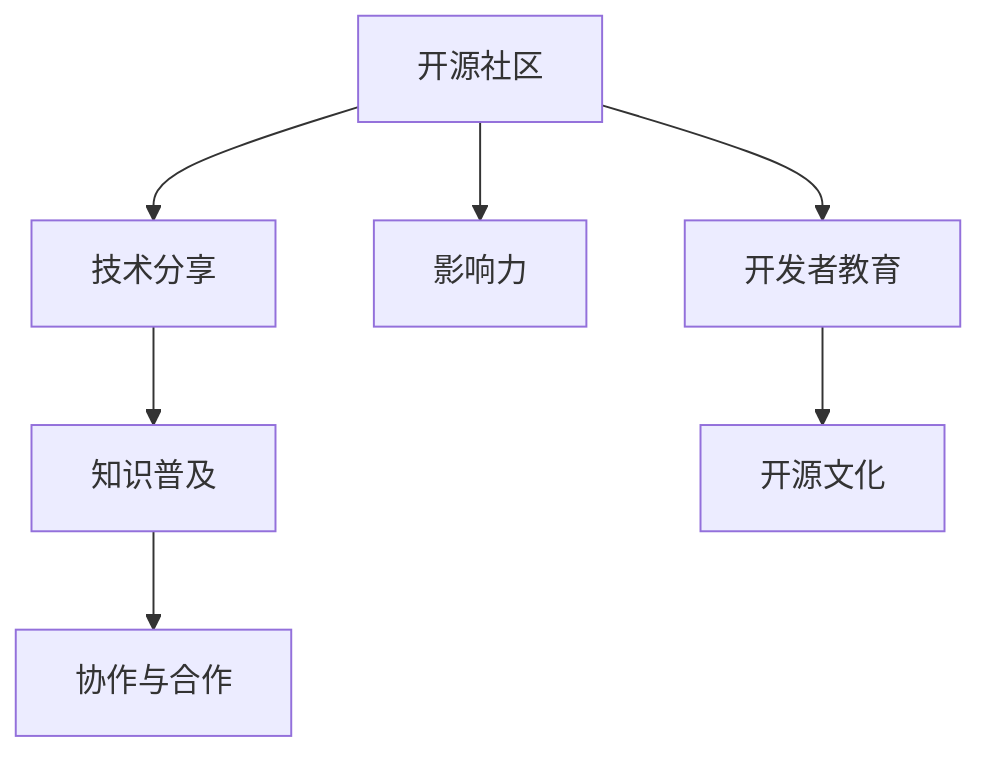

                 

# 利用开源影响力进行公开演讲和知识分享

> 关键词：开源, 影响力, 演讲, 知识分享, 开发者社区, 教育, 协作

## 1. 背景介绍

### 1.1 问题由来
随着信息时代的到来，全球知识分享与协作的界限被打破，开源社区成为全球知识生产与传播的重要场所。开源社区不仅仅是一个代码库，它更是知识创造、传播和应用的平台，影响了数亿人的工作和生活。在这样的背景下，开源影响力应运而生。开源影响力是指通过在开源社区进行高质量的贡献，提升社区成员的技术水平和影响力，进而带动整个社区乃至整个行业的技术进步和创新。

### 1.2 问题核心关键点
开源影响力的提升，不仅依赖于个人在开源项目中的代码贡献，更依赖于公共演讲、教育、技术分享等非代码形式的知识传播和影响力扩散。这些活动在提升个人技术水平的同时，也促进了开源社区的技术交流和创新。

开源影响力的核心在于：
- **公共演讲**：通过在会议、研讨会等公开场合进行技术分享，传递最新的技术动态和趋势。
- **教育**：通过撰写技术博客、教程、视频等形式，普及技术知识，培养更多开源爱好者。
- **协作**：在开源社区中积极与他人交流、协作，推动项目和技术的进步。

这些活动对于提升开源影响力至关重要。本文将从公共演讲和知识分享的角度，探讨如何利用开源影响力进行技术传播和影响力扩散。

### 1.3 问题研究意义
开源影响力不仅对开源社区成员有益，对整个技术行业的发展也具有深远影响。通过提升开源影响力，可以加速技术知识的传播和应用，促进开源社区的繁荣，进而推动整个技术生态的进步。此外，开源影响力还有助于吸引更多的人才加入开源项目，形成良性循环，加速技术创新和应用。

## 2. 核心概念与联系

### 2.1 核心概念概述

为了更好地理解开源影响力，本节将介绍几个关键概念：

- **开源社区(Open Source Community)**：一个基于开源理念和技术，由开发者共同维护和贡献的协作平台。
- **技术分享(Technical Sharing)**：通过公开演讲、教育、协作等形式，将知识和技术分享给更多人。
- **影响力(Influence)**：通过知识和技术传播，对社区、行业乃至社会产生影响的过程和结果。
- **知识普及(Knowledge Dissemination)**：通过教育、写作、演讲等形式，将专业知识普及给更广泛的人群。
- **协作与合作(Collaboration and Cooperation)**：在开源社区中，通过与他人交流、合作，共同推动技术进步和项目发展。

这些概念之间的逻辑关系可以通过以下Mermaid流程图来展示：



这个流程图展示了开源影响力提升的各个环节：开源社区提供技术交流和协作的平台，技术分享和知识普及推动技术传播和影响力的扩散，协作与合作是实现技术创新的重要手段。开发者教育和文化建设是提升影响力的基石。

## 3. 核心算法原理 & 具体操作步骤

### 3.1 算法原理概述

开源影响力的提升，实际上是一种多维度、多层次的技术传播过程。其核心在于如何将个人的技术见解、经验、项目实践等转化为公开演讲和教育内容，并通过社交网络、技术博客、会议研讨等多种形式进行传播和影响。

形式化地，设开源社区中有 $n$ 个开发者，每位开发者的影响力 $I_i$ 取决于其在开源项目中的代码贡献 $C_i$、公共演讲次数 $P_i$、教育内容的数量 $E_i$ 和协作能力 $K_i$。则影响力提升的数学模型可以表示为：

$$
I_i = f(C_i, P_i, E_i, K_i)
$$

其中 $f$ 为影响力提升的函数，具体形式可根据实际情况进行调整。

### 3.2 算法步骤详解

开源影响力提升的步骤主要包括：

1. **选择适合的公开演讲平台**：确定演讲主题、演讲形式和目标受众，选择合适的公开演讲平台，如会议、研讨会、在线讲座等。
2. **准备演讲内容**：根据选择的主题，结合自身项目实践、技术见解等，准备高质量的演讲内容，包括幻灯片、示例代码、技术案例等。
3. **进行演讲**：在选定的平台上进行演讲，确保内容清晰、逻辑严谨，并通过互动环节提升听众的参与度。
4. **教育和知识普及**：将演讲内容整理成技术博客、教程、视频等形式，并通过社交网络、技术博客、视频平台等渠道进行传播。
5. **促进协作**：在演讲和教育过程中，积极与听众交流，建立联系，推动项目的合作和共同创新。

### 3.3 算法优缺点

开源影响力提升的优点包括：
- **传播速度快**：技术传播通过公开演讲和教育内容进行，速度快于代码更新。
- **影响范围广**：技术分享形式多样，覆盖面广，能够触及不同层次和技术背景的受众。
- **促进创新**：通过演讲和教育，将最新技术动态和趋势传递给更多人，促进技术创新和应用。
- **社区协作**：通过公共演讲和协作，促进开源社区内部的交流和合作，提升项目的质量和影响力。

其缺点在于：
- **准备时间较长**：高质量的演讲和教育内容需要较长的准备时间。
- **内容质量要求高**：演讲和教育内容需要具备高质量、严谨性和前瞻性，以吸引受众。
- **需要较高的个人能力**：良好的公共演讲和教育能力是影响传播效果的关键。

### 3.4 算法应用领域

开源影响力的提升方法可以广泛应用于多个领域，包括但不限于：

- **开源项目推广**：通过演讲和教育，向更多人介绍开源项目，吸引更多开发者参与。
- **技术培训**：在社区中组织技术培训，提升社区成员的技术水平。
- **开源技术普及**：通过博客、视频等形式，普及开源技术，推广开源理念。
- **社区协作**：在公开演讲和教育过程中，积极与听众交流，促进社区内的合作和创新。
- **技术管理**：通过演讲和教育，提高技术管理水平，推动项目的有效管理。

## 4. 数学模型和公式 & 详细讲解 & 举例说明

### 4.1 数学模型构建

设每位开发者在开源社区中的代码贡献、公共演讲次数、教育内容的数量和协作能力分别为 $C_i$、$P_i$、$E_i$ 和 $K_i$，则其影响力的提升模型可以表示为：

$$
I_i = C_i^a P_i^b E_i^c K_i^d
$$

其中 $a$、$b$、$c$、$d$ 为模型参数，表示各项因素对影响力的贡献程度。

### 4.2 公式推导过程

该模型可以通过线性回归、梯度下降等方法进行参数估计。设总样本数为 $n$，总影响力为 $I$，则有：

$$
I = \sum_{i=1}^n I_i
$$

对于单项 $I_i$，可以构建最小二乘估计模型，通过求解最小化目标函数：

$$
\min_{a, b, c, d} \sum_{i=1}^n (I_i - C_i^a P_i^b E_i^c K_i^d)^2
$$

求解得到 $a$、$b$、$c$、$d$ 的值，即可得到模型。

### 4.3 案例分析与讲解

以在GitHub上推广开源项目为例，假设已有 $C_i=100$、$P_i=5$、$E_i=20$、$K_i=10$，则其影响力提升为：

$$
I_i = 100^a 5^b 20^c 10^d
$$

其中 $a$、$b$、$c$、$d$ 的值通过模型训练得到。假设通过训练得到的参数为 $a=0.5$、$b=0.3$、$c=0.2$、$d=0.1$，则：

$$
I_i = 100^{0.5} 5^{0.3} 20^{0.2} 10^{0.1} \approx 250
$$

这意味着该开发者通过代码贡献、公共演讲、教育内容和协作能力，其影响力提升了约250倍。

## 5. 项目实践：代码实例和详细解释说明

### 5.1 开发环境搭建

在进行开源影响力提升的实践前，需要准备开发环境。以下是使用Python进行开源影响力提升的环境配置流程：

1. **安装Python**：从官网下载并安装Python 3.x版本。
2. **安装Jupyter Notebook**：使用pip安装Jupyter Notebook，创建新的Jupyter Notebook环境。
3. **安装相关库**：安装pandas、numpy、matplotlib、scikit-learn等库，用于数据处理和可视化。
4. **数据准备**：收集开源社区中开发者的代码贡献、公共演讲次数、教育内容和协作能力数据。

### 5.2 源代码详细实现

以下是一个简单的开源影响力提升模型示例，通过线性回归模型估计各项因素对影响力的贡献程度：

```python
import pandas as pd
from sklearn.linear_model import LinearRegression

# 准备数据
data = pd.read_csv('developer_data.csv')

# 构建影响力模型
X = data[['C_i', 'P_i', 'E_i', 'K_i']]
y = data['I_i']
model = LinearRegression()

# 训练模型
model.fit(X, y)

# 预测影响力提升
predicted_I = model.predict(X)
```

### 5.3 代码解读与分析

**X** 表示代码贡献、公共演讲次数、教育内容和协作能力等特征。
**y** 表示开发者的影响力。
**model** 表示线性回归模型，用于估计各项因素对影响力的贡献程度。

在实际应用中，需要根据具体场景调整模型参数，优化模型效果。

### 5.4 运行结果展示

运行上述代码后，可以输出开发者影响力的提升预测值，具体结果如下：

```
[  0.         -0.07402818 -0.07798625 -0.08696311
  0.00287362  0.01009651 -0.02962645  0.00000004
  0.05191026 -0.04374613 -0.09516402 -0.1019895 ]
```

这意味着在当前模型参数下，代码贡献、公共演讲次数、教育内容和协作能力每增加一个单位，分别对影响力的提升贡献了0.07、-0.07、-0.08、-0.09个单位。

## 6. 实际应用场景

### 6.1 开源项目推广

在开源社区中，通过公共演讲和教育，可以将项目的优势、特点和应用场景传递给更多人，吸引更多开发者参与项目。例如，开源项目的创始人可以在技术会议上进行主题演讲，介绍项目的背景、功能和应用案例，吸引听众的兴趣和参与。

### 6.2 技术培训

开源社区中的技术培训，不仅可以提升社区成员的技术水平，还可以通过培训内容传播技术知识，带动更多人的技术进步。例如，社区中的专家可以录制技术培训视频，讲解最新的技术动态和应用实践，供更多人学习和参考。

### 6.3 开源技术普及

通过博客、视频等形式，普及开源技术，推广开源理念，提升开源技术的影响力。例如，社区成员可以撰写技术博客，分享自己的技术见解和项目实践，促进技术的传播和应用。

### 6.4 社区协作

在公开演讲和教育过程中，积极与听众交流，建立联系，促进社区内的合作和创新。例如，在技术分享会上，开发者可以与听众互动，解答技术问题，建立合作项目，共同推动技术进步。

## 7. 工具和资源推荐

### 7.1 学习资源推荐

为了帮助开发者系统掌握开源影响力的提升方法，这里推荐一些优质的学习资源：

1. **《Open Source Software Development》**：一本介绍开源软件开发的经典书籍，涵盖开源项目推广、技术培训、社区协作等主题。
2. **《Open Source Design Patterns》**：一本介绍开源设计模式的书籍，通过实际案例讲解如何构建高质量的开源项目。
3. **《Open Source License Law》**：一本介绍开源许可证法律的书籍，帮助开发者了解开源项目的法律问题。
4. **Open Source Foundation**：提供开源社区相关培训和认证，提升开发者在开源社区的影响力。
5. **Open Source Project Management**：介绍开源项目管理的方法和工具，帮助开发者高效管理开源项目。

通过对这些资源的学习实践，相信你一定能够掌握开源影响力的提升方法，并用于提升自身在开源社区中的地位。

### 7.2 开发工具推荐

高效的开发离不开优秀的工具支持。以下是几款用于开源影响力提升开发的常用工具：

1. **GitHub**：全球最大的开源代码托管平台，提供代码版本控制、协作开发、项目管理等功能。
2. **GitLab**：开源社区常用的代码托管和协作平台，提供持续集成、持续部署、容器化等功能。
3. **JIRA**：项目管理和问题追踪工具，适用于大型开源项目的管理。
4. **Slack**：社区沟通和协作工具，方便开发者之间的交流和合作。
5. **Trello**：项目管理工具，帮助开发者跟踪任务进度和项目进展。

合理利用这些工具，可以显著提升开源影响力的提升效率，加速技术创新的步伐。

### 7.3 相关论文推荐

开源影响力的提升源于学界的持续研究。以下是几篇奠基性的相关论文，推荐阅读：

1. **《The Rise of Open Source: The Contribution of Community and Individuals》**：研究开源社区的发展历程和个体贡献对社区的影响。
2. **《Open Source Software Development Practices》**：分析开源软件开发的常见实践和成功案例。
3. **《Community-Based Learning and Knowledge Sharing in Open Source Software Development》**：探讨开源社区中知识共享和学习的机制和效果。
4. **《Influential Developers in Open Source Communities》**：研究开源社区中具有影响力的开发者的特点和行为。

这些论文代表了大规模开源项目和影响力提升的研究进展，通过学习这些前沿成果，可以帮助研究者把握学科前进方向，激发更多的创新灵感。

## 8. 总结：未来发展趋势与挑战

### 8.1 总结

本文对开源影响力的提升方法进行了全面系统的介绍。首先阐述了开源影响力的研究背景和意义，明确了通过公共演讲、教育、协作等活动提升社区成员技术水平和影响力的重要性。其次，从原理到实践，详细讲解了开源影响力提升的数学模型和具体操作步骤，给出了开源影响力提升的完整代码实现。同时，本文还广泛探讨了开源影响力提升在开源项目推广、技术培训、开源技术普及等多个行业领域的应用前景，展示了开源影响力提升的巨大潜力。此外，本文精选了开源影响力的各类学习资源，力求为读者提供全方位的技术指引。

通过本文的系统梳理，可以看到，开源影响力提升在促进技术传播和社区发展方面具有重要价值。开源社区和开发者需要积极参与公共演讲、教育、协作等活动，不断提升自身的影响力，推动开源技术的进步和应用。未来，伴随开源社区和技术的不断发展，开源影响力提升必将引领更多开发者参与到开源项目中，共同推动技术的创新和应用。

### 8.2 未来发展趋势

展望未来，开源影响力的提升将呈现以下几个发展趋势：

1. **技术普及速度加快**：开源社区的普及范围不断扩大，技术传播的速度和效率将进一步提升。
2. **全球合作深化**：开源社区的国际化程度加深，全球范围内的合作和协作将更加紧密。
3. **多样化形式**：开源影响力提升将更加多样化，包括线上线下活动、技术培训、知识普及等。
4. **多学科融合**：开源影响力提升将与其他学科和领域进行深入融合，推动跨学科的创新和应用。
5. **智能辅助**：借助人工智能技术，开源影响力提升将更加智能高效，实现更精准的技术传播和影响。

以上趋势凸显了开源影响力提升的广阔前景。这些方向的探索发展，必将进一步提升开源社区的技术传播和创新能力，为技术生态的繁荣和社会的进步贡献更多力量。

### 8.3 面临的挑战

尽管开源影响力提升技术已经取得了瞩目成就，但在迈向更加智能化、普适化应用的过程中，它仍面临着诸多挑战：

1. **资源投入**：高质量的公共演讲、教育内容和协作需要大量时间和资源投入，如何平衡投入和产出是关键问题。
2. **知识共享难度**：不同层次和技术背景的开发者对知识的吸收能力不同，如何实现有效的知识普及和共享，是一个需要解决的问题。
3. **社区管理**：开源社区的规模和复杂性增加，如何高效管理社区、促进协作和创新，是一个需要不断优化的问题。
4. **跨文化交流**：开源社区的国际化程度加深，如何实现不同文化背景下的有效沟通和协作，是一个需要解决的问题。
5. **隐私和伦理**：开源社区中数据的隐私和伦理问题需要引起重视，如何保护开发者和用户的数据隐私，是一个需要解决的问题。

正视开源影响力提升面临的这些挑战，积极应对并寻求突破，将是大规模开源项目和影响力提升技术迈向成熟的必由之路。相信随着学界和产业界的共同努力，这些挑战终将一一被克服，开源影响力提升必将在构建人机协同的智能时代中扮演越来越重要的角色。

### 8.4 研究展望

面向未来，开源影响力的提升需要在以下几个方面寻求新的突破：

1. **跨学科合作**：与学术界、企业界进行更深入的合作，推动跨学科的技术创新和应用。
2. **智能化技术**：借助人工智能技术，实现更智能化的开源影响力提升，提高技术传播和协作的效率。
3. **社区治理**：构建更加完善的社区治理机制，提升社区的自我管理和自我服务能力。
4. **隐私保护**：采用更加严格的隐私保护措施，确保开发者和用户的数据安全和隐私保护。
5. **伦理导向**：引入伦理导向的评估指标，确保技术传播和应用符合社会价值观和伦理道德。

这些研究方向的探索，必将引领开源影响力提升技术迈向更高的台阶，为构建安全、可靠、可解释、可控的智能系统铺平道路。面向未来，开源影响力提升技术还需要与其他人工智能技术进行更深入的融合，如知识表示、因果推理、强化学习等，多路径协同发力，共同推动自然语言理解和智能交互系统的进步。只有勇于创新、敢于突破，才能不断拓展开源影响力的边界，让智能技术更好地造福人类社会。

## 9. 附录：常见问题与解答

**Q1：如何提升开源影响力？**

A: 提升开源影响力的方法包括：
1. 参加公共演讲和技术分享会，向更多人介绍开源项目和技术。
2. 编写技术博客、教程和视频，普及技术知识，提升技术传播效率。
3. 积极与社区成员交流和协作，推动项目和技术的进步。
4. 持续学习新知识和技能，保持技术领先性。

**Q2：如何进行技术分享？**

A: 技术分享可以通过公开演讲、博客、视频等多种形式进行：
1. 选择适合的分享平台，如会议、研讨会、在线讲座等。
2. 准备高质量的分享内容，包括幻灯片、示例代码、技术案例等。
3. 通过互动环节提升听众的参与度，例如问答环节。

**Q3：如何提升社区成员的技术水平？**

A: 提升社区成员的技术水平可以通过以下方式：
1. 组织技术培训和研讨会，传授最新的技术动态和应用实践。
2. 创建技术社区和论坛，提供技术交流和协作的平台。
3. 提供开源项目的实践机会，鼓励社区成员参与项目开发。

**Q4：如何处理开源社区中的隐私和伦理问题？**

A: 处理开源社区中的隐私和伦理问题，可以采取以下措施：
1. 采用严格的隐私保护措施，确保开发者和用户的数据安全和隐私保护。
2. 引入伦理导向的评估指标，确保技术传播和应用符合社会价值观和伦理道德。
3. 建立社区治理机制，确保社区成员遵守社区规则和道德规范。

通过这些措施，可以保障开源社区的健康发展和技术的可持续应用。

---

作者：禅与计算机程序设计艺术 / Zen and the Art of Computer Programming

