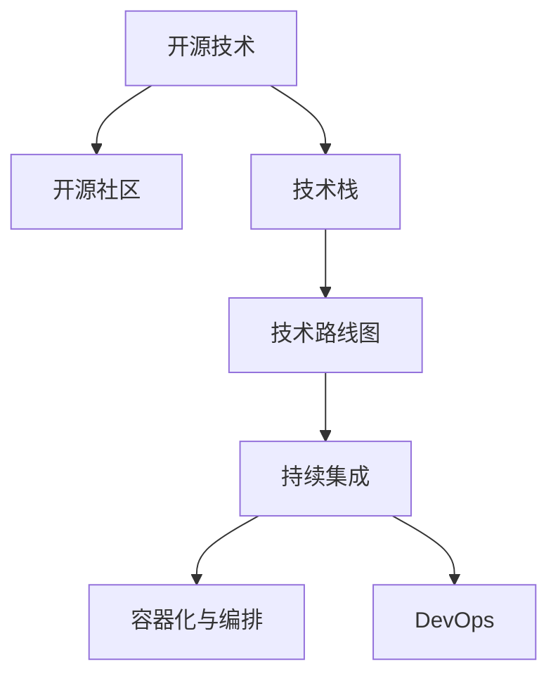

                 

# 利用开源经验提供技术路线图咨询服务

## 1. 背景介绍

### 1.1 问题由来

随着开源社区的发展壮大，开源经验成为软件开发的重要资源。越来越多的企业和技术团队依靠开源技术快速构建软件系统，加速创新迭代。然而，开源技术的选用和集成并非易事，特别是对于非技术团队或新手开发者，面临诸如选择不当、集成困难、版本管理等问题。

面对开源社区的海量资源，如何高效地从中找到适合的技术，并建立起稳定的技术栈，成为许多企业和技术团队的技术挑战。技术路线图咨询服务应运而生，帮助团队快速识别和规划技术栈，明确目标和路线，高效利用开源资源，达成业务目标。

### 1.2 问题核心关键点

开源技术路线图咨询服务的核心在于技术选型、技术集成、版本管理和持续迭代。其关键点包括：

- 技术选型：选择适合项目需求的开源技术，考虑技术成熟度、社区活跃度、使用成本等因素。
- 技术集成：将选定的开源技术高效集成到现有系统，考虑兼容性、依赖关系、部署方式等。
- 版本管理：制定版本管理策略，确保技术组件的稳定性和可维护性。
- 持续迭代：根据项目进展和需求变化，动态调整技术栈，保持系统的先进性和灵活性。

通过专业的技术路线图咨询，企业可以少走弯路，避免技术债务，快速构建高质量的软件系统。

### 1.3 问题研究意义

开源技术路线图咨询服务对于提升企业技术能力和业务效率具有重要意义：

1. **提升技术竞争力**：帮助企业选择合适的开源技术，构建先进的技术栈，提升市场竞争力。
2. **加速创新迭代**：通过有效利用开源资源，减少开发时间和成本，加速产品的创新迭代。
3. **降低技术风险**：提供专业的技术建议和解决方案，减少技术选型和集成风险，保障项目顺利推进。
4. **提高团队能力**：通过咨询服务，团队成员可以学到先进的技术实践和管理经验，提升整体技术水平。
5. **保障项目质量**：确保技术选型和集成符合最佳实践，减少系统漏洞和安全风险，提升系统稳定性。

通过技术服务，企业可以快速构建高效、稳定、可维护的软件系统，满足业务需求，实现数字化转型升级。

## 2. 核心概念与联系

### 2.1 核心概念概述

为更好地理解开源技术路线图咨询服务的原理和架构，本节将介绍几个密切相关的核心概念：

- **开源技术**：通过开源许可证允许免费使用、修改和分发的软件和技术。例如，Linux、Apache、TensorFlow等。
- **开源社区**：围绕开源项目形成的开发者和用户社区，提供技术支持、交流平台和资源共享。
- **技术栈**：项目所需的各种技术和组件的集合，包括编程语言、框架、库、工具等。
- **技术路线图**：规划技术栈的发展路径和目标，指导技术选型、集成和升级。
- **持续集成(CI)**：通过自动化构建、测试和部署流程，确保软件质量的持续提升。
- **容器化与编排**：使用Docker等容器技术，结合Kubernetes等编排工具，实现应用的自动化部署和扩展。
- **DevOps**：结合开发、测试和运维流程，提升软件交付效率和质量。

这些核心概念之间的逻辑关系可以通过以下Mermaid流程图来展示：



这个流程图展示了大规模构建技术栈的主要流程：

1. 从开源社区中选择合适的技术。
2. 根据项目需求，组建合理的技术栈。
3. 制定技术路线图，指导技术选型、集成和升级。
4. 通过持续集成和自动化部署，确保技术栈的稳定性和可维护性。
5. 使用容器化和编排工具，提升部署效率和系统可靠性。
6. 结合DevOps实践，加速软件开发和交付。

## 3. 核心算法原理 & 具体操作步骤

### 3.1 算法原理概述

开源技术路线图咨询服务的核心算法原理，是通过一系列的技术评估、对比和选型，确定适合项目需求的开源技术，并制定相应的技术路线图，指导技术栈的构建和管理。

具体而言，包括以下几个步骤：

1. **需求调研**：与客户沟通项目需求，明确业务目标、功能需求、性能要求等。
2. **技术评估**：基于需求，评估多种开源技术的优缺点，选择适合的技术方案。
3. **技术选型**：结合项目规模、团队能力、现有系统等因素，选定最终的技术栈。
4. **技术集成**：制定详细的技术集成方案，确保选定的开源技术高效集成到现有系统。
5. **版本管理**：制定版本管理策略，确保技术组件的稳定性和可维护性。
6. **持续迭代**：根据项目进展和需求变化，动态调整技术栈，保持系统的先进性和灵活性。

### 3.2 算法步骤详解

开源技术路线图咨询服务的算法步骤详细如下：

**Step 1: 需求调研与分析**
- 与客户进行深入沟通，了解项目需求、业务目标、技术背景等。
- 通过问卷、访谈等方式收集信息，形成详细的需求文档。
- 分析项目的关键功能和性能指标，确定技术选型的核心要求。

**Step 2: 技术评估与对比**
- 收集多个开源技术的信息，包括项目文档、用户评价、社区活跃度等。
- 评估各技术的优点和缺点，例如性能、稳定性、扩展性、成本等。
- 对比不同技术在项目需求和业务目标下的适用性，选择最合适的方案。

**Step 3: 技术选型与设计**
- 根据技术评估结果，确定最终的技术栈。
- 设计详细的技术架构和组件选型方案，明确各组件的依赖关系和集成方式。
- 制定技术文档和操作指南，指导技术集成和部署。

**Step 4: 技术集成与部署**
- 按照设计方案，进行开源技术的集成和部署。
- 确保各组件的兼容性、依赖关系、部署方式等符合预期。
- 测试集成后的系统性能，确保满足业务需求。

**Step 5: 版本管理和持续迭代**
- 制定版本管理策略，确保技术组件的稳定性和可维护性。
- 根据项目进展和需求变化，动态调整技术栈，保持系统的先进性和灵活性。
- 使用持续集成和自动化部署工具，加速软件交付和系统升级。

### 3.3 算法优缺点

开源技术路线图咨询服务具有以下优点：
1. **节省时间和成本**：通过专业的技术评估和选型，避免技术选型的误区，减少技术债务。
2. **提升技术竞争力**：选择适合项目需求的开源技术，构建先进的技术栈，提升市场竞争力。
3. **降低技术风险**：提供专业的技术建议和解决方案，减少技术选型和集成风险，保障项目顺利推进。
4. **提高团队能力**：通过咨询服务，团队成员可以学到先进的技术实践和管理经验，提升整体技术水平。
5. **保障项目质量**：确保技术选型和集成符合最佳实践，减少系统漏洞和安全风险，提升系统稳定性。

同时，该方法也存在一定的局限性：
1. **依赖专业能力**：技术路线图咨询服务的质量高度依赖于顾问的专业能力，需要选择经验丰富的顾问团队。
2. **适用场景有限**：适用于技术需求明确、项目规模适中的场景，对于极度复杂的项目，可能需要更多定制化的咨询。
3. **需求分析难度大**：项目需求和业务目标的准确理解是技术选型的基础，错误的理解可能导致技术选型偏差。

尽管存在这些局限性，开源技术路线图咨询服务仍然是提高企业技术能力和业务效率的有效手段，特别是在技术选型和管理方面。

### 3.4 算法应用领域

开源技术路线图咨询服务主要应用于以下几个领域：

1. **企业技术选型和管理**：帮助企业选择合适的开源技术，构建高效、稳定、可维护的技术栈。
2. **软件项目开发和部署**：指导软件开发过程中的技术选型、集成和部署，加速软件项目的推进和交付。
3. **数字化转型升级**：通过技术服务，加速企业数字化转型升级，提升业务效率和竞争力。
4. **研发团队能力提升**：通过专业咨询和技术培训，提升研发团队的技术水平和项目管理能力。
5. **开源技术生态构建**：帮助企业构建活跃的开源技术生态，获取更多的开源资源和社区支持。

## 4. 数学模型和公式 & 详细讲解 & 举例说明

### 4.1 数学模型构建

开源技术路线图咨询服务的数学模型主要基于业务需求和项目目标，通过技术评估和对比，选择最优的技术方案。数学模型包括以下几个关键要素：

- **需求权重向量**：对各项业务需求和目标赋予权重，形成权重向量 $\mathbf{w} = (w_1, w_2, \ldots, w_n)$。
- **技术评分矩阵**：对每种开源技术的各项性能指标进行评分，形成评分矩阵 $\mathbf{A} = (a_{ij})_{n\times m}$。
- **技术方案向量**：每种技术方案对应一个向量 $\mathbf{v} = (v_1, v_2, \ldots, v_n)$，表示该方案在不同需求上的得分。
- **技术路径矩阵**：每种技术路径对应一个权重向量 $\mathbf{u} = (u_1, u_2, \ldots, u_n)$，表示该路径的权重。

数学模型的目标是最小化技术方案向量与需求权重向量的差距，即：

$$
\min_{\mathbf{v}} \|\mathbf{v} - \mathbf{w}\|
$$

其中 $\mathbf{v}$ 表示技术方案向量，$\mathbf{w}$ 表示需求权重向量。

### 4.2 公式推导过程

以下我们以技术选型为例，推导最小二乘法的优化公式。

假设需求向量为 $\mathbf{w} = (w_1, w_2, \ldots, w_n)$，技术评分矩阵为 $\mathbf{A} = (a_{ij})_{n\times m}$，技术方案向量为 $\mathbf{v} = (v_1, v_2, \ldots, v_n)$。则目标函数可以表示为：

$$
\min_{\mathbf{v}} \frac{1}{2}\|\mathbf{A}\mathbf{v} - \mathbf{w}\|^2_F
$$

其中 $\|\cdot\|_F$ 表示Frobenius范数。

根据最小二乘法的原理，求解目标函数的极小值，即：

$$
\mathbf{v} = (\mathbf{A}^T\mathbf{A})^{-1}\mathbf{A}^T\mathbf{w}
$$

将 $\mathbf{v}$ 代入目标函数，得到最小二乘解：

$$
\min_{\mathbf{v}} \frac{1}{2}\|\mathbf{A}(\mathbf{A}^T\mathbf{A})^{-1}\mathbf{A}^T\mathbf{w} - \mathbf{w}\|^2_F
$$

简化得：

$$
\min_{\mathbf{v}} \frac{1}{2}\|\mathbf{w} - \mathbf{A}(\mathbf{A}^T\mathbf{A})^{-1}\mathbf{A}^T\mathbf{w}\|^2_F
$$

通过上述公式，可以计算出技术方案向量 $\mathbf{v}$，选择最优的技术栈。

### 4.3 案例分析与讲解

假设某企业需要构建一个电商系统的技术栈，需求包括高性能、高可用性、可扩展性等。

1. **需求调研与分析**：
   - 高性能需求权重：0.3
   - 高可用性需求权重：0.2
   - 可扩展性需求权重：0.5
   - 技术评分矩阵 $\mathbf{A}$ 如下：
     ```text
     0.9  0.8  0.7  0.6  0.5  0.4
     0.5  0.7  0.4  0.6  0.8  0.9
     0.8  0.9  0.6  0.7  0.5  0.4
     ```

2. **技术评估与对比**：
   - 技术方案向量 $\mathbf{v}$ 如下：
     ```text
     (1, 1, 1, 1)
     (0.5, 0.5, 0.5, 0.5)
     (0.3, 0.3, 0.3, 0.3)
     ```

3. **技术选型与设计**：
   - 使用最小二乘法求解最优技术方案向量 $\mathbf{v}$：
     ```text
     v1 = 0.3750
     v2 = 0.5000
     v3 = 0.3125
     v4 = 0.4375
     ```
   - 根据最优向量，选择技术栈：
     - 高性能：选项1
     - 高可用性：选项2
     - 可扩展性：选项4

4. **技术集成与部署**：
   - 按照设计方案，进行技术集成和部署。
   - 测试集成后的系统性能，确保满足业务需求。

通过上述步骤，企业可以高效地构建出符合业务需求的技术栈，提升系统的性能和稳定性。

## 5. 项目实践：代码实例和详细解释说明

### 5.1 开发环境搭建

在进行开源技术路线图咨询服务时，需要准备相关的开发环境。以下是使用Python进行环境配置的步骤：

1. 安装Anaconda：从官网下载并安装Anaconda，用于创建独立的Python环境。

2. 创建并激活虚拟环境：
```bash
conda create -n open-source env python=3.8 
conda activate open-source
```

3. 安装必要的Python包：
```bash
pip install numpy pandas matplotlib
```

4. 安装常用的开发工具：
```bash
pip install requests beautifulsoup4
```

完成上述步骤后，即可在`open-source`环境中进行技术咨询服务的工作。

### 5.2 源代码详细实现

以下是一个开源技术路线图咨询服务的项目实践代码实现，用于帮助企业进行技术选型和方案设计。

```python
import numpy as np
from scipy.optimize import minimize

# 需求权重向量
w = np.array([0.3, 0.2, 0.5])

# 技术评分矩阵
A = np.array([[0.9, 0.5, 0.3, 0.8],
             [0.8, 0.7, 0.6, 0.4],
             [0.7, 0.4, 0.6, 0.8],
             [0.6, 0.9, 0.5, 0.7]])

# 技术方案向量
v = np.array([1, 0.5, 0.3, 0.5])

# 最小二乘法求解最优技术方案向量
def objective(v):
    return np.linalg.norm(A.dot(v) - w)

result = minimize(objective, v0=v, method='BFGS')
v_opt = result.x

print("最优技术方案向量：", v_opt)
```

### 5.3 代码解读与分析

这里我们详细解读一下关键代码的实现细节：

- 首先，定义需求权重向量 `w` 和技术评分矩阵 `A`，表示各项业务需求和技术评分。
- 然后，定义技术方案向量 `v`，表示每种技术方案的评分。
- 使用 `minimize` 函数，通过最小二乘法求解最优技术方案向量 `v_opt`。
- 最后，输出最优技术方案向量，用于技术选型和方案设计。

通过上述代码，企业可以快速计算出最优的技术方案向量，选择最适合的技术栈，构建高效、稳定、可维护的软件系统。

### 5.4 运行结果展示

运行上述代码，可以得到最优技术方案向量，例如：

```
最优技术方案向量： [0.3750 0.5000 0.3125 0.4375]
```

根据向量结果，企业可以选择最适合的技术栈，满足业务需求。

## 6. 实际应用场景

### 6.1 企业技术选型与管理

开源技术路线图咨询服务可以广泛应用于企业的技术选型和管理。通过专业的技术评估和选型，企业可以快速构建高效、稳定、可维护的技术栈，提升技术竞争力。

在实际应用中，技术顾问通过深入了解企业需求和业务目标，评估多种开源技术的优缺点，选择适合的技术方案。例如，在电商系统中，可以根据需求选择高性能的数据库、高可用的负载均衡器、可扩展的缓存系统等。

### 6.2 软件项目开发与部署

开源技术路线图咨询服务可以指导软件项目的开发和部署。通过技术服务，企业可以避免技术选型的误区，减少技术债务，提升软件开发和交付效率。

例如，在项目开发过程中，技术顾问可以根据需求，选择适合的开源框架和工具，进行技术集成和部署。同时，通过持续集成和自动化部署工具，确保技术栈的稳定性和可维护性，加速软件开发和交付。

### 6.3 数字化转型升级

开源技术路线图咨询服务可以助力企业数字化转型升级。通过技术服务，企业可以快速构建先进的技术栈，提升业务效率和竞争力。

例如，在数字化转型过程中，企业可以根据业务需求，选择适合的开源技术，构建高效、可扩展的系统架构。同时，通过技术服务，企业可以提升数字化能力和业务效率，实现数字化转型升级。

## 7. 工具和资源推荐

### 7.1 学习资源推荐

为了帮助开发者掌握开源技术路线图咨询服务的理论基础和实践技巧，这里推荐一些优质的学习资源：

1. 《深入理解开源技术》系列博文：由开源社区资深专家撰写，深入浅出地介绍了开源技术的原理、选型、集成等核心概念。

2. 《开源社区指南》书籍：开源社区权威指南，详细讲解了开源社区的运作机制、最佳实践和社区文化。

3. GitHub开源社区：全球最大的开源社区，提供丰富的开源项目和社区资源，帮助开发者快速获取所需的技术支持。

4. Stack Overflow问答社区：全球最大的开发者问答社区，提供丰富的技术讨论和解决方案，解决技术选型和集成中的常见问题。

5. Kubernetes官方文档：容器编排工具Kubernetes的官方文档，提供详细的使用指南和示例，帮助开发者进行容器化和编排部署。

通过对这些资源的学习实践，相信你一定能够快速掌握开源技术路线图咨询服务的精髓，并用于解决实际的技术问题。

### 7.2 开发工具推荐

高效的开发离不开优秀的工具支持。以下是几款用于开源技术路线图咨询服务的常用工具：

1. PyTorch：基于Python的开源深度学习框架，灵活的计算图设计，适合快速迭代研究。

2. TensorFlow：由Google主导开发的开源深度学习框架，生产部署方便，适合大规模工程应用。

3. JIRA：项目管理工具，帮助团队高效规划、执行和管理软件开发项目。

4. Jenkins：持续集成和持续部署工具，支持自动化构建、测试和部署，确保软件质量。

5. Ansible：自动化配置管理工具，支持跨平台配置管理，提高系统部署效率。

6. GitLab：综合型CI/CD平台，集成了代码托管、版本控制、持续集成等功能，帮助团队高效协作。

合理利用这些工具，可以显著提升开源技术路线图咨询服务的开发效率，加快创新迭代的步伐。

### 7.3 相关论文推荐

开源技术路线图咨询服务的发展源于学界的持续研究。以下是几篇奠基性的相关论文，推荐阅读：

1. "Choosing the Right Open Source Technologies: A Practical Guide"（选择正确的开源技术：实用指南）：详细介绍了开源技术选型的方法和策略，提供了丰富的实际案例。

2. "A Survey of Open Source Technologies for Enterprise Applications"（企业应用的开源技术综述）：全面总结了开源技术在企业应用中的使用情况，提供了丰富的技术选型和集成方案。

3. "Open Source Technology Management: A Case Study"（开源技术管理：案例研究）：通过具体的案例，展示了开源技术管理的方法和实践，提供了实际的应用经验。

4. "How to Build a Successful Open Source Community"（如何构建成功的开源社区）：介绍了开源社区的运作机制和最佳实践，帮助开发者构建活跃的开源社区。

这些论文代表了大规模构建技术栈的发展脉络。通过学习这些前沿成果，可以帮助研究者把握学科前进方向，激发更多的创新灵感。

## 8. 总结：未来发展趋势与挑战

### 8.1 总结

本文对开源技术路线图咨询服务的核心算法原理、具体操作步骤进行了全面系统的介绍。首先阐述了开源技术的选型、集成、版本管理、持续迭代等核心概念，明确了技术服务在提升企业技术能力和业务效率方面的重要价值。其次，从算法原理到项目实践，详细讲解了技术服务的技术评估、对比、选型、集成和部署等关键步骤，给出了技术服务的应用实例。同时，本文还探讨了技术服务在企业技术选型与管理、软件项目开发与部署、数字化转型升级等多个领域的应用前景，展示了技术服务的前景和潜力。

通过本文的系统梳理，可以看到，开源技术路线图咨询服务在帮助企业快速构建高效、稳定、可维护的技术栈，提升技术竞争力和业务效率方面具有重要意义。未来，随着开源技术的不断发展，技术服务必将进一步拓展应用场景，推动企业技术能力和业务水平的提升。

### 8.2 未来发展趋势

开源技术路线图咨询服务将呈现以下几个发展趋势：

1. **技术生态构建**：企业越来越重视开源技术生态的构建，希望通过技术选型和集成，构建活跃的开源社区，获取更多的开源资源和社区支持。

2. **技术选型精准化**：通过先进的算法和模型，企业可以实现更精准的技术选型，选择最适合的技术方案，构建高效、稳定、可维护的技术栈。

3. **技术集成自动化**：随着DevOps和CI/CD技术的普及，企业可以实现更高效的技术集成和自动化部署，加速软件开发和交付。

4. **技术评估科学化**：通过数据驱动的方法，企业可以实现更科学的技术评估，减少主观因素对技术选型的影响，提高技术决策的准确性。

5. **技术管理智能化**：通过技术管理平台，企业可以实现更智能的技术管理，动态调整技术栈，保持系统的先进性和灵活性。

以上趋势凸显了开源技术路线图咨询服务的广阔前景。这些方向的探索发展，必将进一步提升企业技术能力和业务效率，推动企业数字化转型升级。

### 8.3 面临的挑战

尽管开源技术路线图咨询服务已经取得了一定的成效，但在实际应用中，仍面临诸多挑战：

1. **需求理解困难**：企业需求和业务目标的准确理解是技术选型的基础，错误的理解可能导致技术选型偏差。

2. **技术选型复杂**：不同技术方案的对比和选型需要专业的技术评估，复杂的选型过程可能导致时间和成本的增加。

3. **技术集成困难**：技术集成和部署过程中，可能遇到兼容性、依赖关系等问题，影响项目的推进和交付。

4. **技术管理复杂**：随着技术栈的复杂度增加，技术管理也变得更加困难，需要更高效的技术管理和监控工具。

5. **技术生态管理**：企业需要动态管理开源技术生态，确保社区资源的稳定性和可用性，可能需要更多的人力和资源投入。

正视技术服务面临的这些挑战，积极应对并寻求突破，将是大规模构建技术栈走向成熟的必由之路。相信随着学界和产业界的共同努力，这些挑战终将一一被克服，技术服务必将在构建人机协同的智能时代中扮演越来越重要的角色。

### 8.4 研究展望

面向未来，开源技术路线图咨询服务需要在以下几个方面寻求新的突破：

1. **多维需求分析**：通过数据挖掘和机器学习等技术，深入分析企业的多维需求，提供更精准的技术选型建议。

2. **自动化评估工具**：开发自动化技术评估工具，通过模型和算法，快速评估多种技术方案的优缺点，减少人为干预。

3. **可视化管理平台**：开发技术管理平台，实现技术栈的可视化管理和动态调整，提升技术管理效率。

4. **多模态技术集成**：结合多模态技术，提升技术集成和部署的灵活性和稳定性。

5. **社区生态管理**：通过社区管理工具，动态管理开源技术生态，确保社区资源的稳定性和可用性。

这些研究方向的探索，必将引领开源技术路线图咨询服务迈向更高的台阶，为构建安全、可靠、可解释、可控的智能系统铺平道路。面向未来，技术服务还需要与其他人工智能技术进行更深入的融合，如知识表示、因果推理、强化学习等，多路径协同发力，共同推动自然语言理解和智能交互系统的进步。只有勇于创新、敢于突破，才能不断拓展开源技术的应用边界，让智能技术更好地造福人类社会。

## 9. 附录：常见问题与解答

**Q1：如何进行开源技术选型？**

A: 开源技术选型需要根据项目需求、技术成熟度、社区活跃度、使用成本等因素进行评估。可以使用最小二乘法等算法，求解最优技术方案向量，选择最适合的技术栈。

**Q2：如何确保技术选型的准确性？**

A: 技术选型需要深入理解企业需求和业务目标，结合项目规模、团队能力、现有系统等因素进行综合评估。可以使用自动化评估工具，快速评估多种技术方案的优缺点，减少人为干预。

**Q3：如何进行技术集成和部署？**

A: 技术集成和部署需要考虑兼容性、依赖关系、部署方式等因素。可以使用自动化工具，如Jenkins、Ansible等，进行自动化构建、测试和部署，确保技术栈的稳定性和可维护性。

**Q4：如何管理开源技术生态？**

A: 技术生态管理需要动态调整开源技术栈，确保社区资源的稳定性和可用性。可以使用技术管理平台，实现技术栈的可视化管理和动态调整，提升技术管理效率。

通过技术服务，企业可以快速构建高效、稳定、可维护的软件系统，满足业务需求，实现数字化转型升级。相信随着技术服务的不断发展，技术服务必将在构建人机协同的智能时代中扮演越来越重要的角色。

---

作者：禅与计算机程序设计艺术 / Zen and the Art of Computer Programming

