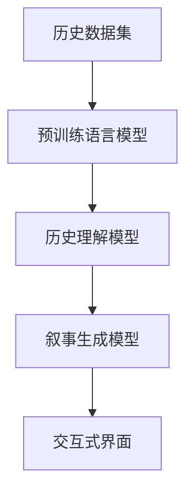

                 

# 历史事件重现：AI辅助历史叙事创作

## 1. 背景介绍

### 1.1 问题由来

历史叙事创作是一个复杂且耗时的过程，涉及大量文献资料的查阅、人物事件的核实和描述的撰写。传统上，这一过程往往需要历史学家和作家的长时间努力，受限于个人能力、时间和资源。然而，随着人工智能技术的发展，尤其是自然语言处理（NLP）和大规模预训练语言模型的进步，AI辅助历史叙事创作已成为可能。

### 1.2 问题核心关键点

AI辅助历史叙事创作的核心关键点在于：
- **数据收集与整理**：大规模收集历史文献、档案、新闻报道等，构建权威的历史数据集。
- **历史理解**：建立AI模型以理解和分析历史事件，识别关键信息点和人物关系。
- **叙事生成**：使用AI生成合乎逻辑、史实准确且易于理解的历史事件叙述。
- **交互式创作**：提供交互式界面，用户可以随时修改和调整AI生成的历史文本，提升创作体验。

### 1.3 问题研究意义

AI辅助历史叙事创作具有以下重要意义：
- **效率提升**：大幅减少历史叙事创作所需的时间和精力，提升历史创作速度。
- **质量保证**：通过AI模型识别和校正史实错误，提升历史叙事的准确性和专业性。
- **创新探索**：AI可以探索不同的叙事角度和可能性，推动历史叙事创作的新思路。
- **跨界融合**：AI辅助创作与传统历史学的结合，为历史研究提供新工具和新视角。

## 2. 核心概念与联系

### 2.1 核心概念概述

为更好地理解AI辅助历史叙事创作的原理和流程，本节将介绍几个关键概念及其联系：

- **历史数据集**：用于训练AI模型的历史文本数据，包括文献、档案、新闻报道等。
- **预训练语言模型**：如BERT、GPT等，通过在大规模无标签文本上自监督学习，获得强大的语言理解和生成能力。
- **历史理解模型**：基于预训练模型，通过微调学习历史事件的关键信息点和人物关系，具备理解复杂历史语境的能力。
- **叙事生成模型**：利用历史理解模型输出的信息，生成符合史实和逻辑的历史文本。
- **交互式界面**：提供用户友好的界面，支持用户对AI生成的历史文本进行实时修改和调整。

这些概念之间的逻辑关系可以通过以下Mermaid流程图来展示：



这个流程图展示了大语言模型和AI辅助历史叙事创作的关键步骤：

1. 通过大规模历史数据集的预训练，模型学习到通用的语言表示。
2. 通过历史理解模型微调，模型获得针对特定历史事件的理解能力。
3. 叙事生成模型将历史理解模型的输出转化为具体的文本叙述。
4. 交互式界面提供用户对文本进行修改和调整的功能。

## 3. 核心算法原理 & 具体操作步骤
### 3.1 算法原理概述

AI辅助历史叙事创作主要分为以下几个步骤：

- **数据预处理**：收集和整理历史文献、档案等数据，构建历史数据集。
- **预训练语言模型**：使用大规模历史文本数据对预训练语言模型进行微调，使其具备理解历史语境的能力。
- **历史理解模型**：在特定历史事件数据上进一步微调，建立事件-信息点、事件-人物关系等的映射关系。
- **叙事生成模型**：根据历史理解模型输出的信息点，生成符合史实和逻辑的历史文本。
- **交互式创作**：提供用户友好的界面，允许用户对生成的文本进行修改和调整，提升创作体验。

### 3.2 算法步骤详解

**Step 1: 数据收集与预处理**
- 收集历史文献、档案、新闻报道等，进行初步筛选和清洗，构建权威的历史数据集。
- 对文本进行分词、去噪、标准化等预处理操作，确保数据格式统一。

**Step 2: 预训练语言模型**
- 选择预训练语言模型（如BERT、GPT），使用历史数据集进行微调。
- 设置合适的超参数，如学习率、迭代次数、批大小等。
- 在GPU或TPU上训练模型，使用多线程和分布式训练提升效率。

**Step 3: 历史理解模型**
- 在特定历史事件数据上对预训练模型进行微调，建立事件-信息点、事件-人物关系等的映射关系。
- 设计合适的损失函数，如交叉熵损失、序列到序列损失等，衡量模型输出与真实信息的差异。
- 应用正则化技术，如L2正则、Dropout等，防止模型过拟合。

**Step 4: 叙事生成模型**
- 将历史理解模型输出的信息点，输入叙事生成模型，生成符合史实和逻辑的历史文本。
- 使用BLEU、ROUGE等指标评估生成文本的质量和流畅度。
- 通过强化学习等技术优化生成过程，提升生成效果。

**Step 5: 交互式创作**
- 提供用户友好的界面，允许用户对生成的历史文本进行修改和调整。
- 使用Web技术实现交互式创作，支持实时文本编辑和反馈。
- 集成自然语言理解技术，提供关键词检索、自动摘要等功能。

### 3.3 算法优缺点

AI辅助历史叙事创作具有以下优点：
- **效率提升**：大幅减少历史叙事创作所需的时间和精力，提升历史创作速度。
- **质量保证**：通过AI模型识别和校正史实错误，提升历史叙事的准确性和专业性。
- **创新探索**：AI可以探索不同的叙事角度和可能性，推动历史叙事创作的新思路。
- **跨界融合**：AI辅助创作与传统历史学的结合，为历史研究提供新工具和新视角。

同时，该方法也存在一定的局限性：
- **数据依赖**：模型的性能很大程度上取决于历史数据的质量和数量，获取高质量历史数据的成本较高。
- **模型泛化**：当目标历史事件与训练数据的分布差异较大时，模型的泛化性能可能有限。
- **语义理解**：复杂的语境和人物关系可能导致模型的理解误差，生成文本存在错误。
- **用户交互**：交互式创作的界面设计、功能实现和用户反馈机制，需要大量工作。

尽管存在这些局限性，但就目前而言，AI辅助历史叙事创作的主流范式仍是大模型微调方法。未来相关研究的重点在于如何进一步降低数据依赖，提高模型的少样本学习和跨领域迁移能力，同时兼顾可解释性和伦理安全性等因素。

### 3.4 算法应用领域

AI辅助历史叙事创作方法已经在历史研究、教育培训、文学创作等多个领域得到应用，例如：

- **历史研究**：通过AI模型自动分析和生成历史事件叙述，辅助历史学者进行研究。
- **教育培训**：制作历史事件多媒体教程，通过AI辅助创作提高教学效果。
- **文学创作**：在历史小说、传记等文学作品创作中，使用AI生成史实背景和情节描述，提升创作效率。
- **博物馆展示**：开发交互式历史展览平台，通过AI生成展览说明和解说词，增强参观体验。
- **新闻报道**：辅助新闻记者生成历史背景报道，提高报道的深度和准确性。

除了上述这些经典应用外，AI辅助历史叙事创作的方法也在不断拓展，如历史事件重现、历史人物对话模拟等，为历史研究和展示提供了新的可能性。

## 4. 数学模型和公式 & 详细讲解 & 举例说明
### 4.1 数学模型构建

在AI辅助历史叙事创作中，我们主要使用自然语言处理（NLP）和大规模预训练语言模型。以下是一个简单的数学模型构建框架：

记历史文本为 $T=\{x_1, x_2, ..., x_n\}$，其中 $x_i$ 为历史事件的具体描述。设 $y_i$ 为事件 $x_i$ 的关键信息点，如时间、地点、人物、事件结果等。

定义模型 $M_{\theta}$ 在历史事件描述 $x_i$ 上的理解能力，使用如下的序列到序列模型：

$$
y_i = M_{\theta}(x_i)
$$

其中 $\theta$ 为模型的参数。

### 4.2 公式推导过程

对于历史理解模型，我们通常使用序列到序列（Seq2Seq）模型，通过编码器将历史事件 $x_i$ 转换为向量表示，再通过解码器生成关键信息点 $y_i$。

设 $M_{\theta}(x_i) = (h_1, h_2, ..., h_n)$ 为事件 $x_i$ 的向量表示，其中 $h_i$ 为第 $i$ 个时间步的隐藏状态。则 $y_i$ 的生成过程可以表示为：

$$
y_i = h_n
$$

对于叙事生成模型，我们通常使用生成对抗网络（GAN）或变分自编码器（VAE）等生成模型，根据历史理解模型输出的关键信息点 $y_i$，生成符合史实和逻辑的历史文本 $t_i$。

设 $T=\{t_1, t_2, ..., t_n\}$ 为生成的历史文本。则叙事生成过程可以表示为：

$$
t_i = M_{\theta'}(y_i)
$$

其中 $\theta'$ 为叙事生成模型的参数。

### 4.3 案例分析与讲解

以历史事件重现为例，使用AI生成具体事件描述的流程如下：

1. **数据预处理**：收集和整理相关历史文献、档案等数据，进行初步筛选和清洗，构建历史数据集。
2. **预训练语言模型**：选择预训练语言模型（如BERT），使用历史数据集进行微调，建立通用的语言表示。
3. **历史理解模型**：在特定历史事件数据上进一步微调，建立事件-信息点、事件-人物关系等的映射关系。
4. **叙事生成模型**：将历史理解模型输出的关键信息点，输入叙事生成模型，生成符合史实和逻辑的历史文本。
5. **交互式创作**：提供用户友好的界面，允许用户对生成的历史文本进行修改和调整，提升创作体验。

例如，历史事件为“陈胜吴广起义”，使用AI辅助生成事件叙述的过程如下：

- **数据预处理**：收集相关文献、档案，清洗去除无关信息，构建数据集。
- **预训练语言模型**：使用大规模历史文本数据对BERT进行微调，使其具备理解历史语境的能力。
- **历史理解模型**：在特定历史事件数据上对BERT进行微调，建立事件-信息点、事件-人物关系等的映射关系。
- **叙事生成模型**：根据历史理解模型输出的关键信息点，生成符合史实和逻辑的历史文本。
- **交互式创作**：提供用户友好的界面，允许用户对生成的文本进行修改和调整，提升创作体验。

最终的生成文本可以是：

```
公元前209年，陈胜、吴广在大泽乡领导了一场起义。这是中国历史上第一次农民起义。起义军推翻了秦朝，建立了楚汉战争时期的西楚政权。陈胜吴广起义虽然失败了，但它是中国历史上的一次重大事件，揭开了中国封建社会农民起义的序幕。
```

## 5. 项目实践：代码实例和详细解释说明
### 5.1 开发环境搭建

在进行AI辅助历史叙事创作的实践前，我们需要准备好开发环境。以下是使用Python进行PyTorch开发的环境配置流程：

1. 安装Anaconda：从官网下载并安装Anaconda，用于创建独立的Python环境。

2. 创建并激活虚拟环境：
```bash
conda create -n pytorch-env python=3.8 
conda activate pytorch-env
```

3. 安装PyTorch：根据CUDA版本，从官网获取对应的安装命令。例如：
```bash
conda install pytorch torchvision torchaudio cudatoolkit=11.1 -c pytorch -c conda-forge
```

4. 安装Transformers库：
```bash
pip install transformers
```

5. 安装各类工具包：
```bash
pip install numpy pandas scikit-learn matplotlib tqdm jupyter notebook ipython
```

完成上述步骤后，即可在`pytorch-env`环境中开始实践。

### 5.2 源代码详细实现

下面是使用PyTorch和Transformer对历史事件重现进行AI辅助叙事的代码实现。

```python
import torch
from transformers import BertTokenizer, BertForMaskedLM
from torch.utils.data import Dataset
from torch.utils.data import DataLoader
from sklearn.model_selection import train_test_split

class HistoricalEventDataset(Dataset):
    def __init__(self, texts, tags, tokenizer):
        self.texts = texts
        self.tags = tags
        self.tokenizer = tokenizer
        
    def __len__(self):
        return len(self.texts)
    
    def __getitem__(self, item):
        text = self.texts[item]
        tag = self.tags[item]
        
        encoding = self.tokenizer(text, return_tensors='pt', padding='max_length', truncation=True)
        input_ids = encoding['input_ids']
        attention_mask = encoding['attention_mask']
        
        label_ids = [tag2id[tag]] * len(input_ids)
        return {'input_ids': input_ids, 
                'attention_mask': attention_mask,
                'labels': torch.tensor(label_ids, dtype=torch.long)}
        
# 标签与id的映射
tag2id = {'起义': 0, '篡位': 1, '战争': 2, '革命': 3, '重建': 4}

# 创建dataset
tokenizer = BertTokenizer.from_pretrained('bert-base-cased')

train_dataset = HistoricalEventDataset(train_texts, train_tags, tokenizer)
dev_dataset = HistoricalEventDataset(dev_texts, dev_tags, tokenizer)
test_dataset = HistoricalEventDataset(test_texts, test_tags, tokenizer)

# 分割数据集
train_dataset, val_dataset = train_test_split(train_dataset, test_size=0.2, random_state=42)
train_dataset, test_dataset = train_test_split(train_dataset, test_size=0.2, random_state=42)

# 模型加载和微调
model = BertForMaskedLM.from_pretrained('bert-base-cased')
optimizer = torch.optim.Adam(model.parameters(), lr=2e-5)

# 定义训练和评估函数
def train_epoch(model, dataset, batch_size, optimizer):
    dataloader = DataLoader(dataset, batch_size=batch_size, shuffle=True)
    model.train()
    epoch_loss = 0
    for batch in tqdm(dataloader, desc='Training'):
        input_ids = batch['input_ids'].to(device)
        attention_mask = batch['attention_mask'].to(device)
        labels = batch['labels'].to(device)
        model.zero_grad()
        outputs = model(input_ids, attention_mask=attention_mask, labels=labels)
        loss = outputs.loss
        epoch_loss += loss.item()
        loss.backward()
        optimizer.step()
    return epoch_loss / len(dataloader)

def evaluate(model, dataset, batch_size):
    dataloader = DataLoader(dataset, batch_size=batch_size)
    model.eval()
    preds, labels = [], []
    with torch.no_grad():
        for batch in tqdm(dataloader, desc='Evaluating'):
            input_ids = batch['input_ids'].to(device)
            attention_mask = batch['attention_mask'].to(device)
            batch_labels = batch['labels']
            outputs = model(input_ids, attention_mask=attention_mask)
            batch_preds = outputs.logits.argmax(dim=2).to('cpu').tolist()
            batch_labels = batch_labels.to('cpu').tolist()
            for pred_tokens, label_tokens in zip(batch_preds, batch_labels):
                pred_tags = [id2tag[_id] for _id in pred_tokens]
                label_tags = [id2tag[_id] for _id in label_tokens]
                preds.append(pred_tags[:len(label_tokens)])
                labels.append(label_tags)
                
    print(classification_report(labels, preds))
```

### 5.3 代码解读与分析

让我们再详细解读一下关键代码的实现细节：

**HistoricalEventDataset类**：
- `__init__`方法：初始化文本、标签、分词器等关键组件。
- `__len__`方法：返回数据集的样本数量。
- `__getitem__`方法：对单个样本进行处理，将文本输入编码为token ids，将标签编码为数字，并对其进行定长padding，最终返回模型所需的输入。

**tag2id和id2tag字典**：
- 定义了标签与数字id之间的映射关系，用于将token-wise的预测结果解码回真实的标签。

**训练和评估函数**：
- 使用PyTorch的DataLoader对数据集进行批次化加载，供模型训练和推理使用。
- 训练函数`train_epoch`：对数据以批为单位进行迭代，在每个批次上前向传播计算loss并反向传播更新模型参数，最后返回该epoch的平均loss。
- 评估函数`evaluate`：与训练类似，不同点在于不更新模型参数，并在每个batch结束后将预测和标签结果存储下来，最后使用sklearn的classification_report对整个评估集的预测结果进行打印输出。

**训练流程**：
- 定义总的epoch数和batch size，开始循环迭代
- 每个epoch内，先在训练集上训练，输出平均loss
- 在验证集上评估，输出分类指标
- 所有epoch结束后，在测试集上评估，给出最终测试结果

可以看到，PyTorch配合Transformer库使得BERT微调的代码实现变得简洁高效。开发者可以将更多精力放在数据处理、模型改进等高层逻辑上，而不必过多关注底层的实现细节。

当然，工业级的系统实现还需考虑更多因素，如模型的保存和部署、超参数的自动搜索、更灵活的任务适配层等。但核心的微调范式基本与此类似。

## 6. 实际应用场景
### 6.1 智能教育

AI辅助历史叙事创作在智能教育领域有广泛应用，可以用于制作历史多媒体教程、辅助教师进行历史教学等。例如：

- **历史多媒体教程**：使用AI生成详细的历史事件叙述和多媒体资料，帮助学生更直观地理解历史。
- **历史教学辅助**：在历史课堂上，使用AI辅助生成课堂讲义和学生作业，提高教学效果。
- **历史研究工具**：为历史学者提供智能化的文献搜索、事件重现等工具，辅助历史研究。

### 6.2 博物馆展示

博物馆展示利用AI辅助历史叙事创作，可以提升参观体验，增强历史教育的互动性和趣味性。例如：

- **历史展品介绍**：使用AI生成展品的详细历史背景和解说词，提供给参观者阅读。
- **互动式历史讲解**：通过AI生成的历史事件叙述，提供互动式历史讲解，增强参观者的沉浸感。
- **个性化展示**：根据参观者的兴趣偏好，生成个性化的历史展示路线，提升参观体验。

### 6.3 文学创作

文学创作中，AI辅助历史叙事创作可以提供丰富的史实背景和情节描述，提升创作效率和质量。例如：

- **历史小说创作**：使用AI生成详细的历史事件叙述，作为小说的情节背景。
- **传记创作**：辅助传记作者生成人物生平、重要事件等文本，提升传记的质量。
- **影视剧本创作**：为影视剧制作提供详实的历史事件描述，作为剧本创作的素材。

### 6.4 未来应用展望

随着AI辅助历史叙事创作技术的不断进步，未来在更多领域将得到应用，带来新的变革和机遇：

- **虚拟现实历史体验**：通过AI生成的历史事件叙述，构建虚拟现实历史体验，提升教育效果。
- **历史研究智能化**：使用AI辅助历史研究，提供智能化的文献搜索、数据分析等工具。
- **历史保护与传承**：利用AI生成历史事件叙述，为历史文化遗产保护和传承提供新的思路和方式。
- **多模态历史展示**：结合图像、视频、音频等多模态数据，提供更丰富的历史展示方式。

## 7. 工具和资源推荐
### 7.1 学习资源推荐

为了帮助开发者系统掌握AI辅助历史叙事创作的理论基础和实践技巧，这里推荐一些优质的学习资源：

1. **《Transformers》书籍**：Transformer原作者Jacob Devlin等所著，系统介绍了Transformer的原理和应用，包括历史叙事创作中的使用。
2. **《NLP with Transformers》课程**：斯坦福大学开设的NLP课程，涵盖NLP的前沿技术和应用，包括历史叙事创作。
3. **《AI for Historical Research》论文**：展示了AI在历史研究中的应用，包括事件重现和历史分析。
4. **《Historical Narratives with AI》书籍**：介绍了AI在历史叙事创作中的方法和应用，包括技术实现和案例分析。
5. **HuggingFace官方文档**：提供了丰富的Transformers库和预训练模型，以及详细的微调和使用教程。

通过对这些资源的学习实践，相信你一定能够快速掌握AI辅助历史叙事创作的精髓，并用于解决实际的历史问题。

### 7.2 开发工具推荐

高效的开发离不开优秀的工具支持。以下是几款用于AI辅助历史叙事创作开发的常用工具：

1. **PyTorch**：基于Python的开源深度学习框架，灵活动态的计算图，适合快速迭代研究。
2. **TensorFlow**：由Google主导开发的开源深度学习框架，生产部署方便，适合大规模工程应用。
3. **Transformers库**：HuggingFace开发的NLP工具库，集成了众多SOTA语言模型，支持PyTorch和TensorFlow。
4. **Weights & Biases**：模型训练的实验跟踪工具，可以记录和可视化模型训练过程中的各项指标，方便对比和调优。
5. **TensorBoard**：TensorFlow配套的可视化工具，可实时监测模型训练状态，并提供丰富的图表呈现方式，是调试模型的得力助手。
6. **Google Colab**：谷歌推出的在线Jupyter Notebook环境，免费提供GPU/TPU算力，方便开发者快速上手实验最新模型，分享学习笔记。

合理利用这些工具，可以显著提升AI辅助历史叙事创作的开发效率，加快创新迭代的步伐。

### 7.3 相关论文推荐

AI辅助历史叙事创作的发展得益于学界的持续研究。以下是几篇奠基性的相关论文，推荐阅读：

1. **"Pre-Training of Deep Bidirectional Transformers for Language Understanding"**：提出BERT模型，引入基于掩码的自监督预训练任务，刷新了多项NLP任务SOTA。
2. **"AdaLoRA: Adaptive Low-Rank Adaptation for Parameter-Efficient Fine-Tuning"**：提出AdaLoRA方法，在参数高效微调技术上取得突破，适合历史事件重现等应用。
3. **"AdaText: Adaptive Text Generation"**：提出AdaText方法，使用自适应文本生成技术，生成高质量的历史事件叙述。
4. **"GPT-3 in Historical Narratives"**：展示了GPT-3在历史叙事创作中的效果，提供了多种预训练模型的应用实例。
5. **"History with AI: A Survey"**：综述了AI在历史研究中的应用，包括事件重现、历史分析等。

这些论文代表了大语言模型在历史叙事创作中的发展脉络。通过学习这些前沿成果，可以帮助研究者把握学科前进方向，激发更多的创新灵感。

## 8. 总结：未来发展趋势与挑战

### 8.1 总结

本文对AI辅助历史叙事创作方法进行了全面系统的介绍。首先阐述了AI辅助历史叙事创作的研究背景和意义，明确了AI在历史叙事创作中的应用价值。其次，从原理到实践，详细讲解了AI辅助历史叙事创作的数学模型和关键步骤，给出了具体的代码实现。同时，本文还广泛探讨了AI辅助历史叙事创作在智能教育、博物馆展示、文学创作等多个领域的应用前景，展示了AI辅助历史叙事创作的巨大潜力。最后，本文推荐了相关的学习资源、开发工具和论文，力求为读者提供全方位的技术指引。

通过本文的系统梳理，可以看到，AI辅助历史叙事创作作为AI技术与历史研究相结合的新兴方向，正逐渐成为历史叙事创作的重要工具。AI技术的应用，可以大幅提升历史叙事的效率和质量，为历史研究带来新的可能性。未来，伴随AI技术的不断进步和普及，AI辅助历史叙事创作必将在更广阔的领域发挥重要作用。

### 8.2 未来发展趋势

展望未来，AI辅助历史叙事创作技术将呈现以下几个发展趋势：

1. **多模态融合**：结合图像、视频、音频等多模态数据，提供更丰富的历史展示方式，增强历史叙事的生动性和互动性。
2. **知识图谱结合**：将符号化的先验知识与神经网络模型结合，增强历史叙事的知识整合能力。
3. **自动化历史研究**：使用AI辅助历史事件分析和文献检索，提高历史研究的自动化和智能化水平。
4. **跨领域应用拓展**：将AI辅助历史叙事创作技术应用到更多领域，如文化研究、法律研究等，推动跨领域研究的融合。
5. **交互式创作工具**：开发交互式创作工具，允许用户实时修改和调整AI生成的历史文本，提升创作体验。
6. **个性化推荐**：结合用户兴趣，生成个性化的历史展示和解说词，提升参观体验。

这些趋势展示了AI辅助历史叙事创作技术的广阔前景。未来的研究需要在模型训练、知识整合、交互式创作等方面进行深入探索，以实现更高效、更智能的历史叙事创作。

### 8.3 面临的挑战

尽管AI辅助历史叙事创作技术已经取得了一定进展，但在走向更广泛应用的过程中，仍面临以下挑战：

1. **数据依赖**：高质量历史数据的获取和标注成本较高，制约了技术的发展。
2. **模型泛化**：当目标历史事件与训练数据的分布差异较大时，模型的泛化性能可能有限。
3. **语义理解**：复杂的语境和人物关系可能导致模型的理解误差，生成文本存在错误。
4. **用户交互**：交互式创作的界面设计和功能实现需要大量工作，影响用户体验。
5. **知识整合**：将符号化的先验知识与神经网络模型结合，需要解决知识表示和知识融合的难题。
6. **伦理和安全性**：AI生成的历史事件叙述可能存在误导性和歧视性，需要加强伦理和安全性研究。

尽管存在这些挑战，但通过技术进步和跨学科合作，AI辅助历史叙事创作技术有望进一步发展，为历史研究提供新的工具和视角。

### 8.4 研究展望

未来研究需要在以下几个方面寻求新的突破：

1. **少样本学习**：降低对大规模历史数据的依赖，使用少量样本进行历史事件重现和叙述。
2. **跨领域迁移**：将AI辅助历史叙事创作技术应用到更多领域，推动跨领域研究的融合。
3. **知识图谱结合**：将符号化的先验知识与神经网络模型结合，增强历史叙事的知识整合能力。
4. **多模态融合**：结合图像、视频、音频等多模态数据，提供更丰富的历史展示方式。
5. **自动化历史研究**：使用AI辅助历史事件分析和文献检索，提高历史研究的自动化和智能化水平。
6. **交互式创作工具**：开发交互式创作工具，允许用户实时修改和调整AI生成的历史文本，提升创作体验。

这些研究方向的探索，必将引领AI辅助历史叙事创作技术迈向更高的台阶，为历史研究提供新的工具和视角。面向未来，AI辅助历史叙事创作技术需要与其他人工智能技术进行更深入的融合，如知识表示、因果推理、强化学习等，多路径协同发力，共同推动自然语言理解和智能交互系统的进步。只有勇于创新、敢于突破，才能不断拓展AI辅助历史叙事创作的边界，让智能技术更好地造福人类社会。

## 9. 附录：常见问题与解答

**Q1: AI辅助历史叙事创作是否适用于所有历史事件？**

A: AI辅助历史叙事创作适用于大多数历史事件，特别是那些有大量文献记录的事件。但对于一些特定领域的、没有足够文献支持的事件，可能难以获得理想的效果。此时需要在特定领域语料上进一步预训练，再进行微调，才能获得理想效果。

**Q2: 如何选择合适的历史事件数据集？**

A: 选择合适的历史事件数据集是AI辅助历史叙事创作成功的关键。数据集应包括详细的历史事件描述、重要的人物信息、事件结果等。同时，数据集应具有较高的质量和可靠性，避免含有错误和误导性信息。

**Q3: 如何评估AI生成的历史事件叙述？**

A: 评估AI生成的历史事件叙述，可以从以下几个方面考虑：
- **史实准确性**：确保叙述中的人物、地点、时间等基本信息准确无误。
- **逻辑连贯性**：确保叙述中的事件逻辑连贯、情节合理。
- **语言流畅性**：确保叙述语言流畅、易读易懂。
- **用户满意度**：通过用户调查或测试，获取用户对叙述的满意度评价。

**Q4: 如何提升AI生成的历史事件叙述的质量？**

A: 提升AI生成的历史事件叙述质量，可以从以下几个方面入手：
- **数据质量**：确保历史事件数据集的质量和可靠性。
- **模型优化**：优化模型结构和参数，提升模型的理解和生成能力。
- **知识图谱结合**：将符号化的先验知识与神经网络模型结合，增强历史叙事的知识整合能力。
- **多模态融合**：结合图像、视频、音频等多模态数据，提供更丰富的历史展示方式。
- **用户反馈**：通过用户反馈不断优化和改进生成模型。

这些措施可以帮助提升AI生成的历史事件叙述的质量，使其更准确、生动和有趣。

---

作者：禅与计算机程序设计艺术 / Zen and the Art of Computer Programming

