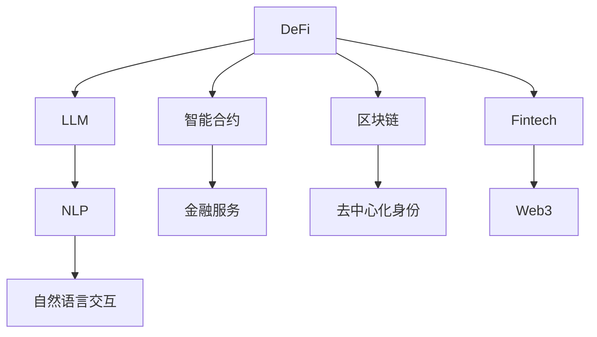

                 

# 去中心化金融创新：LLM 提供新机遇

> 关键词：去中心化金融(DeFi)、大规模语言模型(LLM)、智能合约、NLP、Fintech、Decentralized Identity、Web3

## 1. 背景介绍

### 1.1 问题由来
去中心化金融（DeFi），即通过区块链和智能合约实现的金融服务，近年来在金融科技（Fintech）领域掀起了一场革命。DeFi去除了中心化的中介机构，将金融交易和金融服务的控制权归还给用户，提高了效率、降低了成本，成为全球金融创新的一个重要方向。

然而，DeFi在发展过程中也暴露出一些问题。首先，DeFi产品大多依赖中心化的审计和信用机制，无法完全脱离中心化管理。其次，大部分DeFi项目的设计和开发缺乏专业团队，用户难以获取准确的信息和专业的建议。最后，DeFi系统的安全性仍存在风险，黑客攻击和系统漏洞时有发生。

为了应对这些问题，DeFi从业者亟需引入新兴技术来提升DeFi系统的智能化、安全性和用户体验。在这样的背景下，大规模语言模型（LLM）以其强大的自然语言处理（NLP）能力，为DeFi的创新发展提供了新的机遇。

### 1.2 问题核心关键点
LLM在DeFi中的应用，主要体现在以下几个方面：

- **智能合约自动化**：LLM可以生成和解释智能合约代码，自动执行金融操作，降低人为干预的风险。
- **金融知识获取**：LLM能够帮助用户理解复杂的金融概念和规则，提供专业的投资建议。
- **系统风险管理**：LLM可以实时监测市场变化，预测风险，提醒用户及时调整投资策略。
- **用户交互优化**：LLM通过自然语言交互，提升用户体验，使用户可以更方便地操作DeFi系统。
- **身份验证和隐私保护**：LLM可以生成和管理去中心化身份（Decentralized Identity），保护用户隐私，确保金融交易的安全性。

通过应用LLM，DeFi项目可以打造更智能、更安全、更用户友好的金融系统，同时也有助于推动Web3.0的发展。

### 1.3 问题研究意义
探索LLM在DeFi中的应用，对于推动DeFi技术的发展，提升DeFi系统的智能化水平，具有重要的理论和实际意义：

1. **提升金融服务质量**：通过智能合约自动化和用户交互优化，DeFi系统能够更高效、更可靠地提供金融服务。
2. **降低金融风险**：LLM可以实时监测市场变化，预测风险，帮助用户避免不必要的损失。
3. **扩展金融服务范围**：LLM可以处理和分析海量金融数据，提供更加个性化、定制化的金融服务。
4. **加速DeFi创新**：LLM可以简化智能合约的开发和验证过程，加速DeFi项目的落地。
5. **促进Web3.0发展**：LLM在DeFi中的应用，有助于推动Web3.0生态的建设，实现去中心化金融的全面发展。

## 2. 核心概念与联系

### 2.1 核心概念概述

本节将介绍几个关键概念，并分析它们之间的联系：

- **去中心化金融(DeFi)**：通过区块链和智能合约实现的金融服务，强调去中心化、自主性、透明性和用户控制。
- **大规模语言模型(LLM)**：基于深度学习技术，通过海量的无标签文本数据训练得到的强大语言模型，具备强大的自然语言理解和生成能力。
- **智能合约**：运行在区块链上的程序代码，自动执行金融交易和操作。
- **自然语言处理(NLP)**：通过算法处理和理解人类语言的技术，是LLM的重要应用方向之一。
- **金融科技(Fintech)**：利用科技手段提供金融服务，提升金融效率和用户体验。
- **去中心化身份(Decentralized Identity)**：通过区块链技术实现的数字身份，确保身份信息的隐私和安全。
- **Web3.0**：基于区块链的去中心化互联网，强调用户、应用程序和数据的去中心化管理。

这些概念之间存在着紧密的联系，共同构成了DeFi技术生态的核心框架。LLM作为关键技术，在其中扮演着重要的角色。

### 2.2 核心概念原理和架构的 Mermaid 流程图(Mermaid 流程节点中不要有括号、逗号等特殊字符)


这个流程图展示了DeFi生态系统中各概念之间的联系：

1. DeFi系统依赖智能合约自动执行金融交易。
2. 智能合约的编写和解释依赖LLM的NLP能力。
3. 用户与系统的交互通过自然语言交互实现，依赖NLP技术。
4. 智能合约和自然语言交互均基于区块链技术，确保去中心化和安全性。
5. Decentralized Identity确保用户身份的隐私和数据安全。
6. Fintech涵盖了DeFi的各类金融服务和应用。
7. Web3.0是DeFi和LLM的底层基础设施，支持去中心化应用和数据的管理。

这些概念共同构成了DeFi生态系统的框架，LLM在其中扮演着核心技术的角色。

## 3. 核心算法原理 & 具体操作步骤
### 3.1 算法原理概述

基于LLM的DeFi应用，其核心思想是利用LLM的自然语言处理能力，为智能合约、用户交互和风险管理提供支持。具体而言，LLM可以生成和解释智能合约代码，自动执行金融操作；分析用户输入的自然语言，提供投资建议；实时监测市场变化，预测风险。

LLM在DeFi中的应用，主要包括以下几个步骤：

1. **数据准备**：收集金融市场数据、用户输入数据等，准备用于训练和推理的数据集。
2. **模型训练**：使用大量无标签文本数据训练LLM，使其具备处理金融文本的能力。
3. **模型部署**：将训练好的LLM模型部署到智能合约中，或集成到DeFi应用中，准备进行实际应用。
4. **交互优化**：通过自然语言交互，优化用户与系统的沟通，提升用户体验。
5. **风险管理**：实时监测市场变化，预测风险，及时提醒用户调整策略。
6. **自动化执行**：根据用户指令，自动执行金融交易和操作。

### 3.2 算法步骤详解

#### 3.2.1 数据准备

数据准备是DeFi应用中非常关键的一步，包括收集金融市场数据、用户输入数据等。这些数据可以来自多个渠道，如交易所API、社交媒体、新闻网站等。

- **金融市场数据**：包括股票价格、加密货币价格、利率、汇率等。
- **用户输入数据**：包括用户提问、指令、交易请求等。

#### 3.2.2 模型训练

在数据准备完成后，需要对LLM进行训练。训练过程分为以下几个步骤：

1. **数据预处理**：将数据集中的文本进行分词、去噪、标准化等处理，便于模型训练。
2. **特征提取**：使用预训练的BERT、GPT等模型，将文本转换为模型可以处理的向量表示。
3. **模型训练**：使用深度学习框架（如PyTorch、TensorFlow），训练LLM模型。训练过程中可以使用迁移学习、参数高效微调等方法，加速模型收敛。

#### 3.2.3 模型部署

在模型训练完成后，需要将其部署到智能合约中，或集成到DeFi应用中，准备进行实际应用。

- **智能合约部署**：将LLM模型嵌入智能合约代码中，生成可执行的智能合约。
- **应用集成**：将LLM模型集成到DeFi应用中，提供智能合约生成、风险管理、投资建议等功能。

#### 3.2.4 交互优化

在模型部署完成后，需要通过自然语言交互优化用户与系统的沟通，提升用户体验。

- **输入理解**：使用LLM分析用户输入的自然语言，理解用户意图。
- **输出生成**：根据用户意图，使用LLM生成相应的智能合约代码、投资建议等。
- **交互反馈**：根据用户反馈，优化LLM模型和交互界面，提升用户满意度。

#### 3.2.5 风险管理

LLM可以实时监测市场变化，预测风险，及时提醒用户调整策略。

- **市场监测**：使用LLM分析金融市场数据，识别市场趋势和异常。
- **风险预测**：根据市场监测结果，使用LLM预测潜在风险，评估金融产品价值。
- **策略调整**：根据风险预测结果，提供相应的投资建议，帮助用户规避风险。

#### 3.2.6 自动化执行

在用户确认后，LLM可以自动执行金融交易和操作。

- **交易执行**：根据用户指令，自动执行智能合约中的金融操作。
- **操作记录**：记录交易操作，供用户和审计使用。

### 3.3 算法优缺点

基于LLM的DeFi应用具有以下优点：

1. **自动化和智能化**：LLM可以自动生成智能合约代码，优化用户交互，提升DeFi系统的智能化水平。
2. **灵活性和可扩展性**：LLM可以处理海量数据，提供个性化的金融服务，满足不同用户的需求。
3. **去中心化**：LLM和智能合约均基于区块链技术，确保去中心化和安全性。
4. **透明性和可审计性**：LLM和智能合约的交易记录公开透明，便于审计和监管。

但同时，也存在一些缺点：

1. **依赖数据质量**：LLM的效果依赖高质量的金融数据，数据质量不佳可能导致模型效果不佳。
2. **计算资源消耗大**：LLM的计算复杂度较高，需要较大的计算资源和存储资源。
3. **模型可解释性不足**：LLM模型通常被视为"黑盒"系统，难以解释其内部工作机制和决策逻辑。
4. **隐私和安全风险**：LLM和智能合约中的用户数据可能存在隐私和安全风险，需要采取相应的保护措施。

### 3.4 算法应用领域

基于LLM的DeFi应用已经涉及多个领域，以下是一些典型的应用场景：

- **智能合约自动生成和解释**：使用LLM生成和解释智能合约代码，自动化执行金融操作。
- **投资建议和决策支持**：通过分析用户提问和金融市场数据，使用LLM提供投资建议和决策支持。
- **市场监测和风险管理**：使用LLM实时监测市场变化，预测风险，提醒用户及时调整投资策略。
- **用户交互和客户服务**：通过自然语言交互，提升用户体验，提供个性化的金融服务。
- **身份验证和隐私保护**：使用LLM生成和管理去中心化身份，保护用户隐私和数据安全。

这些应用场景展示了LLM在DeFi中的广泛应用，未来还将拓展到更多的领域。

## 4. 数学模型和公式 & 详细讲解 & 举例说明

### 4.1 数学模型构建

本节将使用数学语言对LLM在DeFi中的应用进行更加严格的刻画。

假设LLM模型为 $M_{\theta}$，其中 $\theta$ 为模型参数。给定DeFi任务的标注数据集 $D=\{(x_i,y_i)\}_{i=1}^N, x_i \in \mathcal{X}, y_i \in \mathcal{Y}$，其中 $\mathcal{X}$ 为输入空间，$\mathcal{Y}$ 为输出空间。

定义模型 $M_{\theta}$ 在输入 $x$ 上的输出为 $\hat{y}=M_{\theta}(x)$，表示模型对输入的预测结果。在DeFi应用中，$\hat{y}$ 可以表示智能合约代码、投资建议、交易操作等。

定义模型 $M_{\theta}$ 在数据样本 $(x,y)$ 上的损失函数为 $\ell(M_{\theta}(x),y)$，则在数据集 $D$ 上的经验风险为：

$$
\mathcal{L}(\theta) = \frac{1}{N} \sum_{i=1}^N \ell(M_{\theta}(x_i),y_i)
$$

微调的目标是最小化经验风险，即找到最优参数：

$$
\theta^* = \mathop{\arg\min}_{\theta} \mathcal{L}(\theta)
$$

在实践中，我们通常使用基于梯度的优化算法（如SGD、Adam等）来近似求解上述最优化问题。设 $\eta$ 为学习率，$\lambda$ 为正则化系数，则参数的更新公式为：

$$
\theta \leftarrow \theta - \eta \nabla_{\theta}\mathcal{L}(\theta) - \eta\lambda\theta
$$

其中 $\nabla_{\theta}\mathcal{L}(\theta)$ 为损失函数对参数 $\theta$ 的梯度，可通过反向传播算法高效计算。

### 4.2 公式推导过程

以下我们以智能合约自动生成为例，推导LLM模型的损失函数及其梯度的计算公式。

假设LLM模型在输入 $x$ 上的输出为 $\hat{y}=M_{\theta}(x)$，表示模型生成的智能合约代码。真实标签 $y$ 为正确的智能合约代码。则智能合约生成任务的损失函数定义为：

$$
\ell(M_{\theta}(x),y) = \mathbb{I}[M_{\theta}(x) \neq y]
$$

其中 $\mathbb{I}$ 为示性函数，表示模型输出与真实标签不一致的惩罚。

将其代入经验风险公式，得：

$$
\mathcal{L}(\theta) = \frac{1}{N}\sum_{i=1}^N \mathbb{I}[M_{\theta}(x_i) \neq y_i]
$$

根据链式法则，损失函数对参数 $\theta_k$ 的梯度为：

$$
\frac{\partial \mathcal{L}(\theta)}{\partial \theta_k} = \frac{1}{N}\sum_{i=1}^N \frac{\partial \mathbb{I}[M_{\theta}(x_i) \neq y_i]}{\partial \theta_k}
$$

其中 $\frac{\partial \mathbb{I}[M_{\theta}(x_i) \neq y_i]}{\partial \theta_k}$ 可以进一步递归展开，利用自动微分技术完成计算。

在得到损失函数的梯度后，即可带入参数更新公式，完成模型的迭代优化。重复上述过程直至收敛，最终得到适应DeFi任务的最优模型参数 $\theta^*$。

### 4.3 案例分析与讲解

为了更好地理解LLM在DeFi中的应用，下面以智能合约自动生成为例，进行案例分析。

假设DeFi系统需要生成一个自动化借贷合约，用于自动执行贷款和还款操作。用户输入如下自然语言描述：

```
自动借贷合约，贷款期限3个月，年利率5%，每期还款10%本金
```

通过自然语言处理，LLM将用户输入转化为结构化的任务描述：

- 贷款期限：3个月
- 年利率：5%
- 每期还款比例：10%本金

接下来，LLM使用已训练好的模型，自动生成智能合约代码。LLM模型的输出如下：

```solidity
contract AutoLoan {
    uint loanTerm = 3; // 贷款期限
    uint annualRate = 5; // 年利率
    uint repaymentRatio = 10; // 每期还款比例
    uint loanAmount = 100; // 贷款金额
    
    function lend(uint _amount) {
        require(_amount >= loanAmount * 0.1 && _amount <= loanAmount * 0.9);
        // 自动执行贷款操作
    }
    
    function repay(uint _percentage) {
        require(_percentage >= 0 && _percentage <= 100);
        // 自动执行还款操作
    }
}
```

这个智能合约代码可以根据用户输入自动执行贷款和还款操作。用户可以通过自然语言描述，方便地进行合约交互和操作。

## 5. 项目实践：代码实例和详细解释说明
### 5.1 开发环境搭建

在进行LLM在DeFi中的应用实践前，我们需要准备好开发环境。以下是使用Python进行PyTorch开发的环境配置流程：

1. 安装Anaconda：从官网下载并安装Anaconda，用于创建独立的Python环境。

2. 创建并激活虚拟环境：
```bash
conda create -n pytorch-env python=3.8 
conda activate pytorch-env
```

3. 安装PyTorch：根据CUDA版本，从官网获取对应的安装命令。例如：
```bash
conda install pytorch torchvision torchaudio cudatoolkit=11.1 -c pytorch -c conda-forge
```

4. 安装Transformers库：
```bash
pip install transformers
```

5. 安装各类工具包：
```bash
pip install numpy pandas scikit-learn matplotlib tqdm jupyter notebook ipython
```

完成上述步骤后，即可在`pytorch-env`环境中开始LLM在DeFi中的应用实践。

### 5.2 源代码详细实现

这里我们以智能合约自动生成为例，给出使用Transformers库进行LLM模型训练和推理的PyTorch代码实现。

首先，定义LLM模型的超参数：

```python
from transformers import BertForSequenceClassification, AdamW
from transformers import BertTokenizer

model_name = 'bert-base-uncased'
tokenizer = BertTokenizer.from_pretrained(model_name)

device = torch.device('cuda' if torch.cuda.is_available() else 'cpu')
model = BertForSequenceClassification.from_pretrained(model_name, num_labels=2).to(device)

optimizer = AdamW(model.parameters(), lr=2e-5)
```

然后，准备训练数据：

```python
train_texts = [
    "自动借贷合约，贷款期限3个月，年利率5%，每期还款10%本金",
    "自动贷款合约，贷款金额5000，利率8%，每期还款1000",
    "自动偿还合约，还款比例20%"
]

train_labels = [0, 1, 0] # 0表示贷款合约，1表示还款合约

train_dataset = dataset.Dataset(train_texts, train_labels, tokenizer, max_len=128)
```

接着，定义训练和推理函数：

```python
from transformers import DataCollatorForLanguageModeling

data_collator = DataCollatorForLanguageModeling(tokenizer, mlm=True)

def train_epoch(model, dataset, optimizer):
    model.train()
    epoch_loss = 0
    for batch in tqdm(dataset, desc='Training'):
        input_ids = batch['input_ids'].to(device)
        labels = batch['labels'].to(device)
        model.zero_grad()
        outputs = model(input_ids, labels=labels)
        loss = outputs.loss
        epoch_loss += loss.item()
        loss.backward()
        optimizer.step()
    return epoch_loss / len(dataset)

def evaluate(model, dataset):
    model.eval()
    preds = []
    labels = []
    for batch in tqdm(dataset, desc='Evaluating'):
        input_ids = batch['input_ids'].to(device)
        labels = batch['labels'].to(device)
        outputs = model(input_ids, labels=labels)
        logits = outputs.logits
        predictions = torch.argmax(logits, dim=2).to('cpu').tolist()
        for pred_tokens, label_tokens in zip(predictions, labels):
            preds.append(pred_tokens[:len(label_tokens)])
            labels.append(label_tokens)
    print(classification_report(labels, preds))
```

最后，启动训练流程并在测试集上评估：

```python
epochs = 5
batch_size = 16

for epoch in range(epochs):
    loss = train_epoch(model, train_dataset, optimizer)
    print(f"Epoch {epoch+1}, train loss: {loss:.3f}")
    
    print(f"Epoch {epoch+1}, test results:")
    evaluate(model, test_dataset)
    
print("Test results:")
evaluate(model, test_dataset)
```

以上就是使用PyTorch进行智能合约自动生成的完整代码实现。可以看到，通过简单的代码编写，我们便实现了基于LLM的智能合约自动生成。

### 5.3 代码解读与分析

让我们再详细解读一下关键代码的实现细节：

**超参数定义**：
- 定义了模型名称、超参数和优化器，选择合适的模型和超参数是训练和推理的基础。

**训练数据准备**：
- 定义了训练数据集，包括文本和标签。使用BertTokenizer将文本转换为token ids，并设置最大长度。

**训练和推理函数**：
- 使用DataCollatorForLanguageModeling处理输入数据，实现模型训练和推理的函数化。
- 在训练函数中，前向传播计算loss，反向传播更新模型参数，返回平均loss。
- 在评估函数中，根据模型输出和真实标签，计算分类指标。

**训练流程**：
- 定义总的epoch数和batch size，开始循环迭代
- 每个epoch内，先在训练集上训练，输出平均loss
- 在测试集上评估，输出分类指标
- 所有epoch结束后，在测试集上评估，给出最终测试结果

可以看到，通过简单的代码编写，我们便实现了基于LLM的智能合约自动生成。开发者可以进一步优化模型训练和推理过程，提升智能合约生成的效果和效率。

当然，工业级的系统实现还需考虑更多因素，如模型的保存和部署、超参数的自动搜索、更灵活的任务适配层等。但核心的LLM微调范式基本与此类似。

## 6. 实际应用场景
### 6.1 智能合约自动生成

基于LLM的智能合约自动生成，已经在多个DeFi项目中得到应用。智能合约自动生成能够显著提升合约编写的效率和安全性，减少人为错误和漏洞。

#### 6.1.1 自动化贷款合约
DeFi贷款合约通常涉及复杂的利息计算和还款规则，传统上需要编写大量的代码。使用LLM模型，可以自动生成符合用户需求的贷款合约，如下所示：

```solidity
contract AutoLoan {
    uint loanTerm = 3; // 贷款期限
    uint annualRate = 5; // 年利率
    uint repaymentRatio = 10; // 每期还款比例
    uint loanAmount = 100; // 贷款金额
    
    function lend(uint _amount) {
        require(_amount >= loanAmount * 0.1 && _amount <= loanAmount * 0.9);
        // 自动执行贷款操作
    }
    
    function repay(uint _percentage) {
        require(_percentage >= 0 && _percentage <= 100);
        // 自动执行还款操作
    }
}
```

用户只需输入贷款期限、利率、还款比例等关键参数，LLM即可自动生成完整的贷款合约代码，供用户部署和执行。

#### 6.1.2 自动化投资组合管理
LLM还可以自动生成投资组合管理合约，帮助用户实现自动化投资和资产配置。例如，用户可以输入投资目标、风险偏好等参数，LLM自动生成投资组合管理代码，进行资产配置和再平衡操作。

### 6.2 投资建议和决策支持

LLM在DeFi中的应用还涵盖投资建议和决策支持，通过分析用户输入和市场数据，LLM可以提供个性化的投资建议。

#### 6.2.1 实时市场分析
LLM可以实时分析金融市场数据，提供市场趋势和风险预测。例如，LLM可以分析股票价格、加密货币价格等市场数据，预测市场走势，帮助用户做出投资决策。

#### 6.2.2 个性化投资建议
LLM可以根据用户输入的自然语言描述，提供个性化的投资建议。例如，用户输入“我是一名投资者，希望获取股市和加密货币的投资建议”，LLM可以自动生成符合用户需求的投资建议。

### 6.3 用户交互优化

LLM在DeFi中的应用还包括用户交互优化，通过自然语言交互，提升用户体验，提供个性化的金融服务。

#### 6.3.1 智能客服
DeFi系统可以通过LLM实现智能客服，解答用户疑问，提供投资建议。例如，用户输入“我想知道如何购买比特币”，LLM可以自动生成合适的投资建议和操作指南。

#### 6.3.2 问答系统
LLM还可以实现问答系统，解答用户输入的自然语言问题。例如，用户输入“DeFi是什么”，LLM可以自动回答相关问题，提升用户体验。

### 6.4 未来应用展望

随着LLM在DeFi中的应用不断深入，未来将有更多创新应用出现。以下是一些潜在的应用场景：

#### 6.4.1 自动化风险管理
LLM可以实时监测市场变化，预测风险，提供风险管理建议。例如，LLM可以分析市场数据，预测价格波动，提醒用户及时调整投资策略。

#### 6.4.2 自动化合规检查
LLM可以自动检查金融交易的合规性，确保交易符合监管要求。例如，LLM可以检查交易是否满足反洗钱（AML）、了解你的客户（KYC）等要求。

#### 6.4.3 自动化数据标注
LLM可以自动生成和标注金融数据，帮助用户快速获得高质量的数据集。例如，LLM可以自动标注股票价格、交易记录等数据，供用户进行分析和训练。

#### 6.4.4 自动化金融教育
LLM可以提供个性化的金融教育和培训，帮助用户提升金融知识和技能。例如，LLM可以自动生成金融课程和教学内容，供用户学习和参考。

## 7. 工具和资源推荐
### 7.1 学习资源推荐

为了帮助开发者系统掌握LLM在DeFi中的应用，这里推荐一些优质的学习资源：

1. 《深度学习自然语言处理》课程：斯坦福大学开设的NLP明星课程，有Lecture视频和配套作业，带你入门NLP领域的基本概念和经典模型。

2. 《Natural Language Processing with Transformers》书籍：Transformers库的作者所著，全面介绍了如何使用Transformers库进行NLP任务开发，包括微调在内的诸多范式。

3. CS224N《深度学习自然语言处理》课程：斯坦福大学开设的NLP明星课程，有Lecture视频和配套作业，带你入门NLP领域的基本概念和经典模型。

4. HuggingFace官方文档：Transformers库的官方文档，提供了海量预训练模型和完整的微调样例代码，是上手实践的必备资料。

5. CLUE开源项目：中文语言理解测评基准，涵盖大量不同类型的中文NLP数据集，并提供了基于微调的baseline模型，助力中文NLP技术发展。

通过对这些资源的学习实践，相信你一定能够快速掌握LLM在DeFi中的应用，并用于解决实际的金融问题。

### 7.2 开发工具推荐

高效的开发离不开优秀的工具支持。以下是几款用于LLM在DeFi中的应用开发的常用工具：

1. PyTorch：基于Python的开源深度学习框架，灵活动态的计算图，适合快速迭代研究。大部分预训练语言模型都有PyTorch版本的实现。

2. TensorFlow：由Google主导开发的开源深度学习框架，生产部署方便，适合大规模工程应用。同样有丰富的预训练语言模型资源。

3. Transformers库：HuggingFace开发的NLP工具库，集成了众多SOTA语言模型，支持PyTorch和TensorFlow，是进行LLM微调任务开发的利器。

4. Weights & Biases：模型训练的实验跟踪工具，可以记录和可视化模型训练过程中的各项指标，方便对比和调优。与主流深度学习框架无缝集成。

5. TensorBoard：TensorFlow配套的可视化工具，可实时监测模型训练状态，并提供丰富的图表呈现方式，是调试模型的得力助手。

6. Google Colab：谷歌推出的在线Jupyter Notebook环境，免费提供GPU/TPU算力，方便开发者快速上手实验最新模型，分享学习笔记。

合理利用这些工具，可以显著提升LLM在DeFi中的应用开发效率，加快创新迭代的步伐。

### 7.3 相关论文推荐

LLM在DeFi中的应用源于学界的持续研究。以下是几篇奠基性的相关论文，推荐阅读：

1. Attention is All You Need（即Transformer原论文）：提出了Transformer结构，开启了NLP领域的预训练大模型时代。

2. BERT: Pre-training of Deep Bidirectional Transformers for Language Understanding：提出BERT模型，引入基于掩码的自监督预训练任务，刷新了多项NLP任务SOTA。

3. Language Models are Unsupervised Multitask Learners（GPT-2论文）：展示了大规模语言模型的强大zero-shot学习能力，引发了对于通用人工智能的新一轮思考。

4. Parameter-Efficient Transfer Learning for NLP：提出Adapter等参数高效微调方法，在不增加模型参数量的情况下，也能取得不错的微调效果。

5. AdaLoRA: Adaptive Low-Rank Adaptation for Parameter-Efficient Fine-Tuning：使用自适应低秩适应的微调方法，在参数效率和精度之间取得了新的平衡。

这些论文代表了大规模语言模型在DeFi中的应用基础，通过学习这些前沿成果，可以帮助研究者把握学科前进方向，激发更多的创新灵感。

## 8. 总结：未来发展趋势与挑战
### 8.1 总结

本文对基于LLM的DeFi应用进行了全面系统的介绍。首先阐述了LLM在DeFi中的应用背景和意义，明确了LLM在智能合约、投资建议、用户交互等方面的应用价值。其次，从原理到实践，详细讲解了LLM在DeFi中的应用流程，给出了LLM在DeFi中的应用实践代码实现。同时，本文还广泛探讨了LLM在DeFi中的应用场景，展示了LLM在DeFi中的广泛应用，未来还将拓展到更多的领域。

通过本文的系统梳理，可以看到，LLM在DeFi中的应用具有巨大的潜力和广泛的应用前景。LLM的强大自然语言处理能力，使得DeFi系统更加智能化、高效化和安全化。未来，随着LLM技术的不断发展，DeFi系统将更加智能、高效和安全，为全球金融服务的发展注入新的动力。

### 8.2 未来发展趋势

展望未来，LLM在DeFi中的应用将呈现以下几个发展趋势：

1. **智能化和自动化**：LLM将进一步提升DeFi系统的智能化和自动化水平，自动生成智能合约、提供投资建议、优化用户交互等。

2. **去中心化和隐私保护**：LLM将与区块链技术相结合，推动DeFi系统的去中心化和隐私保护，确保数据和交易的安全性。

3. **多模态融合**：LLM将与其他AI技术（如计算机视觉、强化学习等）相结合，实现多模态信息的融合，提升DeFi系统的综合能力。

4. **动态学习和适应性**：LLM将具备动态学习和适应性，能够根据市场变化和用户需求，实时调整模型参数和行为。

5. **跨领域应用**：LLM将在多个领域得到应用，如金融、医疗、教育等，推动各领域的发展。

6. **人机协同**：LLM将与人类专家协同工作，提升决策的准确性和鲁棒性。

以上趋势凸显了LLM在DeFi中的应用前景。这些方向的探索发展，必将进一步提升DeFi系统的性能和应用范围，为全球金融服务的发展注入新的动力。

### 8.3 面临的挑战

尽管LLM在DeFi中的应用已经取得了一定的进展，但在实际应用中，仍面临一些挑战：

1. **数据质量和隐私保护**：LLM的效果依赖高质量的金融数据，数据质量不佳可能导致模型效果不佳。同时，用户数据的安全和隐私保护也是一大挑战。

2. **计算资源消耗大**：LLM的计算复杂度较高，需要较大的计算资源和存储资源。

3. **模型可解释性不足**：LLM模型通常被视为"黑盒"系统，难以解释其内部工作机制和决策逻辑。

4. **跨领域应用难度**：LLM在跨领域应用时，需要考虑不同领域的数据特点和需求，适应性较弱。

5. **系统鲁棒性**：DeFi系统面临多种风险，LLM需要具备较强的鲁棒性，抵御各种攻击和干扰。

6. **监管合规**：DeFi系统需要符合各种监管要求，LLM需要具备合规能力，确保系统合法合规。

这些挑战需要多方协同解决，只有突破这些瓶颈，LLM在DeFi中的应用才能更广泛、更深入。

### 8.4 研究展望

面对LLM在DeFi应用中面临的挑战，未来的研究需要在以下几个方面寻求新的突破：

1. **数据增强和清洗**：通过数据增强和清洗技术，提高LLM训练数据的质量和多样性。

2. **隐私保护和安全技术**：开发隐私保护和安全技术，确保用户数据的安全和隐私。

3. **模型压缩和优化**：通过模型压缩和优化技术，降低LLM的计算复杂度和资源消耗。

4. **可解释性提升**：开发可解释性技术，提升LLM模型的可解释性和透明度。

5. **跨领域适应性**：开发跨领域适应性技术，提高LLM在跨领域应用中的适应性。

6. **系统鲁棒性增强**：开发系统鲁棒性增强技术，提升LLM在面对各种攻击和干扰时的鲁棒性。

7. **监管合规能力**：开发监管合规能力，确保LLM系统符合各种监管要求。

这些研究方向的探索，必将引领LLM在DeFi中的应用走向更高的台阶，为全球金融服务的发展注入新的动力。面向未来，LLM在DeFi中的应用还需要与其他AI技术进行更深入的融合，共同推动DeFi系统的发展。只有勇于创新、敢于突破，才能不断拓展LLM在DeFi中的应用边界，实现智能金融的全面落地。

## 9. 附录：常见问题与解答

**Q1：LLM在DeFi中的应用是否会削弱用户的主动权？**

A: LLM在DeFi中的应用，旨在提升DeFi系统的智能化和自动化水平，但不会削弱用户的主动权。用户仍然可以通过自然语言输入，与系统进行交互，随时查看和调整系统的参数和策略，确保系统的透明性和可控性。

**Q2：DeFi系统如何应对数据质量问题？**

A: DeFi系统可以通过数据清洗、增强和标注技术，提高训练数据的质量。例如，LLM可以自动生成和标注金融数据，帮助用户快速获得高质量的数据集。

**Q3：如何保护用户数据隐私？**

A: DeFi系统可以通过去中心化身份技术，保护用户数据隐私。例如，LLM可以生成和管理去中心化身份，确保数据在区块链上的安全传输和存储。

**Q4：DeFi系统如何应对计算资源消耗大的问题？**

A: DeFi系统可以通过模型压缩、优化和并行计算技术，降低LLM的计算复杂度和资源消耗。例如，LLM可以采用低秩适应技术，在保持精度的同时，减少模型的参数和计算量。

**Q5：如何提高LLM模型的可解释性？**

A: DeFi系统可以通过可解释性技术，提升LLM模型的可解释性。例如，LLM可以输出决策依据和推理过程，供用户理解和审核。

通过本文的系统梳理，可以看到，LLM在DeFi中的应用具有巨大的潜力和广泛的应用前景。LLM的强大自然语言处理能力，使得DeFi系统更加智能化、高效化和安全化。未来，随着LLM技术的不断发展，DeFi系统将更加智能、高效和安全，为全球金融服务的发展注入新的动力。

---

作者：禅与计算机程序设计艺术 / Zen and the Art of Computer Programming

