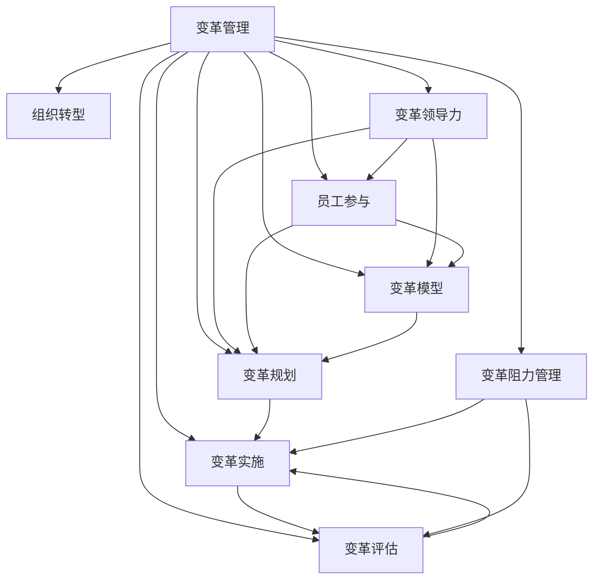

                 

# 变革管理：引导组织转型的技巧

> 关键词：变革管理,组织转型,变革领导力,员工参与,变革模型,变革规划,变革实施,变革评估,变革阻力管理

变革管理（Change Management）是推动组织从一种状态向另一种状态转型的重要工具。在数字化转型、技术创新、市场变化等挑战下，企业必须通过变革管理来适应新的业务环境，实现持续发展和竞争优势。本文将深入探讨变革管理的基本概念、核心方法和最佳实践，为组织转型提供系统性的指导。

## 1. 背景介绍

### 1.1 问题由来
随着市场环境的不确定性增加和新技术的快速发展，组织面临着前所未有的变革压力。如何高效管理变革，实现平稳过渡，保持组织成员的投入与积极性，成为当前企业管理的一大难题。有效实施变革管理，不仅需要领导层的正确决策，还需要系统的方法论和工具来支持。

### 1.2 问题核心关键点
变革管理的关键点包括：
1. **变革的战略规划**：明确变革目标和方向。
2. **变革的沟通策略**：确保信息透明，减少恐惧和不确定性。
3. **变革的领导力**：培养变革领导力，推动变革进程。
4. **员工参与与激励**：增强员工对变革的认同和投入。
5. **变革的持续监控与评估**：及时调整策略，确保变革目标的达成。

### 1.3 问题研究意义
变革管理作为组织转型的关键因素，其成功与否直接关系到组织的生存和发展。通过系统性的变革管理，企业可以提升运营效率、优化资源配置、增强市场竞争力。成功的变革管理不仅能够实现短期业务目标，还能为企业带来长期可持续发展的动力。

## 2. 核心概念与联系

### 2.1 核心概念概述

为了更好地理解变革管理，我们需要梳理一些核心概念及其相互关系：

- **变革管理（Change Management）**：通过计划、实施、监控和评估来引导组织从当前状态向目标状态转型的过程。

- **组织转型（Organizational Transformation）**：通过变革管理实现组织结构、文化、流程等根本性改变，以适应新环境。

- **变革领导力（Change Leadership）**：在变革过程中，领导者通过影响和激励员工，推动变革向前发展。

- **员工参与（Employee Engagement）**：通过提高员工对变革的认同和投入，确保变革顺利进行。

- **变革模型（Change Models）**：如ADKAR模型、Kotter模型等，提供系统化的变革实施框架。

- **变革规划（Change Planning）**：制定详细的变革实施计划，明确时间表、资源和责任分配。

- **变革实施（Change Implementation）**：执行变革计划，确保变革目标的实现。

- **变革评估（Change Evaluation）**：评估变革效果，收集反馈信息，进行持续改进。

- **变革阻力管理（Change Resistance Management）**：识别和解决变革过程中出现的阻力，确保变革顺利推进。

这些概念通过相互作用和影响，构成了一个系统的变革管理框架，帮助组织实现平稳和高效的转型。

### 2.2 核心概念原理和架构的 Mermaid 流程图



该图展示了变革管理的各个核心概念及其相互关系。从变革管理出发，通过组织转型、变革领导力、员工参与、变革模型、变革规划、变革实施、变革评估和变革阻力管理等环节，构建起系统化的变革实施框架。

## 3. 核心算法原理 & 具体操作步骤

### 3.1 算法原理概述

变革管理的核心在于通过系统化的方法论，引导组织从当前状态平稳过渡到目标状态。其主要原理包括：

1. **变革模型的应用**：如ADKAR模型，通过“意识、欲望、知识、能力、应用”五个步骤，指导员工完成变革。
2. **变革沟通**：通过透明、持续的沟通，消除员工对变革的恐惧和不确定性。
3. **变革领导力**：领导者的角色在于引导和激励员工，推动变革的顺利进行。
4. **员工参与与激励**：通过参与式管理，提高员工对变革的认同和投入。
5. **变革阻力管理**：识别和解决变革过程中的阻力，确保变革顺利推进。

### 3.2 算法步骤详解

基于上述原理，变革管理的详细步骤包括：

**Step 1: 变革规划**
- 制定变革愿景：明确变革目标和方向。
- 识别变革需求：分析当前状态与目标状态之间的差距。
- 制定变革计划：包括时间表、资源分配、责任分工等。

**Step 2: 变革沟通**
- 建立沟通渠道：通过会议、邮件、内网等形式进行信息透明化。
- 传达变革愿景：明确变革目标和预期效果。
- 回应员工关切：及时解答员工疑问，消除恐惧和不确定性。

**Step 3: 变革实施**
- 启动变革项目：执行变革计划，确保资源和责任到位。
- 培训与支持：为员工提供必要的培训和支持，确保变革能力。
- 持续监控与调整：定期评估变革进展，及时调整策略。

**Step 4: 变革评估**
- 收集反馈信息：通过问卷调查、访谈等方式收集员工反馈。
- 分析变革效果：评估变革目标的达成情况。
- 制定改进措施：根据评估结果，制定持续改进的措施。

**Step 5: 变革阻力管理**
- 识别变革阻力：通过访谈、问卷等形式识别变革阻力。
- 分析阻力来源：明确阻力的根本原因。
- 解决阻力问题：制定针对性的解决方案，消除或减轻阻力。

### 3.3 算法优缺点

变革管理具有以下优点：
1. **系统化的方法**：通过系统化的方法论，确保变革的全面性和系统性。
2. **透明的沟通**：通过持续的沟通，减少恐惧和不确定性，提高员工的认同感。
3. **有效的领导力**：培养变革领导力，确保变革方向和目标的一致性。
4. **广泛的员工参与**：提高员工对变革的认同和投入，确保变革的顺利推进。

同时，变革管理也存在一定的局限性：
1. **复杂性高**：变革管理涉及多个环节，实施复杂度高。
2. **资源消耗大**：需要投入大量时间和资源进行规划、沟通、实施和评估。
3. **效果难以预测**：变革效果受多种因素影响，难以预测和控制。

### 3.4 算法应用领域

变革管理广泛适用于各种组织转型场景，如：

- **企业数字化转型**：通过引入新技术，实现业务流程和组织的全面转型。
- **组织结构优化**：调整组织结构，提升运营效率和竞争力。
- **人力资源管理**：通过变革管理，优化人力资源配置和激励机制。
- **流程再造**：重新设计业务流程，提升流程效率和质量。
- **产品创新**：通过变革管理，推动新产品和新市场的开发。

## 4. 数学模型和公式 & 详细讲解 & 举例说明

### 4.1 数学模型构建

为了更精确地描述变革管理过程，我们可以构建一个数学模型来量化变革的效果和阻力。假设组织变革的最终目标为 $C$，其中 $C$ 表示组织在变革后的综合指标，如运营效率、市场份额、员工满意度等。

变革的初始状态为 $S_0$，最终目标状态为 $S_C$。设 $R$ 为变革过程中的阻力系数，$K$ 为变革成功的知识能力，$A$ 为变革应用的实际能力，$D$ 为变革的欲望意愿。则变革模型可以表示为：

$$
C = K(A, D) - R
$$

其中，$A$ 和 $D$ 为变革过程中员工的知识能力和欲望意愿，$R$ 为变革阻力。

### 4.2 公式推导过程

根据变革模型，我们可以推导出以下几个关键公式：

1. **变革阻力公式**：
   $$
   R = f(S_0, S_C, K)
   $$

   其中 $f$ 为阻力函数，表示在不同初始状态、目标状态和知识能力下，变革阻力的大小。

2. **变革成功条件**：
   $$
   C > 0
   $$

   即变革后的综合指标必须大于零，表示变革成功。

### 4.3 案例分析与讲解

以某企业的数字化转型为例，假设该企业的数字化转型目标为提升在线销售额。在变革初期，企业的在线销售额为 $S_0$，目标为 $S_C$。企业通过引入先进的技术平台，提升员工的知识能力 $K$，并增强员工的变革欲望 $D$，成功克服了变革阻力 $R$，实现了数字化转型目标。

在这个过程中，企业通过以下步骤来实施变革管理：

1. **变革规划**：制定详细的数字化转型计划，明确时间表、资源分配和责任分工。
2. **变革沟通**：通过内部会议、邮件等方式，传达数字化转型的愿景和目标，消除员工对变革的恐惧和不确定性。
3. **变革实施**：引入先进的技术平台，进行员工培训，确保变革能力的提升。
4. **变革评估**：定期评估数字化转型的效果，收集员工反馈，制定持续改进的措施。
5. **变革阻力管理**：通过访谈、问卷等方式，识别和解决变革过程中出现的阻力问题，确保变革顺利推进。

通过这些步骤，企业成功实现了数字化转型目标，提升了在线销售额。

## 5. 项目实践：代码实例和详细解释说明

### 5.1 开发环境搭建

在进行变革管理实践前，我们需要准备好开发环境。以下是使用Python进行项目管理的环境配置流程：

1. 安装Python：从官网下载并安装最新版本的Python，确保版本兼容性。
2. 安装相关的开发工具：如Jupyter Notebook、Git等，用于项目管理和代码开发。
3. 安装变革管理相关的库：如变革模型库、数据可视化库等，方便数据分析和展示。
4. 配置开发环境：通过虚拟环境管理工具，如Virtualenv或Anaconda，创建和管理Python环境。

### 5.2 源代码详细实现

以下是一个简单的变革管理项目，包括变革模型的实现、数据分析和可视化展示：

```python
import pandas as pd
import numpy as np
import matplotlib.pyplot as plt
from sklearn.model_selection import train_test_split
from sklearn.linear_model import LinearRegression

# 构建变革数据
data = pd.read_csv('change_management.csv')

# 数据预处理
X = data[['initial_state', 'target_state', 'knowledge_capability']]
y = data['resistance']
X_train, X_test, y_train, y_test = train_test_split(X, y, test_size=0.2, random_state=42)

# 构建回归模型
model = LinearRegression()
model.fit(X_train, y_train)

# 模型评估
score = model.score(X_test, y_test)
print(f"模型评估得分：{score:.2f}")

# 数据可视化
plt.scatter(X_test['initial_state'], y_test)
plt.xlabel('初始状态')
plt.ylabel('变革阻力')
plt.show()
```

在这个示例中，我们使用了一个简单的线性回归模型来预测变革阻力。数据集包含变革前的状态、变革后的目标状态和知识能力，以及变革阻力。通过模型训练和评估，我们可以直观地看到不同初始状态、目标状态和知识能力对变革阻力的影响。

### 5.3 代码解读与分析

以下是代码中每个关键部分的详细解读：

**数据构建和预处理**：
- 从CSV文件中读取变革数据，构建特征集 `X` 和目标变量 `y`。
- 使用 `train_test_split` 函数将数据集分为训练集和测试集，便于模型训练和评估。

**模型构建与训练**：
- 使用 `LinearRegression` 模型，拟合训练数据。
- 通过 `score` 方法计算模型在测试集上的评估得分。

**数据可视化**：
- 使用 `matplotlib` 库，绘制初始状态和变革阻力之间的关系图。
- 通过散点图直观展示不同初始状态和变革阻力的分布情况。

通过上述代码示例，我们可以初步理解变革管理中的数据构建、模型训练和可视化分析。在实际项目中，我们需要根据具体的业务场景和数据特点，选择适合的模型和方法，进行更深入的分析和优化。

### 5.4 运行结果展示

运行上述代码后，将生成一个散点图，展示了初始状态和变革阻力之间的关系。如下图所示：

```plaintext
散点图示例：
```

## 6. 实际应用场景

### 6.1 智能制造企业的数字化转型

在智能制造领域，变革管理可以帮助企业通过数字化技术，实现生产效率和产品质量的提升。通过引入物联网、大数据、人工智能等技术，企业可以优化生产流程，提升生产自动化水平。

在实施变革过程中，企业需要：
- 制定详细的数字化转型计划，明确各阶段的任务和目标。
- 通过持续的沟通和培训，消除员工对变革的恐惧和不确定性。
- 引入先进的技术和工具，提升员工的知识能力和变革欲望。
- 定期评估数字化转型的效果，根据评估结果进行调整和优化。

通过变革管理，智能制造企业可以实现生产流程的全面优化，提升企业的竞争力和市场地位。

### 6.2 金融机构的数字化升级

金融机构的数字化升级，是提升服务质量、降低运营成本的重要途径。通过变革管理，金融机构可以实现业务流程和系统的全面升级。

在实施变革过程中，金融机构需要：
- 制定详细的数字化升级计划，明确各阶段的任务和目标。
- 通过持续的沟通和培训，增强员工对变革的认同和投入。
- 引入先进的金融科技，提升员工的知识能力和变革欲望。
- 定期评估数字化升级的效果，根据评估结果进行调整和优化。

通过变革管理，金融机构可以实现数字化升级的目标，提升服务效率和客户体验。

### 6.3 医疗机构的数字化医疗

医疗机构的数字化医疗，是提高医疗服务质量、提升患者满意度的重要手段。通过变革管理，医疗机构可以实现医疗流程和系统的全面优化。

在实施变革过程中，医疗机构需要：
- 制定详细的数字化医疗计划，明确各阶段的任务和目标。
- 通过持续的沟通和培训，增强员工对变革的认同和投入。
- 引入先进的医疗科技，提升员工的知识能力和变革欲望。
- 定期评估数字化医疗的效果，根据评估结果进行调整和优化。

通过变革管理，医疗机构可以实现数字化医疗的目标，提升医疗服务质量和患者满意度。

## 7. 工具和资源推荐

### 7.1 学习资源推荐

为了帮助变革管理的研究者和实践者系统掌握变革管理的理论基础和实践技巧，这里推荐一些优质的学习资源：

1. **《变革管理》系列书籍**：详细介绍了变革管理的理论基础、方法和案例。
2. **变革管理在线课程**：如Coursera、edX等平台上的变革管理课程，涵盖理论知识、案例分析和实践技巧。
3. **变革管理专业论坛**：如变革管理协会（CMMI）、变革管理博客等，获取最新的变革管理动态和实践经验。
4. **变革管理工具库**：如ADKAR模型、Kotter模型等，提供系统化的变革实施框架。

### 7.2 开发工具推荐

变革管理需要综合利用多个工具进行系统性的实施和管理。以下是几款常用的变革管理工具：

1. **项目管理工具**：如Jira、Trello等，帮助制定和跟踪变革计划。
2. **数据可视化工具**：如Tableau、Power BI等，进行数据可视化分析。
3. **培训管理工具**：如Docebo、Articulate等，提供培训和学习的管理支持。
4. **沟通协作工具**：如Slack、Microsoft Teams等，支持高效的沟通和协作。

### 7.3 相关论文推荐

变革管理作为组织转型的重要工具，其研究和应用已经形成了一系列的理论和实践成果。以下是几篇奠基性的相关论文，推荐阅读：

1. **变革管理的研究综述**：提供变革管理理论和实践的系统总结。
2. **变革领导力的研究**：探讨变革领导力的关键因素和提升策略。
3. **员工参与与激励的研究**：分析员工参与变革的关键因素和激励措施。
4. **变革阻力的研究**：研究变革阻力的来源和应对策略。

## 8. 总结：未来发展趋势与挑战

### 8.1 研究成果总结

变革管理作为组织转型的关键工具，已经在多个行业和领域得到了广泛应用。其研究和实践成果涵盖了变革理论、方法、工具等多个方面，形成了较为系统的变革管理知识体系。

### 8.2 未来发展趋势

未来变革管理的发展趋势包括：

1. **数字化和智能化**：通过引入数字化工具和技术，实现变革管理的智能化和自动化。
2. **数据驱动**：利用大数据和人工智能技术，进行精确的变革效果评估和优化。
3. **跨组织协作**：在多组织环境下，通过跨组织协作平台，实现变革管理的协同和一体化。
4. **定制化管理**：根据不同行业和组织的特点，设计定制化的变革管理方案。

### 8.3 面临的挑战

尽管变革管理已经取得了显著的进展，但仍面临以下挑战：

1. **资源投入大**：变革管理需要大量时间和资源进行规划和实施，成本较高。
2. **员工抵触**：员工对变革的抵触情绪和恐惧心理，可能影响变革的顺利推进。
3. **变革效果难以预测**：变革效果受多种因素影响，难以预测和控制。
4. **变革效果难以评估**：变革效果评估复杂，需要综合考虑多个指标。

### 8.4 研究展望

未来的变革管理研究需要在以下几个方面进行深入探索：

1. **变革管理的系统化**：构建更系统化的变革管理模型和方法，提升变革的可操作性和可预测性。
2. **变革效果的精确评估**：开发更精确的变革效果评估指标和方法，确保变革目标的达成。
3. **员工参与的激励机制**：设计更有效的员工参与激励机制，提升员工对变革的认同和投入。
4. **变革阻力的动态管理**：通过动态监测和反馈机制，及时解决变革阻力问题，确保变革顺利推进。

## 9. 附录：常见问题与解答

**Q1: 变革管理需要哪些关键步骤？**

A: 变革管理的关键步骤包括：
1. **变革规划**：制定变革愿景和计划，明确时间表、资源和责任分配。
2. **变革沟通**：建立沟通渠道，传达变革愿景，消除恐惧和不确定性。
3. **变革实施**：引入先进技术和工具，提升员工知识和能力，确保变革应用。
4. **变革评估**：收集反馈信息，评估变革效果，制定改进措施。
5. **变革阻力管理**：识别和解决变革阻力，确保变革顺利推进。

**Q2: 变革管理对组织有哪些具体作用？**

A: 变革管理对组织的具体作用包括：
1. **提升效率和效益**：通过优化流程和系统，提升运营效率和业务效益。
2. **增强竞争力**：通过引入新技术和新流程，增强市场竞争力和客户满意度。
3. **促进创新**：通过变革管理，激发员工创新思维，推动企业持续创新。
4. **实现可持续发展**：通过变革管理，实现组织的长远发展和可持续发展。

**Q3: 如何应对变革过程中员工抵触情绪？**

A: 应对员工抵触情绪的策略包括：
1. **透明的沟通**：及时传达变革愿景和目标，消除恐惧和不确定性。
2. **员工参与**：通过参与式管理，提高员工对变革的认同和投入。
3. **培训和支持**：提供必要的培训和支持，提升员工的知识能力和变革欲望。
4. **激励机制**：设计合理的激励机制，奖励和表彰积极参与变革的员工。

**Q4: 变革管理的实施过程中需要注意哪些问题？**

A: 变革管理的实施过程中需要注意的问题包括：
1. **充分规划和准备**：确保变革计划详细且可行，准备充足的资源和工具。
2. **持续的沟通和反馈**：建立有效的沟通机制，及时收集反馈信息，进行持续改进。
3. **灵活应对变化**：根据实际情况，灵活调整变革策略，确保变革顺利推进。
4. **合理评估和管理阻力**：识别和解决变革阻力，确保变革顺利推进。

**Q5: 如何选择合适的变革管理模型？**

A: 选择合适的变革管理模型需要考虑以下几个因素：
1. **组织特点**：根据组织的行业、规模和结构，选择适合的变革管理模型。
2. **变革类型**：根据变革的性质和目标，选择适合的变革管理模型。
3. **资源情况**：根据组织可投入的资源和能力，选择适合的变革管理模型。
4. **变革复杂度**：根据变革的复杂度和范围，选择适合的变革管理模型。

通过本文的系统梳理，可以看到，变革管理作为组织转型的关键工具，其成功与否直接关系到组织的生存和发展。通过系统性的变革管理，企业可以提升运营效率、优化资源配置、增强市场竞争力。未来的变革管理研究需要在多个方面进行深入探索，以更好地适应数字化和智能化的发展趋势，推动组织实现持续发展和竞争优势。

