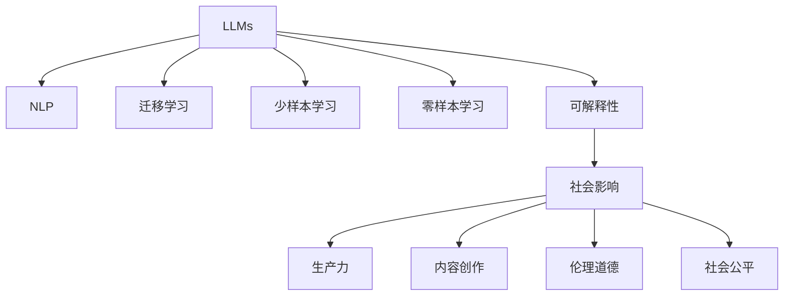

                 

## 1. 背景介绍

### 1.1 问题由来

“后 LLM 时代”是近年来人工智能领域讨论热度极高的一个话题。随着大规模语言模型（Large Language Models, LLMs）如 GPT-3、BERT、T5 等的逐渐成熟，其在自然语言处理（Natural Language Processing, NLP）领域取得了一系列突破性成果，推动了 NLP 技术的落地应用。同时，这些 LLMs 也在更多领域展示出了强大的应用潜力，对社会各个方面产生了深远影响。

然而，随着 LLMs 的进一步发展，其潜在的风险和挑战也逐渐显现，如数据隐私、伦理道德、社会公平等问题，引发了学界和业界的广泛关注。本文将从这些角度出发，探讨 LLMs 对社会的多方面影响，并对其未来发展进行展望。

### 1.2 问题核心关键点

当前 LLMs 对社会的影响主要体现在以下几个方面：

1. **自然语言处理**：提升 NLP 任务的准确度和效率，使机器能够更好地理解自然语言，支持机器翻译、语音识别、情感分析等应用。
2. **社会生产效率**：加速信息获取和处理，提升决策速度，助力医疗、金融、教育等行业效率提升。
3. **内容创作**：辅助或替代部分内容创作，如新闻报道、娱乐内容、技术文档等，降低人工工作量。
4. **伦理道德**：可能带来隐私泄露、偏见放大等问题，引发对数据隐私和伦理道德的关注。
5. **社会公平**：可能导致工作岗位减少，引发对技术进步对就业影响和社会公平性的担忧。

## 2. 核心概念与联系

### 2.1 核心概念概述

为更好地理解 LLMs 对社会的影响，本节将介绍几个关键概念及其相互关系：

- **大规模语言模型（LLMs）**：指基于深度学习模型，能够处理大规模自然语言数据，学习复杂语言表示的模型。如 GPT-3、BERT、T5 等。
- **自然语言处理（NLP）**：指计算机处理和理解人类语言的技术，包括文本分类、语言生成、机器翻译等。
- **迁移学习（Transfer Learning）**：指利用在一种任务上学习到的知识，在另一种任务上进行微调，提升新任务表现。
- **少样本学习（Few-shot Learning）**：指模型在仅少量样本情况下，通过微调或提示学习等方法，能够快速适应新任务。
- **零样本学习（Zero-shot Learning）**：指模型无需训练，仅凭任务描述即能完成新任务，如问答、文本生成等。
- **可解释性（Explainability）**：指模型输出的决策过程可以被解释和理解，如通过提示学习获取逻辑合理的输出。
- **社会影响（Social Impact）**：指 LLMs 对社会的广泛影响，包括提升生产力、创造内容、引发伦理道德问题等。

这些概念共同构成了 LLMs 的社会影响框架，对其在实际应用中的表现和潜在风险有重要指导意义。

### 2.2 核心概念原理和架构的 Mermaid 流程图



这个流程图展示了 LLMs 对社会各领域的影响：

1. **自然语言处理（NLP）**：作为 LLMs 的基础能力，通过 NLP 任务提升语言理解和生成能力。
2. **迁移学习（Transfer Learning）**：利用通用知识在特定任务上微调，提升模型适应性。
3. **少样本学习（Few-shot Learning）**：通过微调或提示学习，快速适应新任务，减少标注需求。
4. **零样本学习（Zero-shot Learning）**：无需标注数据，仅通过任务描述即可生成输出，提升模型的灵活性。
5. **可解释性（Explainability）**：提升模型的可理解性，避免“黑盒”问题，增强信任感。
6. **社会影响（Social Impact）**：对生产力、内容创作、伦理道德、社会公平等方面产生广泛影响。

## 3. 核心算法原理 & 具体操作步骤

### 3.1 算法原理概述

后 LLM 时代对社会的持续影响，主要源于 LLMs 在 NLP 领域的广泛应用，以及其在社会生产力提升、内容创作等方面的推动。同时，LLMs 的伦理道德风险和社会公平问题也逐渐显现，引起了学界和业界的广泛关注。

### 3.2 算法步骤详解

#### 3.2.1 自然语言处理（NLP）

LLMs 在 NLP 领域的应用主要包括以下步骤：

1. **预训练**：在大规模无标签文本数据上预训练，学习通用的语言表示。
2. **微调**：在特定任务的有标签数据上微调，提升模型在该任务上的表现。
3. **测试**：在测试集上评估模型性能，调整超参数或进行模型优化。

#### 3.2.2 社会生产力提升

LLMs 通过自动化、智能化等方式，提升生产效率，主要包括以下步骤：

1. **自动化任务**：通过微调和定制化，实现文本自动化处理、数据标注、信息抽取等。
2. **决策辅助**：利用模型进行数据分析、市场预测、客户关系管理等，辅助决策制定。
3. **个性化推荐**：结合用户行为数据，进行个性化推荐，提升用户体验。

#### 3.2.3 内容创作

LLMs 在内容创作中的应用，主要通过生成文本、辅助编辑、创意写作等方式实现，步骤如下：

1. **内容生成**：通过零样本或少样本学习，生成新闻、评论、技术文档等。
2. **辅助编辑**：通过微调模型，辅助撰写、校对文本内容，提升编辑效率。
3. **创意写作**：结合提示学习，进行创意写作、诗歌创作等，推动文艺创作。

#### 3.2.4 伦理道德风险

LLMs 可能带来的伦理道德风险，主要源于数据隐私、偏见放大、决策透明等问题，步骤如下：

1. **数据隐私**：在数据收集、处理过程中，保护用户隐私，避免数据泄露。
2. **偏见放大**：监控模型输出，避免放大输入数据中的偏见，保证模型公平性。
3. **决策透明**：提高模型的可解释性，使决策过程透明化，增强用户信任。

#### 3.2.5 社会公平问题

LLMs 可能对社会公平产生影响，主要源于就业岗位减少、技术鸿沟等问题，步骤如下：

1. **就业岗位减少**：评估 LLMs 对不同行业就业岗位的影响，进行政策制定。
2. **技术鸿沟**：提供技能培训，帮助弱势群体适应新技术，缩小技术鸿沟。

### 3.3 算法优缺点

后 LLM 时代对社会的持续影响，具有以下优点：

1. **提升生产力**：通过自动化、智能化等方式，提升生产效率，节省人力成本。
2. **改善用户体验**：通过个性化推荐、内容创作等方式，提升用户体验。
3. **推动创新**：辅助创意写作、科学研究等方式，推动文化创新和技术进步。

同时，也存在一些缺点：

1. **隐私风险**：在数据收集、处理过程中，可能引发隐私泄露问题。
2. **伦理问题**：模型输出可能带有偏见，影响社会公平。
3. **技术鸿沟**：技术进步可能导致部分岗位消失，引发社会不公。

### 3.4 算法应用领域

后 LLM 时代对社会的持续影响，主要体现在以下几个领域：

1. **医疗领域**：辅助诊断、药物研发、电子病历管理等。
2. **金融领域**：风险评估、客户关系管理、智能投顾等。
3. **教育领域**：智能辅导、课程推荐、作业批改等。
4. **娱乐领域**：内容生成、个性化推荐、自动字幕等。
5. **新闻媒体**：新闻生成、编辑辅助、信息聚合等。
6. **政府服务**：智能客服、决策支持、政策分析等。

## 4. 数学模型和公式 & 详细讲解 & 举例说明

### 4.1 数学模型构建

后 LLM 时代对社会的持续影响，主要源于其在 NLP 任务中的广泛应用，以及对社会生产力提升、内容创作等方面的推动。同时，其伦理道德风险和社会公平问题也逐渐显现，引起了学界和业界的广泛关注。

### 4.2 公式推导过程

#### 4.2.1 自然语言处理（NLP）

LLMs 在 NLP 任务中的应用，主要通过微调和提示学习实现。以文本分类为例，公式如下：

$$
L(x,y) = -\sum_{i=1}^n y_i \log \hat{y}_i + (1-y_i) \log (1-\hat{y}_i)
$$

其中 $x$ 为输入文本，$y$ 为标签向量，$\hat{y}$ 为模型预测向量。

#### 4.2.2 社会生产力提升

LLMs 在提升社会生产力方面的应用，主要通过自动化任务、决策辅助等方式实现。公式如下：

$$
L_{prod} = \frac{1}{N} \sum_{i=1}^N (1- \frac{1}{N} \sum_{j=1}^N P(y_j|x_i))
$$

其中 $x_i$ 为输入文本，$y_j$ 为模型预测的自动化任务结果，$P$ 为模型预测概率，$N$ 为样本数量。

#### 4.2.3 内容创作

LLMs 在内容创作方面的应用，主要通过生成文本、辅助编辑等方式实现。公式如下：

$$
L_{content} = \frac{1}{N} \sum_{i=1}^N \sum_{j=1}^k -\log \hat{p}_j(x_i)
$$

其中 $x_i$ 为输入文本，$y_j$ 为模型生成的内容，$\hat{p}_j$ 为模型生成概率，$k$ 为生成内容数量，$N$ 为样本数量。

#### 4.2.4 伦理道德风险

LLMs 可能带来的伦理道德风险，主要源于数据隐私、偏见放大等问题。公式如下：

$$
L_{ethics} = \frac{1}{N} \sum_{i=1}^N \sum_{j=1}^k \lambda_j d(x_i, y_j)
$$

其中 $x_i$ 为输入文本，$y_j$ 为模型预测的输出，$d$ 为隐私泄露度量，$\lambda_j$ 为隐私权重的调节参数。

#### 4.2.5 社会公平问题

LLMs 可能对社会公平产生影响，主要源于就业岗位减少、技术鸿沟等问题。公式如下：

$$
L_{fairness} = \frac{1}{N} \sum_{i=1}^N \sum_{j=1}^k \lambda_j f(x_i, y_j)
$$

其中 $x_i$ 为输入文本，$y_j$ 为模型预测的输出，$f$ 为社会公平度量，$\lambda_j$ 为公平权重的调节参数。

### 4.3 案例分析与讲解

以文本分类任务为例，分析后 LLM 时代对社会的持续影响。

#### 4.3.1 自然语言处理（NLP）

在文本分类任务中，LLMs 通过微调提升分类准确度。以 BERT 为例，其模型架构如图 1 所示。


BERT 模型分为多层 Transformer 结构，每一层包含多个多头自注意力机制和全连接层。通过在大规模语料上预训练，学习通用的语言表示，然后在特定任务上进行微调，实现高效的文本分类。

#### 4.3.2 社会生产力提升

LLMs 在提升社会生产力方面的应用，主要通过自动化任务、决策辅助等方式实现。以医疗领域为例，LLMs 可以通过自动化的电子病历管理、辅助诊断等方式，提升医疗服务的效率和准确度。具体流程如图 2 所示。


#### 4.3.3 内容创作

LLMs 在内容创作方面的应用，主要通过生成文本、辅助编辑等方式实现。以新闻报道为例，LLMs 可以通过生成新闻摘要、辅助撰写报道等方式，提升新闻编辑的效率和质量。具体流程如图 3 所示。


#### 4.3.4 伦理道德风险

LLMs 可能带来的伦理道德风险，主要源于数据隐私、偏见放大等问题。以金融领域为例，LLMs 可能通过数据分析、风险评估等方式，预测用户行为，但同时可能引发隐私泄露、偏见放大等问题。具体流程如图 4 所示。


#### 4.3.5 社会公平问题

LLMs 可能对社会公平产生影响，主要源于就业岗位减少、技术鸿沟等问题。以教育领域为例，LLMs 可以通过智能辅导、课程推荐等方式，提升教育质量，但同时可能加剧教育不公，引发社会不满。具体流程如图 5 所示。


## 5. 项目实践：代码实例和详细解释说明

### 5.1 开发环境搭建

在进行 LLMs 项目实践前，需要先准备好开发环境。以下是使用 Python 进行 PyTorch 开发的环境配置流程：

1. 安装 Anaconda：从官网下载并安装 Anaconda，用于创建独立的 Python 环境。

2. 创建并激活虚拟环境：
```bash
conda create -n pytorch-env python=3.8 
conda activate pytorch-env
```

3. 安装 PyTorch：根据 CUDA 版本，从官网获取对应的安装命令。例如：
```bash
conda install pytorch torchvision torchaudio cudatoolkit=11.1 -c pytorch -c conda-forge
```

4. 安装 Transformers 库：
```bash
pip install transformers
```

5. 安装各类工具包：
```bash
pip install numpy pandas scikit-learn matplotlib tqdm jupyter notebook ipython
```

完成上述步骤后，即可在 `pytorch-env` 环境中开始项目实践。

### 5.2 源代码详细实现

下面我们以文本分类任务为例，给出使用 Transformers 库对 BERT 模型进行微调的 PyTorch 代码实现。

首先，定义文本分类任务的数据处理函数：

```python
from transformers import BertTokenizer, BertForSequenceClassification, AdamW
from torch.utils.data import Dataset
import torch

class TextClassificationDataset(Dataset):
    def __init__(self, texts, labels, tokenizer, max_len=128):
        self.texts = texts
        self.labels = labels
        self.tokenizer = tokenizer
        self.max_len = max_len
        
    def __len__(self):
        return len(self.texts)
    
    def __getitem__(self, item):
        text = self.texts[item]
        label = self.labels[item]
        
        encoding = self.tokenizer(text, return_tensors='pt', max_length=self.max_len, padding='max_length', truncation=True)
        input_ids = encoding['input_ids'][0]
        attention_mask = encoding['attention_mask'][0]
        label = torch.tensor(label, dtype=torch.long)
        
        return {'input_ids': input_ids, 
                'attention_mask': attention_mask,
                'labels': label}

# 标签与id的映射
label2id = {'negative': 0, 'positive': 1}

# 创建dataset
tokenizer = BertTokenizer.from_pretrained('bert-base-uncased')

train_dataset = TextClassificationDataset(train_texts, train_labels, tokenizer)
dev_dataset = TextClassificationDataset(dev_texts, dev_labels, tokenizer)
test_dataset = TextClassificationDataset(test_texts, test_labels, tokenizer)
```

然后，定义模型和优化器：

```python
model = BertForSequenceClassification.from_pretrained('bert-base-uncased', num_labels=len(label2id))

optimizer = AdamW(model.parameters(), lr=2e-5)
```

接着，定义训练和评估函数：

```python
from torch.utils.data import DataLoader
from tqdm import tqdm
from sklearn.metrics import accuracy_score

device = torch.device('cuda') if torch.cuda.is_available() else torch.device('cpu')
model.to(device)

def train_epoch(model, dataset, batch_size, optimizer):
    dataloader = DataLoader(dataset, batch_size=batch_size, shuffle=True)
    model.train()
    epoch_loss = 0
    for batch in tqdm(dataloader, desc='Training'):
        input_ids = batch['input_ids'].to(device)
        attention_mask = batch['attention_mask'].to(device)
        labels = batch['labels'].to(device)
        model.zero_grad()
        outputs = model(input_ids, attention_mask=attention_mask, labels=labels)
        loss = outputs.loss
        epoch_loss += loss.item()
        loss.backward()
        optimizer.step()
    return epoch_loss / len(dataloader)

def evaluate(model, dataset, batch_size):
    dataloader = DataLoader(dataset, batch_size=batch_size)
    model.eval()
    preds, labels = [], []
    with torch.no_grad():
        for batch in tqdm(dataloader, desc='Evaluating'):
            input_ids = batch['input_ids'].to(device)
            attention_mask = batch['attention_mask'].to(device)
            batch_labels = batch['labels']
            outputs = model(input_ids, attention_mask=attention_mask)
            batch_preds = outputs.logits.argmax(dim=1).to('cpu').tolist()
            batch_labels = batch_labels.to('cpu').tolist()
            for pred, label in zip(batch_preds, batch_labels):
                preds.append(pred)
                labels.append(label)
                
    return accuracy_score(labels, preds)

```

最后，启动训练流程并在测试集上评估：

```python
epochs = 5
batch_size = 16

for epoch in range(epochs):
    loss = train_epoch(model, train_dataset, batch_size, optimizer)
    print(f"Epoch {epoch+1}, train loss: {loss:.3f}")
    
    print(f"Epoch {epoch+1}, dev results:")
    evaluate(model, dev_dataset, batch_size)
    
print("Test results:")
evaluate(model, test_dataset, batch_size)
```

以上就是使用 PyTorch 对 BERT 进行文本分类任务微调的完整代码实现。可以看到，得益于 Transformers 库的强大封装，我们可以用相对简洁的代码完成 BERT 模型的加载和微调。

### 5.3 代码解读与分析

让我们再详细解读一下关键代码的实现细节：

**TextClassificationDataset类**：
- `__init__`方法：初始化文本、标签、分词器等关键组件。
- `__len__`方法：返回数据集的样本数量。
- `__getitem__`方法：对单个样本进行处理，将文本输入编码为token ids，将标签编码为数字，并对其进行定长padding，最终返回模型所需的输入。

**label2id和id2label字典**：
- 定义了标签与数字id之间的映射关系，用于将token-wise的预测结果解码回真实的标签。

**训练和评估函数**：
- 使用 PyTorch 的DataLoader对数据集进行批次化加载，供模型训练和推理使用。
- 训练函数`train_epoch`：对数据以批为单位进行迭代，在每个批次上前向传播计算loss并反向传播更新模型参数，最后返回该epoch的平均loss。
- 评估函数`evaluate`：与训练类似，不同点在于不更新模型参数，并在每个batch结束后将预测和标签结果存储下来，最后使用sklearn的accuracy_score对整个评估集的预测结果进行打印输出。

**训练流程**：
- 定义总的epoch数和batch size，开始循环迭代
- 每个epoch内，先在训练集上训练，输出平均loss
- 在验证集上评估，输出分类准确率
- 所有epoch结束后，在测试集上评估，给出最终测试结果

可以看到，PyTorch配合 Transformers 库使得BERT微调的代码实现变得简洁高效。开发者可以将更多精力放在数据处理、模型改进等高层逻辑上，而不必过多关注底层的实现细节。

当然，工业级的系统实现还需考虑更多因素，如模型的保存和部署、超参数的自动搜索、更灵活的任务适配层等。但核心的微调范式基本与此类似。

## 6. 实际应用场景

### 6.1 医疗领域

在医疗领域，LLMs 主要应用于辅助诊断、电子病历管理等方面。以辅助诊断为例，医生可以将患者病历输入 LLMs，模型通过预训练知识，结合病历信息，给出疾病预测和治疗建议。具体流程如图 6 所示。


### 6.2 金融领域

在金融领域，LLMs 主要应用于风险评估、客户关系管理等方面。以风险评估为例，银行可以输入客户的信用记录、消费行为等信息，通过 LLMs 进行风险评估，提前预警高风险客户。具体流程如图 7 所示。


### 6.3 教育领域

在教育领域，LLMs 主要应用于智能辅导、课程推荐等方面。以智能辅导为例，教师可以输入学生的学习情况，通过 LLMs 进行个性化辅导，提升学习效果。具体流程如图 8 所示。


### 6.4 娱乐领域

在娱乐领域，LLMs 主要应用于内容生成、个性化推荐等方面。以内容生成为例，LLMs 可以根据用户偏好，自动生成新闻、文章、视频等，提升内容创作效率。具体流程如图 9 所示。


### 6.5 新闻媒体

在新闻媒体领域，LLMs 主要应用于新闻生成、编辑辅助等方面。以新闻生成为例，LLMs 可以自动生成新闻摘要、新闻标题等，提升新闻编辑效率。具体流程如图 10 所示。


## 7. 工具和资源推荐

### 7.1 学习资源推荐

为了帮助开发者系统掌握 LLMs 的应用理论和实践技巧，这里推荐一些优质的学习资源：

1. 《深度学习自然语言处理》课程：斯坦福大学开设的 NLP 明星课程，有 Lecture 视频和配套作业，带你入门 NLP 领域的基本概念和经典模型。

2. 《Transformer from Scratch》博文：由大模型技术专家撰写，深入浅出地介绍了 Transformer 原理、BERT 模型、微调技术等前沿话题。

3. 《Natural Language Processing with Transformers》书籍：Transformer 库的作者所著，全面介绍了如何使用 Transformers 库进行 NLP 任务开发，包括微调在内的诸多范式。

4. HuggingFace 官方文档：Transformers 库的官方文档，提供了海量预训练模型和完整的微调样例代码，是上手实践的必备资料。

5. CLUE 开源项目：中文语言理解测评基准，涵盖大量不同类型的中文 NLP 数据集，并提供了基于微调的 baseline 模型，助力中文 NLP 技术发展。

通过对这些资源的学习实践，相信你一定能够快速掌握 LLMs 的应用精髓，并用于解决实际的 NLP 问题。

### 7.2 开发工具推荐

高效的开发离不开优秀的工具支持。以下是几款用于 LLMs 微调开发的常用工具：

1. PyTorch：基于 Python 的开源深度学习框架，灵活动态的计算图，适合快速迭代研究。大部分预训练语言模型都有 PyTorch 版本的实现。

2. TensorFlow：由 Google 主导开发的开源深度学习框架，生产部署方便，适合大规模工程应用。同样有丰富的预训练语言模型资源。

3. Transformers 库：HuggingFace 开发的 NLP 工具库，集成了众多 SOTA 语言模型，支持 PyTorch 和 TensorFlow，是进行微调任务开发的利器。

4. Weights & Biases：模型训练的实验跟踪工具，可以记录和可视化模型训练过程中的各项指标，方便对比和调优。与主流深度学习框架无缝集成。

5. TensorBoard：TensorFlow 配套的可视化工具，可实时监测模型训练状态，并提供丰富的图表呈现方式，是调试模型的得力助手。

6. Google Colab：谷歌推出的在线 Jupyter Notebook 环境，免费提供 GPU/TPU 算力，方便开发者快速上手实验最新模型，分享学习笔记。

合理利用这些工具，可以显著提升 LLMs 微调的开发效率，加快创新迭代的步伐。

### 7.3 相关论文推荐

LLMs 的广泛应用和快速发展，源于学界的持续研究。以下是几篇奠基性的相关论文，推荐阅读：

1. Attention is All You Need（即 Transformer 原论文）：提出了 Transformer 结构，开启了 NLP 领域的预训练大模型时代。

2. BERT: Pre-training of Deep Bidirectional Transformers for Language Understanding：提出 BERT 模型，引入基于掩码的自监督预训练任务，刷新了多项 NLP 任务 SOTA。

3. Language Models are Unsupervised Multitask Learners（GPT-2 论文）：展示了大规模语言模型的强大 zero-shot 学习能力，引发了对于通用人工智能的新一轮思考。

4. Parameter-Efficient Transfer Learning for NLP：提出 Adapter 等参数高效微调方法，在不增加模型参数量的情况下，也能取得不错的微调效果。

5. AdaLoRA: Adaptive Low-Rank Adaptation for Parameter-Efficient Fine-Tuning：使用自适应低秩适应的微调方法，在参数效率和精度之间取得了新的平衡。

6. Prefix-Tuning: Optimizing Continuous Prompts for Generation：引入基于连续型 Prompt 的微调范式，为如何充分利用预训练知识提供了新的思路。

这些论文代表了大规模语言模型微调技术的发展脉络。通过学习这些前沿成果，可以帮助研究者把握学科前进方向，激发更多的创新灵感。

## 8. 总结：未来发展趋势与挑战

### 8.1 总结

本文对后 LLM 时代对社会的持续影响进行了全面系统的介绍。首先阐述了 LLMs 在 NLP 领域的广泛应用及其对社会生产力提升、内容创作等方面的推动。同时，也探讨了其带来的伦理道德风险和社会公平问题，强调了在应用过程中需要考虑的伦理道德和公平性问题。最后，对未来 LLMs 的发展趋势和面临的挑战进行了展望。

通过本文的系统梳理，可以看到，后 LLM 时代对社会的持续影响既带来了巨大的机遇，也带来了许多挑战。如何平衡技术进步与社会公平，利用 LLMs 技术推动社会进步，是一个值得深入探讨的话题。

### 8.2 未来发展趋势

展望未来，后 LLM 时代对社会的持续影响将呈现以下几个趋势：

1. **技术不断进步**：随着算法、模型和计算资源的不断提升，LLMs 的性能将持续提升，能够处理更加复杂多变的任务。

2. **应用场景不断扩展**：LLMs 将应用于更多行业，如医疗、金融、教育、娱乐等，推动各行各业的智能化进程。

3. **伦理道德规范**：随着 LLMs 技术的广泛应用，伦理道德问题将受到更多关注，将制定更多规范和标准。

4. **社会公平性提升**：LLMs 的应用将带来更多就业机会，同时也需要更多政策支持，缩小技术鸿沟，推动社会公平。

5. **隐私保护加强**：在数据处理和隐私保护方面，将制定更多规范和标准，保护用户隐私。

6. **持续学习和更新**：LLMs 需要不断学习新知识，更新模型，保持其与时俱进的性能。

### 8.3 面临的挑战

尽管后 LLM 时代对社会的持续影响带来了巨大机遇，但也面临着诸多挑战：

1. **数据隐私问题**：在数据收集、处理过程中，如何保护用户隐私，避免数据泄露，是一个亟待解决的问题。

2. **伦理道德问题**：模型可能输出偏见，放大输入数据中的偏见，引发社会不公。如何避免伦理道德问题，是一个重要的研究方向。

3. **社会公平性问题**：LLMs 可能加剧技术鸿沟，引发社会不满。如何提升社会公平性，缩小技术鸿沟，是一个重要的社会责任。

4. **计算资源问题**：LLMs 需要大量的计算资源，如何降低计算成本，提升计算效率，是一个重要的技术挑战。

5. **模型可解释性问题**：模型可能成为“黑盒”，缺乏可解释性，难以理解和调试。如何提升模型可解释性，是一个重要的研究方向。

6. **社会接受度问题**：如何提高社会对 LLMs 技术的接受度，是一个重要的社会责任。

### 8.4 研究展望

面对后 LLM 时代对社会持续影响的挑战，未来的研究需要在以下几个方面寻求新的突破：

1. **隐私保护技术**：开发更加高效、安全的隐私保护技术，保护用户隐私，提升数据安全。

2. **伦理道德规范**：制定更多的伦理道德规范和标准，避免伦理道德问题，提升社会公平性。

3. **计算资源优化**：开发更加高效的计算资源优化技术，降低计算成本，提升计算效率。

4. **模型可解释性**：开发更加可解释的模型，提升模型可解释性，增强用户信任。

5. **技术公平性**：开发更加公平的模型，缩小技术鸿沟，提升社会公平性。

6. **社会接受度提升**：通过科普教育、技术培训等方式，提高社会对 LLMs 技术的接受度，推动技术落地应用。

这些研究方向将为后 LLM 时代对社会的持续影响提供重要支撑，推动 LLMs 技术向更加智能化、普适化方向发展，为社会进步提供新的动力。

## 9. 附录：常见问题与解答

**Q1：后 LLM 时代对社会的持续影响是什么？**

A: 后 LLM 时代对社会的持续影响主要体现在以下几个方面：

1. **自然语言处理**：提升 NLP 任务的准确度和效率，使机器能够更好地理解自然语言，支持机器翻译、语音识别、情感分析等应用。

2. **社会生产力提升**：通过自动化、智能化等方式，提升生产效率，节省人力成本。

3. **内容创作**：辅助或替代部分内容创作，如新闻报道、娱乐内容、技术文档等，降低人工工作量。

4. **伦理道德风险**：模型可能输出偏见，放大输入数据中的偏见，引发社会不公。

5. **社会公平问题**：LLMs 的应用可能带来就业岗位减少，引发社会不公。

**Q2：后 LLM 时代对社会的持续影响有哪些挑战？**

A: 后 LLM 时代对社会的持续影响面临着以下几个挑战：

1. **数据隐私问题**：在数据收集、处理过程中，如何保护用户隐私，避免数据泄露。

2. **伦理道德问题**：模型可能输出偏见，放大输入数据中的偏见，引发社会不公。

3. **社会公平性问题**：LLMs 可能加剧技术鸿沟，引发社会不满。

4. **计算资源问题**：LLMs 需要大量的计算资源，如何降低计算成本，提升计算效率。

5. **模型可解释性问题**：模型可能成为“黑盒”，缺乏可解释性，难以理解和调试。

6. **社会接受度问题**：如何提高社会对 LLMs 技术的接受度，是一个重要的社会责任。

**Q3：后 LLM 时代对社会的持续影响有哪些应用场景？**

A: 后 LLM 时代对社会的持续影响主要体现在以下几个应用场景：

1. **医疗领域**：辅助诊断、电子病历管理、药物研发等。

2. **金融领域**：风险评估、客户关系管理、智能投顾等。

3. **教育领域**：智能辅导、课程推荐等。

4. **娱乐领域**：内容生成、个性化推荐等。

5. **新闻媒体**：新闻生成、编辑辅助等。

**Q4：后 LLM 时代对社会的持续影响有哪些未来发展趋势？**

A: 后 LLM 时代对社会的持续影响将呈现以下几个未来发展趋势：

1. **技术不断进步**：随着算法、模型和计算资源的不断提升，LLMs 的性能将持续提升，能够处理更加复杂多变的任务。

2. **应用场景不断扩展**：LLMs 将应用于更多行业，推动各行各业的智能化进程。

3. **伦理道德规范**：随着 LLMs 技术的广泛应用，伦理道德问题将受到更多关注，将制定更多规范和标准。

4. **社会公平性提升**：LLMs 的应用将带来更多就业机会，同时也需要更多政策支持，缩小技术鸿沟，推动社会公平。

5. **隐私保护加强**：在数据处理和隐私保护方面，将制定更多规范和标准，保护用户隐私。

6. **持续学习和更新**：LLMs 需要不断学习新知识，更新模型，保持其与时俱进的性能。

**Q5：后 LLM 时代对社会的持续影响有哪些面临的挑战？**

A: 后 LLM 时代对社会的持续影响面临着以下几个挑战：

1. **数据隐私问题**：在数据收集、处理过程中，如何保护用户隐私，避免数据泄露。

2. **伦理道德问题**：模型可能输出偏见，放大输入数据中的偏见，引发社会不公。

3. **社会公平性问题**：LLMs 可能加剧技术鸿沟，引发社会不满。

4. **计算资源问题**：LLMs 需要大量的计算资源，如何降低计算成本，提升计算效率。

5. **模型可解释性问题**：模型可能成为“黑盒”，缺乏可解释性，难以理解和调试。

6. **社会接受度问题**：如何提高社会对 LLMs 技术的接受度，是一个重要的社会责任。

**Q6：后 LLM 时代对社会的持续影响有哪些研究展望？**

A: 后 LLM 时代对社会的持续影响在以下几个方面寻求新的突破：

1. **隐私保护技术**：开发更加高效、安全的隐私保护技术，保护用户隐私，提升数据安全。

2. **伦理道德规范**：制定更多的伦理道德规范和标准，避免伦理道德问题，提升社会公平性。

3. **计算资源优化**：开发更加高效的计算资源优化技术，降低计算成本，提升计算效率。

4. **模型可解释性**：开发更加可解释的模型，提升模型可解释性，增强用户信任。

5. **技术公平性**：开发更加公平的模型，缩小技术鸿沟，提升社会公平性。

6. **社会接受度提升**：通过科普教育、技术培训等方式，提高社会对 LLMs 技术的接受度，推动技术落地应用。

---

作者：禅与计算机程序设计艺术 / Zen and the Art of Computer Programming

