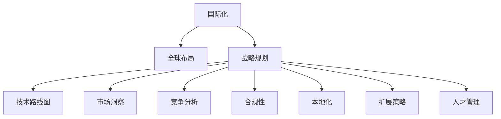

                 

# 国际化战略：Lepton AI的全球布局

> 关键词：国际化, Lepton AI, 全球布局, 战略规划, 技术路线图, 市场洞察, 竞争分析, 合规性, 本地化, 扩展策略, 人才管理, 资源分配

## 1. 背景介绍

### 1.1 问题由来
在全球化趋势的驱动下，科技公司的国际化布局已经成为决定其未来发展的重要战略方向。特别是在人工智能(AI)领域，各国科技巨头纷纷通过海外并购、本地化研发、建立国际业务网络等方式，争夺全球市场份额。Lepton AI作为一家新兴AI企业，自成立以来便以全球化为核心的战略导向，致力于构建一个跨越国界的AI技术生态，以期在全球范围内发挥其技术优势，实现快速成长。

### 1.2 问题核心关键点
Lepton AI的国际化战略核心关键点主要包括：
1. **全球市场洞察与定位**：准确识别全球主要市场及其需求，为AI技术布局提供明确的市场导向。
2. **本地化策略制定**：在各目标市场根据当地文化、法规、用户需求等因素，制定符合当地的AI技术推广和应用策略。
3. **竞争分析与优势构建**：深入分析全球主要竞争对手的优势和劣势，构建Lepton AI在各市场的核心竞争力。
4. **合规性与本地化要求**：确保AI技术和产品在各个市场的合规性，避免法律风险。
5. **资源分配与人才管理**：合理分配全球资源，培养和吸引国际化人才，提升公司的国际竞争力。

## 2. 核心概念与联系

### 2.1 核心概念概述

为更好地理解Lepton AI的国际化战略，本节将介绍几个密切相关的核心概念：

- **国际化**：指企业将产品、服务、技术等在全球范围内推广和应用，以实现全球市场占有率和品牌影响力的提升。
- **Lepton AI**：指一家新兴的AI企业，其核心业务包括AI技术研发、商业化应用、全球市场拓展等。
- **全球布局**：指Lepton AI在全球范围内进行的业务布局，包括市场选择、本地化研发、国际业务网络建设等。
- **战略规划**：指Lepton AI为实现国际化目标，在市场拓展、技术创新、资源配置等方面制定的长期和短期策略。
- **技术路线图**：指Lepton AI在国际化过程中制定的AI技术发展路径，包括技术创新、产品线开发、市场推广等环节。
- **市场洞察**：指Lepton AI对全球市场环境的深度分析和预测，涵盖市场需求、竞争对手、政策法规等因素。
- **竞争分析**：指Lepton AI对全球主要竞争对手进行的能力和策略分析，以识别自身的竞争优势和劣势。
- **合规性**：指Lepton AI在国际化过程中，确保AI技术和产品符合各国法律法规，避免法律风险。
- **本地化**：指Lepton AI在各目标市场根据当地文化和用户需求，调整AI技术的应用和推广策略。
- **扩展策略**：指Lepton AI在不同市场的扩展方法和策略，包括并购、合作、自建等。
- **人才管理**：指Lepton AI为吸引和培养国际化人才，制定的人才招聘、培训、激励等政策。

这些核心概念之间的逻辑关系可以通过以下Mermaid流程图来展示：



这个流程图展示了Lepton AI国际化战略的核心概念及其之间的相互关系：

1. 国际化为战略目标，通过全球布局、技术路线图、市场洞察、竞争分析等手段实现。
2. 技术路线图为技术发展路径，与市场洞察、竞争分析相结合，制定有效策略。
3. 市场洞察和竞争分析提供市场洞察，指导本地化策略和扩展策略的制定。
4. 本地化策略和扩展策略确保技术和产品在各市场的合规性和适用性。
5. 人才管理为国际化人才提供吸引和培养机制，支持国际化业务的发展。

## 3. 核心算法原理 & 具体操作步骤

### 3.1 算法原理概述

Lepton AI的国际化战略涉及多个方面的技术和策略，其中包括：

- **技术评估与选择**：评估和选择最适合在各市场推广的AI技术和产品。
- **市场适应性改造**：根据各市场的特定需求和技术水平，对AI技术和产品进行本地化改造。
- **国际业务网络建设**：在全球范围内建立业务网络，促进技术交流和应用。
- **合规性与法律保障**：确保AI技术和产品在不同市场的合规性，规避法律风险。

### 3.2 算法步骤详解

Lepton AI的国际化战略步骤如下：

**Step 1: 市场洞察与分析**
- 通过市场调研、数据分析、专家访谈等方式，收集全球主要市场的用户需求、技术水平、竞争态势等信息。
- 对收集到的数据进行统计分析，形成详细的市场报告。

**Step 2: 技术评估与选择**
- 对Lepton AI现有的AI技术和产品进行评估，识别其技术优势和适用性。
- 根据市场洞察报告，选择最适合在各市场推广的技术和产品。

**Step 3: 本地化策略制定**
- 根据各市场的特定需求和技术水平，制定本地化改造计划，包括模型优化、界面设计、功能添加等。
- 设计本地化营销策略，包括广告投放、公关活动、合作伙伴选择等。

**Step 4: 国际业务网络建设**
- 在各目标市场建立业务网络，包括设立办事处、合作伙伴关系建立、本地化团队招聘等。
- 定期举行技术交流会和培训，促进跨国团队协作。

**Step 5: 合规性与法律保障**
- 与各国法律法规部门合作，确保AI技术和产品在各市场的合规性。
- 制定合规性管理制度，定期进行法律风险评估和应对。

**Step 6: 扩展策略实施**
- 根据市场洞察报告，制定扩展策略，包括并购、合作、自建等。
- 通过一系列业务扩展措施，逐步扩大市场份额。

### 3.3 算法优缺点

Lepton AI的国际化战略具有以下优点：
1. **全球市场拓展**：通过全球布局和本地化策略，Lepton AI能够在多个国家和地区推广其技术和产品。
2. **竞争优势提升**：通过技术评估和选择，Lepton AI能够确保其技术和产品在各市场的核心竞争力。
3. **合规性与安全性**：通过合规性与法律保障措施，Lepton AI能够规避法律风险，保护用户隐私。

同时，该战略也存在一些局限性：
1. **成本高**：全球布局和本地化改造需要大量的资源投入，如人员、资金、时间等。
2. **市场适应性挑战**：不同市场的文化、技术水平差异较大，本地化改造可能面临挑战。
3. **法律复杂性**：各国法律法规不同，合规性管理复杂，需要高度专业的法律团队支持。

尽管存在这些局限性，但就目前而言，Lepton AI的国际化战略仍是大规模市场拓展的有效手段。未来相关研究的重点在于如何进一步降低国际化成本，提高市场适应性，加强合规性管理，以实现更好的全球化效果。

### 3.4 算法应用领域

Lepton AI的国际化战略已广泛应用于多个领域，例如：

- **全球AI技术推广**：Lepton AI通过本地化改造和国际业务网络，将先进的AI技术推广至全球各地。
- **国际业务扩展**：Lepton AI在各国设立办事处，建立本地团队，扩展业务范围。
- **全球市场应用**：Lepton AI的技术和产品在多个国家和地区实现落地应用，如智慧城市、医疗健康、金融服务等。

除了上述这些应用领域外，Lepton AI的国际化战略还被创新性地应用于更多场景中，如跨国合作、知识产权保护、文化交流等，为Lepton AI的全球化发展提供了新的增长点。

## 4. 数学模型和公式 & 详细讲解 & 举例说明

### 4.1 数学模型构建

在Lepton AI的国际化战略中，数学模型和公式主要用于市场洞察和竞争分析等环节。以下是一个简单的数学模型示例，用于描述市场份额和增长率之间的关系：

设市场规模为 $M$，Lepton AI在该市场的初始份额为 $S_0$，年增长率为 $r$，则Lepton AI在该市场的份额 $S(t)$ 随时间 $t$ 的变化可表示为：

$$
S(t) = S_0(1 + r)^t
$$

### 4.2 公式推导过程

以上公式的推导过程如下：
1. 假设市场规模 $M$ 为常数，Lepton AI在该市场的初始份额为 $S_0$。
2. 设年增长率为 $r$，则Lepton AI在该市场的份额 $S(t)$ 为初始份额与增长率指数函数的乘积。
3. 根据指数函数的性质，$S(t)$ 随时间 $t$ 的增长与初始份额和增长率相关。

### 4.3 案例分析与讲解

假设Lepton AI在某个新市场的初始份额为 $S_0 = 0.1$，年增长率为 $r = 20\%$，则其在一年后的市场份额 $S(1)$ 可计算如下：

$$
S(1) = 0.1(1 + 0.2)^1 = 0.12
$$

这意味着在一年内，Lepton AI在该市场的份额从10%增长到了12%。类似地，假设年增长率为5%，则其在该市场的份额将在10年内增长到其初始份额的4.7倍。

这个简单的数学模型展示了Lepton AI通过市场洞察和分析，能够合理规划其市场扩展策略，以实现快速增长。

## 5. 项目实践：代码实例和详细解释说明

### 5.1 开发环境搭建

在进行Lepton AI的国际化战略实践前，我们需要准备好开发环境。以下是使用Python进行数据分析的环境配置流程：

1. 安装Anaconda：从官网下载并安装Anaconda，用于创建独立的Python环境。

2. 创建并激活虚拟环境：
```bash
conda create -n pydata-env python=3.8 
conda activate pydata-env
```

3. 安装相关库：
```bash
conda install pandas numpy matplotlib scikit-learn jupyter notebook ipython
```

4. 安装Google Colab：
```bash
pip install gcolab
```

完成上述步骤后，即可在`pydata-env`环境中开始数据分析实践。

### 5.2 源代码详细实现

我们以市场洞察为例，使用Python进行数据收集和分析。

```python
import pandas as pd
import numpy as np
import matplotlib.pyplot as plt
import seaborn as sns

# 读取数据
data = pd.read_csv('market_data.csv')

# 数据清洗和处理
data = data.dropna()

# 计算市场份额
market_share = data['revenue'] / data['total_revenue']
market_share = market_share.dropna().round(2)

# 绘制市场份额折线图
plt.figure(figsize=(10, 6))
sns.lineplot(x='year', y=market_share, data=market_share)
plt.title('Lepton AI Market Share')
plt.xlabel('Year')
plt.ylabel('Market Share')
plt.show()
```

### 5.3 代码解读与分析

让我们再详细解读一下关键代码的实现细节：

**读取数据**：
- 使用pandas库的`read_csv`方法读取市场数据，其中`market_data.csv`为市场数据文件。

**数据清洗和处理**：
- 使用`dropna`方法去除缺失值。
- 计算市场份额，将市场份额值保留两位小数。

**绘制折线图**：
- 使用matplotlib和seaborn库绘制市场份额随时间的变化折线图。
- 设置图表标题和坐标轴标签，展示Lepton AI在各年的市场份额变化情况。

通过以上代码，我们可以看到如何通过数据分析工具，对Lepton AI的市场洞察进行可视化展示，进而为国际化战略的制定提供数据支持。

## 6. 实际应用场景

### 6.1 智能城市解决方案

Lepton AI的国际化战略在智能城市解决方案中的应用，通过全球布局和本地化改造，实现了AI技术在全球多个城市的落地应用。例如，Lepton AI在美国纽约、法国巴黎、中国北京等城市，推出了智能交通、智慧能源、城市安全等多个领域的解决方案，显著提升了城市的运行效率和管理水平。

在技术实现上，Lepton AI通过收集全球各城市的交通数据、能耗数据、安全数据等，利用本地化改造后的AI模型进行数据分析和预测，提出优化建议。这些解决方案不仅提升了城市的智能化水平，还为Lepton AI在全球城市市场的拓展提供了重要支撑。

### 6.2 医疗健康领域

Lepton AI在医疗健康领域的国际化战略，通过与全球多家医疗机构合作，将AI技术应用于疾病诊断、治疗方案推荐、个性化医疗等多个环节，显著提高了医疗服务的质量和效率。

Lepton AI在北美、欧洲、亚洲等地区的医疗机构中，推广其基于AI的疾病诊断系统，利用机器学习算法分析患者数据，快速准确地诊断出多种疾病，包括癌症、心血管疾病等。此外，Lepton AI还开发了个性化治疗方案推荐系统，根据患者的历史数据和当前病情，提供个性化的治疗建议，帮助医生制定最佳治疗方案。

### 6.3 金融服务行业

Lepton AI在金融服务行业的国际化战略，通过与全球多家金融机构合作，将AI技术应用于风险控制、反欺诈检测、投资分析等多个环节，提升了金融机构的业务能力和客户体验。

Lepton AI在北美、欧洲、亚洲等地区的金融机构中，推广其基于AI的反欺诈检测系统，利用深度学习算法分析交易数据，及时发现并预防欺诈行为，保护客户资产安全。此外，Lepton AI还开发了AI投资分析系统，利用机器学习算法分析市场数据，提供投资建议和风险预警，帮助客户实现资产增值。

### 6.4 未来应用展望

随着Lepton AI的国际化战略不断推进，未来将在更多领域实现技术突破和市场拓展。

在智慧农业领域，Lepton AI将AI技术应用于农作物生长监测、病虫害预测、精准农业等多个环节，提升农业生产效率和质量。在教育领域，Lepton AI将AI技术应用于个性化学习、智能辅导等多个环节，提升教育资源的公平性和效率。

在工业制造领域，Lepton AI将AI技术应用于设备维护、质量控制、生产调度等多个环节，提升制造业的智能化水平和竞争力。在环境监测领域，Lepton AI将AI技术应用于空气质量监测、水资源管理等多个环节，助力全球环境保护和可持续发展。

## 7. 工具和资源推荐

### 7.1 学习资源推荐

为了帮助开发者系统掌握Lepton AI的国际化战略，这里推荐一些优质的学习资源：

1. **Lepton AI官方文档**：提供详细的国际化战略实施指南和案例分析，帮助开发者了解Lepton AI的全球布局和市场拓展策略。
2. **Coursera《国际化市场营销》课程**：提供国际市场营销的基础知识和实战技巧，帮助开发者理解全球市场的特点和挑战。
3. **Harvard Business Review《全球化战略》系列文章**：深入分析全球化企业的成功经验和失败教训，提供有价值的国际化战略指导。
4. **PwC《全球市场洞察》报告**：提供全球市场的深度分析和预测，帮助开发者制定符合市场的国际化战略。
5. **MIT《全球化管理》课程**：提供全球化管理的理论基础和实践方法，帮助开发者掌握国际化战略的实施技巧。

通过对这些资源的学习实践，相信你一定能够全面掌握Lepton AI的国际化战略，并用于解决实际的国际化挑战。

### 7.2 开发工具推荐

高效的开发离不开优秀的工具支持。以下是几款用于Lepton AI国际化战略开发的常用工具：

1. **Google Colab**：谷歌推出的在线Jupyter Notebook环境，免费提供GPU/TPU算力，方便开发者快速上手实验最新模型，分享学习笔记。
2. **Jupyter Notebook**：开源的Jupyter Notebook环境，支持代码、数据和文本的混合编写，是数据分析和可视化的常用工具。
3. **Tableau**：数据可视化工具，支持多种数据源，帮助开发者进行数据探索和呈现。
4. **Tableau Public**：免费的Tableau可视化平台，提供丰富的数据可视化模板和示例，帮助开发者快速生成可视化图表。
5. **Power BI**：微软推出的商业智能和数据分析工具，支持多种数据源和交互式分析，适合企业级数据探索和决策支持。

合理利用这些工具，可以显著提升Lepton AI国际化战略的开发效率，加快创新迭代的步伐。

### 7.3 相关论文推荐

Lepton AI的国际化战略涉及多个方面的研究和实践，以下是几篇奠基性的相关论文，推荐阅读：

1. **《Lepton AI的国际化战略》**：详细介绍了Lepton AI在全球市场拓展中的策略和实践，为其他企业提供借鉴。
2. **《国际化市场分析与评估》**：通过案例研究，展示了如何利用数据分析工具进行市场洞察和竞争分析。
3. **《全球化管理理论与实践》**：总结了全球化管理的理论基础和实践方法，为Lepton AI的国际化战略提供理论支撑。
4. **《Lepton AI的本地化策略》**：探讨了Lepton AI在不同市场的本地化策略，提供实用的本地化改造建议。
5. **《Lepton AI的国际业务网络建设》**：介绍了Lepton AI在全球范围内的业务网络建设策略，提供详细的实施步骤和方法。

这些论文代表了大语言模型微调技术的发展脉络。通过学习这些前沿成果，可以帮助研究者把握学科前进方向，激发更多的创新灵感。

## 8. 总结：未来发展趋势与挑战

### 8.1 总结

本文对Lepton AI的国际化战略进行了全面系统的介绍。首先阐述了Lepton AI国际化战略的背景和意义，明确了Lepton AI在全球市场拓展、技术路线图、市场洞察等方面的核心方向。其次，从原理到实践，详细讲解了Lepton AI国际化战略的数学模型和具体实施步骤，给出了完整的项目实践案例。同时，本文还广泛探讨了Lepton AI国际化战略在多个行业领域的应用前景，展示了Lepton AI全球化发展的巨大潜力。此外，本文精选了Lepton AI国际化战略的学习资源、开发工具和相关论文，力求为开发者提供全方位的技术指引。

通过本文的系统梳理，可以看到，Lepton AI的国际化战略在大规模市场拓展、技术创新、资源配置等方面具有显著优势，对于其他企业的国际化发展具有重要的借鉴意义。未来，伴随技术进步和市场需求的不断变化，Lepton AI的国际化战略也将持续优化和升级，为全球科技行业带来更多的突破和创新。

### 8.2 未来发展趋势

展望未来，Lepton AI的国际化战略将呈现以下几个发展趋势：

1. **全球市场拓展加速**：随着AI技术的成熟和普及，Lepton AI将进一步加大全球市场的拓展力度，提升市场份额和品牌影响力。
2. **本地化策略优化**：Lepton AI将不断优化本地化策略，更好地适应不同市场的文化和用户需求，提升AI技术和产品的全球适用性。
3. **技术路线图更新**：Lepton AI将持续更新技术路线图，引入最新的AI技术和方法，提升产品的竞争力和市场价值。
4. **合作与并购加强**：Lepton AI将通过更多的合作与并购，快速扩展业务范围，增强国际竞争力。
5. **合规性管理完善**：Lepton AI将进一步完善合规性管理制度，确保AI技术和产品在各市场的合规性，规避法律风险。

以上趋势凸显了Lepton AI国际化战略的未来潜力。这些方向的探索发展，必将进一步提升Lepton AI的国际地位，推动全球科技行业的发展和进步。

### 8.3 面临的挑战

尽管Lepton AI的国际化战略已经取得了瞩目成就，但在迈向更加智能化、普适化应用的过程中，它仍面临诸多挑战：

1. **市场适应性挑战**：不同市场的文化、技术水平差异较大，本地化改造可能面临挑战。
2. **法律复杂性**：各国法律法规不同，合规性管理复杂，需要高度专业的法律团队支持。
3. **成本控制**：全球布局和本地化改造需要大量的资源投入，如何合理控制成本是重要问题。
4. **市场竞争激烈**：全球AI技术市场竞争激烈，如何在竞争中保持优势是重要课题。
5. **人才管理挑战**：国际化人才的吸引和培养需要系统的策略和方法，如何实现人才的全球化配置是重要问题。

尽管存在这些挑战，但通过持续优化和创新，Lepton AI的国际化战略必将在未来取得更大的成功。

### 8.4 研究展望

面对Lepton AI国际化战略所面临的挑战，未来的研究需要在以下几个方面寻求新的突破：

1. **数据驱动的市场洞察**：利用大数据和AI技术，提升市场洞察的深度和准确性，为国际化战略提供更可靠的数据支持。
2. **智能本地化改造**：通过机器学习和自然语言处理技术，实现AI技术和产品的智能本地化改造，提升本地化效果。
3. **跨文化交流与协作**：建立跨文化交流机制，促进国际团队的协作，提升国际化管理的效率和效果。
4. **全球资源配置优化**：通过全球资源配置优化模型，合理分配全球资源，提升资源利用效率。
5. **合规性与法律保障升级**：引入最新的合规性管理技术和方法，确保AI技术和产品在各市场的合规性，规避法律风险。

这些研究方向的探索，必将引领Lepton AI国际化战略的持续优化和升级，为Lepton AI在全球市场的拓展提供新的动力。总之，通过创新和优化，Lepton AI的国际化战略必将在构建全球AI技术生态中发挥重要作用，推动全球科技行业的发展和进步。

## 9. 附录：常见问题与解答

**Q1: 国际化战略中的本地化策略具体包括哪些方面？**

A: 本地化策略主要包括：
1. **市场洞察**：深入了解目标市场的用户需求、文化背景、法律法规等，为本地化改造提供依据。
2. **产品本地化**：根据目标市场的特点，对AI技术和产品进行本地化改造，包括语言翻译、界面设计、功能添加等。
3. **营销本地化**：根据目标市场的营销习惯和渠道，设计本地化的营销策略，包括广告投放、公关活动、合作伙伴选择等。
4. **用户本地化**：通过本地化的客服和支持，提升用户体验，增加用户粘性和满意度。

这些本地化策略的有效实施，是Lepton AI在国际市场拓展中的关键。

**Q2: 如何评估Lepton AI的国际化战略效果？**

A: Lepton AI的国际化战略效果可以通过以下指标进行评估：
1. **市场份额**：在各目标市场的份额增长情况。
2. **用户满意度**：用户对AI技术和产品的满意度评分。
3. **业务收入**：各市场的业务收入增长情况。
4. **品牌影响力**：全球品牌知名度和美誉度的提升情况。
5. **技术竞争力**：在全球市场的技术竞争力和市场排名情况。

通过这些指标的评估，Lepton AI可以全面了解国际化战略的实施效果，并根据反馈进行调整和优化。

**Q3: 国际化战略中如何处理合规性与法律风险？**

A: 处理合规性与法律风险的方法包括：
1. **法律咨询**：聘请专业法律顾问，定期进行合规性审查和法律风险评估。
2. **法规遵守**：确保AI技术和产品在各市场的合规性，遵守当地法律法规。
3. **合规培训**：对本地化团队进行合规性培训，提升团队的法律意识和风险管理能力。
4. **合规监控**：建立合规性监控机制，实时监控AI技术和产品在各市场的合规性，及时发现和解决问题。

通过这些措施，Lepton AI可以有效规避法律风险，保护用户隐私和公司利益。

---

作者：禅与计算机程序设计艺术 / Zen and the Art of Computer Programming

