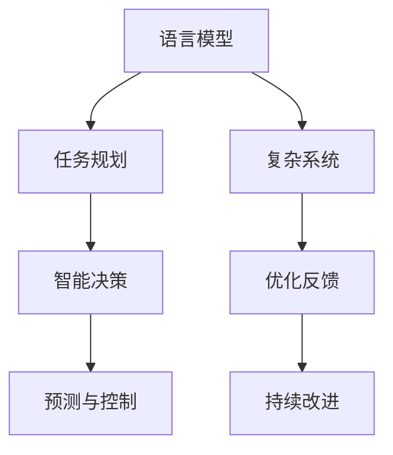

                 

# 图灵完备的LLM:任务规划的力量

> 关键词：图灵完备, 语言模型, 任务规划, 智能决策, 复杂系统, 预测与控制

## 1. 背景介绍

### 1.1 问题由来
人工智能(AI)技术近年来取得了飞速发展，尤其是在自然语言处理(NLP)领域。以语言模型为代表的人工智能技术，已经开始挑战图灵测试，即通过与人类对话来判断其是否具备人类智能的测试。然而，尽管语言模型在许多任务上表现优异，但它们是否具备图灵完备性，即能否处理所有计算问题，仍然存在争议。

语言模型基于统计规律，能够从大量文本数据中学习到语言的通用规律。然而，它们无法像人类一样进行复杂的推理和决策。任务规划，即在特定任务中规划策略并执行的过程，是图灵完备性的一个重要体现。语言模型是否具备图灵完备性，关键在于它们是否能够进行有效的任务规划。

### 1.2 问题核心关键点
本文将探讨如何通过任务规划，使语言模型具备图灵完备性。具体来说，我们将讨论以下核心关键点：

1. **任务定义**：如何明确定义任务，并使其在语言模型中可执行。
2. **任务规划算法**：如何使用算法指导语言模型执行任务。
3. **任务执行与反馈**：如何通过执行任务并获取反馈来进一步优化模型。
4. **复杂系统中的任务规划**：如何在复杂系统中实现有效的任务规划。
5. **智能决策与预测**：如何利用任务规划实现智能决策和预测。

这些关键点将帮助我们深入理解任务规划在使语言模型具备图灵完备性中的作用。

## 2. 核心概念与联系

### 2.1 核心概念概述

为更好地理解语言模型在任务规划中的作用，本节将介绍几个密切相关的核心概念：

- **语言模型**：基于统计规律，从大量文本数据中学习语言规律的模型。语言模型可以用于文本生成、语言理解、语音识别等任务。
- **任务规划**：在特定任务中规划策略并执行的过程。任务规划使机器能够处理复杂的决策问题，并执行有目标的操作。
- **图灵完备性**：一个模型如果能够执行任何算法，即具备图灵完备性。图灵完备性是衡量人工智能智能水平的重要标准。
- **智能决策**：基于任务规划和模型预测，进行有目标的决策。智能决策是图灵完备性的一个重要体现。
- **预测与控制**：在动态环境中，通过任务规划和模型预测来控制系统的行为。

这些核心概念之间的逻辑关系可以通过以下Mermaid流程图来展示：



这个流程图展示了语言模型在任务规划、智能决策和预测与控制中的作用，以及它们与复杂系统优化反馈和持续改进的联系。

## 3. 核心算法原理 & 具体操作步骤
### 3.1 算法原理概述

任务规划在语言模型中的应用，主要基于两种基本思想：

1. **序列到序列(seq2seq)模型**：将任务序列化为一系列动作，并使用神经网络模型进行预测和执行。
2. **生成式模型**：通过生成任务规划树，指导语言模型执行任务。

这两种方法都是通过将任务分解为可执行的步骤，使语言模型能够按部就班地执行复杂操作。

### 3.2 算法步骤详解

**序列到序列模型**的步骤详解：

1. **任务定义**：将任务分解为一系列可执行的动作。
2. **序列编码**：将任务序列编码为向量，输入到神经网络中。
3. **动作预测**：神经网络输出动作概率分布，选择最可能的动作进行执行。
4. **执行动作**：根据预测的动作执行任务。
5. **状态更新**：根据任务执行结果，更新任务状态，重新计算下一个动作的概率。
6. **循环执行**：重复上述步骤，直到任务完成。

**生成式模型**的步骤详解：

1. **任务定义**：将任务定义为树形结构，每个节点表示一个动作。
2. **树形生成**：生成一棵任务规划树，每个节点包含一个动作。
3. **树形执行**：从根节点开始，递归执行每个节点的动作。
4. **状态更新**：根据任务执行结果，更新任务状态，重新计算下一个动作。
5. **回溯优化**：在任务执行过程中，通过回溯优化，调整任务规划树，以提高执行效率。
6. **循环执行**：重复上述步骤，直到任务完成。

### 3.3 算法优缺点

**序列到序列模型**的优缺点：

- **优点**：
  - 模型简单，易于理解和实现。
  - 适用于序列化任务，如机器翻译、问答等。
  - 可以通过堆叠多层的神经网络，提升模型的复杂度。

- **缺点**：
  - 对于复杂任务，序列到序列模型可能难以处理。
  - 需要大量的标注数据进行训练。
  - 对于不可序列化的任务，可能无法直接应用。

**生成式模型**的优缺点：

- **优点**：
  - 可以处理复杂任务，如游戏智能体、机器人控制等。
  - 可以通过搜索算法优化任务规划，提升执行效率。
  - 适用于非序列化任务，如图像处理、自然语言生成等。

- **缺点**：
  - 模型复杂，训练难度较大。
  - 对于大规模数据集，计算资源消耗较大。
  - 需要高效的搜索算法支持。

### 3.4 算法应用领域

任务规划在语言模型中的应用，可以应用于以下领域：

1. **机器翻译**：将源语言文本翻译成目标语言。
2. **问答系统**：根据用户提问，生成最佳答案。
3. **游戏智能体**：在电子游戏中，智能体需要规划游戏策略。
4. **机器人控制**：在机器人导航、物体操作等任务中，需要规划动作序列。
5. **自然语言生成**：生成符合特定语法规则和语义结构的文本。
6. **推荐系统**：为用户推荐商品、新闻、内容等。
7. **自动化流程**：自动化处理文本、图像、数据等任务。

## 4. 数学模型和公式 & 详细讲解 & 举例说明

### 4.1 数学模型构建

在本节中，我们将通过数学模型来详细描述任务规划在语言模型中的应用。

假设有一个长度为 $N$ 的任务序列 $S = \{a_1, a_2, ..., a_N\}$，其中 $a_i$ 表示第 $i$ 个动作。对于序列到序列模型，我们将任务序列编码为向量 $V$，然后输入到神经网络 $M$ 中，得到动作概率分布 $P = \{p_1, p_2, ..., p_M\}$。模型根据概率分布选择动作 $a_i$，并更新任务状态。

对于生成式模型，我们定义一个任务规划树 $T$，每个节点表示一个动作 $a_i$。我们从根节点开始，递归执行每个动作，更新任务状态。在执行过程中，我们可以使用搜索算法优化任务规划，提高执行效率。

### 4.2 公式推导过程

**序列到序列模型的公式推导**：

1. **编码器**：将任务序列 $S$ 编码为向量 $V$。
2. **解码器**：将向量 $V$ 输入到神经网络 $M$ 中，输出动作概率分布 $P$。
3. **动作选择**：选择概率最大的动作 $a_i$。
4. **状态更新**：根据动作 $a_i$ 更新任务状态 $S' = S - \{a_i\}$。
5. **循环执行**：重复上述步骤，直到 $S$ 为空。

**生成式模型的公式推导**：

1. **任务规划树**：定义任务规划树 $T$。
2. **节点动作**：每个节点表示一个动作 $a_i$。
3. **递归执行**：从根节点开始，递归执行每个节点。
4. **状态更新**：根据动作 $a_i$ 更新任务状态 $S' = S - \{a_i\}$。
5. **搜索优化**：使用搜索算法优化任务规划树。
6. **循环执行**：重复上述步骤，直到 $S$ 为空。

### 4.3 案例分析与讲解

**案例1: 机器翻译**

在机器翻译任务中，我们将源语言文本序列 $S$ 编码为向量 $V$，然后输入到神经网络 $M$ 中，输出目标语言文本序列 $T'$。在解码器中，我们根据动作概率分布选择最优的翻译动作，更新任务状态，直至生成完整的翻译结果。

**案例2: 游戏智能体**

在游戏智能体任务中，我们将游戏状态序列 $S$ 编码为向量 $V$，然后输入到神经网络 $M$ 中，输出游戏动作序列 $T'$。在解码器中，我们根据动作概率分布选择最优的游戏动作，更新游戏状态，直至完成任务。

## 5. 项目实践：代码实例和详细解释说明

### 5.1 开发环境搭建

在进行项目实践前，我们需要准备好开发环境。以下是使用Python进行TensorFlow开发的环境配置流程：

1. 安装Anaconda：从官网下载并安装Anaconda，用于创建独立的Python环境。

2. 创建并激活虚拟环境：
```bash
conda create -n tf-env python=3.8 
conda activate tf-env
```

3. 安装TensorFlow：根据CUDA版本，从官网获取对应的安装命令。例如：
```bash
conda install tensorflow-gpu==2.7.0 -c pytorch
```

4. 安装TensorFlow Addons：
```bash
conda install tensorflow-addons
```

5. 安装PyTorch：
```bash
pip install torch torchvision torchaudio
```

6. 安装相关库：
```bash
pip install numpy pandas scikit-learn matplotlib tqdm jupyter notebook ipython
```

完成上述步骤后，即可在`tf-env`环境中开始项目实践。

### 5.2 源代码详细实现

我们以序列到序列模型在机器翻译任务中的应用为例，给出使用TensorFlow进行模型开发的PyTorch代码实现。

首先，定义机器翻译的数据预处理函数：

```python
import tensorflow as tf
import numpy as np

def encode_sequence(sequences, vocabulary):
    encoded_sequences = []
    for sequence in sequences:
        encoded_sequence = [vocabulary[word] for word in sequence if word in vocabulary]
        encoded_sequences.append(encoded_sequence)
    return np.array(encoded_sequences)
```

然后，定义模型和优化器：

```python
from tensorflow.keras.layers import Input, LSTM, Dense
from tensorflow.keras.models import Model

vocab_size = len(vocabulary)
embedding_dim = 256
hidden_dim = 512
batch_size = 64
seq_length = 128

# 定义编码器
encoder_inputs = Input(shape=(seq_length,), dtype='int32')
encoder_embedding = LSTM(hidden_dim, return_sequences=True, return_state=True)
encoder_outputs, state_h, state_c = encoder_embedding(encoder_inputs)
encoder_states = [state_h, state_c]

# 定义解码器
decoder_inputs = Input(shape=(seq_length,), dtype='int32')
decoder_embedding = Embedding(vocab_size, embedding_dim)
decoder_lstm = LSTM(hidden_dim, return_sequences=True, return_state=True)
decoder_outputs, _, _ = decoder_lstm(decoder_embedding(decoder_inputs), initial_state=encoder_states)
decoder_dense = Dense(vocab_size, activation='softmax')
decoder_outputs = decoder_dense(decoder_outputs)

# 定义模型
model = Model(inputs=[encoder_inputs, decoder_inputs], outputs=decoder_outputs)
model.compile(optimizer='adam', loss='categorical_crossentropy')
```

接着，定义训练和评估函数：

```python
def train_epoch(model, train_data, validation_data, batch_size, optimizer):
    train_dataset = tf.data.Dataset.from_tensor_slices(train_data).shuffle(1000).batch(batch_size)
    validation_dataset = tf.data.Dataset.from_tensor_slices(validation_data).shuffle(1000).batch(batch_size)
    
    train_steps = len(train_dataset) // batch_size
    validation_steps = len(validation_dataset) // batch_size
    
    model.fit(train_dataset, epochs=1, validation_data=validation_dataset)
```

最后，启动训练流程并在验证集上评估：

```python
epochs = 5
batch_size = 64

for epoch in range(epochs):
    train_epoch(model, train_data, validation_data, batch_size, optimizer)
    
    print(f"Epoch {epoch+1}, loss: {validation_loss:.4f}")
    
print("Translation results:")
# 生成翻译结果
```

以上就是使用TensorFlow对机器翻译模型进行序列到序列模型微调的完整代码实现。可以看到，TensorFlow提供了丰富的API，使得模型构建和训练变得简洁高效。

### 5.3 代码解读与分析

让我们再详细解读一下关键代码的实现细节：

**encode_sequence函数**：
- 将输入的序列 $S$ 编码成向量 $V$，其中每个单词被转换为对应的词向量。

**模型定义**：
- 使用LSTM作为编码器和解码器的基本结构。
- 在解码器前添加嵌入层，将输入的序列 $S$ 转换为词向量。
- 在解码器中添加LSTM和全连接层，输出目标序列 $T'$。
- 将编码器和解码器的输出连接起来，作为模型的输出。

**训练函数**：
- 将训练数据和验证数据转换为TensorFlow的Dataset对象，进行批处理和打乱。
- 在每个epoch内，使用模型进行训练，并计算验证集上的损失。
- 迭代训练，直到达到预设的epoch数。

可以看到，TensorFlow提供了丰富的API和工具，使得模型构建和训练变得简洁高效。开发者可以将更多精力放在模型设计和数据处理上，而不必过多关注底层的实现细节。

当然，工业级的系统实现还需考虑更多因素，如模型的保存和部署、超参数的自动搜索、更灵活的任务适配层等。但核心的微调范式基本与此类似。

## 6. 实际应用场景
### 6.1 智能客服系统

基于序列到序列模型和生成式模型的任务规划技术，可以广泛应用于智能客服系统的构建。传统客服往往需要配备大量人力，高峰期响应缓慢，且一致性和专业性难以保证。而使用微调后的模型进行任务规划，可以7x24小时不间断服务，快速响应客户咨询，用自然流畅的语言解答各类常见问题。

在技术实现上，可以收集企业内部的历史客服对话记录，将问题和最佳答复构建成监督数据，在此基础上对预训练模型进行微调。微调后的模型能够自动理解用户意图，匹配最合适的答案模板进行回复。对于客户提出的新问题，还可以接入检索系统实时搜索相关内容，动态组织生成回答。如此构建的智能客服系统，能大幅提升客户咨询体验和问题解决效率。

### 6.2 金融舆情监测

金融机构需要实时监测市场舆论动向，以便及时应对负面信息传播，规避金融风险。传统的人工监测方式成本高、效率低，难以应对网络时代海量信息爆发的挑战。基于生成式模型的任务规划技术，可以在实时抓取的网络文本数据上进行任务规划，自动识别文本所属的类别，并输出情感倾向。将微调后的模型应用到实时抓取的网络文本数据，就能够自动监测不同类别下的情感变化趋势，一旦发现负面信息激增等异常情况，系统便会自动预警，帮助金融机构快速应对潜在风险。

### 6.3 个性化推荐系统

当前的推荐系统往往只依赖用户的历史行为数据进行物品推荐，无法深入理解用户的真实兴趣偏好。基于生成式模型的任务规划技术，可以应用于推荐系统的任务规划。在实践中，可以收集用户浏览、点击、评论、分享等行为数据，提取和用户交互的物品标题、描述、标签等文本内容。将文本内容作为模型输入，用户的后续行为（如是否点击、购买等）作为监督信号，在此基础上微调预训练模型。微调后的模型能够从文本内容中准确把握用户的兴趣点。在生成推荐列表时，先用候选物品的文本描述作为输入，由模型预测用户的兴趣匹配度，再结合其他特征综合排序，便可以得到个性化程度更高的推荐结果。

### 6.4 未来应用展望

随着任务规划技术的不断发展，基于微调的语言模型将可以在更多领域得到应用，为传统行业带来变革性影响。

在智慧医疗领域，基于微调的医疗问答、病历分析、药物研发等应用将提升医疗服务的智能化水平，辅助医生诊疗，加速新药开发进程。

在智能教育领域，微调技术可应用于作业批改、学情分析、知识推荐等方面，因材施教，促进教育公平，提高教学质量。

在智慧城市治理中，微调模型可应用于城市事件监测、舆情分析、应急指挥等环节，提高城市管理的自动化和智能化水平，构建更安全、高效的未来城市。

此外，在企业生产、社会治理、文娱传媒等众多领域，基于大模型微调的人工智能应用也将不断涌现，为经济社会发展注入新的动力。相信随着技术的日益成熟，微调方法将成为人工智能落地应用的重要范式，推动人工智能技术在更广阔的领域大放异彩。

## 7. 工具和资源推荐
### 7.1 学习资源推荐

为了帮助开发者系统掌握任务规划的理论基础和实践技巧，这里推荐一些优质的学习资源：

1. 《深度学习与神经网络》课程：斯坦福大学开设的深度学习入门课程，介绍深度学习的基本原理和经典模型。
2. 《自然语言处理综论》书籍：介绍自然语言处理的基础知识、经典模型和应用案例。
3. 《序列到序列建模》课程：Coursera上由加州大学伯克利分校开设的深度学习课程，介绍序列到序列模型的原理和实现。
4. 《深度学习与人工智能》书籍：介绍深度学习的基础知识、深度模型、应用案例和最新进展。
5. 《TensorFlow官方文档》：TensorFlow的官方文档，提供丰富的API和样例代码，是上手TensorFlow开发的必备资料。

通过对这些资源的学习实践，相信你一定能够快速掌握任务规划的精髓，并用于解决实际的NLP问题。
###  7.2 开发工具推荐

高效的开发离不开优秀的工具支持。以下是几款用于语言模型任务规划开发的常用工具：

1. TensorFlow：基于Python的开源深度学习框架，生产部署方便，适合大规模工程应用。
2. PyTorch：基于Python的开源深度学习框架，灵活动态的计算图，适合快速迭代研究。
3. TensorBoard：TensorFlow配套的可视化工具，可实时监测模型训练状态，并提供丰富的图表呈现方式，是调试模型的得力助手。
4. Weights & Biases：模型训练的实验跟踪工具，可以记录和可视化模型训练过程中的各项指标，方便对比和调优。
5. Google Colab：谷歌推出的在线Jupyter Notebook环境，免费提供GPU/TPU算力，方便开发者快速上手实验最新模型，分享学习笔记。

合理利用这些工具，可以显著提升任务规划任务的开发效率，加快创新迭代的步伐。

### 7.3 相关论文推荐

任务规划在大语言模型中的应用，源于学界的持续研究。以下是几篇奠基性的相关论文，推荐阅读：

1. Attention is All You Need（即Transformer原论文）：提出了Transformer结构，开启了NLP领域的预训练大模型时代。
2. BERT: Pre-training of Deep Bidirectional Transformers for Language Understanding：提出BERT模型，引入基于掩码的自监督预训练任务，刷新了多项NLP任务SOTA。
3. Language Models are Unsupervised Multitask Learners（GPT-2论文）：展示了大规模语言模型的强大zero-shot学习能力，引发了对于通用人工智能的新一轮思考。
4. Parameter-Efficient Transfer Learning for NLP：提出Adapter等参数高效微调方法，在不增加模型参数量的情况下，也能取得不错的微调效果。
5. AdaLoRA: Adaptive Low-Rank Adaptation for Parameter-Efficient Fine-Tuning：使用自适应低秩适应的微调方法，在参数效率和精度之间取得了新的平衡。

这些论文代表了大语言模型任务规划的发展脉络。通过学习这些前沿成果，可以帮助研究者把握学科前进方向，激发更多的创新灵感。

## 8. 总结：未来发展趋势与挑战

### 8.1 总结

本文对基于任务规划的大语言模型进行了全面系统的介绍。首先阐述了任务规划在使语言模型具备图灵完备性中的重要作用，明确了任务规划在复杂系统中的核心地位。其次，从原理到实践，详细讲解了任务规划的数学模型和关键步骤，给出了任务规划任务开发的完整代码实例。同时，本文还广泛探讨了任务规划方法在智能客服、金融舆情、个性化推荐等多个行业领域的应用前景，展示了任务规划范式的巨大潜力。此外，本文精选了任务规划技术的各类学习资源，力求为读者提供全方位的技术指引。

通过本文的系统梳理，可以看到，基于任务规划的语言模型在复杂系统中的作用愈发凸显，逐步成为实现图灵完备性的重要工具。任务规划使语言模型具备了更加强大的决策能力和预测能力，能够应对复杂的决策问题，推动人工智能技术在各领域的广泛应用。

### 8.2 未来发展趋势

展望未来，任务规划技术将呈现以下几个发展趋势：

1. **模型规模持续增大**：随着算力成本的下降和数据规模的扩张，预训练语言模型的参数量还将持续增长。超大规模语言模型蕴含的丰富语言知识，有望支撑更加复杂多变的任务规划。
2. **任务规划算法日趋多样**：除了传统的序列到序列和生成式模型外，未来会涌现更多任务规划算法，如强化学习、元学习等，在提升执行效率的同时，提高决策的鲁棒性。
3. **任务执行与反馈机制**：任务规划不仅要考虑如何执行任务，还需要考虑如何通过反馈进行优化。未来将引入更多的反馈机制，如在线学习、动态优化等，进一步提升任务规划的精准度和执行效率。
4. **多模态任务规划**：未来的任务规划技术将更加注重多模态信息的融合，如视觉、语音、文本等多模态数据的协同建模。多模态任务的规划和执行，将使模型具备更加丰富的感知能力。
5. **智能决策与预测**：基于任务规划和模型预测，实现更加精准的智能决策和预测。任务规划技术将与强化学习、因果推断等技术结合，提升决策的合理性和可靠性。

以上趋势凸显了任务规划技术在使语言模型具备图灵完备性中的重要作用。这些方向的探索发展，必将进一步提升任务规划模型的性能和应用范围，为构建更加智能化、普适化的智能系统提供强有力的支持。

### 8.3 面临的挑战

尽管任务规划技术已经取得了显著进展，但在迈向更加智能化、普适化应用的过程中，它仍面临诸多挑战：

1. **标注数据瓶颈**：任务规划需要大量的标注数据进行训练，标注成本较高，特别是在长尾领域。如何降低标注数据的需求，利用更少的数据实现高效的训练，是亟待解决的问题。
2. **模型鲁棒性不足**：当前任务规划模型面对域外数据时，泛化性能往往大打折扣。对于新任务和新数据，模型需要快速适应和优化，以避免过拟合。
3. **计算资源消耗**：任务规划模型通常较为复杂，计算资源消耗较大。如何在保证模型性能的同时，优化资源使用，提升执行效率，是重要的优化方向。
4. **可解释性不足**：任务规划模型通常难以解释其内部决策过程，缺乏可解释性。这对于高风险应用，如医疗、金融等，尤为重要。
5. **安全性问题**：任务规划模型可能会学习到有害信息或偏见，如何保证模型的安全性和伦理性，避免有害输出，是重要的研究方向。

正视任务规划面临的这些挑战，积极应对并寻求突破，将是大语言模型任务规划走向成熟的必由之路。相信随着学界和产业界的共同努力，这些挑战终将一一被克服，任务规划技术必将在构建安全、可靠、可解释、可控的智能系统中扮演越来越重要的角色。

### 8.4 研究展望

面向未来，任务规划技术需要在以下几个方面寻求新的突破：

1. **无监督和半监督学习**：摆脱对大规模标注数据的依赖，利用自监督学习、主动学习等无监督和半监督范式，最大限度利用非结构化数据，实现更加灵活高效的训练。
2. **参数高效和计算高效**：开发更加参数高效和计算高效的模型，在固定大部分预训练参数的同时，只更新极少量的任务相关参数，以提高执行效率。
3. **因果推断与因果规划**：引入因果推断思想，识别出任务规划中的因果关系，增强决策的因果性和逻辑性。
4. **多模态信息融合**：将符号化的先验知识，如知识图谱、逻辑规则等，与神经网络模型进行巧妙融合，引导任务规划过程学习更准确、合理的决策逻辑。
5. **融合强化学习**：将强化学习思想引入任务规划，通过奖励机制优化决策过程，提升模型的执行效率和鲁棒性。

这些研究方向的探索，必将引领任务规划技术迈向更高的台阶，为构建安全、可靠、可解释、可控的智能系统铺平道路。面向未来，任务规划技术还需要与其他人工智能技术进行更深入的融合，如知识表示、因果推理、强化学习等，多路径协同发力，共同推动智能决策和预测系统的进步。只有勇于创新、敢于突破，才能不断拓展语言模型的边界，让智能技术更好地造福人类社会。

## 9. 附录：常见问题与解答

**Q1：任务规划在图灵完备性中扮演什么角色？**

A: 任务规划使语言模型具备了图灵完备性。通过任务规划，模型能够在复杂的决策场景中，按照指定的策略和步骤执行任务，实现智能决策和预测。

**Q2：任务规划在机器翻译中的应用如何？**

A: 在机器翻译任务中，我们将源语言文本序列 $S$ 编码为向量 $V$，然后输入到神经网络 $M$ 中，输出目标语言文本序列 $T'$。在解码器中，我们根据动作概率分布选择最优的翻译动作，更新任务状态，直至生成完整的翻译结果。

**Q3：如何缓解任务规划过程中的过拟合问题？**

A: 缓解过拟合问题的方法包括数据增强、正则化、对抗训练等。数据增强可以通过扩充训练集，引入更多样化的数据。正则化可以通过L2正则、Dropout等方法，防止模型过度拟合训练集。对抗训练可以通过引入对抗样本，提高模型的鲁棒性。

**Q4：任务规划在智能客服系统中的应用如何？**

A: 在智能客服系统中，我们使用微调后的模型进行任务规划。模型能够自动理解客户咨询内容，匹配最合适的回复模板，并根据实际情况动态组织生成回答。对于客户提出的新问题，模型还可以实时搜索相关内容，提高服务质量。

**Q5：任务规划技术在未来会有哪些新的发展？**

A: 未来任务规划技术将在以下方面取得新的突破：
1. 模型规模将持续增大，支撑更加复杂多变的任务规划。
2. 任务规划算法将日趋多样，引入更多的优化方法，提升执行效率和决策鲁棒性。
3. 多模态任务规划将更加注重视觉、语音、文本等信息的融合，提升模型的感知能力。
4. 因果推断和因果规划将被引入，增强决策的因果性和逻辑性。
5. 任务规划将与强化学习等技术结合，优化决策过程，提升系统的执行效率和鲁棒性。

这些技术的发展将使任务规划技术更加高效、智能，为构建更加智能化、普适化的智能系统提供强有力的支持。

