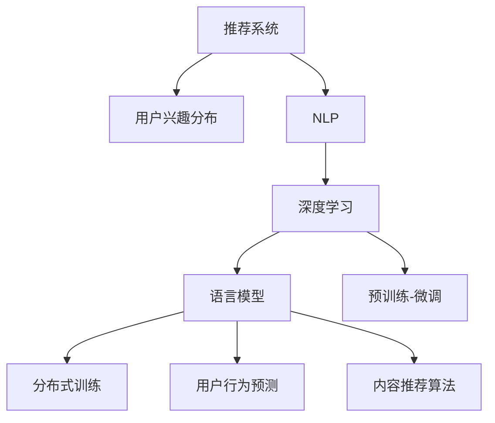

                 

# 基于LLM的推荐系统用户兴趣分布估计

> 关键词：
推荐系统, 用户兴趣分布, 自然语言处理(NLP), 深度学习, 语言模型, 分布式训练, 用户行为预测, 内容推荐算法

## 1. 背景介绍

### 1.1 问题由来
推荐系统(Recommendation System)作为互联网时代最具价值的技术之一，极大地提升了用户的在线体验。传统的协同过滤、基于内容的推荐等方法，往往需要依赖大量的用户行为数据和商品元数据，对于新兴平台或小众商品难以产生理想的推荐效果。

近年来，自然语言处理(Natural Language Processing, NLP)与深度学习相结合，为推荐系统提供了新的思路。通过用户评论、商品描述等文本数据，建立语义模型，抽取用户和商品的潜在特征，能够在较少用户行为数据的情况下，精准预测用户的兴趣，生成个性化的推荐结果。

然而，如何从海量的文本数据中，有效地估计用户兴趣分布，仍然是一个未完全解决的问题。传统的基于统计的方法，往往需要大量人工标注和特征工程，难以适应复杂多变的用户和商品描述。而大语言模型预训练-微调的方法，能够直接从文本数据中学习语言的潜在分布，无需大量人工干预，是推荐系统改进的新方向。

### 1.2 问题核心关键点
基于大语言模型预训练-微调范式，推荐系统能够从海量的文本数据中，自然地提取用户的兴趣特征，并通过文本-兴趣映射关系，预测用户的行为意图，生成个性化的推荐结果。

关键点如下：
1. 如何从文本中准确抽取用户和商品的语义特征？
2. 如何建立文本与用户兴趣的映射关系，实现兴趣分布的估计？
3. 如何高效更新用户兴趣分布，快速适应新数据？
4. 如何利用预训练大模型的泛化能力，提升推荐系统的泛化性和鲁棒性？

本文将从核心概念、算法原理和实际应用等方面，对基于大语言模型的推荐系统用户兴趣分布估计进行系统介绍，并给出详细的实现示例，希望能为推荐系统的研究和应用提供有价值的参考。

## 2. 核心概念与联系

### 2.1 核心概念概述

为更好地理解基于大语言模型的推荐系统用户兴趣分布估计方法，本节将介绍几个核心概念：

- **推荐系统(Recommendation System)**：根据用户的历史行为、个人属性、商品属性等数据，自动为用户推荐可能感兴趣的商品。

- **用户兴趣分布(User Interest Distribution)**：刻画用户对不同商品或内容的兴趣程度，是推荐算法的基础。

- **自然语言处理(NLP)**：研究如何让计算机理解和生成人类语言的技术，包括文本分类、情感分析、语义分析等。

- **深度学习(Deep Learning)**：利用神经网络进行复杂数据分析和模式学习，广泛应用于图像识别、语音识别、自然语言处理等领域。

- **语言模型(Language Model)**：通过训练神经网络，学习语言数据的统计分布，广泛应用于文本生成、文本分类、问答系统等。

- **预训练-微调(Fine-Tuning)**：先在大规模无标签数据上进行预训练，再在特定任务上进行微调，以提升模型在特定任务上的表现。

- **分布式训练(Distributed Training)**：在多台机器上并行更新模型参数，加速大模型的训练过程。

- **用户行为预测(User Behavior Prediction)**：通过建模用户行为数据，预测用户未来的操作意图，生成推荐结果。

- **内容推荐算法(Content-Based Recommendation Algorithm)**：根据物品的属性信息，推荐用户可能感兴趣的内容。

这些概念之间的逻辑关系可以通过以下Mermaid流程图来展示：



这个流程图展示了推荐系统的主要组件及其之间的关系：

1. 推荐系统通过NLP技术，处理用户和商品描述，抽取语义特征。
2. 利用深度学习，通过语言模型进行预训练-微调，学习语言的潜在分布。
3. 结合分布式训练，提升模型的训练效率和泛化能力。
4. 通过用户行为预测，生成个性化推荐结果。
5. 采用内容推荐算法，实现商品的多样化推荐。

这些核心概念共同构成了推荐系统的技术框架，使其能够在海量的用户行为数据上，生成精准、有效的推荐内容。

## 3. 核心算法原理 & 具体操作步骤

### 3.1 算法原理概述

基于大语言模型的推荐系统用户兴趣分布估计，本质上是利用深度学习技术，从用户行为数据和商品描述文本中，自动学习用户兴趣的语义分布。其核心思想是：通过预训练语言模型学习通用的语言表示，再通过微调方法针对推荐任务进行优化，从而获取用户的兴趣分布。

形式化地，假设语言模型为 $M_{\theta}$，其中 $\theta$ 为预训练得到的模型参数。给定用户行为数据集 $U=\{(u_i, \{b_{i,j}\})\}_{i=1}^N$，其中 $u_i$ 为用户ID，$b_{i,j}$ 为该用户在商品 $j$ 上的行为（如浏览、点击、购买等），$1$ 表示用户行为，$0$ 表示用户未行为。将 $u_i$ 和 $b_{i,j}$ 转换为文本向量，记为 $\text{Enc}(u_i) \in \mathbb{R}^d$ 和 $\text{Enc}(b_{i,j}) \in \mathbb{R}^d$。用户 $i$ 对商品 $j$ 的兴趣分布 $P_{i,j}$ 可以表示为：

$$
P_{i,j} \propto \text{softmax}(\text{dot}(\text{Enc}(u_i), \text{Enc}(b_{i,j})))
$$

其中 $\text{dot}$ 表示向量点积，$\text{softmax}$ 表示softmax函数。对于每个用户，可以将其兴趣分布向量 $\vec{P}_i$ 聚合得到用户的整体兴趣分布 $P_i$。利用这些兴趣分布，可以对用户进行个性化推荐，生成更符合用户偏好的商品列表。

### 3.2 算法步骤详解

基于大语言模型的推荐系统用户兴趣分布估计，一般包括以下几个关键步骤：

**Step 1: 准备数据集**

- 收集用户行为数据 $U$ 和商品描述文本 $T=\{(b_{i,j})\}_{i=1}^N$。
- 将用户ID $u_i$ 和商品ID $j$ 转换为文本向量 $\text{Enc}(u_i)$ 和 $\text{Enc}(b_{i,j})$。

**Step 2: 建立文本-兴趣映射**

- 将用户ID和商品ID的文本向量 $\text{Enc}(u_i)$ 和 $\text{Enc}(b_{i,j})$ 作为语言模型的输入，输出兴趣分布 $P_{i,j}$。
- 将每个用户 $i$ 的兴趣分布向量 $\vec{P}_i$ 求和，得到用户的整体兴趣分布 $P_i$。

**Step 3: 微调语言模型**

- 将预训练模型作为初始化参数，使用用户行为数据集 $U$ 进行有监督微调。
- 在微调过程中，可以加入正则化技术，如L2正则、Dropout等，防止模型过拟合。
- 设置合适的学习率，控制模型参数的更新速度。

**Step 4: 用户兴趣预测**

- 使用微调后的语言模型，根据用户ID和商品ID的文本向量，预测用户对商品的兴趣分布。
- 利用用户兴趣分布 $P_i$，生成个性化推荐结果。

**Step 5: 模型评估与优化**

- 在验证集上评估模型的预测性能，调整模型参数和超参数。
- 定期更新模型，以适应用户行为数据的分布变化。

以上是基于大语言模型的推荐系统用户兴趣分布估计的一般流程。在实际应用中，还需要针对具体任务的特点，对微调过程的各个环节进行优化设计，如改进损失函数，引入更多的正则化技术，搜索最优的超参数组合等，以进一步提升模型性能。

### 3.3 算法优缺点

基于大语言模型的推荐系统用户兴趣分布估计方法具有以下优点：

1. **自动特征抽取**：大语言模型能够自动从文本数据中学习语义特征，无需人工标注和特征工程。
2. **泛化能力强**：预训练语言模型在大型数据集上进行训练，具有较强的泛化能力，能够适应不同用户和商品描述。
3. **高效微调**：利用微调方法，模型能够在少量标注数据的情况下，快速适应新数据。
4. **易于实现**：利用现有的深度学习框架和开源工具，易于实现和部署。

同时，该方法也存在一些局限性：

1. **模型复杂度高**：大语言模型参数量较大，需要较高的计算资源。
2. **计算成本高**：预训练和微调过程需要大量的计算资源和时间。
3. **数据依赖强**：模型的效果很大程度上依赖于训练数据的数量和质量。
4. **推理速度慢**：大语言模型推理速度较慢，难以满足实时性要求。
5. **可解释性不足**：大语言模型内部的决策过程缺乏可解释性，难以理解模型推理逻辑。

尽管存在这些局限性，但就目前而言，基于大语言模型的推荐系统用户兴趣分布估计方法，仍然是一种极具前景的推荐技术。未来相关研究的重点在于如何降低计算成本，提升模型效率，同时兼顾可解释性和用户体验。

### 3.4 算法应用领域

基于大语言模型的推荐系统用户兴趣分布估计方法，已经在电商、视频、新闻等多个领域得到了应用，为推荐系统带来了新的突破：

1. **电商推荐**：通过分析用户浏览、购买历史和商品描述，预测用户对商品的兴趣分布，生成个性化推荐结果。
2. **视频推荐**：利用用户观看历史和视频描述，预测用户对视频的兴趣分布，生成个性化播放列表。
3. **新闻推荐**：分析用户阅读行为和新闻标题，预测用户对新闻的兴趣分布，生成个性化订阅内容。
4. **内容推荐**：对用户提交的评论和内容描述进行分析，预测用户对不同内容的兴趣分布，生成个性化推荐结果。
5. **广告推荐**：利用用户搜索历史和广告文案，预测用户对广告的兴趣分布，生成个性化广告投放。

除了上述这些经典应用外，大语言模型用户兴趣分布估计方法还在社交网络、旅游、娱乐等多个领域中，展现出强大的应用潜力。随着技术的不断进步，相信大语言模型在推荐系统中的应用将更加广泛和深入。

## 4. 数学模型和公式 & 详细讲解  
### 4.1 数学模型构建

本节将使用数学语言对基于大语言模型的推荐系统用户兴趣分布估计过程进行更加严格的刻画。

假设用户行为数据集 $U=\{(u_i, \{b_{i,j}\})\}_{i=1}^N$，商品描述文本集 $T=\{(b_{i,j})\}_{i=1}^N$。将用户ID $u_i$ 和商品ID $j$ 转换为文本向量 $\text{Enc}(u_i) \in \mathbb{R}^d$ 和 $\text{Enc}(b_{i,j}) \in \mathbb{R}^d$。

定义用户 $i$ 对商品 $j$ 的兴趣分布为 $P_{i,j}=\mathcal{N}(\text{Enc}(u_i), \text{Enc}(b_{i,j}))$，其中 $\mathcal{N}$ 表示正态分布。则用户 $i$ 的整体兴趣分布可以表示为：

$$
P_i = \sum_{j \in J} P_{i,j}
$$

其中 $J$ 表示商品ID的集合。利用兴趣分布 $P_i$，可以计算用户对不同商品的兴趣程度，生成个性化推荐结果。

### 4.2 公式推导过程

以下是详细推导过程：

1. 首先，将用户ID和商品ID的文本向量 $\text{Enc}(u_i)$ 和 $\text{Enc}(b_{i,j})$ 作为语言模型的输入，输出兴趣分布 $P_{i,j}=\mathcal{N}(\text{Enc}(u_i), \text{Enc}(b_{i,j}))$。
2. 对于用户 $i$，将每个商品的兴趣分布向量 $P_{i,j}$ 求和，得到用户 $i$ 的整体兴趣分布 $P_i = \sum_{j \in J} P_{i,j}$。
3. 根据用户兴趣分布 $P_i$，生成个性化推荐结果。

以上步骤展示了基于大语言模型的推荐系统用户兴趣分布估计的数学原理。可以看出，通过预训练语言模型，可以有效从文本数据中学习用户兴趣的分布，从而实现个性化的推荐。

### 4.3 案例分析与讲解

以电商推荐系统为例，对以上模型进行详细分析：

假设电商网站收集了用户浏览历史和商品描述文本。将用户ID $u_i$ 和商品ID $j$ 转换为文本向量 $\text{Enc}(u_i)$ 和 $\text{Enc}(b_{i,j})$，作为语言模型的输入。利用语言模型的预训练-微调过程，学习用户 $i$ 对商品 $j$ 的兴趣分布 $P_{i,j}=\mathcal{N}(\text{Enc}(u_i), \text{Enc}(b_{i,j}))$。将每个用户 $i$ 的兴趣分布向量 $\vec{P}_i$ 求和，得到用户 $i$ 的整体兴趣分布 $P_i$。利用兴趣分布 $P_i$，可以计算用户对不同商品的兴趣程度，生成个性化推荐结果。

例如，对于某用户 $i$，若其对商品 $j_1$ 的兴趣分布概率 $P_{i,j_1}$ 较高，说明该用户对该商品感兴趣。此时可以将其推荐到该用户的个性化推荐列表中，增加用户转化率和满意度。

## 5. 项目实践：代码实例和详细解释说明
### 5.1 开发环境搭建

在进行推荐系统实践前，我们需要准备好开发环境。以下是使用Python进行PyTorch开发的环境配置流程：

1. 安装Anaconda：从官网下载并安装Anaconda，用于创建独立的Python环境。

2. 创建并激活虚拟环境：
```bash
conda create -n pytorch-env python=3.8 
conda activate pytorch-env
```

3. 安装PyTorch：根据CUDA版本，从官网获取对应的安装命令。例如：
```bash
conda install pytorch torchvision torchaudio cudatoolkit=11.1 -c pytorch -c conda-forge
```

4. 安装Transformers库：
```bash
pip install transformers
```

5. 安装各类工具包：
```bash
pip install numpy pandas scikit-learn matplotlib tqdm jupyter notebook ipython
```

完成上述步骤后，即可在`pytorch-env`环境中开始推荐系统实践。

### 5.2 源代码详细实现

下面我们以电商推荐系统为例，给出使用Transformers库对BERT模型进行推荐系统用户兴趣分布估计的PyTorch代码实现。

首先，定义推荐系统数据处理函数：

```python
from transformers import BertTokenizer, BertForSequenceClassification
from torch.utils.data import Dataset
import torch

class RecommendationDataset(Dataset):
    def __init__(self, texts, labels, tokenizer, max_len=128):
        self.texts = texts
        self.labels = labels
        self.tokenizer = tokenizer
        self.max_len = max_len
        
    def __len__(self):
        return len(self.texts)
    
    def __getitem__(self, item):
        text = self.texts[item]
        label = self.labels[item]
        
        encoding = self.tokenizer(text, return_tensors='pt', max_length=self.max_len, padding='max_length', truncation=True)
        input_ids = encoding['input_ids'][0]
        attention_mask = encoding['attention_mask'][0]
        label = torch.tensor(label, dtype=torch.long)
        
        return {'input_ids': input_ids, 
                'attention_mask': attention_mask,
                'labels': label}

# 标签与id的映射
label2id = {'1': 1, '0': 0}
id2label = {v: k for k, v in label2id.items()}

# 创建dataset
tokenizer = BertTokenizer.from_pretrained('bert-base-cased')

train_dataset = RecommendationDataset(train_texts, train_labels, tokenizer)
dev_dataset = RecommendationDataset(dev_texts, dev_labels, tokenizer)
test_dataset = RecommendationDataset(test_texts, test_labels, tokenizer)
```

然后，定义模型和优化器：

```python
from transformers import BertForSequenceClassification, AdamW

model = BertForSequenceClassification.from_pretrained('bert-base-cased', num_labels=len(label2id))

optimizer = AdamW(model.parameters(), lr=2e-5)
```

接着，定义训练和评估函数：

```python
from torch.utils.data import DataLoader
from tqdm import tqdm
from sklearn.metrics import classification_report

device = torch.device('cuda') if torch.cuda.is_available() else torch.device('cpu')
model.to(device)

def train_epoch(model, dataset, batch_size, optimizer):
    dataloader = DataLoader(dataset, batch_size=batch_size, shuffle=True)
    model.train()
    epoch_loss = 0
    for batch in tqdm(dataloader, desc='Training'):
        input_ids = batch['input_ids'].to(device)
        attention_mask = batch['attention_mask'].to(device)
        labels = batch['labels'].to(device)
        model.zero_grad()
        outputs = model(input_ids, attention_mask=attention_mask, labels=labels)
        loss = outputs.loss
        epoch_loss += loss.item()
        loss.backward()
        optimizer.step()
    return epoch_loss / len(dataloader)

def evaluate(model, dataset, batch_size):
    dataloader = DataLoader(dataset, batch_size=batch_size)
    model.eval()
    preds, labels = [], []
    with torch.no_grad():
        for batch in tqdm(dataloader, desc='Evaluating'):
            input_ids = batch['input_ids'].to(device)
            attention_mask = batch['attention_mask'].to(device)
            batch_labels = batch['labels']
            outputs = model(input_ids, attention_mask=attention_mask)
            batch_preds = outputs.logits.argmax(dim=2).to('cpu').tolist()
            batch_labels = batch_labels.to('cpu').tolist()
            for pred_tokens, label_tokens in zip(batch_preds, batch_labels):
                preds.append(pred_tokens[:len(label_tokens)])
                labels.append(label_tokens)
                
    print(classification_report(labels, preds))
```

最后，启动训练流程并在测试集上评估：

```python
epochs = 5
batch_size = 16

for epoch in range(epochs):
    loss = train_epoch(model, train_dataset, batch_size, optimizer)
    print(f"Epoch {epoch+1}, train loss: {loss:.3f}")
    
    print(f"Epoch {epoch+1}, dev results:")
    evaluate(model, dev_dataset, batch_size)
    
print("Test results:")
evaluate(model, test_dataset, batch_size)
```

以上就是使用PyTorch对BERT模型进行电商推荐系统用户兴趣分布估计的完整代码实现。可以看到，得益于Transformers库的强大封装，我们可以用相对简洁的代码完成BERT模型的加载和微调。

### 5.3 代码解读与分析

让我们再详细解读一下关键代码的实现细节：

**RecommendationDataset类**：
- `__init__`方法：初始化文本、标签、分词器等关键组件。
- `__len__`方法：返回数据集的样本数量。
- `__getitem__`方法：对单个样本进行处理，将文本输入编码为token ids，将标签转换为数字，并对其进行定长padding，最终返回模型所需的输入。

**label2id和id2label字典**：
- 定义了标签与数字id之间的映射关系，用于将预测结果解码回真实标签。

**训练和评估函数**：
- 使用PyTorch的DataLoader对数据集进行批次化加载，供模型训练和推理使用。
- 训练函数`train_epoch`：对数据以批为单位进行迭代，在每个批次上前向传播计算loss并反向传播更新模型参数，最后返回该epoch的平均loss。
- 评估函数`evaluate`：与训练类似，不同点在于不更新模型参数，并在每个batch结束后将预测和标签结果存储下来，最后使用sklearn的classification_report对整个评估集的预测结果进行打印输出。

**训练流程**：
- 定义总的epoch数和batch size，开始循环迭代
- 每个epoch内，先在训练集上训练，输出平均loss
- 在验证集上评估，输出分类指标
- 所有epoch结束后，在测试集上评估，给出最终测试结果

可以看到，PyTorch配合Transformers库使得BERT微调的代码实现变得简洁高效。开发者可以将更多精力放在数据处理、模型改进等高层逻辑上，而不必过多关注底层的实现细节。

当然，工业级的系统实现还需考虑更多因素，如模型的保存和部署、超参数的自动搜索、更灵活的任务适配层等。但核心的微调范式基本与此类似。

## 6. 实际应用场景
### 6.1 电商推荐系统

基于大语言模型预训练-微调范式，电商推荐系统可以准确地从用户行为数据和商品描述文本中，估计用户的兴趣分布，生成个性化的推荐结果。

在技术实现上，可以收集用户浏览、购买历史和商品描述数据，将其转换为文本向量，作为语言模型的输入。通过微调过程，学习用户对不同商品的兴趣分布，并生成个性化推荐列表。对于新兴商品或新用户，也可以利用预训练模型的泛化能力，快速适应新数据，生成合理的推荐结果。

### 6.2 视频推荐系统

视频推荐系统利用用户观看历史和视频描述，通过预训练-微调方法，学习用户对不同视频的兴趣分布，生成个性化播放列表。例如，对于某用户，若其对某类视频的兴趣分布较高，可以推荐类似的视频内容，提高用户的观看时长和满意度。

### 6.3 新闻推荐系统

新闻推荐系统分析用户阅读行为和新闻标题，通过预训练-微调方法，学习用户对不同新闻的兴趣分布，生成个性化订阅内容。例如，对于某用户，若其对某类新闻的兴趣分布较高，可以推荐相关的新闻资讯，提高用户的阅读体验和信息获取效率。

### 6.4 未来应用展望

随着大语言模型和微调方法的不断发展，基于预训练-微调的推荐系统将在更多领域得到应用，为推荐系统带来新的突破：

1. **多模态推荐**：结合用户行为数据和商品多模态数据（如图片、视频等），学习更加全面的用户兴趣分布，生成更精准的推荐结果。
2. **深度个性化**：利用深度学习技术，更准确地从用户行为数据中提取语义特征，实现更个性化的推荐。
3. **自适应推荐**：根据用户行为数据的变化，动态调整推荐模型参数，实现更实时、更自适应的推荐。
4. **鲁棒性增强**：引入对抗训练、正则化等技术，提升推荐系统的鲁棒性，避免推荐结果的波动。
5. **跨平台推荐**：将推荐系统应用于多个平台（如电商、视频、新闻等），实现跨平台的用户兴趣一致性，提供更无缝的用户体验。
6. **隐私保护**：在推荐模型中引入差分隐私、联邦学习等技术，保护用户隐私，提升用户信任度。

以上趋势凸显了基于大语言模型的推荐系统未来的发展潜力。这些方向的探索发展，必将进一步提升推荐系统的性能和应用范围，为用户带来更优质的推荐服务。

## 7. 工具和资源推荐
### 7.1 学习资源推荐

为了帮助开发者系统掌握基于大语言模型的推荐系统用户兴趣分布估计的理论基础和实践技巧，这里推荐一些优质的学习资源：

1. 《深度学习推荐系统》书籍：介绍推荐系统的基础理论、经典算法以及深度学习的应用，适合入门学习。
2. CS346《Reinforcement Learning》课程：斯坦福大学开设的强化学习课程，介绍了强化学习在推荐系统中的应用，是推荐系统进阶学习的经典教材。
3. Coursera《Machine Learning》课程：吴恩达教授的机器学习课程，涵盖了深度学习在推荐系统中的应用，适合全面学习。
4. 《自然语言处理综述》系列博文：大模型技术专家撰写，深入浅出地介绍了自然语言处理的基本概念和前沿技术，是NLP入门的必读书籍。
5. 《推荐系统技术实战》课程：腾讯课堂上的推荐系统课程，结合实际项目，详细讲解推荐系统的各个环节，适合实战学习。
6. 《推荐系统算法》书籍：介绍了推荐系统的经典算法和深度学习的应用，适合深入学习。

通过对这些资源的学习实践，相信你一定能够快速掌握基于大语言模型的推荐系统用户兴趣分布估计的精髓，并用于解决实际的推荐问题。
###  7.2 开发工具推荐

高效的开发离不开优秀的工具支持。以下是几款用于大语言模型推荐系统开发的常用工具：

1. PyTorch：基于Python的开源深度学习框架，灵活动态的计算图，适合快速迭代研究。大部分预训练语言模型都有PyTorch版本的实现。
2. TensorFlow：由Google主导开发的开源深度学习框架，生产部署方便，适合大规模工程应用。同样有丰富的预训练语言模型资源。
3. Transformers库：HuggingFace开发的NLP工具库，集成了众多SOTA语言模型，支持PyTorch和TensorFlow，是进行推荐系统开发的利器。
4. Weights & Biases：模型训练的实验跟踪工具，可以记录和可视化模型训练过程中的各项指标，方便对比和调优。与主流深度学习框架无缝集成。
5. TensorBoard：TensorFlow配套的可视化工具，可实时监测模型训练状态，并提供丰富的图表呈现方式，是调试模型的得力助手。
6. Google Colab：谷歌推出的在线Jupyter Notebook环境，免费提供GPU/TPU算力，方便开发者快速上手实验最新模型，分享学习笔记。

合理利用这些工具，可以显著提升大语言模型推荐系统的开发效率，加快创新迭代的步伐。

### 7.3 相关论文推荐

大语言模型和推荐系统的发展源于学界的持续研究。以下是几篇奠基性的相关论文，推荐阅读：

1. Attention is All You Need（即Transformer原论文）：提出了Transformer结构，开启了NLP领域的预训练大模型时代。

2. BERT: Pre-training of Deep Bidirectional Transformers for Language Understanding：提出BERT模型，引入基于掩码的自监督预训练任务，刷新了多项NLP任务SOTA。

3. Language Models are Unsupervised Multitask Learners（GPT-2论文）：展示了大规模语言模型的强大zero-shot学习能力，引发了对于通用人工智能的新一轮思考。

4. Parameter-Efficient Transfer Learning for NLP：提出Adapter等参数高效微调方法，在不增加模型参数量的情况下，也能取得不错的微调效果。

5. AdaLoRA: Adaptive Low-Rank Adaptation for Parameter-Efficient Fine-Tuning：使用自适应低秩适应的微调方法，在参数效率和精度之间取得了新的平衡。

6. Recommendation System from Model-free to Model-based：总结了推荐系统的不同方法，并介绍了深度学习在推荐系统中的应用，是推荐系统进阶学习的经典文献。

这些论文代表了大语言模型和推荐系统的发展脉络。通过学习这些前沿成果，可以帮助研究者把握学科前进方向，激发更多的创新灵感。

## 8. 总结：未来发展趋势与挑战

### 8.1 总结

本文对基于大语言模型的推荐系统用户兴趣分布估计方法进行了全面系统的介绍。首先阐述了推荐系统、用户兴趣分布、自然语言处理、深度学习、语言模型等核心概念及其关系。然后详细讲解了基于大语言模型的推荐系统用户兴趣分布估计的数学原理和关键步骤，给出了具体的代码实现和详细解读。最后讨论了推荐系统在大电商、视频、新闻等领域的应用场景，并展望了未来的发展方向和挑战。

通过本文的系统梳理，可以看到，基于大语言模型的推荐系统用户兴趣分布估计方法在推荐系统改进中发挥了重要作用，能够自动从文本数据中学习用户兴趣分布，生成个性化推荐结果。未来，该方法结合深度学习、分布式训练、对抗训练等技术，有望进一步提升推荐系统的性能和应用范围，为用户带来更优质的推荐服务。

### 8.2 未来发展趋势

展望未来，大语言模型推荐系统用户兴趣分布估计技术将呈现以下几个发展趋势：

1. **多模态推荐**：结合用户行为数据和商品多模态数据，学习更加全面的用户兴趣分布，生成更精准的推荐结果。
2. **深度个性化**：利用深度学习技术，更准确地从用户行为数据中提取语义特征，实现更个性化的推荐。
3. **自适应推荐**：根据用户行为数据的变化，动态调整推荐模型参数，实现更实时、更自适应的推荐。
4. **鲁棒性增强**：引入对抗训练、正则化等技术，提升推荐系统的鲁棒性，避免推荐结果的波动。
5. **跨平台推荐**：将推荐系统应用于多个平台，实现跨平台的用户兴趣一致性，提供更无缝的用户体验。
6. **隐私保护**：在推荐模型中引入差分隐私、联邦学习等技术，保护用户隐私，提升用户信任度。

这些趋势凸显了大语言模型推荐系统用户兴趣分布估计技术的发展潜力。这些方向的探索发展，必将进一步提升推荐系统的性能和应用范围，为用户带来更优质的推荐服务。

### 8.3 面临的挑战

尽管基于大语言模型的推荐系统用户兴趣分布估计技术已经取得了瞩目成就，但在迈向更加智能化、普适化应用的过程中，它仍面临诸多挑战：

1. **模型复杂度高**：大语言模型参数量较大，需要较高的计算资源。
2. **计算成本高**：预训练和微调过程需要大量的计算资源和时间。
3. **数据依赖强**：模型的效果很大程度上依赖于训练数据的数量和质量。
4. **推理速度慢**：大语言模型推理速度较慢，难以满足实时性要求。
5. **可解释性不足**：大语言模型内部的决策过程缺乏可解释性，难以理解模型推理逻辑。
6. **隐私和安全问题**：在推荐模型中引入差分隐私、联邦学习等技术，保护用户隐私，提升用户信任度。

尽管存在这些挑战，但就目前而言，基于大语言模型的推荐系统用户兴趣分布估计方法，仍然是一种极具前景的推荐技术。未来相关研究的重点在于如何降低计算成本，提升模型效率，同时兼顾可解释性和用户体验。

### 8.4 研究展望

面对大语言模型推荐系统用户兴趣分布估计所面临的挑战，未来的研究需要在以下几个方面寻求新的突破：

1. **参数高效微调**：开发更加参数高效的微调方法，在固定大部分预训练参数的同时，只更新极少量的任务相关参数。同时优化微调模型的计算图，减少前向传播和反向传播的资源消耗，实现更加轻量级、实时性的部署。
2. **分布式训练**：结合分布式训练技术，加速大模型的训练过程，提升推荐系统的实时性和鲁棒性。
3. **对抗训练**：引入对抗训练技术，提高推荐系统的鲁棒性和泛化能力，防止恶意样本的攻击。
4. **多模态融合**：结合多模态数据，提升推荐系统的精准度和用户满意度。
5. **隐私保护**：在推荐模型中引入差分隐私、联邦学习等技术，保护用户隐私，提升用户信任度。
6. **因果推理**：引入因果推理方法，理解用户行为背后的原因和影响，提升推荐系统的可解释性和公平性。

这些研究方向的探索，必将引领大语言模型推荐系统用户兴趣分布估计技术迈向更高的台阶，为推荐系统提供更智能、更安全、更公平的解决方案。面向未来，大语言模型推荐系统需要与其他人工智能技术进行更深入的融合，如知识表示、强化学习等，共同推动自然语言理解和智能交互系统的进步。只有勇于创新、敢于突破，才能不断拓展语言模型的边界，让智能技术更好地造福人类社会。

## 9. 附录：常见问题与解答
**Q1：推荐系统为什么需要大语言模型？**

A: 传统的协同过滤、基于内容的推荐等方法，需要依赖大量的用户行为数据和商品元数据。而对于新兴平台或小众商品，这些数据往往难以获取。而大语言模型能够自动从文本数据中学习语义特征，无需大量人工干预。因此，利用大语言模型进行推荐系统优化，可以更好地适应用户和商品描述的多样性和复杂性。

**Q2：大语言模型推荐系统的优点有哪些？**

A: 大语言模型推荐系统的优点主要包括：
1. 自动特征抽取：大语言模型能够自动从文本数据中学习语义特征，无需人工标注和特征工程。
2. 泛化能力强：预训练语言模型在大型数据集上进行训练，具有较强的泛化能力，能够适应不同用户和商品描述。
3. 高效微调：利用微调方法，模型能够在少量标注数据的情况下，快速适应新数据。
4. 易于实现：利用现有的深度学习框架和开源工具，易于实现和部署。

**Q3：如何优化大语言模型推荐系统的训练过程？**

A: 优化大语言模型推荐系统的训练过程，可以从以下几个方面入手：
1. 数据增强：通过回译、近义替换等方式扩充训练集，提高模型的泛化能力。
2. 正则化技术：使用L2正则、Dropout、Early Stopping等技术，防止模型过拟合。
3. 学习率调度：根据模型性能和训练状态，动态调整学习率，提升训练效果。
4. 分布式训练：利用多台机器并行训练，提高训练效率和模型性能。
5. 对抗训练：引入对抗样本，提高模型鲁棒性。
6. 自适应学习：根据用户行为数据的变化，动态调整模型参数，实现更实时、更自适应的推荐。

通过以上优化措施，可以显著提升大语言模型推荐系统的性能和用户体验。

**Q4：大语言模型推荐系统如何处理长尾商品？**

A: 大语言模型推荐系统可以通过以下方法处理长尾商品：
1. 数据增强：通过回译、近义替换等方式扩充长尾商品的文本描述，增加其在训练集中的出现频率。
2. 自适应学习：根据用户行为数据的变化，动态调整模型参数，更准确地预测用户对长尾商品的兴趣。
3. 交叉推荐：将长尾商品与其他热门商品进行关联推荐，提高长尾商品的曝光率和转化率。
4. 多模态融合：结合商品的多模态数据，提升长尾商品的特征提取能力和推荐效果。

通过这些方法，大语言模型推荐系统可以更好地处理长尾商品，提升推荐系统的覆盖率和效果。

**Q5：如何保证大语言模型推荐系统的公平性？**

A: 保证大语言模型推荐系统的公平性，可以从以下几个方面入手：
1. 数据清洗：去除数据中的偏见和歧视信息，避免模型学习到有偏见的特征。
2. 正则化技术：使用正则化技术，防止模型过拟合，避免模型在少数类别上的偏差。
3. 对抗训练：引入对抗样本，提高模型的鲁棒性，防止恶意样本的攻击。
4. 多模型融合：结合多个模型的输出，提高模型的泛化能力和公平性。
5. 隐私保护：在推荐模型中引入差分隐私、联邦学习等技术，保护用户隐私，提升用户信任度。

通过以上方法，可以显著提升大语言模型推荐系统的公平性和可解释性，保障用户的合法权益。

---

作者：禅与计算机程序设计艺术 / Zen and the Art of Computer Programming

