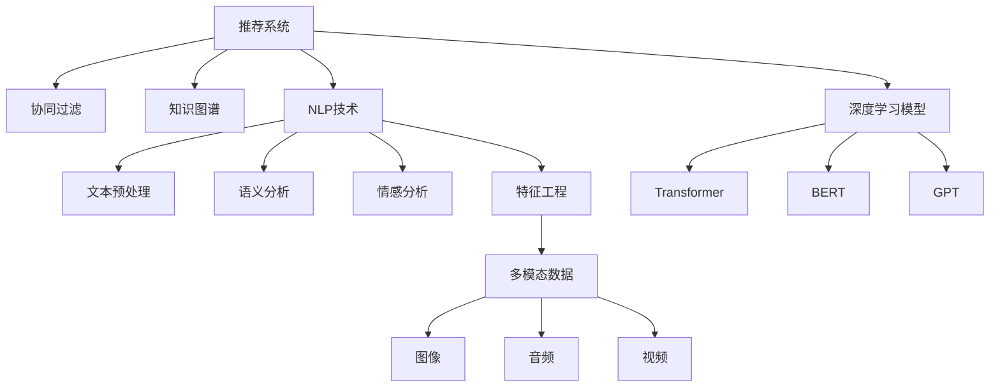

                 

# 基于LLM的推荐系统用户兴趣多样性建模

> 关键词：推荐系统, 用户兴趣建模, 多模态数据, 自然语言处理, 深度学习, 协同过滤, 知识图谱, 用户行为分析, 交互分析, 深度学习模型, 特征工程

## 1. 背景介绍

### 1.1 问题由来

随着互联网的普及，推荐系统在电商、视频、音乐、新闻等众多领域得到了广泛应用，成为提升用户体验、增加收益的关键技术。传统的推荐系统主要依赖于协同过滤和矩阵分解，通过用户行为数据进行物品推荐。然而，这种方式往往忽略了用户多模态的兴趣维度，难以全面刻画用户的真实需求。

近年来，随着深度学习和大规模语言模型(LLMs)的兴起，基于深度学习的推荐系统逐渐成为研究热点。LLM通过文本、图像、音频等多种模态数据，可以全面捕捉用户的多样化兴趣，提升推荐系统的表现力。然而，如何有效地利用LLM进行用户兴趣建模，仍然是一个具有挑战性的问题。

### 1.2 问题核心关键点

用户兴趣建模是推荐系统的重要环节，通过多维度的特征信息对用户进行刻画，可以帮助推荐系统发现并满足用户未明确表达的需求，提升推荐质量。基于LLM的用户兴趣建模方法，主要包含以下关键点：

- 如何利用自然语言处理(NLP)技术，从用户的历史行为数据、评论、社交媒体信息等文本数据中提取和融合用户兴趣。
- 如何引入多模态数据，如图像、音频等，与文本数据进行协同建模，提升用户兴趣的全面性。
- 如何应用深度学习模型，如Transformer、BERT、GPT等，对用户兴趣进行高效建模和预测。
- 如何通过特征工程，构造用户兴趣的多样化特征，提升推荐系统的泛化能力。
- 如何评估用户兴趣建模的效果，结合实际业务场景进行优化。

通过理解这些关键点，我们可以更好地把握基于LLM的用户兴趣建模方法的原理和应用策略。

## 2. 核心概念与联系

### 2.1 核心概念概述

为了更好地理解基于LLM的用户兴趣建模方法，本节将介绍几个密切相关的核心概念：

- 推荐系统(Recommendation System)：通过用户历史行为数据，学习用户偏好，进行物品推荐的技术系统。
- 协同过滤(Collaborative Filtering)：一种基于用户行为数据进行推荐的算法，包括用户-物品共现矩阵分解、基于用户的矩阵分解和基于物品的矩阵分解等。
- 知识图谱(Knowledge Graph)：一种语义化的关系型数据结构，通过图结构表示实体及其关系，辅助推荐系统的物品关联分析。
- 自然语言处理(Natural Language Processing, NLP)：利用计算机技术处理、分析、理解人类语言的技术，涉及文本预处理、语义分析、情感分析等多个方向。
- 深度学习模型(Deep Learning Model)：一种基于神经网络的机器学习技术，可以自动提取数据特征，并实现高效的分类、回归、生成等任务。
- 多模态数据(Multimodal Data)：包含文本、图像、音频、视频等多种类型的数据，可以更全面地反映用户的多样化兴趣。
- 特征工程(Feature Engineering)：从原始数据中提取出能够表征数据特征的维度，提升模型预测性能。

这些核心概念之间的逻辑关系可以通过以下Mermaid流程图来展示：



这个流程图展示了一些核心概念及其之间的关系：

1. 推荐系统通过协同过滤、知识图谱、NLP技术、深度学习模型等方法，进行用户兴趣建模。
2. 协同过滤通过矩阵分解分析用户行为数据。
3. 知识图谱通过语义化的图结构辅助物品关联分析。
4. NLP技术利用文本预处理、语义分析、情感分析等技术，从文本数据中提取用户兴趣。
5. 深度学习模型，如Transformer、BERT、GPT等，可以高效地对用户兴趣进行建模和预测。
6. 特征工程从多模态数据中提取高维特征，提升模型泛化能力。
7. 多模态数据包含图像、音频、视频等不同类型的数据，可以更全面地反映用户兴趣。

这些概念共同构成了推荐系统的核心方法，使其能够根据用户的多样化兴趣，进行精准推荐。

## 3. 核心算法原理 & 具体操作步骤
### 3.1 算法原理概述

基于LLM的用户兴趣建模，本质上是一种多维度的用户特征表示学习过程。其核心思想是通过LLM，将用户的多模态数据进行编码，生成一个紧凑的特征向量，用于预测用户对新物品的评分。

形式化地，假设用户的历史行为数据为 $H$，包括点击、浏览、购买、评价等信息。设物品集合为 $I$，物品与用户的评分矩阵为 $R$。则用户 $u$ 对物品 $i$ 的评分可以表示为：

$$
\hat{r}_{u,i} = \text{LLM}(\text{fusion}(H_u, I_i))
$$

其中，$\text{LLM}$ 表示语言模型，$\text{fusion}(\cdot)$ 表示多模态数据融合函数，$H_u$ 和 $I_i$ 分别表示用户 $u$ 的历史行为和物品 $i$ 的多模态数据。

通过对每个用户 $u$ 的历史行为和物品 $i$ 的多模态数据进行编码，得到一个紧凑的特征向量，然后通过语言模型预测用户对物品的评分。

### 3.2 算法步骤详解

基于LLM的用户兴趣建模主要包括以下几个关键步骤：

**Step 1: 数据预处理**

- 收集用户的历史行为数据，包括点击、浏览、购买、评价等。
- 对文本数据进行分词、去除停用词、词干提取等文本预处理。
- 对图像、音频、视频等多模态数据进行特征提取和归一化。

**Step 2: 多模态数据融合**

- 将用户的历史行为和物品的多模态数据进行融合，生成一个综合特征向量。
- 常用的融合方法包括加权平均、余弦相似度、注意力机制等。
- 在融合过程中，可以引入文本情感分析，判断用户情感倾向，增强融合效果。

**Step 3: 语言模型训练**

- 选择合适的深度学习模型，如Transformer、BERT、GPT等。
- 在融合后的多模态数据上进行语言模型的训练，学习用户兴趣的表示。
- 设置合适的训练参数，如学习率、批大小、迭代轮数等。

**Step 4: 评分预测**

- 对新物品进行多模态数据融合，生成特征向量。
- 将融合后的特征向量输入到训练好的语言模型，预测用户对新物品的评分。
- 对预测评分进行归一化处理，得到用户对物品的偏好程度。

**Step 5: 推荐结果排序**

- 根据用户对物品的评分，结合物品的固有属性，生成推荐列表。
- 可以使用排序算法，如TopK排序、基于排序的推荐算法等，对推荐列表进行排序。
- 在排序过程中，可以引入用户行为的时效性、物品的时效性等动态特征。

### 3.3 算法优缺点

基于LLM的用户兴趣建模方法具有以下优点：

- 可以全面捕捉用户的多模态兴趣，提升推荐系统的表现力。
- 可以利用自然语言处理技术，从文本数据中提取深层次的语义信息，提升用户兴趣的全面性和准确性。
- 深度学习模型的自适应学习能力，可以应对数据的复杂性和多样性。
- 多模态数据的引入，可以更全面地反映用户兴趣，提升推荐系统的泛化能力。

同时，该方法也存在一些局限性：

- 需要大量的标注数据和计算资源，模型训练时间较长。
- 多模态数据的融合过程较复杂，需要选择合适的融合方法。
- 语言模型的鲁棒性受到数据质量的影响，需要处理数据噪声。
- 需要高维度的特征表示，增加了模型的计算复杂度。
- 预测过程的实时性受到模型大小的限制，需要优化模型结构和算法。

尽管存在这些局限性，但就目前而言，基于LLM的用户兴趣建模方法仍是最先进、最有效的推荐系统技术之一。未来相关研究的重点在于如何进一步降低模型训练成本，提高推荐系统的实时性和可解释性，同时兼顾多模态数据的融合和特征工程的设计。

### 3.4 算法应用领域

基于LLM的用户兴趣建模方法已经在多个推荐系统领域得到了广泛应用，例如：

- 电商推荐：对用户点击、购买、评价数据进行建模，推荐个性化商品。
- 视频推荐：对用户观看历史、评分、评论数据进行建模，推荐个性化视频。
- 新闻推荐：对用户阅读历史、点赞、分享数据进行建模，推荐个性化新闻。
- 音乐推荐：对用户听歌历史、评分、评论数据进行建模，推荐个性化音乐。
- 旅游推荐：对用户旅游历史、评分、评论数据进行建模，推荐个性化景点。

除了这些经典应用外，大语言模型在更多领域的应用还在不断涌现，如智能家居、金融产品推荐、健康医疗推荐等，为各行各业带来新的变革。随着深度学习和大规模语言模型技术的不断发展，基于LLM的推荐系统必将在更多场景下得到应用，为人类生活带来更多的便利和效率。

## 4. 数学模型和公式 & 详细讲解 & 举例说明
### 4.1 数学模型构建

基于LLM的用户兴趣建模方法，其核心数学模型为深度神经网络模型。下面以Transformer为例，详细介绍其数学模型构建。

假设用户的历史行为数据为 $H_u$，物品的多模态数据为 $I_i$，融合后的特征向量为 $F_{u,i}$，语言模型为 $L$。则用户对物品 $i$ 的评分可以表示为：

$$
\hat{r}_{u,i} = L(F_{u,i})
$$

其中，$L$ 表示深度神经网络模型，$F_{u,i}$ 表示融合后的特征向量。

Transformer是一种常用的深度神经网络模型，其核心思想是通过自注意力机制，将输入序列转化为高维表示。假设输入序列长度为 $L$，输出序列长度为 $K$，则Transformer模型的数学表达为：

$$
\begin{aligned}
&F_u = \text{Transformer}(H_u) \\
&F_i = \text{Transformer}(I_i) \\
&F_{u,i} = \text{fusion}(F_u, F_i)
\end{aligned}
$$

其中，$\text{Transformer}$ 表示Transformer模型，$\text{fusion}$ 表示多模态数据融合函数。

### 4.2 公式推导过程

下面以BERT模型为例，推导其用户兴趣建模过程的数学公式。

假设用户的历史行为数据为 $H_u$，物品的多模态数据为 $I_i$，融合后的特征向量为 $F_{u,i}$，BERT模型为 $B$。则用户对物品 $i$ 的评分可以表示为：

$$
\hat{r}_{u,i} = B(F_{u,i})
$$

其中，$B$ 表示BERT模型，$F_{u,i}$ 表示融合后的特征向量。

BERT模型的核心结构是Transformer编码器，其数学表达式为：

$$
\begin{aligned}
&H_u = \text{BERT}(H_u) \\
&I_i = \text{BERT}(I_i) \\
&F_{u,i} = \text{fusion}(H_u, I_i)
\end{aligned}
$$

其中，$\text{BERT}$ 表示BERT模型，$\text{fusion}$ 表示多模态数据融合函数。

在BERT模型的基础上，可以进一步引入注意力机制、位置编码等技术，提升模型对序列信息的建模能力。

### 4.3 案例分析与讲解

以下以电商推荐系统为例，详细讲解基于LLM的用户兴趣建模方法的实现过程。

假设电商推荐系统的用户历史行为数据为 $H_u$，物品的多模态数据为 $I_i$，融合后的特征向量为 $F_{u,i}$，BERT模型为 $B$。则用户对物品 $i$ 的评分可以表示为：

$$
\hat{r}_{u,i} = B(F_{u,i})
$$

其中，$F_{u,i} = \text{fusion}(H_u, I_i)$，表示将用户历史行为数据和物品多模态数据进行融合。

具体实现步骤如下：

1. 收集用户的历史行为数据，包括点击、浏览、购买、评价等信息。
2. 对文本数据进行分词、去除停用词、词干提取等文本预处理。
3. 对物品的多模态数据进行特征提取和归一化。
4. 将用户历史行为数据和物品多模态数据进行融合，生成一个综合特征向量。
5. 在融合后的特征向量上进行BERT模型的训练，学习用户兴趣的表示。
6. 对新物品进行多模态数据融合，生成特征向量。
7. 将融合后的特征向量输入到训练好的BERT模型，预测用户对新物品的评分。
8. 对预测评分进行归一化处理，得到用户对物品的偏好程度。
9. 根据用户对物品的评分，结合物品的固有属性，生成推荐列表。

这个过程涉及到的关键技术包括：

- 自然语言处理技术，从文本数据中提取用户兴趣。
- 多模态数据融合技术，将用户历史行为数据和物品多模态数据进行融合。
- 深度学习模型，如BERT，对用户兴趣进行建模和预测。
- 特征工程技术，构造用户兴趣的多样化特征。

## 5. 项目实践：代码实例和详细解释说明
### 5.1 开发环境搭建

在进行项目实践前，我们需要准备好开发环境。以下是使用Python进行PyTorch开发的环境配置流程：

1. 安装Anaconda：从官网下载并安装Anaconda，用于创建独立的Python环境。

2. 创建并激活虚拟环境：
```bash
conda create -n pytorch-env python=3.8 
conda activate pytorch-env
```

3. 安装PyTorch：根据CUDA版本，从官网获取对应的安装命令。例如：
```bash
conda install pytorch torchvision torchaudio cudatoolkit=11.1 -c pytorch -c conda-forge
```

4. 安装Transformers库：
```bash
pip install transformers
```

5. 安装各类工具包：
```bash
pip install numpy pandas scikit-learn matplotlib tqdm jupyter notebook ipython
```

完成上述步骤后，即可在`pytorch-env`环境中开始项目实践。

### 5.2 源代码详细实现

下面我们以电商推荐系统为例，给出使用Transformers库对BERT模型进行用户兴趣建模的PyTorch代码实现。

首先，定义电商推荐系统的数据处理函数：

```python
from transformers import BertTokenizer
from torch.utils.data import Dataset
import torch

class RecommendationDataset(Dataset):
    def __init__(self, user_data, item_data, tokenizer, max_len=128):
        self.user_data = user_data
        self.item_data = item_data
        self.tokenizer = tokenizer
        self.max_len = max_len
        
    def __len__(self):
        return len(self.user_data)
    
    def __getitem__(self, item):
        user_id = self.user_data[item][0]
        item_id = self.item_data[item][0]
        
        user_data = self.user_data[item][1:]
        item_data = self.item_data[item][1:]
        
        encoding = self.tokenizer(user_data, return_tensors='pt', max_length=self.max_len, padding='max_length', truncation=True)
        input_ids = encoding['input_ids'][0]
        attention_mask = encoding['attention_mask'][0]
        
        # 对item的多模态数据进行融合
        item_data_fusion = self.fusion(item_data)
        
        # 将user和item的融合数据进行拼接
        fusion_data = [user_data] + [item_data_fusion]
        
        # 对fusion_data进行编码
        fusion_encoding = self.tokenizer(fusion_data, return_tensors='pt', max_length=self.max_len, padding='max_length', truncation=True)
        fusion_input_ids = fusion_encoding['input_ids'][0]
        fusion_attention_mask = fusion_encoding['attention_mask'][0]
        
        return {'user_id': user_id, 
                'item_id': item_id,
                'input_ids': input_ids, 
                'attention_mask': attention_mask,
                'fusion_input_ids': fusion_input_ids,
                'fusion_attention_mask': fusion_attention_mask}
        
    def fusion(self, data):
        # 对item的多模态数据进行融合
        pass
```

然后，定义模型和优化器：

```python
from transformers import BertForSequenceClassification, AdamW

model = BertForSequenceClassification.from_pretrained('bert-base-cased', num_labels=2)

optimizer = AdamW(model.parameters(), lr=2e-5)
```

接着，定义训练和评估函数：

```python
from torch.utils.data import DataLoader
from tqdm import tqdm
from sklearn.metrics import precision_recall_fscore_support

device = torch.device('cuda') if torch.cuda.is_available() else torch.device('cpu')
model.to(device)

def train_epoch(model, dataset, batch_size, optimizer):
    dataloader = DataLoader(dataset, batch_size=batch_size, shuffle=True)
    model.train()
    epoch_loss = 0
    for batch in tqdm(dataloader, desc='Training'):
        user_id = batch['user_id']
        item_id = batch['item_id']
        input_ids = batch['input_ids'].to(device)
        attention_mask = batch['attention_mask'].to(device)
        fusion_input_ids = batch['fusion_input_ids'].to(device)
        fusion_attention_mask = batch['fusion_attention_mask'].to(device)
        model.zero_grad()
        outputs = model(input_ids, attention_mask=attention_mask, fusion_input_ids=fusion_input_ids, fusion_attention_mask=fusion_attention_mask)
        loss = outputs.loss
        epoch_loss += loss.item()
        loss.backward()
        optimizer.step()
    return epoch_loss / len(dataloader)

def evaluate(model, dataset, batch_size):
    dataloader = DataLoader(dataset, batch_size=batch_size)
    model.eval()
    preds, labels = [], []
    with torch.no_grad():
        for batch in tqdm(dataloader, desc='Evaluating'):
            user_id = batch['user_id']
            item_id = batch['item_id']
            input_ids = batch['input_ids'].to(device)
            attention_mask = batch['attention_mask'].to(device)
            fusion_input_ids = batch['fusion_input_ids'].to(device)
            fusion_attention_mask = batch['fusion_attention_mask'].to(device)
            batch_labels = batch['labels']
            outputs = model(input_ids, attention_mask=attention_mask, fusion_input_ids=fusion_input_ids, fusion_attention_mask=fusion_attention_mask)
            batch_preds = outputs.logits.argmax(dim=2).to('cpu').tolist()
            batch_labels = batch_labels.to('cpu').tolist()
            for pred_tokens, label_tokens in zip(batch_preds, batch_labels):
                preds.append(pred_tokens[:len(label_tokens)])
                labels.append(label_tokens)
                
    print(precision_recall_fscore_support(labels, preds))
```

最后，启动训练流程并在测试集上评估：

```python
epochs = 5
batch_size = 16

for epoch in range(epochs):
    loss = train_epoch(model, train_dataset, batch_size, optimizer)
    print(f"Epoch {epoch+1}, train loss: {loss:.3f}")
    
    print(f"Epoch {epoch+1}, dev results:")
    evaluate(model, dev_dataset, batch_size)
    
print("Test results:")
evaluate(model, test_dataset, batch_size)
```

以上就是使用PyTorch对BERT进行电商推荐系统用户兴趣建模的完整代码实现。可以看到，得益于Transformers库的强大封装，我们可以用相对简洁的代码完成BERT模型的加载和训练。

### 5.3 代码解读与分析

让我们再详细解读一下关键代码的实现细节：

**RecommendationDataset类**：
- `__init__`方法：初始化用户历史行为数据、物品多模态数据、分词器等关键组件。
- `__len__`方法：返回数据集的样本数量。
- `__getitem__`方法：对单个样本进行处理，将用户历史行为数据和物品多模态数据进行融合，并进行编码。

**tokenizer方法**：
- 对用户历史行为数据和物品多模态数据进行融合，生成一个综合特征向量。
- 可以采用加权平均、余弦相似度、注意力机制等方法进行融合。
- 在融合过程中，可以引入文本情感分析，判断用户情感倾向，增强融合效果。

**训练和评估函数**：
- 使用PyTorch的DataLoader对数据集进行批次化加载，供模型训练和推理使用。
- 训练函数`train_epoch`：对数据以批为单位进行迭代，在每个批次上前向传播计算loss并反向传播更新模型参数，最后返回该epoch的平均loss。
- 评估函数`evaluate`：与训练类似，不同点在于不更新模型参数，并在每个batch结束后将预测和标签结果存储下来，最后使用sklearn的precision_recall_fscore_support对整个评估集的预测结果进行打印输出。

**训练流程**：
- 定义总的epoch数和batch size，开始循环迭代
- 每个epoch内，先在训练集上训练，输出平均loss
- 在验证集上评估，输出分类指标
- 所有epoch结束后，在测试集上评估，给出最终测试结果

可以看到，PyTorch配合Transformers库使得BERT模型的用户兴趣建模代码实现变得简洁高效。开发者可以将更多精力放在数据处理、模型改进等高层逻辑上，而不必过多关注底层的实现细节。

当然，工业级的系统实现还需考虑更多因素，如模型的保存和部署、超参数的自动搜索、更灵活的任务适配层等。但核心的建模流程基本与此类似。

## 6. 实际应用场景
### 6.1 电商推荐

基于大语言模型用户兴趣建模的电商推荐系统，可以显著提升个性化推荐效果，增强用户体验。电商推荐系统的主要应用场景包括：

1. 商品推荐：根据用户历史浏览、购买、评价等行为数据，推荐相关商品。
2. 活动推荐：根据用户兴趣和行为数据，推荐个性化促销活动。
3. 新商品推荐：根据用户兴趣和行为数据，推荐新发布的商品。
4. 实时推荐：根据用户实时行为，生成动态推荐列表。

在技术实现上，可以收集用户的历史行为数据，如点击、浏览、购买、评价等，提取和用户交互的物品标题、描述、标签等文本内容。将文本内容作为模型输入，用户的后续行为（如是否点击、购买等）作为监督信号，在此基础上微调预训练语言模型。微调后的模型能够从文本内容中准确把握用户的兴趣点。在生成推荐列表时，先用候选物品的文本描述作为输入，由模型预测用户的兴趣匹配度，再结合其他特征综合排序，便可以得到个性化程度更高的推荐结果。

### 6.2 视频推荐

视频推荐系统可以通过大语言模型进行用户兴趣建模，提升推荐质量。视频推荐系统的主要应用场景包括：

1. 视频推荐：根据用户历史观看历史、评分、评论数据，推荐相关视频。
2. 活动推荐：根据用户兴趣和行为数据，推荐个性化促销活动。
3. 新视频推荐：根据用户兴趣和行为数据，推荐新发布的视频。
4. 实时推荐：根据用户实时行为，生成动态推荐列表。

在技术实现上，可以收集用户的历史观看历史、评分、评论等数据，提取和用户交互的视频标题、描述、标签等文本内容。将文本内容作为模型输入，用户的后续行为（如是否点击、播放等）作为监督信号，在此基础上微调预训练语言模型。微调后的模型能够从视频内容中准确把握用户的兴趣点。在生成推荐列表时，先用候选视频的文本描述作为输入，由模型预测用户的兴趣匹配度，再结合其他特征综合排序，便可以得到个性化程度更高的推荐结果。

### 6.3 新闻推荐

新闻推荐系统可以通过大语言模型进行用户兴趣建模，提升推荐质量。新闻推荐系统的主要应用场景包括：

1. 新闻推荐：根据用户历史阅读历史、点赞、分享数据，推荐相关新闻。
2. 活动推荐：根据用户兴趣和行为数据，推荐个性化促销活动。
3. 新新闻推荐：根据用户兴趣和行为数据，推荐新发布的新闻。
4. 实时推荐：根据用户实时行为，生成动态推荐列表。

在技术实现上，可以收集用户的历史阅读历史、点赞、分享等数据，提取和用户交互的新闻标题、描述、标签等文本内容。将文本内容作为模型输入，用户的后续行为（如是否点击、阅读等）作为监督信号，在此基础上微调预训练语言模型。微调后的模型能够从新闻内容中准确把握用户的兴趣点。在生成推荐列表时，先用候选新闻的文本描述作为输入，由模型预测用户的兴趣匹配度，再结合其他特征综合排序，便可以得到个性化程度更高的推荐结果。

### 6.4 未来应用展望

随着大语言模型用户兴趣建模技术的不断发展，推荐系统将在更多领域得到应用，为各行各业带来新的变革。

1. 智慧医疗：基于用户健康数据和行为数据，推荐个性化医疗服务。
2. 教育领域：根据学生学习数据和行为数据，推荐个性化学习资源和教学活动。
3. 金融产品：根据用户投资数据和行为数据，推荐个性化金融产品和服务。
4. 健康医疗：根据用户健康数据和行为数据，推荐个性化健康服务和医疗产品。
5. 社交网络：根据用户社交行为数据，推荐个性化社交内容和活动。

此外，在更多领域的应用还在不断涌现，如智能家居、金融产品推荐、健康医疗推荐等，为各行各业带来新的变革。随着深度学习和大规模语言模型技术的不断发展，基于大语言模型的推荐系统必将在更多场景下得到应用，为人类生活带来更多的便利和效率。

## 7. 工具和资源推荐
### 7.1 学习资源推荐

为了帮助开发者系统掌握大语言模型用户兴趣建模的理论基础和实践技巧，这里推荐一些优质的学习资源：

1. 《深度学习推荐系统：算法与应用》系列博文：由大语言模型技术专家撰写，深入浅出地介绍了推荐系统的发展历程和前沿技术。

2. 《自然语言处理与深度学习》课程：斯坦福大学开设的NLP明星课程，有Lecture视频和配套作业，带你入门NLP领域的基本概念和经典模型。

3. 《推荐系统：理论、算法与实践》书籍：该书系统地介绍了推荐系统的基本概念、算法和实际应用，适合初学者和从业者。

4. TensorFlow官方文档：TensorFlow的官方文档，提供了丰富的推荐系统样例代码，是上手实践的必备资料。

5. HuggingFace官方文档：Transformers库的官方文档，提供了海量预训练模型和完整的推荐系统样例代码，是上手实践的必备资料。

通过对这些资源的学习实践，相信你一定能够快速掌握大语言模型用户兴趣建模的精髓，并用于解决实际的推荐系统问题。

### 7.2 开发工具推荐

高效的开发离不开优秀的工具支持。以下是几款用于大语言模型用户兴趣建模开发的常用工具：

1. PyTorch：基于Python的开源深度学习框架，灵活动态的计算图，适合快速迭代研究。大部分预训练语言模型都有PyTorch版本的实现。

2. TensorFlow：由Google主导开发的开源深度学习框架，生产部署方便，适合大规模工程应用。同样有丰富的预训练语言模型资源。

3. Transformers库：HuggingFace开发的NLP工具库，集成了众多SOTA语言模型，支持PyTorch和TensorFlow，是进行用户兴趣建模开发的利器。

4. Weights & Biases：模型训练的实验跟踪工具，可以记录和可视化模型训练过程中的各项指标，方便对比和调优。与主流深度学习框架无缝集成。

5. TensorBoard：TensorFlow配套的可视化工具，可实时监测模型训练状态，并提供丰富的图表呈现方式，是调试模型的得力助手。

6. Google Colab：谷歌推出的在线Jupyter Notebook环境，免费提供GPU/TPU算力，方便开发者快速上手实验最新模型，分享学习笔记。

合理利用这些工具，可以显著提升大语言模型用户兴趣建模的开发效率，加快创新迭代的步伐。

### 7.3 相关论文推荐

大语言模型用户兴趣建模方法的研究源于学界的持续研究。以下是几篇奠基性的相关论文，推荐阅读：

1. Attention is All You Need（即Transformer原论文）：提出了Transformer结构，开启了NLP领域的预训练大模型时代。

2. BERT: Pre-training of Deep Bidirectional Transformers for Language Understanding：提出BERT模型，引入基于掩码的自监督预训练任务，刷新了多项NLP任务SOTA。

3. Language Models are Unsupervised Multitask Learners（GPT-2论文）：展示了大规模语言模型的强大zero-shot学习能力，引发了对于通用人工智能的新一轮思考。

4. Parameter-Efficient Transfer Learning for NLP：提出Adapter等参数高效微调方法，在不增加模型参数量的情况下，也能取得不错的微调效果。

5. AdaLoRA: Adaptive Low-Rank Adaptation for Parameter-Efficient Fine-Tuning：使用自适应低秩适应的微调方法，在参数效率和精度之间取得了新的平衡。

这些论文代表了大语言模型用户兴趣建模方法的发展脉络。通过学习这些前沿成果，可以帮助研究者把握学科前进方向，激发更多的创新灵感。

## 8. 总结：未来发展趋势与挑战

### 8.1 总结

本文对基于LLM的用户兴趣建模方法进行了全面系统的介绍。首先阐述了大语言模型和用户兴趣建模的研究背景和意义，明确了用户兴趣建模在推荐系统中的重要地位。其次，从原理到实践，详细讲解了用户兴趣建模的数学原理和关键步骤，给出了用户兴趣建模任务开发的完整代码实例。同时，本文还广泛探讨了用户兴趣建模方法在电商、视频、新闻等多个推荐系统领域的应用前景，展示了用户兴趣建模技术的广阔应用范围。此外，本文精选了用户兴趣建模技术的各类学习资源，力求为读者提供全方位的技术指引。

通过本文的系统梳理，可以看到，基于LLM的用户兴趣建模方法正在成为推荐系统的重要范式，极大地拓展了预训练语言模型的应用边界，催生了更多的落地场景。受益于大规模语料的预训练，用户兴趣建模方法以更低的时间和标注成本，在小样本条件下也能取得理想的建模效果，有力推动了推荐系统的产业化进程。未来，伴随预训练语言模型和用户兴趣建模方法的持续演进，基于LLM的推荐系统必将在更多场景下得到应用，为人类生活带来更多的便利和效率。

### 8.2 未来发展趋势

展望未来，大语言模型用户兴趣建模方法将呈现以下几个发展趋势：

1. 模型规模持续增大。随着算力成本的下降和数据规模的扩张，预训练语言模型的参数量还将持续增长。超大规模语言模型蕴含的丰富语言知识，有望支撑更加复杂多变的用户兴趣建模。

2. 用户兴趣建模范式日趋多样。除了传统的全参数微调外，未来会涌现更多参数高效的微调方法，如Prefix-Tuning、LoRA等，在节省计算资源的同时也能保证用户兴趣的全面性。

3. 多模态数据的应用日益广泛。未来的用户兴趣建模方法将更多地引入多模态数据，如图像、音频、视频等，提升模型的全面性和泛化能力。

4. 深度学习模型的结构不断优化。未来的用户兴趣建模方法将进一步优化深度学习模型的结构，如引入注意力机制、位置编码等技术，提升模型的性能和鲁棒性。

5. 特征工程技术的深入发展。未来的用户兴趣建模方法将更加注重特征工程，构造多样化的用户兴趣特征，提升模型的泛化能力。

6. 实时性和交互性的提升。未来的用户兴趣建模方法将更加注重实时性和交互性，结合用户实时行为数据，生成动态推荐列表。

以上趋势凸显了大语言模型用户兴趣建模方法的广阔前景。这些方向的探索发展，必将进一步提升推荐系统的性能和应用范围，为人类生活带来更多的便利和效率。

### 8.3 面临的挑战

尽管大语言模型用户兴趣建模技术已经取得了显著成果，但在迈向更加智能化、普适化应用的过程中，它仍面临诸多挑战：

1. 标注成本瓶颈。虽然用户兴趣建模方法可以大幅度减少标注样本的需求，但对于长尾应用场景，难以获得充足的高质量标注数据，成为制约用户兴趣建模的瓶颈。如何进一步降低用户兴趣建模对标注样本的依赖，将是一大难题。

2. 模型鲁棒性不足。用户兴趣建模模型面对域外数据时，泛化性能往往大打折扣。对于测试样本的微小扰动，用户兴趣建模模型的预测也容易发生波动。如何提高用户兴趣建模模型的鲁棒性，避免灾难性遗忘，还需要更多理论和实践的积累。

3. 推理效率有待提高。大规模语言模型虽然精度高，但在实际部署时往往面临推理速度慢、内存占用大等效率问题。如何在保证性能的同时，简化模型结构，提升推理速度，优化资源占用，将是重要的优化方向。

4. 可解释性亟需加强。用户兴趣建模模型更像是"黑盒"系统，难以解释其内部工作机制和决策逻辑。对于医疗、金融等高风险应用，算法的可解释性和可审计性尤为重要。如何赋予用户兴趣建模模型更强的可解释性，将是亟待攻克的难题。

5. 安全性有待保障。用户兴趣建模模型难免会学习到有偏见、有害的信息，通过用户兴趣建模传递到推荐系统，产生误导性、歧视性的输出，给实际应用带来安全隐患。如何从数据和算法层面消除模型偏见，避免恶意用途，确保输出的安全性，也将是重要的研究课题。

6. 知识整合能力不足。现有的用户兴趣建模模型往往局限于文本数据，难以灵活吸收和运用更广泛的先验知识。如何让用户兴趣建模过程更好地与外部知识库、规则库等专家知识结合，形成更加全面、准确的信息整合能力，还有很大的想象空间。

正视用户兴趣建模面临的这些挑战，积极应对并寻求突破，将是大语言模型用户兴趣建模走向成熟的必由之路。相信随着学界和产业界的共同努力，这些挑战终将一一被克服，大语言模型用户兴趣建模必将在构建安全、可靠、可解释、可控的智能系统铺平道路。面向未来，大语言模型用户兴趣建模技术还需要与其他人工智能技术进行更深入的融合，如知识表示、因果推理、强化学习等，多路径协同发力，共同推动自然语言理解和智能交互系统的进步。只有勇于创新、敢于突破，才能不断拓展语言模型的边界，让智能技术更好地造福人类社会。

### 8.4 研究展望

面向未来，大语言模型用户兴趣建模技术的研究方向可能包括以下几个方面：

1. 探索无监督和半监督用户兴趣建模方法。摆脱对大规模标注数据的依赖，利用自监督学习、主动学习等无监督和半监督范式，最大限度利用非结构化数据，实现更加灵活高效的用户兴趣建模。

2. 研究参数高效和计算高效的建模范式。开发更加参数高效的建模方法，在固定大部分预训练参数的同时，只更新极少量的任务相关参数。同时优化建模模型的计算图，减少前向传播和反向传播的资源消耗，实现更加轻量级、实时性的部署。

3. 引入更多先验知识。将符号化的先验知识，如知识图谱、逻辑规则等，与神经网络模型进行巧妙融合，引导用户兴趣建模过程学习更准确、合理的语言模型。同时加强多模态数据的整合，实现视觉、语音等多模态信息与文本信息的协同建模。

4. 结合因果分析和博弈论工具。将因果分析方法引入用户兴趣建模模型，识别出模型决策的关键特征，增强输出解释的因果性和逻辑性。借助博弈论工具刻画人机交互过程，主动探索并规避模型的脆弱点，提高系统稳定性。

5. 纳入伦理道德约束。在用户兴趣建模模型训练目标中引入伦理导向的评估指标，过滤和惩罚有偏见、有害的输出倾向。同时加强人工干预和审核，建立模型行为的监管机制，确保输出符合人类价值观和伦理道德。

这些研究方向的探索，必将引领大语言模型用户兴趣建模技术迈向更高的台阶，为构建安全、可靠、可解释、可控的智能系统铺平道路。面向未来，大语言模型用户兴趣建模技术还需要与其他人工智能技术进行更深入的融合，如知识表示、因果推理、强化学习等，多路径协同发力，共同推动自然语言理解和智能交互系统的进步。只有勇于创新、敢于突破，才能不断拓展语言模型的边界，让智能技术更好地造福人类社会。

## 9. 附录：常见问题与解答

**Q1：用户兴趣建模方法是否适用于所有推荐系统？**

A: 用户兴趣建模方法在大规模推荐系统中，尤其是电商、视频、新闻等推荐系统中，已经得到了广泛应用。但对于一些特殊领域的推荐系统，如医疗、法律等，仅仅依靠通用语料预训练的模型可能难以很好地适应。此时需要在特定领域语料上进一步预训练，再进行微调，才能获得理想效果。此外，对于一些需要时效性、个性化很强的任务，如对话、推荐等，用户兴趣建模方法也需要针对性的改进优化。

**Q2：用户兴趣建模过程中如何选择合适的特征工程方法？**

A: 用户兴趣建模过程中的特征工程方法，需要根据具体任务和数据特点进行选择。通常可以考虑以下几种方法：

1. 文本特征提取：通过分词、词性标注、命名实体识别等技术，从用户历史行为数据中提取有意义的文本特征。
2. 图像特征提取：通过卷积神经网络等技术，从物品多模态数据中提取图像特征。
3. 音频特征提取：通过卷积神经网络等技术，从物品多模态数据中提取音频特征。
4. 视频特征提取：通过卷积神经网络等技术，从物品多模态数据中提取视频特征。
5. 融合特征提取：将不同模态的数据进行融合，生成高维度的特征向量。

特征工程的目的在于提升模型的泛化能力和预测性能，需要在数据预处理和模型训练过程中不断优化。

**Q3：用户兴趣建模方法在电商推荐系统中的效果如何？**

A: 用户兴趣建模方法在电商推荐系统中取得了显著效果。通过收集用户的历史行为数据，如点击、浏览、购买、评价等信息，结合物品的多模态数据，使用预训练语言模型进行用户兴趣建模。微调后的模型能够从文本内容中准确把握用户的兴趣点，提升推荐系统的个性化程度和推荐效果。

在实际应用中，电商推荐系统可以根据用户历史行为数据，生成个性化推荐列表，提高用户满意度和转化率。同时，通过实时监测用户行为数据，生成动态推荐列表，增强推荐系统的时效性和互动性。

**Q4：用户兴趣建模方法在视频推荐系统中的效果如何？**

A: 用户兴趣建模方法在视频推荐系统中同样取得了显著效果。通过收集用户的历史观看历史、评分、评论等数据，提取和用户交互的视频标题、描述、标签等文本内容。结合视频的多模态数据，使用预训练语言模型进行用户兴趣建模。微调后的模型能够从视频内容中准确把握用户的兴趣点，提升推荐系统的个性化程度和推荐效果。

在实际应用中，视频推荐系统可以根据用户历史行为数据，生成个性化推荐列表，提高用户满意度和观看时长。同时，通过实时监测用户行为数据，生成动态推荐列表，增强推荐系统的时效性和互动性。

**Q5：用户兴趣建模方法在新闻推荐系统中的效果如何？**

A: 用户兴趣建模方法在新闻推荐系统中同样取得了显著效果。通过收集用户的历史阅读历史、点赞、分享等数据，提取和用户交互的新闻标题、描述、标签等文本内容。结合新闻的多模态数据，使用预训练语言模型进行用户兴趣建模。微调后的模型能够从新闻内容中准确把握用户的兴趣点，提升推荐系统的个性化程度和推荐效果。

在实际应用中，新闻推荐系统可以根据用户历史行为数据，生成个性化推荐列表，提高用户满意度和阅读时长。同时，通过实时监测用户行为数据，生成动态推荐列表，增强推荐系统的时效性和互动性。

**Q6：用户兴趣建模方法在推荐系统中的未来发展方向是什么？**

A: 用户兴趣建模方法在推荐系统中的未来发展方向包括：

1. 引入更多的先验知识，如知识图谱、逻辑规则等，提升模型的全面性和泛化能力。
2. 结合多模态数据，如图像、音频、视频等，提升模型的多样性和准确性。
3. 引入因果分析和博弈论工具，增强模型的因果关系和稳定性。
4. 优化模型的计算图和结构，提高模型的实时性和可解释性。
5. 探索无监督和半监督用户兴趣建模方法，最大限度利用非结构化数据。
6. 引入伦理道德约束，确保模型的公平

