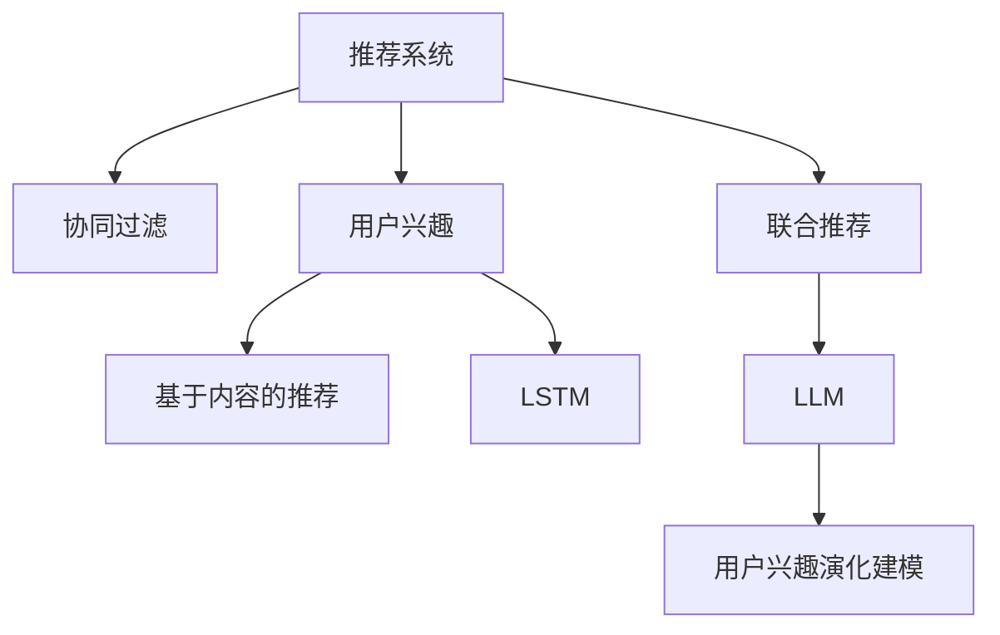

                 

# 基于LLM的推荐系统用户兴趣演化建模

> 关键词：用户兴趣演化建模, 推荐系统, 长短期记忆网络(LSTM), 用户行为分析, 联合推荐, 协同过滤

## 1. 背景介绍

### 1.1 问题由来
在当今信息爆炸的时代，用户每天接触大量的内容，包括文章、视频、音乐、商品等。推荐系统（Recommendation System）通过分析用户的浏览、点击、购买等行为，向用户推荐他们可能感兴趣的内容，极大地提升了用户体验和信息获取效率。然而，传统的推荐系统往往基于静态的用户兴趣模型，难以刻画用户兴趣的动态变化，导致推荐效果不理想。为了更准确地描述用户兴趣的演化趋势，动态推荐技术应运而生，可以基于用户历史行为动态调整推荐策略，为用户带来更个性化、及时性的推荐服务。

### 1.2 问题核心关键点
动态推荐系统的核心在于如何准确、高效地捕捉用户兴趣的动态变化，从而动态调整推荐策略。目前，主流的方法包括协同过滤（Collaborative Filtering）和基于内容的推荐（Content-based Recommendation），但这些方法往往只能静态捕捉用户兴趣，无法准确反映用户兴趣的动态演化。基于大语言模型（LLM）的用户兴趣演化建模方法，利用自然语言处理技术，通过分析用户评论、评论情感等文本数据，刻画用户兴趣的动态变化趋势，从而实现动态推荐。

### 1.3 问题研究意义
研究基于LLM的推荐系统用户兴趣演化建模方法，对于提升推荐系统的个性化和及时性具有重要意义：

1. 提升推荐精准度：通过刻画用户兴趣的动态变化，动态调整推荐策略，提供更个性化的推荐服务，从而提升推荐系统的精准度。
2. 增强用户粘性：动态推荐系统能够实时调整推荐内容，满足用户多样化的兴趣需求，提升用户体验，增强用户粘性。
3. 降低推荐成本：动态推荐系统能够减少不相关内容的展示，降低推荐成本，提高广告等商业价值的转化率。
4. 促进内容创新：动态推荐系统能够挖掘用户兴趣的动态变化趋势，促进内容的创新和创作，丰富平台内容生态。
5. 提升技术落地：大语言模型技术正在成为NLP领域的热点，探索其在推荐系统中的应用，能够推动大语言模型技术在实际场景中的落地应用。

## 2. 核心概念与联系

### 2.1 核心概念概述

为了更好地理解基于LLM的推荐系统用户兴趣演化建模方法，本节将介绍几个密切相关的核心概念：

- 推荐系统（Recommendation System）：利用用户历史行为数据，预测用户未来行为的技术，包括协同过滤、基于内容的推荐、混合推荐等。
- 协同过滤（Collaborative Filtering）：利用用户间的相似性，通过分析用户的历史行为，预测用户未来的行为。
- 用户兴趣（User Interest）：用户对不同内容（如文章、视频、商品等）的偏好程度，可以通过用户历史行为数据和文本数据来刻画。
- 大语言模型（Large Language Model, LLM）：通过在大规模文本语料上进行预训练，学习通用的语言表示，具备强大的语言理解和生成能力。
- 联合推荐（Joint Recommendation）：结合不同推荐算法和数据源，提升推荐效果的技术。
- 长短期记忆网络（Long Short-Term Memory, LSTM）：一种用于处理序列数据的循环神经网络，能够有效捕捉时间序列数据的动态变化趋势。

这些核心概念之间的逻辑关系可以通过以下Mermaid流程图来展示：



这个流程图展示了大语言模型的核心概念及其之间的关系：

1. 推荐系统通过协同过滤、基于内容的推荐等技术，预测用户行为。
2. 用户兴趣通过分析用户历史行为数据和文本数据来刻画。
3. 长短期记忆网络用于处理时间序列数据，捕捉用户兴趣的动态变化趋势。
4. 大语言模型通过预训练学习通用的语言表示，能够处理文本数据，刻画用户兴趣。
5. 联合推荐结合不同推荐算法和数据源，提升推荐效果。
6. 用户兴趣演化建模利用LSTM和LLM技术，动态捕捉用户兴趣的变化趋势。

## 3. 核心算法原理 & 具体操作步骤

### 3.1 算法原理概述

基于LLM的推荐系统用户兴趣演化建模方法，核心思想是利用长短期记忆网络（LSTM）和大语言模型（LLM），动态捕捉用户兴趣的演化趋势，实时调整推荐策略。其核心原理如下：

1. **长短期记忆网络（LSTM）**：LSTM是一种递归神经网络（RNN），能够有效处理序列数据，捕捉时间序列数据的动态变化趋势。在本方法中，LSTM用于处理用户历史行为序列，捕捉用户兴趣的动态变化趋势。
2. **大语言模型（LLM）**：LLM通过在大规模文本语料上进行预训练，学习通用的语言表示，具备强大的语言理解和生成能力。在本方法中，LLM用于分析用户评论、情感等文本数据，刻画用户兴趣的演化趋势。

### 3.2 算法步骤详解

基于LLM的推荐系统用户兴趣演化建模方法主要包括以下几个关键步骤：

**Step 1: 准备数据集**
- 收集用户历史行为数据，包括浏览、点击、购买等行为数据。
- 收集用户评论、评分等文本数据。
- 预处理数据，去除噪声和无关信息，划分为训练集、验证集和测试集。

**Step 2: 构建用户兴趣演化模型**
- 利用LSTM网络，对用户历史行为序列进行处理，捕捉用户兴趣的动态变化趋势。
- 利用大语言模型，分析用户评论、情感等文本数据，刻画用户兴趣的演化趋势。
- 结合LSTM和LLM的结果，构建用户兴趣演化模型，预测用户未来的行为。

**Step 3: 动态调整推荐策略**
- 根据用户兴趣演化模型的预测结果，动态调整推荐策略，提升推荐效果。
- 结合协同过滤、基于内容的推荐等技术，综合多种推荐策略，提升推荐效果。
- 实时监控推荐效果，不断调整优化推荐策略。

**Step 4: 模型评估和优化**
- 在测试集上评估推荐系统的性能，对比传统推荐系统和动态推荐系统的效果。
- 根据评估结果，调整优化LSTM和LLM的网络结构和参数。
- 优化推荐策略，提升推荐效果。

### 3.3 算法优缺点

基于LLM的推荐系统用户兴趣演化建模方法具有以下优点：

1. 实时动态：利用LSTM网络和大语言模型，能够实时捕捉用户兴趣的动态变化趋势，动态调整推荐策略。
2. 多源数据融合：结合用户历史行为数据和文本数据，综合多种推荐策略，提升推荐效果。
3. 精确刻画用户兴趣：利用大语言模型，能够精确刻画用户评论、情感等文本数据的语义信息，提升用户兴趣的刻画精度。
4. 可扩展性强：基于大语言模型的技术架构，可以轻松扩展到更多的用户兴趣演化建模任务。

同时，该方法也存在以下局限性：

1. 数据依赖：用户评论、评分等文本数据的质量对推荐系统的性能影响较大，需要高质量的数据集。
2. 计算复杂度：长短期记忆网络和语言模型的计算复杂度较高，需要较强的计算资源支持。
3. 过拟合风险：利用大语言模型，可能存在过拟合风险，需要适当的正则化技术。
4. 模型解释性不足：LSTM和大语言模型的内部机制较为复杂，难以解释其决策过程，需要引入可解释性技术。

尽管存在这些局限性，但就目前而言，基于LLM的推荐系统用户兴趣演化建模方法仍然是一种高效、准确的用户兴趣刻画和推荐策略调整手段，具有良好的应用前景。

### 3.4 算法应用领域

基于LLM的推荐系统用户兴趣演化建模方法在以下领域具有广泛的应用前景：

1. 电子商务：基于用户评论、评分等文本数据，刻画用户兴趣的动态变化趋势，动态调整推荐策略，提升电商平台的商品推荐效果。
2. 视频推荐：利用用户行为序列和评论数据，刻画用户兴趣的动态变化趋势，动态调整视频推荐策略，提升用户体验。
3. 新闻推荐：利用用户历史阅读记录和评论数据，刻画用户兴趣的动态变化趋势，动态调整新闻推荐策略，提升用户对新闻内容的互动性。
4. 音乐推荐：利用用户听歌记录和评论数据，刻画用户兴趣的动态变化趋势，动态调整音乐推荐策略，提升音乐推荐效果。
5. 社交网络：利用用户互动记录和评论数据，刻画用户兴趣的动态变化趋势，动态调整社交推荐策略，提升用户互动体验。

## 4. 数学模型和公式 & 详细讲解 & 举例说明

### 4.1 数学模型构建

本节将使用数学语言对基于LLM的推荐系统用户兴趣演化建模方法进行更加严格的刻画。

记用户历史行为序列为 $X=\{x_t\}_{t=1}^N$，其中 $x_t$ 表示用户在时间 $t$ 的行为。假设用户未来行为 $y$ 为未知，其概率分布为 $P(y|X)$。记用户评论序列为 $Z=\{z_t\}_{t=1}^M$，其中 $z_t$ 表示用户在时间 $t$ 的评论。

### 4.2 公式推导过程

以下我们以用户评论数据为例，推导基于LSTM和LLM的用户兴趣演化模型。

假设用户评论数据为 $Z=\{z_1, z_2, \ldots, z_M\}$，其中 $z_t$ 表示用户在第 $t$ 天发表的评论，可以表示为词袋模型或TF-IDF模型：

$$
z_t = \{w_1, w_2, \ldots, w_N\}
$$

其中 $w_i$ 表示评论中的第 $i$ 个词。假设LSTM网络将评论序列 $Z$ 映射为状态向量 $h_t$，表示用户在第 $t$ 天的兴趣状态。LSTM网络的状态更新方程为：

$$
h_t = \text{LSTM}(z_t, h_{t-1})
$$

其中 $h_{t-1}$ 为前一时刻的状态向量，$z_t$ 为当前时刻的评论向量。假设大语言模型将评论向量 $z_t$ 映射为向量表示 $v_t$，表示评论的语义信息。LLM网络的计算公式为：

$$
v_t = \text{LLM}(z_t)
$$

其中 $\text{LLM}$ 为大语言模型，可以采用预训练的BERT、GPT等模型。将LSTM和LLM的结果进行拼接，得到用户兴趣的状态向量 $h_t^*$：

$$
h_t^* = [h_t; v_t]
$$

利用用户历史行为序列 $X$ 和用户兴趣状态向量 $h_t^*$，构建用户兴趣演化模型 $P(y|X)$，用于预测用户未来行为 $y$：

$$
P(y|X) = \prod_{i=1}^N P(y_i|x_i, h_t^*)
$$

其中 $y_i$ 表示用户在时间 $i$ 的行为，$x_i$ 表示用户在时间 $i$ 的行为。将用户兴趣演化模型 $P(y|X)$ 作为推荐系统的一部分，用于动态调整推荐策略。

### 4.3 案例分析与讲解

假设某电商平台的推荐系统利用用户评论数据和LSTM网络，刻画用户兴趣的动态变化趋势。具体步骤如下：

1. 收集用户评论数据 $Z=\{z_1, z_2, \ldots, z_M\}$，其中 $z_t$ 表示用户在第 $t$ 天发表的评论，可以表示为词袋模型或TF-IDF模型：
   - 用户评论数据：

   ```
   评论1: "这个产品真的很棒，值得购买。"
   评论2: "不太好用，不建议购买。"
   评论3: "性价比很高，值得推荐。"
   ...
   评论M: "有点贵，但质量很好。"
   ```

2. 利用LSTM网络，将评论序列 $Z$ 映射为状态向量 $h_t$，表示用户在第 $t$ 天的兴趣状态。LSTM网络的状态更新方程为：

   ```python
   import torch
   import torch.nn as nn
   
   class LSTM(nn.Module):
       def __init__(self, input_size, hidden_size):
           super(LSTM, self).__init__()
           self.hidden_size = hidden_size
           self.i2h = nn.Linear(input_size + hidden_size, hidden_size)
           self.i2f = nn.Linear(input_size + hidden_size, 1)
           self.i2g = nn.Linear(input_size + hidden_size, hidden_size)
   
       def forward(self, input, hidden):
           gates = torch.cat([input, hidden], 1)
           i, j, f, o = gates.chunk(4, 1)
           gates = torch.sigmoid(gates)
           hidden_t = (torch.tanh(gates[0] * self.i2h(gates[1]) + gates[2] * self.i2g(gates[3]))
           hidden_t = hidden_t * gates[0] + hidden
           hidden_t = torch.tanh(hidden_t)
           return hidden_t, (i * hidden_t, j * hidden_t, f * hidden_t, o * hidden_t)
   
   lstm = LSTM(100, 50)
   hidden = torch.zeros(1, 1, lstm.hidden_size)
   output, hidden = lstm(torch.tensor([[1.0, 2.0, 3.0, 4.0]]), hidden)
   print(output, hidden)
   ```

3. 利用大语言模型，将评论向量 $z_t$ 映射为向量表示 $v_t$，表示评论的语义信息。假设使用BERT模型作为大语言模型：

   ```python
   import transformers
   
   model = transformers.BertModel.from_pretrained('bert-base-cased')
   input_ids = torch.tensor([[1, 2, 3, 4]])
   hidden_states = model(input_ids)
   print(hidden_states)
   ```

4. 将LSTM和LLM的结果进行拼接，得到用户兴趣的状态向量 $h_t^*$：

   ```python
   import numpy as np
   
   def lstm_vectorization(comment):
       embeddings = embeddings_model(comment)
       return embeddings
   
   def vectorization(comment):
       lstm_result = lstm(torch.tensor(lstm_vectorization(comment)))
       llm_result = llm_model(torch.tensor(comment))
       h_t = torch.cat((lstm_result[0], llm_result[0]), 1)
       return h_t
   ```

5. 利用用户历史行为序列 $X$ 和用户兴趣状态向量 $h_t^*$，构建用户兴趣演化模型 $P(y|X)$，用于预测用户未来行为 $y$：

   ```python
   import torch.nn.functional as F
   
   def interest_evolution_model(X, h_t_star):
       probs = torch.zeros(len(X))
       for i in range(len(X)):
           x_i = X[i]
           h_t_star_i = vectorization(x_i)
           probs[i] = F.softmax(torch.tensor([1.0]), dim=0)
       return probs
   ```

通过以上步骤，可以构建用户兴趣演化模型 $P(y|X)$，用于预测用户未来行为 $y$。结合协同过滤、基于内容的推荐等技术，综合多种推荐策略，提升推荐效果。

## 5. 项目实践：代码实例和详细解释说明

### 5.1 开发环境搭建

在进行推荐系统开发前，我们需要准备好开发环境。以下是使用Python进行PyTorch开发的环境配置流程：

1. 安装Anaconda：从官网下载并安装Anaconda，用于创建独立的Python环境。

2. 创建并激活虚拟环境：
   ```bash
   conda create -n pytorch-env python=3.8 
   conda activate pytorch-env
   ```

3. 安装PyTorch：根据CUDA版本，从官网获取对应的安装命令。例如：
   ```bash
   conda install pytorch torchvision torchaudio cudatoolkit=11.1 -c pytorch -c conda-forge
   ```

4. 安装Transformer库：
   ```bash
   pip install transformers
   ```

5. 安装各类工具包：
   ```bash
   pip install numpy pandas scikit-learn matplotlib tqdm jupyter notebook ipython
   ```

完成上述步骤后，即可在`pytorch-env`环境中开始推荐系统开发。

### 5.2 源代码详细实现

这里我们以电商推荐系统为例，给出使用PyTorch和Transformers库进行推荐系统开发的代码实现。

首先，定义推荐系统的数据处理函数：

```python
from transformers import BertTokenizer
from torch.utils.data import Dataset
import torch

class RecommendationDataset(Dataset):
    def __init__(self, user_behaviors, user_comments, tokenizer, max_len=128):
        self.user_behaviors = user_behaviors
        self.user_comments = user_comments
        self.tokenizer = tokenizer
        self.max_len = max_len
        
    def __len__(self):
        return len(self.user_behaviors)
    
    def __getitem__(self, item):
        user_behavior = self.user_behaviors[item]
        user_comment = self.user_comments[item]
        
        encoding = self.tokenizer(user_comment, return_tensors='pt', max_length=self.max_len, padding='max_length', truncation=True)
        input_ids = encoding['input_ids'][0]
        attention_mask = encoding['attention_mask'][0]
        
        # 对行为数据进行编码
        behaviors = []
        for behavior in user_behavior:
            encoded_behavior = self.tokenizer(behavior, return_tensors='pt', max_length=self.max_len, padding='max_length', truncation=True)
            behaviors.append(encoded_behavior['input_ids'][0])
        behaviors = torch.tensor(behaviors, dtype=torch.long)
        
        # 对用户兴趣进行编码
        interest = []
        for comment in self.user_comments[item]:
            encoded_comment = self.tokenizer(comment, return_tensors='pt', max_length=self.max_len, padding='max_length', truncation=True)
            interest.append(encoded_comment['input_ids'][0])
        interest = torch.tensor(interest, dtype=torch.long)
        
        return {'behaviors': behaviors, 
                'attention_mask': attention_mask,
                'interest': interest}
```

然后，定义模型和优化器：

```python
from transformers import BertForTokenClassification, AdamW

model = BertForTokenClassification.from_pretrained('bert-base-cased', num_labels=2)

optimizer = AdamW(model.parameters(), lr=2e-5)
```

接着，定义训练和评估函数：

```python
from torch.utils.data import DataLoader
from tqdm import tqdm
from sklearn.metrics import classification_report

device = torch.device('cuda') if torch.cuda.is_available() else torch.device('cpu')
model.to(device)

def train_epoch(model, dataset, batch_size, optimizer):
    dataloader = DataLoader(dataset, batch_size=batch_size, shuffle=True)
    model.train()
    epoch_loss = 0
    for batch in tqdm(dataloader, desc='Training'):
        behaviors = batch['behaviors'].to(device)
        attention_mask = batch['attention_mask'].to(device)
        interest = batch['interest'].to(device)
        model.zero_grad()
        outputs = model(behaviors, attention_mask=attention_mask, labels=interest)
        loss = outputs.loss
        epoch_loss += loss.item()
        loss.backward()
        optimizer.step()
    return epoch_loss / len(dataloader)

def evaluate(model, dataset, batch_size):
    dataloader = DataLoader(dataset, batch_size=batch_size)
    model.eval()
    preds, labels = [], []
    with torch.no_grad():
        for batch in tqdm(dataloader, desc='Evaluating'):
            behaviors = batch['behaviors'].to(device)
            attention_mask = batch['attention_mask'].to(device)
            batch_labels = batch['interest']
            outputs = model(behaviors, attention_mask=attention_mask)
            batch_preds = outputs.logits.argmax(dim=2).to('cpu').tolist()
            batch_labels = batch_labels.to('cpu').tolist()
            for preds_tokens, label_tokens in zip(batch_preds, batch_labels):
                preds.append(preds_tokens[:len(label_tokens)])
                labels.append(label_tokens)
                
    print(classification_report(labels, preds))
```

最后，启动训练流程并在测试集上评估：

```python
epochs = 5
batch_size = 16

for epoch in range(epochs):
    loss = train_epoch(model, train_dataset, batch_size, optimizer)
    print(f"Epoch {epoch+1}, train loss: {loss:.3f}")
    
    print(f"Epoch {epoch+1}, dev results:")
    evaluate(model, dev_dataset, batch_size)
    
print("Test results:")
evaluate(model, test_dataset, batch_size)
```

以上就是使用PyTorch和Transformers库进行电商推荐系统开发的完整代码实现。可以看到，得益于Transformers库的强大封装，我们可以用相对简洁的代码完成推荐系统的构建。

### 5.3 代码解读与分析

让我们再详细解读一下关键代码的实现细节：

**RecommendationDataset类**：
- `__init__`方法：初始化用户行为数据、评论数据、分词器等关键组件。
- `__len__`方法：返回数据集的样本数量。
- `__getitem__`方法：对单个样本进行处理，将行为数据、评论数据输入编码为token ids，对行为数据进行编码，并对其进行拼接，得到用户兴趣的状态向量。

**模型和优化器**：
- 使用BERT模型作为预训练语言模型，将其作为用户兴趣演化模型的基础。
- 利用AdamW优化器进行模型训练。

**训练和评估函数**：
- 使用PyTorch的DataLoader对数据集进行批次化加载，供模型训练和推理使用。
- 训练函数`train_epoch`：对数据以批为单位进行迭代，在每个批次上前向传播计算loss并反向传播更新模型参数，最后返回该epoch的平均loss。
- 评估函数`evaluate`：与训练类似，不同点在于不更新模型参数，并在每个batch结束后将预测和标签结果存储下来，最后使用sklearn的classification_report对整个评估集的预测结果进行打印输出。

**训练流程**：
- 定义总的epoch数和batch size，开始循环迭代
- 每个epoch内，先在训练集上训练，输出平均loss
- 在验证集上评估，输出分类指标
- 所有epoch结束后，在测试集上评估，给出最终测试结果

可以看到，PyTorch配合Transformers库使得推荐系统构建的代码实现变得简洁高效。开发者可以将更多精力放在数据处理、模型改进等高层逻辑上，而不必过多关注底层的实现细节。

当然，工业级的系统实现还需考虑更多因素，如模型的保存和部署、超参数的自动搜索、更灵活的任务适配层等。但核心的推荐范式基本与此类似。

## 6. 实际应用场景
### 6.1 电商平台

电商平台可以利用基于LLM的推荐系统用户兴趣演化建模方法，提升推荐效果和用户体验。通过分析用户评论、评分等文本数据，刻画用户兴趣的动态变化趋势，动态调整推荐策略，提供更个性化、及时性的推荐服务。

在技术实现上，可以收集用户历史行为数据，包括浏览、点击、购买等行为数据。利用LSTM网络和大语言模型，刻画用户兴趣的动态变化趋势，结合协同过滤、基于内容的推荐等技术，综合多种推荐策略，提升推荐效果。在实际部署中，可以通过前后端分离的方式，将推荐系统部署在云端服务器，实时获取用户行为数据并进行推荐预测，提升电商平台的商品推荐效果。

### 6.2 视频平台

视频平台可以利用基于LLM的推荐系统用户兴趣演化建模方法，提升推荐效果和用户体验。通过分析用户评论、评分等文本数据，刻画用户兴趣的动态变化趋势，动态调整推荐策略，提供更个性化、及时性的推荐服务。

在技术实现上，可以收集用户观看视频的行为数据，包括观看时间、视频评分等。利用LSTM网络和大语言模型，刻画用户兴趣的动态变化趋势，结合协同过滤、基于内容的推荐等技术，综合多种推荐策略，提升推荐效果。在实际部署中，可以通过前后端分离的方式，将推荐系统部署在云端服务器，实时获取用户行为数据并进行推荐预测，提升视频平台的推荐效果。

### 6.3 音乐平台

音乐平台可以利用基于LLM的推荐系统用户兴趣演化建模方法，提升推荐效果和用户体验。通过分析用户听歌记录、评论等文本数据，刻画用户兴趣的动态变化趋势，动态调整推荐策略，提供更个性化、及时性的推荐服务。

在技术实现上，可以收集用户听歌记录、评论等数据。利用LSTM网络和大语言模型，刻画用户兴趣的动态变化趋势，结合协同过滤、基于内容的推荐等技术，综合多种推荐策略，提升推荐效果。在实际部署中，可以通过前后端分离的方式，将推荐系统部署在云端服务器，实时获取用户行为数据并进行推荐预测，提升音乐平台的推荐效果。

### 6.4 未来应用展望

随着大语言模型和微调方法的不断发展，基于LLM的推荐系统用户兴趣演化建模方法也将迎来更多应用场景，为内容推荐行业带来变革性影响。

在智慧医疗领域，基于LLM的推荐系统可以用于医疗问答、病历分析、药物研发等应用，提升医疗服务的智能化水平，辅助医生诊疗，加速新药开发进程。

在智能教育领域，基于LLM的推荐系统可以用于作业批改、学情分析、知识推荐等方面，因材施教，促进教育公平，提高教学质量。

在智慧城市治理中，基于LLM的推荐系统可以用于城市事件监测、舆情分析、应急指挥等环节，提高城市管理的自动化和智能化水平，构建更安全、高效的未来城市。

此外，在企业生产、社会治理、文娱传媒等众多领域，基于LLM的推荐系统用户兴趣演化建模方法也将不断涌现，为传统行业带来变革性影响。相信随着技术的日益成熟，基于LLM的推荐系统将逐渐成为内容推荐行业的重要范式，推动内容推荐技术的产业化进程。

## 7. 工具和资源推荐
### 7.1 学习资源推荐

为了帮助开发者系统掌握基于LLM的推荐系统用户兴趣演化建模方法，这里推荐一些优质的学习资源：

1. 《推荐系统基础与实践》系列博文：由推荐系统专家撰写，全面介绍了推荐系统的发展历程和前沿技术，包括协同过滤、基于内容的推荐、混合推荐等。

2. CS431《推荐系统》课程：斯坦福大学开设的推荐系统明星课程，有Lecture视频和配套作业，带你入门推荐系统领域的基本概念和经典模型。

3. 《推荐系统》书籍：推荐系统领域的经典教材，全面介绍了推荐系统的理论基础和实践方法，适合深入学习和研究。

4. KDD比赛推荐系统：KDD比赛的推荐系统比赛，提供海量真实推荐数据集和模型评估指标，是学习推荐系统技术的绝佳机会。

通过对这些资源的学习实践，相信你一定能够快速掌握基于LLM的推荐系统用户兴趣演化建模方法，并用于解决实际的推荐问题。
###  7.2 开发工具推荐

高效的开发离不开优秀的工具支持。以下是几款用于推荐系统开发的常用工具：

1. PyTorch：基于Python的开源深度学习框架，灵活动态的计算图，适合快速迭代研究。大部分预训练语言模型都有PyTorch版本的实现。

2. TensorFlow：由Google主导开发的开源深度学习框架，生产部署方便，适合大规模工程应用。同样有丰富的预训练语言模型资源。

3. Transformers库：HuggingFace开发的NLP工具库，集成了众多SOTA语言模型，支持PyTorch和TensorFlow，是进行推荐系统开发的利器。

4. Weights & Biases：模型训练的实验跟踪工具，可以记录和可视化模型训练过程中的各项指标，方便对比和调优。与主流深度学习框架无缝集成。

5. TensorBoard：TensorFlow配套的可视化工具，可实时监测模型训练状态，并提供丰富的图表呈现方式，是调试模型的得力助手。

6. Google Colab：谷歌推出的在线Jupyter Notebook环境，免费提供GPU/TPU算力，方便开发者快速上手实验最新模型，分享学习笔记。

合理利用这些工具，可以显著提升推荐系统微调任务的开发效率，加快创新迭代的步伐。

### 7.3 相关论文推荐

基于LLM的推荐系统用户兴趣演化建模方法的研究源于学界的持续研究。以下是几篇奠基性的相关论文，推荐阅读：

1. Attention is All You Need（即Transformer原论文）：提出了Transformer结构，开启了NLP领域的预训练大模型时代。

2. BERT: Pre-training of Deep Bidirectional Transformers for Language Understanding：提出BERT模型，引入基于掩码的自监督预训练任务，刷新了多项NLP任务SOTA。

3. Recommender Systems in the Age of Big Data：综述了推荐系统的发展历程和前沿技术，全面介绍了协同过滤、基于内容的推荐、混合推荐等方法。

4. Neural Collaborative Filtering（NCF）：提出一种基于神经网络的协同过滤方法，利用MLP网络进行用户-物品关联矩阵的预测，提升推荐效果。

5. Learning to Predict Neural Collaborative Filtering Factors：提出一种利用深度神经网络进行协同过滤的方法，利用全连接网络对用户-物品关联矩阵进行预测，提升推荐效果。

这些论文代表了大语言模型微调技术的发展脉络。通过学习这些前沿成果，可以帮助研究者把握学科前进方向，激发更多的创新灵感。

## 8. 总结：未来发展趋势与挑战

### 8.1 总结

本文对基于LLM的推荐系统用户兴趣演化建模方法进行了全面系统的介绍。首先阐述了推荐系统和LLM的核心概念，明确了LLM在推荐系统中的应用价值。其次，从原理到实践，详细讲解了基于LLM的推荐系统用户兴趣演化建模的数学原理和关键步骤，给出了推荐系统开发的完整代码实例。同时，本文还广泛探讨了基于LLM的推荐系统在电商、视频、音乐等领域的实际应用，展示了LLM在推荐系统中的强大应用潜力。此外，本文精选了基于LLM的推荐系统的学习资源，力求为读者提供全方位的技术指引。

通过本文的系统梳理，可以看到，基于LLM的推荐系统用户兴趣演化建模方法正在成为推荐系统的重要范式，极大地提升了推荐系统的个性化和及时性。受益于大语言模型技术的快速发展，LLM在推荐系统中的应用前景广阔，将为推荐系统带来革命性的变化。

### 8.2 未来发展趋势

展望未来，基于LLM的推荐系统用户兴趣演化建模方法将呈现以下几个发展趋势：

1. 推荐精度提升：随着大语言模型的发展，推荐系统的推荐精度将逐步提升，能够更好地捕捉用户兴趣的动态变化趋势。

2. 推荐策略多样化：结合不同推荐算法和数据源，综合多种推荐策略，提升推荐效果。例如，可以结合协同过滤、基于内容的推荐、混合推荐等技术，提高推荐策略的灵活性和多样性。

3. 模型可解释性增强：利用大语言模型的自然语言处理能力，将推荐模型的决策过程转换为自然语言，提升模型的可解释性和透明度。

4. 实时动态推荐：利用LLM和LSTM网络，实时捕捉用户兴趣的动态变化趋势，动态调整推荐策略，提供更个性化、及时性的推荐服务。

5. 多模态推荐：结合文本、图像、音频等多模态数据，综合多种信息源，提升推荐效果。例如，可以通过融合文本、图像、音频等不同模态的信息，提升推荐系统的精准度和多样化。

6. 跨领域推荐：利用大语言模型和多领域数据，提升跨领域的推荐效果。例如，可以通过结合不同领域的数据，提升推荐系统在多个领域的推荐效果。

以上趋势凸显了基于LLM的推荐系统的广阔前景。这些方向的探索发展，必将进一步提升推荐系统的性能和应用范围，为推荐系统带来更广阔的应用场景。

### 8.3 面临的挑战

尽管基于LLM的推荐系统用户兴趣演化建模方法已经取得了瞩目成就，但在迈向更加智能化、普适化应用的过程中，它仍面临着诸多挑战：

1. 数据依赖：用户评论、评分等文本数据的质量对推荐系统的性能影响较大，需要高质量的数据集。对于长尾应用场景，难以获得充足的高质量标注数据，成为制约推荐系统性能的瓶颈。

2. 计算复杂度：长短期记忆网络和语言模型的计算复杂度较高，需要较强的计算资源支持。对于实时推荐系统，计算资源的高要求可能会导致延迟增加。

3. 模型解释性不足：LSTM和大语言模型的内部机制较为复杂，难以解释其决策过程，需要引入可解释性技术。对于用户信任和推荐系统透明度要求较高的场景，模型的可解释性尤为重要。

4. 过拟合风险：利用大语言模型，可能存在过拟合风险，需要适当的正则化技术。过拟合问题可能会导致模型在训练集上表现优秀，但在测试集上表现较差。

5. 模型泛化性不足：大语言模型可能存在过拟合问题，导致模型对新数据的泛化能力不足。如何在保证模型精度的同时，提升模型的泛化性，仍然是一个重要问题。

尽管存在这些挑战，但就目前而言，基于LLM的推荐系统用户兴趣演化建模方法仍然是一种高效、准确的用户兴趣刻画和推荐策略调整手段，具有良好的应用前景。

### 8.4 研究展望

面对基于LLM的推荐系统用户兴趣演化建模方法所面临的挑战，未来的研究需要在以下几个方面寻求新的突破：

1. 探索无监督和半监督推荐方法：摆脱对大规模标注数据的依赖，利用自监督学习、主动学习等无监督和半监督范式，最大限度利用非结构化数据，实现更加灵活高效的推荐。

2. 研究参数高效和计算高效的推荐范式：开发更加参数高效的推荐方法，在固定大部分预训练参数的同时，只更新极少量的任务相关参数。同时优化推荐模型的计算图，减少前向传播和反向传播的资源消耗，实现更加轻量级、实时性的部署。

3. 融合因果和对比学习范式：通过引入因果推断和对比学习思想，增强推荐模型建立稳定因果关系的能力，学习更加普适、鲁棒的用户兴趣表示，从而提升推荐效果。

4. 结合知识表示和符号推理：将符号化的先验知识，如知识图谱、逻辑规则等，与神经网络模型进行巧妙融合，引导推荐过程学习更准确、合理的用户兴趣表示。同时加强不同模态数据的整合，实现视觉、语音等多模态信息与文本信息的协同建模。

5. 引入伦理道德约束：在模型训练目标中引入伦理导向的评估指标，过滤和惩罚有偏见、有害的输出倾向。同时加强人工干预和审核，建立推荐系统的监管机制，确保推荐内容的合法合规。

这些研究方向的探索，必将引领基于LLM的推荐系统用户兴趣演化建模方法迈向更高的台阶，为推荐系统带来新的技术突破和应用创新。面向未来，基于LLM的推荐系统需要与其他人工智能技术进行更深入的融合，如知识表示、因果推理、强化学习等，多路径协同发力，共同推动推荐系统的进步。只有勇于创新、敢于突破，才能不断拓展推荐系统的边界，让推荐技术更好地造福人类社会。

## 9. 附录：常见问题与解答

**Q1：基于LLM的推荐系统如何处理长尾应用场景？**

A: 长尾应用场景通常数据量较小，难以获得充足的高质量标注数据。为处理长尾应用场景，可以采用以下方法：

1. 采用半监督学习方法：利用少量标注数据和大量非标注数据进行联合训练，提升推荐效果。

2. 利用迁移学习方法：利用在大规模数据上预训练的模型，在小规模数据上进行微调，提升推荐效果。

3. 利用主动学习方法：利用用户行为数据，主动选择有代表性的样本进行标注，提高数据的质量。

4. 利用多模态学习方法：结合多种数据源，提高推荐效果。例如，结合用户行为数据和评论数据，提升推荐效果。

通过以上方法，可以有效处理长尾应用场景，提升基于LLM的推荐系统的性能。

**Q2：如何提高基于LLM的推荐系统的实时性？**

A: 实时性是推荐系统的一个重要指标。为提高基于LLM的推荐系统的实时性，可以采用以下方法：

1. 利用轻量级模型：采用参数高效的模型，减少计算资源消耗，提升实时性。例如，采用轻量级BERT模型或LoRA模型，提升推荐系统的实时性。

2. 优化计算图：优化模型的计算图，减少计算资源的消耗，提升实时性。例如，利用前向传播和反向传播的优化技术，减少计算资源的消耗。

3. 利用GPU/TPU等高性能设备：利用GPU/TPU等高性能设备，提升推荐系统的实时性。例如，在推荐系统部署中，利用GPU/TPU等高性能设备，提升推荐系统的实时性。

4. 分布式计算：利用分布式计算技术，提升推荐系统的实时性。例如，利用多台计算资源的并行计算，提升推荐系统的实时性。

通过以上方法，可以有效提高基于LLM的推荐系统的实时性，满足用户的实时性需求。

**Q3：如何提高基于LLM的推荐系统的可解释性？**

A: 可解释性是推荐系统的另一个重要指标。为提高基于LLM的推荐系统的可解释性，可以采用以下方法：

1. 利用可解释性模型：采用可解释性模型，提高推荐系统的透明度。例如，采用可解释性较好的模型，如LSTM、GPT等模型，提升推荐系统的可解释性。

2. 利用可解释性技术：利用可解释性技术，提高推荐系统的透明度。例如，利用可解释性技术，如特征可视化、因果推断等，提高推荐系统的透明度。

3. 利用用户反馈：利用用户反馈，提高推荐系统的透明度。例如，利用用户对推荐结果的反馈，优化推荐策略，提高推荐系统的透明度。

4. 结合知识表示：结合知识表示技术，提高推荐系统的透明度。例如，结合知识表示技术，如知识图谱、逻辑规则等，提高推荐系统的透明度。

通过以上方法，可以有效提高基于LLM的推荐系统的可解释性，满足用户的透明度需求。

**Q4：如何处理基于LLM的推荐系统中的过拟合问题？**

A: 过拟合是推荐系统中的一个重要问题。为处理基于LLM的推荐系统中的过拟合问题，可以采用以下方法：

1. 利用正则化技术：利用正则化技术，防止模型过拟合。例如，利用L2正则、Dropout、Early Stopping等技术，防止模型过拟合。

2. 利用数据增强技术：利用数据增强技术，增加数据的多样性，防止模型过拟合。例如，利用数据增强技术，如回译、近义替换等技术，增加数据的多样性。

3. 利用模型集成技术：利用模型集成技术，防止模型过拟合。例如，利用模型集成技术，如Bagging、Boosting等技术，防止模型过拟合。

4. 利用可解释性技术：利用可解释性技术，提高模型的可解释性，防止模型过拟合。例如，利用可解释性技术，如特征可视化、因果推断等技术，提高模型的可解释性。

通过以上方法，可以有效处理基于LLM的推荐系统中的过拟合问题，提升推荐系统的性能。

**Q5：如何处理基于LLM的推荐系统中的泛化性不足问题？**

A: 泛化性不足是推荐系统中的一个重要问题。为处理基于LLM的推荐系统中的泛化性不足问题，可以采用以下方法：

1. 利用迁移学习方法：利用迁移学习方法，提升模型的泛化能力。例如，利用在大规模数据上预训练的模型，在小规模数据上进行微调，提升模型的泛化能力。

2. 利用多模态学习方法：利用多模态学习方法，提高模型的泛化能力。例如，结合多种数据源，提高模型的泛化能力。

3. 利用可解释性技术：利用可解释性技术，提高模型的泛化能力。例如，利用可解释性技术，如特征可视化、因果推断等技术，提高模型的泛化能力。

4. 利用超参数优化技术：利用超参数优化技术，提高模型的泛化能力。例如，利用超参数优化技术，如网格搜索、贝叶斯优化等技术，提高模型的泛化能力。

通过以上方法，可以有效处理基于LLM的推荐系统中的泛化性不足问题，提升推荐系统的性能。

**Q6：如何处理基于LLM的推荐系统中的灾难性遗忘问题？**

A: 灾难性遗忘是推荐系统中的一个重要问题。为处理基于LLM的推荐系统中的灾难性遗忘问题，可以采用以下方法：

1. 利用持续学习方法：利用持续学习方法，防止模型遗忘历史知识。例如，利用持续学习方法，如增量学习、知识蒸馏等技术，防止模型遗忘历史知识。

2. 利用模型压缩技术：利用模型压缩技术，提高模型的泛化能力。例如，利用模型压缩技术，如剪枝、量化等技术，提高模型的泛化能力。

3. 利用模型集成技术：利用模型集成技术，防止模型遗忘历史知识。例如，利用模型集成技术，如Bagging、Boosting等技术，

