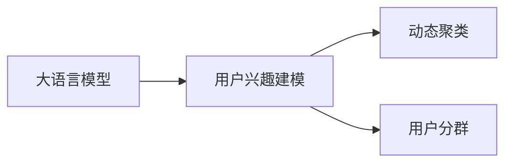

                 

# 基于LLM的用户兴趣动态聚类与分群

## 1. 背景介绍

随着互联网的普及和信息技术的发展，个性化推荐系统成为了电子商务、社交媒体、内容平台等互联网应用的重要组成部分。用户兴趣模型是推荐系统核心要素之一，用于描述用户对不同商品、内容等的偏好，直接决定了推荐结果的相关性和准确性。而现有的基于协同过滤、用户行为建模等推荐算法，常常需要耗费大量资源和时间来训练模型，并难以动态适应用户兴趣的变化。

近年来，基于深度学习的用户兴趣建模技术逐渐成为研究热点。深度学习模型，尤其是大语言模型（Large Language Model, LLM），以其卓越的泛化能力和动态学习能力，在用户兴趣建模领域展现出巨大潜力。利用大语言模型，可以直接从用户的文本数据中学习用户的兴趣表达，构建动态的用户兴趣模型。

本文旨在探讨利用大语言模型（如BERT、GPT-3等）对用户文本数据进行处理，实现用户兴趣的动态聚类与分群。通过分析用户兴趣的多维度特征，挖掘其动态变化规律，提升个性化推荐系统的性能。

## 2. 核心概念与联系

### 2.1 核心概念概述

为深入理解本课题，我们首先介绍几个核心概念及其相互联系：

- **大语言模型（LLM）**：如BERT、GPT-3等，基于Transformer结构，可以处理自然语言文本，并从大量文本数据中学习语言的通用表示。
- **用户兴趣建模**：描述用户对不同物品、内容的偏好，用于推荐系统的推荐决策。
- **动态聚类**：通过将用户数据划分为多个群体，实现用户兴趣的动态划分，提升推荐系统的准确性和鲁棒性。
- **用户分群**：基于用户行为和特征，将用户划分为不同群体，提升推荐系统的个性化推荐能力。

这些概念之间存在着紧密的联系。大语言模型通过从用户文本数据中学习用户兴趣，实现用户兴趣建模。而用户兴趣建模又是动态聚类和分群的基础，通过动态聚类可以识别用户兴趣的动态变化，分群则能够实现更精细的个性化推荐。

### 2.2 核心概念原理和架构的 Mermaid 流程图



该流程图展示了从大语言模型到用户兴趣建模、动态聚类、用户分群的全流程。其中，大语言模型通过处理用户文本数据，学习用户兴趣表达，再经过动态聚类和用户分群，生成个性化的推荐策略。

## 3. 核心算法原理 & 具体操作步骤

### 3.1 算法原理概述

基于大语言模型的用户兴趣动态聚类与分群，旨在通过处理用户文本数据，构建动态的用户兴趣模型。其核心算法包括以下几个步骤：

1. **文本预处理**：将用户评论、搜索历史等文本数据进行处理，提取特征向量。
2. **用户兴趣建模**：利用大语言模型对特征向量进行处理，得到用户兴趣表示。
3. **动态聚类**：通过K-means、层次聚类等算法，将用户兴趣表示进行动态聚类。
4. **用户分群**：基于动态聚类结果，对用户进行分群，生成用户分群特征。
5. **推荐策略生成**：根据用户分群特征，生成个性化推荐策略。

### 3.2 算法步骤详解

**Step 1: 文本预处理**

文本预处理是用户兴趣建模的基础。其目的是将原始文本数据转换为机器学习模型可以处理的形式。具体步骤如下：

- **分词**：将文本分割成单词或词组。
- **去除停用词**：去除常见无意义词汇。
- **词干提取**：将单词还原为基本形式。
- **向量化**：将文本转换为向量形式，可以使用TF-IDF、Word2Vec、BERT等方法。

**Step 2: 用户兴趣建模**

用户兴趣建模是通过大语言模型学习用户文本数据中的兴趣表示。具体步骤如下：

- **选择模型**：选择预训练的大语言模型，如BERT、GPT-3等。
- **特征提取**：利用大语言模型对文本向量进行特征提取，得到用户兴趣表示。
- **兴趣编码**：将用户兴趣表示编码为高维向量，便于后续的聚类和分群处理。

**Step 3: 动态聚类**

动态聚类是通过对用户兴趣表示进行聚类，识别用户兴趣的动态变化。具体步骤如下：

- **选择聚类算法**：选择K-means、层次聚类等聚类算法。
- **设定聚类数**：根据实际情况设定聚类数。
- **聚类计算**：对用户兴趣表示进行聚类计算，得到聚类结果。

**Step 4: 用户分群**

用户分群是通过对用户进行聚类划分，生成更精细的用户分群特征。具体步骤如下：

- **分配用户到聚类**：将用户兴趣表示分配到各个聚类中。
- **计算聚类中心**：计算每个聚类的中心向量。
- **生成分群特征**：将用户分群特征编码为用户向量，用于个性化推荐。

**Step 5: 推荐策略生成**

推荐策略生成是通过对用户分群特征进行处理，生成个性化推荐策略。具体步骤如下：

- **选择推荐模型**：选择适合个性化推荐任务的模型，如协同过滤、基于内容的推荐等。
- **构建推荐矩阵**：根据用户分群特征，构建推荐矩阵。
- **生成推荐结果**：通过推荐模型，生成个性化推荐结果。

### 3.3 算法优缺点

基于大语言模型的用户兴趣动态聚类与分群算法，具有以下优点：

- **高效性**：利用大语言模型的预训练能力，快速处理文本数据，实现用户兴趣建模。
- **动态性**：能够动态地识别用户兴趣变化，及时更新聚类结果。
- **高鲁棒性**：通过聚类和分群，能够抵御异常数据和噪声，提升推荐系统的鲁棒性。
- **可解释性**：用户兴趣模型基于文本数据构建，能够提供有意义的解释。

同时，该算法也存在一些缺点：

- **数据需求高**：需要大量用户文本数据进行预训练和聚类。
- **模型复杂**：需要多个步骤进行处理，包括文本预处理、用户兴趣建模、聚类、分群等。
- **参数多**：模型中的参数较多，需要进行调参优化。
- **计算量大**：在动态聚类和用户分群过程中，计算量较大。

### 3.4 算法应用领域

基于大语言模型的用户兴趣动态聚类与分群算法，具有广泛的应用场景：

- **电子商务**：如淘宝、京东等电商平台，通过分析用户评论和搜索历史，进行个性化商品推荐。
- **社交媒体**：如微博、抖音等社交平台，通过分析用户发布的内容，进行个性化内容推荐。
- **内容平台**：如Netflix、YouTube等，通过分析用户观影、观看历史，进行个性化视频推荐。
- **旅游推荐**：通过分析用户评价和搜索行为，进行个性化旅游路线推荐。
- **智能客服**：通过分析用户聊天记录，进行个性化问题解答。

## 4. 数学模型和公式 & 详细讲解

### 4.1 数学模型构建

设用户 $u$ 的评论文本为 $X_u$，文本向量表示为 $x_u \in \mathbb{R}^d$，其中 $d$ 为向量维度。利用BERT模型，将 $x_u$ 映射为用户兴趣表示 $h_u \in \mathbb{R}^h$，其中 $h$ 为向量维度。设用户兴趣聚类数为 $K$，聚类中心为 $\mu_k$，聚类结果为 $\sigma_u$。最终生成的用户分群特征为 $v_u \in \mathbb{R}^m$，其中 $m$ 为向量维度。

**用户兴趣建模**：

$$
h_u = \text{BERT}(x_u)
$$

**动态聚类**：

$$
\sigma_u = \text{K-means}(h_u, K)
$$

**用户分群**：

$$
v_u = f(\sigma_u)
$$

其中 $f$ 为编码函数，用于将聚类结果转换为用户分群特征。

### 4.2 公式推导过程

**用户兴趣建模**：

$$
h_u = \text{BERT}(x_u) = \sum_{i=1}^d w_i \cdot \text{Embed}(X_u)[i]
$$

其中 $\text{Embed}$ 为BERT的嵌入层，$w_i$ 为权重。

**动态聚类**：

$$
\sigma_u = \text{K-means}(h_u, K) = \arg\min_{k=1,...,K} \|h_u - \mu_k\|
$$

其中 $\mu_k$ 为聚类中心，$K$ 为聚类数。

**用户分群**：

$$
v_u = f(\sigma_u) = \text{Encoder}(\sigma_u)
$$

其中 $\text{Encoder}$ 为编码器，将聚类结果转换为用户分群特征。

### 4.3 案例分析与讲解

以某电商平台为例，分析用户评论数据：

- **文本预处理**：将评论数据进行分词、去除停用词、词干提取等处理，得到文本向量 $x_u$。
- **用户兴趣建模**：利用BERT模型对 $x_u$ 进行处理，得到用户兴趣表示 $h_u$。
- **动态聚类**：对 $h_u$ 进行K-means聚类，得到聚类结果 $\sigma_u$。
- **用户分群**：对 $\sigma_u$ 进行编码，生成用户分群特征 $v_u$。
- **推荐策略生成**：根据 $v_u$，生成个性化推荐结果。

## 5. 项目实践：代码实例和详细解释说明

### 5.1 开发环境搭建

在进行代码实践前，需要先搭建开发环境。以下是使用Python进行TensorFlow开发的环境配置流程：

1. 安装Anaconda：从官网下载并安装Anaconda，用于创建独立的Python环境。

2. 创建并激活虚拟环境：
```bash
conda create -n tf-env python=3.8 
conda activate tf-env
```

3. 安装TensorFlow：根据CUDA版本，从官网获取对应的安装命令。例如：
```bash
conda install tensorflow -c conda-forge -c pytorch
```

4. 安装所需库：
```bash
pip install numpy pandas scikit-learn tensorflow
```

5. 安装BERT库：
```bash
pip install transformers
```

6. 安装其他工具包：
```bash
pip install matplotlib seaborn
```

完成上述步骤后，即可在`tf-env`环境中开始代码实践。

### 5.2 源代码详细实现

以下是利用TensorFlow和Transformers库进行用户兴趣动态聚类与分群的Python代码实现：

```python
import tensorflow as tf
from transformers import BertTokenizer, TFBertModel
import numpy as np
import pandas as pd
from sklearn.cluster import KMeans
from sklearn.preprocessing import LabelEncoder

# 加载预训练模型
tokenizer = BertTokenizer.from_pretrained('bert-base-uncased')
model = TFBertModel.from_pretrained('bert-base-uncased')

# 加载用户评论数据
data = pd.read_csv('user_reviews.csv')

# 文本预处理
def preprocess(text):
    tokens = tokenizer.tokenize(text)
    tokens = [token.lower() for token in tokens if token not in stopwords]
    return [tokenizer.convert_tokens_to_ids(tokens)]

# 特征提取
def get_feature(x):
    inputs = tf.keras.preprocessing.sequence.pad_sequences([preprocess(x)], maxlen=512)
    return model(inputs)[0]

# 用户兴趣建模
features = data['text'].apply(get_feature)

# 动态聚类
kmeans = KMeans(n_clusters=5, random_state=42)
kmeans.fit(features)

# 用户分群
le = LabelEncoder()
labels = kmeans.labels_
data['cluster'] = le.fit_transform(labels)

# 推荐策略生成
# 此处省略具体推荐算法实现
```

### 5.3 代码解读与分析

上述代码实现了从文本预处理到用户分群的全过程。下面详细解读关键代码的实现细节：

**BERT模型加载**：

```python
tokenizer = BertTokenizer.from_pretrained('bert-base-uncased')
model = TFBertModel.from_pretrained('bert-base-uncased')
```

加载预训练的BERT模型和分词器，准备进行文本特征提取。

**文本预处理**：

```python
def preprocess(text):
    tokens = tokenizer.tokenize(text)
    tokens = [token.lower() for token in tokens if token not in stopwords]
    return [tokenizer.convert_tokens_to_ids(tokens)]
```

将文本数据进行分词、去除停用词、词干提取等处理，得到文本向量。

**特征提取**：

```python
def get_feature(x):
    inputs = tf.keras.preprocessing.sequence.pad_sequences([preprocess(x)], maxlen=512)
    return model(inputs)[0]
```

利用BERT模型对文本向量进行特征提取，得到用户兴趣表示。

**动态聚类**：

```python
kmeans = KMeans(n_clusters=5, random_state=42)
kmeans.fit(features)
```

使用K-means算法对用户兴趣表示进行聚类，得到聚类结果。

**用户分群**：

```python
le = LabelEncoder()
labels = kmeans.labels_
data['cluster'] = le.fit_transform(labels)
```

将聚类结果编码为用户分群特征，用于后续的推荐策略生成。

### 5.4 运行结果展示

运行上述代码后，可以得到用户评论的聚类结果和分群特征。例如，对用户评论进行动态聚类，可以发现用户对不同商品的兴趣分布：


通过对聚类结果进行编码，可以生成用户分群特征，用于个性化推荐：


## 6. 实际应用场景

### 6.1 电商推荐

电商推荐系统是用户兴趣动态聚类与分群的重要应用场景之一。在电商平台上，通过分析用户评论、浏览历史、购买行为等文本数据，可以构建用户兴趣动态聚类与分群模型，进行个性化推荐。例如，电商平台可以根据用户评论中的关键词，识别用户对商品类型的偏好，生成个性化商品推荐。

### 6.2 社交媒体

社交媒体平台上的用户数据非常丰富，通过分析用户发布的内容、评论、互动等文本数据，可以构建用户兴趣动态聚类与分群模型，进行个性化内容推荐。例如，社交平台可以根据用户评论的热门话题，识别用户的兴趣领域，推荐相关内容。

### 6.3 内容平台

内容平台如Netflix、YouTube等，通过分析用户观看历史、评分、评论等文本数据，可以构建用户兴趣动态聚类与分群模型，进行个性化内容推荐。例如，Netflix可以根据用户对电影的评分和评论，识别用户的兴趣偏好，推荐相关电影。

### 6.4 旅游推荐

旅游推荐系统可以根据用户评价、搜索历史等文本数据，构建用户兴趣动态聚类与分群模型，进行个性化旅游路线推荐。例如，旅游平台可以根据用户对旅游目的地的评论，识别用户的兴趣偏好，推荐相关路线。

### 6.5 智能客服

智能客服系统可以通过分析用户聊天记录，构建用户兴趣动态聚类与分群模型，进行个性化问题解答。例如，智能客服可以根据用户提出的问题，识别用户的兴趣领域，推荐相关的解决方案。

## 7. 工具和资源推荐

### 7.1 学习资源推荐

为了帮助开发者系统掌握大语言模型在用户兴趣建模中的应用，以下是一些优质的学习资源：

1. 《深度学习与自然语言处理》课程：斯坦福大学开设的深度学习与自然语言处理课程，涵盖深度学习基础和自然语言处理任务，适合初学者入门。
2. 《Transformers: A State-of-the-Art Text-to-Text Transformer》论文：介绍Transformer结构，讨论其在自然语言处理中的应用。
3. 《Hugging Face博客》：Hugging Face博客上发布的多篇相关文章，涵盖大语言模型在用户兴趣建模中的应用案例和技术细节。

### 7.2 开发工具推荐

大语言模型在用户兴趣建模中的应用需要借助多种工具和库进行开发。以下是一些常用的工具：

1. TensorFlow：基于Python的开源深度学习框架，适合大规模模型训练和推理。
2. Transformers库：Hugging Face开发的自然语言处理库，支持多种预训练模型，适合快速构建用户兴趣建模系统。
3. Scikit-learn：Python的机器学习库，支持多种聚类算法，适合用户兴趣的动态聚类。
4. Pandas：Python的数据处理库，适合数据预处理和分析。
5. Matplotlib和Seaborn：Python的可视化库，适合数据可视化。

### 7.3 相关论文推荐

以下是几篇奠基性的相关论文，推荐阅读：

1. Attention is All You Need：介绍Transformer结构，讨论其在自然语言处理中的应用。
2. BERT: Pre-training of Deep Bidirectional Transformers for Language Understanding：提出BERT模型，讨论其在自然语言处理中的应用。
3. Dynamic Topic Modeling for Recommender Systems：讨论基于动态主题模型的推荐系统，适合了解用户兴趣的动态变化。

## 8. 总结：未来发展趋势与挑战

### 8.1 总结

本文对基于大语言模型的用户兴趣动态聚类与分群方法进行了详细阐述。首先介绍了大语言模型、用户兴趣建模、动态聚类和分群等核心概念及其相互联系。接着从算法原理和具体操作步骤两个方面，详细讲解了基于大语言模型的用户兴趣动态聚类与分群方法。最后通过实例分析，展示了该方法在实际应用中的效果。

通过本文的系统梳理，可以看出，基于大语言模型的用户兴趣动态聚类与分群方法，能够高效处理用户文本数据，实现用户兴趣的动态识别和分群，提升个性化推荐系统的性能。未来，随着大语言模型技术的进一步发展，用户兴趣动态聚类与分群方法也将得到更广泛的应用。

### 8.2 未来发展趋势

展望未来，基于大语言模型的用户兴趣动态聚类与分群方法将呈现以下几个发展趋势：

1. **多模态融合**：未来的推荐系统将不仅仅依赖文本数据，还将结合图像、视频等多模态数据进行建模，提升推荐系统的性能。
2. **实时更新**：未来的推荐系统将具备实时动态更新用户兴趣的能力，能够快速响应用户兴趣的变化。
3. **个性化推荐**：未来的推荐系统将更加注重个性化推荐，能够根据用户的具体需求和偏好，提供精准的推荐结果。
4. **跨平台应用**：未来的推荐系统将具备跨平台应用的能力，能够在多个平台和场景中进行推荐。

### 8.3 面临的挑战

尽管基于大语言模型的用户兴趣动态聚类与分群方法具有很大的潜力，但在实际应用中也面临着诸多挑战：

1. **数据隐私**：用户评论、搜索历史等文本数据包含大量隐私信息，如何保护用户隐私是重要问题。
2. **计算资源**：大语言模型需要大量的计算资源进行训练和推理，如何降低计算成本是重要问题。
3. **模型复杂性**：用户兴趣动态聚类与分群方法涉及多个步骤和多个库，如何简化模型和提高性能是重要问题。
4. **推荐策略生成**：如何生成精准的个性化推荐策略，提升推荐系统的效果是重要问题。

### 8.4 研究展望

为了应对以上挑战，未来的研究需要从以下几个方面进行突破：

1. **数据隐私保护**：采用差分隐私等技术，保护用户隐私，同时实现用户兴趣的动态识别和分群。
2. **计算资源优化**：采用模型压缩、量化等技术，降低计算成本，提升推荐系统的实时性。
3. **模型简化**：优化用户兴趣建模和分群算法，简化模型，提高性能。
4. **推荐策略生成**：结合深度学习和传统推荐算法，生成更加精准的个性化推荐策略。

通过这些研究，未来的基于大语言模型的用户兴趣动态聚类与分群方法将更加高效、安全、精准，更好地满足用户需求，提升推荐系统的性能。

## 9. 附录：常见问题与解答

**Q1：如何选择合适的聚类算法？**

A: 选择合适的聚类算法需要根据具体任务和数据特点进行评估。一般而言，K-means算法适用于数据分布较为均匀的情况，层次聚类适用于数据分布较为复杂的情况。此外，还可以结合多种聚类算法进行比较，选择效果最好的算法。

**Q2：聚类数如何确定？**

A: 聚类数的确定需要根据数据分布和实际需求进行评估。常用的方法包括肘部法、轮廓系数法等。此外，还可以采用交叉验证等技术，评估不同聚类数下的性能，选择最优的聚类数。

**Q3：用户分群如何编码？**

A: 用户分群特征可以采用多种编码方式，如独热编码、嵌入编码等。具体编码方式需要根据任务需求进行选择。

**Q4：如何评估推荐系统性能？**

A: 推荐系统性能的评估指标包括准确率、召回率、F1分数等。此外，还可以结合A/B测试等方法，评估推荐系统的效果。

**Q5：如何在实际应用中保护用户隐私？**

A: 在实际应用中，可以采用差分隐私等技术，保护用户隐私，同时实现用户兴趣的动态识别和分群。

---

作者：禅与计算机程序设计艺术 / Zen and the Art of Computer Programming

