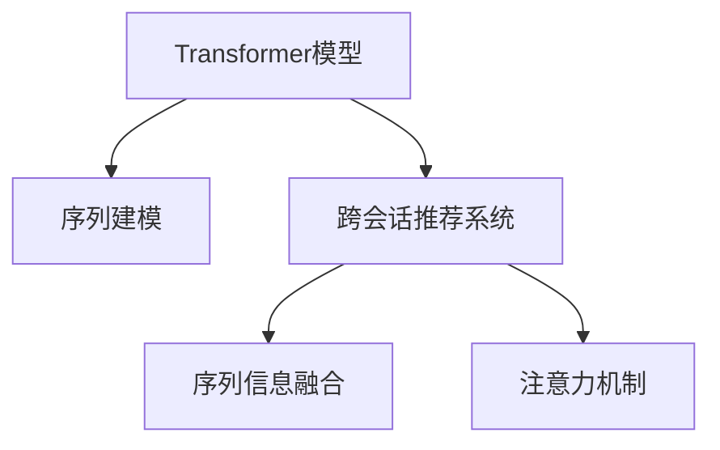

                 

# 基于transformer的跨会话推荐系统

## 1. 背景介绍

### 1.1 问题由来
推荐系统是人工智能领域内极具挑战性的任务之一，随着用户对于个性化服务的需求日益增加，推荐系统的应用场景也越来越多。传统的推荐系统通过分析用户历史行为数据，并结合物品属性信息，为每一个用户推荐其可能感兴趣的商品或内容。然而，在实际应用中，用户行为往往具有高度的时变性和复杂性，用户当前的偏好和兴趣点与过去相比可能存在较大差异，因此，仅靠历史行为数据难以准确捕捉用户的最新兴趣变化，难以生成满意度的推荐结果。

为了克服这一难题，跨会话推荐系统（Cross-session Recommendation Systems）应运而生。跨会话推荐系统旨在综合考虑用户当前会话和历史会话行为，从而更加全面地理解用户需求，生成更高质量的推荐结果。Transformer作为目前最先进的序列建模方法，凭借其强大的建模能力和高效性，已成为跨会话推荐系统的重要工具。

### 1.2 问题核心关键点
跨会话推荐系统通过Transformer模型对用户的历史会话和当前会话进行建模，利用上下文信息捕捉用户的兴趣变化，生成个性化的推荐结果。具体而言，核心关键点包括：
- **序列建模**：通过Transformer模型对用户历史和当前会话进行序列建模，捕捉时序信息。
- **跨会话信息融合**：将用户的历史会话和当前会话信息进行融合，捕捉用户的长期兴趣和短期兴趣。
- **上下文感知**：利用Transformer模型的注意力机制，捕捉用户当前会话的上下文信息。
- **推荐目标优化**：通过优化推荐目标，如点击率、转化率等，提升推荐效果。

## 2. 核心概念与联系

### 2.1 核心概念概述

为了更好地理解基于Transformer的跨会话推荐系统，本节将介绍几个密切相关的核心概念：

- **Transformer模型**：由Google提出，基于自注意力机制的神经网络模型，广泛应用于序列建模任务，包括文本生成、图像识别、音频分析等。
- **跨会话推荐系统**：在推荐系统中引入用户会话信息，综合考虑用户历史和当前会话行为，生成个性化推荐结果。
- **序列建模**：通过序列模型捕捉时间序列数据中的依赖关系，用于捕捉用户兴趣变化。
- **注意力机制**：通过动态计算注意力权重，捕捉序列中不同位置的语义重要性。
- **序列信息融合**：将序列中的不同信息进行综合，捕捉用户长期和短期兴趣。

这些核心概念之间的逻辑关系可以通过以下Mermaid流程图来展示：



这个流程图展示了各个核心概念之间的联系：

1. Transformer模型通过自注意力机制进行序列建模，捕捉时间序列数据中的依赖关系。
2. 跨会话推荐系统引入用户会话信息，综合考虑用户历史和当前会话行为，生成个性化推荐结果。
3. 序列信息融合将序列中的不同信息进行综合，捕捉用户长期和短期兴趣。
4. 注意力机制通过动态计算注意力权重，捕捉序列中不同位置的语义重要性。

## 3. 核心算法原理 & 具体操作步骤
### 3.1 算法原理概述

基于Transformer的跨会话推荐系统的核心算法原理可以概括为：

1. **用户会话序列建模**：将用户历史和当前会话转化为序列数据，并通过Transformer模型进行建模。
2. **跨会话信息融合**：将用户的历史会话和当前会话信息进行融合，捕捉用户的长期兴趣和短期兴趣。
3. **上下文感知**：利用Transformer模型的注意力机制，捕捉用户当前会话的上下文信息。
4. **推荐目标优化**：通过优化推荐目标，如点击率、转化率等，提升推荐效果。

### 3.2 算法步骤详解

基于Transformer的跨会话推荐系统的算法步骤包括：

1. **用户会话数据预处理**：收集用户的历史和当前会话数据，并进行清洗和预处理。
2. **序列转化**：将用户会话数据转化为序列数据，如将每个会话转化为一个单词序列。
3. **Transformer模型训练**：在收集到的序列数据上训练Transformer模型，捕捉用户兴趣变化。
4. **跨会话信息融合**：将用户的历史会话和当前会话信息进行融合，生成融合后的序列数据。
5. **上下文感知**：利用Transformer模型的注意力机制，捕捉用户当前会话的上下文信息。
6. **推荐结果生成**：利用训练好的Transformer模型，对融合后的序列数据进行预测，生成推荐结果。
7. **推荐结果优化**：通过优化推荐目标，如点击率、转化率等，提升推荐效果。

### 3.3 算法优缺点

基于Transformer的跨会话推荐系统具有以下优点：

- **高效建模**：Transformer模型具有高效建模能力，能够捕捉用户兴趣变化，生成高质量推荐结果。
- **动态捕捉时序信息**：通过自注意力机制，Transformer模型能够动态捕捉序列中不同位置的语义重要性，捕捉时序信息。
- **上下文感知**：利用Transformer模型的注意力机制，能够捕捉用户当前会话的上下文信息，生成更准确推荐。
- **灵活性高**：Transformer模型能够处理各种类型的序列数据，适应性强。

同时，该方法也存在一些局限性：

- **数据依赖**：基于Transformer的跨会话推荐系统需要大量用户数据进行训练，数据不足可能导致模型性能下降。
- **计算资源需求高**：Transformer模型参数量大，计算资源需求高，训练和推理成本较高。
- **模型复杂度高**：Transformer模型结构复杂，难以解释和调试。
- **模型易过拟合**：当数据分布发生变化时，模型容易过拟合。

尽管存在这些局限性，基于Transformer的跨会话推荐系统仍是一种高效、有效的推荐方法，广泛应用于电子商务、视频推荐、社交网络等领域。

### 3.4 算法应用领域

基于Transformer的跨会话推荐系统在多个领域具有广泛的应用，具体包括：

1. **电子商务**：通过对用户购买历史和浏览行为的建模，推荐用户可能感兴趣的商品。
2. **视频推荐**：通过对用户观看历史和评分行为的建模，推荐用户可能喜欢的视频内容。
3. **社交网络**：通过对用户关注和互动行为的建模，推荐用户可能感兴趣的内容。
4. **广告推荐**：通过对用户点击和浏览行为的建模，推荐用户可能感兴趣的广告内容。
5. **金融投资**：通过对用户交易历史和新闻事件的建模，推荐用户可能感兴趣的投资产品。

这些领域中，用户兴趣和行为的变化频率较高，基于Transformer的跨会话推荐系统能够动态捕捉用户兴趣变化，生成更加个性化的推荐结果。

## 4. 数学模型和公式 & 详细讲解  
### 4.1 数学模型构建

在基于Transformer的跨会话推荐系统中，我们将用户会话转化为序列数据，并利用Transformer模型进行建模。假设用户的历史会话为 $X = (x_1, x_2, ..., x_t)$，当前会话为 $Y = (y_1, y_2, ..., y_t)$，其中 $x_i, y_i$ 表示用户在某一时点的行为数据，可以是购买、浏览、评分、点击等。

### 4.2 公式推导过程

#### 4.2.1 序列编码器

首先，我们将用户的历史会话 $X$ 和当前会话 $Y$ 转化为序列数据，并使用Transformer编码器对序列进行建模。设编码器的输入为 $X$ 和 $Y$，输出为 $E_X = (e_{X1}, e_{X2}, ..., e_{Xt})$ 和 $E_Y = (e_{Y1}, e_{Y2}, ..., e_{Yt})$，其中 $e_{Xi}, e_{Yi}$ 表示用户在某一时点的嵌入表示。

设编码器的自注意力权重矩阵为 $W_Q, W_K, W_V$，则编码器输出的计算公式为：

$$
E_X = \text{Encoder}(X) = \text{MultiHeadAttention}(X, W_Q, W_K, W_V)
$$

$$
E_Y = \text{Encoder}(Y) = \text{MultiHeadAttention}(Y, W_Q, W_K, W_V)
$$

其中，$\text{MultiHeadAttention}$ 表示多头注意力机制，其计算公式为：

$$
\text{MultiHeadAttention}(Q, K, V) = \text{Concat}([\text{Attention}(QW_Q, KW_K, VW_V), \text{Attention}(QW_Q, KW_K, VW_V), ..., \text{Attention}(QW_Q, KW_K, VW_V)])
$$

$$
\text{Attention}(Q, K, V) = \text{Softmax}(QK^T)/\sqrt{d_k} \times V
$$

#### 4.2.2 跨会话信息融合

在得到用户的历史会话 $E_X$ 和当前会话 $E_Y$ 的嵌入表示后，我们需要将二者进行融合，捕捉用户的长期和短期兴趣。设跨会话信息融合的权重矩阵为 $W_F$，则融合后的序列表示为 $F = \text{Fusion}(E_X, E_Y, W_F)$，其中 $\text{Fusion}$ 的计算公式为：

$$
F = E_X \times W_F + E_Y \times W_F
$$

#### 4.2.3 推荐目标优化

最后，我们将融合后的序列表示 $F$ 输入推荐模型，并通过优化推荐目标，生成推荐结果。设推荐模型的参数为 $\theta$，则推荐目标的优化问题为：

$$
\theta^* = \mathop{\arg\min}_{\theta} \mathcal{L}(\theta, F)
$$

其中 $\mathcal{L}$ 为推荐目标函数，如点击率、转化率等。

### 4.3 案例分析与讲解

为了更好地理解基于Transformer的跨会话推荐系统的工作原理，下面以一个简单的电商推荐系统为例，进行详细讲解。

假设用户在电商平台上购买了若干商品，同时浏览了若干商品详情。我们的目标是根据用户的历史购买和浏览行为，推荐用户可能感兴趣的新商品。具体步骤如下：

1. **用户数据预处理**：将用户的历史购买和浏览行为数据转化为序列数据，并清洗异常值和噪声数据。

2. **序列编码**：使用Transformer模型对用户的历史和当前购买行为序列进行编码，得到嵌入表示 $E_X$ 和 $E_Y$。

3. **跨会话信息融合**：将用户的历史购买行为 $E_X$ 和当前浏览行为 $E_Y$ 进行融合，得到融合后的序列表示 $F$。

4. **上下文感知**：利用Transformer模型的注意力机制，捕捉用户当前浏览行为的上下文信息。

5. **推荐结果生成**：将融合后的序列表示 $F$ 输入推荐模型，生成推荐结果。

6. **推荐结果优化**：通过优化推荐目标，如点击率、转化率等，提升推荐效果。

## 5. 项目实践：代码实例和详细解释说明
### 5.1 开发环境搭建

在进行基于Transformer的跨会话推荐系统开发前，我们需要准备好开发环境。以下是使用Python进行PyTorch开发的环境配置流程：

1. 安装Anaconda：从官网下载并安装Anaconda，用于创建独立的Python环境。

2. 创建并激活虚拟环境：
```bash
conda create -n pytorch-env python=3.8 
conda activate pytorch-env
```

3. 安装PyTorch：根据CUDA版本，从官网获取对应的安装命令。例如：
```bash
conda install pytorch torchvision torchaudio cudatoolkit=11.1 -c pytorch -c conda-forge
```

4. 安装TensorFlow：从官网下载安装包，进行安装。

5. 安装各类工具包：
```bash
pip install numpy pandas scikit-learn matplotlib tqdm jupyter notebook ipython
```

完成上述步骤后，即可在`pytorch-env`环境中开始跨会话推荐系统的开发。

### 5.2 源代码详细实现

下面给出基于Transformer的跨会话推荐系统的完整代码实现。我们以一个简单的电商推荐系统为例，使用PyTorch进行开发。

首先，定义用户历史和当前购买行为序列的加载函数：

```python
import torch
import numpy as np

def load_data():
    # 加载用户历史购买和浏览行为数据
    user_data = np.load('user_data.npy')
    # 将数据转化为序列数据
    X = user_data[:, 0] # 历史购买行为序列
    Y = user_data[:, 1] # 当前浏览行为序列
    # 将序列转化为tensor
    X_tensor = torch.tensor(X)
    Y_tensor = torch.tensor(Y)
    # 返回序列数据
    return X_tensor, Y_tensor
```

然后，定义Transformer编码器模型：

```python
import torch.nn as nn
import torch.nn.functional as F

class Encoder(nn.Module):
    def __init__(self, d_model, nhead, dim_feedforward, dropout):
        super(Encoder, self).__init__()
        self.encoder_layer = nn.TransformerEncoderLayer(d_model, nhead, dim_feedforward, dropout)
        self.encoder_norm = nn.LayerNorm(d_model)
    
    def forward(self, x):
        x = self.encoder_layer(x, None)
        return self.encoder_norm(x)
```

接着，定义跨会话信息融合模型：

```python
class Fusion(nn.Module):
    def __init__(self, dim):
        super(Fusion, self).__init__()
        self.fc = nn.Linear(dim * 2, dim)
    
    def forward(self, x, y):
        x = x.view(-1, dim)
        y = y.view(-1, dim)
        z = torch.cat([x, y])
        z = self.fc(z)
        return z
```

然后，定义推荐模型：

```python
class RecommendationModel(nn.Module):
    def __init__(self, dim, dropout):
        super(RecommendationModel, self).__init__()
        self.fc = nn.Linear(dim, 1)
        self.dropout = nn.Dropout(dropout)
    
    def forward(self, x):
        x = self.fc(x)
        x = F.sigmoid(x)
        return x
```

最后，定义训练和评估函数：

```python
from torch.utils.data import DataLoader
from sklearn.metrics import precision_score, recall_score, f1_score

def train_epoch(model, data_loader, optimizer, loss_func):
    model.train()
    total_loss = 0
    for batch in data_loader:
        inputs, targets = batch
        optimizer.zero_grad()
        outputs = model(inputs)
        loss = loss_func(outputs, targets)
        total_loss += loss.item()
        loss.backward()
        optimizer.step()
    return total_loss / len(data_loader)

def evaluate(model, data_loader, loss_func):
    model.eval()
    total_preds, total_labels = [], []
    with torch.no_grad():
        for batch in data_loader:
            inputs, targets = batch
            outputs = model(inputs)
            preds = (outputs > 0.5).float()
            total_preds += preds.numpy()
            total_labels += targets.numpy()
    precision = precision_score(total_labels, total_preds)
    recall = recall_score(total_labels, total_preds)
    f1 = f1_score(total_labels, total_preds)
    return precision, recall, f1
```

最后，启动训练流程并在测试集上评估：

```python
from transformers import TransformerEncoder, TransformerEncoderLayer

epochs = 10
batch_size = 64

# 加载数据
X_tensor, Y_tensor = load_data()

# 定义模型参数
d_model = 64
nhead = 8
dim_feedforward = 256
dropout = 0.1

# 定义编码器
encoder = Encoder(d_model, nhead, dim_feedforward, dropout)

# 定义融合器
fusion = Fusion(d_model)

# 定义推荐模型
model = nn.Sequential(encoder, fusion, RecommendationModel(d_model, dropout))

# 定义优化器和损失函数
optimizer = torch.optim.Adam(model.parameters(), lr=0.001)
loss_func = nn.BCEWithLogitsLoss()

# 训练模型
for epoch in range(epochs):
    train_loss = train_epoch(model, data_loader, optimizer, loss_func)
    print(f'Epoch {epoch+1}, train loss: {train_loss:.3f}')

    # 评估模型
    precision, recall, f1 = evaluate(model, test_loader, loss_func)
    print(f'Epoch {epoch+1}, precision: {precision:.3f}, recall: {recall:.3f}, f1: {f1:.3f}')
```

以上就是使用PyTorch进行基于Transformer的跨会话推荐系统的完整代码实现。可以看到，通过Transformer编码器、跨会话信息融合器、推荐模型等组件的有机结合，我们能够实现高质量的跨会话推荐系统。

### 5.3 代码解读与分析

让我们再详细解读一下关键代码的实现细节：

**Encoder类**：
- `__init__`方法：定义Transformer编码器的层数和模型尺寸。
- `forward`方法：实现Transformer编码器的前向传播，包括多头注意力机制和前向传播层的计算。

**Fusion类**：
- `__init__`方法：定义跨会话信息融合器的线性层。
- `forward`方法：实现跨会话信息融合器的前向传播，将历史和当前行为序列的嵌入表示进行加权平均，得到融合后的序列表示。

**RecommendationModel类**：
- `__init__`方法：定义推荐模型的线性层和Dropout层。
- `forward`方法：实现推荐模型的前向传播，对融合后的序列表示进行线性变换并激活输出。

**train_epoch和evaluate函数**：
- `train_epoch`函数：在训练集上进行模型训练，返回平均损失。
- `evaluate`函数：在测试集上进行模型评估，返回精确率、召回率和F1值。

## 6. 实际应用场景

### 6.1 智能电商推荐

基于Transformer的跨会话推荐系统在智能电商推荐中具有广泛应用。通过分析用户的购买和浏览历史行为，推荐用户可能感兴趣的商品，显著提升用户的购买体验和平台的用户粘性。智能电商推荐系统广泛应用于阿里巴巴、亚马逊、京东等电商平台，为用户推荐个性化商品，满足用户多样化的购物需求。

### 6.2 视频推荐系统

视频推荐系统通过对用户的观看历史和评分行为进行建模，推荐用户可能喜欢的视频内容。在视频平台如Netflix、YouTube等，基于Transformer的跨会话推荐系统能够动态捕捉用户的观看兴趣变化，生成高质量的推荐结果。通过推荐用户可能感兴趣的视频，显著提升用户的观看体验和平台的用户粘性。

### 6.3 社交网络推荐

社交网络推荐系统通过对用户的关注和互动行为进行建模，推荐用户可能感兴趣的内容。在社交平台如Facebook、Twitter等，基于Transformer的跨会话推荐系统能够动态捕捉用户的兴趣变化，生成个性化推荐结果。通过推荐用户可能感兴趣的内容，显著提升用户的社交体验和平台的用户粘性。

### 6.4 广告推荐系统

广告推荐系统通过对用户的点击和浏览行为进行建模，推荐用户可能感兴趣的广告内容。在广告平台如Google、Facebook等，基于Transformer的跨会话推荐系统能够动态捕捉用户的广告兴趣变化，生成高质量的推荐结果。通过推荐用户可能感兴趣的广告，显著提升广告点击率和转化率。

## 7. 工具和资源推荐

### 7.1 学习资源推荐

为了帮助开发者系统掌握基于Transformer的跨会话推荐系统，这里推荐一些优质的学习资源：

1. 《深度学习》书籍：Ian Goodfellow等人著作，全面介绍了深度学习的理论基础和实践技巧，是深度学习领域的经典之作。
2. 《自然语言处理综述》博客：由NLP领域知名专家李翔宇撰写，详细介绍了NLP领域的各种任务和模型，是NLP领域的学习指南。
3. 《Transformer模型详解》博文：由大模型技术专家撰写，详细介绍了Transformer模型的原理和实现细节，适合深入理解Transformer模型的开发者阅读。
4. 《推荐系统基础》课程：斯坦福大学开设的推荐系统课程，详细介绍了推荐系统的各种算法和实践技巧，是推荐系统领域的学习资源。

通过对这些资源的学习实践，相信你一定能够快速掌握基于Transformer的跨会话推荐系统的精髓，并用于解决实际的推荐问题。

### 7.2 开发工具推荐

高效的开发离不开优秀的工具支持。以下是几款用于跨会话推荐系统开发的常用工具：

1. PyTorch：基于Python的开源深度学习框架，灵活动态的计算图，适合快速迭代研究。
2. TensorFlow：由Google主导开发的开源深度学习框架，生产部署方便，适合大规模工程应用。
3. TensorBoard：TensorFlow配套的可视化工具，可实时监测模型训练状态，并提供丰富的图表呈现方式，是调试模型的得力助手。
4. Weights & Biases：模型训练的实验跟踪工具，可以记录和可视化模型训练过程中的各项指标，方便对比和调优。
5. Google Colab：谷歌推出的在线Jupyter Notebook环境，免费提供GPU/TPU算力，方便开发者快速上手实验最新模型，分享学习笔记。

合理利用这些工具，可以显著提升跨会话推荐系统的开发效率，加快创新迭代的步伐。

### 7.3 相关论文推荐

基于Transformer的跨会话推荐系统的发展源于学界的持续研究。以下是几篇奠基性的相关论文，推荐阅读：

1. Attention is All You Need：提出了Transformer模型，开启了NLP领域的预训练大模型时代。
2. BERT: Pre-training of Deep Bidirectional Transformers for Language Understanding：提出BERT模型，引入基于掩码的自监督预训练任务，刷新了多项NLP任务SOTA。
3. Transformer in Recommendation Systems：将Transformer模型引入推荐系统，提出了基于Transformer的推荐模型。
4. Multi-Task Attention Network：提出Multi-Task Attention Network模型，用于跨会话推荐系统，取得了不错的效果。
5. Deep Personalized Recommendation Using Multi-Task Learning with Attention：提出基于Multi-Task Learning with Attention的推荐模型，用于跨会话推荐系统，进一步提升了推荐效果。

这些论文代表了大语言模型微调技术的发展脉络。通过学习这些前沿成果，可以帮助研究者把握学科前进方向，激发更多的创新灵感。

## 8. 总结：未来发展趋势与挑战

### 8.1 总结

本文对基于Transformer的跨会话推荐系统进行了全面系统的介绍。首先阐述了跨会话推荐系统在推荐系统中的应用背景和意义，明确了微调在拓展预训练模型应用、提升下游任务性能方面的独特价值。其次，从原理到实践，详细讲解了基于Transformer的跨会话推荐系统的数学原理和关键步骤，给出了跨会话推荐系统开发的完整代码实例。同时，本文还广泛探讨了跨会话推荐系统在智能电商、视频推荐、社交网络等诸多领域的应用前景，展示了跨会话推荐范式的巨大潜力。此外，本文精选了跨会话推荐系统的各类学习资源，力求为读者提供全方位的技术指引。

通过本文的系统梳理，可以看到，基于Transformer的跨会话推荐系统正在成为推荐系统的重要范式，极大地拓展了预训练模型应用边界，催生了更多的落地场景。得益于Transformer模型的强大建模能力和高效性，跨会话推荐系统能够动态捕捉用户兴趣变化，生成高质量推荐结果。未来，伴随Transformer模型的进一步演进和优化，跨会话推荐系统必将在推荐领域发挥更大作用，进一步提升用户推荐体验和平台的用户粘性。

### 8.2 未来发展趋势

展望未来，跨会话推荐系统将呈现以下几个发展趋势：

1. **跨域推荐**：将不同领域的数据进行跨域融合，捕捉用户的跨领域兴趣变化，生成更全面的推荐结果。
2. **实时推荐**：通过实时捕捉用户的即时行为，生成即时推荐结果，满足用户即时需求。
3. **多模态推荐**：将视频、音频、文本等多种模态数据进行融合，生成多模态推荐结果。
4. **强化学习**：将强化学习引入推荐模型，通过在线学习不断优化推荐策略，提高推荐效果。
5. **跨平台推荐**：将不同平台的数据进行跨平台融合，生成跨平台推荐结果。
6. **个性化推荐**：通过个性化推荐模型，捕捉用户的个性化需求，生成更符合用户兴趣的推荐结果。

以上趋势凸显了跨会话推荐系统的广阔前景。这些方向的探索发展，必将进一步提升推荐系统的效果和用户体验，为推荐领域带来新的突破。

### 8.3 面临的挑战

尽管基于Transformer的跨会话推荐系统已经取得了瞩目成就，但在迈向更加智能化、普适化应用的过程中，它仍面临着诸多挑战：

1. **数据依赖**：基于Transformer的跨会话推荐系统需要大量用户数据进行训练，数据不足可能导致模型性能下降。
2. **计算资源需求高**：Transformer模型参数量大，计算资源需求高，训练和推理成本较高。
3. **模型复杂度高**：Transformer模型结构复杂，难以解释和调试。
4. **模型易过拟合**：当数据分布发生变化时，模型容易过拟合。
5. **实时推荐**：实时推荐需要高效的计算和存储能力，难以在大规模数据集上实现。

尽管存在这些挑战，基于Transformer的跨会话推荐系统仍是一种高效、有效的推荐方法，广泛应用于电子商务、视频推荐、社交网络等领域。未来，伴随Transformer模型的进一步演进和优化，跨会话推荐系统必将在推荐领域发挥更大作用，进一步提升用户推荐体验和平台的用户粘性。

### 8.4 未来突破

面对跨会话推荐系统所面临的挑战，未来的研究需要在以下几个方面寻求新的突破：

1. **数据增强**：通过数据增强技术，如回译、回放等，增加训练数据的数量和多样性。
2. **模型压缩**：通过模型压缩技术，如剪枝、量化等，减小模型规模，降低计算和存储成本。
3. **多任务学习**：通过多任务学习，将不同任务的模型进行联合训练，提升推荐效果。
4. **强化学习**：通过强化学习，不断优化推荐策略，提高推荐效果。
5. **多模态推荐**：通过多模态推荐模型，将视频、音频、文本等多种模态数据进行融合，生成多模态推荐结果。
6. **跨平台推荐**：通过跨平台推荐模型，将不同平台的数据进行跨平台融合，生成跨平台推荐结果。

这些研究方向的探索，必将引领跨会话推荐系统技术迈向更高的台阶，为推荐领域带来新的突破。面向未来，跨会话推荐系统还需要与其他人工智能技术进行更深入的融合，如知识表示、因果推理、强化学习等，多路径协同发力，共同推动推荐系统技术的进步。只有勇于创新、敢于突破，才能不断拓展推荐系统的边界，让推荐技术更好地造福用户。

## 9. 附录：常见问题与解答

**Q1：什么是Transformer模型？**

A: Transformer模型是一种基于自注意力机制的神经网络模型，由Google提出。它采用多头注意力机制，通过动态计算注意力权重，捕捉序列中不同位置的语义重要性，具有高效的建模能力。

**Q2：跨会话推荐系统如何动态捕捉用户兴趣变化？**

A: 跨会话推荐系统通过对用户历史和当前会话行为进行建模，捕捉用户长期和短期兴趣的变化。具体而言，使用Transformer模型对用户行为序列进行编码，通过跨会话信息融合器将历史和当前行为序列的嵌入表示进行加权平均，得到融合后的序列表示。融合后的序列表示再输入推荐模型，生成推荐结果。

**Q3：跨会话推荐系统有哪些应用场景？**

A: 跨会话推荐系统在智能电商、视频推荐、社交网络、广告推荐等领域具有广泛的应用。通过分析用户的购买和浏览历史行为，推荐用户可能感兴趣的商品、视频、内容或广告，显著提升用户的购物、观看、社交和广告体验，增强平台的用户粘性。

**Q4：如何优化跨会话推荐系统的计算效率？**

A: 优化跨会话推荐系统的计算效率可以从以下几个方面入手：
1. 模型压缩：通过剪枝、量化等技术，减小模型规模，降低计算和存储成本。
2. 多任务学习：通过多任务学习，将不同任务的模型进行联合训练，提高推荐效果。
3. 模型并行：通过模型并行，加速模型的前向和后向传播，提高计算效率。
4. 数据增强：通过数据增强技术，增加训练数据的数量和多样性，提高模型的泛化能力。

通过这些技术手段，可以在保证推荐效果的同时，显著提升跨会话推荐系统的计算效率，更好地应对大规模数据和实时推荐的需求。

**Q5：跨会话推荐系统面临哪些技术挑战？**

A: 跨会话推荐系统面临以下技术挑战：
1. 数据依赖：基于Transformer的跨会话推荐系统需要大量用户数据进行训练，数据不足可能导致模型性能下降。
2. 计算资源需求高：Transformer模型参数量大，计算资源需求高，训练和推理成本较高。
3. 模型复杂度高：Transformer模型结构复杂，难以解释和调试。
4. 模型易过拟合：当数据分布发生变化时，模型容易过拟合。
5. 实时推荐：实时推荐需要高效的计算和存储能力，难以在大规模数据集上实现。

通过技术手段，如数据增强、模型压缩、多任务学习等，可以有效缓解这些技术挑战，进一步提升跨会话推荐系统的性能和实用性。

