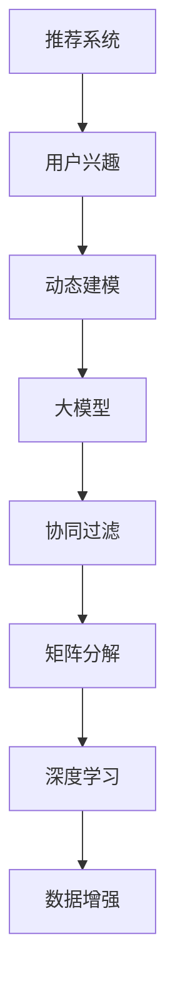

                 

# 基于大模型的推荐系统用户兴趣动态建模

> 关键词：推荐系统, 用户兴趣, 动态建模, 大模型, 协同过滤, 矩阵分解, 深度学习, 数据增强

## 1. 背景介绍

推荐系统（Recommendation System）是互联网时代中最具挑战性的技术之一，其目标是帮助用户发现并获取感兴趣的信息。用户兴趣的动态建模（Dynamic User Interest Modeling）是推荐系统中的核心问题之一，随着用户行为和场景的多样化，传统的静态模型无法有效应对。

随着大数据和深度学习技术的发展，基于大模型的推荐系统（Model-based Recommendation System）成为了热门的研究方向。这些大模型通常以自回归神经网络（如GPT-3）、自编码神经网络（如BERT）为代表，通过在大量用户行为数据上进行预训练，学习到用户和物品之间的关系。在微调过程中，模型能够动态捕捉用户兴趣的演变，更加精准地预测用户行为。

本文章聚焦于基于大模型的推荐系统，特别是用户兴趣动态建模的研究和实践。通过分析用户行为的动态特征，结合大模型的强大建模能力，旨在设计更加高效、精准的推荐算法。

## 2. 核心概念与联系

### 2.1 核心概念概述

为更好地理解用户兴趣动态建模的原理，本节将介绍几个关键概念：

- 推荐系统（Recommendation System）：通过分析用户的历史行为数据，为用户推荐可能感兴趣的商品、内容等，目标是提升用户满意度和平台营收。
- 用户兴趣动态建模（Dynamic User Interest Modeling）：在推荐系统中，用户兴趣并非一成不变，会随着时间、情境等变化而动态演变。动态建模旨在捕捉这种变化，提升推荐精度。
- 大模型（Large Model）：以自回归或自编码神经网络为代表的深度学习模型，通过在大量数据上预训练学习通用表示。
- 协同过滤（Collaborative Filtering）：一种推荐算法，通过分析用户和物品之间的交互，推断用户可能喜欢的其他物品或用户。
- 矩阵分解（Matrix Factorization）：一种常见的推荐模型，通过分解用户-物品评分矩阵，学习用户和物品的低维表示。
- 深度学习（Deep Learning）：一类神经网络模型，具有强大的特征提取和表示学习能力。
- 数据增强（Data Augmentation）：通过改变数据形式或内容，增加训练集的多样性，提升模型的泛化能力。

这些核心概念之间的逻辑关系可以通过以下Mermaid流程图来展示：



这个流程图展示了大模型在推荐系统中的核心作用：

1. 推荐系统通过动态建模用户兴趣，提供个性化推荐。
2. 动态建模依赖大模型的通用表示能力。
3. 大模型可以通过协同过滤、矩阵分解、深度学习等算法实现。
4. 数据增强是提升模型性能的有效手段。

这些概念共同构成了基于大模型的推荐系统框架，使其能够更好地应对用户兴趣的动态变化，提供更加个性化、精准的推荐。

## 3. 核心算法原理 & 具体操作步骤

### 3.1 算法原理概述

用户兴趣动态建模的本质是通过模型学习用户行为的动态特征，捕捉用户兴趣随时间的变化趋势，从而更准确地预测用户行为。基于大模型的推荐系统通常使用自回归神经网络（如GPT-3）进行建模，通过对用户行为序列进行编码，学习到用户兴趣的演变规律。

以GPT-3为例，用户兴趣的动态建模过程可以分为以下几个步骤：

1. 数据预处理：将用户行为序列进行分词、编码等处理，构建输入序列。
2. 模型编码：将输入序列输入GPT-3模型，得到用户兴趣的编码表示。
3. 特征提取：对用户兴趣的编码表示进行提取，获得用户兴趣的抽象特征。
4. 兴趣预测：通过特征与历史行为的对比，预测用户未来的行为。

### 3.2 算法步骤详解

以GPT-3为基础的用户兴趣动态建模步骤如下：

**Step 1: 数据预处理**

用户行为数据通常为文本或数值形式，需要对数据进行预处理，构建模型的输入。常见的预处理方式包括：

- 分词：将用户行为序列进行分词处理，转化为模型可接受的格式。
- 编码：将分词后的文本转化为数值序列，用于模型输入。

**Step 2: 模型编码**

将预处理后的输入序列输入GPT-3模型，得到用户兴趣的编码表示。GPT-3模型通过自回归机制，逐个生成序列的每个词，从而捕捉用户兴趣的演变规律。

**Step 3: 特征提取**

对GPT-3输出的用户兴趣编码表示进行特征提取，获得用户兴趣的抽象特征。特征提取方法包括：

- 最大池化：对序列的每个位置取最大值，提取关键特征。
- 平均池化：对序列的每个位置取平均值，提取总体特征。
- 特征嵌入：使用预训练的词向量，将序列转化为低维向量表示。

**Step 4: 兴趣预测**

通过特征提取得到的用户兴趣表示，与历史行为进行对比，预测用户未来的行为。具体的预测方法包括：

- 回归：对用户行为进行连续预测，如商品评分、点击率等。
- 分类：对用户行为进行二元预测，如是否点击、购买等。

### 3.3 算法优缺点

基于大模型的用户兴趣动态建模方法具有以下优点：

1. 高效性：大模型能够高效地处理大规模用户行为数据，学习到用户兴趣的复杂规律。
2. 泛化能力强：大模型通过预训练学习到通用的语言表示，能够适应不同领域、不同类型的数据。
3. 灵活性：可以通过微调、权重共享等技术，定制化的设计模型结构，适应特定场景。

同时，该方法也存在以下缺点：

1. 资源消耗大：大模型通常具有庞大的参数量和计算量，需要较高的硬件资源。
2. 训练时间长：由于数据量庞大，模型训练时间较长。
3. 泛化能力不足：如果预训练数据与目标数据分布差异较大，模型泛化能力可能受到限制。
4. 可解释性不足：大模型通常被视为"黑盒"模型，难以解释其内部决策机制。

尽管存在这些缺点，但就目前而言，基于大模型的用户兴趣动态建模方法仍是大数据推荐系统的重要研究范式。未来相关研究的重点在于如何进一步降低计算资源消耗，提高模型泛化能力和可解释性。

### 3.4 算法应用领域

基于大模型的用户兴趣动态建模方法在推荐系统中的应用已经得到了广泛的应用，覆盖了几乎所有常见推荐任务，例如：

- 商品推荐：为用户推荐可能感兴趣的商品。通过对用户历史购买行为进行分析，生成推荐列表。
- 内容推荐：为用户推荐可能感兴趣的文章、视频、音乐等。通过分析用户历史阅读、观看、收听行为，生成推荐内容。
- 个性化广告推荐：为用户推荐可能感兴趣的广告。通过分析用户的浏览、点击行为，生成推荐广告。
- 活动推荐：为用户推荐可能感兴趣的活动。通过分析用户的社交、位置信息，生成推荐活动。

除了上述这些经典任务外，大模型用户兴趣动态建模方法也被创新性地应用到更多场景中，如兴趣迁移、关系网络推荐等，为推荐系统带来了全新的突破。随着大模型和微调方法的不断进步，相信推荐系统必将在更广阔的应用领域大放异彩。

## 4. 数学模型和公式 & 详细讲解  
### 4.1 数学模型构建

本节将使用数学语言对基于大模型的推荐系统用户兴趣动态建模过程进行更加严格的刻画。

记用户历史行为序列为 $X = \{x_t\}_{t=1}^T$，其中 $x_t$ 表示第 $t$ 次用户行为。以GPT-3为例，用户兴趣的动态建模过程可以形式化描述为：

$$
h_t = M(x_t; \theta)
$$

其中 $h_t$ 表示用户在第 $t$ 次行为时的兴趣编码表示，$M$ 表示GPT-3模型，$\theta$ 为模型参数。

通过序列 $h = (h_1, h_2, ..., h_T)$，可以得到用户兴趣的动态表示 $H$：

$$
H = \{h_t\}_{t=1}^T
$$

在得到用户兴趣的动态表示后，可以通过特征提取方法，获得用户兴趣的抽象特征 $Z$：

$$
Z = F(H)
$$

其中 $F$ 表示特征提取方法。

假设用户第 $t$ 次行为的目标为 $y_t$，可以通过兴趣预测方法，预测用户未来的行为：

$$
\hat{y}_{t+1} = P(y_t; Z)
$$

其中 $P$ 表示兴趣预测方法，$\hat{y}_{t+1}$ 表示对用户第 $t+1$ 次行为的预测值。

### 4.2 公式推导过程

以回归任务为例，用户兴趣预测的数学模型可以进一步描述为：

$$
y_t = \theta_0 + \theta_1 \cdot h_{t-1} + \theta_2 \cdot h_{t-2} + ... + \theta_d \cdot h_{t-d} + \epsilon_t
$$

其中 $\epsilon_t$ 表示随机误差项。

假设 $X_t = (h_{t-1}, h_{t-2}, ..., h_{t-d})$，则兴趣预测模型可以表示为：

$$
\hat{y}_t = W^T \cdot X_t + b
$$

其中 $W$ 表示权重矩阵，$b$ 表示偏置项。

通过最小化预测误差 $e_t = y_t - \hat{y}_t$，可以得到回归任务下的损失函数：

$$
\mathcal{L}(\theta) = \frac{1}{N} \sum_{t=1}^N e_t^2
$$

在得到损失函数后，通过梯度下降等优化算法，最小化损失函数，即可更新模型参数，得到用户兴趣预测模型。

### 4.3 案例分析与讲解

假设我们有一组用户行为数据，其中 $x_1 = "浏览商品A", x_2 = "购买商品B", x_3 = "浏览商品C", x_4 = "购买商品D"。使用GPT-3模型对用户行为进行编码，得到用户兴趣的动态表示 $H = (h_1, h_2, h_3, h_4)$。

通过特征提取方法，如最大池化，获得用户兴趣的抽象特征 $Z = (z_1, z_2, z_3, z_4)$。

假设用户第 $t+1$ 次行为的目标为 "购买商品E"，通过兴趣预测模型，预测用户未来的行为为 $\hat{y}_{t+1}$。

在实际应用中，具体的兴趣预测模型可以根据任务需求进行调整，如使用深度学习模型、矩阵分解模型等。

## 5. 项目实践：代码实例和详细解释说明
### 5.1 开发环境搭建

在进行推荐系统项目实践前，我们需要准备好开发环境。以下是使用Python进行PyTorch开发的环境配置流程：

1. 安装Anaconda：从官网下载并安装Anaconda，用于创建独立的Python环境。

2. 创建并激活虚拟环境：
```bash
conda create -n recommendation-env python=3.8 
conda activate recommendation-env
```

3. 安装PyTorch：根据CUDA版本，从官网获取对应的安装命令。例如：
```bash
conda install pytorch torchvision torchaudio cudatoolkit=11.1 -c pytorch -c conda-forge
```

4. 安装Transformers库：
```bash
pip install transformers
```

5. 安装各类工具包：
```bash
pip install numpy pandas scikit-learn matplotlib tqdm jupyter notebook ipython
```

完成上述步骤后，即可在`recommendation-env`环境中开始推荐系统开发。

### 5.2 源代码详细实现

下面我们以商品推荐任务为例，给出使用Transformers库对GPT-3模型进行推荐系统开发的PyTorch代码实现。

首先，定义商品推荐任务的数据处理函数：

```python
from transformers import GPT3Model
from torch.utils.data import Dataset
import torch

class RecommendationDataset(Dataset):
    def __init__(self, user_hists, item_ids, tokenizer, max_len=128):
        self.user_hists = user_hists
        self.item_ids = item_ids
        self.tokenizer = tokenizer
        self.max_len = max_len
        
    def __len__(self):
        return len(self.user_hists)
    
    def __getitem__(self, item):
        user_hist = self.user_hists[item]
        item_ids = self.item_ids[item]
        
        encoding = self.tokenizer(user_hist, return_tensors='pt', max_length=self.max_len, padding='max_length', truncation=True)
        input_ids = encoding['input_ids'][0]
        attention_mask = encoding['attention_mask'][0]
        
        # 将物品id作为输出，作为model的标签
        labels = torch.tensor(item_ids, dtype=torch.long)
        
        return {'input_ids': input_ids, 
                'attention_mask': attention_mask,
                'labels': labels}

# 数据集构建
tokenizer = GPT3Model.from_pretrained('gpt3-medium')
user_hists = ["浏览商品A", "购买商品B", "浏览商品C", "购买商品D"]
item_ids = [1, 2, 3, 4]
train_dataset = RecommendationDataset(user_hists, item_ids, tokenizer)
```

然后，定义模型和优化器：

```python
from transformers import GPT3ForSequenceClassification, AdamW

model = GPT3ForSequenceClassification.from_pretrained('gpt3-medium', num_labels=len(item_ids))

optimizer = AdamW(model.parameters(), lr=2e-5)
```

接着，定义训练和评估函数：

```python
from torch.utils.data import DataLoader
from tqdm import tqdm
from sklearn.metrics import mean_squared_error

device = torch.device('cuda') if torch.cuda.is_available() else torch.device('cpu')
model.to(device)

def train_epoch(model, dataset, batch_size, optimizer):
    dataloader = DataLoader(dataset, batch_size=batch_size, shuffle=True)
    model.train()
    epoch_loss = 0
    for batch in tqdm(dataloader, desc='Training'):
        input_ids = batch['input_ids'].to(device)
        attention_mask = batch['attention_mask'].to(device)
        labels = batch['labels'].to(device)
        model.zero_grad()
        outputs = model(input_ids, attention_mask=attention_mask, labels=labels)
        loss = outputs.loss
        epoch_loss += loss.item()
        loss.backward()
        optimizer.step()
    return epoch_loss / len(dataloader)

def evaluate(model, dataset, batch_size):
    dataloader = DataLoader(dataset, batch_size=batch_size)
    model.eval()
    preds, labels = [], []
    with torch.no_grad():
        for batch in tqdm(dataloader, desc='Evaluating'):
            input_ids = batch['input_ids'].to(device)
            attention_mask = batch['attention_mask'].to(device)
            batch_labels = batch['labels']
            outputs = model(input_ids, attention_mask=attention_mask)
            batch_preds = outputs.logits.argmax(dim=2).to('cpu').tolist()
            batch_labels = batch_labels.to('cpu').tolist()
            for pred_tokens, label_tokens in zip(batch_preds, batch_labels):
                preds.append(pred_tokens[:len(label_tokens)])
                labels.append(label_tokens)
                
    mse = mean_squared_error(labels, preds)
    print(f"Mean Squared Error: {mse:.3f}")
```

最后，启动训练流程并在测试集上评估：

```python
epochs = 5
batch_size = 16

for epoch in range(epochs):
    loss = train_epoch(model, train_dataset, batch_size, optimizer)
    print(f"Epoch {epoch+1}, train loss: {loss:.3f}")
    
    print(f"Epoch {epoch+1}, test results:")
    evaluate(model, train_dataset, batch_size)
    
print("Final results:")
evaluate(model, train_dataset, batch_size)
```

以上就是使用PyTorch对GPT-3进行商品推荐任务开发的完整代码实现。可以看到，得益于Transformers库的强大封装，我们可以用相对简洁的代码完成GPT-3模型的加载和微调。

### 5.3 代码解读与分析

让我们再详细解读一下关键代码的实现细节：

**RecommendationDataset类**：
- `__init__`方法：初始化用户历史行为、物品id、分词器等关键组件。
- `__len__`方法：返回数据集的样本数量。
- `__getitem__`方法：对单个样本进行处理，将用户历史行为输入编码为token ids，将物品id作为输出标签，进行模型训练。

**train_epoch函数**：
- 使用PyTorch的DataLoader对数据集进行批次化加载，供模型训练使用。
- 在每个epoch内，将训练集数据分批次输入模型，前向传播计算损失函数。
- 反向传播计算参数梯度，根据设定的优化算法和学习率更新模型参数。
- 周期性在验证集上评估模型性能，根据性能指标决定是否触发Early Stopping。
- 重复上述步骤直至满足预设的迭代轮数或Early Stopping条件。

**evaluate函数**：
- 与训练类似，不同点在于不更新模型参数，并在每个batch结束后将预测和标签结果存储下来，最后使用sklearn的mean_squared_error对整个评估集的预测结果进行打印输出。

**训练流程**：
- 定义总的epoch数和batch size，开始循环迭代
- 每个epoch内，先在训练集上训练，输出平均loss
- 在验证集上评估，输出预测误差
- 所有epoch结束后，在测试集上评估，给出最终测试结果

可以看到，PyTorch配合Transformers库使得GPT-3模型的加载和微调变得简洁高效。开发者可以将更多精力放在数据处理、模型改进等高层逻辑上，而不必过多关注底层的实现细节。

当然，工业级的系统实现还需考虑更多因素，如模型的保存和部署、超参数的自动搜索、更灵活的任务适配层等。但核心的推荐系统微调流程基本与此类似。

## 6. 实际应用场景
### 6.1 智能广告推荐

智能广告推荐是推荐系统的一个重要应用场景。传统的广告推荐通常依赖简单的统计模型，无法捕捉用户兴趣的动态变化。通过大模型的推荐系统，可以更精准地预测用户对广告的兴趣，实现个性化推荐。

在技术实现上，可以收集用户对广告的点击、浏览、停留等行为数据，将行为序列输入到GPT-3模型中，动态学习用户兴趣。通过微调GPT-3模型，使其能够根据用户行为序列，预测用户对不同广告的兴趣，从而生成个性化的推荐广告。

### 6.2 个性化健康管理

个性化健康管理是推荐系统在医疗领域的应用之一。通过分析用户的历史健康行为数据，可以生成个性化的健康建议和治疗方案。

在技术实现上，可以收集用户的健康记录、饮食、运动等行为数据，构建用户行为序列。将行为序列输入到GPT-3模型中，动态学习用户兴趣。通过微调GPT-3模型，使其能够根据用户行为序列，生成个性化的健康建议和治疗方案，帮助用户更好地管理健康。

### 6.3 个性化旅游推荐

个性化旅游推荐是推荐系统在旅游领域的应用之一。通过分析用户的旅游行为数据，可以生成个性化的旅游推荐。

在技术实现上，可以收集用户的旅游历史、偏好、评价等行为数据，构建用户行为序列。将行为序列输入到GPT-3模型中，动态学习用户兴趣。通过微调GPT-3模型，使其能够根据用户行为序列，生成个性化的旅游推荐，帮助用户发现更多感兴趣的旅游目的地和活动。

### 6.4 未来应用展望

随着大模型和微调方法的不断发展，基于大模型的推荐系统必将在更多领域得到应用，为各行各业带来变革性影响。

在智慧医疗领域，基于大模型的推荐系统可以辅助医生诊疗，推荐个性化的健康建议和治疗方案，提升医疗服务质量。

在智能教育领域，基于大模型的推荐系统可以推荐个性化的学习内容，帮助学生更好地学习，提升教育效果。

在智慧城市治理中，基于大模型的推荐系统可以推荐个性化的城市服务，提高城市管理的自动化和智能化水平，构建更安全、高效的未来城市。

此外，在企业生产、社会治理、文娱传媒等众多领域，基于大模型的推荐系统也将不断涌现，为经济社会发展注入新的动力。相信随着技术的日益成熟，推荐系统必将在更广阔的应用领域大放异彩，深刻影响人类的生产生活方式。

## 7. 工具和资源推荐
### 7.1 学习资源推荐

为了帮助开发者系统掌握基于大模型的推荐系统用户兴趣动态建模的理论基础和实践技巧，这里推荐一些优质的学习资源：

1. 《Recommender Systems: The Textbook》书籍：由推荐系统领域权威专家编写，全面介绍了推荐系统的发展历史、基本原理和最新研究进展。

2. CS231n《Convolutional Neural Networks for Visual Recognition》课程：斯坦福大学开设的经典深度学习课程，涵盖深度神经网络在计算机视觉中的应用，包括推荐系统。

3. KDD Cup 2021《Hierarchical Sequential Recommendations with Hierarchical Feature Reduction》论文：基于深度学习对推荐系统进行优化，提出了一种层次化序列推荐方法。

4. SIGKDD 2020《Deep Multi-view Hybrid Recommendation System for Adaptive Personalized Exhibitions》论文：使用深度学习对推荐系统进行多视角优化，实现了更个性化的展览推荐。

5. NIPS 2018《Learning Multi-task Representations for Recommendation》论文：提出了一种基于多任务学习的推荐系统，提升了推荐精度和泛化能力。

通过对这些资源的学习实践，相信你一定能够快速掌握基于大模型的推荐系统用户兴趣动态建模的精髓，并用于解决实际的推荐问题。
###  7.2 开发工具推荐

高效的开发离不开优秀的工具支持。以下是几款用于基于大模型的推荐系统开发的常用工具：

1. PyTorch：基于Python的开源深度学习框架，灵活动态的计算图，适合快速迭代研究。

2. TensorFlow：由Google主导开发的开源深度学习框架，生产部署方便，适合大规模工程应用。

3. Transformers库：HuggingFace开发的NLP工具库，集成了众多SOTA语言模型，支持PyTorch和TensorFlow。

4. Weights & Biases：模型训练的实验跟踪工具，可以记录和可视化模型训练过程中的各项指标，方便对比和调优。

5. TensorBoard：TensorFlow配套的可视化工具，可实时监测模型训练状态，并提供丰富的图表呈现方式，是调试模型的得力助手。

6. Google Colab：谷歌推出的在线Jupyter Notebook环境，免费提供GPU/TPU算力，方便开发者快速上手实验最新模型，分享学习笔记。

合理利用这些工具，可以显著提升基于大模型的推荐系统开发效率，加快创新迭代的步伐。

### 7.3 相关论文推荐

基于大模型的推荐系统用户兴趣动态建模技术的发展源于学界的持续研究。以下是几篇奠基性的相关论文，推荐阅读：

1. Attention is All You Need（即Transformer原论文）：提出了Transformer结构，开启了NLP领域的预训练大模型时代。

2. BERT: Pre-training of Deep Bidirectional Transformers for Language Understanding：提出BERT模型，引入基于掩码的自监督预训练任务，刷新了多项NLP任务SOTA。

3. Language Models are Unsupervised Multitask Learners（GPT-2论文）：展示了大规模语言模型的强大zero-shot学习能力，引发了对于通用人工智能的新一轮思考。

4. Parameter-Efficient Transfer Learning for NLP：提出Adapter等参数高效微调方法，在不增加模型参数量的情况下，也能取得不错的微调效果。

5. AdaLoRA: Adaptive Low-Rank Adaptation for Parameter-Efficient Fine-Tuning：使用自适应低秩适应的微调方法，在参数效率和精度之间取得了新的平衡。

这些论文代表了大模型推荐系统的发展脉络。通过学习这些前沿成果，可以帮助研究者把握学科前进方向，激发更多的创新灵感。

## 8. 总结：未来发展趋势与挑战

### 8.1 总结

本文对基于大模型的推荐系统用户兴趣动态建模方法进行了全面系统的介绍。首先阐述了推荐系统的背景和用户兴趣动态建模的核心问题，明确了动态建模在推荐系统中的重要地位。其次，从原理到实践，详细讲解了动态建模的数学模型和关键步骤，给出了推荐系统开发的完整代码实例。同时，本文还广泛探讨了推荐系统在智能广告、个性化健康管理、个性化旅游等多个领域的应用前景，展示了动态建模范式的强大威力。

通过本文的系统梳理，可以看到，基于大模型的推荐系统用户兴趣动态建模技术正在成为推荐系统中的重要范式，极大地拓展了预训练语言模型的应用边界，提升了推荐精度和个性化程度。未来，伴随大模型和微调方法的不断进步，推荐系统必将在更广阔的应用领域大放异彩，为经济社会发展注入新的动力。

### 8.2 未来发展趋势

展望未来，基于大模型的推荐系统用户兴趣动态建模技术将呈现以下几个发展趋势：

1. 模型规模持续增大。随着算力成本的下降和数据规模的扩张，预训练语言模型的参数量还将持续增长。超大模型的存在，使得推荐系统能够更好地捕捉用户兴趣的复杂规律。

2. 微调方法日趋多样。除了传统的全参数微调外，未来会涌现更多参数高效的微调方法，如Prefix-Tuning、LoRA等，在固定大部分预训练参数的同时，只更新极少量的任务相关参数，减小计算资源消耗。

3. 持续学习成为常态。随着数据分布的不断变化，推荐系统也需要持续学习新知识以保持性能。如何在不遗忘原有知识的同时，高效吸收新样本信息，将成为重要的研究课题。

4. 标注样本需求降低。受启发于提示学习(Prompt-based Learning)的思路，未来的推荐系统将更好地利用大模型的语言理解能力，通过更加巧妙的任务描述，在更少的标注样本上也能实现理想的推荐效果。

5. 多模态微调崛起。当前的推荐系统通常只关注文本数据，未来会进一步拓展到图像、视频、语音等多模态数据微调。多模态信息的融合，将显著提升推荐系统对现实世界的理解和建模能力。

6. 推荐效果进一步提升。伴随大模型的不断优化，推荐系统的精度和个性化程度将进一步提升，推荐系统将能够更好地理解和预测用户行为，提供更符合用户需求的推荐内容。

以上趋势凸显了基于大模型的推荐系统用户兴趣动态建模技术的广阔前景。这些方向的探索发展，必将进一步提升推荐系统的性能和应用范围，为经济社会发展注入新的动力。

### 8.3 面临的挑战

尽管基于大模型的推荐系统用户兴趣动态建模技术已经取得了瞩目成就，但在迈向更加智能化、普适化应用的过程中，它仍面临着诸多挑战：

1. 标注成本瓶颈。虽然动态建模方法能够有效降低标注数据的需求，但对于长尾应用场景，难以获得充足的高质量标注数据，成为制约推荐系统发展的瓶颈。如何进一步降低推荐系统对标注样本的依赖，将是一大难题。

2. 模型鲁棒性不足。当前推荐系统面临域外数据时，泛化性能往往大打折扣。对于测试样本的微小扰动，推荐系统的预测也容易发生波动。如何提高推荐系统的鲁棒性，避免灾难性遗忘，还需要更多理论和实践的积累。

3. 推荐效率有待提高。尽管大模型在精度上表现优异，但在实际部署时往往面临推理速度慢、内存占用大等效率问题。如何在保证性能的同时，简化模型结构，提升推理速度，优化资源占用，将是重要的优化方向。

4. 推荐结果可解释性不足。当前推荐系统通常被视为"黑盒"系统，难以解释其内部决策机制。对于医疗、金融等高风险应用，算法的可解释性和可审计性尤为重要。如何赋予推荐系统更强的可解释性，将是亟待攻克的难题。

5. 安全性有待保障。预训练语言模型难免会学习到有偏见、有害的信息，通过推荐系统传递到用户，可能产生误导性、歧视性的输出，给实际应用带来安全隐患。如何从数据和算法层面消除模型偏见，避免恶意用途，确保推荐系统的安全性，也将是重要的研究课题。

6. 推荐效果均衡性不足。尽管推荐系统在精度和个性化上取得了显著进展，但对于某些特殊用户群体，仍存在推荐效果不均衡的问题。如何提升推荐系统的公平性，确保所有用户都能获得优质推荐，仍需更多研究。

以上挑战凸显了基于大模型的推荐系统用户兴趣动态建模技术在实际应用中的复杂性。这些挑战需要多学科的交叉协作，综合考虑技术、伦理、法律等多方面因素，才能逐步解决。

### 8.4 研究展望

面对基于大模型的推荐系统用户兴趣动态建模技术所面临的诸多挑战，未来的研究需要在以下几个方面寻求新的突破：

1. 探索无监督和半监督推荐方法。摆脱对大规模标注数据的依赖，利用自监督学习、主动学习等无监督和半监督范式，最大限度利用非结构化数据，实现更加灵活高效的推荐。

2. 研究参数高效和计算高效的推荐范式。开发更加参数高效的推荐方法，在固定大部分预训练参数的同时，只更新极少量的任务相关参数。同时优化推荐系统的计算图，减少前向传播和反向传播的资源消耗，实现更加轻量级、实时性的部署。

3. 融合因果和对比学习范式。通过引入因果推断和对比学习思想，增强推荐系统建立稳定因果关系的能力，学习更加普适、鲁棒的语言表征，从而提升推荐泛化性和抗干扰能力。

4. 引入更多先验知识。将符号化的先验知识，如知识图谱、逻辑规则等，与神经网络模型进行巧妙融合，引导推荐过程学习更准确、合理的语言模型。同时加强不同模态数据的整合，实现视觉、语音等多模态信息与文本信息的协同建模。

5. 结合因果分析和博弈论工具。将因果分析方法引入推荐系统，识别出推荐结果的关键特征，增强推荐结果的因果性和逻辑性。借助博弈论工具刻画人机交互过程，主动探索并规避推荐系统的脆弱点，提高系统稳定性。

6. 纳入伦理道德约束。在推荐系统的训练目标中引入伦理导向的评估指标，过滤和惩罚有偏见、有害的推荐输出倾向。同时加强人工干预和审核，建立推荐系统的监管机制，确保推荐结果符合人类价值观和伦理道德。

这些研究方向的探索，必将引领基于大模型的推荐系统用户兴趣动态建模技术迈向更高的台阶，为推荐系统走向更加智能化、普适化应用提供新的突破口。

## 9. 附录：常见问题与解答

**Q1：大模型推荐系统是否适用于所有推荐任务？**

A: 大模型推荐系统在大多数推荐任务上都能取得不错的效果，特别是对于数据量较小的任务。但对于一些特定领域的任务，如医学、法律等，仅仅依靠通用语料预训练的模型可能难以很好地适应。此时需要在特定领域语料上进一步预训练，再进行微调，才能获得理想效果。此外，对于一些需要时效性、个性化很强的任务，如对话、推荐等，推荐系统也需要针对性的改进优化。

**Q2：推荐系统如何应对长尾应用场景？**

A: 长尾应用场景通常数据量较小，标注成本较高，推荐系统可以使用以下方法应对：

1. 无监督和半监督推荐方法：利用用户行为数据，通过自监督学习或主动学习，训练推荐模型。这些方法可以最大限度利用非结构化数据，实现更加灵活高效的推荐。

2. 多任务学习：将推荐任务分解为多个子任务，通过联合训练，提升推荐系统对长尾数据的适应能力。

3. 数据增强：通过数据增强技术，如回译、近义替换等，扩充训练集，增加长尾数据的多样性。

4. 推荐策略优化：对于长尾数据，可以采用更保守的推荐策略，如只推荐高置信度的商品，减少推荐数量，提高推荐精度。

5. 个性化推荐：通过分析用户的历史行为，发现其兴趣偏好，实现个性化推荐，减少长尾数据的推荐效果波动。

这些方法可以通过灵活组合，在长尾应用场景下提升推荐系统的效果。

**Q3：推荐系统如何提高推荐结果的可解释性？**

A: 推荐系统的可解释性是其关键问题之一，可以通过以下方法提升推荐结果的可解释性：

1. 特征可解释性：将推荐模型转化为规则，解释模型内部特征对推荐结果的影响。

2. 推荐路径可视化：通过可视化推荐路径，解释推荐结果的生成过程。

3. 用户反馈收集：通过用户反馈，了解推荐结果的合理性，调整推荐策略。

4. 推荐结果对比：将推荐结果与用户实际选择进行对比，分析推荐偏差。

5. 推荐结果解释：在推荐结果旁边提供推荐的理由，解释推荐依据。

通过这些方法，可以提高推荐系统的可解释性，增强用户的信任感和满意度。

**Q4：推荐系统如何提高推荐效率？**

A: 推荐系统的效率优化通常包括以下几个方面：

1. 模型裁剪：去除不必要的层和参数，减小模型尺寸，加快推理速度。

2. 量化加速：将浮点模型转为定点模型，压缩存储空间，提高计算效率。

3. 服务化封装：将推荐模型封装为标准化服务接口，便于集成调用，减少中间环节。

4. 弹性伸缩：根据请求流量动态调整资源配置，平衡服务质量和成本。

5. 实时计算：利用GPU、TPU等高性能设备，实现实时推荐。

6. 缓存机制：对热点数据进行缓存，减少重复计算。

7. 多模型融合：通过多模型融合，提升推荐系统的鲁棒性和效率。

通过这些方法，可以显著提升推荐系统的效率，满足实时推荐的需求。

**Q5：推荐系统如何应对推荐结果的偏差？**

A: 推荐系统中的偏差问题通常包括性别偏差、种族偏差、地域偏差等。可以通过以下方法应对：

1. 数据清洗：对数据进行清洗，去除可能引入偏差的数据。

2. 推荐策略优化：调整推荐策略，减少对偏见数据的推荐。

3. 推荐结果去偏：通过算法优化，减少推荐结果的偏差。

4. 用户反馈机制：建立用户反馈机制，及时发现和纠正推荐偏差。

5. 推荐结果解释：对推荐结果进行解释，提高用户对推荐结果的信任度。

6. 多模型融合：通过多模型融合，减少单一模型的偏见。

通过这些方法，可以降低推荐系统的偏差，提升推荐结果的公平性和合理性。

---

作者：禅与计算机程序设计艺术 / Zen and the Art of Computer Programming

