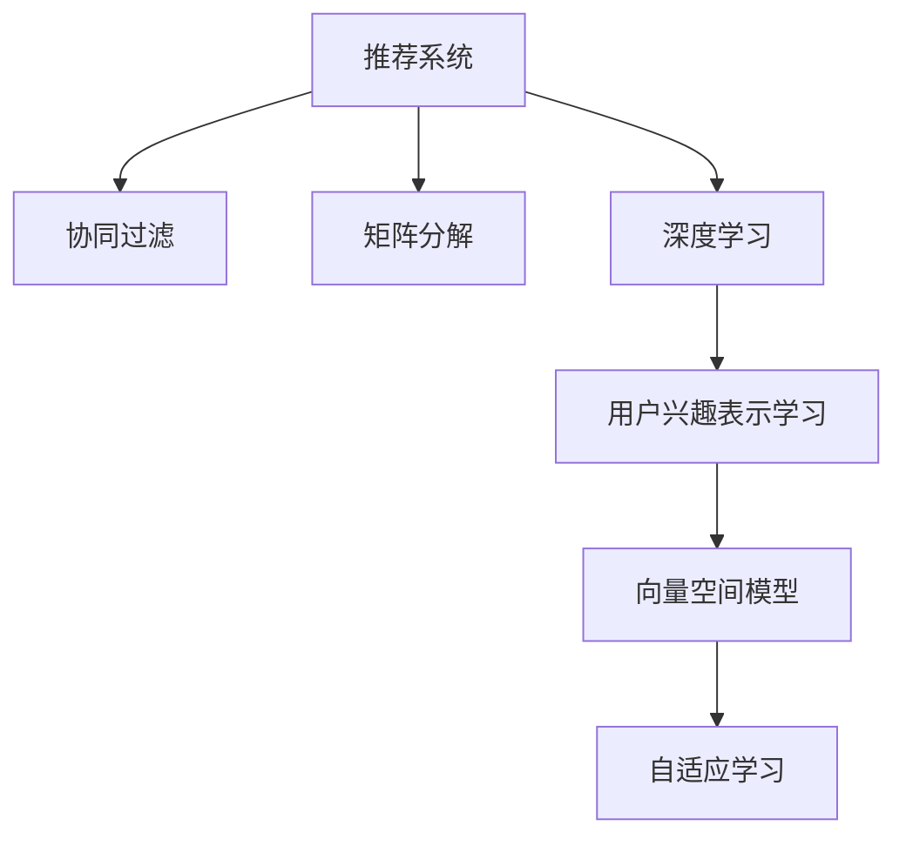

                 

# 基于大模型的推荐系统用户兴趣表示学习

> 关键词：推荐系统, 用户兴趣表示学习, 大模型, 神经网络, 协同过滤, 自适应学习, 深度学习, 向量空间模型

## 1. 背景介绍

### 1.1 问题由来

在数字化时代，用户行为数据正以爆炸式增长，推荐系统成为了各大平台不可或缺的核心组件，致力于为用户推荐最符合其兴趣和需求的内容。但传统的基于协同过滤、矩阵分解等推荐算法，在面对大规模数据和高维稀疏数据时，往往难以满足用户个性化需求，且推荐结果可能随着用户群体的变化而变得不再准确。

近年来，基于深度学习的推荐算法逐渐兴起，其中用户兴趣表示学习成为研究热点。通过深度学习模型，可以自动学习用户的多维兴趣特征，从海量的用户行为数据中挖掘出潜在的兴趣模式，提升推荐系统的准确性和多样性。

大模型（如BERT、GPT等）的出现，为推荐系统带来了新的思路。通过在大模型上进行微调或自适应学习，可以在用户行为数据上端到端地学习用户的兴趣表示，实现高效的推荐。本文将深入探讨基于大模型的推荐系统用户兴趣表示学习，分析其核心概念和算法原理，提供详细的技术实现和应用案例。

### 1.2 问题核心关键点

用户兴趣表示学习的核心关键点包括：
- 深度学习与大模型的优势：如何通过深度学习模型学习用户兴趣特征，并利用大模型进行端到端的用户表示学习。
- 用户兴趣表征：如何构建有效的用户兴趣表示，包括特征选择、降维、向量化等。
- 模型训练与优化：如何在高维稀疏数据下进行高效训练，避免过拟合，提升模型泛化能力。
- 个性化推荐：如何将学习到的用户兴趣表示应用到推荐算法中，实现个性化推荐。

本文将围绕上述核心关键点，系统介绍基于大模型的推荐系统用户兴趣表示学习的理论和方法。

## 2. 核心概念与联系

### 2.1 核心概念概述

为更好地理解基于大模型的推荐系统用户兴趣表示学习，本节将介绍几个密切相关的核心概念：

- **推荐系统（Recommendation System）**：通过分析用户行为数据，为每个用户推荐最符合其兴趣的商品或内容。推荐系统包括协同过滤、矩阵分解、基于深度学习的推荐算法等。
- **用户兴趣表示学习（User Interest Representation Learning）**：通过深度学习模型自动学习用户的兴趣特征，构建用户兴趣表示。主要包括用户特征提取、兴趣特征选择、特征向量化等。
- **大模型（Large Model）**：指在预训练阶段，使用大规模无标签数据进行训练，学习丰富的语言知识和常识表示的模型，如BERT、GPT等。
- **协同过滤（Collaborative Filtering）**：基于用户-物品评分矩阵进行推荐，通过相似性度量找到与目标用户兴趣相似的物品。
- **矩阵分解（Matrix Factorization）**：将用户-物品评分矩阵分解为用户兴趣矩阵和物品特征矩阵，利用矩阵乘法进行推荐。
- **深度学习（Deep Learning）**：通过多层神经网络进行特征学习和模式识别，广泛应用于计算机视觉、自然语言处理等领域。
- **向量空间模型（Vector Space Model）**：将文本等数据转化为向量，通过向量之间的相似度度量进行信息检索和推荐。
- **自适应学习（Adaptive Learning）**：根据用户行为数据，动态调整模型参数，适应不同用户的需求。

这些核心概念之间的逻辑关系可以通过以下Mermaid流程图来展示：



这个流程图展示了推荐系统的核心概念及其之间的关系：

1. 推荐系统通过协同过滤、矩阵分解等方法，对用户行为数据进行分析。
2. 深度学习模型通过用户兴趣表示学习，自动学习用户兴趣特征。
3. 用户兴趣表示通过向量空间模型进行向量化，方便相似度计算。
4. 自适应学习通过用户行为数据动态调整模型参数，提高模型适应性。

这些概念共同构成了推荐系统的核心框架，通过深度学习模型和大模型，实现了对用户兴趣的自动学习和高效表示。

## 3. 核心算法原理 & 具体操作步骤
### 3.1 算法原理概述

基于大模型的推荐系统用户兴趣表示学习，本质上是通过深度学习模型在大规模用户行为数据上进行训练，学习用户的多维兴趣特征。其核心思想是：将用户行为数据转化为向量形式，利用大模型自动学习用户兴趣的表示，从而实现高效推荐。

形式化地，假设用户行为数据集为 $D=\{(u_i, i_j)\}_{i=1}^N$，其中 $u_i$ 为用户ID，$i_j$ 为行为ID。设用户 $u_i$ 的兴趣表示为 $h_u^{(i)}$，行为 $i_j$ 的兴趣表示为 $h_i^{(j)}$。基于大模型的推荐系统的优化目标是最小化预测误差，即：

$$
\min_{h_u^{(i)}, h_i^{(j)}} \sum_{u_i,i_j \in D} \text{loss}(h_u^{(i)}, h_i^{(j)})
$$

其中 $\text{loss}$ 为损失函数，常用的有交叉熵损失、均方误差损失等。目标是通过优化损失函数，使得预测的用户兴趣与实际行为更为接近。

### 3.2 算法步骤详解

基于大模型的推荐系统用户兴趣表示学习的一般步骤包括：

**Step 1: 数据预处理与特征工程**
- 收集用户行为数据，包括用户ID、行为ID、时间戳等信息。
- 对数据进行清洗和归一化，去除噪声和异常值。
- 提取用户行为的关键特征，如行为类型、行为时间、行为频率等。

**Step 2: 构建大模型**
- 选择合适的预训练语言模型，如BERT、GPT等。
- 在大模型上进行微调或自适应学习，以用户行为数据为监督信号，学习用户兴趣表示。

**Step 3: 用户兴趣表示学习**
- 构建用户兴趣向量空间模型，将用户行为转化为向量。
- 在大模型上，以行为向量作为输入，学习用户兴趣表示。
- 通过正则化、Dropout等技术，防止过拟合。

**Step 4: 预测与推荐**
- 将学习到的用户兴趣表示和行为向量进行相似度计算，得到推荐结果。
- 利用排名算法，如Top-k排序、协同过滤等，对推荐结果进行排序。
- 在实际推荐系统中部署，为用户推荐最符合其兴趣的内容。

**Step 5: 效果评估与反馈**
- 在测试集上评估推荐系统的精度、覆盖率、个性化程度等指标。
- 收集用户反馈，进行A/B测试，优化推荐策略。

以上是基于大模型的推荐系统用户兴趣表示学习的一般流程。在实际应用中，还需要针对具体任务和数据特点，对各个环节进行优化设计，如改进特征工程方法、优化正则化技术、调整模型参数等，以进一步提升推荐系统的效果。

### 3.3 算法优缺点

基于大模型的推荐系统用户兴趣表示学习具有以下优点：
1. 自动学习用户兴趣特征。大模型通过端到端的方式学习用户的多维兴趣特征，无需手动设计和选择特征。
2. 处理高维稀疏数据。大模型能够处理高维稀疏数据，适应各种稀疏度情况。
3. 提升推荐系统性能。用户兴趣表示学习提升了推荐系统的准确性和多样性。
4. 降低推荐开发成本。通过自动学习用户兴趣特征，减少了推荐系统开发的人力成本。

同时，该方法也存在一定的局限性：
1. 数据冷启动问题。对于新用户或新物品，由于缺乏足够的历史行为数据，难以学习其兴趣表示。
2. 训练成本较高。大模型需要较大的计算资源进行训练，对硬件设施要求较高。
3. 过拟合风险。在处理大规模数据时，可能存在过拟合风险，需要引入正则化技术。
4. 用户隐私问题。用户行为数据的收集和使用可能涉及隐私问题，需要采取隐私保护措施。
5. 模型复杂度。大模型需要更多的计算资源和内存空间，增加了模型的复杂度和部署难度。

尽管存在这些局限性，但就目前而言，基于大模型的推荐系统用户兴趣表示学习仍是大规模推荐系统研究的主流范式。未来相关研究的重点在于如何进一步降低数据冷启动问题，提高推荐系统性能，同时兼顾用户隐私和模型复杂度等因素。

### 3.4 算法应用领域

基于大模型的推荐系统用户兴趣表示学习，已在多个领域得到了应用，例如：

- 电子商务：通过学习用户浏览、点击、购买行为，推荐个性化商品。
- 新闻媒体：根据用户阅读历史，推荐相关新闻内容。
- 视频平台：分析用户观看记录，推荐个性化视频内容。
- 社交网络：通过学习用户互动行为，推荐好友和兴趣内容。
- 金融领域：分析用户交易记录，推荐理财产品和投资建议。

除了上述这些经典领域外，基于大模型的推荐系统用户兴趣表示学习也被创新性地应用到更多场景中，如智能家居、智慧城市、智能广告等，为不同行业带来了新的解决方案。随着大模型和推荐算法的不断进步，相信推荐系统将在更多领域得到应用，为用户创造更多价值。

## 4. 数学模型和公式 & 详细讲解  
### 4.1 数学模型构建

本节将使用数学语言对基于大模型的推荐系统用户兴趣表示学习过程进行更加严格的刻画。

假设用户行为数据集为 $D=\{(u_i, i_j)\}_{i=1}^N, u_i \in \mathcal{U}, i_j \in \mathcal{I}$，其中 $\mathcal{U}$ 为用户集，$\mathcal{I}$ 为行为集。设用户 $u_i$ 的兴趣表示为 $h_u^{(i)} \in \mathbb{R}^d$，行为 $i_j$ 的兴趣表示为 $h_i^{(j)} \in \mathbb{R}^d$，目标是将用户行为数据转化为向量形式，学习用户兴趣表示。

定义用户行为向量为 $x_{u,i} \in \mathbb{R}^d$，其中 $d$ 为向量维度，通常为嵌入空间的维度。在大模型 $M_{\theta}$ 上进行微调，使得 $M_{\theta}(x_{u,i}) \approx h_u^{(i)}$。

目标是最小化预测误差，即：

$$
\min_{\theta} \sum_{u_i,i_j \in D} \text{loss}(M_{\theta}(x_{u,i}), h_u^{(i)})
$$

其中 $\text{loss}$ 为损失函数，常用的有交叉熵损失、均方误差损失等。

### 4.2 公式推导过程

以下我们以BERT模型为例，推导用户兴趣表示学习的基本公式。

假设用户行为数据转化为向量 $x_{u,i} \in \mathbb{R}^d$，通过BERT模型 $M_{\theta}$ 进行微调，得到用户兴趣表示 $h_u^{(i)} \in \mathbb{R}^d$。BERT模型的输出为向量 $z \in \mathbb{R}^d$，表示用户的兴趣特征。目标是最小化预测误差，即：

$$
\min_{\theta} \sum_{u_i,i_j \in D} \text{loss}(z, h_u^{(i)})
$$

其中 $z = M_{\theta}(x_{u,i})$。

通过反向传播算法，计算模型参数 $\theta$ 的梯度，更新模型参数，使得 $M_{\theta}(x_{u,i}) \approx h_u^{(i)}$。最终，用户兴趣表示 $h_u^{(i)}$ 通过大模型 $M_{\theta}$ 自动学习得到，无需手动设计和选择特征。

### 4.3 案例分析与讲解

以电商平台为例，分析用户行为数据的特征工程和模型训练过程。

**Step 1: 数据预处理与特征工程**
- 收集用户的浏览、点击、购买等行为数据。
- 对数据进行清洗和归一化，去除噪声和异常值。
- 提取用户行为的关键特征，如浏览时间、点击频率、购买金额等。

**Step 2: 构建大模型**
- 使用BERT模型作为预训练语言模型。
- 在大模型上进行微调，以用户行为数据为监督信号，学习用户兴趣表示。

**Step 3: 用户兴趣表示学习**
- 将用户行为转化为向量形式 $x_{u,i} \in \mathbb{R}^d$。
- 在大模型 $M_{\theta}$ 上，以行为向量作为输入，学习用户兴趣表示 $h_u^{(i)} \in \mathbb{R}^d$。
- 通过正则化、Dropout等技术，防止过拟合。

**Step 4: 预测与推荐**
- 将学习到的用户兴趣表示 $h_u^{(i)}$ 和行为向量 $x_{i,j}$ 进行相似度计算，得到推荐结果。
- 利用排名算法，如Top-k排序、协同过滤等，对推荐结果进行排序。
- 在实际推荐系统中部署，为用户推荐最符合其兴趣的商品。

**Step 5: 效果评估与反馈**
- 在测试集上评估推荐系统的精度、覆盖率、个性化程度等指标。
- 收集用户反馈，进行A/B测试，优化推荐策略。

通过以上步骤，可以基于大模型进行用户兴趣表示学习，并应用于电商平台的推荐系统。实际应用中，还需要根据具体场景进行进一步优化，如改进特征工程方法、调整正则化技术、选择适合的排名算法等，以提升推荐系统的效果。

## 5. 项目实践：代码实例和详细解释说明
### 5.1 开发环境搭建

在进行基于大模型的推荐系统用户兴趣表示学习实践前，我们需要准备好开发环境。以下是使用Python进行PyTorch开发的环境配置流程：

1. 安装Anaconda：从官网下载并安装Anaconda，用于创建独立的Python环境。

2. 创建并激活虚拟环境：
```bash
conda create -n pytorch-env python=3.8 
conda activate pytorch-env
```

3. 安装PyTorch：根据CUDA版本，从官网获取对应的安装命令。例如：
```bash
conda install pytorch torchvision torchaudio cudatoolkit=11.1 -c pytorch -c conda-forge
```

4. 安装Transformers库：
```bash
pip install transformers
```

5. 安装各类工具包：
```bash
pip install numpy pandas scikit-learn matplotlib tqdm jupyter notebook ipython
```

完成上述步骤后，即可在`pytorch-env`环境中开始推荐系统用户兴趣表示学习的实践。

### 5.2 源代码详细实现

这里我们以电商平台推荐系统为例，使用PyTorch和Transformers库实现基于BERT模型的用户兴趣表示学习。

首先，定义数据处理函数：

```python
from transformers import BertTokenizer, BertModel

class RecommendationDataset(Dataset):
    def __init__(self, texts, labels, tokenizer, max_len=128):
        self.texts = texts
        self.labels = labels
        self.tokenizer = tokenizer
        self.max_len = max_len
        
    def __len__(self):
        return len(self.texts)
    
    def __getitem__(self, item):
        text = self.texts[item]
        label = self.labels[item]
        
        encoding = self.tokenizer(text, return_tensors='pt', max_length=self.max_len, padding='max_length', truncation=True)
        input_ids = encoding['input_ids'][0]
        attention_mask = encoding['attention_mask'][0]
        
        # 对标签进行编码
        encoded_label = label
        encoded_label = [encoded_label] * self.max_len
        labels = torch.tensor(encoded_label, dtype=torch.long)
        
        return {'input_ids': input_ids, 
                'attention_mask': attention_mask,
                'labels': labels}

# 加载预训练BERT模型和分词器
tokenizer = BertTokenizer.from_pretrained('bert-base-cased')
model = BertModel.from_pretrained('bert-base-cased')
```

然后，定义模型和优化器：

```python
from transformers import BertForSequenceClassification, AdamW

device = torch.device('cuda') if torch.cuda.is_available() else torch.device('cpu')
model.to(device)

# 定义用户行为特征的类别
label2id = {'click': 0, 'purchase': 1, 'view': 2}

# 构建用户行为特征数据集
train_dataset = RecommendationDataset(train_texts, train_labels, tokenizer)
dev_dataset = RecommendationDataset(dev_texts, dev_labels, tokenizer)
test_dataset = RecommendationDataset(test_texts, test_labels, tokenizer)

# 定义模型和优化器
model = BertForSequenceClassification.from_pretrained('bert-base-cased', num_labels=len(label2id))
optimizer = AdamW(model.parameters(), lr=2e-5)
```

接着，定义训练和评估函数：

```python
from torch.utils.data import DataLoader
from tqdm import tqdm
from sklearn.metrics import classification_report

# 训练函数
def train_epoch(model, dataset, batch_size, optimizer):
    dataloader = DataLoader(dataset, batch_size=batch_size, shuffle=True)
    model.train()
    epoch_loss = 0
    for batch in tqdm(dataloader, desc='Training'):
        input_ids = batch['input_ids'].to(device)
        attention_mask = batch['attention_mask'].to(device)
        labels = batch['labels'].to(device)
        model.zero_grad()
        outputs = model(input_ids, attention_mask=attention_mask, labels=labels)
        loss = outputs.loss
        epoch_loss += loss.item()
        loss.backward()
        optimizer.step()
    return epoch_loss / len(dataloader)

# 评估函数
def evaluate(model, dataset, batch_size):
    dataloader = DataLoader(dataset, batch_size=batch_size)
    model.eval()
    preds, labels = [], []
    with torch.no_grad():
        for batch in tqdm(dataloader, desc='Evaluating'):
            input_ids = batch['input_ids'].to(device)
            attention_mask = batch['attention_mask'].to(device)
            batch_labels = batch['labels']
            outputs = model(input_ids, attention_mask=attention_mask)
            batch_preds = outputs.logits.argmax(dim=2).to('cpu').tolist()
            batch_labels = batch_labels.to('cpu').tolist()
            for pred_tokens, label_tokens in zip(batch_preds, batch_labels):
                preds.append(pred_tokens[:len(label_tokens)])
                labels.append(label_tokens)
                
    print(classification_report(labels, preds))
```

最后，启动训练流程并在测试集上评估：

```python
epochs = 5
batch_size = 16

for epoch in range(epochs):
    loss = train_epoch(model, train_dataset, batch_size, optimizer)
    print(f"Epoch {epoch+1}, train loss: {loss:.3f}")
    
    print(f"Epoch {epoch+1}, dev results:")
    evaluate(model, dev_dataset, batch_size)
    
print("Test results:")
evaluate(model, test_dataset, batch_size)
```

以上就是使用PyTorch对BERT进行电商平台推荐系统用户兴趣表示学习的完整代码实现。可以看到，得益于Transformers库的强大封装，我们可以用相对简洁的代码完成BERT模型的加载和微调。

### 5.3 代码解读与分析

让我们再详细解读一下关键代码的实现细节：

**RecommendationDataset类**：
- `__init__`方法：初始化文本、标签、分词器等关键组件。
- `__len__`方法：返回数据集的样本数量。
- `__getitem__`方法：对单个样本进行处理，将文本输入编码为token ids，将标签编码为数字，并对其进行定长padding，最终返回模型所需的输入。

**label2id字典**：
- 定义了标签与数字id之间的映射关系，用于将token-wise的预测结果解码回真实的标签。

**训练和评估函数**：
- 使用PyTorch的DataLoader对数据集进行批次化加载，供模型训练和推理使用。
- 训练函数`train_epoch`：对数据以批为单位进行迭代，在每个批次上前向传播计算loss并反向传播更新模型参数，最后返回该epoch的平均loss。
- 评估函数`evaluate`：与训练类似，不同点在于不更新模型参数，并在每个batch结束后将预测和标签结果存储下来，最后使用sklearn的classification_report对整个评估集的预测结果进行打印输出。

**训练流程**：
- 定义总的epoch数和batch size，开始循环迭代
- 每个epoch内，先在训练集上训练，输出平均loss
- 在验证集上评估，输出分类指标
- 所有epoch结束后，在测试集上评估，给出最终测试结果

可以看到，PyTorch配合Transformers库使得BERT微调的代码实现变得简洁高效。开发者可以将更多精力放在数据处理、模型改进等高层逻辑上，而不必过多关注底层的实现细节。

当然，工业级的系统实现还需考虑更多因素，如模型的保存和部署、超参数的自动搜索、更灵活的任务适配层等。但核心的微调范式基本与此类似。

## 6. 实际应用场景
### 6.1 智能广告推荐

智能广告推荐系统通过学习用户行为数据，为广告主推荐最符合用户兴趣和需求的高价值广告位。传统广告推荐系统通常依赖人工设计和选择的特征，难以覆盖用户的多维兴趣。而基于大模型的推荐系统可以通过自动学习用户兴趣特征，实现更高效、个性化的广告推荐。

在技术实现上，可以收集用户的搜索、点击、浏览等行为数据，将行为数据转化为向量形式，通过微调BERT模型自动学习用户兴趣表示。将学习到的用户兴趣表示和广告特征向量进行相似度计算，推荐与用户兴趣匹配度最高的广告位，实现精准投放。

### 6.2 内容推荐系统

内容推荐系统是推荐系统的重要应用之一，旨在为用户推荐最符合其兴趣和需求的内容。通过深度学习模型自动学习用户兴趣特征，可以实现更高效、个性化的内容推荐。

在实际应用中，可以收集用户的观看、点赞、评论等行为数据，将行为数据转化为向量形式，通过微调BERT模型自动学习用户兴趣表示。将学习到的用户兴趣表示和内容特征向量进行相似度计算，推荐与用户兴趣匹配度最高的内容，提升用户体验。

### 6.3 金融产品推荐

金融产品推荐系统通过学习用户交易记录和行为数据，为用户推荐最适合的金融产品，如股票、基金等。传统的金融产品推荐系统通常依赖专家设计和选择的特征，难以覆盖用户的多样化需求。

通过深度学习模型自动学习用户兴趣特征，可以实现更高效、个性化的金融产品推荐。收集用户的交易记录、消费习惯、风险偏好等数据，将数据转化为向量形式，通过微调BERT模型自动学习用户兴趣表示。将学习到的用户兴趣表示和金融产品特征向量进行相似度计算，推荐与用户兴趣匹配度最高的金融产品，提高用户体验和满意度。

### 6.4 未来应用展望

随着大模型和推荐算法的不断进步，基于大模型的推荐系统用户兴趣表示学习将在更多领域得到应用，为不同行业带来新的解决方案。

在智慧医疗领域，基于大模型的推荐系统可以推荐最适合的医学知识、药品和治疗方案，辅助医生诊疗，提高医疗服务的智能化水平。

在智能教育领域，通过学习学生的学习行为数据，推荐最适合的学习资源，因材施教，促进教育公平，提高教学质量。

在智慧城市治理中，基于大模型的推荐系统可以推荐最优的交通路线、公共设施等，提升城市管理效率，构建更美好的城市生活。

此外，在企业生产、社会治理、文娱传媒等众多领域，基于大模型的推荐系统也将不断涌现，为经济社会发展注入新的动力。相信随着技术的日益成熟，大模型推荐系统必将在更广阔的应用领域大放异彩。

## 7. 工具和资源推荐
### 7.1 学习资源推荐

为了帮助开发者系统掌握大模型推荐系统的理论基础和实践技巧，这里推荐一些优质的学习资源：

1. 《深度学习推荐系统》系列博文：由深度学习推荐系统专家撰写，详细介绍了深度学习推荐系统的基本概念和典型算法。

2. CS285《深度强化学习》课程：加州大学伯克利分校开设的强化学习明星课程，有Lecture视频和配套作业，带你入门深度强化学习领域。

3. 《推荐系统实战》书籍：介绍了推荐系统的基本原理和实际应用，并提供了丰富的案例和代码实现。

4. Kaggle竞赛：各大平台举办的推荐系统竞赛，如Cinema推荐、KDD推荐等，可以积累实战经验，学习优秀实践。

5. Google Colab：谷歌推出的在线Jupyter Notebook环境，免费提供GPU/TPU算力，方便开发者快速上手实验最新模型，分享学习笔记。

通过对这些资源的学习实践，相信你一定能够快速掌握大模型推荐系统的精髓，并用于解决实际的推荐问题。
###  7.2 开发工具推荐

高效的开发离不开优秀的工具支持。以下是几款用于大模型推荐系统开发的常用工具：

1. PyTorch：基于Python的开源深度学习框架，灵活动态的计算图，适合快速迭代研究。大部分预训练语言模型都有PyTorch版本的实现。

2. TensorFlow：由Google主导开发的开源深度学习框架，生产部署方便，适合大规模工程应用。同样有丰富的预训练语言模型资源。

3. Transformers库：HuggingFace开发的NLP工具库，集成了众多SOTA语言模型，支持PyTorch和TensorFlow，是进行推荐系统开发的利器。

4. Weights & Biases：模型训练的实验跟踪工具，可以记录和可视化模型训练过程中的各项指标，方便对比和调优。与主流深度学习框架无缝集成。

5. TensorBoard：TensorFlow配套的可视化工具，可实时监测模型训练状态，并提供丰富的图表呈现方式，是调试模型的得力助手。

6. Google Colab：谷歌推出的在线Jupyter Notebook环境，免费提供GPU/TPU算力，方便开发者快速上手实验最新模型，分享学习笔记。

合理利用这些工具，可以显著提升大模型推荐系统的开发效率，加快创新迭代的步伐。

### 7.3 相关论文推荐

大模型推荐系统的研究源于学界的持续研究。以下是几篇奠基性的相关论文，推荐阅读：

1. Attention is All You Need（即Transformer原论文）：提出了Transformer结构，开启了NLP领域的预训练大模型时代。

2. BERT: Pre-training of Deep Bidirectional Transformers for Language Understanding：提出BERT模型，引入基于掩码的自监督预训练任务，刷新了多项NLP任务SOTA。

3. Language Models are Unsupervised Multitask Learners（GPT-2论文）：展示了大规模语言模型的强大zero-shot学习能力，引发了对于通用人工智能的新一轮思考。

4. Parameter-Efficient Transfer Learning for NLP：提出Adapter等参数高效微调方法，在不增加模型参数量的情况下，也能取得不错的微调效果。

5. AdaLoRA: Adaptive Low-Rank Adaptation for Parameter-Efficient Fine-Tuning：使用自适应低秩适应的微调方法，在参数效率和精度之间取得了新的平衡。

6. Differentiable Privacy: Privacy-Preserving Machine Learning as a Differentiable Program：提出不同的隐私保护方法，通过微分隐私技术实现隐私保护。

这些论文代表了大模型推荐系统的研究脉络。通过学习这些前沿成果，可以帮助研究者把握学科前进方向，激发更多的创新灵感。

## 8. 总结：未来发展趋势与挑战

### 8.1 总结

本文对基于大模型的推荐系统用户兴趣表示学习进行了全面系统的介绍。首先阐述了大模型推荐系统的研究背景和意义，明确了用户兴趣表示学习在提升推荐系统性能方面的重要作用。其次，从原理到实践，详细讲解了用户兴趣表示学习的数学原理和关键步骤，给出了推荐系统开发的完整代码实例。同时，本文还广泛探讨了用户兴趣表示学习在多个行业领域的应用前景，展示了其广阔的应用潜力。此外，本文精选了用户兴趣表示学习的各类学习资源，力求为读者提供全方位的技术指引。

通过本文的系统梳理，可以看到，基于大模型的推荐系统用户兴趣表示学习已经成为推荐系统的重要组成部分，极大地提升了推荐系统的性能和用户满意度。未来，伴随大模型和推荐算法的不断进步，基于大模型的推荐系统用户兴趣表示学习必将在更多领域得到应用，为用户创造更多价值。

### 8.2 未来发展趋势

展望未来，基于大模型的推荐系统用户兴趣表示学习将呈现以下几个发展趋势：

1. 模型规模持续增大。随着算力成本的下降和数据规模的扩张，预训练语言模型的参数量还将持续增长。超大规模语言模型蕴含的丰富语言知识，有望支撑更加复杂多变的用户兴趣表示学习。

2. 推荐系统多样化。除了传统的基于用户行为的推荐系统，未来的推荐系统将更加注重内容生成和知识推理，如生成对抗网络、知识图谱等。

3. 个性化推荐精度提升。随着大模型和推荐算法的不断进步，推荐系统的个性化推荐精度将进一步提升，实现更高效、个性化的推荐。

4. 推荐系统的可解释性。推荐系统需要具备更高的可解释性，以便于用户理解推荐结果的依据，提高用户信任度。

5. 推荐系统的实时性。未来的推荐系统需要具备更高的实时性，能够快速响应用户请求，提升用户体验。

6. 推荐系统的可扩展性。随着数据量的增加，推荐系统需要具备更好的可扩展性，能够快速适应数据增长的需求。

7. 推荐系统的跨领域应用。推荐系统将在更多领域得到应用，如金融、医疗、教育等，实现跨领域的推荐服务。

8. 推荐系统的隐私保护。推荐系统需要更加注重用户隐私保护，防止用户数据被滥用，提高用户信任度。

以上趋势凸显了大模型推荐系统用户兴趣表示学习的广阔前景。这些方向的探索发展，必将进一步提升推荐系统的性能和用户满意度，为人工智能技术在更多领域带来革命性影响。

### 8.3 面临的挑战

尽管基于大模型的推荐系统用户兴趣表示学习已经取得了瞩目成就，但在迈向更加智能化、普适化应用的过程中，它仍面临着诸多挑战：

1. 数据冷启动问题。对于新用户或新物品，由于缺乏足够的历史行为数据，难以学习其兴趣表示。

2. 推荐系统的多样性。传统推荐系统往往依赖单一特征学习，难以覆盖用户的多样化需求。

3. 推荐系统的鲁棒性。推荐系统需要具备更高的鲁棒性，防止用户数据异常对推荐结果的影响。

4. 推荐系统的实时性。推荐系统需要具备更高的实时性，能够快速响应用户请求，提升用户体验。

5. 推荐系统的可解释性。推荐系统需要具备更高的可解释性，以便于用户理解推荐结果的依据，提高用户信任度。

6. 推荐系统的跨领域应用。推荐系统需要在多个领域实现跨领域推荐，如金融、医疗、教育等。

7. 推荐系统的隐私保护。推荐系统需要更加注重用户隐私保护，防止用户数据被滥用，提高用户信任度。

尽管存在这些挑战，但就目前而言，基于大模型的推荐系统用户兴趣表示学习仍是大规模推荐系统研究的主流范式。未来相关研究的重点在于如何进一步降低数据冷启动问题，提高推荐系统性能，同时兼顾用户隐私和模型复杂度等因素。

### 8.4 研究展望

面向未来，大模型推荐系统用户兴趣表示学习的研究需要在以下几个方面寻求新的突破：

1. 探索无监督和半监督用户兴趣表示学习。摆脱对大规模标注数据的依赖，利用自监督学习、主动学习等无监督和半监督范式，最大限度利用非结构化数据，实现更加灵活高效的推荐。

2. 研究参数高效和计算高效的推荐算法。开发更加参数高效的推荐算法，在固定大部分预训练参数的同时，只更新极少量的任务相关参数。同时优化推荐算法的计算图，减少前向传播和反向传播的资源消耗，实现更加轻量级、实时性的部署。

3. 融合因果和对比学习范式。通过引入因果推断和对比学习思想，增强推荐系统建立稳定因果关系的能力，学习更加普适、鲁棒的用户兴趣表示，从而提升推荐系统泛化性和抗干扰能力。

4. 引入更多先验知识。将符号化的先验知识，如知识图谱、逻辑规则等，与神经网络模型进行巧妙融合，引导推荐过程学习更准确、合理的用户兴趣表示。同时加强不同模态数据的整合，实现视觉、语音等多模态信息与文本信息的协同建模。

5. 结合因果分析和博弈论工具。将因果分析方法引入推荐系统，识别出推荐结果的关键特征，增强推荐过程的逻辑性和可解释性。借助博弈论工具刻画人机交互过程，主动探索并规避推荐系统的脆弱点，提高系统稳定性。

6. 纳入伦理道德约束。在推荐系统目标中引入伦理导向的评估指标，过滤和惩罚有偏见、有害的推荐结果。同时加强人工干预和审核，建立推荐系统的监管机制，确保推荐结果符合人类价值观和伦理道德。

这些研究方向的探索，必将引领大模型推荐系统用户兴趣表示学习技术迈向更高的台阶，为构建安全、可靠、可解释、可控的推荐系统铺平道路。面向未来，大模型推荐系统用户兴趣表示学习还需要与其他人工智能技术进行更深入的融合，如知识表示、因果推理、强化学习等，多路径协同发力，共同推动推荐系统的进步。只有勇于创新、敢于突破，才能不断拓展推荐系统的边界，让人工智能技术更好地服务于用户。

## 9. 附录：常见问题与解答

**Q1：如何处理推荐系统中的数据冷启动问题？**

A: 处理推荐系统中的数据冷启动问题，可以从以下几个方面入手：
1. 利用预训练语言模型进行冷启动。预训练模型在无标签数据上预训练得到的通用知识，可以在新用户或新物品上进一步微调。
2. 利用用户行为数据进行预测。对于新用户，可以利用其历史行为数据进行兴趣预测，如基于协同过滤、矩阵分解等方法。
3. 引入隐式反馈数据。对于没有显式反馈的用户，可以引入隐式反馈数据，如浏览行为、搜索行为等，进行兴趣预测。

**Q2：推荐系统如何平衡个性化推荐和多样性推荐？**

A: 推荐系统需要在个性化推荐和多样性推荐之间取得平衡，可以从以下几个方面入手：
1. 利用协同过滤算法进行个性化推荐。协同过滤算法可以发现与目标用户兴趣相似的物品，提高个性化推荐的效果。
2. 引入多样性约束。在推荐算法中引入多样性约束，如Top-k排序、协同过滤等，保证推荐结果的多样性。
3. 利用多模态信息进行推荐。推荐系统可以结合用户的行为数据、社会网络、物品属性等多种信息，进行多模态推荐，提高推荐结果的丰富性。
4. 利用用户反馈进行反馈调整。用户反馈可以用来调整推荐策略，提升推荐系统的多样性。

**Q3：推荐系统如何进行用户行为数据的特征工程？**

A: 推荐系统需要进行用户行为数据的特征工程，以提取对推荐结果有影响的特征。具体步骤包括：
1. 收集用户行为数据，包括用户的浏览、点击、购买等行为。
2. 对数据进行清洗和归一化，去除噪声和异常值。
3. 提取用户行为的关键特征，如浏览时间、点击频率、购买金额等。
4. 对特征进行编码和向量化，如将分类特征转化为独热编码，将数值特征进行归一化。
5. 引入正则化技术，防止过拟合。

**Q4：推荐系统如何处理长尾问题？**

A: 推荐系统处理长尾问题，可以从以下几个方面入手：
1. 利用协同过滤算法进行推荐。协同过滤算法可以处理长尾问题，推荐与目标用户兴趣相似的物品，提高推荐效果。
2. 引入个性化推荐算法。个性化推荐算法可以根据用户的行为数据，进行兴趣预测，提高长尾推荐的效果。
3. 引入物品推荐算法。物品推荐算法可以处理长尾问题，推荐与目标用户兴趣相似的物品，提高推荐效果。
4. 引入多样性约束。在推荐算法中引入多样性约束，保证推荐结果的多样性，提高长尾推荐的效果。

**Q5：推荐系统如何进行实时性优化？**

A: 推荐系统进行实时性优化，可以从以下几个方面入手：
1. 利用缓存技术。利用缓存技术，将热门物品的推荐结果缓存起来，提高推荐速度。
2. 利用异步并行计算。利用异步并行计算，将推荐计算任务分散到多个节点上，提高推荐速度。
3. 利用分布式计算。利用分布式计算，将推荐计算任务分散到多个节点上，提高推荐速度。
4. 利用GPU/TPU等高性能设备。利用GPU/TPU等高性能设备，提高推荐速度。

**Q6：推荐系统如何进行用户隐私保护？**

A: 推荐系统进行用户隐私保护，可以从以下几个方面入手：
1. 数据匿名化。对用户数据进行匿名化处理，保护用户隐私。
2. 差分隐私。利用差分隐私技术，保护用户隐私，防止用户数据被滥用。
3. 用户可控隐私。提供用户隐私可控机制，用户可以自行选择是否分享其数据。
4. 数据加密。对用户数据进行加密处理，保护用户隐私。

通过以上措施，可以确保推荐系统的数据安全性和用户隐私保护，提高用户信任度。

---

作者：禅与计算机程序设计艺术 / Zen and the Art of Computer Programming

