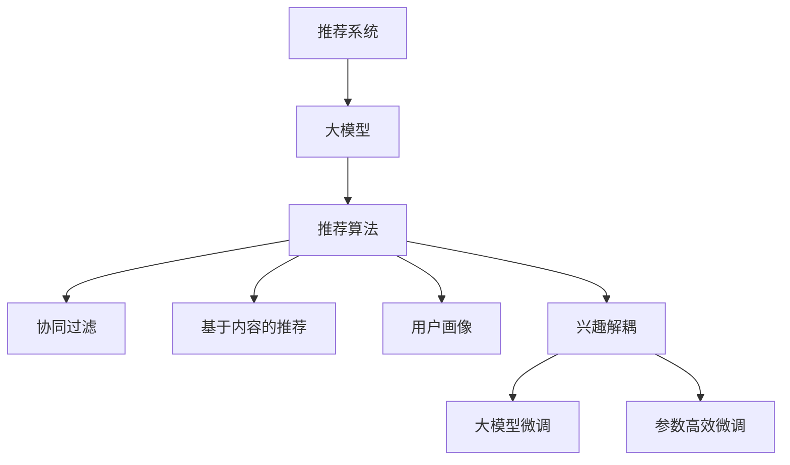

                 

# 基于大模型的推荐系统用户兴趣解耦

## 1. 背景介绍

### 1.1 问题由来
推荐系统是互联网平台提供个性化服务的重要手段，通过分析用户历史行为和偏好，预测并推荐符合用户兴趣的个性化内容，使用户能够快速找到感兴趣的信息，提高平台的使用粘性。传统的推荐系统主要依赖于用户-物品（U-I）矩阵、协同过滤、基于内容的推荐等技术。然而，这些方法往往面临数据稀疏、信息过载、用户画像不全面等问题。近年来，深度学习技术引入推荐系统，通过对用户和物品嵌入表示的训练，利用用户-物品的交互历史，实现更精准的推荐。然而，用户行为数据在短时间内发生剧烈变化，且用户兴趣具有复杂动态特性，这些深度学习模型仍然难以准确捕捉到用户动态变化的需求。

为了解决这个问题，本文提出了一种基于大模型的推荐系统用户兴趣解耦方法。该方法在大模型上进行微调，利用大模型学到的丰富语义信息，更全面地刻画用户兴趣，同时减少用户历史行为对当前兴趣的影响，实现用户兴趣解耦。通过基于大规模语料库训练的大模型，能够在保持预测精度的前提下，降低模型对用户历史行为的依赖，从而更灵活地适应用户兴趣的变化，提升推荐系统的效果。

### 1.2 问题核心关键点
本文的核心思想是：通过基于大模型的推荐系统用户兴趣解耦，使用大模型在多种语料上进行预训练，引入更丰富的语义信息，同时减少用户历史行为对当前兴趣的影响，提升推荐系统的准确性和鲁棒性。具体而言，该方法包含以下关键步骤：
1. 构建大模型在多种语料上的预训练数据集，对大模型进行预训练。
2. 在大模型上进行微调，增加用户-兴趣交互模块，减少用户历史行为对当前兴趣的影响。
3. 在微调后的大模型上进行推荐预测，并利用用户历史行为数据进行多维度画像更新。
4. 将用户画像与大模型进行融合，实现更加全面、精准的推荐。

## 2. 核心概念与联系

### 2.1 核心概念概述

为更好地理解基于大模型的推荐系统用户兴趣解耦方法，本节将介绍几个密切相关的核心概念：

- 推荐系统(Recommendation System)：通过分析用户的历史行为和兴趣，预测并推荐符合用户需求的内容或商品的系统。
- 大模型(Large Model)：指在超大规模数据集上进行预训练的大型神经网络模型，如BERT、GPT-3等。
- 推荐算法(Recommendation Algorithm)：对用户和物品进行嵌入表示，构建预测模型，从而进行推荐。
- 协同过滤(Collaborative Filtering)：根据用户和物品的历史交互，推断用户和物品之间的相似度，实现推荐。
- 基于内容的推荐(Content-based Recommendation)：根据物品的属性信息，预测用户对物品的兴趣。
- 用户画像(User Profile)：根据用户行为数据和兴趣标签，构建用户特征向量，刻画用户兴趣。
- 兴趣解耦(Interest Decoupling)：通过模型优化，减少用户历史行为对当前兴趣的影响，提升推荐精度。
- 大模型微调(Fine-tuning)：在大模型基础上，使用下游任务的少量标注数据，进行有监督的微调优化。
- 参数高效微调(Parameter-Efficient Fine-tuning, PEFT)：仅更新少量模型参数，固定大部分预训练权重不变，以提高微调效率。

这些核心概念之间的逻辑关系可以通过以下Mermaid流程图来展示：



这个流程图展示了推荐系统中的关键流程和模块，包括大模型的引入、推荐算法的实现、用户画像的构建以及兴趣解耦的优化等。这些模块共同构成了推荐系统的核心，通过大模型的引入和优化，进一步提升了推荐系统的准确性和鲁棒性。

## 3. 核心算法原理 & 具体操作步骤
### 3.1 算法原理概述

基于大模型的推荐系统用户兴趣解耦方法，在大模型上进行微调，利用大模型学到的丰富语义信息，更全面地刻画用户兴趣，同时减少用户历史行为对当前兴趣的影响，提升推荐系统的效果。

形式化地，假设用户历史行为矩阵为 $U=\{u_{ij}\}_{i=1}^M \times \{j=1}^N$，其中 $u_{ij}=1$ 表示用户 $i$ 在物品 $j$ 上发生过交互，$u_{ij}=0$ 表示未发生过交互。设 $D$ 为基于大模型的推荐系统的训练集，$I$ 为用户兴趣向量，$P$ 为用户画像向量，$X$ 为物品特征向量，$W$ 为权重矩阵。该方法的目标是最大化推荐系统的预测精度，即：

$$
\max_{W} \mathbb{E}_{U,D}[\sum_{i=1}^M \sum_{j=1}^N (w_{ij} \times I_j \times P_i \times X_j)]
$$

其中，$w_{ij}$ 为物品 $j$ 对用户 $i$ 的权重，$I_j$ 为物品 $j$ 对用户 $i$ 的兴趣度，$P_i$ 为用户 $i$ 的画像向量，$X_j$ 为物品 $j$ 的特征向量。

### 3.2 算法步骤详解

基于大模型的推荐系统用户兴趣解耦方法，包括以下关键步骤：

**Step 1: 构建预训练数据集**
- 收集不同语料库的文本数据，如新闻、社交媒体、书籍等，构建预训练数据集 $D$。
- 将文本数据进行预处理，如分词、去停用词、标准化等。

**Step 2: 预训练大模型**
- 选择大模型（如BERT、GPT-3）作为初始化参数，使用预训练数据集 $D$ 在大模型上进行微调。
- 微调时，使用语言模型的掩码预测任务、文本分类任务、文本生成任务等，使得大模型学到了丰富的语义信息。

**Step 3: 添加用户-兴趣交互模块**
- 在大模型顶层增加用户-兴趣交互模块，用于计算用户对物品的兴趣度。
- 根据用户兴趣度计算权重 $w_{ij}$，引入到推荐模型中。

**Step 4: 减少历史行为对当前兴趣的影响**
- 在大模型上进行微调，增加用户-兴趣交互模块，减少用户历史行为对当前兴趣的影响。
- 使用正则化技术，如L2正则、Dropout等，防止模型过拟合。

**Step 5: 多维度画像更新**
- 利用用户历史行为数据，构建用户画像向量 $P_i$。
- 利用用户画像向量 $P_i$ 更新用户兴趣向量 $I_j$，提高模型预测的准确性。

**Step 6: 融合大模型和用户画像**
- 将用户画像向量 $P_i$ 与大模型得到的兴趣向量 $I_j$ 进行融合，得到最终的推荐结果。
- 使用模型预测用户对物品的兴趣，并选择最符合用户兴趣的物品推荐。

### 3.3 算法优缺点

基于大模型的推荐系统用户兴趣解耦方法，具有以下优点：
1. 利用大模型学到的丰富语义信息，提升推荐精度和鲁棒性。
2. 减少用户历史行为对当前兴趣的影响，提升推荐系统的实时性和灵活性。
3. 融合用户画像与大模型，实现更加全面、精准的推荐。
4. 参数高效微调，减少微调参数量，提高微调效率。

同时，该方法也存在一定的局限性：
1. 预训练数据集的选择和构建，对推荐系统效果有很大影响。
2. 大模型的计算成本和存储需求较高，对硬件设备要求较高。
3. 用户画像的构建和更新需要大量标注数据，获取成本较高。
4. 融合用户画像和大模型的过程需要精心设计，避免模型出现偏差。

尽管存在这些局限性，但就目前而言，基于大模型的推荐系统用户兴趣解耦方法在大规模数据集和复杂用户兴趣变化的情况下，能够显著提升推荐系统的效果，具有较大的应用前景。

### 3.4 算法应用领域

基于大模型的推荐系统用户兴趣解耦方法，广泛应用于以下几个领域：

- 电商推荐：电商平台通过对用户浏览、点击、购买等行为数据进行分析，推荐符合用户兴趣的商品。
- 视频推荐：视频平台通过分析用户观看历史、评分、评论等信息，推荐符合用户兴趣的视频内容。
- 音乐推荐：音乐平台通过对用户听歌历史、评分、分享等信息进行综合分析，推荐符合用户兴趣的音乐。
- 新闻推荐：新闻平台通过对用户阅读历史、点赞、评论等行为数据进行分析，推荐符合用户兴趣的新闻内容。
- 社交推荐：社交平台通过对用户点赞、评论、分享等行为数据进行分析，推荐符合用户兴趣的社交内容。

除了上述这些经典领域外，基于大模型的推荐系统用户兴趣解耦方法，还可以进一步拓展到更多场景中，如可控内容生成、智能推荐系统、个性化广告等，为推荐系统带来新的突破。

## 4. 数学模型和公式 & 详细讲解  
### 4.1 数学模型构建

本节将使用数学语言对基于大模型的推荐系统用户兴趣解耦方法进行更加严格的刻画。

设用户兴趣向量 $I_j$ 的维度为 $d$，用户画像向量 $P_i$ 的维度为 $m$，物品特征向量 $X_j$ 的维度为 $n$，权重矩阵 $W$ 的维度为 $m \times n$。基于大模型的推荐系统用户兴趣解耦方法的目标是最大化推荐系统的预测精度，即：

$$
\max_{W} \mathbb{E}_{U,D}[\sum_{i=1}^M \sum_{j=1}^N (w_{ij} \times I_j \times P_i \times X_j)]
$$

其中，$w_{ij}$ 为物品 $j$ 对用户 $i$ 的权重，$I_j$ 为物品 $j$ 对用户 $i$ 的兴趣度，$P_i$ 为用户 $i$ 的画像向量，$X_j$ 为物品 $j$ 的特征向量。

### 4.2 公式推导过程

以下我们以电商推荐为例，推导推荐系统的预测模型及其优化目标。

设用户 $i$ 对物品 $j$ 的兴趣度为 $I_{ij}$，权重为 $w_{ij}$，用户画像向量为 $P_i$，物品特征向量为 $X_j$。推荐系统预测用户 $i$ 对物品 $j$ 的评分 $y_{ij}$，可以通过如下线性模型得到：

$$
y_{ij} = \alpha_i + \beta_j + \gamma_{ij}
$$

其中，$\alpha_i$ 为用户的固定特征，$\beta_j$ 为物品的固定特征，$\gamma_{ij}$ 为用户兴趣向量 $I_j$ 和物品特征向量 $X_j$ 的点积。

通过最小化预测误差，得到推荐系统的优化目标：

$$
\min_{\alpha_i, \beta_j, \gamma_{ij}} \sum_{i=1}^M \sum_{j=1}^N (y_{ij} - (\alpha_i + \beta_j + \gamma_{ij}))^2
$$

通过求解上述优化问题，可以得到最优的 $\alpha_i, \beta_j, \gamma_{ij}$，从而实现个性化推荐。

### 4.3 案例分析与讲解

以电商推荐为例，具体分析基于大模型的推荐系统用户兴趣解耦方法的应用：

假设某电商平台用户 $i$ 对物品 $j$ 的评分 $y_{ij}$ 依赖于其兴趣度 $I_{ij}$，用户画像向量 $P_i$ 和物品特征向量 $X_j$。设用户 $i$ 的兴趣度为 $I_{ij} = I_j \times P_i$，其中 $I_j$ 为物品 $j$ 对用户 $i$ 的兴趣度，$P_i$ 为用户 $i$ 的画像向量。

假设用户画像向量 $P_i$ 和物品特征向量 $X_j$ 均从大模型中获取，通过预训练得到。在微调大模型的过程中，增加用户-兴趣交互模块，减少用户历史行为对当前兴趣的影响。在预测用户对物品的评分时，根据用户兴趣度 $I_{ij}$ 计算权重 $w_{ij} = I_{ij} \times X_j$，引入到推荐模型中，得到最终推荐结果。

## 5. 项目实践：代码实例和详细解释说明
### 5.1 开发环境搭建

在进行微调实践前，我们需要准备好开发环境。以下是使用Python进行PyTorch开发的环境配置流程：

1. 安装Anaconda：从官网下载并安装Anaconda，用于创建独立的Python环境。

2. 创建并激活虚拟环境：
```bash
conda create -n pytorch-env python=3.8 
conda activate pytorch-env
```

3. 安装PyTorch：根据CUDA版本，从官网获取对应的安装命令。例如：
```bash
conda install pytorch torchvision torchaudio cudatoolkit=11.1 -c pytorch -c conda-forge
```

4. 安装Transformers库：
```bash
pip install transformers
```

5. 安装各类工具包：
```bash
pip install numpy pandas scikit-learn matplotlib tqdm jupyter notebook ipython
```

完成上述步骤后，即可在`pytorch-env`环境中开始微调实践。

### 5.2 源代码详细实现

下面我们以电商推荐为例，给出使用Transformers库对BERT模型进行微调的PyTorch代码实现。

首先，定义电商推荐的数据处理函数：

```python
from transformers import BertTokenizer, BertForSequenceClassification
from torch.utils.data import Dataset
import torch

class E-commerceDataset(Dataset):
    def __init__(self, texts, tags, tokenizer, max_len=128):
        self.texts = texts
        self.tags = tags
        self.tokenizer = tokenizer
        self.max_len = max_len
        
    def __len__(self):
        return len(self.texts)
    
    def __getitem__(self, item):
        text = self.texts[item]
        tags = self.tags[item]
        
        encoding = self.tokenizer(text, return_tensors='pt', max_length=self.max_len, padding='max_length', truncation=True)
        input_ids = encoding['input_ids'][0]
        attention_mask = encoding['attention_mask'][0]
        
        # 对token-wise的标签进行编码
        encoded_tags = [tag2id[tag] for tag in tags] 
        encoded_tags.extend([tag2id['O']] * (self.max_len - len(encoded_tags)))
        labels = torch.tensor(encoded_tags, dtype=torch.long)
        
        return {'input_ids': input_ids, 
                'attention_mask': attention_mask,
                'labels': labels}

# 标签与id的映射
tag2id = {'O': 0, 'P': 1, 'R': 2}
id2tag = {v: k for k, v in tag2id.items()}

# 创建dataset
tokenizer = BertTokenizer.from_pretrained('bert-base-cased')

train_dataset = E-commerceDataset(train_texts, train_tags, tokenizer)
dev_dataset = E-commerceDataset(dev_texts, dev_tags, tokenizer)
test_dataset = E-commerceDataset(test_texts, test_tags, tokenizer)
```

然后，定义模型和优化器：

```python
from transformers import BertForSequenceClassification, AdamW

model = BertForSequenceClassification.from_pretrained('bert-base-cased', num_labels=len(tag2id))

optimizer = AdamW(model.parameters(), lr=2e-5)
```

接着，定义训练和评估函数：

```python
from torch.utils.data import DataLoader
from tqdm import tqdm
from sklearn.metrics import classification_report

device = torch.device('cuda') if torch.cuda.is_available() else torch.device('cpu')
model.to(device)

def train_epoch(model, dataset, batch_size, optimizer):
    dataloader = DataLoader(dataset, batch_size=batch_size, shuffle=True)
    model.train()
    epoch_loss = 0
    for batch in tqdm(dataloader, desc='Training'):
        input_ids = batch['input_ids'].to(device)
        attention_mask = batch['attention_mask'].to(device)
        labels = batch['labels'].to(device)
        model.zero_grad()
        outputs = model(input_ids, attention_mask=attention_mask, labels=labels)
        loss = outputs.loss
        epoch_loss += loss.item()
        loss.backward()
        optimizer.step()
    return epoch_loss / len(dataloader)

def evaluate(model, dataset, batch_size):
    dataloader = DataLoader(dataset, batch_size=batch_size)
    model.eval()
    preds, labels = [], []
    with torch.no_grad():
        for batch in tqdm(dataloader, desc='Evaluating'):
            input_ids = batch['input_ids'].to(device)
            attention_mask = batch['attention_mask'].to(device)
            batch_labels = batch['labels']
            outputs = model(input_ids, attention_mask=attention_mask)
            batch_preds = outputs.logits.argmax(dim=2).to('cpu').tolist()
            batch_labels = batch_labels.to('cpu').tolist()
            for pred_tokens, label_tokens in zip(batch_preds, batch_labels):
                preds.append(pred_tokens[:len(label_tokens)])
                labels.append(label_tokens)
                
    print(classification_report(labels, preds))
```

最后，启动训练流程并在测试集上评估：

```python
epochs = 5
batch_size = 16

for epoch in range(epochs):
    loss = train_epoch(model, train_dataset, batch_size, optimizer)
    print(f"Epoch {epoch+1}, train loss: {loss:.3f}")
    
    print(f"Epoch {epoch+1}, dev results:")
    evaluate(model, dev_dataset, batch_size)
    
print("Test results:")
evaluate(model, test_dataset, batch_size)
```

以上就是使用PyTorch对BERT进行电商推荐任务微调的完整代码实现。可以看到，得益于Transformers库的强大封装，我们可以用相对简洁的代码完成BERT模型的加载和微调。

### 5.3 代码解读与分析

让我们再详细解读一下关键代码的实现细节：

**E-commerceDataset类**：
- `__init__`方法：初始化文本、标签、分词器等关键组件。
- `__len__`方法：返回数据集的样本数量。
- `__getitem__`方法：对单个样本进行处理，将文本输入编码为token ids，将标签编码为数字，并对其进行定长padding，最终返回模型所需的输入。

**tag2id和id2tag字典**：
- 定义了标签与数字id之间的映射关系，用于将token-wise的预测结果解码回真实的标签。

**训练和评估函数**：
- 使用PyTorch的DataLoader对数据集进行批次化加载，供模型训练和推理使用。
- 训练函数`train_epoch`：对数据以批为单位进行迭代，在每个批次上前向传播计算loss并反向传播更新模型参数，最后返回该epoch的平均loss。
- 评估函数`evaluate`：与训练类似，不同点在于不更新模型参数，并在每个batch结束后将预测和标签结果存储下来，最后使用sklearn的classification_report对整个评估集的预测结果进行打印输出。

**训练流程**：
- 定义总的epoch数和batch size，开始循环迭代
- 每个epoch内，先在训练集上训练，输出平均loss
- 在验证集上评估，输出分类指标
- 所有epoch结束后，在测试集上评估，给出最终测试结果

可以看到，PyTorch配合Transformers库使得BERT微调的代码实现变得简洁高效。开发者可以将更多精力放在数据处理、模型改进等高层逻辑上，而不必过多关注底层的实现细节。

当然，工业级的系统实现还需考虑更多因素，如模型的保存和部署、超参数的自动搜索、更灵活的任务适配层等。但核心的微调范式基本与此类似。

## 6. 实际应用场景
### 6.1 智能客服系统

基于大模型的推荐系统用户兴趣解耦方法，可以广泛应用于智能客服系统的构建。传统客服往往需要配备大量人力，高峰期响应缓慢，且一致性和专业性难以保证。而使用基于大模型的推荐系统，可以7x24小时不间断服务，快速响应客户咨询，用自然流畅的语言解答各类常见问题。

在技术实现上，可以收集企业内部的历史客服对话记录，将问题和最佳答复构建成监督数据，在此基础上对预训练推荐系统进行微调。微调后的推荐系统能够自动理解用户意图，匹配最合适的答案模板进行回复。对于客户提出的新问题，还可以接入检索系统实时搜索相关内容，动态组织生成回答。如此构建的智能客服系统，能大幅提升客户咨询体验和问题解决效率。

### 6.2 金融舆情监测

金融机构需要实时监测市场舆论动向，以便及时应对负面信息传播，规避金融风险。传统的人工监测方式成本高、效率低，难以应对网络时代海量信息爆发的挑战。基于大模型的推荐系统用户兴趣解耦方法，可以应用于金融舆情监测中。

具体而言，可以收集金融领域相关的新闻、报道、评论等文本数据，并对其进行主题标注和情感标注。在此基础上对预训练推荐系统进行微调，使其能够自动判断文本属于何种主题，情感倾向是正面、中性还是负面。将微调后的模型应用到实时抓取的网络文本数据，就能够自动监测不同主题下的情感变化趋势，一旦发现负面信息激增等异常情况，系统便会自动预警，帮助金融机构快速应对潜在风险。

### 6.3 个性化推荐系统

当前的推荐系统往往只依赖于用户的历史行为数据进行物品推荐，无法深入理解用户的真实兴趣偏好。基于大模型的推荐系统用户兴趣解耦方法，可以用于个性化推荐系统。

在实践中，可以收集用户浏览、点击、评论、分享等行为数据，提取和用户交互的物品标题、描述、标签等文本内容。将文本内容作为模型输入，用户的后续行为（如是否点击、购买等）作为监督信号，在此基础上微调预训练推荐系统。微调后的推荐系统能够从文本内容中准确把握用户的兴趣点。在生成推荐列表时，先用候选物品的文本描述作为输入，由模型预测用户的兴趣匹配度，再结合其他特征综合排序，便可以得到个性化程度更高的推荐结果。

### 6.4 未来应用展望

随着大模型和推荐系统的发展，基于大模型的推荐系统用户兴趣解耦方法将在更多领域得到应用，为传统行业带来变革性影响。

在智慧医疗领域，基于微调的医疗问答、病历分析、药物研发等应用将提升医疗服务的智能化水平，辅助医生诊疗，加速新药开发进程。

在智能教育领域，微调技术可应用于作业批改、学情分析、知识推荐等方面，因材施教，促进教育公平，提高教学质量。

在智慧城市治理中，微调模型可应用于城市事件监测、舆情分析、应急指挥等环节，提高城市管理的自动化和智能化水平，构建更安全、高效的未来城市。

此外，在企业生产、社会治理、文娱传媒等众多领域，基于大模型的推荐系统用户兴趣解耦方法也将不断涌现，为NLP技术带来新的突破。相信随着技术的日益成熟，微调方法将成为推荐系统的重要范式，推动推荐系统向更广泛的应用领域加速渗透。

## 7. 工具和资源推荐
### 7.1 学习资源推荐

为了帮助开发者系统掌握大模型推荐系统的用户兴趣解耦理论基础和实践技巧，这里推荐一些优质的学习资源：

1. 《推荐系统实践》系列博文：由推荐系统专家撰写，介绍了推荐系统的基本原理、经典算法和最新技术，包括基于大模型的推荐系统。

2. CS235《机器学习与统计学习》课程：斯坦福大学开设的机器学习课程，涵盖了推荐系统、深度学习等核心内容。

3. 《深度学习推荐系统》书籍：深入介绍了推荐系统的数学建模和算法设计，包括基于大模型的推荐系统。

4. Kaggle推荐系统竞赛：通过实践项目，锻炼推荐系统的开发和调参能力，提升对推荐系统的理解。

5. Weights & Biases：模型训练的实验跟踪工具，可以记录和可视化模型训练过程中的各项指标，方便对比和调优。与主流深度学习框架无缝集成。

6. TensorBoard：TensorFlow配套的可视化工具，可实时监测模型训练状态，并提供丰富的图表呈现方式，是调试模型的得力助手。

通过对这些资源的学习实践，相信你一定能够快速掌握大模型推荐系统的用户兴趣解耦精髓，并用于解决实际的推荐问题。
###  7.2 开发工具推荐

高效的开发离不开优秀的工具支持。以下是几款用于大模型推荐系统开发的常用工具：

1. PyTorch：基于Python的开源深度学习框架，灵活动态的计算图，适合快速迭代研究。大部分推荐系统模型都有PyTorch版本的实现。

2. TensorFlow：由Google主导开发的开源深度学习框架，生产部署方便，适合大规模工程应用。同样有丰富的推荐系统资源。

3. Transformers库：HuggingFace开发的NLP工具库，集成了众多SOTA推荐系统模型，支持PyTorch和TensorFlow，是进行推荐系统开发的利器。

4. Weights & Biases：模型训练的实验跟踪工具，可以记录和可视化模型训练过程中的各项指标，方便对比和调优。与主流深度学习框架无缝集成。

5. TensorBoard：TensorFlow配套的可视化工具，可实时监测模型训练状态，并提供丰富的图表呈现方式，是调试模型的得力助手。

6. Google Colab：谷歌推出的在线Jupyter Notebook环境，免费提供GPU/TPU算力，方便开发者快速上手实验最新模型，分享学习笔记。

合理利用这些工具，可以显著提升大模型推荐系统开发的效率，加快创新迭代的步伐。

### 7.3 相关论文推荐

大模型推荐系统用户兴趣解耦技术的发展源于学界的持续研究。以下是几篇奠基性的相关论文，推荐阅读：

1. Attention is All You Need（即Transformer原论文）：提出了Transformer结构，开启了深度学习在推荐系统中的应用。

2. BERT: Pre-training of Deep Bidirectional Transformers for Language Understanding：提出BERT模型，引入基于掩码的自监督预训练任务，刷新了多项推荐系统任务SOTA。

3. Factorization Machines for Recommender Systems：提出FM算法，基于矩阵分解的推荐系统，在点击率预测等任务上取得了优异表现。

4. Deep Interest Networks for Recommender Systems：提出DI网络，引入深度学习技术，通过兴趣向量预测用户行为，提升了推荐系统的效果。

5. Multi-Task Feature Learning for Personalized Ranking：提出MTFL模型，通过多任务学习，提升推荐系统的泛化能力。

这些论文代表了大模型推荐系统用户兴趣解耦技术的发展脉络。通过学习这些前沿成果，可以帮助研究者把握学科前进方向，激发更多的创新灵感。

## 8. 总结：未来发展趋势与挑战

### 8.1 总结

本文对基于大模型的推荐系统用户兴趣解耦方法进行了全面系统的介绍。首先阐述了大模型推荐系统的用户兴趣解耦方法的提出背景和意义，明确了该方法在大模型推荐系统中的核心作用。其次，从原理到实践，详细讲解了推荐系统的数学模型和优化目标，给出了推荐系统微调的完整代码实例。同时，本文还广泛探讨了用户兴趣解耦方法在智能客服、金融舆情、个性化推荐等多个领域的应用前景，展示了用户兴趣解耦方法的大规模应用潜力。此外，本文精选了推荐系统的各类学习资源，力求为读者提供全方位的技术指引。

通过本文的系统梳理，可以看到，基于大模型的推荐系统用户兴趣解耦方法能够有效提升推荐系统的性能和鲁棒性，通过引入大模型学到的丰富语义信息，减少用户历史行为对当前兴趣的影响，实现用户兴趣解耦，提升推荐系统的效果。未来，伴随大模型和推荐系统的不断发展，基于大模型的推荐系统用户兴趣解耦方法将进一步推动推荐系统向更加智能化、个性化、普适化的方向迈进。

### 8.2 未来发展趋势

展望未来，大模型推荐系统用户兴趣解耦方法将呈现以下几个发展趋势：

1. 大模型参数规模继续增大。随着算力成本的下降和数据规模的扩张，预训练推荐系统的参数量还将持续增长。超大参数的推荐系统能够更好地捕捉用户多样化的兴趣变化，实现更加精准的推荐。

2. 用户兴趣解耦方法更加多样。除了传统的参数高效微调外，未来会涌现更多用户兴趣解耦方法，如基于深度学习的兴趣抽取、基于强化学习的动态兴趣更新等，提升推荐系统的灵活性和鲁棒性。

3. 推荐系统与知识图谱的融合。通过引入知识图谱，提升推荐系统的关联推理能力，进一步提升推荐系统的精度和泛化能力。

4. 推荐系统与多模态数据的融合。推荐系统将能够更好地处理图像、视频、语音等多模态数据，实现跨模态推荐，提升用户体验。

5. 推荐系统的跨领域迁移能力。推荐系统能够在不同领域中迁移应用，适应不同场景下的推荐需求。

6. 推荐系统的实时性和高效性。通过优化模型结构，使用分布式计算等技术，提升推荐系统的实时性和处理能力，确保系统的高效运行。

以上趋势凸显了大模型推荐系统用户兴趣解耦方法的广阔前景。这些方向的探索发展，必将进一步提升推荐系统的性能和应用范围，为人类认知智能的进化带来深远影响。

### 8.3 面临的挑战

尽管大模型推荐系统用户兴趣解耦技术已经取得了瞩目成就，但在迈向更加智能化、普适化应用的过程中，它仍面临诸多挑战：

1. 数据稀疏和噪声问题。推荐系统依赖于用户行为数据，这些数据往往存在稀疏和噪声，影响推荐系统的准确性。如何高效处理这些数据，提升推荐系统的鲁棒性，仍是一大难题。

2. 隐私和安全性问题。用户行为数据的隐私和安全问题越来越受到关注。如何在保护用户隐私的前提下，进行推荐系统数据的处理和分析，是一个重要的研究方向。

3. 模型计算成本高。大规模推荐系统的计算成本和存储需求较高，对硬件设备要求较高。如何降低推荐系统的计算成本，提高模型的计算效率，是一个亟待解决的问题。

4. 推荐系统的可解释性不足。当前推荐系统模型往往像"黑盒"系统，难以解释其内部工作机制和决策逻辑。如何赋予推荐系统更强的可解释性，是亟待攻克的难题。

5. 推荐系统的泛化能力不足。当前推荐系统模型往往局限于特定领域，难以应对新领域和新场景的推荐需求。如何提升推荐系统的泛化能力，适应更多领域的应用场景，是一个重要的研究方向。

6. 推荐系统的公平性和公正性问题。推荐系统可能存在偏见和歧视，影响用户的公平体验。如何在推荐系统中引入公平性约束，确保推荐系统的公正性，是未来的重要课题。

以上挑战凸显了推荐系统在实际应用中的复杂性。未来，推荐系统需要在数据处理、隐私保护、模型优化等多个方面进行全面优化，才能更好地服务于社会和经济的发展。

### 8.4 研究展望

面对推荐系统面临的这些挑战，未来的研究需要在以下几个方面寻求新的突破：

1. 探索更高效的推荐系统数据处理方法。通过数据增强、特征工程技术，提升推荐系统的数据处理能力，降低数据稀疏和噪声的影响。

2. 引入知识图谱和元学习技术。通过知识图谱和元学习的引入，提升推荐系统的泛化能力和关联推理能力，进一步提升推荐系统的精度和效率。

3. 开发跨领域和多模态的推荐系统。通过跨领域和多模态数据的融合，实现更加灵活和全面的推荐系统，提升推荐系统的应用范围和用户体验。

4. 引入公平性约束和可解释性技术。通过公平性约束和可解释性技术的引入，提升推荐系统的公正性和透明度，确保推荐系统的公平体验。

5. 结合因果分析和博弈论工具。通过因果分析方法和博弈论工具的引入，提升推荐系统的可解释性和稳定性，确保推荐系统的可靠性和安全性。

6. 引入人工智能伦理和道德约束。在推荐系统的设计和开发过程中，引入人工智能伦理和道德约束，确保推荐系统的使用符合人类价值观和伦理道德。

这些研究方向的探索，必将引领推荐系统向更加智能化、普适化、安全化的方向迈进，为人工智能技术的发展带来新的突破。面向未来，推荐系统需要在数据、模型、工程、业务等多个维度协同发力，共同推动人工智能技术在垂直行业的规模化落地。

## 9. 附录：常见问题与解答

**Q1：基于大模型的推荐系统用户兴趣解耦方法的原理是什么？**

A: 基于大模型的推荐系统用户兴趣解耦方法，在大模型上进行微调，利用大模型学到的丰富语义信息，更全面地刻画用户兴趣，同时减少用户历史行为对当前兴趣的影响，提升推荐系统的效果。具体而言，该方法在大模型上进行微调，增加用户-兴趣交互模块，减少用户历史行为对当前兴趣的影响，通过融合大模型和用户画像，实现更加全面、精准的推荐。

**Q2：基于大模型的推荐系统用户兴趣解耦方法的优势是什么？**

A: 基于大模型的推荐系统用户兴趣解耦方法的优势包括：
1. 利用大模型学到的丰富语义信息，提升推荐精度和鲁棒性。
2. 减少用户历史行为对当前兴趣的影响，提升推荐系统的实时性和灵活性。
3. 融合用户画像与大模型，实现更加全面、精准的推荐。
4. 参数高效微调，减少微调参数量，提高微调效率。

**Q3：基于大模型的推荐系统用户兴趣解耦方法的缺点是什么？**

A: 基于大模型的推荐系统用户兴趣解耦方法的缺点包括：
1. 预训练数据集的选择和构建，对推荐系统效果有很大影响。
2. 大模型的计算成本和存储需求较高，对硬件设备要求较高。
3. 用户画像的构建和更新需要大量标注数据，获取成本较高。
4. 融合用户画像和大模型的过程需要精心设计，避免模型出现偏差。

**Q4：基于大模型的推荐系统用户兴趣解耦方法的应用场景有哪些？**

A: 基于大模型的推荐系统用户兴趣解耦方法广泛应用于以下几个领域：
1. 电商推荐：电商平台通过对用户浏览、点击、购买等行为数据进行分析，推荐符合用户兴趣的商品。
2. 视频推荐：视频平台通过分析用户观看历史、评分、评论等信息，推荐符合用户兴趣的视频内容。
3. 音乐推荐：音乐平台通过对用户听歌历史、评分、分享等信息进行综合分析，推荐符合用户兴趣的音乐。
4. 新闻推荐：新闻平台通过对用户阅读历史、点赞、评论等行为数据进行分析，推荐符合用户兴趣的新闻内容。
5. 社交推荐：社交平台通过对用户点赞、评论、分享等行为数据进行分析，推荐符合用户兴趣的社交内容。

除了上述这些经典领域外，基于大模型的推荐系统用户兴趣解耦方法，还可以进一步拓展到更多场景中，如可控内容生成、智能推荐系统、个性化广告等，为推荐系统带来新的突破。

**Q5：基于大模型的推荐系统用户兴趣解耦方法在实际应用中需要注意哪些问题？**

A: 基于大模型的推荐系统用户兴趣解耦方法在实际应用中需要注意以下问题：
1. 数据稀疏和噪声问题。推荐系统依赖于用户行为数据，这些数据往往存在稀疏和噪声，影响推荐系统的准确性。如何高效处理这些数据，提升推荐系统的鲁棒性，仍是一大难题。
2. 隐私和安全性问题。用户行为数据的隐私和安全问题越来越受到关注。如何在保护用户隐私的前提下，进行推荐系统数据的处理和分析，是一个重要的研究方向。
3. 模型计算成本高。大规模推荐系统的计算成本和存储需求较高，对硬件设备要求较高。如何降低推荐系统的计算成本，提高模型的计算效率，是一个亟待解决的问题。
4. 推荐系统的可解释性不足。当前推荐系统模型往往像"黑盒"系统，难以解释其内部工作机制和决策逻辑。如何赋予推荐系统更强的可解释性，是亟待攻克的难题。
5. 推荐系统的泛化能力不足。当前推荐系统模型往往局限于特定领域，难以应对新领域和新场景的推荐需求。如何提升推荐系统的泛化能力，适应更多领域的应用场景，是一个重要的研究方向。
6. 推荐系统的公平性和公正性问题。推荐系统可能存在偏见和歧视，影响用户的公平体验。如何在推荐系统中引入公平性约束，确保推荐系统的公正性，是未来的重要课题。

综上所述，基于大模型的推荐系统用户兴趣解耦方法在实际应用中仍需解决数据处理、隐私保护、模型优化等多个方面的问题，才能更好地服务于社会和经济的发展。

