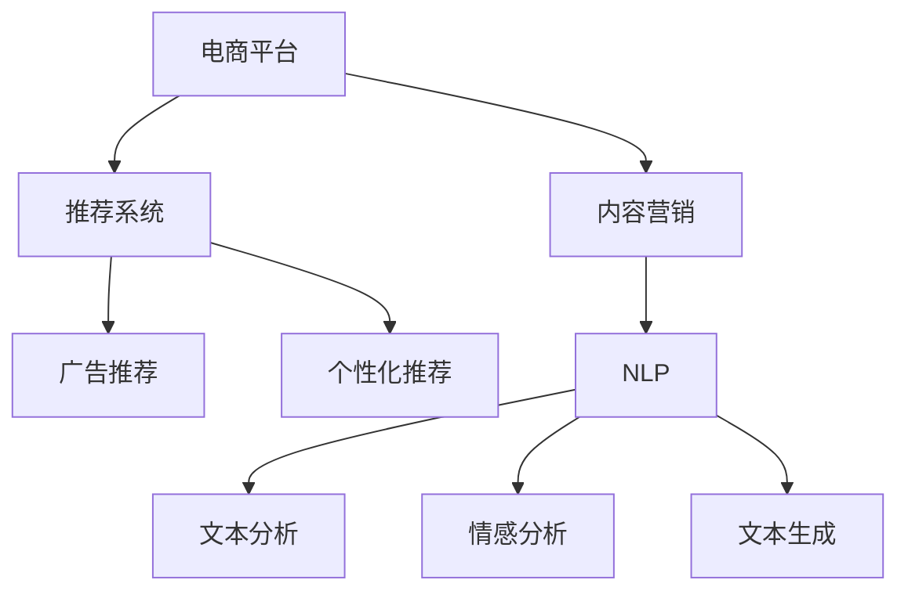

                 

# 基于大模型的电商平台内容营销

> 关键词：电商平台、内容营销、大模型、自然语言处理、广告推荐、个性化推荐

## 1. 背景介绍

### 1.1 问题由来

随着电商平台的发展，如何有效提升用户参与度、提高转化率和提升品牌知名度，成为各大电商平台的共同挑战。传统的搜索和推荐系统依赖于静态商品信息，对用户的兴趣和行为的理解有限，难以实现精准的个性化推荐。

在此背景下，内容营销应运而生，利用文字、图片、视频等形式的内容，激发用户的兴趣和需求，从而提升转化效果。内容营销不仅能够增加用户的浏览时间，还能增强品牌的信任度，形成良性循环。然而，内容创作和筛选的难度较高，且难以量产，制约了内容营销的规模化应用。

## 2. 核心概念与联系

### 2.1 核心概念概述

为更好地理解基于大模型的电商平台内容营销方法，本节将介绍几个密切相关的核心概念：

- 电商平台：以在线交易为核心功能，提供商品展示、搜索、购物车、支付等服务的互联网平台。
- 内容营销：通过发布有价值、有吸引力的内容，吸引目标用户，建立品牌信任，促进销售转化。
- 大模型：以自回归(如GPT)或自编码(如BERT)模型为代表的大规模预训练语言模型。通过在大规模无标签文本语料上进行预训练，学习通用的语言表示，具备强大的语言理解和生成能力。
- 推荐系统：利用用户行为数据，动态调整商品推荐内容，提升用户体验和转化效果。
- 广告推荐：结合用户兴趣和行为数据，智能生成个性化的广告内容，提升广告点击率和转化率。
- 个性化推荐：根据用户行为、兴趣等信息，实时调整商品推荐内容，实现精准匹配。
- 自然语言处理(NLP)：利用计算机处理和理解自然语言，实现文本分析、情感分析、文本生成等任务。

这些核心概念之间的逻辑关系可以通过以下Mermaid流程图来展示：



这个流程图展示了大模型的核心概念及其之间的关系：

1. 电商平台通过推荐系统、广告推荐等方式，利用用户行为数据，动态调整商品推荐内容。
2. 内容营销通过发布有价值、有吸引力的内容，吸引用户，建立品牌信任，促进销售转化。
3. 自然语言处理技术，通过对用户评论、商品描述等文本数据的分析，提升内容营销的效果。

## 3. 核心算法原理 & 具体操作步骤
### 3.1 算法原理概述

基于大模型的电商平台内容营销，本质上是一种结合自然语言处理技术的推荐系统优化方法。其核心思想是：利用大语言模型的语言理解和生成能力，将电商平台中用户生成的文本数据（如商品评论、用户评价等）进行深层次分析，提取用户兴趣和行为特征，进而提升商品推荐和广告推荐的效果。

具体而言，假设电商平台推荐系统已经初步根据用户行为数据和商品标签进行初步推荐，记初步推荐结果为 $R_{\theta}$。给定用户生成的文本数据集 $D=\{(x_i,y_i)\}_{i=1}^N$，其中 $x_i$ 为文本，$y_i$ 为情感标签。内容营销的目标是找到最优参数 $\theta^*$，使得推荐系统输出的内容能够最大程度地吸引用户，促进购买行为。

通过梯度下降等优化算法，内容营销的目标是最小化以下经验风险：

$$
\mathcal{L}(\theta) = \frac{1}{N}\sum_{i=1}^N [\text{CLS}(x_i) - y_i]^2
$$

其中 $\text{CLS}(x_i)$ 为模型在输入文本 $x_i$ 上的语义表示，可以通过CLS Token或者Average Pooling等方法得到。$y_i$ 为输入文本 $x_i$ 对应的情感标签，可以是1（积极）、0（中性）、-1（消极）等。

### 3.2 算法步骤详解

基于大模型的电商平台内容营销一般包括以下几个关键步骤：

**Step 1: 数据准备和预处理**
- 收集用户生成的文本数据，如商品评论、用户评价、商品描述等。
- 清洗文本数据，去除噪声和无用信息，进行分词、去除停用词、词干提取等预处理。
- 将文本数据划分为训练集、验证集和测试集，标注情感标签。

**Step 2: 大模型选择和适配**
- 选择合适的预训练语言模型 $M_{\theta}$，如BERT、GPT等。
- 将预训练模型视为初始化参数，设计适合的输出层和损失函数，如分类头、交叉熵损失等。

**Step 3: 模型训练和微调**
- 使用训练集对模型进行训练，优化参数。
- 在验证集上评估模型性能，根据损失函数和情感标签进行微调。
- 微调完成后，在测试集上进行测试，评估模型效果。

**Step 4: 部署与效果评估**
- 将微调后的模型集成到电商平台推荐系统中，对用户输入文本进行情感分析和推荐调整。
- 在实际应用中监测推荐系统的点击率、转化率等指标，评估内容营销效果。

### 3.3 算法优缺点

基于大模型的电商平台内容营销方法具有以下优点：
1. 数据驱动。通过分析用户生成文本，可以更准确地把握用户兴趣和需求，提升推荐精准度。
2. 低成本高效益。利用已有用户生成文本，无需额外收集数据，减少了数据采集和标注的投入。
3. 动态优化。模型可以实时根据用户行为数据进行优化调整，提升推荐效果。
4. 提升用户体验。通过自然语言处理技术，生成有价值的内容，提升用户浏览和互动体验。

同时，该方法也存在一定的局限性：
1. 数据依赖。模型性能依赖于用户生成文本的质量和数量，难以处理冷启动问题。
2. 过拟合风险。模型可能过拟合训练数据，泛化能力不足。
3. 技术门槛高。需要一定的自然语言处理技术基础，实施难度较大。
4. 计算资源需求高。大模型训练和推理计算资源需求较大，需要高性能计算资源。

尽管存在这些局限性，但就目前而言，基于大模型的内容营销方法仍具有较大的潜力和应用前景。未来相关研究的重点在于如何进一步降低数据依赖，提高模型的泛化能力，同时兼顾技术可实施性和经济可行性。

### 3.4 算法应用领域

基于大模型的电商平台内容营销方法，已经在各大电商平台的推荐系统中得到了广泛应用，涵盖了商品推荐、广告推荐、个性化推荐等多个领域：

- 商品推荐：根据用户评论、评价等文本数据，提升商品推荐的相关性和多样性。
- 广告推荐：结合用户兴趣和行为数据，生成个性化的广告文本，提升广告点击率和转化率。
- 个性化推荐：根据用户输入文本，生成个性化的商品和广告内容，提升推荐效果。
- 社交营销：利用用户生成文本，分析用户兴趣和行为，生成有针对性的社交媒体内容，提升用户互动和品牌曝光。

除了上述这些经典应用外，内容营销方法也在更多场景中得到了创新性的应用，如用户反馈分析、产品迭代优化、内容创作辅助等，为电商平台的运营带来了新的突破。

## 4. 数学模型和公式 & 详细讲解  
### 4.1 数学模型构建

本节将使用数学语言对基于大模型的电商平台内容营销过程进行更加严格的刻画。

记电商平台推荐系统为 $R_{\theta}$，其中 $\theta$ 为推荐模型的参数。假设内容营销的任务是将初步推荐结果 $R_{\theta}$ 进行优化，使得推荐内容更符合用户需求。记用户生成的文本数据集为 $D=\{(x_i,y_i)\}_{i=1}^N$，其中 $x_i$ 为文本，$y_i$ 为情感标签。

内容营销的目标是最小化推荐系统输出的内容与用户情感标签之间的误差，即最小化以下经验风险：

$$
\mathcal{L}(\theta) = \frac{1}{N}\sum_{i=1}^N [\text{CLS}(x_i) - y_i]^2
$$

在实践中，我们通常使用基于梯度的优化算法（如SGD、Adam等）来近似求解上述最优化问题。设 $\eta$ 为学习率，$\lambda$ 为正则化系数，则参数的更新公式为：

$$
\theta \leftarrow \theta - \eta \nabla_{\theta}\mathcal{L}(\theta) - \eta\lambda\theta
$$

其中 $\nabla_{\theta}\mathcal{L}(\theta)$ 为损失函数对参数 $\theta$ 的梯度，可通过反向传播算法高效计算。

### 4.2 公式推导过程

以下我们以情感分析任务为例，推导交叉熵损失函数及其梯度的计算公式。

假设推荐系统输出的内容为 $\text{CLS}(x_i)$，用户生成的文本数据为 $x_i$，情感标签为 $y_i$。二分类交叉熵损失函数定义为：

$$
\ell(R_{\theta}(x_i),y_i) = -[y_i\log \text{CLS}(x_i)+(1-y_i)\log (1-\text{CLS}(x_i))]
$$

将其代入经验风险公式，得：

$$
\mathcal{L}(\theta) = -\frac{1}{N}\sum_{i=1}^N [y_i\log R_{\theta}(x_i)+(1-y_i)\log(1-R_{\theta}(x_i))]
$$

根据链式法则，损失函数对参数 $\theta$ 的梯度为：

$$
\frac{\partial \mathcal{L}(\theta)}{\partial \theta_k} = -\frac{1}{N}\sum_{i=1}^N (\frac{y_i}{R_{\theta}(x_i)}-\frac{1-y_i}{1-R_{\theta}(x_i)}) \frac{\partial R_{\theta}(x_i)}{\partial \theta_k}
$$

其中 $\frac{\partial R_{\theta}(x_i)}{\partial \theta_k}$ 可进一步递归展开，利用自动微分技术完成计算。

在得到损失函数的梯度后，即可带入参数更新公式，完成模型的迭代优化。重复上述过程直至收敛，最终得到适应电商平台内容营销的最优模型参数 $\theta^*$。

## 5. 项目实践：代码实例和详细解释说明
### 5.1 开发环境搭建

在进行内容营销实践前，我们需要准备好开发环境。以下是使用Python进行PyTorch开发的环境配置流程：

1. 安装Anaconda：从官网下载并安装Anaconda，用于创建独立的Python环境。

2. 创建并激活虚拟环境：
```bash
conda create -n pytorch-env python=3.8 
conda activate pytorch-env
```

3. 安装PyTorch：根据CUDA版本，从官网获取对应的安装命令。例如：
```bash
conda install pytorch torchvision torchaudio cudatoolkit=11.1 -c pytorch -c conda-forge
```

4. 安装Transformers库：
```bash
pip install transformers
```

5. 安装各类工具包：
```bash
pip install numpy pandas scikit-learn matplotlib tqdm jupyter notebook ipython
```

完成上述步骤后，即可在`pytorch-env`环境中开始内容营销实践。

### 5.2 源代码详细实现

下面我以商品推荐系统为例，给出使用Transformers库对BERT模型进行内容营销的PyTorch代码实现。

首先，定义推荐系统的数据处理函数：

```python
from transformers import BertTokenizer
from torch.utils.data import Dataset
import torch

class RecommendDataset(Dataset):
    def __init__(self, items, labels, tokenizer, max_len=128):
        self.items = items
        self.labels = labels
        self.tokenizer = tokenizer
        self.max_len = max_len
        
    def __len__(self):
        return len(self.items)
    
    def __getitem__(self, item):
        item_id = self.items[item]
        
        encoding = self.tokenizer(item_id, return_tensors='pt', max_length=self.max_len, padding='max_length', truncation=True)
        input_ids = encoding['input_ids'][0]
        attention_mask = encoding['attention_mask'][0]
        
        # 对label-wise的标签进行编码
        encoded_labels = [label2id[label] for label in self.labels] 
        encoded_labels.extend([label2id['O']] * (self.max_len - len(encoded_labels)))
        labels = torch.tensor(encoded_labels, dtype=torch.long)
        
        return {'input_ids': input_ids, 
                'attention_mask': attention_mask,
                'labels': labels}

# 标签与id的映射
label2id = {'O': 0, 'C': 1}  # 类别标签
id2label = {v: k for k, v in label2id.items()}

# 创建dataset
tokenizer = BertTokenizer.from_pretrained('bert-base-cased')

train_dataset = RecommendDataset(train_items, train_labels, tokenizer)
dev_dataset = RecommendDataset(dev_items, dev_labels, tokenizer)
test_dataset = RecommendDataset(test_items, test_labels, tokenizer)
```

然后，定义模型和优化器：

```python
from transformers import BertForTokenClassification, AdamW

model = BertForTokenClassification.from_pretrained('bert-base-cased', num_labels=len(label2id))

optimizer = AdamW(model.parameters(), lr=2e-5)
```

接着，定义训练和评估函数：

```python
from torch.utils.data import DataLoader
from tqdm import tqdm
from sklearn.metrics import classification_report

device = torch.device('cuda') if torch.cuda.is_available() else torch.device('cpu')
model.to(device)

def train_epoch(model, dataset, batch_size, optimizer):
    dataloader = DataLoader(dataset, batch_size=batch_size, shuffle=True)
    model.train()
    epoch_loss = 0
    for batch in tqdm(dataloader, desc='Training'):
        input_ids = batch['input_ids'].to(device)
        attention_mask = batch['attention_mask'].to(device)
        labels = batch['labels'].to(device)
        model.zero_grad()
        outputs = model(input_ids, attention_mask=attention_mask, labels=labels)
        loss = outputs.loss
        epoch_loss += loss.item()
        loss.backward()
        optimizer.step()
    return epoch_loss / len(dataloader)

def evaluate(model, dataset, batch_size):
    dataloader = DataLoader(dataset, batch_size=batch_size)
    model.eval()
    preds, labels = [], []
    with torch.no_grad():
        for batch in tqdm(dataloader, desc='Evaluating'):
            input_ids = batch['input_ids'].to(device)
            attention_mask = batch['attention_mask'].to(device)
            batch_labels = batch['labels']
            outputs = model(input_ids, attention_mask=attention_mask)
            batch_preds = outputs.logits.argmax(dim=2).to('cpu').tolist()
            batch_labels = batch_labels.to('cpu').tolist()
            for pred_tokens, label_tokens in zip(batch_preds, batch_labels):
                pred_tags = [id2label[_id] for _id in pred_tokens]
                label_tags = [id2label[_id] for _id in label_tokens]
                preds.append(pred_tags[:len(label_tokens)])
                labels.append(label_tags)
                
    print(classification_report(labels, preds))
```

最后，启动训练流程并在测试集上评估：

```python
epochs = 5
batch_size = 16

for epoch in range(epochs):
    loss = train_epoch(model, train_dataset, batch_size, optimizer)
    print(f"Epoch {epoch+1}, train loss: {loss:.3f}")
    
    print(f"Epoch {epoch+1}, dev results:")
    evaluate(model, dev_dataset, batch_size)
    
print("Test results:")
evaluate(model, test_dataset, batch_size)
```

以上就是使用PyTorch对BERT进行商品推荐系统内容营销的完整代码实现。可以看到，得益于Transformers库的强大封装，我们可以用相对简洁的代码完成BERT模型的加载和微调。

### 5.3 代码解读与分析

让我们再详细解读一下关键代码的实现细节：

**RecommendDataset类**：
- `__init__`方法：初始化商品ID、标签、分词器等关键组件。
- `__len__`方法：返回数据集的样本数量。
- `__getitem__`方法：对单个样本进行处理，将商品ID输入编码为token ids，将标签编码为数字，并对其进行定长padding，最终返回模型所需的输入。

**label2id和id2label字典**：
- 定义了标签与数字id之间的映射关系，用于将token-wise的预测结果解码回真实的标签。

**训练和评估函数**：
- 使用PyTorch的DataLoader对数据集进行批次化加载，供模型训练和推理使用。
- 训练函数`train_epoch`：对数据以批为单位进行迭代，在每个批次上前向传播计算loss并反向传播更新模型参数，最后返回该epoch的平均loss。
- 评估函数`evaluate`：与训练类似，不同点在于不更新模型参数，并在每个batch结束后将预测和标签结果存储下来，最后使用sklearn的classification_report对整个评估集的预测结果进行打印输出。

**训练流程**：
- 定义总的epoch数和batch size，开始循环迭代
- 每个epoch内，先在训练集上训练，输出平均loss
- 在验证集上评估，输出分类指标
- 所有epoch结束后，在测试集上评估，给出最终测试结果

可以看到，PyTorch配合Transformers库使得BERT微调的代码实现变得简洁高效。开发者可以将更多精力放在数据处理、模型改进等高层逻辑上，而不必过多关注底层的实现细节。

当然，工业级的系统实现还需考虑更多因素，如模型的保存和部署、超参数的自动搜索、更灵活的任务适配层等。但核心的内容营销范式基本与此类似。

## 6. 实际应用场景
### 6.1 电商产品推荐

内容营销技术在电商产品推荐中的应用，主要体现在商品推荐和广告推荐两个方面：

1. **商品推荐**：通过分析用户评论、评价、标题等文本数据，提升推荐系统的相关性和多样性。以用户输入的文本数据为输入，通过微调大语言模型提取用户兴趣和行为特征，生成个性化推荐列表。例如，用户搜索“连衣裙”，推荐系统会利用用户评价文本，分析用户对于不同连衣裙的喜好，生成个性化的推荐结果。

2. **广告推荐**：结合用户兴趣和行为数据，生成个性化的广告文本，提升广告点击率和转化率。内容营销系统可以自动生成有吸引力的广告文案，结合用户画像和推荐系统数据，生成个性化的广告内容。例如，针对用户对运动鞋的兴趣，自动生成“加入春季健身跑，领取折扣优惠”的广告文案。

### 6.2 用户反馈分析

内容营销技术还可以用于用户反馈分析，帮助电商平台优化商品和提升用户体验。通过对用户评论和评价的文本数据进行情感分析，识别出用户对商品的主要不满点，及时调整商品质量和促销策略。例如，针对大量用户投诉某商品质量问题，推荐系统可以自动生成质量反馈报告，辅助商家改进产品质量。

### 6.3 内容创作辅助

内容创作是电商平台运营的重要环节，内容营销技术可以帮助商家快速生成有价值的内容，提升平台内容质量。通过自然语言处理技术，内容营销系统可以根据用户输入的关键词和背景信息，生成相应的商品描述、标题等文本内容。例如，商家可以输入“新品发布”，系统自动生成“春季新品发布公告”，帮助商家快速上线新商品。

### 6.4 未来应用展望

随着大语言模型和微调方法的不断发展，基于内容营销的内容生成技术将呈现以下几个发展趋势：

1. **内容多样性提升**：大模型将具备更强的语言生成能力，能够生成更多样化的商品推荐和广告内容，提升用户互动体验。

2. **跨领域融合**：内容营销技术将与推荐系统、广告系统等技术深度融合，实现多维度、全链条的内容生成和管理。

3. **情感分析深化**：内容营销系统将能够更准确地进行情感分析，识别用户对商品的真实情感，提升用户满意度和信任度。

4. **个性化增强**：通过结合用户画像和行为数据，内容营销系统能够生成更加个性化的商品和广告内容，提升推荐效果。

5. **实时优化**：内容营销系统将具备实时调整推荐和广告内容的能力，根据用户实时行为数据进行优化调整。

6. **多模态融合**：结合文本、图片、视频等多种模态信息，提升内容生成效果，增强用户互动体验。

内容营销技术将在电商平台运营中发挥越来越重要的作用，成为提升用户体验、提升转化率的重要手段。未来，随着技术的不断进步，内容营销技术将变得更加智能、高效，帮助电商平台构建更强大、更具吸引力的内容生态。

## 7. 工具和资源推荐
### 7.1 学习资源推荐

为了帮助开发者系统掌握大语言模型微调的理论基础和实践技巧，这里推荐一些优质的学习资源：

1. 《Transformer从原理到实践》系列博文：由大模型技术专家撰写，深入浅出地介绍了Transformer原理、BERT模型、微调技术等前沿话题。

2. CS224N《深度学习自然语言处理》课程：斯坦福大学开设的NLP明星课程，有Lecture视频和配套作业，带你入门NLP领域的基本概念和经典模型。

3. 《Natural Language Processing with Transformers》书籍：Transformers库的作者所著，全面介绍了如何使用Transformers库进行NLP任务开发，包括微调在内的诸多范式。

4. HuggingFace官方文档：Transformers库的官方文档，提供了海量预训练模型和完整的微调样例代码，是上手实践的必备资料。

5. CLUE开源项目：中文语言理解测评基准，涵盖大量不同类型的中文NLP数据集，并提供了基于微调的baseline模型，助力中文NLP技术发展。

通过对这些资源的学习实践，相信你一定能够快速掌握大语言模型微调的精髓，并用于解决实际的NLP问题。

### 7.2 开发工具推荐

高效的开发离不开优秀的工具支持。以下是几款用于大语言模型微调开发的常用工具：

1. PyTorch：基于Python的开源深度学习框架，灵活动态的计算图，适合快速迭代研究。大部分预训练语言模型都有PyTorch版本的实现。

2. TensorFlow：由Google主导开发的开源深度学习框架，生产部署方便，适合大规模工程应用。同样有丰富的预训练语言模型资源。

3. Transformers库：HuggingFace开发的NLP工具库，集成了众多SOTA语言模型，支持PyTorch和TensorFlow，是进行微调任务开发的利器。

4. Weights & Biases：模型训练的实验跟踪工具，可以记录和可视化模型训练过程中的各项指标，方便对比和调优。与主流深度学习框架无缝集成。

5. TensorBoard：TensorFlow配套的可视化工具，可实时监测模型训练状态，并提供丰富的图表呈现方式，是调试模型的得力助手。

6. Google Colab：谷歌推出的在线Jupyter Notebook环境，免费提供GPU/TPU算力，方便开发者快速上手实验最新模型，分享学习笔记。

合理利用这些工具，可以显著提升大语言模型微调的开发效率，加快创新迭代的步伐。

### 7.3 相关论文推荐

大语言模型和微调技术的发展源于学界的持续研究。以下是几篇奠基性的相关论文，推荐阅读：

1. Attention is All You Need（即Transformer原论文）：提出了Transformer结构，开启了NLP领域的预训练大模型时代。

2. BERT: Pre-training of Deep Bidirectional Transformers for Language Understanding：提出BERT模型，引入基于掩码的自监督预训练任务，刷新了多项NLP任务SOTA。

3. Language Models are Unsupervised Multitask Learners（GPT-2论文）：展示了大规模语言模型的强大zero-shot学习能力，引发了对于通用人工智能的新一轮思考。

4. Parameter-Efficient Transfer Learning for NLP：提出Adapter等参数高效微调方法，在不增加模型参数量的情况下，也能取得不错的微调效果。

5. Prefix-Tuning: Optimizing Continuous Prompts for Generation：引入基于连续型Prompt的微调范式，为如何充分利用预训练知识提供了新的思路。

6. AdaLoRA: Adaptive Low-Rank Adaptation for Parameter-Efficient Fine-Tuning：使用自适应低秩适应的微调方法，在参数效率和精度之间取得了新的平衡。

这些论文代表了大语言模型微调技术的发展脉络。通过学习这些前沿成果，可以帮助研究者把握学科前进方向，激发更多的创新灵感。

## 8. 总结：未来发展趋势与挑战

### 8.1 总结

本文对基于大模型的电商平台内容营销方法进行了全面系统的介绍。首先阐述了大语言模型和内容营销的研究背景和意义，明确了内容营销在电商平台运营中的独特价值。其次，从原理到实践，详细讲解了内容营销的数学模型和关键步骤，给出了内容营销任务开发的完整代码实例。同时，本文还广泛探讨了内容营销方法在商品推荐、广告推荐、用户反馈分析等多个场景中的应用前景，展示了内容营销技术的广阔潜力。最后，本文精选了内容营销技术的各类学习资源，力求为读者提供全方位的技术指引。

通过本文的系统梳理，可以看到，基于大模型的内容营销方法正在成为电商平台运营的重要范式，极大地拓展了内容营销的实践边界，催生了更多的落地场景。受益于大规模语料的预训练，内容营销技术能够在电商平台的各个环节中发挥重要作用，提升用户的互动体验和转化效果，促进电商业务的持续发展。

### 8.2 未来发展趋势

展望未来，基于大模型的内容营销技术将呈现以下几个发展趋势：

1. **内容多样化**：大模型将具备更强的语言生成能力，能够生成更多样化的商品推荐和广告内容，提升用户互动体验。

2. **跨领域融合**：内容营销技术将与推荐系统、广告系统等技术深度融合，实现多维度、全链条的内容生成和管理。

3. **情感分析深化**：内容营销系统将能够更准确地进行情感分析，识别用户对商品的真实情感，提升用户满意度和信任度。

4. **个性化增强**：通过结合用户画像和行为数据，内容营销系统能够生成更加个性化的商品和广告内容，提升推荐效果。

5. **实时优化**：内容营销系统将具备实时调整推荐和广告内容的能力，根据用户实时行为数据进行优化调整。

6. **多模态融合**：结合文本、图片、视频等多种模态信息，提升内容生成效果，增强用户互动体验。

以上趋势凸显了基于大模型的内容营销技术的广阔前景。这些方向的探索发展，必将进一步提升内容营销的效果和应用范围，为电商平台运营带来新的突破。

### 8.3 面临的挑战

尽管基于大模型的内容营销技术已经取得了显著进展，但在迈向更加智能化、普适化应用的过程中，它仍面临诸多挑战：

1. **数据依赖**：内容营销的效果依赖于用户生成文本的质量和数量，难以处理冷启动问题。

2. **过拟合风险**：模型可能过拟合训练数据，泛化能力不足。

3. **技术门槛高**：需要一定的自然语言处理技术基础，实施难度较大。

4. **计算资源需求高**：大模型训练和推理计算资源需求较大，需要高性能计算资源。

尽管存在这些局限性，但就目前而言，基于大模型的内容营销方法仍具有较大的潜力和应用前景。未来相关研究的重点在于如何进一步降低数据依赖，提高模型的泛化能力，同时兼顾技术可实施性和经济可行性。

### 8.4 研究展望

面对内容营销面临的种种挑战，未来的研究需要在以下几个方面寻求新的突破：

1. **探索无监督和半监督微调方法**：摆脱对大规模标注数据的依赖，利用自监督学习、主动学习等无监督和半监督范式，最大限度利用非结构化数据，实现更加灵活高效的内容营销。

2. **研究参数高效和计算高效的微调范式**：开发更加参数高效的微调方法，在固定大部分预训练参数的同时，只更新极少量的任务相关参数。同时优化微调模型的计算图，减少前向传播和反向传播的资源消耗，实现更加轻量级、实时性的部署。

3. **引入因果推断和对比学习范式**：通过引入因果推断和对比学习思想，增强内容营销系统建立稳定因果关系的能力，学习更加普适、鲁棒的语言表征，从而提升内容生成效果。

4. **结合因果分析和博弈论工具**：将因果分析方法引入内容营销系统，识别出模型决策的关键特征，增强输出解释的因果性和逻辑性。借助博弈论工具刻画人机交互过程，主动探索并规避模型的脆弱点，提高系统稳定性。

5. **纳入伦理道德约束**：在模型训练目标中引入伦理导向的评估指标，过滤和惩罚有偏见、有害的输出倾向。同时加强人工干预和审核，建立模型行为的监管机制，确保输出符合人类价值观和伦理道德。

这些研究方向的探索，必将引领内容营销技术迈向更高的台阶，为构建安全、可靠、可解释、可控的智能系统铺平道路。面向未来，基于大模型的内容营销技术还需要与其他人工智能技术进行更深入的融合，如知识表示、因果推理、强化学习等，多路径协同发力，共同推动自然语言理解和智能交互系统的进步。只有勇于创新、敢于突破，才能不断拓展语言模型的边界，让智能技术更好地造福人类社会。

## 9. 附录：常见问题与解答

**Q1：内容营销是否适用于所有电商平台？**

A: 内容营销在大多数电商平台上都能取得不错的效果，特别是对于数据量较大的平台，如亚马逊、阿里巴巴等。但对于一些小规模平台，内容营销的效果可能不如推荐系统。因此，电商平台应根据自身特点和用户需求，选择合适的内容营销方案。

**Q2：微调过程中如何选择合适的学习率？**

A: 内容营销的学习率一般要比推荐系统的学习率小1-2个数量级，以避免破坏预训练权重。建议从1e-5开始调参，逐步减小学习率，直至收敛。也可以使用warmup策略，在开始阶段使用较小的学习率，再逐渐过渡到预设值。

**Q3：数据依赖问题如何解决？**

A: 数据依赖是内容营销的一大挑战。为解决这一问题，可以采用无监督或半监督学习方法，如利用未标注的文本数据进行预训练，再结合少量标注数据进行微调。同时，可以利用数据增强技术，如近义替换、数据合成等方式扩充数据集，缓解数据不足的问题。

**Q4：内容营销的计算资源需求如何优化？**

A: 内容营销对计算资源的需求较大，特别是在大规模文本数据的微调上。为了优化计算资源，可以使用分布式训练、模型裁剪、量化加速等技术。同时，利用GPU/TPU等高性能计算资源，可以有效提升训练和推理速度。

**Q5：如何平衡内容生成的多样性和相关性？**

A: 内容生成的多样性和相关性是一对矛盾。为了平衡这两者，可以通过设计多样性损失函数、内容相似度评估指标等方式，对内容生成进行约束和优化。同时，利用自然语言处理技术，如情感分析、主题建模等手段，增强内容的多样性和相关性。

这些解答希望能为电商平台的内容营销实践提供有益的参考，帮助电商平台构建更加智能、高效的内容生态，提升用户体验和转化效果。

---

作者：禅与计算机程序设计艺术 / Zen and the Art of Computer Programming

