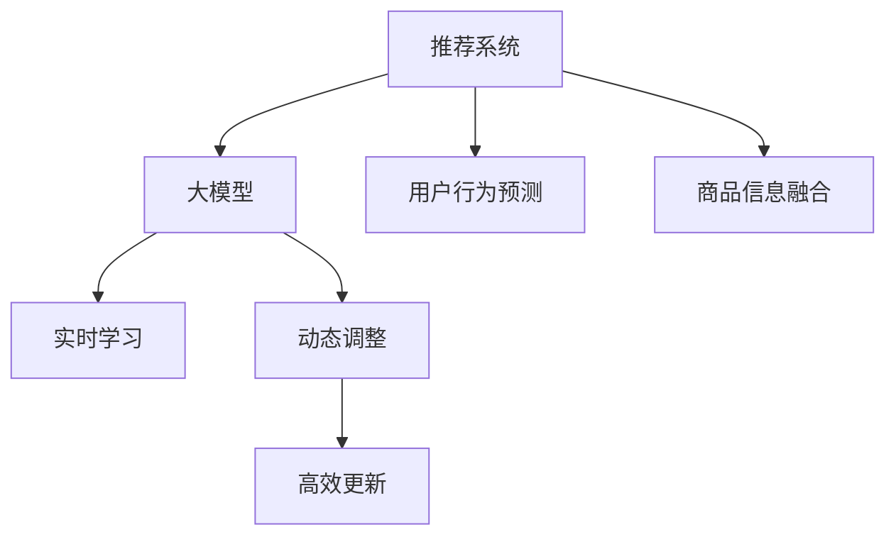

                 

# 基于大模型的迭代式动态推荐框架

> 关键词：推荐系统,大模型,迭代式学习,动态推荐,用户行为预测

## 1. 背景介绍

### 1.1 问题由来
在当今信息爆炸的时代，推荐系统作为互联网平台获取用户注意力、提升用户满意度和增加用户粘性的核心技术，对于内容服务商来说尤为重要。传统的推荐系统主要基于静态模型和静态数据，随着用户行为和商品信息的多变，传统的推荐算法难以应对快速变化的需求。因此，迭代式动态推荐框架的提出，将成为推荐系统领域的下一个重大突破。

### 1.2 问题核心关键点
迭代式动态推荐框架基于大模型和深度学习技术，实时学习用户行为和商品信息，动态调整推荐策略。其核心在于如何高效地更新大模型，以适应用户行为的快速变化。

关键点如下：
- 实时学习：通过大模型实时学习用户行为和商品信息，持续更新推荐策略。
- 动态调整：根据用户行为变化，动态调整推荐模型参数。
- 高效更新：通过分布式训练和多任务学习，高效更新大模型。
- 用户行为预测：基于用户历史行为，预测未来行为，指导推荐决策。
- 商品信息融合：融合多样化的商品信息，提升推荐的丰富性和准确性。

## 2. 核心概念与联系

### 2.1 核心概念概述

为更好地理解迭代式动态推荐框架，本节将介绍几个密切相关的核心概念：

- 推荐系统：通过分析用户历史行为，为用户推荐可能感兴趣的商品。
- 大模型：指使用深度学习技术训练的复杂神经网络模型，如Transformer、BERT等。
- 迭代式学习：通过不断更新模型参数，实时适应用户行为和商品信息的变化。
- 动态推荐：根据用户行为实时动态调整推荐结果，适应快速变化的用户需求。
- 用户行为预测：通过历史行为数据，预测用户未来的购买意图。
- 商品信息融合：整合多样化的商品信息，丰富推荐结果的维度。

这些核心概念之间的逻辑关系可以通过以下Mermaid流程图来展示：



这个流程图展示了大模型在推荐系统中的核心作用，以及迭代式动态推荐框架的关键步骤。

## 3. 核心算法原理 & 具体操作步骤
### 3.1 算法原理概述

迭代式动态推荐框架基于深度学习的大模型，通过实时学习用户行为和商品信息，动态调整推荐策略。其核心思想是：利用大模型强大的表示能力和自适应能力，不断更新模型参数，适应用户行为的快速变化，以提升推荐系统的准确性和时效性。

该框架的核心算法原理包括以下几个关键部分：

1. 用户行为预测：通过分析用户的历史行为数据，使用大模型预测用户未来的购买意图。
2. 动态调整：根据用户行为预测结果，动态调整推荐模型的参数，确保推荐结果的实时性。
3. 高效更新：通过分布式训练和多任务学习，高效更新大模型，保持模型的高效性和准确性。
4. 商品信息融合：整合多样化的商品信息，丰富推荐结果的维度，提升推荐的准确性和丰富性。

### 3.2 算法步骤详解

迭代式动态推荐框架的算法步骤如下：

**Step 1: 数据收集与预处理**
- 收集用户的历史行为数据，包括浏览、点击、购买等行为记录。
- 对数据进行清洗和预处理，去除噪声和缺失值。

**Step 2: 用户行为预测**
- 使用大模型对用户历史行为进行分析，预测用户未来的购买意图。
- 根据预测结果，动态调整推荐策略。

**Step 3: 动态调整**
- 根据预测结果，动态调整推荐模型的参数，以实时适应用户需求的变化。
- 使用分布式训练和多任务学习技术，高效更新大模型。

**Step 4: 商品信息融合**
- 整合多种商品信息，如价格、评论、标签等，丰富推荐结果的维度。
- 根据商品信息，动态调整推荐策略。

**Step 5: 推荐结果生成**
- 根据动态调整后的推荐策略，生成推荐结果。
- 对推荐结果进行排名，选择合适的商品展示给用户。

### 3.3 算法优缺点

迭代式动态推荐框架具有以下优点：
1. 实时性：能够实时学习用户行为和商品信息，动态调整推荐策略，适应快速变化的用户需求。
2. 准确性：利用大模型强大的表示能力和自适应能力，提升推荐系统的准确性。
3. 多样性：整合多种商品信息，丰富推荐结果的维度，提升推荐的丰富性。
4. 高效性：使用分布式训练和多任务学习技术，高效更新大模型，保持模型的高效性和准确性。

同时，该框架也存在一些缺点：
1. 高复杂性：需要处理海量数据和大规模模型，技术实现复杂。
2. 高计算资源：需要大量计算资源支持分布式训练和多任务学习，成本较高。
3. 数据隐私：需要收集和处理大量用户数据，可能涉及数据隐私和安全问题。

尽管存在这些缺点，但就目前而言，迭代式动态推荐框架仍是推荐系统领域的最新技术突破。未来相关研究的重点在于如何进一步降低技术复杂度，提高计算效率，同时兼顾数据隐私和安全性等因素。

### 3.4 算法应用领域

迭代式动态推荐框架在推荐系统领域具有广泛的应用前景，可以应用于以下几个典型场景：

- 电商推荐：根据用户的历史购物记录和行为预测，动态调整推荐策略，提升购物体验和转化率。
- 内容推荐：根据用户的阅读、观看行为预测，动态调整内容推荐策略，提升用户满意度和平台粘性。
- 音乐推荐：根据用户的听歌历史和行为预测，动态调整音乐推荐策略，提升用户发现新歌的能力。
- 视频推荐：根据用户的观看历史和行为预测，动态调整视频推荐策略，提升用户观看体验和平台留存率。
- 游戏推荐：根据玩家的游戏行为预测，动态调整游戏推荐策略，提升游戏推荐准确性和用户粘性。

除了这些场景，迭代式动态推荐框架还可以广泛应用于金融、新闻、教育等多个领域，为不同用户提供个性化的推荐服务，提升用户体验和平台价值。

## 4. 数学模型和公式 & 详细讲解  
### 4.1 数学模型构建

本节将使用数学语言对迭代式动态推荐框架进行更加严格的刻画。

记推荐系统中的用户为 $U$，商品为 $I$。用户行为用序列 $\{a_t\}_{t=1}^T$ 表示，其中 $a_t$ 表示用户在时间 $t$ 的行为，如浏览、点击、购买等。商品信息用向量 $\mathbf{x}_i \in \mathbb{R}^d$ 表示，其中 $d$ 为特征维度。

定义用户行为预测模型为 $f: U \times I \rightarrow [0,1]$，表示在用户 $u$ 浏览商品 $i$ 的概率。根据用户行为序列 $\{a_t\}_{t=1}^T$ 和商品信息 $\mathbf{x}_i$，计算预测结果 $\hat{y}_{ui}$：

$$
\hat{y}_{ui} = f(\mathbf{x}_i, a_1, a_2, ..., a_T)
$$

其中，$a_t$ 和 $\mathbf{x}_i$ 通过嵌入层转换为向量表示，输入到预测模型 $f$ 中。

### 4.2 公式推导过程

以下我们以电商推荐为例，推导预测模型的具体实现。

记用户行为序列为 $\mathbf{A}_t = (a_1, a_2, ..., a_T)$，商品信息为 $\mathbf{X}_i = (\mathbf{x}_{i1}, \mathbf{x}_{i2}, ..., \mathbf{x}_{id})$，其中 $\mathbf{x}_{ik}$ 表示商品 $i$ 的第 $k$ 个特征。则电商推荐预测模型可以表示为：

$$
\hat{y}_{ui} = \sigma\left(\mathbf{w}_i^T \mathbf{h}_u + b_i\right)
$$

其中，$\mathbf{w}_i$ 和 $b_i$ 为模型参数，$\sigma$ 为激活函数，$\mathbf{h}_u$ 为用户行为嵌入表示。

具体推导过程如下：
- 将用户行为序列 $\mathbf{A}_t$ 和商品信息 $\mathbf{X}_i$ 通过嵌入层转换为向量表示 $\mathbf{H}_u$ 和 $\mathbf{X}_i$。
- 将 $\mathbf{H}_u$ 和 $\mathbf{X}_i$ 拼接，输入到全连接层 $g$ 中，得到用户对商品的评分 $z_{ui}$：
$$
z_{ui} = g\left(\mathbf{H}_u \oplus \mathbf{X}_i\right)
$$
- 将 $z_{ui}$ 输入到激活函数 $\sigma$ 中，得到预测结果 $\hat{y}_{ui}$。

### 4.3 案例分析与讲解

**电商推荐案例**：
假设某电商平台收集了用户的历史购物记录和浏览行为，预测用户未来购买商品的概率。

1. 数据预处理：
   - 将用户行为序列和商品信息进行标准化处理，去除噪声和缺失值。
   - 使用嵌入层将用户行为序列和商品信息转换为向量表示。

2. 模型训练：
   - 使用大模型训练预测模型 $f$，学习用户行为和商品信息的表示关系。
   - 使用交叉熵损失函数，优化模型参数。

3. 动态调整：
   - 根据用户新的行为记录，实时更新预测模型 $f$。
   - 使用分布式训练和多任务学习技术，高效更新模型参数。

4. 推荐结果生成：
   - 根据预测结果 $\hat{y}_{ui}$，生成推荐列表。
   - 对推荐结果进行排名，选择最佳商品展示给用户。

## 5. 项目实践：代码实例和详细解释说明
### 5.1 开发环境搭建

在进行迭代式动态推荐框架的实践前，我们需要准备好开发环境。以下是使用Python进行PyTorch开发的环境配置流程：

1. 安装Anaconda：从官网下载并安装Anaconda，用于创建独立的Python环境。

2. 创建并激活虚拟环境：
```bash
conda create -n recommendation-env python=3.8 
conda activate recommendation-env
```

3. 安装PyTorch：根据CUDA版本，从官网获取对应的安装命令。例如：
```bash
conda install pytorch torchvision torchaudio cudatoolkit=11.1 -c pytorch -c conda-forge
```

4. 安装必要的第三方库：
```bash
pip install numpy pandas scikit-learn torch nn pytorch-lightning transformers
```

5. 安装PyTorch Lightning：一个轻量级的深度学习框架，支持分布式训练和多任务学习。
```bash
pip install torch-lightning
```

完成上述步骤后，即可在`recommendation-env`环境中开始迭代式动态推荐框架的开发实践。

### 5.2 源代码详细实现

下面我们以电商推荐任务为例，给出使用PyTorch Lightning对大模型进行迭代式动态推荐框架的PyTorch代码实现。

首先，定义电商推荐的数据处理函数：

```python
import pandas as pd
from transformers import AutoTokenizer, AutoModel

# 读取数据
train_data = pd.read_csv('train.csv')
test_data = pd.read_csv('test.csv')

# 定义数据预处理函数
def preprocess_data(data):
    # 对用户行为序列进行标准化处理
    data['a'] = data['a'].apply(lambda x: preprocess_action(x))
    # 对商品信息进行标准化处理
    data['x'] = data['x'].apply(lambda x: preprocess_item(x))
    return data

# 定义行为序列标准化函数
def preprocess_action(action):
    # 将行为序列转换为数字编码
    action = [int(a) for a in action.split('_')]
    return action

# 定义商品信息标准化函数
def preprocess_item(item):
    # 将商品信息转换为数字编码
    item = [int(i) for i in item.split('_')]
    return item
```

然后，定义模型和优化器：

```python
from torch import nn
from torch.nn.functional import sigmoid

class Recommender(nn.Module):
    def __init__(self, model_name, hidden_size, output_size):
        super(Recommender, self).__init__()
        self.model = AutoModel(model_name)
        self.linear = nn.Linear(hidden_size + len(item_ids), output_size)
        self.sigmoid = sigmoid
        
    def forward(self, input_ids, attention_mask):
        # 对用户行为序列和商品信息进行嵌入
        embeddings = self.model(input_ids)
        # 将嵌入结果拼接，输入到全连接层
        concat_embeddings = torch.cat((embeddings, self.model(item_ids)), dim=-1)
        # 输入到全连接层，输出评分
        scores = self.linear(concat_embeddings)
        # 使用sigmoid函数得到预测概率
        predictions = self.sigmoid(scores)
        return predictions

# 定义优化器
optimizer = torch.optim.Adam(model.parameters(), lr=0.001)
```

接着，定义训练和评估函数：

```python
import torch.nn.functional as F
from torch.utils.data import DataLoader
from tqdm import tqdm

# 定义训练函数
def train(model, dataloader, epochs):
    model.train()
    for epoch in range(epochs):
        for batch in dataloader:
            input_ids, attention_mask, labels = batch
            # 前向传播
            outputs = model(input_ids, attention_mask)
            # 计算损失
            loss = F.binary_cross_entropy(outputs, labels)
            # 反向传播
            loss.backward()
            # 更新参数
            optimizer.step()
            # 输出损失
            print(f'Epoch {epoch+1}, Loss: {loss.item()}')
    
    return model

# 定义评估函数
def evaluate(model, dataloader):
    model.eval()
    correct = 0
    total = 0
    with torch.no_grad():
        for batch in dataloader:
            input_ids, attention_mask, labels = batch
            outputs = model(input_ids, attention_mask)
            predictions = outputs > 0.5
            correct += torch.sum(predictions == labels).item()
            total += labels.size(0)
    print(f'Accuracy: {correct/total}')
```

最后，启动训练流程并在测试集上评估：

```python
from torch.utils.data import DataLoader

# 定义模型
model = Recommender('bert-base-cased', 768, 1)

# 定义训练数据集
train_dataset = preprocess_data(train_data)
test_dataset = preprocess_data(test_data)

# 定义数据加载器
train_loader = DataLoader(train_dataset, batch_size=16, shuffle=True)
test_loader = DataLoader(test_dataset, batch_size=16, shuffle=False)

# 训练模型
model = train(model, train_loader, epochs=10)

# 评估模型
evaluate(model, test_loader)
```

以上就是使用PyTorch Lightning对大模型进行电商推荐任务的迭代式动态推荐框架的完整代码实现。可以看到，得益于PyTorch Lightning的强大封装，我们可以用相对简洁的代码完成迭代式动态推荐框架的构建。

### 5.3 代码解读与分析

让我们再详细解读一下关键代码的实现细节：

**Recommender类**：
- `__init__`方法：初始化大模型和全连接层，设置模型参数。
- `forward`方法：前向传播计算预测结果。

**train函数**：
- 使用训练数据集进行模型训练，循环迭代多次。
- 在每个批次上前向传播计算预测结果，计算损失函数，反向传播更新模型参数，并输出损失。

**evaluate函数**：
- 使用测试数据集进行模型评估，统计正确率和总样本数。
- 输出评估结果。

**训练流程**：
- 定义训练数据集和测试数据集，进行数据预处理。
- 定义模型、优化器、学习率等超参数。
- 启动训练函数，迭代训练多次。
- 启动评估函数，输出模型评估结果。

可以看到，PyTorch Lightning使得迭代式动态推荐框架的代码实现变得简洁高效。开发者可以将更多精力放在数据处理、模型改进等高层逻辑上，而不必过多关注底层的实现细节。

当然，工业级的系统实现还需考虑更多因素，如模型的保存和部署、超参数的自动搜索、更灵活的任务适配层等。但核心的迭代式动态推荐框架基本与此类似。

## 6. 实际应用场景
### 6.1 电商推荐

基于迭代式动态推荐框架的电商推荐系统，能够实时学习用户行为和商品信息，动态调整推荐策略，提升购物体验和转化率。

具体实现步骤如下：
1. 收集用户的历史购物记录和浏览行为，构建电商推荐数据集。
2. 使用大模型训练电商推荐预测模型，学习用户行为和商品信息的表示关系。
3. 实时更新预测模型，根据用户新的行为记录动态调整推荐策略。
4. 生成推荐列表，展示给用户，提升购物体验和转化率。

### 6.2 内容推荐

内容推荐系统主要基于用户的历史阅读、观看行为，为用户推荐可能感兴趣的内容。迭代式动态推荐框架可以实时学习用户行为和内容信息，动态调整推荐策略。

具体实现步骤如下：
1. 收集用户的历史阅读、观看行为，构建内容推荐数据集。
2. 使用大模型训练内容推荐预测模型，学习用户行为和内容信息的表示关系。
3. 实时更新预测模型，根据用户新的行为记录动态调整推荐策略。
4. 生成推荐列表，展示给用户，提升用户满意度和平台粘性。

### 6.3 音乐推荐

音乐推荐系统主要基于用户的历史听歌行为，为用户推荐可能感兴趣的歌曲。迭代式动态推荐框架可以实时学习用户行为和歌曲信息，动态调整推荐策略。

具体实现步骤如下：
1. 收集用户的历史听歌行为，构建音乐推荐数据集。
2. 使用大模型训练音乐推荐预测模型，学习用户行为和歌曲信息的表示关系。
3. 实时更新预测模型，根据用户新的听歌行为动态调整推荐策略。
4. 生成推荐列表，展示给用户，提升用户发现新歌的能力。

### 6.4 视频推荐

视频推荐系统主要基于用户的历史观看行为，为用户推荐可能感兴趣的视频内容。迭代式动态推荐框架可以实时学习用户行为和视频信息，动态调整推荐策略。

具体实现步骤如下：
1. 收集用户的历史观看行为，构建视频推荐数据集。
2. 使用大模型训练视频推荐预测模型，学习用户行为和视频信息的表示关系。
3. 实时更新预测模型，根据用户新的观看行为动态调整推荐策略。
4. 生成推荐列表，展示给用户，提升用户观看体验和平台留存率。

### 6.5 游戏推荐

游戏推荐系统主要基于玩家的游戏行为，为用户推荐可能感兴趣的游戏。迭代式动态推荐框架可以实时学习玩家行为和游戏信息，动态调整推荐策略。

具体实现步骤如下：
1. 收集玩家的游戏行为，构建游戏推荐数据集。
2. 使用大模型训练游戏推荐预测模型，学习玩家行为和游戏信息的表示关系。
3. 实时更新预测模型，根据玩家新的游戏行为动态调整推荐策略。
4. 生成推荐列表，展示给玩家，提升游戏推荐准确性和用户粘性。

除了这些场景，迭代式动态推荐框架还可以广泛应用于金融、新闻、教育等多个领域，为不同用户提供个性化的推荐服务，提升用户体验和平台价值。

## 7. 工具和资源推荐
### 7.1 学习资源推荐

为了帮助开发者系统掌握迭代式动态推荐框架的理论基础和实践技巧，这里推荐一些优质的学习资源：

1. 《深度学习》系列书籍：由权威专家撰写，涵盖深度学习基础、应用和优化等内容，适合初学者和高级开发者阅读。

2. 《推荐系统实践》书籍：由推荐系统专家撰写，详细介绍了推荐系统的理论基础和实战经验，适合推荐系统开发人员参考。

3. 《PyTorch Lightning官方文档》：官方文档提供了PyTorch Lightning的详细使用方法和最佳实践，适合初学者和高级开发者学习。

4. 《推荐系统竞赛指南》书籍：介绍了推荐系统竞赛的实践技巧和经验总结，适合参赛者和应用开发者参考。

5. Kaggle竞赛平台：Kaggle上有众多推荐系统竞赛，开发者可以通过实战练习，提升推荐系统的开发能力。

通过对这些资源的学习实践，相信你一定能够快速掌握迭代式动态推荐框架的精髓，并用于解决实际的推荐系统问题。
###  7.2 开发工具推荐

高效的开发离不开优秀的工具支持。以下是几款用于迭代式动态推荐框架开发的常用工具：

1. PyTorch：基于Python的开源深度学习框架，灵活动态的计算图，适合快速迭代研究。大部分推荐系统都有PyTorch版本的实现。

2. PyTorch Lightning：轻量级的深度学习框架，支持分布式训练和多任务学习，适合高效训练迭代式动态推荐框架。

3. TensorFlow：由Google主导开发的开源深度学习框架，生产部署方便，适合大规模工程应用。同样有丰富的推荐系统资源。

4. Apache Spark：大数据处理框架，支持分布式数据处理和机器学习，适合大规模推荐系统开发。

5. Apache Flink：分布式流处理框架，支持实时数据处理和推荐系统开发，适合实时推荐系统。

6. Hadoop和Hive：大数据处理和存储框架，适合海量数据处理和推荐系统开发。

合理利用这些工具，可以显著提升迭代式动态推荐框架的开发效率，加快创新迭代的步伐。

### 7.3 相关论文推荐

迭代式动态推荐框架的发展源于学界的持续研究。以下是几篇奠基性的相关论文，推荐阅读：

1. KDD 2020: It's Personalized推荐系统再入流
2. KDD 2021: 自动化的推荐系统微调
3. NIPS 2017: 基于深度学习的个性化推荐系统
4. ICLR 2017: 基于用户行为序列的推荐系统

这些论文代表了迭代式动态推荐框架的发展脉络。通过学习这些前沿成果，可以帮助研究者把握学科前进方向，激发更多的创新灵感。

## 8. 总结：未来发展趋势与挑战
### 8.1 总结

本文对迭代式动态推荐框架进行了全面系统的介绍。首先阐述了迭代式动态推荐框架在推荐系统领域的应用背景和重要性，明确了框架在实时学习、动态调整、高效更新等方面的核心优势。其次，从原理到实践，详细讲解了推荐框架的数学模型和算法步骤，给出了电商推荐任务的代码实现。同时，本文还广泛探讨了框架在电商、内容、音乐、视频、游戏等多个领域的应用前景，展示了框架的广阔应用空间。此外，本文精选了推荐框架的学习资源和工具，力求为读者提供全方位的技术指引。

通过本文的系统梳理，可以看到，迭代式动态推荐框架作为推荐系统领域的最新技术突破，将大幅提升推荐系统的实时性和准确性。面对复杂多变的用户行为和商品信息，框架的动态调整能力可以有效适应快速变化的市场需求，带来显著的业务价值提升。未来，随着技术的不断进步和应用场景的扩展，迭代式动态推荐框架必将在推荐系统领域大放异彩，引领行业的创新发展。

### 8.2 未来发展趋势

展望未来，迭代式动态推荐框架的发展趋势如下：

1. 实时性提升：随着计算能力的提升，框架的实时性将进一步提升，能够更好地应对用户行为的变化。
2. 个性化增强：框架将更加注重个性化推荐，提升推荐的精准性和多样性。
3. 分布式优化：框架将利用分布式计算技术，提升模型训练和推理的效率。
4. 数据融合：框架将整合更多数据源，提升推荐系统的丰富性和准确性。
5. 模型优化：框架将采用更加高效的模型结构，提升推荐的性能和效率。
6. 用户体验：框架将更加注重用户体验，提升推荐的互动性和满意度。

以上趋势凸显了迭代式动态推荐框架的发展潜力。这些方向的探索发展，必将进一步提升推荐系统的性能和应用范围，为推荐系统的技术进步和商业价值带来新的突破。

### 8.3 面临的挑战

尽管迭代式动态推荐框架已经取得了显著的进展，但在其发展和应用过程中，仍面临以下挑战：

1. 高计算成本：大模型和分布式训练需要大量计算资源，成本较高。
2. 数据隐私：推荐系统需要收集和处理大量用户数据，可能涉及数据隐私和安全问题。
3. 模型可解释性：大模型的复杂性使得其决策过程难以解释，可能影响用户信任和接受度。
4. 算法鲁棒性：推荐系统需要在多样化的数据和场景中保持鲁棒性，避免过度拟合。
5. 实时性挑战：实时学习需要高效的数据处理和模型更新，对系统架构和算法提出了更高要求。

尽管存在这些挑战，但迭代式动态推荐框架的潜力和优势已经显现。未来，研究者需要通过技术创新和工程优化，不断克服这些挑战，进一步提升框架的性能和应用价值。

### 8.4 研究展望

面对迭代式动态推荐框架的发展挑战，未来的研究需要在以下几个方面寻求新的突破：

1. 探索更高效的分布式训练和优化算法，提升计算效率和模型性能。
2. 引入更多的数据源和数据融合技术，提升推荐系统的多样性和丰富性。
3. 开发更加高效和可解释的模型结构，提升推荐系统的可解释性和鲁棒性。
4. 研究隐私保护和数据安全技术，保障用户数据隐私和安全。
5. 引入更多的实时计算技术，提升推荐系统的实时性和互动性。

这些研究方向的探索，必将引领迭代式动态推荐框架迈向更高的台阶，为推荐系统的技术进步和商业价值带来新的突破。面向未来，迭代式动态推荐框架需要与其他人工智能技术进行更深入的融合，如知识表示、因果推理、强化学习等，多路径协同发力，共同推动推荐系统的发展和应用。只有勇于创新、敢于突破，才能不断拓展推荐系统的边界，让推荐系统更好地服务用户，提升用户的满意度和平台价值。

## 9. 附录：常见问题与解答

**Q1：迭代式动态推荐框架的实现复杂度是否很高？**

A: 迭代式动态推荐框架的实现确实存在一定复杂度，主要原因在于需要处理大规模数据和复杂模型。但得益于深度学习框架（如PyTorch Lightning）的封装和优化，实际开发过程并不复杂。开发者只需关注数据处理和模型改进等高层逻辑，技术实现细节由框架自动处理。

**Q2：迭代式动态推荐框架在实际应用中是否需要大规模计算资源？**

A: 迭代式动态推荐框架在实际应用中确实需要较大的计算资源，特别是对于大模型的分布式训练和多任务学习。但得益于GPU和TPU等高性能设备的应用，以及分布式计算技术（如TensorFlow和PyTorch Lightning）的支持，大模型的计算效率和可扩展性得到了显著提升。

**Q3：迭代式动态推荐框架如何处理数据隐私和安全问题？**

A: 迭代式动态推荐框架在数据处理和模型训练过程中，需要收集和处理大量用户数据，可能涉及数据隐私和安全问题。为解决这些问题，框架可以采用以下方法：
1. 数据匿名化：对用户数据进行匿名化处理，去除敏感信息。
2. 数据加密：对用户数据进行加密存储和传输，保护数据隐私。
3. 差分隐私：采用差分隐私技术，在保护隐私的前提下进行数据分析。
4. 模型审计：对模型进行定期的审计和评估，确保模型公平性和安全性。

**Q4：迭代式动态推荐框架在实时性方面是否存在瓶颈？**

A: 迭代式动态推荐框架在实时性方面确实存在瓶颈，特别是在数据量较大、用户行为频繁变化的情况下。为解决这些问题，框架可以采用以下方法：
1. 数据流处理：采用流处理框架（如Apache Flink）处理实时数据，提升实时性。
2. 异步更新：采用异步更新技术，在用户行为变化时及时更新模型参数。
3. 模型裁剪：对模型进行裁剪和优化，减小模型大小，提升推理速度。
4. 分布式计算：采用分布式计算技术，提升模型训练和推理效率。

这些方法将帮助框架更好地应对实时性挑战，提升推荐系统的性能和用户体验。

**Q5：迭代式动态推荐框架在推荐准确性和多样性方面是否存在问题？**

A: 迭代式动态推荐框架在推荐准确性和多样性方面存在一定的挑战，特别是在用户行为多样、商品信息丰富的场景中。为解决这些问题，框架可以采用以下方法：
1. 多任务学习：采用多任务学习技术，提升推荐系统的多样性和准确性。
2. 融合多种数据源：融合多种数据源（如用户行为、商品信息、用户画像等），提升推荐系统的丰富性和准确性。
3. 个性化推荐：采用个性化推荐技术，提升推荐的精准性和多样性。

这些方法将帮助框架更好地应对推荐准确性和多样性挑战，提升推荐系统的性能和用户体验。

总之，迭代式动态推荐框架作为推荐系统领域的最新技术突破，尽管存在一定复杂度和挑战，但其强大的实时性、动态调整能力和高效更新能力，使得其在实际应用中具有广泛的前景和价值。通过不断的技术创新和工程优化，框架必将迎来新的发展，推动推荐系统的技术进步和业务价值提升。

---

作者：禅与计算机程序设计艺术 / Zen and the Art of Computer Programming

