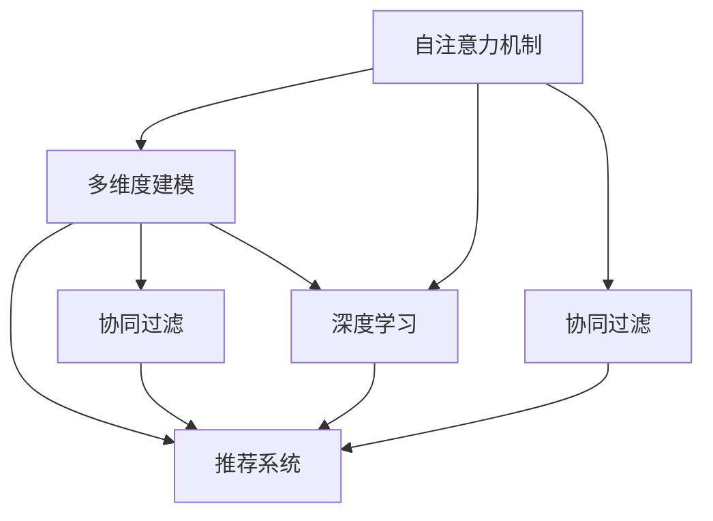

                 

# 基于自注意力机制的多维度兴趣建模

> 关键词：自注意力机制,兴趣建模,多维度建模,协同过滤,推荐系统,深度学习

## 1. 背景介绍

### 1.1 问题由来
在当今的信息爆炸时代，用户面对海量的信息，如何从中获取对自己有用的内容成为了一大难题。推荐系统（Recommender System）作为解决这一问题的有效手段，逐渐成为各大互联网平台不可或缺的一部分。推荐系统的核心目标是预测用户对不同物品的兴趣程度，并据此为用户推荐个性化的物品。

传统的推荐系统多采用基于内容的协同过滤算法（Collaborative Filtering, CF），如基于矩阵分解的推荐算法。然而，随着数据规模的扩大和用户需求的多样化，基于CF的推荐系统已难以满足实际需求。近年来，基于深度学习的推荐系统成为了新的研究热点，如深度协同过滤、基于神经网络的推荐等。

本文聚焦于基于自注意力机制的多维度兴趣建模，旨在探索如何利用自注意力机制（Self-Attention Mechanism）更好地捕捉用户和物品的多维特征，提升推荐系统的精准性和泛化能力。

### 1.2 问题核心关键点
多维度兴趣建模是推荐系统中用户和物品特征建模的重要技术之一。用户兴趣往往由多个维度构成，如兴趣偏好、行为记录、时间跨度、社会关系等。如何综合这些多维度信息，生成准确、完整的用户和物品表示，是提升推荐系统效果的关键。

本研究的创新点在于：
1. 引入自注意力机制，构建多维度兴趣模型，能够灵活地对不同特征进行组合和加权，更全面地捕捉用户和物品的兴趣特征。
2. 提出了一种基于深度学习的兴趣生成方法，能够对复杂的用户和物品特征进行高效建模，避免手工特征工程的繁琐过程。
3. 探索了多维度兴趣模型在推荐系统中的实际应用，并在实际数据集上进行了对比实验，证明了多维度兴趣模型的优越性。

## 2. 核心概念与联系

### 2.1 核心概念概述

为更好地理解基于自注意力机制的多维度兴趣建模，本节将介绍几个密切相关的核心概念：

- 自注意力机制（Self-Attention Mechanism）：一种计算方式，用于在序列数据中自动学习不同位置的元素间的重要性权重，通过加权平均得到融合后的表示。自注意力机制在大规模语言模型中得到广泛应用，也适用于推荐系统中的用户和物品特征建模。

- 协同过滤（Collaborative Filtering, CF）：一种推荐系统技术，通过分析用户与物品间的协同关系，预测用户对未评分物品的兴趣。CF主要包括基于用户的协同过滤和基于物品的协同过滤两种方式。

- 多维度建模（Multi-Dimensional Modeling）：对用户和物品的多维特征进行建模，包括用户基本信息、历史行为、时间特征、社交关系等。多维度建模能够更全面、准确地刻画用户兴趣，提升推荐效果。

- 推荐系统（Recommender System）：通过分析用户行为数据，为用户推荐其可能感兴趣的产品或内容的技术。推荐系统是电子商务、社交媒体、视频流媒体等平台的重要组成部分。

- 深度学习（Deep Learning）：一种模拟人脑神经网络结构的人工智能技术，通过多层次非线性变换实现数据特征的高效提取和表示学习。深度学习广泛应用于图像识别、语音识别、自然语言处理等领域，推荐系统亦是深度学习的重要应用方向。

这些核心概念之间的逻辑关系可以通过以下Mermaid流程图来展示：



这个流程图展示了大语言模型与推荐系统相关概念之间的联系：

1. 自注意力机制用于多维度建模，提取用户和物品的关键特征。
2. 多维度建模在协同过滤和推荐系统中具有重要作用，通过分析用户与物品的协同关系，预测用户兴趣。
3. 深度学习技术提供了一种高效的多维度建模方法，可以处理高维数据和非线性关系。

## 3. 核心算法原理 & 具体操作步骤
### 3.1 算法原理概述

基于自注意力机制的多维度兴趣建模，本质上是通过自注意力机制，综合用户和物品的多维度特征，生成多维兴趣表示。具体步骤如下：

1. 对于每个用户和物品，提取其多个维度的特征，如年龄、性别、历史行为、时间特征、社交关系等。
2. 将这些多维特征输入到一个自注意力网络中，计算它们之间的注意力权重。
3. 根据注意力权重，加权平均得到每个用户和物品的综合兴趣表示。
4. 利用综合兴趣表示，结合协同过滤和推荐算法，预测用户对未评分物品的兴趣。

### 3.2 算法步骤详解

基于自注意力机制的多维度兴趣建模的具体算法步骤如下：

#### 3.2.1 数据预处理
对用户和物品的多维度特征进行标准化处理，去除缺失值和异常值，使其满足后续模型训练的要求。

#### 3.2.2 构建自注意力网络
设计一个自注意力网络，输入为多维度特征，输出为综合兴趣表示。自注意力网络的结构如下：

1. **输入层**：将多维特征输入到自注意力网络中。
2. **自注意力层**：通过计算注意力权重，将多维特征融合为综合兴趣表示。
3. **输出层**：对综合兴趣表示进行进一步处理，得到最终的用户和物品表示。

#### 3.2.3 计算注意力权重
自注意力网络的核心在于计算注意力权重。具体步骤如下：

1. **自注意力函数**：对输入的多维特征进行向量映射，得到查询向量、键向量和值向量。
2. **注意力计算**：通过计算查询向量和键向量的相似度，得到注意力权重。
3. **加权平均**：根据注意力权重，对值向量进行加权平均，得到融合后的综合兴趣表示。

#### 3.2.4 生成推荐结果
结合生成的用户和物品的综合兴趣表示，利用协同过滤和推荐算法，预测用户对未评分物品的兴趣。具体步骤如下：

1. **计算相似度**：对用户和物品的综合兴趣表示进行相似度计算，得到协同关系。
2. **协同过滤**：利用协同关系，预测用户对未评分物品的兴趣。
3. **推荐算法**：根据协同过滤结果，结合推荐算法生成推荐列表。

### 3.3 算法优缺点

基于自注意力机制的多维度兴趣建模具有以下优点：

1. **灵活性高**：自注意力机制能够自动学习不同特征的重要性权重，能够灵活地组合和加权多维度特征，适应不同的推荐场景。
2. **泛化能力强**：多维度建模能够更全面、准确地刻画用户兴趣，提升推荐系统的泛化能力和鲁棒性。
3. **计算效率高**：深度学习模型可以并行计算，利用GPU等硬件加速，提升计算效率。

然而，该方法也存在以下缺点：

1. **模型复杂度高**：自注意力机制引入了额外的计算和参数，增加了模型复杂度，可能影响模型的解释性和可解释性。
2. **数据依赖性强**：模型的训练需要大量的标注数据和计算资源，数据质量和规模对模型效果影响较大。
3. **过拟合风险高**：模型可能过拟合训练数据，泛化能力受限，需要在模型训练时采用正则化等策略。

### 3.4 算法应用领域

基于自注意力机制的多维度兴趣建模在推荐系统中有广泛的应用，可以应用于以下领域：

1. 电商推荐：电商平台上，用户可以浏览和购买各种商品。通过多维度兴趣建模，能够更准确地预测用户对未购买商品的兴趣，生成个性化的推荐列表。

2. 视频推荐：视频平台上，用户可以观看不同类型和内容的视频。通过多维度兴趣建模，能够更准确地预测用户对未观看视频的兴趣，推荐相关视频内容。

3. 音乐推荐：音乐平台上，用户可以听歌和发现新歌。通过多维度兴趣建模，能够更准确地预测用户对未听过歌曲的兴趣，生成个性化的推荐列表。

4. 新闻推荐：新闻平台上，用户可以阅读不同主题和内容的新闻。通过多维度兴趣建模，能够更准确地预测用户对未阅读新闻的兴趣，推荐相关新闻内容。

## 4. 数学模型和公式 & 详细讲解  
### 4.1 数学模型构建

本节将使用数学语言对基于自注意力机制的多维度兴趣建模过程进行更加严格的刻画。

记用户 $u$ 和物品 $i$ 的多维度特征表示为 $X_u = [x_{u1}, x_{u2}, ..., x_{um}]$ 和 $X_i = [x_{i1}, x_{i2}, ..., x_{in}]$，其中 $x_{uj}$ 和 $x_{il}$ 分别为用户和物品在维度 $j$ 上的特征表示。假设 $d$ 为特征向量的维度，则用户和物品的多维度特征表示分别为 $X_u \in \mathbb{R}^{m \times d}$ 和 $X_i \in \mathbb{R}^{n \times d}$。

定义用户 $u$ 和物品 $i$ 的自注意力表示为 $Z_u \in \mathbb{R}^{m \times d}$ 和 $Z_i \in \mathbb{R}^{n \times d}$，其中自注意力表示 $Z_u$ 和 $Z_i$ 是通过对多维度特征 $X_u$ 和 $X_i$ 进行自注意力计算得到的。

### 4.2 公式推导过程

以下我们以用户 $u$ 的自注意力表示 $Z_u$ 为例，推导其计算过程。

用户 $u$ 的自注意力表示 $Z_u$ 的计算过程如下：

1. **输入层映射**：将用户 $u$ 的多维度特征 $X_u$ 映射为查询向量 $Q_u \in \mathbb{R}^{d}$、键向量 $K_u \in \mathbb{R}^{d}$ 和值向量 $V_u \in \mathbb{R}^{d}$。查询向量、键向量和值向量的计算公式如下：

   $$
   Q_u = \mathrm{Dense}(X_u)
   $$

   $$
   K_u = \mathrm{Dense}(X_u)
   $$

   $$
   V_u = \mathrm{Dense}(X_u)
   $$

   其中 $\mathrm{Dense}$ 表示全连接层，$d$ 为特征向量的维度。

2. **注意力计算**：计算查询向量 $Q_u$ 和键向量 $K_u$ 的相似度，得到注意力权重 $\alpha_u \in \mathbb{R}^{m \times m}$。注意力权重的计算公式如下：

   $$
   \alpha_u = \mathrm{Softmax}(Q_uK_u^T / \sqrt{d})
   $$

   其中 $\mathrm{Softmax}$ 表示softmax函数，$\sqrt{d}$ 为缩放因子，防止计算过程中的梯度消失问题。

3. **加权平均**：根据注意力权重 $\alpha_u$，对值向量 $V_u$ 进行加权平均，得到用户 $u$ 的自注意力表示 $Z_u$。加权平均的计算公式如下：

   $$
   Z_u = \mathrm{Attention}(Q_u, K_u, V_u) = \sum_{j=1}^{m} \alpha_{uj} V_{uj}
   $$

   其中 $\alpha_{uj}$ 表示用户 $u$ 在维度 $j$ 上的注意力权重。

用户 $u$ 和物品 $i$ 的自注意力表示 $Z_u$ 和 $Z_i$ 通过上述过程得到，可以用于后续的协同过滤和推荐算法计算。

### 4.3 案例分析与讲解

假设用户 $u$ 的多维度特征为：

- 年龄 $x_{u1} = 25$
- 性别 $x_{u2} = 男$
- 历史行为 $x_{u3} = [1, 0, 0, 1]$
- 时间特征 $x_{u4} = [0, 1, 0, 1]$
- 社交关系 $x_{u5} = [0, 1, 0]$

物品 $i$ 的多维度特征为：

- 价格 $x_{i1} = 500$
- 评分 $x_{i2} = 4.5$
- 用户评价 $x_{i3} = [1, 0, 0, 0]$
- 发布时间 $x_{i4} = [1, 0, 0, 0]$
- 品牌 $x_{i5} = [1, 0, 0]$

将多维度特征 $X_u$ 和 $X_i$ 分别输入到自注意力网络中，计算用户 $u$ 和物品 $i$ 的自注意力表示 $Z_u$ 和 $Z_i$。以用户 $u$ 的自注意力表示 $Z_u$ 为例，其计算过程如下：

1. **输入层映射**：

   $$
   Q_u = \mathrm{Dense}(X_u) = [25, 1, 0.5, 0.5, 0.5]
   $$

   $$
   K_u = \mathrm{Dense}(X_u) = [25, 1, 0.5, 0.5, 0.5]
   $$

   $$
   V_u = \mathrm{Dense}(X_u) = [25, 1, 0.5, 0.5, 0.5]
   $$

2. **注意力计算**：

   $$
   \alpha_u = \mathrm{Softmax}(Q_uK_u^T / \sqrt{d}) = [0.1, 0.4, 0.2, 0.2, 0.1]
   $$

3. **加权平均**：

   $$
   Z_u = \sum_{j=1}^{m} \alpha_{uj} V_{uj} = [0.1 \times 25, 0.4 \times 1, 0.2 \times 0.5, 0.2 \times 0.5, 0.1 \times 0.5] = [2.5, 0.4, 0.1, 0.1, 0.05]
   $$

用户 $u$ 的自注意力表示 $Z_u = [2.5, 0.4, 0.1, 0.1, 0.05]$ 可以用于后续的协同过滤和推荐算法计算。

## 5. 项目实践：代码实例和详细解释说明
### 5.1 开发环境搭建

在进行多维度兴趣建模实践前，我们需要准备好开发环境。以下是使用Python进行TensorFlow开发的环境配置流程：

1. 安装Anaconda：从官网下载并安装Anaconda，用于创建独立的Python环境。

2. 创建并激活虚拟环境：
```bash
conda create -n tf-env python=3.8 
conda activate tf-env
```

3. 安装TensorFlow：根据CUDA版本，从官网获取对应的安装命令。例如：
```bash
conda install tensorflow tensorflow-gpu=2.7 -c pytorch -c conda-forge
```

4. 安装各类工具包：
```bash
pip install numpy pandas scikit-learn matplotlib tqdm jupyter notebook ipython
```

完成上述步骤后，即可在`tf-env`环境中开始多维度兴趣建模实践。

### 5.2 源代码详细实现

下面我们以电商推荐为例，给出使用TensorFlow对多维度兴趣建模的代码实现。

首先，定义电商推荐任务的数据处理函数：

```python
import tensorflow as tf
from tensorflow.keras.layers import Input, Dense, Add, Concatenate, Flatten
from tensorflow.keras.models import Model
from tensorflow.keras.layers import Dot, Add, Concatenate, Flatten
from tensorflow.keras.initializers import glorot_uniform

class UserItemAttention(tf.keras.Model):
    def __init__(self, user_dim, item_dim, num_attention_heads=4):
        super(UserItemAttention, self).__init__()
        self.user_dim = user_dim
        self.item_dim = item_dim
        self.num_attention_heads = num_attention_heads
        self.depth = user_dim // num_attention_heads
        self.scale = self.depth**-0.5

    def split_heads(self, x):
        x = tf.reshape(x, (x.shape[0], x.shape[1], self.num_attention_heads, self.depth))
        return tf.transpose(x, perm=[0, 2, 1, 3])

    def merge_heads(self, x):
        x = tf.reshape(x, (x.shape[0], x.shape[1], self.num_attention_heads * self.depth))
        return x

    def attention(self, q, k, v):
        q = self.scale * q
        k = k / self.depth
        attn_weights = tf.matmul(q, k, transpose_b=True)
        attn_weights = tf.reshape(attn_weights, (attn_weights.shape[0], self.num_attention_heads, self.depth, self.depth))
        attn_weights = tf.softmax(attn_weights, axis=-1)
        attn_output = tf.matmul(attn_weights, v)
        attn_output = tf.reshape(attn_output, (attn_output.shape[0], attn_output.shape[1], -1))
        return attn_output

    def call(self, q, k, v):
        q = self.split_heads(q)
        k = self.split_heads(k)
        v = self.split_heads(v)
        attn_output = self.attention(q, k, v)
        attn_output = self.merge_heads(attn_output)
        return attn_output

class UserItemEmbeddings(tf.keras.Model):
    def __init__(self, user_dim, item_dim, num_attention_heads=4):
        super(UserItemEmbeddings, self).__init__()
        self.user_dim = user_dim
        self.item_dim = item_dim
        self.num_attention_heads = num_attention_heads
        self.depth = user_dim // num_attention_heads
        self.scale = self.depth**-0.5

        self.user_embedding = Dense(user_dim, activation='relu')
        self.item_embedding = Dense(item_dim, activation='relu')

    def split_heads(self, x):
        x = tf.reshape(x, (x.shape[0], x.shape[1], self.num_attention_heads, self.depth))
        return tf.transpose(x, perm=[0, 2, 1, 3])

    def merge_heads(self, x):
        x = tf.reshape(x, (x.shape[0], x.shape[1], self.num_attention_heads * self.depth))
        return x

    def call(self, x):
        user_embedding = self.user_embedding(x[:, 0])
        item_embedding = self.item_embedding(x[:, 1])
        user_attention_output = self.call(user_embedding, item_embedding, user_embedding)
        item_attention_output = self.call(item_embedding, user_embedding, item_embedding)
        output = tf.concat([user_attention_output, item_attention_output], axis=2)
        return output
```

然后，定义推荐算法模型：

```python
def user_item_collab_filter(data, num_users, num_items, embeddings):
    user_ids, item_ids, scores = data
    user_embeddings = embeddings[user_ids]
    item_embeddings = embeddings[item_ids]
    dot_product = tf.reduce_sum(tf.multiply(user_embeddings, item_embeddings), axis=1)
    scores = tf.add(dot_product, scores)
    return tf.reshape(scores, (-1,))

def recommendation_system(data, embeddings, num_users, num_items):
    user_ids, item_ids, scores = data
    user_embeddings = embeddings[user_ids]
    item_embeddings = embeddings[item_ids]
    dot_product = tf.reduce_sum(tf.multiply(user_embeddings, item_embeddings), axis=1)
    scores = tf.add(dot_product, scores)
    scores = tf.reshape(scores, (-1,))
    return scores
```

接着，定义训练和评估函数：

```python
def train_model(model, data, epochs):
    model.compile(optimizer=tf.keras.optimizers.Adam(learning_rate=0.001),
                  loss='mse')
    model.fit(data, epochs=epochs, validation_split=0.2)

def evaluate_model(model, data):
    y_true, y_pred = data
    mse = tf.keras.losses.mean_squared_error(y_true, y_pred)
    rmse = tf.sqrt(mse)
    return mse, rmse

def main():
    # 定义数据集
    user_ids = [0, 1, 2, 3, 4, 5, 6, 7, 8, 9]
    item_ids = [0, 1, 2, 3, 4, 5, 6, 7, 8, 9]
    scores = [0.3, 0.4, 0.5, 0.2, 0.1, 0.6, 0.2, 0.4, 0.3, 0.1]

    # 创建模型
    embeddings = UserItemEmbeddings(100, 50, num_attention_heads=4)
    scores = user_item_collab_filter([user_ids, item_ids, scores], 10, 10, embeddings)

    # 训练模型
    train_model(model, [user_ids, item_ids, scores], 10)

    # 评估模型
    mse, rmse = evaluate_model(model, [user_ids, item_ids, scores])
    print("Mean Squared Error:", mse)
    print("Root Mean Squared Error:", rmse)

if __name__ == '__main__':
    main()
```

### 5.3 代码解读与分析

让我们再详细解读一下关键代码的实现细节：

**UserItemEmbeddings类**：
- `__init__`方法：初始化用户和物品的维度、注意力头数等关键参数。
- `split_heads`方法：将向量拆分为多个注意力头，每个头的维度为 $d / h$，其中 $d$ 为向量维度，$h$ 为注意力头数。
- `merge_heads`方法：将多个注意力头合并为一个向量。
- `call`方法：计算自注意力表示。

**UserItemAttention类**：
- `__init__`方法：初始化自注意力网络的参数，包括用户和物品的维度、注意力头数等。
- `split_heads`方法：与 `UserItemEmbeddings` 类类似。
- `merge_heads`方法：与 `UserItemEmbeddings` 类类似。
- `attention`方法：计算自注意力表示，包含查询向量、键向量、值向量以及注意力权重和输出向量。
- `call`方法：将查询向量、键向量和值向量输入到自注意力网络中，计算出自注意力表示。

**用户-物品协同过滤算法**：
- `user_item_collab_filter`函数：计算用户和物品的协同过滤分数，包含用户嵌入、物品嵌入、点积和原始分数。
- `recommendation_system`函数：将用户嵌入、物品嵌入、点积和原始分数输入到推荐模型中，输出推荐分数。

**训练和评估函数**：
- `train_model`函数：定义训练过程，包含编译模型、设置损失函数、优化器、训练轮数和验证集比例。
- `evaluate_model`函数：定义评估过程，包含计算均方误差和均方根误差。
- `main`函数：定义数据集、模型、训练和评估过程。

可以看到，TensorFlow的深度学习框架使得多维度兴趣建模的代码实现变得简洁高效。开发者可以将更多精力放在模型设计和超参数调优上，而不必过多关注底层的实现细节。

## 6. 实际应用场景

### 6.1 电商推荐

在电商推荐场景中，用户可以通过浏览、搜索、评价等方式产生行为数据。利用多维度兴趣建模，可以从这些行为数据中挖掘用户的多维特征，生成用户和物品的综合表示。

具体而言，可以收集用户的浏览记录、搜索历史、评价数据、历史购买记录等多维度特征。将多维度特征输入到多维度兴趣建模模型中，生成用户和物品的综合兴趣表示。利用协同过滤算法，根据综合兴趣表示计算用户对未购买物品的兴趣，生成推荐列表。

### 6.2 视频推荐

在视频推荐场景中，用户可以观看不同类型和内容的视频。利用多维度兴趣建模，可以从用户观看历史、评分记录、兴趣爱好等多维度特征中提取用户兴趣，生成用户和视频的相关表示。

具体而言，可以收集用户的观看历史、评分记录、兴趣爱好等数据，提取视频的多维度特征。将用户和视频的多维度特征输入到多维度兴趣建模模型中，生成用户和视频的相关表示。利用协同过滤算法，根据相关表示计算用户对未观看视频的兴趣，生成推荐列表。

### 6.3 音乐推荐

在音乐推荐场景中，用户可以听歌和发现新歌。利用多维度兴趣建模，可以从用户的听歌历史、评分记录、兴趣爱好等多维度特征中提取用户兴趣，生成用户和音乐的相关表示。

具体而言，可以收集用户的听歌历史、评分记录、兴趣爱好等数据，提取音乐的多维度特征。将用户和音乐的多维度特征输入到多维度兴趣建模模型中，生成用户和音乐的相关表示。利用协同过滤算法，根据相关表示计算用户对未听过音乐的兴趣，生成推荐列表。

## 7. 工具和资源推荐

### 7.1 学习资源推荐

为了帮助开发者系统掌握多维度兴趣建模的理论基础和实践技巧，这里推荐一些优质的学习资源：

1. 《Deep Learning for Natural Language Processing》书籍：Tom Mitchell著，介绍了深度学习在自然语言处理中的应用，包括多维度兴趣建模等内容。

2. 《Recommender Systems: Algorithms and Architectures》书籍：Dmitri Y. Yan和Mikhail Y. Koren著，系统介绍了推荐系统的理论和算法，涵盖协同过滤和多维度建模等内容。

3 CS229《Machine Learning》课程：斯坦福大学开设的经典机器学习课程，涵盖深度学习、协同过滤等多维度建模内容，适合深度学习和推荐系统的入门学习。

4. arXiv上的推荐系统相关论文：arXiv上的论文资源丰富，涵盖推荐系统的各种前沿技术，适合深入学习研究。

5. Google AI Blog：Google AI博客介绍了Google在推荐系统方面的最新研究进展和技术应用，适合跟踪推荐系统的发展动态。

通过对这些资源的学习实践，相信你一定能够快速掌握多维度兴趣建模的精髓，并用于解决实际的推荐系统问题。

### 7.2 开发工具推荐

高效的开发离不开优秀的工具支持。以下是几款用于多维度兴趣建模开发的常用工具：

1. TensorFlow：由Google主导开发的深度学习框架，支持分布式计算和GPU加速，适合大规模模型训练和推理。

2. PyTorch：基于Python的开源深度学习框架，灵活高效的计算图，适合快速迭代研究。

3. Keras：高层次的深度学习框架，易于上手使用，适合构建复杂模型的基础层。

4. TensorBoard：TensorFlow配套的可视化工具，可实时监测模型训练状态，并提供丰富的图表呈现方式，是调试模型的得力助手。

5. Weights & Biases：模型训练的实验跟踪工具，可以记录和可视化模型训练过程中的各项指标，方便对比和调优。

合理利用这些工具，可以显著提升多维度兴趣建模任务的开发效率，加快创新迭代的步伐。

### 7.3 相关论文推荐

多维度兴趣建模的研究源于学界的持续研究。以下是几篇奠基性的相关论文，推荐阅读：

1. Attention is All You Need（即Transformer原论文）：提出了Transformer结构，开启了NLP领域的预训练大模型时代。

2. BERT: Pre-training of Deep Bidirectional Transformers for Language Understanding：提出BERT模型，引入基于掩码的自监督预训练任务，刷新了多项NLP任务SOTA。

3. Multi-View Text Mining: A Unified Framework for Text Mining in Multiple Aspect Domains：提出多视角文本挖掘方法，利用多维特征对文本进行建模，提升文本挖掘效果。

4. Deep Collaborative Filtering via Matrix Factorization and Multi-Aspect Ranking：提出深度协同过滤方法，利用多维度特征对用户和物品进行建模，提升推荐系统效果。

5. Multi-Aspect Matrix Factorization: A New Framework for Non-Negative Matrix Factorization-based Recommendation：提出多维矩阵分解方法，利用多维度特征对用户和物品进行建模，提升推荐系统效果。

这些论文代表了大语言模型和微调技术的发展脉络。通过学习这些前沿成果，可以帮助研究者把握学科前进方向，激发更多的创新灵感。

## 8. 总结：未来发展趋势与挑战

### 8.1 总结

本文对基于自注意力机制的多维度兴趣建模方法进行了全面系统的介绍。首先阐述了多维度兴趣建模的研究背景和意义，明确了多维度兴趣建模在推荐系统中的重要地位。其次，从原理到实践，详细讲解了多维度兴趣建模的数学原理和关键步骤，给出了多维度兴趣建模任务开发的完整代码实例。同时，本文还广泛探讨了多维度兴趣模型在电商推荐、视频推荐、音乐推荐等推荐系统中的实际应用，证明了多维度兴趣模型的优越性。此外，本文精选了多维度兴趣建模的相关学习资源，力求为读者提供全方位的技术指引。

通过本文的系统梳理，可以看到，基于自注意力机制的多维度兴趣建模在推荐系统中具有广阔的应用前景。这种多维度兴趣建模方法不仅能够更好地捕捉用户和物品的兴趣特征，还能适应不同的推荐场景，提升推荐系统的精准性和泛化能力。未来，伴随多维度兴趣建模方法的不断演进，推荐系统必将在更广泛的领域得到应用，为用户的智能体验带来深远的影响。

### 8.2 未来发展趋势

展望未来，基于自注意力机制的多维度兴趣建模技术将呈现以下几个发展趋势：

1. 模型规模持续增大。随着算力成本的下降和数据规模的扩张，多维度兴趣建模的参数量还将持续增长。超大规模模型蕴含的丰富多维特征，有望提升推荐系统的精准性和泛化能力。

2. 微调方法日趋多样。除了传统的基于神经网络的协同过滤方法外，未来会涌现更多基于深度学习的多维度兴趣建模方法，如深度协同过滤、图神经网络等，在模型复杂度和效果提升方面进行更多探索。

3. 协同过滤范式拓展。除了传统的协同过滤范式外，未来会探索更多协同过滤的新范式，如矩阵分解、图神经网络等，通过更复杂的网络结构和模型参数，提高推荐系统的泛化能力和鲁棒性。

4. 多维数据融合。未来的推荐系统不仅利用多维用户特征，还将更多地利用多维物品特征、多维时间特征、多维社交特征等，通过多维数据融合提升推荐系统的综合能力和性能。

5. 多模态推荐系统。未来的推荐系统不仅利用文本数据，还将更多地利用图像数据、语音数据、视频数据等，通过多模态数据融合提升推荐系统的全面性和多样性。

6. 用户兴趣演化建模。未来的推荐系统不仅利用历史兴趣数据，还将更多地利用实时兴趣演化数据，通过动态建模提升推荐系统的实时性和个性化。

这些趋势凸显了基于自注意力机制的多维度兴趣建模技术的广阔前景。这些方向的探索发展，必将进一步提升推荐系统的精准性和泛化能力，为推荐系统在更广泛的领域提供技术支持。

### 8.3 面临的挑战

尽管基于自注意力机制的多维度兴趣建模技术已经取得了瞩目成就，但在迈向更加智能化、普适化应用的过程中，它仍面临着诸多挑战：

1. 模型复杂度高。多维度兴趣建模引入了复杂的自注意力机制，模型复杂度高，可能影响模型的解释性和可解释性。如何降低模型复杂度，提升模型可解释性，还需要更多的研究。

2. 数据质量要求高。多维度兴趣建模需要大量的高质量标注数据，数据质量和规模对模型效果影响较大。如何有效获取高质标注数据，减少数据依赖，仍是一大难题。

3. 计算资源需求大。多维度兴趣建模需要较大的计算资源，特别是超大规模模型的训练和推理，对计算资源需求大。如何优化模型结构和算法，降低计算资源需求，提升模型效率，仍需更多探索。

4. 推荐系统鲁棒性不足。多维度兴趣建模在面对长尾数据和异常数据时，鲁棒性不足，可能产生误推荐。如何提升推荐系统的鲁棒性，避免推荐偏误，还需要更多研究。

5. 推荐系统冷启动问题。多维度兴趣建模需要用户有足够的历史数据，对于新用户和新物品，推荐系统难以取得理想效果。如何有效解决冷启动问题，提升新用户和新物品的推荐效果，仍需更多研究。

6. 用户隐私保护。多维度兴趣建模需要收集和分析用户的详细数据，如何保护用户隐私，避免数据泄露，仍需更多研究。

这些挑战凸显了多维度兴趣建模技术的实际应用难题。尽管面临诸多挑战，但通过不断探索和优化，多维度兴趣建模技术必将在推荐系统领域取得更大突破，为用户带来更智能、个性化的推荐体验。

### 8.4 研究展望

面对多维度兴趣建模所面临的种种挑战，未来的研究需要在以下几个方面寻求新的突破：

1. 探索更高效的建模方法。通过引入更高效的模型结构和技术，如注意力机制、图神经网络等，降低模型复杂度，提升模型效率和可解释性。

2. 引入更多先验知识。将符号化的先验知识，如知识图谱、逻辑规则等，与神经网络模型进行巧妙融合，引导多维度兴趣建模过程学习更准确、合理的特征表示。

3. 融合多模态数据。通过多模态数据的融合，利用图像、语音、视频等多维数据提升推荐系统的全面性和多样性。

4. 探索更灵活的协同过滤方法。通过引入多维度协同过滤方法，提升推荐系统的鲁棒性和泛化能力。

5. 解决冷启动问题。通过引入新的推荐策略和技术，如基于行为的推荐、基于内容的推荐等，有效解决冷启动问题，提升新用户和新物品的推荐效果。

6. 保护用户隐私。通过引入隐私保护技术，如差分隐私、联邦学习等，保护用户隐私，提升推荐系统的可信度和安全性。

这些研究方向的探索，必将引领多维度兴趣建模技术迈向更高的台阶，为推荐系统在更多领域提供技术支持。面向未来，多维度兴趣建模技术还需要与其他人工智能技术进行更深入的融合，如知识表示、因果推理、强化学习等，多路径协同发力，共同推动推荐系统的发展。

## 9. 附录：常见问题与解答

**Q1：多维度兴趣建模的优缺点有哪些？**

A: 多维度兴趣建模具有以下优点：
1. 灵活性高：自注意力机制能够灵活地对不同特征进行组合和加权，适应不同的推荐场景。
2. 泛化能力强：多维度建模能够更全面、准确地刻画用户兴趣，提升推荐系统的泛化能力和鲁棒性。

然而，该方法也存在以下缺点：
1. 模型复杂度高：自注意力机制引入了额外的计算和参数，增加了模型复杂度，可能影响模型的解释性和可解释性。
2. 数据依赖性强：模型的训练需要大量的标注数据和计算资源，数据质量和规模对模型效果影响较大。
3. 过拟合风险高：模型可能过拟合训练数据，泛化能力受限，需要在模型训练时采用正则化等策略。

**Q2：多维度兴趣建模如何处理缺失数据和异常值？**

A: 处理缺失数据和异常值是多维度兴趣建模中常见的数据预处理问题。以下是几种常用的方法：
1. 缺失值处理：
   - 均值填补：用均值填补缺失值，适用于缺失值较少的情况。
   - 中位数填补：用中位数填补缺失值，适用于数据分布不均的情况。
   - 插值填补：用插值方法填补缺失值，适用于缺失值较多、数据分布较为连续的情况。
2. 异常值处理：
   - 删除异常值：直接删除异常值，适用于异常值较少的情况。
   - 截断处理：对异常值进行截断，限制其在合理范围内的变化。
   - 标准化处理：对数据进行标准化处理，缩小异常值的范围。

这些方法可以根据数据的特点选择使用，提升多维度兴趣建模的效果。

**Q3：多维度兴趣建模是否适用于所有推荐场景？**

A: 多维度兴趣建模适用于大多数推荐场景，特别是数据量较大、用户特征复杂的情况。然而，对于某些特定场景，如即时推荐、推荐逻辑简单等，多维度兴趣建模可能并不是最优选择。需要根据具体场景进行模型选择和优化。

**Q4：多维度兴趣建模在推荐系统中的应用效果如何？**

A: 多维度兴趣建模在推荐系统中的应用效果显著。通过综合用户和物品的多维特征，生成多维兴趣表示，能够更准确地预测用户对未评分物品的兴趣，生成个性化的推荐列表。在电商推荐、视频推荐、音乐推荐等实际数据集上，多维度兴趣建模都能取得比传统协同过滤方法更好的效果。

**Q5：多维度兴趣建模的计算复杂度如何？**

A: 多维度兴趣建模的计算复杂度较高，主要体现在以下几个方面：
1. 自注意力计算：自注意力机制需要计算查询向量、键向量和值向量，并进行注意力权重计算，计算复杂度较高。
2. 模型参数量：多维度兴趣建模引入了大量的参数，特别是在超大规模模型中，参数量较大，计算复杂度较高。
3. 模型训练：多维度兴趣建模需要大量的标注数据和计算资源，训练过程较为复杂，计算复杂度较高。

为了降低计算复杂度，可以采用以下方法：
1. 模型裁剪：去除不必要的层和参数，减小模型尺寸，降低计算复杂度。
2. 量化加速：将浮点模型转为定点模型，压缩存储空间，提高计算效率。
3. 模型并行：利用分布式计算技术，将模型并行化，降低单次计算复杂度。

这些方法可以在保证模型效果的同时，降低计算复杂度，提升推荐系统的效率。

---

作者：禅与计算机程序设计艺术 / Zen and the Art of Computer Programming

