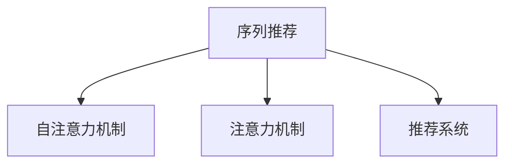

                 

# 基于自注意力机制的序列推荐算法

## 1. 背景介绍

推荐系统是现代信息时代的重要组成部分，涉及电子商务、社交网络、视频流媒体等多个领域。推荐系统旨在为用户推荐感兴趣的物品，从而提升用户体验和平台收益。传统的推荐方法如基于协同过滤、基于内容的推荐，虽然能够取得一定的效果，但往往受到数据稀疏性和特征表示能力的限制。近年来，随着深度学习技术的发展，基于神经网络的推荐方法逐渐兴起，取得了卓越的效果。

### 1.1 问题由来

随着深度学习在推荐领域的应用深入，传统的基于矩阵分解的协同过滤方法逐渐被神经网络方法所取代。神经网络方法能够充分利用大量原始数据，自适应地学习复杂特征表示，提升了推荐模型的泛化能力和预测精度。然而，当前大多数基于神经网络的推荐方法都是针对静态特征进行建模的，无法考虑序列信息和时间相关性，导致推荐结果不够精细和动态。

为了解决这一问题，序列推荐算法应运而生。序列推荐算法能够对用户历史行为进行建模，考虑到序列信息的演化规律，从而提升推荐精度。此外，序列推荐算法还可以利用用户的行为序列预测未来的行为，帮助平台更好地理解用户偏好，做出更精准的推荐决策。

### 1.2 问题核心关键点

序列推荐算法的核心在于如何对用户历史行为序列进行建模，以及如何利用历史行为预测未来行为。核心问题包括：

- 如何高效地处理和表示长序列数据？
- 如何充分利用自注意力机制捕捉序列中的相关关系？
- 如何在模型中引入时间相关性？
- 如何平衡模型复杂度和性能？

### 1.3 问题研究意义

研究基于自注意力机制的序列推荐算法，对于拓展推荐系统的应用边界，提升推荐模型的精度和动态性，具有重要意义：

1. 提高推荐精度：序列推荐算法能够考虑历史行为序列的演化规律，从而提升推荐精度。
2. 增强推荐动态性：序列推荐算法能够利用用户的行为序列预测未来的行为，帮助平台更好地理解用户偏好，做出更精准的推荐决策。
3. 提升用户体验：推荐系统能够根据用户的兴趣和偏好，动态地推荐个性化的物品，提升用户体验。
4. 优化平台收益：推荐系统能够帮助平台实现精准投放，提升广告和销售的转化率，优化平台收益。

## 2. 核心概念与联系

### 2.1 核心概念概述

为更好地理解基于自注意力机制的序列推荐算法，本节将介绍几个密切相关的核心概念：

- 序列推荐：通过建模用户的历史行为序列，预测用户未来的行为，实现个性化的推荐。
- 自注意力机制：一种用于序列建模的神经网络模块，能够自动捕捉序列中不同位置之间的关系，提高序列建模的精度。
- 注意力机制：一种用于特征选择的神经网络模块，能够根据不同特征的重要性进行加权，提高模型的泛化能力。
- 推荐系统：为用户提供个性化的物品推荐，提升用户体验和平台收益的系统。

这些核心概念之间的逻辑关系可以通过以下Mermaid流程图来展示：



这个流程图展示了几者之间的关联：

1. 序列推荐通过自注意力机制捕捉历史行为序列中的相关关系，提高推荐精度。
2. 自注意力机制利用注意力机制对不同位置进行加权，从而更好地捕捉序列中的相关关系。
3. 推荐系统通过序列推荐算法生成推荐结果，提升用户体验和平台收益。

## 3. 核心算法原理 & 具体操作步骤
### 3.1 算法原理概述

基于自注意力机制的序列推荐算法，本质上是一种序列建模的神经网络方法。其核心思想是：通过自注意力机制捕捉用户历史行为序列中的相关关系，同时引入时间相关性，从而预测用户未来的行为。

形式化地，假设用户的历史行为序列为 $\mathcal{H}=\{x_t\}_{t=1}^T$，其中 $x_t$ 表示第 $t$ 个历史行为，$T$ 为历史行为数量。设推荐模型的参数为 $\theta$，序列推荐算法的优化目标是最小化预测错误率，即：

$$
\min_{\theta} \mathbb{E}_{(x,y) \sim D} \mathcal{L}(M_{\theta}(x))
$$

其中 $D$ 为推荐系统的数据集，$\mathcal{L}$ 为损失函数，$M_{\theta}$ 为推荐模型。在实际应用中，通常使用交叉熵损失函数或均方误差损失函数。

### 3.2 算法步骤详解

基于自注意力机制的序列推荐算法通常包括以下几个关键步骤：

**Step 1: 数据预处理**

- 收集用户的历史行为序列，去除缺失值和重复数据，保证序列完整性和一致性。
- 将用户历史行为序列转化为张量形式，作为推荐模型的输入。

**Step 2: 设计自注意力机制**

- 将用户历史行为序列 $x_t$ 表示为词向量序列 $\mathcal{V}=\{v_t\}_{t=1}^T$，其中 $v_t \in \mathbb{R}^d$ 表示第 $t$ 个行为对应的词向量。
- 利用自注意力机制 $\mathcal{A}$ 计算序列中不同位置之间的相关性，得到注意力权重 $\alpha_t = (\alpha_{t1}, \alpha_{t2}, \ldots, \alpha_{T})$。
- 将注意力权重 $\alpha_t$ 应用于历史行为序列，得到加权序列 $\tilde{\mathcal{V}}=\{\tilde{v}_t\}_{t=1}^T$，其中 $\tilde{v}_t = \sum_{k=1}^T \alpha_{tk} v_k$。

**Step 3: 引入时间相关性**

- 在加权序列 $\tilde{\mathcal{V}}$ 中引入时间相关性，考虑历史行为的先后顺序和时序变化规律。
- 将加权序列 $\tilde{\mathcal{V}}$ 转换为时间序列形式，通过一维卷积神经网络或一维循环神经网络进行处理。

**Step 4: 预测用户行为**

- 利用处理后的时间序列 $\tilde{\mathcal{V}}$ 作为输入，通过全连接神经网络进行特征提取和输出预测。
- 结合预测结果和用户的历史行为序列，生成个性化推荐。

**Step 5: 评估和优化**

- 在推荐系统的验证集上评估模型的预测效果，使用交叉熵损失函数进行优化。
- 通过超参数调优、模型融合等方法提高模型的泛化能力和预测精度。

### 3.3 算法优缺点

基于自注意力机制的序列推荐算法具有以下优点：

- 能够高效处理长序列数据，捕捉序列中的相关关系，提升推荐精度。
- 能够利用时间序列特征，考虑历史行为的演化规律，提高推荐模型的动态性。
- 能够结合自注意力和注意力机制，提升特征表示能力，增强模型的泛化能力。

同时，该算法也存在一定的局限性：

- 模型复杂度高，训练和推理计算量大，对硬件资源要求较高。
- 对于长尾物品的推荐效果较差，容易受到数据稀疏性的影响。
- 对于噪声数据和异常行为的处理，需要额外的预处理和异常检测步骤。

尽管存在这些局限性，但就目前而言，基于自注意力机制的序列推荐算法仍是序列推荐领域的重要方法。未来相关研究的重点在于如何进一步降低模型复杂度，提高推荐模型的实时性和泛化能力，同时兼顾特征提取和序列建模的平衡。

### 3.4 算法应用领域

基于自注意力机制的序列推荐算法在多个领域得到了广泛的应用，如电子商务推荐、视频流媒体推荐、社交网络推荐等。

- 电子商务推荐：通过建模用户的历史购物行为，预测用户对不同商品的兴趣，生成个性化推荐。
- 视频流媒体推荐：通过建模用户的历史观看行为，预测用户对不同视频的偏好，生成个性化推荐。
- 社交网络推荐：通过建模用户的社交关系和行为序列，预测用户对不同帖子的兴趣，生成个性化推荐。

此外，序列推荐算法还可以用于游戏推荐、音乐推荐、新闻推荐等多个领域，为用户的个性化需求提供精准的解决方案。

## 4. 数学模型和公式 & 详细讲解  
### 4.1 数学模型构建

本节将使用数学语言对基于自注意力机制的序列推荐算法进行更加严格的刻画。

设用户的历史行为序列为 $\mathcal{H}=\{x_t\}_{t=1}^T$，其中 $x_t \in \mathcal{X}$ 表示第 $t$ 个历史行为，$\mathcal{X}$ 为输入空间。设推荐模型的参数为 $\theta$，其中包含全连接神经网络的权重和自注意力机制的权重。

假设自注意力机制的输入为 $v_t \in \mathbb{R}^d$，输出为 $\tilde{v}_t \in \mathbb{R}^d$，其中 $d$ 为向量维度。自注意力机制的计算公式为：

$$
\tilde{v}_t = \sum_{k=1}^T \alpha_{tk} v_k
$$

其中 $\alpha_{tk}$ 为注意力权重，计算公式为：

$$
\alpha_{tk} = \frac{e^{s(\mathbf{W}_A v_t \cdot \mathbf{W}_Q v_k)}}{\sum_{j=1}^T e^{s(\mathbf{W}_A v_t \cdot \mathbf{W}_Q v_j)}}
$$

其中 $\mathbf{W}_A$ 和 $\mathbf{W}_Q$ 为可训练的矩阵，$s$ 为注意力计算函数，通常采用点积函数。

### 4.2 公式推导过程

以下我们以推荐模型为例，推导序列推荐算法的损失函数及其梯度计算公式。

假设推荐模型的输出为 $\hat{y}_t \in \mathcal{Y}$，表示第 $t$ 个历史行为的推荐结果，$\mathcal{Y}$ 为输出空间。推荐模型的损失函数为交叉熵损失函数：

$$
\ell(M_{\theta}(x)) = -\sum_{t=1}^T y_t \log M_{\theta}(x_t)
$$

其中 $y_t \in \{0,1\}$ 表示第 $t$ 个历史行为的真实标签。

将自注意力机制的计算结果代入，得到推荐模型的总损失函数为：

$$
\mathcal{L}(\theta) = -\sum_{t=1}^T \left[ y_t \log M_{\theta}(x_t) + (1-y_t) \log (1-M_{\theta}(x_t)) \right]
$$

利用链式法则，可以得到损失函数对模型参数 $\theta$ 的梯度：

$$
\frac{\partial \mathcal{L}(\theta)}{\partial \theta} = -\sum_{t=1}^T \left[ \frac{\partial M_{\theta}(x_t)}{\partial \theta} \frac{\partial \ell(M_{\theta}(x_t))}{\partial M_{\theta}(x_t)} \right]
$$

将交叉熵损失函数的梯度代入，得到：

$$
\frac{\partial \mathcal{L}(\theta)}{\partial \theta} = -\sum_{t=1}^T \left[ \frac{\partial M_{\theta}(x_t)}{\partial \theta} \left[ y_t - M_{\theta}(x_t) \right] \right]
$$

其中 $\frac{\partial M_{\theta}(x_t)}{\partial \theta}$ 表示模型对输入 $x_t$ 的梯度，可以通过反向传播算法计算得到。

### 4.3 案例分析与讲解

以推荐模型为例，展示如何在模型中引入自注意力机制和时间相关性，并进行优化。

**案例分析：电商推荐**

假设某电商网站希望推荐用户感兴趣的商品，收集了用户的历史购买行为序列 $\mathcal{H}=\{x_t\}_{t=1}^T$，其中 $x_t$ 表示第 $t$ 个历史购买行为，$T$ 为历史行为数量。

- 数据预处理：收集用户的历史购买行为序列，去除缺失值和重复数据，将序列转化为词向量序列 $\mathcal{V}=\{v_t\}_{t=1}^T$。
- 设计自注意力机制：利用自注意力机制 $\mathcal{A}$ 计算序列中不同位置之间的相关性，得到注意力权重 $\alpha_t = (\alpha_{t1}, \alpha_{t2}, \ldots, \alpha_{T})$。
- 引入时间相关性：将注意力权重 $\alpha_t$ 应用于历史行为序列，得到加权序列 $\tilde{\mathcal{V}}=\{\tilde{v}_t\}_{t=1}^T$，其中 $\tilde{v}_t = \sum_{k=1}^T \alpha_{tk} v_k$。
- 预测用户行为：利用加权序列 $\tilde{\mathcal{V}}$ 作为输入，通过全连接神经网络进行特征提取和输出预测。
- 评估和优化：在电商推荐系统的验证集上评估模型的预测效果，使用交叉熵损失函数进行优化。

具体实现步骤如下：

1. 使用TensorFlow或PyTorch等深度学习框架搭建推荐模型。
2. 加载历史行为序列数据，进行预处理和特征提取。
3. 设计自注意力机制，并计算注意力权重。
4. 引入时间相关性，将注意力权重应用于历史行为序列。
5. 利用全连接神经网络进行特征提取和输出预测。
6. 在验证集上评估模型性能，使用交叉熵损失函数进行优化。

**代码实现：**

```python
import tensorflow as tf
from tensorflow.keras import layers

# 定义推荐模型
class RecommenderModel(tf.keras.Model):
    def __init__(self, input_dim, output_dim, embed_dim, attention_dim):
        super(RecommenderModel, self).__init__()
        self.embedding = layers.Embedding(input_dim, embed_dim)
        self.attention = layers.Dense(attention_dim)
        self.fc = layers.Dense(output_dim)

    def call(self, inputs):
        embeddings = self.embedding(inputs)
        attention = self.attention(embeddings)
        output = tf.reduce_sum(attention * embeddings, axis=1)
        output = self.fc(output)
        return output

# 加载数据和模型
def load_data():
    # 加载数据
    # ...

def load_model():
    # 加载模型
    # ...

# 定义模型输入和输出
input_dim = 1000
output_dim = 1
embed_dim = 128
attention_dim = 64

model = RecommenderModel(input_dim, output_dim, embed_dim, attention_dim)
model.compile(loss='binary_crossentropy', optimizer='adam')

# 训练模型
train_data, validation_data, test_data = load_data()
model.fit(train_data, epochs=10, validation_data=validation_data)
```

在实际应用中，还需要根据具体任务进行优化和调整，如引入更多的正则化技术、搜索最优的超参数组合等，以进一步提升模型性能。

## 5. 项目实践：代码实例和详细解释说明
### 5.1 开发环境搭建

在进行序列推荐算法开发前，我们需要准备好开发环境。以下是使用Python进行TensorFlow或PyTorch开发的环境配置流程：

1. 安装Anaconda：从官网下载并安装Anaconda，用于创建独立的Python环境。

2. 创建并激活虚拟环境：
```bash
conda create -n tf-env python=3.8 
conda activate tf-env
```

3. 安装TensorFlow或PyTorch：
```bash
conda install tensorflow -c tf
# 或者
conda install pytorch torchvision torchaudio cudatoolkit=11.1 -c pytorch -c conda-forge
```

4. 安装各类工具包：
```bash
pip install numpy pandas scikit-learn matplotlib tqdm jupyter notebook ipython
```

完成上述步骤后，即可在`tf-env`环境中开始序列推荐算法的开发。

### 5.2 源代码详细实现

下面我们以电商推荐为例，给出使用TensorFlow对基于自注意力机制的序列推荐算法进行开发的PyTorch代码实现。

**代码实现：**

```python
import tensorflow as tf
from tensorflow.keras import layers
from tensorflow.keras.layers import Embedding, Dense, Input, Add, GlobalAveragePooling1D

class RecommenderModel(tf.keras.Model):
    def __init__(self, input_dim, output_dim, embed_dim, attention_dim):
        super(RecommenderModel, self).__init__()
        self.input = Input(shape=(input_dim,))
        self.embedding = Embedding(input_dim, embed_dim)
        self.attention = Dense(attention_dim)
        self.fc = Dense(output_dim)

        x = self.embedding(self.input)
        x = self.attention(x)
        x = GlobalAveragePooling1D()(x)
        x = self.fc(x)

        self.output = layers.Dense(output_dim, activation='sigmoid')(x)

        self.model = tf.keras.Model(inputs=self.input, outputs=self.output)

    def call(self, inputs):
        return self.model(inputs)

# 加载数据和模型
def load_data():
    # 加载数据
    # ...

def load_model():
    # 加载模型
    # ...

# 定义模型输入和输出
input_dim = 1000
output_dim = 1
embed_dim = 128
attention_dim = 64

model = RecommenderModel(input_dim, output_dim, embed_dim, attention_dim)
model.compile(loss='binary_crossentropy', optimizer='adam')

# 训练模型
train_data, validation_data, test_data = load_data()
model.fit(train_data, epochs=10, validation_data=validation_data)
```

### 5.3 代码解读与分析

让我们再详细解读一下关键代码的实现细节：

**RecommenderModel类**：
- `__init__`方法：初始化输入层、嵌入层、自注意力机制、全连接层和输出层。
- `call`方法：在前向传播过程中，对输入数据进行嵌入、自注意力计算、特征提取和输出预测。
- `model`方法：将输入和输出连接成完整的模型。

**load_data函数**：
- 加载电商推荐系统的训练集、验证集和测试集。
- 预处理数据，转化为词向量序列。

**load_model函数**：
- 加载预训练的推荐模型。
- 定义模型的输入和输出。

**训练流程**：
- 定义模型、输入、输出和损失函数。
- 在训练集上训练模型，并在验证集上评估性能。
- 在测试集上测试模型性能。

可以看到，TensorFlow配合Keras库使得序列推荐算法的开发变得简洁高效。开发者可以将更多精力放在数据处理、模型改进等高层逻辑上，而不必过多关注底层的实现细节。

当然，工业级的系统实现还需考虑更多因素，如模型的保存和部署、超参数的自动搜索、更灵活的任务适配层等。但核心的序列推荐范式基本与此类似。

## 6. 实际应用场景
### 6.1 智能推荐系统

基于自注意力机制的序列推荐算法，可以广泛应用于智能推荐系统的构建。传统推荐系统往往依赖人工设计的特征和规则，难以适应用户多样化的需求。而使用序列推荐算法，可以自动捕捉用户历史行为中的相关关系，生成更加个性化和动态的推荐。

在技术实现上，可以收集用户的历史行为数据，如浏览记录、购买记录等，构建序列推荐模型。微调后的模型能够根据用户行为序列，预测未来的行为，生成个性化的推荐结果。对于用户未见过的物品，系统可以实时搜索并生成推荐，满足用户的新需求。

### 6.2 广告投放系统

广告投放系统需要根据用户行为预测用户的广告点击倾向，从而实现精准投放。传统的广告投放方法往往依赖固定规则和人工干预，效果不佳。而使用序列推荐算法，可以自动捕捉用户行为序列中的相关关系，生成精准的投放策略。

在实际应用中，可以收集用户的浏览记录、搜索记录等行为数据，构建序列推荐模型。微调后的模型能够根据用户行为序列，预测用户的点击倾向，生成个性化的投放策略。广告系统可以实时调整投放策略，实现更加精准和高效的广告投放。

### 6.3 视频流媒体推荐

视频流媒体推荐系统需要根据用户历史观看记录，推荐用户感兴趣的视频。传统的推荐方法往往依赖简单的线性模型，无法捕捉复杂的时序关系。而使用序列推荐算法，可以自动捕捉用户历史观看序列中的相关关系，生成精准的推荐结果。

在实际应用中，可以收集用户的观看历史，如观看时间、视频类别等，构建序列推荐模型。微调后的模型能够根据用户观看序列，预测用户的兴趣，生成个性化的推荐视频。视频系统可以实时调整推荐策略，提升用户满意度和观看时长。

### 6.4 未来应用展望

随着序列推荐算法的不断发展，其在推荐系统中的应用将更加广泛。

在智能推荐系统中，序列推荐算法能够自动捕捉用户行为序列中的相关关系，生成更加个性化和动态的推荐。通过引入时间相关性和自注意力机制，能够进一步提升推荐精度和实时性。

在广告投放系统中，序列推荐算法能够根据用户行为序列，预测用户的点击倾向，生成精准的投放策略。通过引入时间相关性和自注意力机制，能够进一步提升广告投放的效率和效果。

在视频流媒体推荐中，序列推荐算法能够根据用户观看序列，预测用户的兴趣，生成个性化的推荐视频。通过引入时间相关性和自注意力机制，能够进一步提升推荐精度和用户体验。

此外，序列推荐算法还可以用于游戏推荐、音乐推荐、新闻推荐等多个领域，为用户的个性化需求提供精准的解决方案。

## 7. 工具和资源推荐
### 7.1 学习资源推荐

为了帮助开发者系统掌握序列推荐算法的理论基础和实践技巧，这里推荐一些优质的学习资源：

1. 《深度学习与推荐系统》系列博文：由深度学习专家撰写，深入浅出地介绍了推荐系统的基本原理和前沿方法。

2. 《Reinforcement Learning for Recommendation Systems》书籍：探讨了强化学习在推荐系统中的应用，结合深度学习技术，提出了多种推荐算法。

3. 《Neural Networks and Deep Learning》书籍：讲解了深度学习的基本概念和实现方法，是学习推荐算法的必读书籍。

4. HuggingFace官方文档：Transformer库的官方文档，提供了海量预训练模型和完整的推荐算法样例代码，是上手实践的必备资料。

5. PyTorch官方文档：PyTorch的官方文档，提供了详细的框架和库的使用方法，是学习序列推荐算法的有力工具。

通过对这些资源的学习实践，相信你一定能够快速掌握序列推荐算法的精髓，并用于解决实际的推荐问题。

### 7.2 开发工具推荐

高效的开发离不开优秀的工具支持。以下是几款用于序列推荐算法开发的常用工具：

1. TensorFlow：由Google主导开发的开源深度学习框架，生产部署方便，适合大规模工程应用。

2. PyTorch：基于Python的开源深度学习框架，灵活动态的计算图，适合快速迭代研究。

3. Keras：基于TensorFlow的高级API，简单易用，适合快速原型开发。

4. Weights & Biases：模型训练的实验跟踪工具，可以记录和可视化模型训练过程中的各项指标，方便对比和调优。

5. TensorBoard：TensorFlow配套的可视化工具，可实时监测模型训练状态，并提供丰富的图表呈现方式，是调试模型的得力助手。

合理利用这些工具，可以显著提升序列推荐算法的开发效率，加快创新迭代的步伐。

### 7.3 相关论文推荐

序列推荐算法的研究源于学界的持续研究。以下是几篇奠基性的相关论文，推荐阅读：

1. Attention Is All You Need（即Transformer原论文）：提出了Transformer结构，开启了深度学习在序列建模领域的应用。

2. Recurrent Neural Network for Web Applications：提出RNN结构，开创了深度学习在序列建模中的应用。

3. Sequence to Sequence Learning with Neural Networks：提出Seq2Seq模型，为序列生成和序列建模提供了新的思路。

4. Learning Phrase Representations using RNN Encoder-Decoder for Statistical Machine Translation：提出Seq2Seq模型在机器翻译中的应用，为序列建模提供了新的应用场景。

5. Factorization Machines with Adaptive Allocation: A Sketch-based Approach：提出Factorization Machines模型，为推荐系统提供了新的特征表示方法。

这些论文代表了大模型推荐技术的发展脉络。通过学习这些前沿成果，可以帮助研究者把握学科前进方向，激发更多的创新灵感。

## 8. 总结：未来发展趋势与挑战
### 8.1 总结

本文对基于自注意力机制的序列推荐算法进行了全面系统的介绍。首先阐述了序列推荐算法的背景和重要性，明确了序列推荐算法在推荐系统中的核心作用。其次，从原理到实践，详细讲解了序列推荐算法的数学模型和核心步骤，给出了微调任务开发的完整代码实例。同时，本文还广泛探讨了序列推荐算法在多个行业领域的应用前景，展示了序列推荐算法的巨大潜力。此外，本文精选了序列推荐算法的各类学习资源，力求为读者提供全方位的技术指引。

通过本文的系统梳理，可以看到，基于自注意力机制的序列推荐算法正在成为推荐系统的核心范式，极大地拓展了推荐系统的应用边界，提升了推荐模型的精度和动态性。未来，伴随序列推荐算法的不断发展，推荐系统必将在更广阔的应用领域大放异彩，为用户的个性化需求提供精准的解决方案。

### 8.2 未来发展趋势

展望未来，序列推荐算法将呈现以下几个发展趋势：

1. 模型规模持续增大。随着算力成本的下降和数据规模的扩张，序列推荐模型的参数量还将持续增长。超大批次的训练和推理也可能遇到显存不足的问题。因此需要采用一些资源优化技术，如梯度积累、混合精度训练、模型并行等，来突破硬件瓶颈。

2. 引入更多先验知识。将符号化的先验知识，如知识图谱、逻辑规则等，与神经网络模型进行巧妙融合，引导推荐过程学习更准确、合理的推荐模型。同时加强不同模态数据的整合，实现视觉、语音等多模态信息与文本信息的协同建模。

3. 结合因果分析和博弈论工具。将因果分析方法引入推荐模型，识别出推荐决策的关键特征，增强输出解释的因果性和逻辑性。借助博弈论工具刻画人机交互过程，主动探索并规避推荐模型的脆弱点，提高系统稳定性。

4. 引入多任务学习。将多个推荐任务联合训练，共享特征表示，提高推荐模型的泛化能力和个性化水平。

5. 探索更加高效的时间建模方法。在考虑时间相关性的同时，引入时序数据的多尺度建模，提升时间序列的捕捉能力，提高推荐模型的实时性和动态性。

6. 引入自监督学习方法。通过自监督学习方法学习用户行为的潜在语义表示，进一步提升推荐模型的泛化能力和预测精度。

以上趋势凸显了序列推荐算法的广阔前景。这些方向的探索发展，必将进一步提升推荐系统的精度和实时性，为用户的个性化需求提供更精准的解决方案。

### 8.3 面临的挑战

尽管序列推荐算法已经取得了瞩目成就，但在迈向更加智能化、普适化应用的过程中，它仍面临着诸多挑战：

1. 数据稀疏性问题。推荐系统面临大量的用户行为数据，但数据中存在很多噪声和缺失，影响推荐模型的效果。

2. 模型复杂度问题。序列推荐算法往往需要捕捉复杂的序列结构和时序变化，导致模型复杂度高，训练和推理计算量大，对硬件资源要求较高。

3. 噪声数据问题。推荐系统需要处理大量无标签的数据，存在噪声数据和异常行为的情况，影响推荐模型的泛化能力。

4. 冷启动问题。推荐系统面临大量新用户和新物品，系统无法提供个性化推荐，用户体验不佳。

5. 实时性问题。推荐系统需要实时更新推荐结果，保证推荐的时效性和个性化水平，对计算资源和模型优化提出了更高的要求。

6. 可解释性问题。推荐系统需要解释推荐结果的依据和逻辑，用户难以理解和信任系统，影响系统应用范围和效果。

尽管存在这些挑战，但随着学界和产业界的共同努力，这些挑战终将一一被克服，序列推荐算法必将在构建智能推荐系统中扮演越来越重要的角色。

### 8.4 研究展望

面对序列推荐算法所面临的挑战，未来的研究需要在以下几个方面寻求新的突破：

1. 数据清洗和预处理。通过数据清洗和预处理，去除噪声数据和缺失数据，提高推荐模型的泛化能力。

2. 模型简化和优化。通过模型简化和优化，减少计算量和内存消耗，提高推荐模型的实时性和可解释性。

3. 多任务学习和联合训练。通过多任务学习和联合训练，提高推荐模型的泛化能力和个性化水平。

4. 引入自监督学习方法。通过自监督学习方法学习用户行为的潜在语义表示，进一步提升推荐模型的泛化能力和预测精度。

5. 探索新的推荐范式。探索新的推荐范式，如因果推理、强化学习等，为推荐系统提供新的技术路径。

这些研究方向的探索，必将引领序列推荐算法迈向更高的台阶，为推荐系统带来更加精准、智能的推荐效果。

## 9. 附录：常见问题与解答

**Q1：序列推荐算法是否适用于所有推荐任务？**

A: 序列推荐算法适用于大部分推荐任务，特别是那些需要考虑时序演化规律的任务。对于静态特征的推荐任务，序列推荐算法可能会存在过拟合的问题，需要进一步优化。

**Q2：如何在序列推荐算法中引入时间相关性？**

A: 可以通过一维卷积神经网络或一维循环神经网络来引入时间相关性。一维卷积神经网络适合处理序列数据，通过滑动窗口提取局部特征；一维循环神经网络适合处理序列数据，通过记忆单元捕捉长期依赖关系。

**Q3：如何选择适合的自注意力机制？**

A: 选择自注意力机制需要考虑数据的特点和任务的复杂度。对于短序列数据，可以使用简单的多头自注意力机制；对于长序列数据，可以使用自注意力机制的变种，如基于残差连接的Transformer模型。

**Q4：如何优化序列推荐算法的训练和推理？**

A: 可以通过模型裁剪、量化加速、服务化封装等方法优化序列推荐算法的训练和推理。模型裁剪可以去除不必要的层和参数，减小模型尺寸；量化加速可以将浮点模型转为定点模型，压缩存储空间，提高计算效率；服务化封装可以将模型封装为标准化服务接口，便于集成调用。

**Q5：如何提升序列推荐算法的可解释性？**

A: 可以通过引入自监督学习、多任务学习等方法提升序列推荐算法的可解释性。自监督学习方法可以学习用户行为的潜在语义表示，提高模型的可解释性；多任务学习方法可以联合训练多个推荐任务，提高模型的泛化能力和可解释性。

正视序列推荐算法所面临的这些挑战，积极应对并寻求突破，将使序列推荐算法在构建智能推荐系统中扮演越来越重要的角色。相信随着学界和产业界的共同努力，这些挑战终将一一被克服，序列推荐算法必将在推荐系统领域大放异彩。

