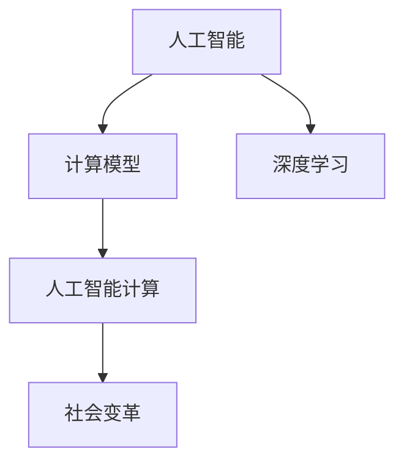

                 

# 塑造未来社会：人类计算的深远意义

> 关键词：人工智能,计算,社会变迁,科技创新,经济影响

## 1. 背景介绍

### 1.1 问题由来

在人类历史的长河中，计算技术的每一次重大进步，都伴随着社会的深刻变革。从算盘、机械计算机到电子计算机，计算方式的革命性变化，不仅改变了人类的生产生活方式，还引发了科学、经济、文化等多领域的深刻变革。

当前，随着人工智能(AI)技术的飞速发展，特别是深度学习、机器学习等技术的突破，计算模式再次迎来了根本性的变革。基于神经网络的高效计算模型，正在逐步取代传统的符号计算，深刻改变着我们对知识、智慧的理解与应用。

在此背景下，理解和探讨人工智能计算对未来社会的深远意义，不仅有助于我们把握技术发展的方向，更能为社会的可持续发展提供重要参考。本文将从人工智能计算的原理与实践、对社会各领域的影响及未来展望三个方面，全面阐述其深远意义。

### 1.2 问题核心关键点

人工智能计算的核心关键点在于：
- 强大的模式识别和决策能力：通过深度神经网络，实现对海量数据的自动分析和处理，大幅提升决策效率和准确性。
- 高自适应性与迁移学习能力：通过多领域、多任务的数据训练，模型能够在不同场景中迅速适应和应用，展现强大的泛化能力。
- 智能生成与创新能力：通过自动生成文本、图像、音乐等，大幅提升创作效率，催生新一轮的创意和创新。
- 人机协同工作模式：通过与人类紧密合作，优化工作流程，提升生产效率和生活质量。
- 跨领域融合应用：在医疗、金融、教育、交通等众多领域，人工智能计算展现出强大的应用潜力，为各行业带来深远变革。

本文将重点探讨这些关键点对未来社会的深远影响，分析其背后的技术原理和实际应用案例。

## 2. 核心概念与联系

### 2.1 核心概念概述

为更好地理解人工智能计算的社会影响，本节将介绍几个关键概念：

- 人工智能(AI)：旨在创建能够执行人类智能任务（如学习、推理、感知等）的机器系统。
- 计算模型：通过算法和数据结构实现计算任务的模型，如符号计算、神经网络、逻辑推理等。
- 深度学习(Deep Learning)：一种利用多层次非线性映射关系，自动学习数据特征的机器学习技术。
- 人工智能计算：基于深度学习等技术，实现复杂计算任务的过程和系统。
- 社会变革：计算技术的进步对人类社会组织结构、工作方式、生产模式、生活形态等方面的根本性改变。

这些概念之间的逻辑关系可以通过以下Mermaid流程图来展示：



这个流程图展示了一系列相关概念之间的联系：人工智能是核心目标，计算模型是实现手段，深度学习是关键技术，人工智能计算是具体应用，社会变革是最终结果。

### 2.2 核心概念原理和架构

人工智能计算的核心原理是利用深度神经网络，通过多层次的非线性映射关系，自动学习数据的抽象表示。该过程中，计算模型通过不断调整网络权重，最小化预测输出与真实值之间的误差，从而逐步提升模型的预测准确性。

以卷积神经网络(CNN)为例，其基本架构包括卷积层、池化层、全连接层等。其中，卷积层通过滑动窗口提取输入数据的局部特征，池化层通过降采样操作减少特征维度和计算量，全连接层通过多层非线性映射，实现特征的逐层抽象与分类。这种架构设计，使得CNN能够高效地处理图像、视频等高维数据。

而深度学习技术的核心，在于其强大的泛化能力。通过在大规模数据集上进行训练，深度学习模型能够学习到数据的内在结构和规律，从而在新的数据上实现高效的泛化推广。这一点在自然语言处理、语音识别、计算机视觉等领域得到了广泛应用。

## 3. 核心算法原理 & 具体操作步骤

### 3.1 算法原理概述

人工智能计算的核心算法是深度学习，其基本原理是通过反向传播算法，调整神经网络中的权重，最小化损失函数。这里以一个简单的图像分类任务为例，介绍其基本原理。

假设有一组训练数据集 $D=\{(x_i, y_i)\}_{i=1}^N$，其中 $x_i$ 为输入的图像数据，$y_i$ 为对应的标签（分类结果）。我们的目标是训练一个神经网络模型 $M_{\theta}$，使其能够将新的图像数据映射到正确的分类标签上。

假定模型 $M_{\theta}$ 的输出为 $z_{\theta}(x_i)$，则模型的预测误差可以表示为：

$$
J(\theta) = \frac{1}{N}\sum_{i=1}^N \ell(z_{\theta}(x_i), y_i)
$$

其中 $\ell$ 为损失函数，如交叉熵损失。反向传播算法的目标是最小化损失函数 $J(\theta)$，通过链式法则，计算每个参数的梯度，更新模型参数 $\theta$。

具体步骤如下：
1. 前向传播：将输入数据 $x_i$ 输入模型，计算输出 $z_{\theta}(x_i)$。
2. 计算误差：通过标签 $y_i$ 与输出 $z_{\theta}(x_i)$ 之间的误差，计算损失函数 $J(\theta)$。
3. 反向传播：通过链式法则，计算每个参数的梯度 $\nabla_{\theta}J(\theta)$。
4. 参数更新：使用梯度下降等优化算法，更新模型参数 $\theta$。

重复以上步骤，直至模型收敛。

### 3.2 算法步骤详解

以下是深度学习模型训练的具体步骤：

1. **数据准备**：收集和预处理训练数据，将其划分为训练集、验证集和测试集。确保数据的多样性和代表性，避免模型过拟合。

2. **模型构建**：选择合适的深度学习模型架构，如卷积神经网络、循环神经网络等，根据任务需求设计模型的输入、输出和隐藏层。

3. **初始化参数**：对模型参数进行随机初始化，一般采用Xavier或He初始化方法。

4. **前向传播**：将训练数据输入模型，计算模型的预测输出。

5. **计算损失**：通过损失函数计算模型预测输出与真实标签之间的误差。

6. **反向传播**：通过链式法则，计算每个参数的梯度。

7. **参数更新**：使用优化算法（如随机梯度下降、Adam等），更新模型参数。

8. **验证和测试**：在验证集上评估模型性能，调整模型参数。在测试集上测试最终模型性能，评估其泛化能力。

### 3.3 算法优缺点

人工智能计算的优点在于：
- 强大的泛化能力：深度学习模型通过大量数据训练，能够学习到数据的复杂结构和规律，实现高效的泛化推广。
- 高效自动化的处理能力：模型能够自动提取数据的特征，实现大规模、高复杂度的数据处理。
- 自我学习能力：模型能够自动调整参数，优化预测结果，提升性能。

然而，也存在一些缺点：
- 数据依赖性强：深度学习模型需要大量标注数据进行训练，数据获取成本较高。
- 模型复杂度高：深度模型结构复杂，训练和推理计算量大，资源消耗高。
- 解释性不足：深度学习模型通常是"黑盒"系统，难以解释其内部决策过程。
- 鲁棒性有限：模型对噪声、扰动等敏感，泛化能力受限。

### 3.4 算法应用领域

人工智能计算已经在诸多领域得到了广泛应用，例如：

- 计算机视觉：通过深度学习模型，实现图像分类、目标检测、图像生成等任务。
- 自然语言处理：通过深度学习模型，实现文本分类、机器翻译、文本生成等任务。
- 语音识别：通过深度学习模型，实现语音识别、语音合成等任务。
- 医疗健康：通过深度学习模型，实现医学影像分析、疾病预测、药物设计等任务。
- 自动驾驶：通过深度学习模型，实现智能驾驶、环境感知等任务。
- 金融科技：通过深度学习模型，实现风险评估、欺诈检测、量化交易等任务。
- 智能制造：通过深度学习模型，实现工业质检、智能调度、预测维护等任务。

以上仅是人工智能计算的一部分应用领域，随着技术的不断进步，其应用范围还将不断扩展。

## 4. 数学模型和公式 & 详细讲解 & 举例说明

### 4.1 数学模型构建

本节将使用数学语言对人工智能计算的深度学习模型进行严格刻画。

设深度学习模型 $M_{\theta}$ 的输入为 $x \in \mathbb{R}^d$，输出为 $y \in \mathbb{R}^k$。模型参数 $\theta$ 为可学习的权重和偏置，初始化为 $0$ 或随机值。模型的前向传播过程可以表示为：

$$
y = M_{\theta}(x) = f_W^{(L)} \left(f_W^{(L-1)} \left(... f_W^{(1)}(x) ... \right) \right)
$$

其中 $f_W^{(l)}$ 为第 $l$ 层的激活函数，$W^{(l)}$ 为第 $l$ 层的权重矩阵。深度学习模型通过多层次的非线性映射，实现输入数据的逐层抽象和分类。

以卷积神经网络为例，其前向传播过程可以表示为：

$$
y = M_{\theta}(x) = f^{(1)}_W \left(f^{(2)}_W \left(... f^{(L)}_W(x) ... \right) \right)
$$

其中 $f^{(l)}_W$ 为卷积、池化等操作，$W^{(l)}$ 为卷积核、池化窗口等参数。

### 4.2 公式推导过程

以下我们以图像分类任务为例，推导反向传播算法的核心公式。

假设训练数据集 $D=\{(x_i, y_i)\}_{i=1}^N$，模型输出 $z_{\theta}(x_i) \in \mathbb{R}^{C}$，其中 $C$ 为分类数。模型预测误差可以表示为交叉熵损失函数：

$$
J(\theta) = -\frac{1}{N} \sum_{i=1}^N \sum_{c=1}^C y_{ic} \log z_{\theta,ic}(x_i)
$$

其中 $y_{ic}$ 为第 $i$ 个样本的第 $c$ 个类别的真实标签。

对于第 $l$ 层的权重 $W^{(l)}$，其梯度可以通过链式法则计算为：

$$
\frac{\partial J(\theta)}{\partial W^{(l)}} = \frac{\partial J(\theta)}{\partial z_{\theta}(x_i)} \frac{\partial z_{\theta}(x_i)}{\partial W^{(l)}} \frac{\partial W^{(l)}}{\partial \theta}
$$

其中 $\frac{\partial J(\theta)}{\partial z_{\theta}(x_i)}$ 为输出层的梯度，$\frac{\partial z_{\theta}(x_i)}{\partial W^{(l)}}$ 为第 $l$ 层的梯度。

通过逐层反向传播，可以计算出每个参数的梯度，并使用梯度下降等优化算法更新参数。

### 4.3 案例分析与讲解

以目标检测任务为例，分析深度学习模型的训练和推理过程。

目标检测模型通过卷积神经网络提取图像特征，并使用区域提议网络(RPN)生成候选框。模型输出每个候选框对应的类别概率和置信度。假设训练数据集 $D=\{(x_i, y_i)\}_{i=1}^N$，其中 $y_i$ 包含 $n$ 个候选框的类别标签 $c_i$ 和置信度 $b_i$。

目标检测模型的训练过程可以表示为：
1. 前向传播：将输入数据 $x_i$ 输入模型，计算每个候选框的类别概率和置信度。
2. 计算损失：通过损失函数计算模型预测输出与真实标签之间的误差。
3. 反向传播：通过链式法则，计算每个参数的梯度。
4. 参数更新：使用优化算法（如随机梯度下降、Adam等），更新模型参数。

目标检测模型的推理过程可以表示为：
1. 前向传播：将输入数据 $x_i$ 输入模型，计算每个候选框的类别概率和置信度。
2. 非极大值抑制(NMS)：筛选出置信度最高的候选框，去除冗余框。
3. 输出结果：输出筛选后的候选框和对应的类别概率。

以上案例展示了深度学习模型在目标检测任务中的应用，其训练和推理过程均可通过反向传播算法实现。

## 5. 项目实践：代码实例和详细解释说明

### 5.1 开发环境搭建

在进行人工智能计算项目开发前，我们需要准备好开发环境。以下是使用Python进行PyTorch开发的环境配置流程：

1. 安装Anaconda：从官网下载并安装Anaconda，用于创建独立的Python环境。

2. 创建并激活虚拟环境：
```bash
conda create -n pytorch-env python=3.8 
conda activate pytorch-env
```

3. 安装PyTorch：根据CUDA版本，从官网获取对应的安装命令。例如：
```bash
conda install pytorch torchvision torchaudio cudatoolkit=11.1 -c pytorch -c conda-forge
```

4. 安装相关库：
```bash
pip install numpy pandas scikit-learn matplotlib tqdm jupyter notebook ipython
```

完成上述步骤后，即可在`pytorch-env`环境中开始开发。

### 5.2 源代码详细实现

这里我们以图像分类任务为例，给出使用PyTorch进行深度学习模型训练的代码实现。

首先，定义模型和优化器：

```python
import torch
import torch.nn as nn
import torch.optim as optim

class CNNModel(nn.Module):
    def __init__(self):
        super(CNNModel, self).__init__()
        self.conv1 = nn.Conv2d(3, 16, kernel_size=3, stride=1, padding=1)
        self.conv2 = nn.Conv2d(16, 32, kernel_size=3, stride=1, padding=1)
        self.fc1 = nn.Linear(32*4*4, 64)
        self.fc2 = nn.Linear(64, 10)

    def forward(self, x):
        x = nn.functional.relu(self.conv1(x))
        x = nn.functional.max_pool2d(x, 2)
        x = nn.functional.relu(self.conv2(x))
        x = nn.functional.max_pool2d(x, 2)
        x = x.view(-1, 32*4*4)
        x = nn.functional.relu(self.fc1(x))
        x = self.fc2(x)
        return x

model = CNNModel()

criterion = nn.CrossEntropyLoss()
optimizer = optim.Adam(model.parameters(), lr=0.001)
```

然后，定义训练和评估函数：

```python
import torchvision.transforms as transforms
from torch.utils.data import DataLoader

# 定义数据处理函数
transform_train = transforms.Compose([
    transforms.RandomCrop(32, padding=4),
    transforms.RandomHorizontalFlip(),
    transforms.ToTensor(),
    transforms.Normalize(mean=[0.5, 0.5, 0.5], std=[0.5, 0.5, 0.5])
])

transform_test = transforms.Compose([
    transforms.ToTensor(),
    transforms.Normalize(mean=[0.5, 0.5, 0.5], std=[0.5, 0.5, 0.5])
])

# 加载数据集
train_dataset = torchvision.datasets.CIFAR10(root='./data', train=True, download=True, transform=transform_train)
test_dataset = torchvision.datasets.CIFAR10(root='./data', train=False, download=True, transform=transform_test)

# 创建DataLoader
train_loader = DataLoader(train_dataset, batch_size=64, shuffle=True)
test_loader = DataLoader(test_dataset, batch_size=64, shuffle=False)

def train_epoch(model, train_loader, optimizer, criterion):
    model.train()
    epoch_loss = 0
    epoch_acc = 0
    for batch_idx, (features, targets) in enumerate(train_loader):
        optimizer.zero_grad()
        features = features.to(device)
        targets = targets.to(device)
        outputs = model(features)
        loss = criterion(outputs, targets)
        loss.backward()
        optimizer.step()
        epoch_loss += loss.item()
        epoch_acc += (outputs.argmax(1) == targets).float().mean().item()
    return epoch_loss / len(train_loader), epoch_acc / len(train_loader)

def evaluate(model, test_loader, criterion):
    model.eval()
    test_loss = 0
    test_acc = 0
    with torch.no_grad():
        for features, targets in test_loader:
            features = features.to(device)
            targets = targets.to(device)
            outputs = model(features)
            loss = criterion(outputs, targets)
            test_loss += loss.item()
            test_acc += (outputs.argmax(1) == targets).float().mean().item()
    return test_loss / len(test_loader), test_acc / len(test_loader)

# 训练模型
device = torch.device('cuda' if torch.cuda.is_available() else 'cpu')
model.to(device)
best_acc = 0

for epoch in range(10):
    train_loss, train_acc = train_epoch(model, train_loader, optimizer, criterion)
    test_loss, test_acc = evaluate(model, test_loader, criterion)
    
    if test_acc > best_acc:
        best_acc = test_acc
        torch.save(model.state_dict(), 'best_model.pth')

print('Best Test Accuracy: {:.2f}%'.format(best_acc*100))
```

以上就是使用PyTorch进行图像分类任务深度学习模型训练的完整代码实现。可以看到，得益于PyTorch的强大封装和灵活性，我们可以用相对简洁的代码完成模型的训练和评估。

### 5.3 代码解读与分析

让我们再详细解读一下关键代码的实现细节：

**CNNModel类**：
- `__init__`方法：初始化卷积层、全连接层等关键组件。
- `forward`方法：定义模型的前向传播过程。

**数据处理函数**：
- `transform_train`和`transform_test`：分别用于训练集和测试集的数据处理，包括随机裁剪、随机翻转、归一化等操作。

**训练和评估函数**：
- `train_epoch`：对数据以批为单位进行迭代，在每个批次上前向传播计算loss并反向传播更新模型参数，最后返回该epoch的平均loss和acc。
- `evaluate`：与训练类似，不同点在于不更新模型参数，并在每个batch结束后将预测和标签结果存储下来，最后使用`test_acc`计算整体精度。

**训练流程**：
- 定义总的epoch数，开始循环迭代
- 每个epoch内，先在训练集上训练，输出平均loss和acc
- 在测试集上评估，输出测试结果
- 重复上述步骤直至收敛

可以看到，PyTorch使得深度学习模型的训练过程变得简洁高效。开发者可以将更多精力放在模型改进、数据处理等高层逻辑上，而不必过多关注底层的实现细节。

当然，工业级的系统实现还需考虑更多因素，如模型的保存和部署、超参数的自动搜索、更灵活的任务适配层等。但核心的训练范式基本与此类似。

## 6. 实际应用场景

### 6.1 智能医疗

人工智能计算在医疗领域的应用，正在改变传统医疗模式，提升诊疗效率和质量。智能诊断系统能够自动识别病历中的关键信息，辅助医生进行诊断和治疗。智能药物设计平台通过深度学习模型，加速新药研发进程。智能健康监测设备通过传感器采集数据，结合人工智能算法，实时分析用户健康状态。

以智能诊断系统为例，该系统通过自然语言处理技术，从病历中提取关键信息。首先，将病历文本输入BERT等预训练语言模型，进行语义理解和特征提取。然后，使用卷积神经网络或注意力机制，对提取的特征进行分类或匹配，生成诊断结果。通过不断迭代优化，该系统能够逐步提升准确率和鲁棒性，为医生提供智能辅助。

### 6.2 智能制造

人工智能计算在智能制造领域的应用，正在改变传统生产模式，提升生产效率和质量。智能质检系统通过计算机视觉技术，自动识别产品缺陷和质量问题。智能调度系统通过深度学习模型，优化生产流程和资源配置。智能维护系统通过预测性维护技术，预防设备故障和停机风险。

以智能质检系统为例，该系统通过图像识别技术，自动检测产品缺陷。首先，将产品图像输入卷积神经网络，提取特征并进行分类。然后，使用区域提议网络(RPN)进行候选框检测，对缺陷区域进行标注。最后，使用目标检测算法，对检测结果进行后处理和筛选，生成最终缺陷报告。通过不断迭代优化，该系统能够逐步提升检测准确率和鲁棒性，为制造商提供智能辅助。

### 6.3 智能交通

人工智能计算在智能交通领域的应用，正在改变传统交通模式，提升交通效率和安全性。智能交通系统通过实时数据分析，优化交通流量和路网规划。智能驾驶系统通过计算机视觉和深度学习技术，实现自动驾驶和环境感知。

以智能交通系统为例，该系统通过实时数据分析，优化交通流量和路网规划。首先，将车辆、行人、道路等数据输入深度学习模型，提取交通特征并进行分类。然后，使用目标检测算法，对交通事件进行分析和预测。最后，使用强化学习算法，优化交通信号灯和路网规划，提升交通效率和安全性。通过不断迭代优化，该系统能够逐步提升预测准确率和鲁棒性，为交通管理部门提供智能辅助。

## 7. 工具和资源推荐

### 7.1 学习资源推荐

为了帮助开发者系统掌握人工智能计算的理论基础和实践技巧，这里推荐一些优质的学习资源：

1. 《深度学习》系列书籍：由深度学习领域的权威专家撰写，深入浅出地介绍了深度学习的原理、算法和应用。

2. 《机器学习实战》系列书籍：通过大量实际案例，帮助读者理解机器学习的基本概念和技术细节。

3. Coursera深度学习课程：由斯坦福大学Andrew Ng教授主讲，涵盖深度学习的基本原理和应用案例，是深度学习的入门必选。

4. Kaggle竞赛平台：提供大量数据集和竞赛，帮助开发者实践深度学习模型的开发和应用。

5. Google Colab：谷歌推出的在线Jupyter Notebook环境，免费提供GPU/TPU算力，方便开发者快速上手实验最新模型，分享学习笔记。

通过对这些资源的学习实践，相信你一定能够快速掌握人工智能计算的精髓，并用于解决实际的计算问题。

### 7.2 开发工具推荐

高效的开发离不开优秀的工具支持。以下是几款用于深度学习开发和部署的工具：

1. PyTorch：基于Python的开源深度学习框架，灵活动态的计算图，适合快速迭代研究。

2. TensorFlow：由Google主导开发的开源深度学习框架，生产部署方便，适合大规模工程应用。

3. Keras：高层次的深度学习框架，提供了丰富的预训练模型和API，便于快速构建深度学习模型。

4. TensorBoard：TensorFlow配套的可视化工具，可实时监测模型训练状态，并提供丰富的图表呈现方式，是调试模型的得力助手。

5. Weights & Biases：模型训练的实验跟踪工具，可以记录和可视化模型训练过程中的各项指标，方便对比和调优。

6. Jupyter Notebook：交互式编程环境，便于开发者快速迭代和调试代码，分享学习笔记。

合理利用这些工具，可以显著提升深度学习模型的开发效率，加快创新迭代的步伐。

### 7.3 相关论文推荐

人工智能计算的研究始于学界的持续探索。以下是几篇奠基性的相关论文，推荐阅读：

1. 《深度学习》论文：提出深度神经网络模型，实现了大规模数据的高效表示和学习。

2. 《ImageNet分类挑战赛》论文：展示了卷积神经网络在图像分类任务上的卓越表现。

3. 《Attention is All You Need》论文：提出了Transformer结构，开创了自注意力机制在深度学习中的应用。

4. 《ResNet：深度残差网络》论文：提出了残差网络，解决了深度神经网络训练过程中梯度消失的问题。

5. 《BERT：预训练表示》论文：提出BERT模型，引入了掩码语言模型任务，实现了大规模语料的无监督预训练。

6. 《GPT-3：语言模型训练的新里程碑》论文：展示了GPT-3模型在自然语言处理任务上的卓越性能。

这些论文代表了大数据计算和深度学习技术的最新进展。通过学习这些前沿成果，可以帮助研究者把握学科前进方向，激发更多的创新灵感。

## 8. 总结：未来发展趋势与挑战

### 8.1 总结

本文对人工智能计算的原理、实践和应用进行了全面系统的介绍。首先阐述了人工智能计算的核心原理和架构，展示了其在数据处理和模式识别方面的强大能力。其次，从实际应用的角度，探讨了人工智能计算在医疗、制造、交通等多个领域的应用前景，展示了其深远社会影响。最后，通过对学习资源、开发工具和相关论文的推荐，提供了全面的学习和发展路径。

通过本文的系统梳理，可以看到，人工智能计算正在改变社会的各个方面，其深远影响将远远超出我们的想象。未来，人工智能计算将继续推动人类社会的变革，带来更多的创新和突破。

### 8.2 未来发展趋势

展望未来，人工智能计算将呈现以下几个发展趋势：

1. 模型的自我学习能力将进一步增强。随着深度学习模型的自我学习能力和泛化能力不断提升，未来的人工智能计算将能够更加灵活地适应复杂多变的场景。

2. 跨领域融合应用将更加广泛。人工智能计算将在不同领域之间实现更加深入的融合，实现多模态信息的高效整合和应用。

3. 算法的多样性将不断增加。未来的人工智能计算将发展出更多种类的算法和模型，以满足不同应用场景的需求。

4. 模型的可解释性将逐步增强。未来的人工智能计算将更加注重模型的可解释性和可解释能力，便于用户理解和信任。

5. 模型的社会影响将更加深远。人工智能计算将深刻影响社会的各个方面，带来更多的创新和变革。

6. 技术的伦理和安全问题将更加重要。未来的人工智能计算将更加注重技术的伦理和安全问题，确保技术应用的公平性和安全性。

这些趋势将推动人工智能计算技术的持续演进，为社会的发展带来更多的机遇和挑战。

### 8.3 面临的挑战

尽管人工智能计算技术已经取得了巨大的进展，但在迈向更加智能化、普适化应用的过程中，它仍面临诸多挑战：

1. 数据隐私和安全问题。大规模数据的收集和使用，带来了数据隐私和安全问题。如何在保证数据隐私和安全的前提下，获取高质量的数据，是未来的一个重要课题。

2. 算法的可解释性问题。深度学习模型的黑盒性质，使得其决策过程难以解释和理解，难以得到用户的信任。如何提高模型的可解释性，是未来的一个重要研究方向。

3. 技术的公平性和偏见问题。深度学习模型容易学习到数据中的偏见和歧视，带来不公平的输出。如何在算法设计中消除偏见，确保技术的公平性，是未来的一个重要课题。

4. 技术的伦理和社会问题。人工智能计算的广泛应用，将带来伦理和社会问题，如就业替代、隐私泄露等。如何避免技术的伦理和社会问题，确保技术的健康发展，是未来的一个重要课题。

5. 技术的资源消耗问题。深度学习模型的训练和推理，需要大量的计算资源和存储空间。如何优化模型的资源消耗，降低计算成本，是未来的一个重要研究方向。

6. 技术的跨领域融合问题。人工智能计算在多个领域的应用，需要不同领域的专家共同协作，带来跨领域融合的挑战。如何促进跨领域的协同创新，是未来的一个重要研究方向。

这些挑战将伴随着人工智能计算技术的不断进步，需要我们在技术、伦理、社会等各个方面进行持续探索和优化。唯有如此，才能确保人工智能计算技术的健康发展，为人类社会带来更多的创新和进步。

### 8.4 研究展望

未来，人工智能计算技术的研究方向可以从以下几个方面进行探索：

1. 强化学习与深度学习的融合。通过将强化学习与深度学习相结合，提升人工智能计算的决策能力和优化能力。

2. 多模态信息的融合。通过将不同模态的信息进行融合，实现多模态数据的统一表示和分析。

3. 跨领域融合与知识迁移。通过将不同领域的信息进行融合，实现知识的跨领域迁移和应用。

4. 算法的可解释性提升。通过引入符号表示和逻辑推理等技术，提升深度学习模型的可解释性。

5. 模型的公平性和伦理设计。通过引入伦理和社会科学的理论，设计公平和伦理的深度学习模型。

6. 技术的安全和隐私保护。通过引入加密和匿名化技术，保护数据隐私和安全。

通过这些方向的研究，相信人工智能计算技术将不断突破自我，为社会带来更多的创新和变革。未来，人工智能计算将深刻影响人类社会的各个方面，成为推动人类文明进步的重要力量。

## 9. 附录：常见问题与解答

**Q1：什么是人工智能计算？**

A: 人工智能计算是基于深度学习等技术，实现复杂计算任务的过程和系统。通过多层次的非线性映射，自动学习数据的抽象表示，从而实现高效的数据处理和模式识别。

**Q2：人工智能计算对社会有什么影响？**

A: 人工智能计算对社会的深远影响主要体现在以下几个方面：
1. 提升生产效率和生活质量：通过自动化和智能化技术，实现生产流程的优化和服务的提升。
2. 推动科学研究和技术创新：通过大规模数据的处理和分析，发现科学规律，加速技术创新。
3. 带来伦理和社会问题：人工智能计算的广泛应用，将带来伦理和社会问题，如就业替代、隐私泄露等。
4. 促进跨领域融合：人工智能计算在不同领域的应用，将促进跨领域的协同创新，实现多学科的深度融合。

**Q3：人工智能计算面临的主要挑战有哪些？**

A: 人工智能计算面临的主要挑战包括：
1. 数据隐私和安全问题：大规模数据的收集和使用，带来了数据隐私和安全问题。
2. 算法的可解释性问题：深度学习模型的黑盒性质，使得其决策过程难以解释和理解。
3. 技术的公平性和偏见问题：深度学习模型容易学习到数据中的偏见和歧视，带来不公平的输出。
4. 技术的伦理和社会问题：人工智能计算的广泛应用，将带来伦理和社会问题，如就业替代、隐私泄露等。
5. 技术的资源消耗问题：深度学习模型的训练和推理，需要大量的计算资源和存储空间。
6. 技术的跨领域融合问题：人工智能计算在多个领域的应用，需要不同领域的专家共同协作，带来跨领域融合的挑战。

**Q4：未来人工智能计算的主要发展方向是什么？**

A: 未来人工智能计算的主要发展方向包括：
1. 模型的自我学习能力将进一步增强。
2. 跨领域融合应用将更加广泛。
3. 算法的多样性将不断增加。
4. 模型的可解释性将逐步增强。
5. 模型的社会影响将更加深远。
6. 技术的伦理和安全问题将更加重要。

这些发展方向将推动人工智能计算技术的持续演进，为社会的发展带来更多的机遇和挑战。

---

作者：禅与计算机程序设计艺术 / Zen and the Art of Computer Programming

