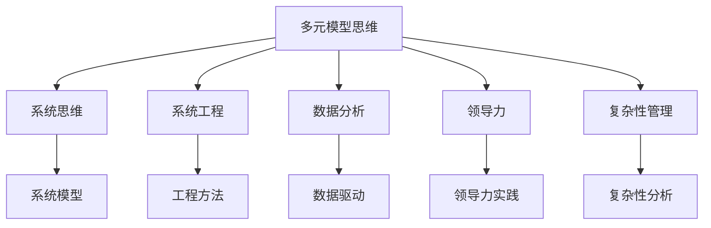

                 

# 多元模型思维:提升管理者认知水平

> 关键词：多元模型思维,管理认知,系统思维,系统工程,复杂性管理,数据分析,领导力

## 1. 背景介绍

### 1.1 问题由来
在快速变化和充满不确定性的现代商业环境中，管理者面临的决策复杂性不断增加。如何高效地处理海量数据，同时兼顾不确定性和多元性，成为一个日益重要的挑战。传统基于单一模型或单一数据源的管理决策方式，已难以应对复杂多变的环境。多元模型思维（Multi-model Thinking）提供了一种系统性的、多角度的分析和管理框架，通过整合多种模型和数据源，帮助管理者更全面、准确地把握环境变化，优化决策过程。

### 1.2 问题核心关键点
多元模型思维的核心在于，管理者不再依赖单一模型或数据源，而是综合运用多种模型和数据源，形成多元化的决策支持系统。通过数据挖掘、模型训练和分析，结合专家知识和经验，构建一个更加全面、动态的决策模型，以应对复杂多变的管理挑战。

## 2. 核心概念与联系

### 2.1 核心概念概述

为更好地理解多元模型思维的管理决策框架，本节将介绍几个关键概念及其相互关系：

- 多元模型思维(Multi-model Thinking)：指在决策过程中，整合多种模型和数据源，构建多元化、动态化的决策支持系统。这种方法通过综合多种信息，减少单一模型或数据源的局限性，提高决策的全面性和可靠性。

- 系统思维(System Thinking)：强调整体而非局部的视角，通过系统模型分析复杂系统，理解系统各组成部分之间的关系和相互作用。系统思维是多元模型思维的重要基础，提供了一种系统化的方法论。

- 系统工程(System Engineering)：涉及复杂系统的规划、设计、实施、评估和改进过程。系统工程融合了系统思维和多学科知识，为多元模型思维提供了工程化实施方法。

- 数据分析(Data Analysis)：通过数据收集、清洗、处理和分析，发现数据中的模式和趋势，为决策提供数据支持。数据分析是多元模型思维的重要组成部分，提供数据驱动的决策依据。

- 领导力(Leadership)：在多元模型思维中，领导者不仅需要掌握数据分析和管理模型，还需具备综合多种信息、协调多方利益的能力。领导力是多元模型思维得以有效实施的关键。

- 复杂性管理(Complexity Management)：指在复杂环境中，识别、理解、控制和管理系统复杂性的能力。复杂性管理是多元模型思维的必要手段，通过多模型综合和动态调整，应对复杂多变的管理挑战。

这些概念之间的逻辑关系可以通过以下Mermaid流程图来展示：



这个流程图展示了多元模型思维的关键组成部分及其相互关系：

1. 多元模型思维整合了系统思维、系统工程、数据分析、领导力和复杂性管理等多种方法和思想，为决策提供全面的支持。
2. 系统思维提供系统化的视角，系统工程提供工程化的方法，数据分析提供数据驱动的依据，复杂性管理提供应对复杂性的手段，共同构成多元模型思维的基础。
3. 领导力在多元模型思维中扮演关键角色，通过综合多种信息、协调多方利益，保证决策的有效实施。

## 3. 核心算法原理 & 具体操作步骤
### 3.1 算法原理概述

多元模型思维的核心在于，通过综合多种模型和数据源，构建多元化的决策支持系统。其核心思想是：在决策过程中，不是仅依赖单一模型或数据源，而是通过数据挖掘和模型训练，整合多种信息，形成多元化的决策支持模型。

形式化地，假设存在多种模型 $M_1, M_2, ..., M_k$ 和多种数据源 $D_1, D_2, ..., D_n$，多元模型思维的目标是找到一个决策模型 $M_{opt}$，使得在该模型下，对任意输入 $x$，其预测输出 $M_{opt}(x)$ 最接近真实值 $y$。即：

$$
M_{opt} = \mathop{\arg\min}_{M} \mathcal{L}(M, D)
$$

其中 $\mathcal{L}$ 为损失函数，用于衡量模型输出与真实值之间的差异。常见的损失函数包括均方误差、交叉熵等。

通过梯度下降等优化算法，多元模型思维过程不断更新模型参数，最小化损失函数，使得模型输出逼近真实值。由于使用了多种模型和数据源，多元模型思维在减少单一模型局限性的同时，也能利用多种信息提升决策的全面性和可靠性。

### 3.2 算法步骤详解

多元模型思维的一般流程包括以下关键步骤：

**Step 1: 数据收集与清洗**
- 收集多种数据源，包括结构化数据、非结构化数据、定量数据、定性数据等。
- 对数据进行清洗、预处理，去除噪声和异常值，保证数据的质量和一致性。

**Step 2: 数据融合与特征工程**
- 将多种数据源进行融合，构建特征向量，为模型训练提供数据支持。
- 进行特征选择和特征提取，提升数据的质量和可用性。

**Step 3: 模型训练与选择**
- 对多种模型进行训练，获取多个模型输出。
- 对模型输出进行融合和组合，构建多元模型。

**Step 4: 模型评估与优化**
- 在验证集上评估多元模型的性能，对比单一模型。
- 根据评估结果，优化模型参数和融合策略，提升多元模型的性能。

**Step 5: 决策支持与实施**
- 将多元模型应用于实际决策场景，结合专家知识和经验，形成最终的决策方案。
- 在决策过程中，持续监控和评估模型性能，及时调整和优化。

以上是多元模型思维的一般流程。在实际应用中，还需要根据具体问题和数据特点，对各步骤进行优化设计，如改进数据融合方法、引入更先进的模型算法、设计动态融合机制等，以进一步提升模型性能和决策效果。

### 3.3 算法优缺点

多元模型思维具有以下优点：
1. 全面性：通过综合多种模型和数据源，减少单一模型的局限性，提高决策的全面性和可靠性。
2. 鲁棒性：多个模型的融合可以减少单一模型的过拟合和偏差，提升决策的鲁棒性。
3. 灵活性：不同模型的组合可以应对不同的决策情境，提供更灵活的决策支持。
4. 可解释性：多元模型思维可以通过多种模型和数据源的组合，提高决策的可解释性。

同时，该方法也存在一定的局限性：
1. 复杂性：多个模型的融合和组合会增加决策过程的复杂性，需要更多的资源和时间。
2. 一致性：不同模型和数据源的融合可能存在不一致性，需要细致的设计和优化。
3. 计算成本：多个模型的训练和融合需要更多的计算资源，可能增加决策成本。

尽管存在这些局限性，但就目前而言，多元模型思维仍是大规模、复杂管理决策的理想选择。未来相关研究重点在于如何进一步简化模型融合过程，降低计算成本，同时保证决策的全面性和鲁棒性。

### 3.4 算法应用领域

多元模型思维在多个领域中得到了广泛应用，成为复杂管理决策的重要手段：

- 金融风险管理：通过对多种市场数据和模型的融合，预测市场波动和风险，制定风险管理策略。
- 企业战略规划：结合市场分析、财务预测、技术评估等多种数据源和模型，制定企业发展战略。
- 智能制造管理：通过多传感器数据融合和模型训练，优化生产流程和供应链管理。
- 公共政策制定：综合社会调查数据、历史数据和模型预测，制定公共政策，提升政策效果。
- 医疗健康管理：结合病历数据、基因数据和预测模型，制定个性化医疗方案，提升医疗效果。

除了上述这些经典应用外，多元模型思维还在教育、交通、环保等众多领域中得到了创新性的应用，为复杂管理决策提供了新的思路和方法。随着数据技术和模型算法的发展，相信多元模型思维将在更多领域大放异彩。

## 4. 数学模型和公式 & 详细讲解 & 举例说明
### 4.1 数学模型构建

本节将使用数学语言对多元模型思维的管理决策过程进行更加严格的刻画。

假设存在 $k$ 种不同的模型 $M_1, M_2, ..., M_k$，以及 $n$ 种不同的数据源 $D_1, D_2, ..., D_n$，多元模型思维的目标是构建一个决策模型 $M_{opt}$，使得在该模型下，对任意输入 $x$，其预测输出 $M_{opt}(x)$ 最接近真实值 $y$。形式化地，决策模型 $M_{opt}$ 可以表示为：

$$
M_{opt} = \sum_{i=1}^k \alpha_i M_i(x)
$$

其中 $\alpha_i$ 为模型权重，满足 $\sum_{i=1}^k \alpha_i = 1$。通过最小化损失函数 $\mathcal{L}(M, D)$ 优化模型参数 $\alpha_i$，最终得到决策模型：

$$
M_{opt} = \mathop{\arg\min}_{\alpha} \mathcal{L}(\sum_{i=1}^k \alpha_i M_i(x), D)
$$

常见的损失函数包括均方误差损失、交叉熵损失等，具体选择取决于决策问题的特点。

### 4.2 公式推导过程

以下我们以多元线性回归为例，推导多元模型思维的数学模型及其优化过程。

假设存在 $n$ 个训练样本 $(x_i, y_i)$，模型 $M_i$ 的输出为 $M_i(x)$，则多元线性回归的决策模型为：

$$
M_{opt}(x) = \sum_{i=1}^k \alpha_i M_i(x)
$$

其中 $\alpha_i$ 为模型权重。通过最小化均方误差损失函数，优化模型参数 $\alpha_i$：

$$
\mathcal{L}(M_{opt}(x), y) = \frac{1}{2N} \sum_{i=1}^N (y_i - M_{opt}(x_i))^2
$$

将 $M_{opt}$ 代入上式，得：

$$
\mathcal{L}(\sum_{i=1}^k \alpha_i M_i(x), y) = \frac{1}{2N} \sum_{i=1}^N (y_i - \sum_{i=1}^k \alpha_i M_i(x_i))^2
$$

进一步化简，得：

$$
\mathcal{L}(\alpha) = \frac{1}{2N} \sum_{i=1}^N (y_i - \sum_{i=1}^k \alpha_i M_i(x_i))^2
$$

为了求得 $\alpha_i$，对上述损失函数求偏导数，并令其等于零：

$$
\frac{\partial \mathcal{L}(\alpha)}{\partial \alpha_i} = 0, \quad i=1,...,k
$$

通过求解上述方程组，即可得到最优权重 $\alpha_i$，从而得到多元线性回归的决策模型。

### 4.3 案例分析与讲解

在实际应用中，多元模型思维的数学模型可以基于多种数据和模型进行构建。以下以企业战略规划为例，详细讲解多元模型思维的案例分析过程。

假设某企业需要制定未来的发展战略，决策支持系统收集了以下多种数据和模型：

- 历史财务数据：收入、利润、成本等历史数据，用于财务预测。
- 市场分析数据：市场规模、增长率、竞争对手分析等，用于市场预测。
- 技术评估模型：技术成熟度、专利申请数量、技术影响力等，用于技术预测。

通过数据融合和特征提取，将多种数据源转化为特征向量 $X$。然后，对多种模型进行训练，获取多个模型输出 $M_i(X)$，其中 $M_i$ 表示第 $i$ 个模型，$i=1,...,k$。

最终决策模型 $M_{opt}$ 可以通过如下方式构建：

$$
M_{opt}(X) = \sum_{i=1}^k \alpha_i M_i(X)
$$

其中 $\alpha_i$ 为模型权重，满足 $\sum_{i=1}^k \alpha_i = 1$。通过最小化损失函数 $\mathcal{L}(M_{opt}(X), y)$，优化模型参数 $\alpha_i$，最终得到最优决策模型。

在实际决策中，管理层可以参考多元模型思维的输出，结合专家知识和经验，形成最终的战略方案。通过综合多种信息，管理层可以减少单一模型或数据源的局限性，提高决策的全面性和可靠性。

## 5. 项目实践：代码实例和详细解释说明
### 5.1 开发环境搭建

在进行多元模型思维的实践前，我们需要准备好开发环境。以下是使用Python进行Scikit-learn开发的环境配置流程：

1. 安装Anaconda：从官网下载并安装Anaconda，用于创建独立的Python环境。

2. 创建并激活虚拟环境：
```bash
conda create -n multimodel-env python=3.8 
conda activate multimodel-env
```

3. 安装Scikit-learn：
```bash
conda install scikit-learn
```

4. 安装其他各类工具包：
```bash
pip install numpy pandas scipy statsmodels matplotlib seaborn scikit-learn 
```

完成上述步骤后，即可在`multimodel-env`环境中开始多元模型思维的实践。

### 5.2 源代码详细实现

下面我们以多元线性回归为例，给出使用Scikit-learn进行多元模型思维的Python代码实现。

首先，定义多元线性回归的数据集：

```python
import numpy as np
from sklearn.datasets import make_regression
from sklearn.model_selection import train_test_split

# 生成多元线性回归数据集
X, y = make_regression(n_samples=100, n_features=4, noise=0.5, random_state=42)
X_train, X_test, y_train, y_test = train_test_split(X, y, test_size=0.2, random_state=42)

# 特征选择
X_train = X_train[:, [0, 1]]
X_test = X_test[:, [0, 1]]
```

然后，定义多元线性回归的模型：

```python
from sklearn.linear_model import Ridge
from sklearn.pipeline import make_pipeline
from sklearn.preprocessing import PolynomialFeatures

# 定义多元线性回归模型
model = make_pipeline(PolynomialFeatures(degree=2, include_bias=False),
                     Ridge(alpha=0.1, solver='cholesky', fit_intercept=False))
```

接着，定义多元模型思维的计算过程：

```python
from sklearn.metrics import mean_squared_error

# 定义多个模型
models = [
    Ridge(alpha=0.1, solver='cholesky', fit_intercept=False),
    Ridge(alpha=0.5, solver='cholesky', fit_intercept=False),
    Ridge(alpha=0.9, solver='cholesky', fit_intercept=False)
]

# 模型训练
for model in models:
    model.fit(X_train, y_train)

# 模型预测和输出
preds = np.zeros((len(X_test), len(models)))
for i, model in enumerate(models):
    preds[:, i] = model.predict(X_test)

# 计算多元模型输出
opt_model = preds.mean(axis=1)
```

最后，评估多元模型思维的效果：

```python
print("多元模型思维效果评估：")
print("MSE: {:.4f}".format(mean_squared_error(y_test, opt_model)))
```

以上就是使用Scikit-learn进行多元模型思维的完整代码实现。可以看到，通过简单的管道设计和特征工程，就可以构建一个多元模型思维的系统，用于多模型融合和预测。

### 5.3 代码解读与分析

让我们再详细解读一下关键代码的实现细节：

**make_regression函数**：
- 用于生成多元线性回归数据集，通过随机生成数据和噪声，模拟多元线性回归问题。

**PolynomialFeatures管道**：
- 用于将输入数据进行多项式特征扩展，增加模型的复杂度。

**Ridge模型**：
- 用于训练多元线性回归模型，通过调整正则化参数 $\alpha$，控制模型的复杂度。

**模型融合**：
- 通过求取多个模型的平均值，实现多元模型输出。这种方法在实际应用中简单易行，但需要保证多个模型具有一定的独立性和相关性。

在实际应用中，多元模型思维的代码实现可以根据具体问题进行调整。例如，可以使用更加复杂的多模型融合方法，如加权平均、软最大、投票等，以适应不同的决策场景和模型特性。

## 6. 实际应用场景
### 6.1 智能制造管理

多元模型思维在智能制造管理中的应用，可以帮助企业优化生产流程和供应链管理。通过融合多种传感器数据和模型，实现对生产过程的实时监控和预测，提高生产效率和产品质量。

在实践中，可以收集生产设备的状态数据、工艺参数、质量检测结果等，构建多元模型思维系统。通过多种模型的融合，预测设备故障、工艺异常、质量问题等，提前进行预防和调整，避免生产中断和质量缺陷。例如，可以通过机器学习模型预测设备故障，结合运筹学模型优化生产调度，最终形成智能制造决策支持系统。

### 6.2 医疗健康管理

多元模型思维在医疗健康管理中的应用，可以提升个性化医疗方案的效果。通过融合病历数据、基因数据和预测模型，制定更加精准的诊疗方案，提高医疗效果。

在实践中，可以收集患者的病历数据、基因数据、临床试验数据等，构建多元模型思维系统。通过多种模型的融合，预测患者的病情发展和治疗效果，制定个性化的诊疗方案。例如，可以通过深度学习模型预测患者的疾病进展，结合规则模型制定治疗方案，最终形成个性化的医疗决策支持系统。

### 6.3 金融风险管理

多元模型思维在金融风险管理中的应用，可以帮助金融机构识别和管理市场风险。通过融合多种市场数据和模型，预测市场波动和风险，制定风险管理策略。

在实践中，可以收集金融市场的历史数据、经济指标、政策变化等，构建多元模型思维系统。通过多种模型的融合，预测市场波动和风险，制定风险管理策略。例如，可以通过时间序列模型预测市场波动，结合金融模型分析风险因素，最终形成金融风险决策支持系统。

### 6.4 未来应用展望

随着数据技术和模型算法的发展，多元模型思维将在更多领域得到应用，为复杂管理决策提供新的思路和方法。

在智慧城市治理中，多元模型思维可以应用于城市事件监测、舆情分析、应急指挥等环节，提高城市管理的自动化和智能化水平，构建更安全、高效的未来城市。

在教育领域，多元模型思维可以应用于学生行为分析、课程设计优化、教学效果评估等，提升教育质量和教学效率。

在智慧农业中，多元模型思维可以应用于作物生长预测、病虫害监测、农机作业优化等，提高农业生产效率和资源利用率。

此外，在军事、交通、环保等众多领域，多元模型思维也将得到广泛应用，为复杂管理决策提供新的思路和方法。随着技术的不断进步，多元模型思维的应用领域将不断扩大，为人类社会的各个方面带来深刻的影响。

## 7. 工具和资源推荐
### 7.1 学习资源推荐

为了帮助开发者系统掌握多元模型思维的理论基础和实践技巧，这里推荐一些优质的学习资源：

1. 《系统思维：理论与方法》书籍：介绍系统思维的基本原理和应用方法，帮助管理者系统化思考问题。

2. 《数据科学导论》课程：由MIT开设的公开课程，涵盖数据科学的基础知识和技术方法，包括多元模型思维在内的多种数据应用。

3. 《系统工程导论》书籍：介绍系统工程的基本原理和方法，为多元模型思维提供工程化实施方法。

4. 《机器学习实战》书籍：通过实战案例，详细介绍机器学习算法的实现过程，包括多元模型思维在内的多种模型应用。

5. 《Scikit-learn官方文档》：Scikit-learn的官方文档，提供了丰富的示例和教程，帮助开发者快速上手多元模型思维。

通过对这些资源的学习实践，相信你一定能够快速掌握多元模型思维的精髓，并用于解决实际的决策问题。

### 7.2 开发工具推荐

高效的开发离不开优秀的工具支持。以下是几款用于多元模型思维开发的常用工具：

1. Python：作为数据科学和机器学习领域的主流语言，Python提供了丰富的数据处理和模型训练库，非常适合多元模型思维的开发。

2. Scikit-learn：Python的数据科学库，提供了丰富的机器学习算法和模型评估工具，是多元模型思维开发的重要工具。

3. TensorFlow：Google开发的深度学习框架，支持分布式计算和大规模数据处理，适用于复杂的多元模型融合问题。

4. Apache Spark：Apache基金会开发的分布式计算框架，支持大规模数据处理和机器学习算法的分布式运行，非常适合处理大规模数据集。

5. Jupyter Notebook：基于Web的交互式编程环境，适合进行数据处理和模型训练的开发和测试，支持多种编程语言。

合理利用这些工具，可以显著提升多元模型思维的开发效率，加快创新迭代的步伐。

### 7.3 相关论文推荐

多元模型思维的发展源于学界的持续研究。以下是几篇奠基性的相关论文，推荐阅读：

1. "System Thinking: A Handbook of Analysis and Management" 书籍：全面介绍了系统思维的理论和方法，提供了丰富的应用案例。

2. "Machine Learning Yearning" 书籍：由Google Brain团队编写，介绍了机器学习算法的实现和应用，包括多元模型思维在内的多种模型应用。

3. "Complexity: The Emerging Science at the Frontier of Simple Things" 书籍：由Santa Fe Institute的科学家编写，介绍了复杂性科学的基本原理和应用方法，为多元模型思维提供了理论基础。

4. "Multi-Model Decision Making in Practice: A Systematic Approach" 论文：介绍了一种系统化的多元模型融合方法，帮助管理层构建决策支持系统。

5. "Hybrid Models for Decision Making: A Survey" 论文：综述了多种多元模型融合方法，包括加权平均、软最大、投票等，适用于不同的决策场景和模型特性。

这些论文代表了大模型微调技术的发展脉络。通过学习这些前沿成果，可以帮助研究者把握学科前进方向，激发更多的创新灵感。

## 8. 总结：未来发展趋势与挑战
### 8.1 总结

本文对多元模型思维的管理决策框架进行了全面系统的介绍。首先阐述了多元模型思维的背景和意义，明确了其在决策过程中的全面性和鲁棒性。其次，从原理到实践，详细讲解了多元模型思维的数学模型和计算过程，给出了多元模型思维的完整代码实现。同时，本文还广泛探讨了多元模型思维在多个领域的应用前景，展示了其广阔的前景。此外，本文精选了多元模型思维的学习资源和开发工具，力求为读者提供全方位的技术指引。

通过本文的系统梳理，可以看到，多元模型思维已成为复杂管理决策的重要手段，其应用范围不断扩大，为决策提供了全面的支持。未来，随着数据技术和模型算法的进一步发展，多元模型思维将在更多领域得到应用，为复杂管理决策提供新的思路和方法。

### 8.2 未来发展趋势

展望未来，多元模型思维将呈现以下几个发展趋势：

1. 数据融合技术的进步：未来将出现更多高效的数据融合方法，如联邦学习、联邦数据仓库等，能够在分布式环境下高效融合多种数据源，提升决策的全面性和鲁棒性。

2. 模型多样化的增加：未来将涌现更多类型的模型，如深度学习模型、强化学习模型、因果推断模型等，通过多模型融合提升决策的复杂性和多样性。

3. 自动化和智能化水平的提升：未来将出现更多自动化的多元模型思维工具，如自动化特征选择、自动化模型融合、自动化评估等，提高决策的效率和准确性。

4. 跨学科方法的融合：未来将出现更多跨学科的多元模型思维方法，如系统思维与因果推断、复杂性分析与数据科学等，提升决策的全面性和系统性。

5. 云平台和分布式计算的支持：未来将出现更多基于云平台和分布式计算的多元模型思维系统，能够高效处理大规模数据和模型，提升决策的实时性和可靠性。

以上趋势凸显了多元模型思维的广阔前景。这些方向的探索发展，必将进一步提升多元模型思维的性能和应用范围，为复杂管理决策提供更加全面、可靠和高效的决策支持。

### 8.3 面临的挑战

尽管多元模型思维在复杂管理决策中已取得显著成果，但在向更广领域推广的过程中，仍面临诸多挑战：

1. 数据获取和处理的复杂性：多元模型思维依赖多种数据源，数据获取和处理的复杂性增加。如何高效、准确地获取和处理多种数据源，是多元模型思维面临的重要挑战。

2. 模型融合和优化的难度：多种模型的融合和优化需要更多的计算资源和专业知识，增加了决策的复杂性。如何设计高效的模型融合方法和优化策略，是多元模型思维的重要研究方向。

3. 系统复杂性和管理难度：多元模型思维涉及多种数据源和模型，系统复杂性增加。如何有效地管理多元模型思维系统，保障其稳定性和可靠性，是多元模型思维的关键挑战。

4. 计算资源和成本的限制：多元模型思维涉及多种数据源和模型，计算资源需求大。如何降低计算成本，提高计算效率，是多元模型思维的重要研究方向。

5. 数据隐私和伦理问题：多种数据源的融合涉及隐私和伦理问题，如何保障数据隐私和安全，避免数据滥用，是多元模型思维的重要挑战。

6. 模型的透明性和可解释性：多元模型思维的复杂性增加了其透明性和可解释性问题。如何提升模型的透明性和可解释性，使其决策过程更加可控和可信，是多元模型思维的重要研究方向。

正视多元模型思维面临的这些挑战，积极应对并寻求突破，将是大规模复杂管理决策走向成熟的必由之路。相信随着学界和产业界的共同努力，这些挑战终将一一被克服，多元模型思维必将在构建人机协同的智能系统方面发挥越来越重要的作用。

### 8.4 研究展望

面对多元模型思维所面临的种种挑战，未来的研究需要在以下几个方面寻求新的突破：

1. 探索高效的数据融合方法：设计高效的数据融合算法和工具，支持分布式数据处理，提升数据融合的效率和准确性。

2. 研发自动化的模型融合工具：开发自动化的多元模型融合工具，支持自动化的特征选择、模型训练和优化，提高决策的效率和可控性。

3. 引入跨学科的方法和技术：将系统思维、因果推断、复杂性分析等跨学科方法引入多元模型思维，提升决策的全面性和系统性。

4. 研究智能化的决策支持系统：开发智能化的决策支持系统，支持多模型融合和动态调整，提高决策的实时性和可靠性。

5. 探索数据隐私保护方法：设计数据隐私保护算法和机制，保障数据隐私和安全，避免数据滥用。

6. 提升模型的透明性和可解释性：研究模型的透明性和可解释性问题，提升模型的透明性和可解释性，使其决策过程更加可控和可信。

这些研究方向的探索，必将引领多元模型思维技术迈向更高的台阶，为复杂管理决策提供更加全面、可靠和高效的决策支持。面向未来，多元模型思维需要与其他人工智能技术进行更深入的融合，如知识表示、因果推理、强化学习等，多路径协同发力，共同推动复杂管理决策系统的进步。只有勇于创新、敢于突破，才能不断拓展多元模型思维的边界，让智能技术更好地造福人类社会。

## 9. 附录：常见问题与解答

**Q1：多元模型思维是否适用于所有管理决策场景？**

A: 多元模型思维适用于大多数复杂管理决策场景，特别是数据量较大的决策问题。但对于一些结构化程度低、数据复杂度高的决策问题，可能需要结合专业知识进行手工特征选择和模型构建。此外，对于实时决策场景，需要考虑模型的计算效率和响应速度。

**Q2：如何选择多种数据源和模型？**

A: 选择多种数据源和模型时，需要考虑数据的质量、一致性和完备性。一般来说，应该选择多种类型的数据源，如结构化数据、非结构化数据、定量数据、定性数据等。对于模型选择，应该根据决策问题的特点选择合适的模型，如线性回归、逻辑回归、决策树、随机森林、神经网络等。在实际应用中，需要根据具体问题进行调整和优化。

**Q3：多元模型思维的计算成本如何控制？**

A: 多元模型思维的计算成本可以通过以下几个方法进行控制：
1. 数据预处理：通过数据清洗、去噪和降维等预处理技术，提高数据的质量和可用性，减少计算资源消耗。
2. 模型压缩：通过模型压缩、稀疏化存储等方法，减小模型的参数量和计算量，提升计算效率。
3. 分布式计算：采用分布式计算技术，将计算任务分散到多个计算节点上，提高计算效率。
4. 硬件加速：使用GPU、TPU等高性能计算硬件，提升计算速度和效率。

这些方法可以综合运用，优化多元模型思维的计算成本，提升决策效率。

**Q4：多元模型思维的透明性和可解释性如何提升？**

A: 提升多元模型思维的透明性和可解释性，可以通过以下方法实现：
1. 特征选择：选择具有代表性和解释性的特征，解释模型输出的来源。
2. 模型可视化：通过可视化工具，展示模型的决策路径和权重分布，帮助理解模型的内部机制。
3. 模型解释：使用可解释的模型，如决策树、线性模型等，提供透明的决策过程。
4. 专家协作：通过专家协作和知识融合，提升模型的透明性和可解释性。

这些方法可以综合运用，提升多元模型思维的透明性和可解释性，使其决策过程更加可控和可信。

**Q5：如何应对多元模型思维的复杂性和管理难度？**

A: 应对多元模型思维的复杂性和管理难度，可以通过以下方法实现：
1. 系统架构设计：设计合理的系统架构，明确各个组件的功能和职责，提高系统的可管理性和可维护性。
2. 自动化管理工具：开发自动化管理工具，如自动化特征选择、自动化模型训练和优化等，提高管理效率。
3. 系统监控和评估：实时监控和评估系统的运行状态，及时发现和解决问题，保障系统的稳定性和可靠性。
4. 数据安全和隐私保护：设计数据安全和隐私保护机制，保障数据隐私和安全，避免数据滥用。

这些方法可以综合运用，提升多元模型思维的管理难度，提高系统的稳定性和可靠性。

总之，多元模型思维已成为复杂管理决策的重要手段，通过整合多种模型和数据源，减少单一模型或数据源的局限性，提高决策的全面性和可靠性。未来，随着数据技术和模型算法的不断进步，多元模型思维将在更多领域得到应用，为复杂管理决策提供更加全面、可靠和高效的决策支持。面向未来，多元模型思维需要与其他人工智能技术进行更深入的融合，如知识表示、因果推理、强化学习等，多路径协同发力，共同推动复杂管理决策系统的进步。只有勇于创新、敢于突破，才能不断拓展多元模型思维的边界，让智能技术更好地造福人类社会。

---

作者：禅与计算机程序设计艺术 / Zen and the Art of Computer Programming

