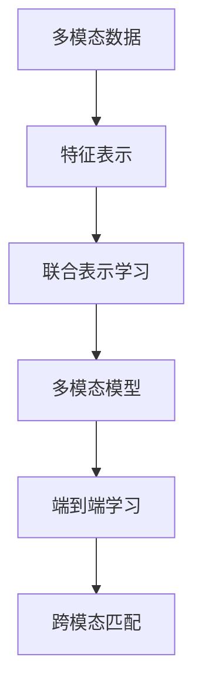

                 

## 1. 背景介绍

### 1.1 问题由来

在人工智能（AI）领域，多模态学习（Multimodal Learning）近年来备受关注。多模态学习是指同时利用不同类型的数据（如文本、图像、音频）进行联合建模和分析。相较于单一模态的数据，多模态数据能够提供更丰富的信息，从而提升AI系统的表现。

随着计算机视觉、自然语言处理（NLP）和音频处理技术的迅速发展，多模态AI的应用场景日益广泛，涉及医疗影像分析、智能客服、无人驾驶、机器人控制等众多领域。多模态AI系统能够更好地理解和响应复杂的人类需求，提高自动化系统的智能程度和应用效果。

### 1.2 问题核心关键点

多模态AI的核心在于如何高效、准确地融合来自不同模态的数据。要实现这一目标，需要解决以下几个关键问题：

1. **数据格式转换**：不同模态的数据格式各异，需要将其统一为机器可处理的形式。
2. **特征提取与对齐**：从不同模态的数据中提取出有意义的特征，并进行对齐以用于联合建模。
3. **联合表示学习**：将不同模态的数据表示统一到一个共同的语义空间中，便于跨模态理解和推理。
4. **模型架构设计**：设计能够高效融合多模态数据的模型架构，包括数据流、编码器、解码器等。
5. **训练与优化策略**：采用合适的训练和优化策略，确保模型能够在多模态数据上获得良好的泛化能力。

### 1.3 问题研究意义

多模态AI技术的研究与应用，对于提升AI系统的智能水平和应用范围具有重要意义：

1. **提高系统鲁棒性**：多模态数据的多样性能够增强系统的鲁棒性，使其在面对噪声、缺失等问题时表现更为稳定。
2. **拓展应用场景**：多模态数据提供了更为丰富的信息来源，有助于AI系统在更多实际场景中发挥作用，如智能医疗、教育、娱乐等。
3. **促进交叉学科发展**：多模态AI技术的研发，需要融合计算机视觉、自然语言处理、音频处理等多个领域的知识，促进跨学科研究和交流。
4. **推动产业创新**：多模态AI技术的广泛应用，能够显著提升多个行业的信息处理效率，带来产业升级和经济效益。

## 2. 核心概念与联系

### 2.1 核心概念概述

为更好地理解多模态AI的学习和应用框架，本节将介绍几个关键的概念：

- **多模态数据**：同时包含文本、图像、音频等多类型数据的信息集合。
- **特征表示**：将不同模态的数据映射到低维的向量空间中，便于计算和推理。
- **联合表示学习**：将不同模态的特征表示联合学习，提升模型的语义理解和推理能力。
- **多模态模型**：设计能够高效融合多模态数据的模型架构，如MIMO、DCAN、MVGB等。
- **端到端学习**：将多模态数据的处理、特征提取和联合表示学习统一在一个优化目标中，实现端到端训练。
- **跨模态匹配**：建立不同模态数据之间的对齐关系，确保跨模态推理的准确性。

这些核心概念之间的逻辑关系可以通过以下Mermaid流程图来展示：



这个流程图展示了很多模态AI的核心概念及其之间的关系：

1. 多模态数据经过特征表示，进入联合表示学习过程。
2. 联合表示学习的结果，用于多模态模型的构建。
3. 多模态模型在端到端学习中进行训练，实现整体优化。
4. 通过跨模态匹配，确保不同模态数据之间的对齐关系。

这些概念共同构成了多模态AI的学习和应用框架，使其能够在各种场景下发挥强大的跨模态理解和推理能力。通过理解这些核心概念，我们可以更好地把握多模态AI的工作原理和优化方向。

## 3. 核心算法原理 & 具体操作步骤
### 3.1 算法原理概述

多模态AI的学习过程可以分为几个关键步骤：

1. **数据预处理**：将不同模态的数据进行格式转换和归一化，统一到模型可处理的格式。
2. **特征提取**：从不同模态的数据中提取出有意义的特征，如文本的词向量、图像的卷积特征、音频的MFCC特征等。
3. **特征对齐**：将不同模态的特征表示对齐到同一个语义空间中，以便进行联合建模。
4. **联合表示学习**：通过多模态模型，将不同模态的特征表示联合学习，构建跨模态的表示。
5. **模型训练与优化**：采用合适的训练和优化策略，确保模型能够在多模态数据上获得良好的泛化能力。

### 3.2 算法步骤详解

接下来，我们将详细介绍多模态AI学习的各个步骤：

#### 3.2.1 数据预处理

数据预处理是多模态AI学习的第一步。为了能够进行有效的联合建模，需要将不同模态的数据进行格式转换和归一化。

以文本和图像为例，数据预处理步骤包括：

1. **文本数据**：进行分词、词向量化（如使用Word2Vec、GloVe等词嵌入模型）、去除停用词等预处理。
2. **图像数据**：进行缩放、归一化、裁剪等预处理，以统一尺寸和格式。

#### 3.2.2 特征提取

特征提取是将原始数据映射到低维特征空间的过程。不同模态的数据提取出的特征形式不同，需要采用相应的特征提取方法：

1. **文本特征提取**：使用预训练的Word2Vec、GloVe等词嵌入模型，将文本转化为向量表示。
2. **图像特征提取**：使用卷积神经网络（CNN）提取图像的卷积特征。
3. **音频特征提取**：使用MFCC、Mel谱等方法提取音频的特征向量。

#### 3.2.3 特征对齐

特征对齐是将不同模态的特征表示对齐到同一个语义空间中的过程。常见的方法包括：

1. **特征融合**：将不同模态的特征拼接或融合，如将文本和图像特征拼接后再进行联合学习。
2. **编码器-解码器**：使用编码器-解码器结构，将不同模态的特征表示映射到同一个空间中。
3. **多线性映射**：通过多个线性变换，将不同模态的特征表示映射到同一个空间中。

#### 3.2.4 联合表示学习

联合表示学习是将不同模态的特征表示联合学习的过程。常见的联合表示学习方法包括：

1. **MIMO模型**：使用多个输入-输出层，将不同模态的特征表示联合学习。
2. **DCAN模型**：使用多通道注意力机制，将不同模态的特征表示联合学习。
3. **MVGB模型**：使用多个视图编码器，将不同模态的特征表示联合学习。

#### 3.2.5 模型训练与优化

模型训练与优化是多模态AI学习中的最后一步。训练过程包括：

1. **损失函数设计**：设计合适的损失函数，如交叉熵损失、均方误差损失等，用于衡量模型预测与真实标签之间的差异。
2. **优化算法**：选择适合的优化算法，如随机梯度下降（SGD）、Adam等，进行参数更新。
3. **超参数调整**：调整学习率、批大小、迭代轮数等超参数，以达到最优的训练效果。
4. **正则化技术**：采用L2正则、Dropout等技术，防止过拟合。

### 3.3 算法优缺点

多模态AI的学习过程具有以下优点：

1. **信息融合能力强**：通过融合多模态数据，模型能够获得更丰富的信息，提升系统的智能水平。
2. **鲁棒性好**：多模态数据的多样性使得系统更加鲁棒，能够适应多种噪声和缺失情况。
3. **应用场景广泛**：多模态AI技术能够应用于医疗影像分析、智能客服、无人驾驶等众多领域，具有广泛的应用前景。

同时，该方法也存在一些局限性：

1. **数据获取成本高**：多模态数据获取成本较高，尤其是对于图像和音频等数据。
2. **模型复杂度高**：多模态模型通常比单模态模型更加复杂，需要更多的计算资源。
3. **特征对齐难度大**：不同模态的数据形式多样，特征对齐的难度较大。
4. **泛化性能不足**：多模态模型在新的数据上可能表现出较差的泛化性能。
5. **算法复杂度高**：多模态AI的学习过程涉及多种算法和模型，算法复杂度较高。

尽管存在这些局限性，但多模态AI在提升系统的智能水平和应用范围方面具有显著的优势，其应用前景值得期待。

### 3.4 算法应用领域

多模态AI技术在众多领域中得到了广泛的应用，以下是几个典型的应用场景：

1. **智能医疗**：在医学影像分析、病理诊断、病历分析等方面，多模态AI技术能够辅助医生进行更准确的诊断和治疗。
2. **智能客服**：在智能客服系统中，多模态AI能够理解用户的语音、文字、表情等多类型输入，提供更加智能的交互体验。
3. **无人驾驶**：在无人驾驶系统中，多模态AI能够融合摄像头、雷达、激光雷达等传感器数据，提升车辆感知能力和决策性能。
4. **机器人控制**：在机器人控制系统中，多模态AI能够融合视觉、听觉、触觉等多类型传感器数据，提升机器人的感知和交互能力。
5. **情感分析**：在情感分析任务中，多模态AI能够融合文本、语音、面部表情等多种数据，进行更准确的情感识别和分析。
6. **多媒体内容推荐**：在多媒体内容推荐系统中，多模态AI能够融合视频、音频、文本等多种数据，提供更加个性化的内容推荐。

以上这些应用场景展示了多模态AI技术的强大能力，为不同行业提供了新的解决方案和应用思路。

## 4. 数学模型和公式 & 详细讲解  
### 4.1 数学模型构建

我们将使用数学语言对多模态AI的学习过程进行更加严格的刻画。

设多模态数据集为 $D=\{(x_i, y_i)\}_{i=1}^N$，其中 $x_i$ 为多模态数据，$y_i$ 为标签。假设模型的输入表示为 $X=(X_t, X_v, X_a)$，其中 $X_t$ 为文本特征，$X_v$ 为图像特征，$X_a$ 为音频特征。模型的输出表示为 $Y=(Y_t, Y_v, Y_a)$，其中 $Y_t$ 为文本预测，$Y_v$ 为图像预测，$Y_a$ 为音频预测。

定义多模态模型的损失函数为：

$$
\mathcal{L}(\theta) = \frac{1}{N} \sum_{i=1}^N \left[ \ell_t(y_i, Y_t) + \ell_v(y_i, Y_v) + \ell_a(y_i, Y_a) \right]
$$

其中 $\ell_t, \ell_v, \ell_a$ 分别为文本、图像、音频的损失函数，如交叉熵损失、均方误差损失等。

多模态模型的训练过程包括：

1. **前向传播**：将输入数据 $x_i$ 通过多模态模型，得到输出 $y_i$ 的预测结果。
2. **损失计算**：计算预测结果 $y_i$ 与真实标签 $y_i$ 之间的损失 $\mathcal{L}(\theta)$。
3. **反向传播**：通过反向传播计算模型参数 $\theta$ 的梯度。
4. **参数更新**：使用优化算法更新模型参数 $\theta$，最小化损失函数 $\mathcal{L}(\theta)$。

### 4.2 公式推导过程

以下我们以多模态分类任务为例，推导联合表示学习的数学模型。

假设模型 $M_{\theta}$ 的输入表示为 $X=(X_t, X_v, X_a)$，输出表示为 $Y=(Y_t, Y_v, Y_a)$。其中 $X_t, X_v, X_a$ 分别表示文本、图像、音频的特征表示，$Y_t, Y_v, Y_a$ 分别表示文本、图像、音频的预测结果。模型使用 MIMO 模型进行联合表示学习，定义损失函数为：

$$
\mathcal{L}(\theta) = \frac{1}{N} \sum_{i=1}^N \left[ \ell_t(y_i, Y_t) + \ell_v(y_i, Y_v) + \ell_a(y_i, Y_a) \right]
$$

其中 $\ell_t, \ell_v, \ell_a$ 分别为文本、图像、音频的损失函数，如交叉熵损失、均方误差损失等。

假设模型 $M_{\theta}$ 的前向传播过程如下：

1. **文本特征提取**：使用预训练的词嵌入模型，将文本 $x_t$ 转换为向量表示 $X_t$。
2. **图像特征提取**：使用卷积神经网络（CNN）提取图像 $x_v$ 的卷积特征 $X_v$。
3. **音频特征提取**：使用MFCC、Mel谱等方法提取音频 $x_a$ 的特征向量 $X_a$。
4. **多模态特征融合**：将文本、图像、音频的特征表示 $X_t, X_v, X_a$ 进行拼接或融合，得到多模态特征表示 $X$。
5. **联合表示学习**：使用 MIMO 模型对多模态特征表示 $X$ 进行联合学习，得到输出表示 $Y$。

模型损失函数 $\mathcal{L}(\theta)$ 的梯度计算公式为：

$$
\nabla_{\theta}\mathcal{L}(\theta) = \frac{1}{N} \sum_{i=1}^N \left[ \nabla_{\theta}\ell_t(y_i, Y_t) + \nabla_{\theta}\ell_v(y_i, Y_v) + \nabla_{\theta}\ell_a(y_i, Y_a) \right]
$$

其中 $\nabla_{\theta}\ell_t, \nabla_{\theta}\ell_v, \nabla_{\theta}\ell_a$ 分别为文本、图像、音频损失函数的梯度。

在得到损失函数的梯度后，即可带入参数更新公式，完成模型的迭代优化。重复上述过程直至收敛，最终得到适应多模态数据的最优模型参数 $\theta^*$。

### 4.3 案例分析与讲解

以医疗影像诊断为例，分析多模态AI的实际应用。

医疗影像诊断是一项复杂的任务，需要综合考虑图像、文本、病理报告等多种信息。多模态AI可以通过融合不同模态的数据，提升诊断的准确性和可靠性。

1. **数据预处理**：将医学影像进行归一化、增强等预处理，提取特征向量。
2. **特征提取**：使用卷积神经网络（CNN）提取影像特征，使用文本嵌入模型（如BERT）提取病理报告的文本特征。
3. **特征对齐**：通过多模态模型将影像和文本特征进行对齐，得到统一的特征表示。
4. **联合表示学习**：使用多模态模型对影像和文本特征进行联合学习，得到最终的诊断结果。
5. **模型训练与优化**：采用合适的损失函数和优化算法，进行模型训练和优化。

通过多模态AI，医生能够更全面地了解患者的病情，进行更准确的诊断和治疗。多模态AI在医疗影像分析、病理诊断、病历分析等方面具有重要的应用价值。

## 5. 项目实践：代码实例和详细解释说明
### 5.1 开发环境搭建

在进行多模态AI项目实践前，我们需要准备好开发环境。以下是使用Python进行TensorFlow开发的环境配置流程：

1. 安装Anaconda：从官网下载并安装Anaconda，用于创建独立的Python环境。

2. 创建并激活虚拟环境：
```bash
conda create -n tf-env python=3.8 
conda activate tf-env
```

3. 安装TensorFlow：根据CUDA版本，从官网获取对应的安装命令。例如：
```bash
conda install tensorflow tensorflow-gpu=2.6.0-cp38-cp38
```

4. 安装各类工具包：
```bash
pip install numpy pandas scikit-learn matplotlib tqdm jupyter notebook ipython
```

完成上述步骤后，即可在`tf-env`环境中开始多模态AI项目实践。

### 5.2 源代码详细实现

下面以多模态图像分类为例，给出使用TensorFlow实现多模态分类模型的PyTorch代码实现。

首先，定义数据处理函数：

```python
import tensorflow as tf
from tensorflow.keras.preprocessing.image import ImageDataGenerator
from tensorflow.keras.preprocessing.sequence import pad_sequences
from tensorflow.keras.utils import to_categorical

def load_data(data_dir, batch_size=32, image_size=(224, 224), num_channels=3, max_length=256):
    train_datagen = ImageDataGenerator(rescale=1./255, validation_split=0.2)
    test_datagen = ImageDataGenerator(rescale=1./255)

    train_generator = train_datagen.flow_from_directory(
        data_dir,
        target_size=image_size,
        batch_size=batch_size,
        color_mode=num_channels,
        shuffle=True,
        class_mode='categorical',
        subset='training'
    )

    test_generator = test_datagen.flow_from_directory(
        data_dir,
        target_size=image_size,
        batch_size=batch_size,
        color_mode=num_channels,
        shuffle=False,
        class_mode='categorical',
        subset='validation'
    )

    num_classes = len(train_generator.class_indices)
    train_data = train_generator
    test_data = test_generator

    return train_data, test_data, num_classes

```

然后，定义模型架构：

```python
from tensorflow.keras import layers
from tensorflow.keras.layers import Input, Dense, Dropout, Conv2D, MaxPooling2D, Flatten, Concatenate, Embedding, GlobalAveragePooling2D

def build_model(input_shape, num_classes):
    inputs = Input(shape=input_shape)

    # 图像特征提取
    conv1 = Conv2D(32, (3, 3), activation='relu', padding='same')(inputs)
    conv1 = MaxPooling2D((2, 2))(conv1)
    conv2 = Conv2D(64, (3, 3), activation='relu', padding='same')(conv1)
    conv2 = MaxPooling2D((2, 2))(conv2)
    conv3 = Conv2D(128, (3, 3), activation='relu', padding='same')(conv2)
    conv3 = MaxPooling2D((2, 2))(conv3)
    conv3 = Flatten()(conv3)

    # 文本特征提取
    text_input = Input(shape=(max_length,), name='text_input')
    embedding = Embedding(input_dim=vocab_size, output_dim=embedding_dim)(text_input)
    embedding = Dropout(0.5)(embedding)
    embedding = GlobalAveragePooling2D()(embedding)

    # 特征融合
    fused_input = Concatenate()([conv3, embedding])

    # 多模态联合表示学习
    x = Dense(128, activation='relu')(fused_input)
    x = Dropout(0.5)(x)
    outputs = Dense(num_classes, activation='softmax')(x)

    model = tf.keras.Model(inputs=[inputs, text_input], outputs=outputs)

    return model
```

最后，启动训练流程并在测试集上评估：

```python
from tensorflow.keras.optimizers import Adam
from tensorflow.keras.metrics import categorical_accuracy

def train_model(model, train_data, test_data, num_classes, epochs=10, batch_size=32):
    model.compile(optimizer=Adam(lr=0.001), loss='categorical_crossentropy', metrics=[categorical_accuracy])

    history = model.fit(
        [train_data.input, train_data.text],
        train_data.labels,
        epochs=epochs,
        batch_size=batch_size,
        validation_data=[test_data.input, test_data.text],
        validation_steps=50
    )

    test_loss, test_acc = model.evaluate([test_data.input, test_data.text], test_data.labels)

    print(f'Test loss: {test_loss:.4f}')
    print(f'Test accuracy: {test_acc:.4f}')

    return history
```

以上就是使用TensorFlow进行多模态图像分类的完整代码实现。可以看到，借助TensorFlow的强大框架，多模态模型的开发变得更加简洁高效。

### 5.3 代码解读与分析

让我们再详细解读一下关键代码的实现细节：

**load_data函数**：
- 定义数据加载函数，使用ImageDataGenerator对图像进行归一化和增强处理，并使用pad_sequences和to_categorical将文本数据转化为模型可处理的格式。

**build_model函数**：
- 定义模型架构，包括图像特征提取、文本特征提取、特征融合和多模态联合表示学习。
- 使用Dense层进行多模态特征的联合表示学习，并输出分类结果。

**train_model函数**：
- 定义训练函数，使用Adam优化器和分类交叉熵损失函数进行模型训练和优化。
- 在训练过程中，使用categorical_accuracy评估模型性能，并在测试集上评估模型效果。

通过以上代码实现，可以完成多模态图像分类的训练和测试，进一步展示多模态AI在实际应用中的效果。

## 6. 实际应用场景
### 6.1 智能医疗

在智能医疗领域，多模态AI技术具有广泛的应用前景。多模态AI可以融合医学影像、病理报告、基因数据等多种信息，提升诊断的准确性和可靠性。

例如，在肺癌诊断中，多模态AI可以结合CT影像、病理报告和基因数据，进行联合诊断。CT影像用于提取图像特征，病理报告用于提取文本特征，基因数据用于提取分子特征。通过多模态模型对这三种特征进行联合学习，得到综合的诊断结果，从而提高诊断的准确性。

### 6.2 智能客服

在智能客服系统中，多模态AI可以结合语音、文字、面部表情等多种信息，提供更加智能的交互体验。通过语音识别技术，将客户的语音输入转化为文本，结合面部表情识别技术，可以更全面地了解客户情绪和需求。

例如，在智能客服机器人中，多模态AI可以融合语音、文字和面部表情信息，进行情感分析和需求匹配。根据客户情绪和需求，智能客服机器人可以提供更个性化的服务，提升客户满意度。

### 6.3 无人驾驶

在无人驾驶系统中，多模态AI可以融合摄像头、雷达、激光雷达等传感器数据，提升车辆感知能力和决策性能。通过多模态数据融合，无人驾驶车辆可以更准确地感知周围环境，进行更安全的驾驶决策。

例如，在自动驾驶中，多模态AI可以结合摄像头、雷达和激光雷达数据，进行目标检测和行为预测。通过多模态模型对这三种数据进行联合学习，得到更全面的环境信息，提升无人驾驶系统的安全性。

### 6.4 未来应用展望

随着多模态AI技术的不断发展，其在更多领域的应用前景值得期待。未来，多模态AI技术将在以下几个方面取得新的突破：

1. **多模态数据获取技术**：通过更高效的图像、音频和文本获取技术，降低数据获取成本。
2. **特征对齐技术**：开发更高效的特征对齐方法，提升多模态数据融合的准确性。
3. **联合表示学习技术**：发展更高效的联合表示学习方法，提升多模态模型的性能。
4. **端到端训练技术**：开发更高效的端到端训练方法，提升多模态模型的训练效率。
5. **多模态模型架构**：设计更高效的多模态模型架构，提升多模态数据融合的效果。
6. **多模态推理技术**：开发更高效的多模态推理方法，提升多模态模型的推理能力。

## 7. 工具和资源推荐
### 7.1 学习资源推荐

为了帮助开发者系统掌握多模态AI的理论基础和实践技巧，这里推荐一些优质的学习资源：

1. 《Deep Learning with Python》书籍：由Francois Chollet编写，介绍了深度学习的基础知识和多模态AI的应用实例。
2. CS231n《Convolutional Neural Networks for Visual Recognition》课程：斯坦福大学开设的计算机视觉课程，涵盖卷积神经网络、多模态数据融合等内容。
3. 《Multimodal Deep Learning》书籍：由Dr. Sebastian G. Ehrhardt编写，介绍了多模态深度学习的基础理论和应用实例。
4. TensorFlow官方文档：TensorFlow的官方文档，提供了多模态AI相关的API和样例代码，是学习多模态AI的重要参考。
5. PyTorch官方文档：PyTorch的官方文档，提供了多模态AI相关的API和样例代码，是学习多模态AI的重要参考。

通过对这些资源的学习实践，相信你一定能够快速掌握多模态AI的精髓，并用于解决实际的NLP问题。
###  7.2 开发工具推荐

高效的开发离不开优秀的工具支持。以下是几款用于多模态AI开发的工具：

1. TensorFlow：由Google主导开发的开源深度学习框架，生产部署方便，适合大规模工程应用。支持多模态数据融合和联合表示学习。
2. PyTorch：基于Python的开源深度学习框架，灵活动态的计算图，适合快速迭代研究。支持多模态数据融合和联合表示学习。
3. OpenCV：开源计算机视觉库，提供了丰富的图像处理函数和算法，支持多模态数据融合和联合表示学习。
4. librosa：开源音频处理库，提供了丰富的音频特征提取函数和算法，支持多模态数据融合和联合表示学习。
5. FastText：Facebook开源的文本处理工具，支持多模态数据融合和联合表示学习。

合理利用这些工具，可以显著提升多模态AI的开发效率，加快创新迭代的步伐。

### 7.3 相关论文推荐

多模态AI技术的研究源于学界的持续研究。以下是几篇奠基性的相关论文，推荐阅读：

1. R-CNN: Rich Feature Hierarchies for Accurate Object Detection and Semantic Segmentation：提出多尺度卷积神经网络，融合图像和文本信息，提升目标检测和语义分割的性能。
2. Multimodal Attention Networks for Action Recognition：提出多模态注意力网络，融合图像、音频和文本信息，提升动作识别的准确性。
3. Multimodal Deep Learning with Attention for Emotion Recognition from Social Media：提出多模态深度学习模型，融合文本、语音和面部表情信息，提升情感识别的准确性。
4. A Generalized Multi-Modal Embedding Approach for Information Retrieval：提出多模态嵌入方法，融合图像、文本和音频信息，提升信息检索的准确性。
5. A Multimodal Deep Neural Network for Finger-Resting State Prediction from Brain Imaging：提出多模态深度神经网络，融合脑成像和手指休息状态数据，提升手指休息状态预测的准确性。

这些论文代表了大模态AI技术的发展脉络。通过学习这些前沿成果，可以帮助研究者把握学科前进方向，激发更多的创新灵感。

## 8. 总结：未来发展趋势与挑战

### 8.1 总结

本文对多模态AI的学习和应用框架进行了全面系统的介绍。首先阐述了多模态AI的研究背景和意义，明确了多模态AI技术在提升系统智能水平和应用范围方面的重要价值。其次，从原理到实践，详细讲解了多模态AI的数学模型和关键步骤，给出了多模态分类任务的完整代码实现。同时，本文还广泛探讨了多模态AI在智能医疗、智能客服、无人驾驶等众多领域的应用前景，展示了多模态AI技术的强大能力。此外，本文精选了多模态AI技术的各类学习资源，力求为读者提供全方位的技术指引。

通过本文的系统梳理，可以看到，多模态AI技术通过融合多模态数据，提升了系统的智能水平和应用范围，具有广阔的发展前景。

### 8.2 未来发展趋势

展望未来，多模态AI技术将呈现以下几个发展趋势：

1. **多模态数据获取技术**：随着图像、音频、文本等数据的获取成本降低，多模态AI的应用场景将更加广泛。
2. **特征对齐技术**：开发更高效的特征对齐方法，提升多模态数据融合的准确性。
3. **联合表示学习技术**：发展更高效的联合表示学习方法，提升多模态模型的性能。
4. **端到端训练技术**：开发更高效的端到端训练方法，提升多模态模型的训练效率。
5. **多模态模型架构**：设计更高效的多模态模型架构，提升多模态数据融合的效果。
6. **多模态推理技术**：开发更高效的多模态推理方法，提升多模态模型的推理能力。

以上趋势凸显了多模态AI技术的发展潜力和应用前景。这些方向的探索发展，必将进一步提升多模态AI系统的性能和应用范围，为各个行业带来新的创新和突破。

### 8.3 面临的挑战

尽管多模态AI技术已经取得了瞩目成就，但在迈向更加智能化、普适化应用的过程中，它仍面临诸多挑战：

1. **数据获取成本高**：多模态数据获取成本较高，尤其是对于图像和音频等数据。
2. **模型复杂度高**：多模态模型通常比单模态模型更加复杂，需要更多的计算资源。
3. **特征对齐难度大**：不同模态的数据形式多样，特征对齐的难度较大。
4. **泛化性能不足**：多模态模型在新的数据上可能表现出较差的泛化性能。
5. **算法复杂度高**：多模态AI的学习过程涉及多种算法和模型，算法复杂度较高。

尽管存在这些局限性，但多模态AI在提升系统的智能水平和应用范围方面具有显著的优势，其应用前景值得期待。

### 8.4 研究展望

面对多模态AI技术所面临的挑战，未来的研究需要在以下几个方面寻求新的突破：

1. **无监督和半监督学习**：探索无监督和半监督学习范式，最大程度利用非结构化数据，减少对标注数据的依赖。
2. **参数高效和计算高效**：开发更参数高效和计算高效的多模态模型，提高模型的训练效率和推理速度。
3. **跨模态匹配技术**：研究更高效的跨模态匹配方法，提升多模态数据融合的准确性。
4. **联合表示学习**：发展更高效的联合表示学习方法，提升多模态模型的性能。
5. **端到端训练**：开发更高效的端到端训练方法，提升多模态模型的训练效率。
6. **多模态推理**：开发更高效的多模态推理方法，提升多模态模型的推理能力。

这些研究方向的探索，必将引领多模态AI技术迈向更高的台阶，为各个行业带来新的创新和突破。相信随着学界和产业界的共同努力，多模态AI技术将不断完善和发展，成为推动AI技术向更深层次发展的关键力量。

## 9. 附录：常见问题与解答

**Q1：多模态数据获取的常见问题有哪些？**

A: 多模态数据获取的常见问题包括：

1. **数据格式转换困难**：不同模态的数据格式各异，需要进行格式转换和归一化。
2. **数据标注成本高**：多模态数据的标注成本较高，需要大量人工参与。
3. **数据不一致**：不同模态的数据可能存在不一致性，需要进行对齐和处理。

**Q2：多模态模型中如何处理特征对齐问题？**

A: 特征对齐是多模态模型中的关键问题。常见的方法包括：

1. **特征拼接**：将不同模态的特征进行拼接，如将图像特征和文本特征拼接后再进行联合学习。
2. **编码器-解码器**：使用编码器-解码器结构，将不同模态的特征映射到同一个空间中。
3. **多线性映射**：通过多个线性变换，将不同模态的特征映射到同一个空间中。

**Q3：多模态模型的训练与优化策略有哪些？**

A: 多模态模型的训练与优化策略包括：

1. **多任务学习**：同时训练多个任务，提升模型的泛化能力和推理能力。
2. **多目标优化**：同时优化多个损失函数，提升模型的性能和鲁棒性。
3. **自适应学习率**：使用自适应学习率算法，如AdamW，提高训练效率和模型性能。
4. **正则化技术**：使用L2正则、Dropout等技术，防止过拟合。
5. **端到端训练**：将多模态数据的处理、特征提取和联合表示学习统一在一个优化目标中，进行端到端训练。

**Q4：多模态模型在实际应用中需要注意哪些问题？**

A: 多模态模型在实际应用中需要注意以下问题：

1. **数据获取成本**：多模态数据获取成本较高，需要合理控制数据规模和质量。
2. **模型复杂度**：多模态模型通常比单模态模型更加复杂，需要合理控制模型规模和结构。
3. **特征对齐难度**：不同模态的数据形式多样，特征对齐的难度较大，需要合理选择对齐方法。
4. **泛化性能**：多模态模型在新的数据上可能表现出较差的泛化性能，需要合理设计训练策略。
5. **算法复杂度**：多模态AI的学习过程涉及多种算法和模型，算法复杂度较高，需要合理设计训练流程。

**Q5：多模态模型在实际应用中的典型应用场景有哪些？**

A: 多模态模型在实际应用中的典型应用场景包括：

1. **智能医疗**：在医学影像分析、病理诊断、病历分析等方面，多模态模型能够辅助医生进行更准确的诊断和治疗。
2. **智能客服**：在智能客服系统中，多模态模型能够结合语音、文字、面部表情等多种信息，提供更加智能的交互体验。
3. **无人驾驶**：在无人驾驶系统中，多模态模型能够融合摄像头、雷达、激光雷达等传感器数据，提升车辆感知能力和决策性能。
4. **机器人控制**：在机器人控制系统中，多模态模型能够融合视觉、听觉、触觉等多类型传感器数据，提升机器人的感知和交互能力。
5. **情感分析**：在情感分析任务中，多模态模型能够融合文本、语音和面部表情信息，进行情感识别和分析。
6. **多媒体内容推荐**：在多媒体内容推荐系统中，多模态模型能够融合视频、音频、文本等多种数据，提供更加个性化的内容推荐。

通过本文的系统梳理，可以看到，多模态AI技术通过融合多模态数据，提升了系统的智能水平和应用范围，具有广阔的发展前景。

---

作者：禅与计算机程序设计艺术 / Zen and the Art of Computer Programming

