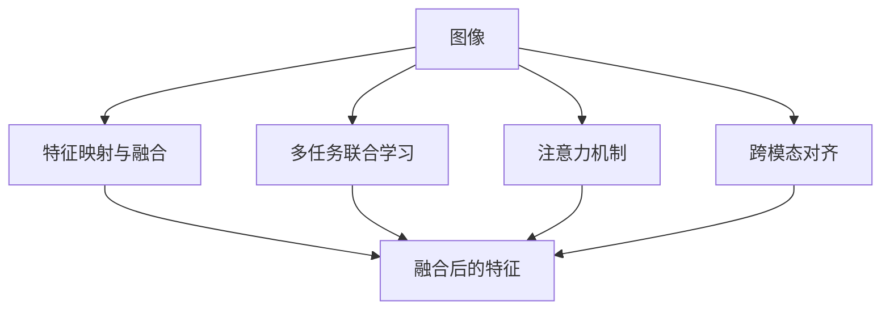

                 

## 1. 背景介绍

在计算机视觉和自然语言处理领域，单一模态的深度学习模型取得了显著的成果，但这些模型往往难以充分理解复杂的多模态信息。多模态深度学习作为解决这一问题的有效手段，能够将图像和文本等多源信息进行深度融合，提高信息获取的全面性和准确性。近年来，随着深度学习技术的飞速发展，多模态深度学习模型在视觉问答、智能机器人、图像描述生成、情感分析等多个领域中取得了重要进展。本文将对多模态深度学习的核心概念、算法原理和应用场景进行系统阐述，并结合具体实例，详细解读其实现过程。

## 2. 核心概念与联系

### 2.1 核心概念概述

多模态深度学习指的是将不同模态（如图像、文本、音频等）的信息进行融合，利用深度神经网络进行多源信息的联合建模，从而提升系统的理解和推理能力。常见的方法包括：

- **特征映射与融合**：将不同模态的特征映射到公共特征空间，然后进行加权融合。
- **多任务联合学习**：同时训练多个相关任务，共享底层特征表示，提升信息检索和分类能力。
- **注意力机制**：引入注意力机制，动态地对不同模态信息进行加权，提高信息选择和聚类能力。
- **跨模态对齐**：通过嵌入学习等方式，将不同模态的数据映射到相似的空间，增强跨模态的对应关系。

这些概念之间相互关联，共同构成了多模态深度学习的基本框架，如图：



## 3. 核心算法原理 & 具体操作步骤

### 3.1 算法原理概述

多模态深度学习模型的核心思想是将不同模态的信息进行融合，构建跨模态的特征表示，从而提升系统的跨模态学习和推理能力。其基本流程可以概括为以下几个步骤：

1. **数据预处理**：将不同模态的数据转换成标准格式，进行归一化、尺度变换等预处理操作。
2. **特征提取**：使用深度神经网络模型，对不同模态的数据进行特征提取，得到高维的特征表示。
3. **特征融合**：将不同模态的特征进行融合，得到跨模态的特征表示。
4. **联合训练**：将不同模态的特征表示作为输入，联合训练模型，优化跨模态信息的一致性和鲁棒性。
5. **推理预测**：使用训练好的模型对新的多模态数据进行推理预测，得到综合的输出结果。

### 3.2 算法步骤详解

以下是多模态深度学习模型的一般实现流程：

**Step 1: 数据预处理**

1. **图像预处理**：图像通常需要进行归一化、尺度变换、裁剪、旋转等预处理，以消除光照、视角等因素的影响。
2. **文本预处理**：文本数据需要进行分词、去除停用词、词性标注等操作，以提高特征的表达能力和稳定性。

**Step 2: 特征提取**

1. **图像特征提取**：使用深度神经网络模型（如CNN、ResNet、Inception等）对图像进行特征提取，得到高维的特征向量。
2. **文本特征提取**：使用深度神经网络模型（如BERT、GPT等）对文本进行特征提取，得到高维的特征向量。

**Step 3: 特征融合**

1. **特征映射与融合**：将不同模态的特征映射到公共特征空间，然后进行加权融合。可以使用传统的线性融合方法（如最大合并、平均合并等），也可以采用深度融合方法（如Siamese网络、注意力机制等）。
2. **多任务联合学习**：同时训练多个相关任务，共享底层特征表示。通过跨模态的任务联合训练，提升信息检索和分类能力。
3. **注意力机制**：引入注意力机制，动态地对不同模态信息进行加权，提高信息选择和聚类能力。

**Step 4: 联合训练**

1. **损失函数设计**：设计联合训练的损失函数，考虑不同模态之间的匹配度和信息一致性。
2. **优化算法选择**：选择合适的优化算法（如Adam、SGD等），设置合适的学习率、批大小、迭代轮数等。

**Step 5: 推理预测**

1. **多模态推理**：使用训练好的模型对新的多模态数据进行推理预测，得到综合的输出结果。
2. **后处理**：对推理结果进行后处理，如归一化、阈值设定、类别映射等操作，得到最终输出。

### 3.3 算法优缺点

多模态深度学习模型具有以下优点：

1. **信息互补性**：图像和文本数据在表达方式和信息维度上存在互补性，多模态融合可以更全面地获取信息。
2. **鲁棒性增强**：通过多模态融合，可以消除单一模态数据的不确定性和噪声，提高系统的鲁棒性。
3. **任务提升**：多模态联合训练可以提升信息检索、情感分析、图像描述生成等任务的性能。

同时，也存在一些缺点：

1. **计算复杂度高**：多模态数据处理和深度融合需要大量的计算资源，尤其是在大规模数据集上。
2. **数据获取难度大**：不同模态的数据获取和标注成本较高，特别是图像和文本数据的获取和标注。
3. **模型复杂性高**：多模态深度学习模型通常比单一模态模型更复杂，需要更多的超参数调整和模型优化。

## 4. 数学模型和公式 & 详细讲解 & 举例说明

### 4.1 数学模型构建

多模态深度学习模型的数学模型可以形式化地表示为：

$$
\begin{aligned}
\text{model}(\mathbf{x}, \mathbf{y}) &= \mathbf{W}_f \mathbf{F}(\mathbf{x}) + \mathbf{W}_t \mathbf{T}(\mathbf{y}) \\
&= \mathbf{W}_f [\mathbf{F}(\mathbf{x}) \otimes \mathbf{I}] + \mathbf{W}_t \mathbf{T}(\mathbf{y})
\end{aligned}
$$

其中，$\mathbf{x}$ 和 $\mathbf{y}$ 分别表示图像和文本数据，$\mathbf{F}(\mathbf{x})$ 和 $\mathbf{T}(\mathbf{y})$ 分别表示图像和文本的特征表示，$\mathbf{W}_f$ 和 $\mathbf{W}_t$ 为不同模态的权重矩阵，$\otimes$ 表示特征融合操作。

### 4.2 公式推导过程

多模态深度学习模型的推导过程主要包括以下几个步骤：

1. **特征映射**：使用深度神经网络对图像和文本数据进行特征映射，得到高维的特征表示。
2. **特征融合**：将不同模态的特征表示进行融合，得到跨模态的特征表示。可以使用加权平均、注意力机制等方法进行融合。
3. **联合训练**：设计联合训练的损失函数，对不同模态的特征表示进行联合训练，优化跨模态信息的一致性和鲁棒性。

以图像和文本融合为例，推导公式如下：

1. **图像特征提取**：使用卷积神经网络（CNN）对图像数据进行特征提取，得到高维的特征向量 $\mathbf{F}(\mathbf{x})$。
2. **文本特征提取**：使用BERT等深度神经网络模型对文本数据进行特征提取，得到高维的特征向量 $\mathbf{T}(\mathbf{y})$。
3. **特征融合**：将图像和文本的特征表示进行融合，得到跨模态的特征表示 $\mathbf{Z}$。可以使用以下方法进行融合：

   - 加权平均：
   $$
   \mathbf{Z} = \alpha \mathbf{F}(\mathbf{x}) + \beta \mathbf{T}(\mathbf{y})
   $$
   其中 $\alpha$ 和 $\beta$ 为加权系数，通常通过交叉验证或手动调节确定。

   - 注意力机制：
   $$
   \mathbf{Z} = \sum_{i=1}^n \alpha_i \mathbf{F}_i + \sum_{i=1}^m \beta_i \mathbf{T}_i
   $$
   其中 $\alpha_i$ 和 $\beta_i$ 为注意力系数，通过注意力机制计算得到。

4. **联合训练**：设计联合训练的损失函数，对不同模态的特征表示进行联合训练。例如，可以使用如下损失函数：
   $$
   \mathcal{L} = \frac{1}{N} \sum_{i=1}^N \left[ \ell_f(\mathbf{F}_i, \mathbf{T}_i) + \ell_t(\mathbf{F}_i, \mathbf{T}_i) \right]
   $$
   其中 $\ell_f$ 和 $\ell_t$ 分别为图像和文本的损失函数。

### 4.3 案例分析与讲解

以视觉问答（Visual Question Answering, VQA）为例，介绍多模态深度学习模型的应用。

**数据集**：COCO VQA dataset，包含约300K张图片和超过200K个视觉问题。

**模型架构**：使用ResNet-101作为图像特征提取器，使用LSTM作为文本特征提取器。

**特征融合**：使用加权平均方法对图像和文本的特征表示进行融合。

**联合训练**：设计联合训练的损失函数，对不同模态的特征表示进行联合训练。

**推理预测**：使用训练好的模型对新的图片和问题进行推理预测，得到综合的输出结果。

## 5. 项目实践：代码实例和详细解释说明

### 5.1 开发环境搭建

以下是使用PyTorch进行多模态深度学习模型开发的开发环境配置流程：

1. 安装Anaconda：从官网下载并安装Anaconda，用于创建独立的Python环境。

2. 创建并激活虚拟环境：
```bash
conda create -n multimodal_env python=3.8 
conda activate multimodal_env
```

3. 安装PyTorch：根据CUDA版本，从官网获取对应的安装命令。例如：
```bash
conda install pytorch torchvision torchaudio cudatoolkit=11.1 -c pytorch -c conda-forge
```

4. 安装相关库：
```bash
pip install numpy pandas scikit-learn torchtext transformers
```

完成上述步骤后，即可在`multimodal_env`环境中开始多模态深度学习模型的开发。

### 5.2 源代码详细实现

下面以图像和文本融合为例，给出使用PyTorch进行多模态深度学习模型开发的完整代码实现。

**图像预处理**：
```python
import torchvision.transforms as transforms
from PIL import Image

# 图像预处理
transform = transforms.Compose([
    transforms.Resize((224, 224)),
    transforms.ToTensor(),
    transforms.Normalize(mean=[0.485, 0.456, 0.406],
                         std=[0.229, 0.224, 0.225])
])
```

**文本预处理**：
```python
from transformers import BertTokenizer
from torch.utils.data import Dataset

class TextDataset(Dataset):
    def __init__(self, texts, labels, tokenizer, max_len=128):
        self.texts = texts
        self.labels = labels
        self.tokenizer = tokenizer
        self.max_len = max_len
        
    def __len__(self):
        return len(self.texts)
    
    def __getitem__(self, item):
        text = self.texts[item]
        label = self.labels[item]
        
        encoding = self.tokenizer(text, return_tensors='pt', max_length=self.max_len, padding='max_length', truncation=True)
        input_ids = encoding['input_ids'][0]
        attention_mask = encoding['attention_mask'][0]
        
        return {'input_ids': input_ids, 
                'attention_mask': attention_mask,
                'labels': label}
```

**图像特征提取**：
```python
from transformers import ResNetFeatureExtractor
from transformers import AutoModel

# 图像特征提取
feature_extractor = ResNetFeatureExtractor.from_pretrained('resnet101')
model = AutoModel.from_pretrained('resnet101')
```

**文本特征提取**：
```python
from transformers import BertForTokenClassification, BertTokenizer

# 文本特征提取
tokenizer = BertTokenizer.from_pretrained('bert-base-cased')
model = BertForTokenClassification.from_pretrained('bert-base-cased')
```

**特征融合**：
```python
def fuse_features(feature1, feature2):
    return feature1 + feature2
```

**联合训练**：
```python
from torch.optim import Adam
from torch.nn import BCELoss

# 联合训练
model.train()
optimizer = Adam(model.parameters(), lr=1e-3)
loss = BCELoss()
for epoch in range(10):
    for batch in train_loader:
        optimizer.zero_grad()
        inputs, labels = batch['input_ids'], batch['labels']
        outputs = model(inputs)
        loss = loss(outputs, labels)
        loss.backward()
        optimizer.step()
```

**推理预测**：
```python
def predict(image_path, question):
    # 图像预处理
    image = Image.open(image_path)
    image = transform(image)
    image = image.unsqueeze(0)
    
    # 特征提取
    features = feature_extractor(image)
    
    # 文本预处理
    question = tokenizer(question, return_tensors='pt', padding='max_length', truncation=True)
    input_ids = question['input_ids']
    attention_mask = question['attention_mask']
    
    # 特征融合
    fused_features = fuse_features(features, input_ids)
    
    # 推理预测
    outputs = model(fused_features)
    predictions = outputs.argmax(dim=1)
    return predictions.item()
```

### 5.3 代码解读与分析

让我们再详细解读一下关键代码的实现细节：

**图像预处理**：
- `transforms.Compose`：将多个预处理步骤组合成一个预处理管道，依次对图像进行归一化、尺度变换、裁剪等操作。
- `transforms.Resize`：将图像缩放至固定大小。
- `transforms.ToTensor`：将图像转换为PyTorch张量。
- `transforms.Normalize`：对图像进行归一化。

**文本预处理**：
- `TextDataset`：定义文本数据集，包括文本数据和标签。
- `BertTokenizer`：使用BERT分词器对文本进行分词，得到标记化的token序列。
- `input_ids`和`attention_mask`：将标记化的token序列转换为模型所需的输入格式，并进行padding和truncation操作。

**图像特征提取**：
- `ResNetFeatureExtractor`：使用ResNet作为特征提取器，对图像进行特征提取，得到高维的特征向量。
- `AutoModel`：加载预训练的ResNet模型，用于提取图像特征。

**文本特征提取**：
- `BertTokenizer`：使用BERT分词器对文本进行分词，得到标记化的token序列。
- `BertForTokenClassification`：加载预训练的BERT模型，用于提取文本特征。

**特征融合**：
- `fuse_features`：将图像和文本的特征向量进行加权平均融合，得到跨模态的特征向量。

**联合训练**：
- `Adam`：使用Adam优化器进行联合训练。
- `BCELoss`：使用二分类交叉熵损失函数进行联合训练。
- `train_loader`：数据加载器，用于迭代读取训练数据。

**推理预测**：
- `predict`：对新的图像和问题进行推理预测，得到综合的输出结果。

## 6. 实际应用场景

### 6.1 智能机器人

智能机器人能够通过多模态信息融合，实现复杂的人机交互。例如，当机器人面对一个复杂的问题时，它可以同时获取用户的语音、面部表情和文字输入，进行多模态信息融合，给出更全面、准确的回应。

**场景**：智能客服机器人。

**实现**：
- 获取用户输入的多模态信息（语音、文字、表情）。
- 将多模态信息转换为标准格式，进行预处理。
- 使用多模态深度学习模型对多模态信息进行融合，得到综合的特征表示。
- 根据综合特征表示进行推理预测，生成合适的回答。

### 6.2 视觉问答（VQA）

视觉问答是当前热门的研究方向，通过将图像和自然语言结合起来，实现对图像内容的理解。例如，当用户问“图片中的狗在哪里”时，多模态深度学习模型可以结合图像和文本信息，进行推理预测，给出准确的答案。

**场景**：图像描述生成。

**实现**：
- 获取带有问题的图像。
- 将图像和问题转换为标准格式，进行预处理。
- 使用多模态深度学习模型对图像和问题进行融合，得到综合的特征表示。
- 根据综合特征表示进行推理预测，生成图像描述。

### 6.3 情感分析

情感分析是NLP领域的重要任务，通过将文本信息和视觉信息结合起来，可以更准确地分析用户的情感状态。例如，当用户发布了一条带有表情符号的帖子时，情感分析系统可以通过多模态信息融合，判断用户的情感倾向。

**场景**：社交媒体情感分析。

**实现**：
- 获取带有表情符号的社交媒体帖子。
- 将文本和表情转换为标准格式，进行预处理。
- 使用多模态深度学习模型对文本和表情进行融合，得到综合的特征表示。
- 根据综合特征表示进行推理预测，分析用户的情感状态。

## 7. 工具和资源推荐

### 7.1 学习资源推荐

为了帮助开发者系统掌握多模态深度学习的理论基础和实践技巧，这里推荐一些优质的学习资源：

1. 《多模态深度学习》（Kai-FA Loo & Xiao Liu）：全面介绍了多模态深度学习的理论基础、算法原理和实际应用，是一本很好的入门读物。
2. 《多模态学习》（Patrick H. S. Rabiner）：深入探讨了多模态深度学习的数学建模和优化算法，适合进阶学习。
3. Coursera上的多模态深度学习课程：斯坦福大学、哈佛大学等多所名校开设的多模态深度学习课程，涵盖了从理论到实践的全面内容。
4. arXiv上的多模态深度学习论文：arXiv是人工智能领域最重要的预印本平台，你可以在这里找到最新的多模态深度学习研究成果。

通过对这些资源的学习实践，相信你一定能够快速掌握多模态深度学习的精髓，并用于解决实际的NLP问题。

### 7.2 开发工具推荐

高效的开发离不开优秀的工具支持。以下是几款用于多模态深度学习开发的常用工具：

1. PyTorch：基于Python的开源深度学习框架，灵活动态的计算图，适合快速迭代研究。支持多模态深度学习模型的实现。
2. TensorFlow：由Google主导开发的开源深度学习框架，生产部署方便，适合大规模工程应用。支持多模态深度学习模型的实现。
3. PyTorch Lightning：基于PyTorch的快速开发框架，支持多模态深度学习模型的快速实现和分布式训练。
4. HuggingFace Transformers：开源的NLP工具库，集成了多个预训练语言模型和多模态深度学习模型，方便快速开发和部署。
5. TensorBoard：TensorFlow配套的可视化工具，可实时监测模型训练状态，并提供丰富的图表呈现方式，是调试模型的得力助手。

合理利用这些工具，可以显著提升多模态深度学习模型的开发效率，加快创新迭代的步伐。

### 7.3 相关论文推荐

多模态深度学习技术的发展源于学界的持续研究。以下是几篇奠基性的相关论文，推荐阅读：

1. "Look, Listen, Learn"（Joseph E. Hoffman等）：首次提出多模态深度学习模型，实现了图像、文本和音频等多模态数据的联合建模。
2. "Vision and Language"（Andrej Karpathy等）：提出了视觉问答（VQA）任务，通过将图像和自然语言结合起来，实现了对图像内容的理解。
3. "Multimodal Fusion Networks for Image-Text Retrieval"（Akihiro Kawazoe等）：提出了一种多模态融合网络，用于图像-文本检索任务，取得了优异的效果。
4. "Attention-Based Multimodal Neural Networks for Learning from Multiple Data Sources"（Zhaojie Zha等）：提出了一种基于注意力机制的多模态深度学习模型，用于多源数据的联合学习。

这些论文代表了大模态深度学习的发展脉络。通过学习这些前沿成果，可以帮助研究者把握学科前进方向，激发更多的创新灵感。

## 8. 总结：未来发展趋势与挑战

### 8.1 研究成果总结

本文对多模态深度学习的核心概念、算法原理和应用场景进行了系统阐述，并结合具体实例，详细解读了其实现过程。通过本文的学习，你应当能够理解多模态深度学习的核心思想，掌握其实现方法和应用策略，并在实际开发中加以应用。

### 8.2 未来发展趋势

展望未来，多模态深度学习技术将呈现以下几个发展趋势：

1. **技术成熟度提升**：随着深度学习技术的不断进步，多模态深度学习模型将变得越来越成熟和稳定，能够在更多应用场景中发挥作用。
2. **应用领域扩展**：多模态深度学习将拓展到更多的领域，如医疗、教育、金融等，为这些领域的智能化发展提供新的技术支持。
3. **跨模态对齐优化**：未来的研究将进一步优化跨模态对齐方法，提升不同模态数据之间的对应关系，增强信息融合的准确性。
4. **模型复杂性降低**：未来的研究将致力于降低多模态深度学习模型的复杂性，提高模型的效率和可解释性，增强模型的应用价值。
5. **数据获取与标注**：未来的研究将探索更多的数据获取和标注方法，降低多模态深度学习模型的成本，提升模型的实际应用价值。

### 8.3 面临的挑战

尽管多模态深度学习技术已经取得了显著的成果，但在向实际应用迈进的过程中，仍面临诸多挑战：

1. **计算资源消耗**：多模态深度学习模型通常需要大量的计算资源，特别是大规模数据集上的联合训练，这给算力带来了巨大的压力。
2. **数据获取与标注**：多模态数据获取和标注成本较高，特别是在图像和文本数据上，数据获取和标注仍然是一个难以解决的问题。
3. **模型复杂性**：多模态深度学习模型通常比单一模态模型更复杂，需要更多的超参数调整和模型优化。
4. **跨模态对齐**：不同模态的数据特征存在差异，如何提升跨模态对齐的效果，是一个亟待解决的问题。
5. **模型可解释性**：多模态深度学习模型通常被认为是“黑盒”模型，难以解释其内部工作机制和决策逻辑，这在实际应用中是一个重要问题。

### 8.4 研究展望

面对多模态深度学习面临的挑战，未来的研究需要在以下几个方面寻求新的突破：

1. **数据增强与预处理**：探索更多的数据增强和预处理方法，提高多模态数据的获取和标注效率。
2. **模型压缩与优化**：研究模型压缩和优化方法，提高多模态深度学习模型的计算效率和可解释性。
3. **跨模态对齐优化**：进一步优化跨模态对齐方法，提升不同模态数据之间的对应关系，增强信息融合的准确性。
4. **多任务联合学习**：探索更多多任务联合学习方法，提升多模态深度学习模型的综合性能。
5. **模型可解释性**：研究模型可解释性方法，提高多模态深度学习模型的透明度和可信度。

这些研究方向的探索，必将引领多模态深度学习技术迈向更高的台阶，为构建智能化、普适化的多模态信息处理系统铺平道路。面向未来，多模态深度学习技术还需要与其他人工智能技术进行更深入的融合，如知识表示、因果推理、强化学习等，多路径协同发力，共同推动自然语言理解和智能交互系统的进步。只有勇于创新、敢于突破，才能不断拓展多模态深度学习的边界，让智能技术更好地造福人类社会。

## 9. 附录：常见问题与解答

**Q1：多模态深度学习与单一模态深度学习有何不同？**

A: 多模态深度学习与单一模态深度学习的最大不同在于，多模态深度学习模型能够同时处理多种信息源（如图像、文本、音频等），并通过深度融合得到更全面、准确的信息表示。单一模态深度学习模型则只处理一种信息源，无法充分利用多种信息源的优势。

**Q2：多模态深度学习模型是否需要大量标注数据？**

A: 多模态深度学习模型通常需要大量标注数据来训练，特别是在跨模态对齐和特征融合等关键环节。标注数据的质量和数量对模型的性能有着重要影响。因此，数据获取和标注是一个重要的挑战。

**Q3：多模态深度学习模型的推理效率如何？**

A: 多模态深度学习模型通常比单一模态深度学习模型更复杂，推理速度较慢，尤其是在大规模数据集上。为了提高推理效率，可以采用模型压缩、模型剪枝、优化推理图等方法进行优化。

**Q4：如何提高多模态深度学习模型的鲁棒性？**

A: 提高多模态深度学习模型的鲁棒性可以从以下几个方面入手：
1. 数据增强：通过数据增强方法，增加训练集的多样性，提高模型的泛化能力。
2. 正则化：使用L2正则、Dropout等正则化技术，防止模型过拟合。
3. 对抗训练：引入对抗样本，提高模型对噪声和攻击的鲁棒性。
4. 跨模态对齐优化：优化跨模态对齐方法，提升不同模态数据之间的对应关系，增强模型的鲁棒性。

这些方法可以相互结合，进一步提高多模态深度学习模型的鲁棒性。

**Q5：多模态深度学习模型的可解释性如何？**

A: 多模态深度学习模型的可解释性通常较低，被认为是“黑盒”模型。为了提高可解释性，可以采用以下方法：
1. 特征可视化：通过可视化特征图，理解模型在特定任务上的决策过程。
2. 注意力机制：引入注意力机制，动态地对不同模态信息进行加权，提高信息选择和聚类能力。
3. 因果推理：引入因果推理方法，分析模型决策的关键特征，增强输出解释的因果性和逻辑性。

这些方法可以相互结合，进一步提高多模态深度学习模型的可解释性。

通过本文的学习，你应当能够理解多模态深度学习的核心思想，掌握其实现方法和应用策略，并在实际开发中加以应用。

---

作者：禅与计算机程序设计艺术 / Zen and the Art of Computer Programming

