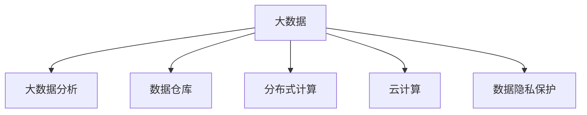

                 

# 大数据时代：人类计算的机遇与挑战并存

## 1. 背景介绍

### 1.1 问题由来

随着互联网、物联网、移动设备等技术的发展，数据量呈指数级增长。大数据时代的来临，为各行各业带来了前所未有的机遇与挑战。大数据处理技术的进步，使得数据变得前所未有的重要。无论是企业的决策支持，科学研究还是公共政策制定，都越来越依赖于数据的分析与挖掘。

在计算机领域，大数据不仅是一种技术趋势，更是一种方法论和思维方式。它推动了计算范式的转变，从传统的联机事务处理(OLTP)转向联机分析处理(OLAP)，进一步拓展到联机聚合处理(OLAP)，乃至联机分析预测(OLAP)。这种转变促使人们重新思考数据处理和计算的模式，从而对传统的算法和系统架构提出了更高的要求。

### 1.2 问题核心关键点

当前，大数据处理面临的核心问题包括：

- **数据量膨胀**：数据量不断增长，如何高效存储、管理和查询数据成为一个严峻挑战。
- **数据质量参差不齐**：数据的准确性、完整性、一致性和实时性存在差距，如何保证数据质量是关键。
- **计算资源稀缺**：大数据处理需要强大的计算能力，但硬件资源的瓶颈难以突破，如何提升计算效率是难题。
- **数据隐私与安全**：大数据应用涉及大量敏感信息，如何保障数据隐私与安全是一个重要问题。

## 2. 核心概念与联系

### 2.1 核心概念概述

为了更好地理解大数据时代的人类计算，本节将介绍几个密切相关的核心概念：

- **大数据(Big Data)**：指那些传统数据处理技术难以处理的数据集。通常具有规模巨大(Volume)、种类繁多(Variety)、价值密度低(Value)、生成速度快(Velocity)等特征。
- **大数据分析(Big Data Analytics)**：指利用先进的数据处理技术，对大数据进行清洗、整理、分析和挖掘，提取有价值的信息，以支持决策和优化业务流程。
- **数据仓库(Data Warehouse)**：是一种用于存储、管理和查询大量数据的集中式数据库系统。支持数据的高效访问和分析。
- **分布式计算(Distributed Computing)**：指通过多台计算机协同工作，处理大规模的数据集。典型技术如Apache Hadoop、Apache Spark等。
- **云计算(Cloud Computing)**：指通过互联网提供计算资源和服务，用户按需使用，按量计费。典型服务如Amazon Web Services(AWS)、Microsoft Azure、Google Cloud Platform(GCP)等。
- **数据隐私保护(Data Privacy Protection)**：指在处理数据时，确保数据不被非法获取、使用或泄露，保障个人和企业的信息安全。

这些核心概念之间的逻辑关系可以通过以下Mermaid流程图来展示：



这个流程图展示了大数据时代的关键概念及其之间的关系：

1. 大数据是整个体系的基础。
2. 大数据分析通过技术手段，从大数据中提取价值信息。
3. 数据仓库是存储和管理大数据的核心工具。
4. 分布式计算和大数据分析技术紧密相连，提高处理效率。
5. 云计算提供强大的计算资源，支持大数据处理。
6. 数据隐私保护确保数据处理的安全性和合规性。

## 3. 核心算法原理 & 具体操作步骤

### 3.1 算法原理概述

大数据时代的核心算法通常围绕着数据处理、存储和分析展开。其基本原理可以概括为：

- **数据预处理**：对原始数据进行清洗、去重、归一化等处理，以提高数据质量。
- **数据存储**：利用分布式文件系统和数据库系统，高效存储和管理海量数据。
- **数据查询与分析**：通过分布式计算框架，对大数据进行快速查询和分析，提取有价值的信息。
- **数据可视化**：将分析结果通过图表、报表等形式展示出来，帮助用户理解数据背后的趋势和模式。

### 3.2 算法步骤详解

基于上述基本原理，大数据处理通常包括以下几个关键步骤：

**Step 1: 数据收集与预处理**

- 从各个数据源收集数据，包括结构化数据、半结构化数据和非结构化数据。
- 对数据进行清洗、去重、归一化等预处理，确保数据质量。
- 使用ETL工具（Extract-Transform-Load，即提取-转换-加载）对数据进行抽取、转换和加载，将数据导入数据仓库。

**Step 2: 数据存储与管理**

- 使用分布式文件系统（如Hadoop HDFS）存储海量数据。
- 使用分布式数据库系统（如Apache Cassandra）管理海量数据，支持高并发读写操作。
- 使用数据湖技术（如Apache Parquet、Apache ORC）管理非结构化数据，支持高效存储和查询。

**Step 3: 数据查询与分析**

- 使用分布式计算框架（如Apache Spark、Apache Flink）进行大数据分析，快速处理大规模数据集。
- 使用SQL查询语言（如Apache Tez、Apache Impala）进行数据查询，提取有用信息。
- 使用机器学习算法（如TensorFlow、PyTorch）对数据进行建模和预测，提取知识。

**Step 4: 数据可视化**

- 使用数据可视化工具（如Tableau、Power BI）将分析结果可视化，帮助用户理解数据背后的趋势和模式。
- 使用报表工具（如JasperReports、Talend）生成详细的报表，支持业务决策。

### 3.3 算法优缺点

大数据处理算法具有以下优点：

- **处理效率高**：分布式计算框架可以并行处理大规模数据集，极大地提高了数据处理效率。
- **可扩展性好**：通过增加计算节点和存储设备，可以灵活扩展系统规模，满足日益增长的数据处理需求。
- **灵活性强**：大数据处理算法支持多种数据类型和格式，可以适应不同的业务需求。

然而，大数据处理算法也存在以下缺点：

- **计算资源需求高**：处理大数据需要强大的计算能力和存储能力，硬件资源的瓶颈难以突破。
- **复杂度高**：大数据处理流程涉及多个环节，技术复杂度高，需要较高的技术门槛。
- **数据隐私和安全风险**：大数据处理过程中涉及大量敏感信息，如何保障数据隐私和安全是一个重要问题。

### 3.4 算法应用领域

大数据处理技术已经在多个领域得到了广泛应用，例如：

- **金融行业**：通过大数据分析，银行可以预测客户行为，进行风险控制和市场预测。
- **医疗行业**：通过大数据分析，医疗机构可以预测疾病趋势，优化医疗资源配置。
- **零售行业**：通过大数据分析，零售商可以了解消费者行为，优化库存管理和定价策略。
- **交通行业**：通过大数据分析，交通部门可以优化交通流量，减少拥堵和事故。
- **媒体行业**：通过大数据分析，媒体公司可以分析用户行为，优化内容推荐和广告投放。

除了这些典型应用外，大数据处理技术还在更多场景中得到创新性的应用，如智能城市、智慧农业、环境保护等，为各行各业带来了新的发展机遇。

## 4. 数学模型和公式 & 详细讲解 & 举例说明

### 4.1 数学模型构建

在大数据处理中，常见的数学模型包括回归模型、分类模型、聚类模型等。以回归模型为例，其数学模型可以表示为：

$$ y = \beta_0 + \beta_1 x_1 + \beta_2 x_2 + \cdots + \beta_n x_n + \epsilon $$

其中 $y$ 为因变量，$x_1, x_2, \cdots, x_n$ 为自变量，$\beta_0, \beta_1, \beta_2, \cdots, \beta_n$ 为模型系数，$\epsilon$ 为误差项。

### 4.2 公式推导过程

为了求解回归模型，需要使用最小二乘法。其基本思想是通过最小化误差项的平方和，求解模型系数。具体公式如下：

$$ \hat{\beta} = (X^TX)^{-1}X^Ty $$

其中 $\hat{\beta}$ 为模型系数的最小二乘解，$X$ 为自变量的设计矩阵，$y$ 为因变量的向量。

### 4.3 案例分析与讲解

以预测房价为例，假设我们收集了多个因素（如面积、位置、楼层等）作为自变量，目标是预测房价。我们可以使用线性回归模型来建立房价与自变量之间的关系，通过最小二乘法求解模型系数，最后利用模型进行预测。

在实际应用中，我们需要先对数据进行预处理，去除缺失值和异常值，进行特征选择和数据转换。然后，将数据分为训练集和测试集，使用训练集进行模型训练，使用测试集进行模型评估。最终，将模型应用于新数据的预测。

## 5. 项目实践：代码实例和详细解释说明

### 5.1 开发环境搭建

在进行大数据项目实践前，我们需要准备好开发环境。以下是使用Python进行Apache Spark开发的环境配置流程：

1. 安装Anaconda：从官网下载并安装Anaconda，用于创建独立的Python环境。

2. 创建并激活虚拟环境：
```bash
conda create -n spark-env python=3.8 
conda activate spark-env
```

3. 安装PySpark：根据CUDA版本，从官网获取对应的安装命令。例如：
```bash
conda install pyspark=3.1.1 cudatoolkit=11.1 -c pyspark -c conda-forge
```

4. 安装各类工具包：
```bash
pip install numpy pandas scikit-learn matplotlib tqdm jupyter notebook ipython
```

完成上述步骤后，即可在`spark-env`环境中开始Spark项目的开发。

### 5.2 源代码详细实现

下面我们以房价预测为例，给出使用PySpark进行大数据处理和回归分析的Python代码实现。

首先，定义数据处理函数：

```python
from pyspark.sql import SparkSession
from pyspark.sql.functions import col, lit, col, when, col

def preprocess_data(spark, data_path):
    spark_data = spark.read.format('csv').options(header=True, inferschema=True).load(data_path)
    # 删除缺失值
    spark_data = spark_data.dropna()
    # 数据类型转换
    spark_data = spark_data.withColumn('area', col('area').astype('float'))
    spark_data = spark_data.withColumn('location', col('location').astype('float'))
    spark_data = spark_data.withColumn('floor', col('floor').astype('float'))
    return spark_data
```

然后，定义模型训练函数：

```python
from pyspark.ml.regression import LinearRegression
from pyspark.ml.evaluation import RegressionEvaluator
from pyspark.ml.feature import VectorAssembler

def train_model(spark, train_data, test_data):
    # 数据准备
    assembler = VectorAssembler(inputCols=['area', 'location', 'floor'], outputCol='features')
    train_data = assembler.transform(train_data)
    test_data = assembler.transform(test_data)
    
    # 线性回归模型训练
    lr = LinearRegression(featuresCol='features', labelCol='price')
    model = lr.fit(train_data)
    
    # 模型评估
    evaluator = RegressionEvaluator(labelCol='price', predictionCol='prediction', metricName='rmse')
    rmse = evaluator.evaluate(model.transform(test_data))['rmse']
    return model, rmse
```

最后，启动训练流程并在测试集上评估：

```python
spark = SparkSession.builder.appName('Housing Price Prediction').getOrCreate()

# 数据预处理
train_path = '/path/to/train_data.csv'
test_path = '/path/to/test_data.csv'
train_data = preprocess_data(spark, train_path)
test_data = preprocess_data(spark, test_path)

# 模型训练和评估
model, rmse = train_model(spark, train_data, test_data)
print(f'Root Mean Squared Error: {rmse:.4f}')

# 使用模型进行预测
new_data = spark.createDataFrame([('200', 0.5, 10), ('150', 0.8, 8)], ['id', 'area', 'location', 'floor'])
new_data = assembler.transform(new_data)
prediction = model.transform(new_data)
print(prediction.select('id', 'prediction').rdd.collect())
```

以上就是使用PySpark对房价预测进行大数据处理和回归分析的完整代码实现。可以看到，利用Spark进行大数据处理，代码实现非常简单，而且可以方便地进行分布式计算和处理。

### 5.3 代码解读与分析

让我们再详细解读一下关键代码的实现细节：

**preprocess_data函数**：
- 定义了一个名为`preprocess_data`的函数，接收SparkSession对象和数据文件路径作为参数。
- 使用`spark.read.format('csv').options(header=True, inferschema=True).load`读取CSV格式的数据文件，并设置表头。
- 使用`spark_data.dropna()`去除缺失值。
- 使用`spark_data.withColumn`将数据类型转换为`float`。
- 返回预处理后的数据。

**train_model函数**：
- 定义了一个名为`train_model`的函数，接收SparkSession对象、训练数据和测试数据作为参数。
- 使用`VectorAssembler`将自变量转换为向量。
- 使用`LinearRegression`训练线性回归模型。
- 使用`RegressionEvaluator`评估模型性能，计算RMSE。
- 返回训练好的模型和RMSE值。

**训练流程**：
- 创建SparkSession对象，并指定应用名称。
- 在`train_path`和`test_path`路径下加载训练数据和测试数据。
- 在数据预处理和模型训练之间调用`train_model`函数。
- 输出训练好的模型和RMSE值。
- 使用训练好的模型对新数据进行预测，并输出预测结果。

可以看到，Spark提供了非常方便的API接口，使得大数据处理和分析变得非常简单，用户只需关注模型设计和数据处理，而无需过多关注底层实现细节。

## 6. 实际应用场景

### 6.1 智能城市

大数据处理技术在智能城市建设中有着广泛的应用，例如：

- **交通管理**：通过实时采集交通流量、车辆位置等信息，进行交通流量优化和交通信号控制，减少交通拥堵和事故。
- **环境监测**：利用传感器和监控设备采集环境数据，进行空气质量监测、水质监测和噪音监测，提升城市环境质量。
- **公共安全**：通过视频监控和数据融合，实现人脸识别、异常行为检测等，保障城市公共安全。

在技术实现上，可以使用Spark进行实时数据流处理，利用机器学习算法进行分析和预测，支持智能城市的各项应用。例如，可以使用Flink进行实时数据流处理，支持低延迟和高吞吐量的数据处理需求。同时，可以使用TensorFlow进行复杂的数据分析和预测，支持城市管理的多场景应用。

### 6.2 智慧农业

大数据处理技术在智慧农业中也有着广泛的应用，例如：

- **精准农业**：通过传感器采集土壤、气候、作物生长状态等信息，进行精准施肥、灌溉和病虫害防治，提高农业生产效率。
- **农产品溯源**：利用区块链和物联网技术，实现农产品的全程跟踪和溯源，保障食品安全。
- **农业管理**：通过数据分析和挖掘，优化农业资源配置，提高农业管理效率。

在技术实现上，可以使用Spark进行大数据分析，利用机器学习算法进行农业生产管理和预测。例如，可以使用TensorFlow进行农业生产数据的建模和预测，支持精准农业和智慧农业的各项应用。

### 6.3 环境保护

大数据处理技术在环境保护中也有着广泛的应用，例如：

- **空气质量监测**：利用传感器和监测设备采集空气质量数据，进行环境污染源追踪和治理。
- **水资源管理**：通过实时采集水资源数据，进行水资源优化配置和污染治理。
- **自然资源保护**：利用遥感技术采集自然资源数据，进行生态系统监测和保护。

在技术实现上，可以使用Spark进行大数据分析，利用机器学习算法进行环境数据的建模和预测。例如，可以使用TensorFlow进行环境数据的建模和预测，支持环境保护的各项应用。

### 6.4 未来应用展望

随着大数据处理技术的不断进步，未来在大数据应用领域将会有更多的创新和突破。以下是几个未来可能的发展方向：

- **边缘计算**：将大数据处理从中心化向边缘化转变，利用本地设备进行数据处理，提升数据处理效率和隐私保护。
- **联邦学习**：通过多方协同计算，保护数据隐私的同时进行大数据分析，支持数据共享和多方合作。
- **智能合约**：利用区块链技术，实现数据自动处理和智能合约执行，提升数据处理和业务合作的效率和安全性。
- **混合云架构**：将公有云和私有云相结合，提升数据处理和业务服务的灵活性和可扩展性。

这些技术创新将为大数据处理带来更多的可能性，推动人类计算进入更加智能、高效、安全的新时代。

## 7. 工具和资源推荐

### 7.1 学习资源推荐

为了帮助开发者系统掌握大数据处理的技术基础和实践技巧，这里推荐一些优质的学习资源：

1. 《大数据技术实战》系列博文：由大数据技术专家撰写，深入浅出地介绍了大数据处理的技术框架和应用场景。

2. CS229《机器学习》课程：斯坦福大学开设的机器学习明星课程，由Andrew Ng主讲，涵盖数据预处理、模型训练和评估等基础内容。

3. 《大数据技术与深度学习》书籍：全面介绍了大数据处理和深度学习的应用，包括数据存储、处理、分析等环节。

4. Hadoop官方文档：Hadoop项目的官方文档，提供了丰富的API接口和样例代码，是学习大数据处理的基础资料。

5. PySpark官方文档：PySpark库的官方文档，详细介绍了Spark的核心概念和API接口，是学习Spark开发的重要资料。

通过对这些资源的学习实践，相信你一定能够快速掌握大数据处理的技术精髓，并用于解决实际的业务问题。

### 7.2 开发工具推荐

高效的开发离不开优秀的工具支持。以下是几款用于大数据处理开发的常用工具：

1. Apache Hadoop：用于大规模数据存储和处理，支持分布式文件系统和分布式计算。

2. Apache Spark：用于大规模数据处理和分析，支持内存计算、分布式计算和机器学习。

3. Apache Flink：用于实时数据流处理，支持低延迟和高吞吐量的数据处理。

4. Apache Kafka：用于大数据流处理和数据传输，支持高吞吐量和低延迟的数据传输。

5. Apache Hive：用于大规模数据仓库和数据查询，支持SQL查询和数据处理。

6. Apache Zeppelin：用于数据可视化和大数据分析，支持交互式的数据探索和展示。

合理利用这些工具，可以显著提升大数据处理的开发效率，加快创新迭代的步伐。

### 7.3 相关论文推荐

大数据处理技术的发展源于学界的持续研究。以下是几篇奠基性的相关论文，推荐阅读：

1. MapReduce: Simplified Data Processing on Large Clusters（Hadoop论文）：提出了MapReduce编程模型，用于大规模数据处理。

2. Spark: Cluster Computing with Fault Tolerance（Spark论文）：介绍了Spark的计算模型和系统架构，支持高效的大数据处理和分析。

3. Storm: Distributed Realtime Computation System（Storm论文）：介绍了Storm的实时计算模型和系统架构，支持高吞吐量和低延迟的数据处理。

4. Federated Learning：一种新兴的分布式机器学习方法，通过多方协同计算，保护数据隐私的同时进行大数据分析。

5. Edge Computing: A Survey（边缘计算综述）：介绍了边缘计算的概念和应用，支持数据处理从中心化向边缘化转变。

这些论文代表了大数据处理技术的发展脉络。通过学习这些前沿成果，可以帮助研究者把握学科前进方向，激发更多的创新灵感。

## 8. 总结：未来发展趋势与挑战

### 8.1 总结

本文对大数据处理的技术原理和应用实践进行了全面系统的介绍。首先阐述了大数据处理的背景和意义，明确了大数据处理在人类计算中的重要地位。其次，从原理到实践，详细讲解了大数据处理的核心算法和操作步骤，给出了大数据处理任务开发的完整代码实例。同时，本文还广泛探讨了大数据处理在智能城市、智慧农业、环境保护等多个行业领域的应用前景，展示了大数据处理的广阔前景。

通过本文的系统梳理，可以看到，大数据处理技术正在成为人类计算的重要手段，极大地拓展了数据处理和分析的能力，推动了各行各业的数字化转型。未来，伴随大数据处理技术的持续演进，相信人类计算将进入更加智能、高效、安全的新时代。

### 8.2 未来发展趋势

展望未来，大数据处理技术将呈现以下几个发展趋势：

- **技术融合**：大数据处理将与其他技术（如人工智能、区块链、边缘计算等）进行更深入的融合，推动各领域的数字化转型。
- **隐私保护**：大数据处理过程中涉及大量敏感信息，如何保障数据隐私和安全是一个重要问题。未来将涌现更多的隐私保护技术，如差分隐私、联邦学习等，保护数据隐私和安全。
- **边缘计算**：大数据处理将从中心化向边缘化转变，利用本地设备进行数据处理，提升数据处理效率和隐私保护。
- **实时处理**：大数据处理将更加关注实时处理，支持高吞吐量和低延迟的数据处理需求。

这些趋势将推动大数据处理技术进入更加智能、高效、安全的新时代，为各行各业带来更多的创新和突破。

### 8.3 面临的挑战

尽管大数据处理技术已经取得了瞩目成就，但在迈向更加智能化、普适化应用的过程中，它仍面临着诸多挑战：

- **数据质量问题**：大数据处理过程中涉及大量数据，数据质量参差不齐，如何保证数据质量是一个重要问题。
- **计算资源瓶颈**：处理大规模数据需要强大的计算能力和存储能力，硬件资源的瓶颈难以突破，如何提升计算效率是难题。
- **技术复杂度高**：大数据处理流程涉及多个环节，技术复杂度高，需要较高的技术门槛。
- **数据隐私和安全风险**：大数据处理过程中涉及大量敏感信息，如何保障数据隐私和安全是一个重要问题。

### 8.4 研究展望

面对大数据处理面临的挑战，未来的研究需要在以下几个方面寻求新的突破：

- **数据清洗与预处理**：开发高效的数据清洗和预处理技术，提高数据质量，支持高质量的大数据处理。
- **分布式计算优化**：优化分布式计算框架，提升计算效率，支持大规模数据的处理需求。
- **实时处理技术**：开发高效的实时处理技术，支持高吞吐量和低延迟的数据处理需求。
- **隐私保护技术**：开发高效的隐私保护技术，保障数据隐私和安全，支持数据共享和多方合作。

这些研究方向将引领大数据处理技术迈向更高的台阶，为各行各业带来更多的创新和突破。相信随着学界和产业界的共同努力，这些挑战终将一一被克服，大数据处理必将在构建人机协同的智能时代中扮演越来越重要的角色。

## 9. 附录：常见问题与解答

**Q1：大数据处理的核心技术是什么？**

A: 大数据处理的核心技术包括分布式文件系统（如Hadoop HDFS）、分布式计算框架（如Apache Spark、Apache Flink）、数据仓库系统（如Apache Cassandra）等。这些技术共同构成了大数据处理的基础架构。

**Q2：大数据处理和传统数据处理有什么区别？**

A: 大数据处理的核心区别在于数据规模和数据处理方式。大数据处理涉及海量数据，且数据处理过程通常是分布式和并行的，需要高性能计算资源支持。传统数据处理通常涉及较小的数据集，且数据处理过程通常是集中式的，不需要高性能计算资源支持。

**Q3：大数据处理的优势是什么？**

A: 大数据处理的优势在于能够处理海量数据，提高数据处理效率和准确性。同时，大数据处理支持分布式计算和并行处理，能够处理复杂的计算任务和实时数据流。此外，大数据处理支持数据的多维分析和挖掘，能够从中提取有价值的信息，支持业务决策和优化。

**Q4：大数据处理面临的主要挑战是什么？**

A: 大数据处理面临的主要挑战包括数据质量问题、计算资源瓶颈、技术复杂度高、数据隐私和安全风险等。解决这些问题需要技术创新和算法优化，同时需要跨领域的协同合作。

**Q5：如何提高大数据处理的效率？**

A: 提高大数据处理的效率需要从多个方面进行优化，包括：
- 优化数据预处理和清洗流程，提高数据质量。
- 优化分布式计算框架，提高计算效率。
- 引入高性能计算资源，支持大规模数据处理。
- 优化数据存储和访问机制，提高数据访问效率。

这些措施可以显著提升大数据处理的效率和性能。

---

作者：禅与计算机程序设计艺术 / Zen and the Art of Computer Programming

