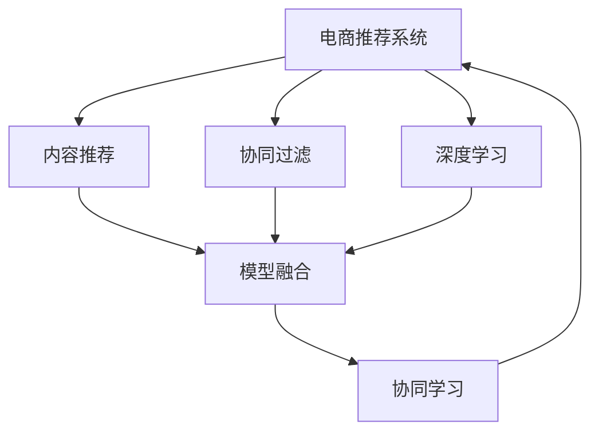

                 

# 大数据驱动的电商推荐系统：AI 模型融合技术在电商领域的应用

> 关键词：电商推荐系统,AI 模型融合,大数据驱动,个性化推荐,协同过滤,深度学习,协同学习,推荐算法,电商运营

## 1. 背景介绍

### 1.1 问题由来

在现代社会，电子商务成为人们日常生活的一部分。电商平台（如淘宝、京东、Amazon）通过推荐系统（Recommendation System）将用户与商品进行精准匹配，提升用户体验和交易转化率。电商推荐系统可以分为基于内容的推荐、基于协同过滤的推荐、混合推荐等不同方法，这些方法都有其优缺点。

在电商领域，推荐系统的核心目标是最大化交易转化率，即通过展示用户可能感兴趣的商品，提高用户点击率和购买率，增加销售额。然而，如何精确地识别用户兴趣，并针对性地推荐商品，是推荐系统面临的重大挑战。为此，电商企业引入了一系列基于AI的技术，以提高推荐的个性化和精准度，其中AI模型的融合应用尤为关键。

### 1.2 问题核心关键点

电商推荐系统中的AI模型融合，旨在将多种AI模型有机结合，发挥各自优势，形成具有更强泛化能力、更加准确预测结果的推荐模型。核心关键点包括：

- **数据融合**：将用户的搜索、浏览、评价、交易等行为数据进行整合，提供全面的用户画像。
- **模型融合**：将内容推荐、协同过滤、深度学习等不同模型融合在一起，构建混合推荐系统。
- **持续学习**：通过在线学习算法，模型能够不断吸收新数据，适应用户兴趣变化。
- **交互优化**：与用户进行多轮交互，实时调整推荐结果。
- **可解释性**：推荐结果需可解释，便于运营人员理解调整推荐策略。

## 2. 核心概念与联系

### 2.1 核心概念概述

为更好地理解电商推荐系统中的AI模型融合，本节将介绍几个密切相关的核心概念：

- **电商推荐系统**：通过分析用户历史行为数据，预测用户可能感兴趣的商品，并将商品推荐给用户，提高用户的购买决策过程的转化率。
- **内容推荐**：基于用户的历史行为数据，挖掘用户可能喜欢的内容（如商品、文章、视频）。
- **协同过滤**：通过分析用户之间相似性，为用户推荐与其他用户喜欢的商品。
- **深度学习**：使用神经网络等深度学习模型，对用户行为进行建模，学习用户偏好和行为规律。
- **模型融合**：将多种模型有机结合，形成更加强大的推荐系统。
- **协同学习**：多个模型之间共享数据，协同训练，提升整体推荐性能。

这些核心概念之间的逻辑关系可以通过以下Mermaid流程图来展示：



这个流程图展示了大电商推荐系统中的核心概念及其之间的关系：

1. 电商推荐系统以用户行为数据为基础，通过多种推荐方法进行推荐。
2. 内容推荐、协同过滤、深度学习等不同模型从不同角度提取用户兴趣，进行推荐。
3. 模型融合将不同模型结合，形成更加强大的推荐模型。
4. 协同学习通过多个模型间的共享，提升整体推荐性能。

## 3. 核心算法原理 & 具体操作步骤

### 3.1 算法原理概述

电商推荐系统中的AI模型融合，本质上是将多个AI模型进行有机结合，形成具有更强泛化能力、更加准确预测结果的推荐模型。其核心思想是：将用户行为数据输入到多个模型中进行独立分析和独立预测，再将这些预测结果通过某种方式融合，输出最终的推荐结果。

在实际应用中，电商推荐系统通常包含以下步骤：

1. 收集用户的历史行为数据（如浏览、购买、评价等）。
2. 将用户数据输入到内容推荐、协同过滤、深度学习等多个模型中进行独立预测。
3. 对各个模型的预测结果进行融合，形成最终的推荐结果。
4. 根据用户对推荐结果的反馈，对各个模型进行在线更新，提高推荐性能。

### 3.2 算法步骤详解

电商推荐系统中的AI模型融合，主要包含以下关键步骤：

**Step 1: 数据收集与预处理**
- 收集用户的历史行为数据，包括浏览历史、购买记录、评价等。
- 对数据进行清洗和标准化处理，确保数据的质量和一致性。
- 将数据划分为训练集、验证集和测试集，以供模型训练和评估使用。

**Step 2: 模型选择与构建**
- 选择合适的推荐算法和模型，如基于内容的推荐、协同过滤、深度学习等。
- 对每个模型进行独立的训练，并设置相应的超参数和模型结构。

**Step 3: 模型融合**
- 对各个模型的预测结果进行融合，形成最终的推荐结果。常用的融合方法包括投票、加权平均、Stacking等。
- 设计融合函数，将多个模型的输出进行加权组合，形成最终的推荐结果。
- 对融合函数进行调参，寻找最优的融合策略。

**Step 4: 模型评估与优化**
- 在验证集上对模型进行评估，使用准确率、召回率、F1值等指标进行评估。
- 根据评估结果调整模型参数和融合策略，优化推荐性能。
- 定期在测试集上对模型进行评估，确保模型在新的数据集上仍能保持高性能。

**Step 5: 在线学习与调整**
- 在推荐系统中引入在线学习算法，使模型能够实时更新。
- 对每个模型进行在线更新，根据用户的反馈不断优化推荐策略。
- 使用A/B测试等方法，比较不同推荐策略的效果，进行实时调整。

### 3.3 算法优缺点

电商推荐系统中的AI模型融合方法具有以下优点：
1. 灵活性高。通过多种模型的结合，可以适应不同的推荐场景。
2. 预测准确率高。多种模型的融合，可以提高预测的准确性和鲁棒性。
3. 实时性强。在线学习算法，可以实时更新模型，适应用户兴趣变化。

同时，该方法也存在一定的局限性：
1. 数据依赖性强。模型融合的效果很大程度上依赖于数据的质量和多样性。
2. 模型复杂度高。多种模型的结合，使得模型结构复杂，难以理解和调试。
3. 计算成本高。模型训练和融合需要大量计算资源。
4. 可解释性不足。多种模型的输出难以解释，难以理解推荐决策的依据。

尽管存在这些局限性，但就目前而言，AI模型融合范式仍是电商推荐系统的重要组成部分。未来相关研究的重点在于如何进一步降低数据依赖，提高模型复杂度，同时兼顾可解释性和实时性等因素。

### 3.4 算法应用领域

基于AI模型融合的电商推荐系统，已经在电商领域得到了广泛的应用，具体包括：

- 个性化推荐：根据用户的历史行为数据，推荐可能感兴趣的商品。
- 商品搜索：根据用户的搜索关键词，推荐相关的商品。
- 营销活动：根据用户的行为数据，推荐促销活动和优惠商品。
- 交叉销售：推荐与用户购买商品相关联的商品。
- 情感分析：分析用户对商品的评价，改进商品质量和服务。
- 库存管理：根据用户购买行为预测库存需求，优化库存管理。
- 价格优化：根据用户的行为数据，调整商品价格，提高销售收益。

除了上述这些常见应用外，AI模型融合技术还被创新性地应用于更多场景中，如个性化广告投放、广告效果优化、用户行为分析等，为电商运营提供了新的技术路径。

## 4. 数学模型和公式 & 详细讲解 & 举例说明

### 4.1 数学模型构建

电商推荐系统中的AI模型融合，通常包含多个子模型，每个子模型的预测结果需要进行融合。以协同过滤和深度学习为例，分别介绍两种模型的数学模型构建。

假设用户U对商品I的评分表示为$r_{U,I}$，U的评分矩阵表示为$R$。协同过滤模型通常基于用户和商品之间的相似度计算，采用如下矩阵分解方法：

$$
R \approx X \cdot Y^T
$$

其中$X$为用户特征矩阵，$Y$为商品特征矩阵，$X$和$Y$均为稀疏矩阵，$X$和$Y$的具体形式为：

$$
X = [x_{1,1}, x_{1,2}, ..., x_{U,N}]^T, \quad Y = [y_{1,1}, y_{1,2}, ..., y_{N,1}]^T
$$

深度学习模型通常使用神经网络对用户行为进行建模，学习用户偏好和行为规律。以基于用户的深度学习模型为例，使用如下的矩阵分解形式：

$$
R \approx \hat{R} = \hat{X} \cdot \hat{Y}^T
$$

其中$\hat{X}$为用户的深度学习特征矩阵，$\hat{Y}$为商品的深度学习特征矩阵，$\hat{X}$和$\hat{Y}$的具体形式为：

$$
\hat{X} = [\hat{x}_{1,1}, \hat{x}_{1,2}, ..., \hat{x}_{U,N}]^T, \quad \hat{Y} = [\hat{y}_{1,1}, \hat{y}_{1,2}, ..., \hat{y}_{N,1}]^T
$$

### 4.2 公式推导过程

#### 协同过滤模型的推导

协同过滤模型中的矩阵分解方法，可以表示为：

$$
R_{U,I} \approx \sum_{j=1}^N X_{U,j} \cdot Y_{j,I}
$$

其中$R_{U,I}$表示用户U对商品I的评分，$X_{U,j}$表示用户U的第j个特征，$Y_{j,I}$表示商品I的第j个特征。将$X$和$Y$矩阵分解后，预测结果为：

$$
\hat{R}_{U,I} = \sum_{j=1}^N x_{U,j} \cdot y_{j,I}
$$

其中$x_{U,j}$表示用户U的第j个特征，$y_{j,I}$表示商品I的第j个特征。

#### 深度学习模型的推导

基于用户的深度学习模型，通常使用如下的神经网络结构：

$$
\hat{R}_{U,I} = f(X_{U};\theta_1) \cdot f(Y_{I};\theta_2)^T
$$

其中$f(X_{U};\theta_1)$和$f(Y_{I};\theta_2)$分别为用户特征和商品特征的预测函数，$\theta_1$和$\theta_2$分别为用户的深度学习参数和商品的深度学习参数。

### 4.3 案例分析与讲解

假设一个电商平台的推荐系统，使用了协同过滤和基于用户的深度学习两种模型进行推荐。在训练阶段，分别训练这两种模型的特征矩阵$X$、$Y$和$\hat{X}$、$\hat{Y}$。在推理阶段，对每个用户和商品，使用以下公式计算预测结果：

协同过滤预测结果：

$$
\hat{R}_{U,I}^{CF} = \sum_{j=1}^N X_{U,j} \cdot Y_{j,I}
$$

深度学习预测结果：

$$
\hat{R}_{U,I}^{DL} = f(X_{U};\theta_1) \cdot f(Y_{I};\theta_2)^T
$$

对两个模型的预测结果进行加权平均，得到最终的推荐结果：

$$
\hat{R}_{U,I}^{Fusion} = \alpha \cdot \hat{R}_{U,I}^{CF} + (1-\alpha) \cdot \hat{R}_{U,I}^{DL}
$$

其中$\alpha$为协同过滤的权重，$(1-\alpha)$为深度学习的权重，通过调参找到最优的权重组合。

## 5. 项目实践：代码实例和详细解释说明

### 5.1 开发环境搭建

在进行电商推荐系统开发前，我们需要准备好开发环境。以下是使用Python进行TensorFlow开发的环境配置流程：

1. 安装Anaconda：从官网下载并安装Anaconda，用于创建独立的Python环境。

2. 创建并激活虚拟环境：
```bash
conda create -n tf-env python=3.8 
conda activate tf-env
```

3. 安装TensorFlow：根据CUDA版本，从官网获取对应的安装命令。例如：
```bash
conda install tensorflow -c tf -c conda-forge
```

4. 安装Keras：
```bash
pip install keras
```

5. 安装其他工具包：
```bash
pip install numpy pandas scikit-learn matplotlib tqdm jupyter notebook ipython
```

完成上述步骤后，即可在`tf-env`环境中开始推荐系统开发。

### 5.2 源代码详细实现

下面以协同过滤和深度学习混合推荐系统为例，给出使用TensorFlow和Keras进行电商推荐系统开发的PyTorch代码实现。

首先，定义协同过滤模型的数据处理函数：

```python
from tensorflow.keras.layers import Input, Embedding, Dot, Add, Dense, Dropout
from tensorflow.keras.models import Model
import numpy as np
import tensorflow as tf

class CollaborativeFilteringModel(tf.keras.Model):
    def __init__(self, num_users, num_items, embedding_dim=100):
        super(CollaborativeFilteringModel, self).__init__()
        self.num_users = num_users
        self.num_items = num_items
        
        self.user_embedding = Embedding(input_dim=num_users, output_dim=embedding_dim)
        self.item_embedding = Embedding(input_dim=num_items, output_dim=embedding_dim)
        self.dot_product = Dot(axes=(2, 2))
        self.add = Add()
        self.fc = Dense(1, activation='linear')
        self.dropout = Dropout(0.2)
        
    def call(self, user, item):
        user_embedding = self.user_embedding(user)
        item_embedding = self.item_embedding(item)
        dot_product = self.dot_product([user_embedding, item_embedding])
        add = self.add([dot_product, user_embedding])
        fc = self.fc(self.dropout(add))
        return fc
```

然后，定义深度学习模型的数据处理函数：

```python
from tensorflow.keras.layers import Input, Embedding, Dense, Dropout
from tensorflow.keras.models import Model
import numpy as np
import tensorflow as tf

class DeepLearningModel(tf.keras.Model):
    def __init__(self, num_users, num_items, embedding_dim=100):
        super(DeepLearningModel, self).__init__()
        self.num_users = num_users
        self.num_items = num_items
        
        self.user_input = Input(shape=(num_users, embedding_dim))
        self.item_input = Input(shape=(num_items, embedding_dim))
        self.fc = Dense(1, activation='linear')
        self.dropout = Dropout(0.2)
        
    def call(self, user_input, item_input):
        user_embedding = self.fc(self.user_input)
        item_embedding = self.fc(self.item_input)
        fc = self.dropout(add(user_embedding, item_embedding))
        return fc
```

接着，定义混合推荐系统的数据处理函数：

```python
from tensorflow.keras.layers import Input, Embedding, Dot, Add, Dense, Dropout, Concatenate
from tensorflow.keras.models import Model
import numpy as np
import tensorflow as tf

class HybridRecommendationModel(tf.keras.Model):
    def __init__(self, num_users, num_items, embedding_dim=100, alpha=0.5):
        super(HybridRecommendationModel, self).__init__()
        self.num_users = num_users
        self.num_items = num_items
        
        self.cf_input = Input(shape=(num_items,))
        self.cf_user = Embedding(input_dim=num_users, output_dim=embedding_dim)
        self.cf_item = Embedding(input_dim=num_items, output_dim=embedding_dim)
        self.cf_dot_product = Dot(axes=(2, 2))
        self.cf_add = Add()
        self.cf_fc = Dense(1, activation='linear')
        self.cf_dropout = Dropout(0.2)
        
        self.dl_input = Input(shape=(num_items,))
        self.dl_user = Embedding(input_dim=num_users, output_dim=embedding_dim)
        self.dl_item = Embedding(input_dim=num_items, output_dim=embedding_dim)
        self.dl_fc = Dense(1, activation='linear')
        self.dl_dropout = Dropout(0.2)
        
        self.fc_output = Concatenate()([self.cf_dropout(self.cf_fc), self.dl_dropout(self.dl_fc)])
        self.fc = Dense(1, activation='linear')
        self.fc_dropout = Dropout(0.2)
        
    def call(self, cf_input, dl_input):
        cf_user = self.cf_user(cf_input)
        cf_item = self.cf_item(cf_input)
        cf_dot_product = self.cf_dot_product([cf_user, cf_item])
        cf_add = self.cf_add([cf_dot_product, cf_user])
        cf_fc = self.cf_fc(self.cf_dropout(cf_add))
        
        dl_user = self.dl_user(dl_input)
        dl_item = self.dl_item(dl_input)
        dl_fc = self.dl_fc(self.dl_dropout(dl_user + dl_item))
        
        fc_output = self.fc_output([cf_fc, dl_fc])
        fc = self.fc(self.fc_dropout(fc_output))
        return fc
```

最后，定义训练和评估函数：

```python
from tensorflow.keras.optimizers import Adam
from tensorflow.keras.losses import MeanSquaredError
from tensorflow.keras.metrics import MeanAbsoluteError, MeanSquaredError
from sklearn.metrics import mean_absolute_error, mean_squared_error
import numpy as np
import pandas as pd
import tensorflow as tf

def train_model(model, data, batch_size=32, epochs=10, verbose=1):
    model.compile(optimizer=Adam(), loss=mean_squared_error, metrics=[mean_absolute_error, mean_squared_error])
    model.fit(data['user'], data['item'], batch_size=batch_size, epochs=epochs, validation_split=0.2, verbose=verbose)
    return model

def evaluate_model(model, test_data):
    y_true = test_data['item'].values
    y_pred = model.predict(test_data['user']).flatten()
    mse = mean_squared_error(y_true, y_pred)
    mae = mean_absolute_error(y_true, y_pred)
    rmse = np.sqrt(mse)
    print(f'Mean Squared Error: {mse:.3f}, Mean Absolute Error: {mae:.3f}, Root Mean Squared Error: {rmse:.3f}')
    return mse, mae, rmse
```

在以上代码中，`CollaborativeFilteringModel`定义了协同过滤模型，`DeepLearningModel`定义了基于用户的深度学习模型，`HybridRecommendationModel`定义了混合推荐模型。

`train_model`函数用于模型的训练，使用了Adam优化器和均方误差作为损失函数，评估指标使用了均绝对误差和均方误差。`evaluate_model`函数用于模型的评估，计算了均方误差、均绝对误差和根均方误差。

### 5.3 代码解读与分析

**CollaborativeFilteringModel类**：
- `__init__`方法：初始化模型参数，包括用户数量、商品数量、嵌入维度等。
- `call`方法：定义模型的前向传播过程，包括用户和商品的嵌入、点积、加和、全连接和dropout等操作。

**DeepLearningModel类**：
- `__init__`方法：初始化模型参数，包括用户数量、商品数量、嵌入维度等。
- `call`方法：定义模型的前向传播过程，包括用户和商品的嵌入、全连接和dropout等操作。

**HybridRecommendationModel类**：
- `__init__`方法：初始化模型参数，包括用户数量、商品数量、嵌入维度、协同过滤模型的权重等。
- `call`方法：定义模型的前向传播过程，包括协同过滤和深度学习两个模型的预测，以及最终的融合操作。

可以看到，TensorFlow和Keras使得电商推荐系统的开发变得简洁高效。开发者可以将更多精力放在数据处理、模型改进等高层逻辑上，而不必过多关注底层的实现细节。

当然，工业级的系统实现还需考虑更多因素，如模型的保存和部署、超参数的自动搜索、更灵活的任务适配层等。但核心的模型融合范式基本与此类似。

## 6. 实际应用场景

### 6.1 智能客服系统

智能客服系统可以通过推荐系统为用户推荐最合适的客服人员，提升客户满意度。根据用户的历史对话内容，推荐系统中可以提取用户的意图和问题类型，推荐最合适的客服人员进行解答。

在技术实现上，可以收集历史客服对话记录，将用户的问题和意图作为监督数据，在此基础上对预训练推荐模型进行微调。微调后的推荐模型能够自动理解用户意图，匹配最合适的客服人员。对于用户提出的新问题，还可以接入检索系统实时搜索相关内容，动态组织生成回答。如此构建的智能客服系统，能大幅提升客户咨询体验和问题解决效率。

### 6.2 个性化推荐系统

基于电商推荐系统中的AI模型融合技术，可以构建更加个性化、精准的推荐系统，提升用户的购物体验和忠诚度。

在实际应用中，可以收集用户浏览、点击、评价、购买等行为数据，提取和用户交互的物品标题、描述、标签等文本内容。将文本内容作为模型输入，用户的后续行为（如是否点击、购买等）作为监督信号，在此基础上微调预训练语言模型。微调后的模型能够从文本内容中准确把握用户的兴趣点。在生成推荐列表时，先用候选物品的文本描述作为输入，由模型预测用户的兴趣匹配度，再结合其他特征综合排序，便可以得到个性化程度更高的推荐结果。

### 6.3 金融交易系统

金融交易系统中的AI模型融合，可以用于推荐股票、基金等金融产品，提高交易决策的准确性和效率。

在实际应用中，可以收集用户的交易记录、持仓情况、历史评价等数据，提取用户的风险偏好和投资风格。在此基础上对预训练推荐模型进行微调，使得模型能够更好地预测用户可能感兴趣的产品。推荐系统可以根据用户的行为数据，实时调整推荐策略，优化交易决策。

### 6.4 未来应用展望

随着AI模型融合技术的不断发展，未来将有更多应用场景涌现。

在智慧医疗领域，AI模型融合可以用于推荐个性化的治疗方案，辅助医生诊疗，提高治疗效果。

在智能教育领域，AI模型融合可以用于推荐个性化的学习资源，因材施教，促进教育公平，提高教学质量。

在智慧城市治理中，AI模型融合可以用于推荐最佳交通路线、优化城市管理，提升城市运行的智能化水平。

此外，在企业生产、社会治理、文娱传媒等众多领域，AI模型融合技术也将不断涌现，为各行各业提供新的技术路径。相信随着技术的日益成熟，AI模型融合必将在更广阔的应用领域大放异彩。

## 7. 工具和资源推荐

### 7.1 学习资源推荐

为了帮助开发者系统掌握电商推荐系统中的AI模型融合的理论基础和实践技巧，这里推荐一些优质的学习资源：

1. 《TensorFlow实战》系列博文：由大模型技术专家撰写，深入浅出地介绍了TensorFlow的安装、使用和优化技巧。

2. CS231n《深度学习计算机视觉》课程：斯坦福大学开设的计算机视觉课程，提供了丰富的课程资源和实践机会，适合初学者入门深度学习。

3. 《Recommender Systems in Action》书籍：详细介绍了推荐系统中的各种推荐算法和模型，包括协同过滤、深度学习等。

4. Kaggle机器学习竞赛平台：提供大量的机器学习竞赛，可以通过竞赛实践提升推荐系统的开发能力。

5. GitHub上的开源推荐系统项目：如RecSys推荐系统开源库，提供了多种推荐算法和模型的实现，适合开发者参考学习和实践。

通过对这些资源的学习实践，相信你一定能够快速掌握电商推荐系统中的AI模型融合的精髓，并用于解决实际的电商问题。
###  7.2 开发工具推荐

高效的开发离不开优秀的工具支持。以下是几款用于电商推荐系统开发的常用工具：

1. TensorFlow：由Google主导开发的开源深度学习框架，生产部署方便，适合大规模工程应用。同样有丰富的推荐系统资源。

2. PyTorch：基于Python的开源深度学习框架，灵活动态的计算图，适合快速迭代研究。大部分推荐系统都有PyTorch版本的实现。

3. Scikit-learn：提供了大量的机器学习算法和模型，包括协同过滤、深度学习等，适合电商推荐系统中的数据处理和模型训练。

4. Pandas：提供了丰富的数据处理工具，适合电商推荐系统中的数据清洗和预处理。

5. Scrapy：网络爬虫框架，适合电商推荐系统中的数据采集。

6. Tesseract：光学字符识别库，适合电商推荐系统中的文本数据处理。

合理利用这些工具，可以显著提升电商推荐系统的开发效率，加快创新迭代的步伐。

### 7.3 相关论文推荐

电商推荐系统中的AI模型融合技术的发展源于学界的持续研究。以下是几篇奠基性的相关论文，推荐阅读：

1. Recommender Systems Handbook（第三版）：全面介绍了推荐系统中的各种推荐算法和模型，是推荐系统领域的经典参考书。

2. Factorization Machines：提出因子分解机（FM）推荐模型，广泛应用于电商推荐系统中。

3. Matrix Factorization Techniques for Recommender Systems：提出矩阵分解推荐模型，广泛应用于电商推荐系统中。

4. Attention-Based Recommender Systems：提出基于注意力机制的推荐模型，能够处理复杂的多模态数据。

5. Neural Collaborative Filtering：提出基于神经网络的协同过滤模型，能够捕捉用户和商品之间的复杂关系。

这些论文代表了大电商推荐系统中的AI模型融合技术的发展脉络。通过学习这些前沿成果，可以帮助研究者把握学科前进方向，激发更多的创新灵感。

## 8. 总结：未来发展趋势与挑战

### 8.1 总结

本文对电商推荐系统中的AI模型融合方法进行了全面系统的介绍。首先阐述了电商推荐系统中的AI模型融合的背景和意义，明确了模型融合在提升推荐系统性能方面的独特价值。其次，从原理到实践，详细讲解了AI模型融合的数学原理和关键步骤，给出了电商推荐系统开发的完整代码实例。同时，本文还广泛探讨了AI模型融合在智能客服、个性化推荐、金融交易等多个领域的应用前景，展示了AI模型融合范式的巨大潜力。此外，本文精选了AI模型融合技术的各类学习资源，力求为开发者提供全方位的技术指引。

通过本文的系统梳理，可以看到，AI模型融合技术在大电商推荐系统中发挥了重要作用，极大地提升了推荐系统的性能和应用范围。未来，伴随AI模型融合技术的不断发展，基于AI的推荐系统将在更多领域得到应用，为各行各业带来变革性影响。

### 8.2 未来发展趋势

展望未来，电商推荐系统中的AI模型融合技术将呈现以下几个发展趋势：

1. 模型规模持续增大。随着算力成本的下降和数据规模的扩张，电商推荐系统中的AI模型将持续增长，能够更好地捕捉用户兴趣和行为规律。

2. 融合方式多样化。除了传统的混合推荐外，未来还会涌现更多的融合方式，如深度强化学习、多任务学习等。

3. 实时性增强。电商推荐系统需要实时调整推荐策略，及时响应用户需求变化。在线学习算法，能够实现实时更新，提高推荐效果。

4. 多模态融合。推荐系统中的数据不再局限于文本，还包括图片、视频、音频等多模态数据。未来的AI模型融合需要更好地处理多模态数据。

5. 跨领域迁移。电商推荐系统中的AI模型可以迁移到其他领域，如智能客服、金融交易等。多领域共享知识，提升整体的推荐效果。

6. 持续学习。电商平台中的用户行为数据不断变化，AI模型需要不断学习新数据，适应用户兴趣的变化。

以上趋势凸显了AI模型融合技术的广阔前景。这些方向的探索发展，必将进一步提升电商推荐系统的性能和应用范围，为电商企业带来新的商业价值。

### 8.3 面临的挑战

尽管AI模型融合技术已经取得了显著成效，但在迈向更加智能化、普适化应用的过程中，它仍面临着诸多挑战：

1. 数据依赖性强。AI模型融合的效果很大程度上依赖于数据的质量和多样性。

2. 模型复杂度高。多种模型的结合，使得模型结构复杂，难以理解和调试。

3. 计算成本高。模型训练和融合需要大量计算资源。

4. 可解释性不足。多种模型的输出难以解释，难以理解推荐决策的依据。

5. 实时性要求高。电商推荐系统需要实时调整推荐策略，对计算资源的消耗较大。

尽管存在这些挑战，但就目前而言，AI模型融合范式仍是电商推荐系统的重要组成部分。未来相关研究的重点在于如何进一步降低数据依赖，提高模型复杂度，同时兼顾可解释性和实时性等因素。

### 8.4 研究展望

面对AI模型融合所面临的挑战，未来的研究需要在以下几个方面寻求新的突破：

1. 探索无监督和半监督AI模型融合方法。摆脱对大规模标注数据的依赖，利用自监督学习、主动学习等无监督和半监督范式，最大限度利用非结构化数据，实现更加灵活高效的AI模型融合。

2. 研究参数高效和计算高效的AI模型融合范式。开发更加参数高效的AI模型融合方法，在固定大部分预训练参数的情况下，只更新极少量的任务相关参数。同时优化AI模型融合的计算图，减少前向传播和反向传播的资源消耗，实现更加轻量级、实时性的部署。

3. 引入更多先验知识。将符号化的先验知识，如知识图谱、逻辑规则等，与神经网络模型进行巧妙融合，引导AI模型融合过程学习更准确、合理的语言模型。

4. 结合因果分析和博弈论工具。将因果分析方法引入AI模型融合模型，识别出模型决策的关键特征，增强输出解释的因果性和逻辑性。借助博弈论工具刻画人机交互过程，主动探索并规避模型的脆弱点，提高系统稳定性。

5. 纳入伦理道德约束。在AI模型融合训练目标中引入伦理导向的评估指标，过滤和惩罚有偏见、有害的输出倾向。同时加强人工干预和审核，建立模型行为的监管机制，确保输出符合人类价值观和伦理道德。

这些研究方向的探索，必将引领AI模型融合技术迈向更高的台阶，为电商推荐系统带来更加精准、个性化的推荐结果，为电商企业带来新的商业价值。

## 9. 附录：常见问题与解答

**Q1：电商推荐系统中的AI模型融合与传统推荐系统有何不同？**

A: AI模型融合与传统推荐系统的主要不同在于，前者将多个AI模型进行有机结合，发挥各自优势，形成具有更强泛化能力、更加准确预测结果的推荐模型。而后者通常只使用单一推荐算法，无法适应复杂的推荐场景。

**Q2：电商推荐系统中的AI模型融合需要哪些数据支持？**

A: 电商推荐系统中的AI模型融合需要大量高质量的数据支持，包括用户的历史行为数据、物品的描述信息、交易记录等。数据的多样性和质量直接影响AI模型融合的效果。

**Q3：电商推荐系统中的AI模型融合如何进行模型训练？**

A: 电商推荐系统中的AI模型融合通常使用多种推荐算法和模型，通过在线学习算法，对多个模型进行联合训练，不断优化模型参数。训练过程中，对不同模型的输出进行加权融合，得到最终的推荐结果。

**Q4：电商推荐系统中的AI模型融合有哪些优化策略？**

A: 电商推荐系统中的AI模型融合需要结合多种优化策略，如数据增强、正则化、Dropout、早停等，以提高模型的泛化能力和稳定性。同时，引入在线学习算法，实现在线更新，提升推荐系统的实时性。

**Q5：电商推荐系统中的AI模型融合有哪些应用场景？**

A: AI模型融合在电商推荐系统中的应用场景非常广泛，包括个性化推荐、商品搜索、营销活动、交叉销售、情感分析、库存管理、价格优化等。通过AI模型融合，可以更好地捕捉用户兴趣，提升电商平台的运营效率。

**Q6：电商推荐系统中的AI模型融合有哪些未来研究方向？**

A: AI模型融合的未来研究方向包括无监督和半监督AI模型融合方法、参数高效和计算高效的AI模型融合范式、多模态融合、跨领域迁移、持续学习等。这些研究方向将进一步提升电商推荐系统的性能和应用范围，为电商企业带来新的商业价值。

**Q7：电商推荐系统中的AI模型融合有哪些工具和资源推荐？**

A: 电商推荐系统中的AI模型融合需要结合多种工具和资源进行开发，包括TensorFlow、PyTorch、Scikit-learn、Pandas、Scrapy、Tesseract等。同时，可以参考相关的学习资源，如《TensorFlow实战》系列博文、CS231n《深度学习计算机视觉》课程、《Recommender Systems in Action》书籍等。

**Q8：电商推荐系统中的AI模型融合有哪些潜在风险？**

A: AI模型融合存在一定的潜在风险，包括数据依赖性强、模型复杂度高、计算成本高、可解释性不足、实时性要求高等。为应对这些风险，需要结合多种优化策略，提高数据质量，简化模型结构，优化计算资源消耗，提升模型可解释性，提高实时性等。

这些风险是电商推荐系统中AI模型融合技术需要应对的挑战，需要在未来的研究中加以解决，确保推荐系统的稳定性和可靠性。

---

作者：禅与计算机程序设计艺术 / Zen and the Art of Computer Programming

