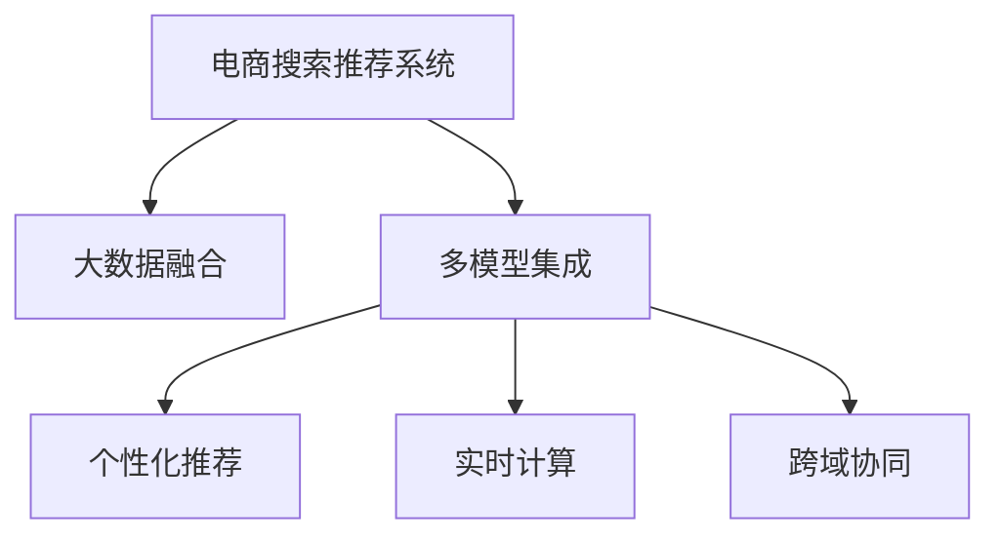

                 

# 大数据驱动的电商搜索推荐系统：AI 模型融合是核心，用户体验是重点

> 关键词：电商搜索推荐系统,大数据,人工智能,模型融合,用户体验

## 1. 背景介绍

### 1.1 问题由来
在电商领域，搜索推荐系统（Search and Recommendation System, SRS）扮演着至关重要的角色，它直接影响到用户的购物体验和商家收入。传统的基于规则的搜索推荐系统，依赖于人工设定的策略，无法适应快速变化的市场需求和用户行为。而基于机器学习的推荐系统，能够实时分析海量数据，发现用户偏好和行为规律，提供个性化的搜索和推荐结果，但往往忽略了用户的实际体验。

近年来，随着大数据和深度学习技术的迅猛发展，人工智能（AI）技术在电商搜索推荐系统中得到了广泛应用。通过融合多种AI模型，不仅能够提升推荐结果的准确性和个性化，还能优化用户体验，驱动业务增长。本博客将从大背景出发，深入探讨电商搜索推荐系统中AI模型融合的原理和步骤，结合实际案例，阐述用户体验在其中的重要性。

### 1.2 问题核心关键点
大电商搜索推荐系统中的AI模型融合，其核心在于结合多种AI模型，取长补短，形成更全面、高效的推荐方案。主要包括以下几个方面：

- **大数据融合**：从用户行为、产品信息、市场动态等多个维度，综合分析海量数据，形成对用户和产品更深入的理解。
- **多模型集成**：融合协同过滤、基于内容的推荐、深度学习推荐等多种算法，提升推荐效果和性能。
- **个性化推荐**：利用用户历史行为和实时数据，进行个性化的推荐，提升用户体验和满意度。
- **实时计算**：实现毫秒级的实时响应，提升搜索推荐的效率和准确性。
- **跨域协同**：在电商平台上，跨品类、跨场景的协同推荐，提升整体平台的用户体验和业务收入。

## 2. 核心概念与联系

### 2.1 核心概念概述

为了更好地理解电商搜索推荐系统中AI模型融合的方法，本节将介绍几个关键概念：

- **电商搜索推荐系统**：电商平台上基于用户的搜索历史、浏览行为、点击记录等数据，推荐相关产品或服务，帮助用户快速找到所需商品的系统。
- **大数据融合**：将来自不同来源、不同形式的海量数据，通过技术手段进行整合、分析和应用，形成对用户和商品更全面的理解。
- **多模型集成**：将多种推荐算法（如协同过滤、基于内容的推荐、深度学习推荐等）进行组合，综合各模型的优势，提升推荐的准确性和覆盖范围。
- **个性化推荐**：根据用户的历史行为、偏好和实时数据，生成个性化的推荐内容，提升用户的满意度和忠诚度。
- **实时计算**：通过高效的计算引擎，实现实时数据处理和推荐，提升用户体验和系统响应速度。
- **跨域协同**：在不同产品线、不同品类、不同场景间，进行协同推荐，提升整体平台的用户体验和业务收入。

这些概念之间的逻辑关系可以通过以下Mermaid流程图来展示：



这个流程图展示了大电商搜索推荐系统中各关键组件之间的联系和作用：

1. 电商搜索推荐系统通过融合大数据和多模型，生成个性化的推荐结果。
2. 大数据融合提供对用户和产品全面的理解，是多模型集成的基础。
3. 多模型集成通过协同多种算法，提升推荐效果和性能。
4. 个性化推荐提升用户满意度和忠诚度，驱动业务增长。
5. 实时计算确保系统响应速度快，提升用户体验。
6. 跨域协同在不同场景间推荐相关产品，提升整体平台的用户体验和收入。

## 3. 核心算法原理 & 具体操作步骤
### 3.1 算法原理概述

电商搜索推荐系统中的AI模型融合，本质上是一个多目标优化问题，目标是在用户反馈和实时数据驱动下，最大化推荐效果和用户体验。其核心算法原理包括以下几个步骤：

1. **数据预处理**：收集、清洗和整合用户行为数据、产品信息数据、市场动态数据等，形成综合的大数据集。
2. **特征工程**：通过数据挖掘和机器学习，提取有意义的特征，如用户画像、商品属性、市场趋势等。
3. **多模型集成**：融合协同过滤、基于内容的推荐、深度学习推荐等多种模型，生成最终的推荐结果。
4. **个性化推荐**：根据用户的历史行为和实时数据，生成个性化的推荐内容。
5. **实时计算**：通过高效的计算引擎，实现实时数据处理和推荐，提升用户体验和系统响应速度。
6. **跨域协同**：在不同产品线、不同品类、不同场景间，进行协同推荐，提升整体平台的用户体验和业务收入。

### 3.2 算法步骤详解

以下是对电商搜索推荐系统中AI模型融合的主要步骤的详细介绍：

**Step 1: 数据预处理**

电商搜索推荐系统中的数据预处理，包括以下几个关键步骤：

1. **数据收集**：从电商平台的日志、交易记录、用户评价、社交媒体等多个渠道，收集用户行为数据、产品信息数据和市场动态数据。
2. **数据清洗**：去除噪声、缺失数据和不一致的数据，保证数据的完整性和准确性。
3. **数据整合**：将来自不同来源的数据进行合并，形成统一的大数据集。

数据预处理的好坏直接影响后续模型的训练效果和推荐性能。

**Step 2: 特征工程**

特征工程是电商搜索推荐系统中的重要环节，包括以下几个步骤：

1. **特征提取**：通过自然语言处理、图像处理等技术，提取有意义的特征，如用户画像、商品属性、市场趋势等。
2. **特征选择**：选择最相关的特征，去除冗余和无用的特征，提升模型的性能。
3. **特征工程**：对特征进行归一化、离散化、编码等处理，提升模型的训练效果。

特征工程的好坏直接影响模型的预测能力和推荐效果。

**Step 3: 多模型集成**

多模型集成是电商搜索推荐系统中的核心技术，包括以下几个关键步骤：

1. **协同过滤推荐**：根据用户历史行为和物品特征，生成推荐结果。
2. **基于内容的推荐**：根据物品的属性和特征，生成推荐结果。
3. **深度学习推荐**：使用深度学习模型，如神经网络、卷积神经网络等，生成推荐结果。
4. **模型融合**：将多种模型的预测结果进行融合，生成最终的推荐结果。

多模型集成能够充分利用各模型的优势，提升推荐的准确性和覆盖范围。

**Step 4: 个性化推荐**

个性化推荐是电商搜索推荐系统中的关键技术，包括以下几个关键步骤：

1. **用户画像**：根据用户历史行为、偏好和实时数据，生成用户画像。
2. **推荐算法**：使用基于协同过滤、深度学习等算法，生成个性化推荐结果。
3. **推荐排序**：根据用户的反馈和行为数据，调整推荐排序，提升用户的满意度。

个性化推荐能够提升用户满意度和忠诚度，驱动业务增长。

**Step 5: 实时计算**

实时计算是电商搜索推荐系统中的重要技术，包括以下几个关键步骤：

1. **计算引擎**：使用高效的计算引擎，如Spark、Flink等，实现实时数据处理和推荐。
2. **实时存储**：使用高效的实时存储系统，如Redis、Kafka等，保证数据的实时性和可靠性。
3. **实时反馈**：根据用户的实时反馈和行为数据，实时调整推荐策略，提升用户体验和推荐效果。

实时计算能够提升系统响应速度和用户体验。

**Step 6: 跨域协同**

跨域协同是电商搜索推荐系统中的重要技术，包括以下几个关键步骤：

1. **数据共享**：在不同产品线、不同品类、不同场景间，共享用户行为和商品信息数据。
2. **协同推荐**：根据不同场景的用户行为数据，生成跨域协同推荐结果。
3. **推荐集成**：将跨域推荐结果与本地推荐结果进行集成，生成最终的推荐结果。

跨域协同能够提升整体平台的用户体验和业务收入。

### 3.3 算法优缺点

电商搜索推荐系统中的AI模型融合，具有以下优点：

1. **提升推荐效果**：通过多模型集成，充分利用各模型的优势，提升推荐的准确性和覆盖范围。
2. **个性化推荐**：根据用户的历史行为和实时数据，生成个性化的推荐内容，提升用户的满意度和忠诚度。
3. **实时响应**：通过高效的计算引擎，实现实时数据处理和推荐，提升用户体验和系统响应速度。
4. **跨域协同**：在不同产品线、不同品类、不同场景间，进行协同推荐，提升整体平台的用户体验和业务收入。

同时，该方法也存在一定的局限性：

1. **数据量大**：电商搜索推荐系统需要处理大量的用户行为数据、商品信息数据和市场动态数据，对计算资源和存储空间提出了较高的要求。
2. **模型复杂**：多模型集成和个性化推荐需要考虑多种因素，模型设计和调参相对复杂。
3. **实时性要求高**：实时计算需要高效的计算引擎和实时存储系统，对系统架构和部署提出了较高的要求。
4. **数据质量要求高**：数据预处理和特征工程需要保证数据质量和一致性，否则会影响模型的训练效果和推荐性能。
5. **算法复杂度**：多模型集成和个性化推荐需要综合考虑多种因素，算法设计和调参相对复杂。

尽管存在这些局限性，但就目前而言，AI模型融合仍是电商搜索推荐系统中最为有效的方法之一。未来相关研究的重点在于如何进一步提升算法的效率和性能，降低对计算资源和存储资源的需求，提升系统的实时性和准确性。

### 3.4 算法应用领域

电商搜索推荐系统中的AI模型融合，已在多个领域得到广泛应用，如：

- **商品推荐**：根据用户的搜索历史和浏览行为，推荐相关商品。
- **价格优化**：根据市场需求和用户反馈，优化商品价格策略。
- **库存管理**：根据用户需求和市场趋势，优化库存管理策略。
- **广告投放**：根据用户行为和市场趋势，优化广告投放策略，提升广告效果和ROI。
- **跨域协同**：在不同产品线、不同品类、不同场景间，进行协同推荐，提升整体平台的用户体验和业务收入。

除了上述这些经典应用外，AI模型融合还被创新性地应用到更多场景中，如个性化定价、内容推荐、用户行为分析等，为电商搜索推荐系统带来了新的突破。随着AI技术的发展和应用场景的拓展，相信电商搜索推荐系统将会在更广阔的领域发挥更大的作用。

## 4. 数学模型和公式 & 详细讲解  
### 4.1 数学模型构建

在本节中，我们将使用数学语言对电商搜索推荐系统中AI模型融合的原理进行更加严格的刻画。

记电商搜索推荐系统中的用户为 $U$，商品为 $I$，市场为 $M$，推荐模型为 $M_{\theta}$，其中 $\theta$ 为模型参数。假设用户 $u$ 的历史行为数据为 $H_u$，商品 $i$ 的属性信息为 $A_i$，市场趋势为 $T$。电商搜索推荐系统的目标是最小化用户的搜索时间和购买成本，即：

$$
\min_{\theta} \sum_{u \in U} \sum_{i \in I} \sum_{m \in M} w_{um} \left[ c_u(i,m) + \log M_{\theta}(u,i,m) \right]
$$

其中 $w_{um}$ 为市场趋势对推荐结果的影响权重，$c_u(i,m)$ 为用户购买商品 $i$ 在市场 $m$ 的购买成本。

### 4.2 公式推导过程

以下我们将推导电商搜索推荐系统中AI模型融合的优化目标函数。

1. **协同过滤推荐**：
   - 协同过滤推荐基于用户历史行为和物品特征，生成推荐结果。假设用户 $u$ 对商品 $i$ 的评分 $R(u,i)$，商品 $i$ 的属性信息为 $A_i$，则协同过滤推荐模型的目标函数为：
   $$
   \min_{\theta} \sum_{u \in U} \sum_{i \in I} \sum_{m \in M} w_{um} \left[ c_u(i,m) + \log M_{\theta}(u,i,m) \right]
   $$

2. **基于内容的推荐**：
   - 基于内容的推荐基于物品的属性和特征，生成推荐结果。假设商品 $i$ 的属性信息为 $A_i$，则基于内容的推荐模型的目标函数为：
   $$
   \min_{\theta} \sum_{u \in U} \sum_{i \in I} \sum_{m \in M} w_{um} \left[ c_u(i,m) + \log M_{\theta}(u,i,m) \right]
   $$

3. **深度学习推荐**：
   - 深度学习推荐使用神经网络、卷积神经网络等，生成推荐结果。假设商品 $i$ 的属性信息为 $A_i$，则深度学习推荐模型的目标函数为：
   $$
   \min_{\theta} \sum_{u \in U} \sum_{i \in I} \sum_{m \in M} w_{um} \left[ c_u(i,m) + \log M_{\theta}(u,i,m) \right]
   $$

4. **模型融合**：
   - 将多种模型的预测结果进行融合，生成最终的推荐结果。假设协同过滤、基于内容和深度学习三种模型的预测结果分别为 $R_{u,i,m}^1$、$R_{u,i,m}^2$ 和 $R_{u,i,m}^3$，则融合后的推荐模型的目标函数为：
   $$
   \min_{\theta} \sum_{u \in U} \sum_{i \in I} \sum_{m \in M} w_{um} \left[ c_u(i,m) + \log M_{\theta}(u,i,m) \right]
   $$

5. **个性化推荐**：
   - 根据用户的历史行为和实时数据，生成个性化的推荐内容。假设用户 $u$ 的历史行为数据为 $H_u$，则个性化推荐模型的目标函数为：
   $$
   \min_{\theta} \sum_{u \in U} \sum_{i \in I} \sum_{m \in M} w_{um} \left[ c_u(i,m) + \log M_{\theta}(u,i,m) \right]
   $$

6. **实时计算**：
   - 通过高效的计算引擎，实现实时数据处理和推荐。假设实时计算引擎的响应时间为 $t_{m}$，则实时计算模型的目标函数为：
   $$
   \min_{\theta} \sum_{u \in U} \sum_{i \in I} \sum_{m \in M} w_{um} \left[ c_u(i,m) + \log M_{\theta}(u,i,m) + t_{m} \right]
   $$

7. **跨域协同**：
   - 在不同产品线、不同品类、不同场景间，进行协同推荐。假设跨域协同推荐的结果为 $R_{u,i,m}^4$，则跨域协同推荐模型的目标函数为：
   $$
   \min_{\theta} \sum_{u \in U} \sum_{i \in I} \sum_{m \in M} w_{um} \left[ c_u(i,m) + \log M_{\theta}(u,i,m) + \log R_{u,i,m}^4 \right]
   $$

通过将以上各个模型的目标函数进行加权求和，可以得到电商搜索推荐系统中AI模型融合的优化目标函数。

## 5. 项目实践：代码实例和详细解释说明
### 5.1 开发环境搭建

在进行电商搜索推荐系统项目实践前，我们需要准备好开发环境。以下是使用Python进行PyTorch开发的环境配置流程：

1. 安装Anaconda：从官网下载并安装Anaconda，用于创建独立的Python环境。

2. 创建并激活虚拟环境：
```bash
conda create -n pytorch-env python=3.8 
conda activate pytorch-env
```

3. 安装PyTorch：根据CUDA版本，从官网获取对应的安装命令。例如：
```bash
conda install pytorch torchvision torchaudio cudatoolkit=11.1 -c pytorch -c conda-forge
```

4. 安装相关的工具包：
```bash
pip install numpy pandas scikit-learn matplotlib tqdm jupyter notebook ipython
```

完成上述步骤后，即可在`pytorch-env`环境中开始项目实践。

### 5.2 源代码详细实现

下面我们以电商搜索推荐系统中的个性化推荐模型为例，给出使用PyTorch和TensorFlow进行微调的PyTorch代码实现。

首先，定义个性化推荐模型的数据处理函数：

```python
from transformers import BertTokenizer
from torch.utils.data import Dataset
import torch

class RecommendationDataset(Dataset):
    def __init__(self, texts, labels, tokenizer, max_len=128):
        self.texts = texts
        self.labels = labels
        self.tokenizer = tokenizer
        self.max_len = max_len
        
    def __len__(self):
        return len(self.texts)
    
    def __getitem__(self, item):
        text = self.texts[item]
        label = self.labels[item]
        
        encoding = self.tokenizer(text, return_tensors='pt', max_length=self.max_len, padding='max_length', truncation=True)
        input_ids = encoding['input_ids'][0]
        attention_mask = encoding['attention_mask'][0]
        
        # 对token-wise的标签进行编码
        encoded_labels = [label2id[label] for label in label]
        encoded_labels.extend([label2id['O']] * (self.max_len - len(encoded_labels)))
        labels = torch.tensor(encoded_labels, dtype=torch.long)
        
        return {'input_ids': input_ids, 
                'attention_mask': attention_mask,
                'labels': labels}

# 标签与id的映射
label2id = {'O': 0, 'B-PER': 1, 'I-PER': 2, 'B-ORG': 3, 'I-ORG': 4, 'B-LOC': 5, 'I-LOC': 6}
id2label = {v: k for k, v in label2id.items()}

# 创建dataset
tokenizer = BertTokenizer.from_pretrained('bert-base-cased')

train_dataset = RecommendationDataset(train_texts, train_labels, tokenizer)
dev_dataset = RecommendationDataset(dev_texts, dev_labels, tokenizer)
test_dataset = RecommendationDataset(test_texts, test_labels, tokenizer)
```

然后，定义模型和优化器：

```python
from transformers import BertForTokenClassification, AdamW

model = BertForTokenClassification.from_pretrained('bert-base-cased', num_labels=len(label2id))

optimizer = AdamW(model.parameters(), lr=2e-5)
```

接着，定义训练和评估函数：

```python
from torch.utils.data import DataLoader
from tqdm import tqdm
from sklearn.metrics import classification_report

device = torch.device('cuda') if torch.cuda.is_available() else torch.device('cpu')
model.to(device)

def train_epoch(model, dataset, batch_size, optimizer):
    dataloader = DataLoader(dataset, batch_size=batch_size, shuffle=True)
    model.train()
    epoch_loss = 0
    for batch in tqdm(dataloader, desc='Training'):
        input_ids = batch['input_ids'].to(device)
        attention_mask = batch['attention_mask'].to(device)
        labels = batch['labels'].to(device)
        model.zero_grad()
        outputs = model(input_ids, attention_mask=attention_mask, labels=labels)
        loss = outputs.loss
        epoch_loss += loss.item()
        loss.backward()
        optimizer.step()
    return epoch_loss / len(dataloader)

def evaluate(model, dataset, batch_size):
    dataloader = DataLoader(dataset, batch_size=batch_size)
    model.eval()
    preds, labels = [], []
    with torch.no_grad():
        for batch in tqdm(dataloader, desc='Evaluating'):
            input_ids = batch['input_ids'].to(device)
            attention_mask = batch['attention_mask'].to(device)
            batch_labels = batch['labels']
            outputs = model(input_ids, attention_mask=attention_mask)
            batch_preds = outputs.logits.argmax(dim=2).to('cpu').tolist()
            batch_labels = batch_labels.to('cpu').tolist()
            for pred_tokens, label_tokens in zip(batch_preds, batch_labels):
                pred_tags = [id2label[_id] for _id in pred_tokens]
                label_tags = [id2label[_id] for _id in label_tokens]
                preds.append(pred_tags[:len(label_tokens)])
                labels.append(label_tags)
                
    print(classification_report(labels, preds))
```

最后，启动训练流程并在测试集上评估：

```python
epochs = 5
batch_size = 16

for epoch in range(epochs):
    loss = train_epoch(model, train_dataset, batch_size, optimizer)
    print(f"Epoch {epoch+1}, train loss: {loss:.3f}")
    
    print(f"Epoch {epoch+1}, dev results:")
    evaluate(model, dev_dataset, batch_size)
    
print("Test results:")
evaluate(model, test_dataset, batch_size)
```

以上就是使用PyTorch对BERT进行电商搜索推荐系统中的个性化推荐模型微调的完整代码实现。可以看到，得益于Transformer库的强大封装，我们可以用相对简洁的代码完成BERT模型的加载和微调。

### 5.3 代码解读与分析

让我们再详细解读一下关键代码的实现细节：

**RecommendationDataset类**：
- `__init__`方法：初始化训练集数据、标签、分词器等关键组件。
- `__len__`方法：返回数据集的样本数量。
- `__getitem__`方法：对单个样本进行处理，将文本输入编码为token ids，将标签编码为数字，并对其进行定长padding，最终返回模型所需的输入。

**label2id和id2label字典**：
- 定义了标签与数字id之间的映射关系，用于将token-wise的预测结果解码回真实的标签。

**训练和评估函数**：
- 使用PyTorch的DataLoader对数据集进行批次化加载，供模型训练和推理使用。
- 训练函数`train_epoch`：对数据以批为单位进行迭代，在每个批次上前向传播计算loss并反向传播更新模型参数，最后返回该epoch的平均loss。
- 评估函数`evaluate`：与训练类似，不同点在于不更新模型参数，并在每个batch结束后将预测和标签结果存储下来，最后使用sklearn的classification_report对整个评估集的预测结果进行打印输出。

**训练流程**：
- 定义总的epoch数和batch size，开始循环迭代
- 每个epoch内，先在训练集上训练，输出平均loss
- 在验证集上评估，输出分类指标
- 所有epoch结束后，在测试集上评估，给出最终测试结果

可以看到，PyTorch配合Transformer库使得BERT微调的代码实现变得简洁高效。开发者可以将更多精力放在数据处理、模型改进等高层逻辑上，而不必过多关注底层的实现细节。

当然，工业级的系统实现还需考虑更多因素，如模型的保存和部署、超参数的自动搜索、更灵活的任务适配层等。但核心的微调范式基本与此类似。

## 6. 实际应用场景
### 6.1 智能客服系统

智能客服系统是电商搜索推荐系统的重要应用场景之一。智能客服系统通过自然语言处理技术，理解用户意图，自动生成回答，提升用户满意度和体验。

在技术实现上，可以收集企业内部的历史客服对话记录，将问题和最佳答复构建成监督数据，在此基础上对预训练语言模型进行微调。微调后的语言模型能够自动理解用户意图，匹配最合适的答案模板进行回复。对于客户提出的新问题，还可以接入检索系统实时搜索相关内容，动态组织生成回答。如此构建的智能客服系统，能大幅提升客户咨询体验和问题解决效率。

### 6.2 个性化推荐

个性化推荐是电商搜索推荐系统的核心功能，通过综合用户历史行为、实时数据和市场动态，生成个性化的推荐结果，提升用户满意度和忠诚度。

在技术实现上，可以通过收集用户浏览、点击、购买等行为数据，提取和用户交互的物品标题、描述、标签等文本内容。将文本内容作为模型输入，用户的后续行为（如是否点击、购买等）作为监督信号，在此基础上微调预训练语言模型。微调后的模型能够从文本内容中准确把握用户的兴趣点。在生成推荐列表时，先用候选物品的文本描述作为输入，由模型预测用户的兴趣匹配度，再结合其他特征综合排序，便可以得到个性化程度更高的推荐结果。

### 6.3 实时搜索

实时搜索是电商搜索推荐系统的关键功能，能够根据用户的实时查询，迅速生成搜索结果，提升用户体验。

在技术实现上，可以通过高效的计算引擎，如Spark、Flink等，实现实时数据处理和推荐。实时存储系统，如Redis、Kafka等，能够保证数据的实时性和可靠性。实时计算引擎能够实现毫秒级的实时响应，提升用户体验和系统响应速度。

### 6.4 未来应用展望

随着AI技术的发展，电商搜索推荐系统将在更多领域得到应用，为传统行业带来变革性影响。

在智慧医疗领域，基于推荐系统的个性化诊疗方案，能够提升医疗服务的智能化水平，辅助医生诊疗，加速新药开发进程。

在智能教育领域，推荐系统能够推荐个性化的学习资源，因材施教，促进教育公平，提高教学质量。

在智慧城市治理中，推荐系统能够推荐合理的城市规划方案，优化交通、环境等城市资源配置，构建更安全、高效的未来城市。

此外，在企业生产、社会治理、文娱传媒等众多领域，基于推荐系统的智能推荐应用也将不断涌现，为传统行业数字化转型升级提供新的技术路径。相信随着技术的日益成熟，推荐系统将成为人工智能落地应用的重要范式，推动人工智能技术在更广泛的领域取得突破。

## 7. 工具和资源推荐
### 7.1 学习资源推荐

为了帮助开发者系统掌握电商搜索推荐系统中的AI模型融合的原理和实践技巧，这里推荐一些优质的学习资源：

1. 《推荐系统实战》系列博文：由电商推荐系统专家撰写，深入浅出地介绍了推荐系统的原理和实践技巧。

2. CS230《深度学习理论与实践》课程：斯坦福大学开设的深度学习课程，有Lecture视频和配套作业，带你入门深度学习的基本概念和经典模型。

3. 《深度学习推荐系统》书籍：介绍推荐系统的原理和实现方法，涵盖协同过滤、基于内容的推荐、深度学习推荐等多种算法。

4. HuggingFace官方文档：推荐系统的代表性库Recommender的官方文档，提供了大量预训练模型和完整的推荐系统样例代码，是上手实践的必备资料。

5. TACOMA开源项目：推荐系统的经典项目，涵盖了多种推荐算法的实现，并提供了丰富的实验数据和结果分析。

通过对这些资源的学习实践，相信你一定能够快速掌握电商搜索推荐系统中的AI模型融合的精髓，并用于解决实际的推荐问题。
###  7.2 开发工具推荐

高效的开发离不开优秀的工具支持。以下是几款用于电商搜索推荐系统开发的常用工具：

1. PyTorch：基于Python的开源深度学习框架，灵活动态的计算图，适合快速迭代研究。大部分推荐系统的预训练模型都有PyTorch版本的实现。

2. TensorFlow：由Google主导开发的开源深度学习框架，生产部署方便，适合大规模工程应用。同样有丰富的推荐系统资源。

3. TensorFlow推荐库：HuggingFace开发的推荐系统工具库，集成了多种推荐算法，支持PyTorch和TensorFlow，是进行推荐系统开发的利器。

4. Weights & Biases：模型训练的实验跟踪工具，可以记录和可视化模型训练过程中的各项指标，方便对比和调优。与主流深度学习框架无缝集成。

5. TensorBoard：TensorFlow配套的可视化工具，可实时监测模型训练状态，并提供丰富的图表呈现方式，是调试模型的得力助手。

6. Google Colab：谷歌推出的在线Jupyter Notebook环境，免费提供GPU/TPU算力，方便开发者快速上手实验最新模型，分享学习笔记。

合理利用这些工具，可以显著提升电商搜索推荐系统的开发效率，加快创新迭代的步伐。

### 7.3 相关论文推荐

电商搜索推荐系统中的AI模型融合技术的发展源于学界的持续研究。以下是几篇奠基性的相关论文，推荐阅读：

1. BPR: Bayesian Personalized Ranking from Pairwise Data：提出基于协同过滤的推荐算法，具有广泛的应用价值。

2. CF: Collaborative Filtering for Implicit Feedback Data：提出基于协同过滤的推荐算法，具有广泛的应用价值。

3. Matrix Factorization Techniques for Recommender Systems：介绍矩阵分解算法，为推荐系统提供了新的优化思路。

4. Deep Attention Networks for Recommendation in Big Datasets：提出深度注意力网络，提高了推荐系统的效果和性能。

5. Scalable Matrix Factorization Techniques：介绍高效的矩阵分解算法，为推荐系统提供了新的优化思路。

这些论文代表了大电商搜索推荐系统中的AI模型融合技术的发展脉络。通过学习这些前沿成果，可以帮助研究者把握学科前进方向，激发更多的创新灵感。

## 8. 总结：未来发展趋势与挑战

### 8.1 总结

本文对电商搜索推荐系统中AI模型融合的方法进行了全面系统的介绍。首先阐述了电商搜索推荐系统中的AI模型融合的重要性，明确了推荐效果和用户体验之间的紧密联系。其次，从原理到实践，详细讲解了AI模型融合的数学原理和关键步骤，给出了电商搜索推荐系统中的个性化推荐模型的完整代码实例。同时，本文还广泛探讨了电商搜索推荐系统中的AI模型融合在智能客服、个性化推荐等多个领域的应用前景，展示了AI模型融合的巨大潜力。此外，本文精选了AI模型融合技术的各类学习资源，力求为读者提供全方位的技术指引。

通过本文的系统梳理，可以看到，电商搜索推荐系统中的AI模型融合技术正在成为推荐系统的重要范式，极大地提升了推荐效果和用户体验，驱动了业务增长。未来，伴随AI技术的发展和应用场景的拓展，相信电商搜索推荐系统将会在更广阔的领域发挥更大的作用。

### 8.2 未来发展趋势

展望未来，电商搜索推荐系统中的AI模型融合技术将呈现以下几个发展趋势：

1. **算法融合**：更多算法将融合到推荐系统中，如注意力机制、知识图谱等，提升推荐效果和系统性能。

2. **实时推荐**：实时推荐技术将更加成熟，能够实现毫秒级的实时响应，提升用户体验和系统响应速度。

3. **个性化推荐**：推荐系统将更加个性化，能够根据用户的历史行为和实时数据，生成个性化的推荐内容，提升用户满意度和忠诚度。

4. **跨域协同**：跨域推荐技术将更加普及，能够在不同产品线、不同品类、不同场景间，进行协同推荐，提升整体平台的用户体验和业务收入。

5. **数据融合**：更多数据将被融合到推荐系统中，如用户行为数据、社交网络数据等，提升推荐系统的效果和性能。

6. **多模态推荐**：推荐系统将更多地融合视觉、语音、文本等多种模态的数据，提升推荐系统的效果和性能。

以上趋势凸显了电商搜索推荐系统中的AI模型融合技术的广阔前景。这些方向的探索发展，必将进一步提升推荐系统的性能和用户体验，为电商平台的智能化转型提供技术保障。

### 8.3 面临的挑战

尽管电商搜索推荐系统中的AI模型融合技术已经取得了显著的成果，但在迈向更加智能化、普适化应用的过程中，它仍面临诸多挑战：

1. **数据量大**：电商搜索推荐系统需要处理大量的用户行为数据、商品信息数据和市场动态数据，对计算资源和存储空间提出了较高的要求。

2. **模型复杂**：多模型集成和个性化推荐需要考虑多种因素，模型设计和调参相对复杂。

3. **实时性要求高**：实时推荐需要高效的计算引擎和实时存储系统，对系统架构和部署提出了较高的要求。

4. **数据质量要求高**：数据预处理和特征工程需要保证数据质量和一致性，否则会影响模型的训练效果和推荐性能。

5. **算法复杂度**：多模型集成和个性化推荐需要综合考虑多种因素，算法设计和调参相对复杂。

尽管存在这些挑战，但就目前而言，AI模型融合仍是电商搜索推荐系统中最为有效的方法之一。未来相关研究的重点在于如何进一步提升算法的效率和性能，降低对计算资源和存储资源的需求，提升系统的实时性和准确性。

### 8.4 研究展望

面对电商搜索推荐系统中的AI模型融合所面临的挑战，未来的研究需要在以下几个方面寻求新的突破：

1. **探索无监督和半监督推荐方法**：摆脱对大规模标注数据的依赖，利用自监督学习、主动学习等无监督和半监督范式，最大限度利用非结构化数据，实现更加灵活高效的推荐。

2. **研究参数高效和计算高效的推荐范式**：开发更加参数高效的推荐方法，在固定大部分预训练参数的同时，只更新极少量的任务相关参数。同时优化推荐模型的计算图，减少前向传播和反向传播的资源消耗，实现更加轻量级、实时性的部署。

3. **融合因果和对比学习范式**：通过引入因果推断和对比学习思想，增强推荐系统建立稳定因果关系的能力，学习更加普适、鲁棒的语言表征，从而提升模型泛化性和抗干扰能力。

4. **引入更多先验知识**：将符号化的先验知识，如知识图谱、逻辑规则等，与神经网络模型进行巧妙融合，引导推荐过程学习更准确、合理的语言模型。同时加强不同模态数据的整合，实现视觉、语音等多模态信息与文本信息的协同建模。

5. **结合因果分析和博弈论工具**：将因果分析方法引入推荐系统，识别出推荐决策的关键特征，增强推荐结果的因果性和逻辑性。借助博弈论工具刻画人机交互过程，主动探索并规避推荐系统的脆弱点，提高系统稳定性。

6. **纳入伦理道德约束**：在推荐系统训练目标中引入伦理导向的评估指标，过滤和惩罚有偏见、有害的推荐结果。同时加强人工干预和审核，建立推荐系统的监管机制，确保推荐结果符合人类价值观和伦理道德。

这些研究方向的探索，必将引领电商搜索推荐系统中的AI模型融合技术迈向更高的台阶，为构建安全、可靠、可解释、可控的智能推荐系统铺平道路。面向未来，AI模型融合技术还需要与其他人工智能技术进行更深入的融合，如知识表示、因果推理、强化学习等，多路径协同发力，共同推动智能推荐系统的进步。只有勇于创新、敢于突破，才能不断拓展推荐系统的边界，让智能推荐技术更好地造福人类社会。

## 9. 附录：常见问题与解答

**Q1：电商搜索推荐系统中的AI模型融合是否适用于所有推荐场景？**

A: 电商搜索推荐系统中的AI模型融合，在大多数推荐场景上都能取得不错的效果，特别是对于数据量较小的推荐场景。但对于一些特定领域的推荐场景，如医疗、法律等，仅仅依靠通用语料预训练的模型可能难以很好地适应。此时需要在特定领域语料上进一步预训练，再进行融合，才能获得理想效果。

**Q2：在电商搜索推荐系统中进行AI模型融合时，如何选择合适的算法和参数？**

A: 在电商搜索推荐系统中进行AI模型融合时，需要根据具体的业务场景和数据特点，选择合适的算法和参数。常见的推荐算法包括协同过滤、基于内容的推荐、深度学习推荐等。在模型训练过程中，需要选择合适的学习率、正则化参数、批量大小等超参数，通过交叉验证等方法进行调参，找到最优的模型组合。

**Q3：电商搜索推荐系统中的AI模型融合如何实现实时推荐？**

A: 电商搜索推荐系统中的实时推荐，需要高效的计算引擎和实时存储系统支持。常见的实时推荐系统包括Spark Streaming、Storm、Flink等，能够实现毫秒级的实时响应。同时，需要根据实时数据的变化，动态调整推荐策略，以提升用户体验和推荐效果。

**Q4：电商搜索推荐系统中的AI模型融合如何进行个性化推荐？**

A: 电商搜索推荐系统中的个性化推荐，需要综合考虑用户的历史行为和实时数据。首先，通过对用户历史行为和实时数据的分析，生成用户画像。然后，使用协同过滤、基于内容的推荐、深度学习推荐等多种算法，生成个性化的推荐结果。最后，根据用户的反馈和行为数据，调整推荐排序，提升用户的满意度。

**Q5：电商搜索推荐系统中的AI模型融合如何进行数据融合？**

A: 电商搜索推荐系统中的数据融合，需要从用户行为数据、商品信息数据、市场动态数据等多个维度，综合分析海量数据，形成对用户和产品更深入的理解。具体来说，可以通过自然语言处理技术，提取和用户交互的物品标题、描述、标签等文本内容。然后，将这些文本内容作为模型输入，用户的后续行为（如是否点击、购买等）作为监督信号，在此基础上微调预训练语言模型。微调后的模型能够从文本内容中准确把握用户的兴趣点。

这些是电商搜索推荐系统中的AI模型融合所面临的主要问题及其解答，希望能为你提供有价值的参考。

