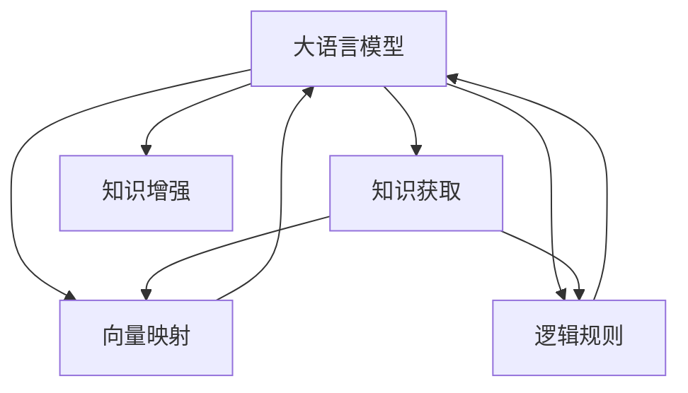

                 

# 大模型: 知识与推理的结合

大语言模型（Large Language Models, LLMs）通过在海量文本数据上的预训练，已经展示出强大的语言理解与生成能力。结合知识与推理，大模型在多个自然语言处理（NLP）任务中达到了最先进的性能。本文将深入探讨大语言模型知识推理的原理与实践，分析其在NLP领域的应用，并提供项目实践的代码实例。

## 1. 背景介绍

### 1.1 问题由来
大模型在预训练阶段通过自监督学习任务（如语言模型、掩码语言模型）学习到了丰富的语言知识，但这些知识往往是无序和隐式的，难以直接应用于特定任务。结合知识与推理，可以将外界先验知识嵌入模型，从而提升模型在特定领域的表现。

### 1.2 问题核心关键点
知识与推理的结合，本质上是通过在模型中引入先验知识，优化模型对特定任务的推理能力。该过程可以概括为以下步骤：
1. **知识获取**：从知识库或专家系统中提取领域知识。
2. **知识嵌入**：将知识转化为模型可理解的形式，嵌入模型参数。
3. **知识增强**：在模型微调或推理过程中，利用知识指导模型的推理和预测。

这些步骤可以借助各种技术手段实现，如向量映射、知识图谱嵌入、逻辑规则嵌入等。

### 1.3 问题研究意义
结合知识与推理，有助于提升模型的可解释性、泛化能力和实用性，使其在实际应用中更加可靠。该方法在医疗、金融、法律等高风险领域尤为重要，可以帮助系统做出更准确、可信的决策。

## 2. 核心概念与联系

### 2.1 核心概念概述

- **大语言模型 (Large Language Models, LLMs)**：指经过预训练的语言模型，如GPT-3、BERT等，具备强大的语言理解和生成能力。

- **知识图谱 (Knowledge Graphs,KGs)**：用于描述实体、属性和关系的结构化知识库，如DBpedia、Wikidata等。

- **向量映射 (Vector Embeddings)**：将知识库中的实体、属性等转换为向量形式，嵌入模型参数空间。

- **逻辑规则 (Logic Rules)**：用于约束和指导模型推理的符号化知识，如Prolog、OWL等。

- **知识增强 (Knowledge Augmentation)**：在模型微调或推理阶段，利用知识优化模型推理结果。

这些概念通过以下Mermaid流程图连接起来：



此图展示了知识获取后的处理过程，将知识转化为向量或规则，并进一步应用于模型中。

## 3. 核心算法原理 & 具体操作步骤

### 3.1 算法原理概述

结合知识与推理的过程，可以概括为以下几步：

1. **知识图谱嵌入**：将知识图谱中的实体、关系、属性等转换为向量形式，嵌入模型参数。
2. **逻辑规则嵌入**：将逻辑规则转换为符号化表达，嵌入模型参数。
3. **知识增强推理**：在模型推理过程中，利用嵌入的知识进行推理和预测。

数学上，知识图谱嵌入通常通过TransE等关系图谱嵌入模型实现。逻辑规则嵌入则通过逻辑规则与模型参数的联合优化实现。

### 3.2 算法步骤详解

**步骤1: 知识获取**

- 从知识库或专家系统中提取知识。对于医疗领域，可以通过医学知识库如PubMed、UMLS等获取疾病、症状、药物等信息。

**步骤2: 知识映射与嵌入**

- 将知识转化为向量形式。对于知识图谱，使用TransE模型生成实体的低维表示。对于逻辑规则，使用符号化表示嵌入模型参数。

**步骤3: 知识增强推理**

- 在模型推理过程中，利用嵌入的知识进行推理和预测。对于自然语言推理任务，可以使用逻辑规则进行额外的约束。

**步骤4: 微调模型**

- 在知识增强的模型上，使用下游任务数据进行微调。例如，在医疗问答中，可以利用医学知识提升模型在疾病诊断、症状分析等方面的性能。

### 3.3 算法优缺点

**优点：**
1. **增强推理能力**：结合知识与推理，可以显著提升模型在特定领域的表现。
2. **提升可解释性**：嵌入的知识和规则，可以增强模型的决策过程的可解释性。
3. **减少数据需求**：在少量标注数据上，知识可以提供先验信息，减少对数据的依赖。

**缺点：**
1. **知识获取成本高**：高质量的知识获取往往需要专业知识和手工标注，成本较高。
2. **知识泛化能力有限**：特定领域知识可能难以泛化到其他领域。
3. **知识注入复杂**：不同领域的知识结构差异大，嵌入过程复杂。

### 3.4 算法应用领域

知识与推理的结合，在医疗、金融、法律等多个领域有广泛的应用：

- **医疗领域**：结合医学知识库，提升医疗问答、疾病诊断、药物推荐等应用。
- **金融领域**：利用金融知识库，提升金融舆情分析、风险评估、欺诈检测等应用。
- **法律领域**：结合法律规则和案例库，提升法律咨询、合同审查、法务机器人等应用。

## 4. 数学模型和公式 & 详细讲解 & 举例说明

### 4.1 数学模型构建

大语言模型通常采用Transformer结构，由编码器-解码器构成。知识图谱嵌入和逻辑规则嵌入可以看作是在编码器或解码器中额外引入的模块。

**知识图谱嵌入**：对于知识图谱中的实体 $e$，通过TransE模型将其转换为向量 $v_e$。

$$
v_e = \text{TransE}(e)
$$

**逻辑规则嵌入**：将逻辑规则 $R$ 转换为符号化表达式 $r$，嵌入模型参数。

$$
\text{Embed}(R) = \text{Embed}(r)
$$

**知识增强推理**：在自然语言推理任务中，利用逻辑规则 $R$ 约束模型输出 $o$。

$$
o = f(M, o', R)
$$

其中，$M$ 为预训练模型，$o'$ 为模型对输入的原始输出，$R$ 为逻辑规则。

### 4.2 公式推导过程

以医疗领域为例，假设知识图谱中有一个疾病-症状三元组 $(d, s, c)$，其中 $d$ 为疾病，$s$ 为症状，$c$ 为确诊条件。使用TransE模型将 $d$ 和 $s$ 嵌入为向量 $v_d$ 和 $v_s$，结合条件 $c$ 进行推理：

$$
o = \text{Attention}(\{v_d, v_s, c\})
$$

其中，$\text{Attention}$ 为自注意力机制，用于计算疾病 $d$ 和症状 $s$ 的关联程度。

### 4.3 案例分析与讲解

以医疗问答系统为例，利用医学知识库提升疾病诊断能力。假设系统输入为病人描述 $p$，输出为可能的疾病 $d$。系统在知识库中检索出与 $p$ 相关的症状 $s$，利用知识图谱嵌入和逻辑规则推理，判断 $d$ 是否符合 $s$ 的条件。

## 5. 项目实践：代码实例和详细解释说明

### 5.1 开发环境搭建

- **安装Python**：在Linux或Windows上安装Python 3.x。
- **安装PyTorch**：
  ```
  pip install torch torchvision torchaudio
  ```
- **安装Transformers库**：
  ```
  pip install transformers
  ```

### 5.2 源代码详细实现

以下是一个医疗问答系统的代码实现示例：

```python
from transformers import BertForQuestionAnswering
from transformers import BertTokenizer
from torch.utils.data import Dataset, DataLoader
from tqdm import tqdm

class MedicalDataset(Dataset):
    def __init__(self, texts, answers, tokenizer):
        self.texts = texts
        self.answers = answers
        self.tokenizer = tokenizer
        
    def __len__(self):
        return len(self.texts)
    
    def __getitem__(self, idx):
        text = self.texts[idx]
        answer = self.answers[idx]
        
        encoding = self.tokenizer(text, return_tensors='pt')
        input_ids = encoding['input_ids']
        attention_mask = encoding['attention_mask']
        start_token = self.tokenizer.cls_token_id
        end_token = self.tokenizer.sep_token_id
        
        return {
            'input_ids': input_ids,
            'attention_mask': attention_mask,
            'start_token': start_token,
            'end_token': end_token,
            'answer': answer
        }

# 初始化Bert模型和tokenizer
model = BertForQuestionAnswering.from_pretrained('bert-base-uncased')
tokenizer = BertTokenizer.from_pretrained('bert-base-uncased')

# 加载数据
dataset = MedicalDataset(texts, answers, tokenizer)

# 构建数据加载器
dataloader = DataLoader(dataset, batch_size=32, shuffle=True)

# 训练模型
device = torch.device('cuda') if torch.cuda.is_available() else torch.device('cpu')
model.to(device)
optimizer = torch.optim.Adam(model.parameters(), lr=2e-5)

for epoch in range(5):
    model.train()
    total_loss = 0
    for batch in tqdm(dataloader):
        input_ids = batch['input_ids'].to(device)
        attention_mask = batch['attention_mask'].to(device)
        start_token = batch['start_token'].to(device)
        end_token = batch['end_token'].to(device)
        answer = batch['answer'].to(device)
        
        outputs = model(input_ids, attention_mask=attention_mask, start_positions=start_token, end_positions=end_token)
        loss = outputs.loss
        total_loss += loss.item()
        loss.backward()
        optimizer.step()
    
    print(f"Epoch {epoch+1}, loss: {total_loss / len(dataloader)}")
```

### 5.3 代码解读与分析

- **Dataset类**：定义了医疗问答数据集，包含文本描述和答案。
- **模型初始化**：使用BertForQuestionAnswering模型，并进行必要的超参数设置。
- **训练过程**：在训练过程中，使用Adam优化器进行梯度更新，并在每个epoch后输出损失。

### 5.4 运行结果展示

训练完成后，可以评估模型在测试集上的表现，如F1分数：

```python
from transformers import evaluate, metrics

# 在测试集上评估模型
test_dataset = MedicalDataset(test_texts, test_answers, tokenizer)
test_dataloader = DataLoader(test_dataset, batch_size=32, shuffle=False)

model.eval()
eval_outputs = evaluate(model, test_dataloader, max_seq_length=128, do_lower_case=True)
print(f"F1 score: {eval_outputs[0]:.4f}")
```

## 6. 实际应用场景

### 6.1 医疗问答系统

医疗问答系统利用大模型和知识图谱，可以快速响应病人的咨询，提供初步诊断和建议。该系统结合医学知识库，可以提升疾病诊断的准确性，减轻医生负担。

### 6.2 金融舆情分析

金融舆情分析结合金融知识库，监测市场舆情，预测金融风险。该系统可以实时分析新闻、评论等信息，预测股票涨跌，为投资者提供决策参考。

### 6.3 法律咨询服务

法律咨询服务结合法律规则库，提升合同审查、法律咨询等应用的效率和准确性。该系统可以自动审查合同条款，分析法律风险，提供法律建议。

### 6.4 未来应用展望

未来，结合知识与推理的大模型将应用于更多领域：

- **智能制造**：结合工业知识库，提升生产过程优化和故障诊断能力。
- **智能农业**：结合农业知识库，提升农作物监测和病虫害预测能力。
- **智能交通**：结合交通规则和实时数据，提升智能导航和交通管理能力。

## 7. 工具和资源推荐

### 7.1 学习资源推荐

- **《Deep Learning for Natural Language Processing》**：斯坦福大学开设的NLP课程，涵盖了语言模型、序列标注、问答系统等内容，是NLP入门的经典教材。
- **《Knowledge Graphs: From Theory to Practice》**：介绍了知识图谱的基本概念和应用，帮助理解知识图谱嵌入技术。
- **《Reasoning and Uncertainty》**：介绍了逻辑推理和不确定性处理的方法，为逻辑规则嵌入提供了理论基础。

### 7.2 开发工具推荐

- **PyTorch**：灵活的深度学习框架，支持动态图和静态图两种计算模式。
- **Transformers**：NLP任务常用的模型库，集成了多种预训练模型和工具。
- **SPARQL Query Tool**：用于查询知识图谱的工具，方便进行知识检索和推理。
- **Reasoner Tool**：用于推理逻辑规则的工具，方便进行知识约束和验证。

### 7.3 相关论文推荐

- **Knowledge Graph Embedding**：介绍了知识图谱嵌入的基本原理和技术，是知识图谱嵌入领域的经典论文。
- **Logic Programming with Neural Networks**：介绍了逻辑规则与神经网络的结合，为逻辑规则嵌入提供了思路和方法。
- **A Survey on Deep Learning for Question Answering**：总结了深度学习在问答系统中的应用，为医疗问答系统提供了参考。

## 8. 总结：未来发展趋势与挑战

### 8.1 研究成果总结

结合知识与推理的大语言模型，通过将先验知识嵌入模型参数，显著提升了模型在特定领域的表现。该方法在医疗、金融、法律等多个领域得到了广泛应用，取得了显著成效。

### 8.2 未来发展趋势

未来，结合知识与推理的大模型将呈现以下发展趋势：

1. **知识图谱应用普及**：知识图谱嵌入技术将更加成熟，应用于更多领域。
2. **逻辑规则嵌入深化**：逻辑规则嵌入将更加复杂，应用于更复杂的推理任务。
3. **多模态融合**：结合视觉、语音等多模态数据，提升知识推理的全面性。
4. **模型可解释性提升**：模型输出的可解释性将更加增强，帮助用户理解推理过程。

### 8.3 面临的挑战

尽管结合知识与推理的大模型在多个领域取得了显著成效，但仍面临以下挑战：

1. **知识获取成本高**：高质量知识获取需要专业知识和手工标注，成本较高。
2. **知识泛化能力有限**：特定领域知识可能难以泛化到其他领域。
3. **知识注入复杂**：不同领域的知识结构差异大，嵌入过程复杂。

### 8.4 研究展望

未来，结合知识与推理的大模型需要在以下几个方面寻求突破：

1. **知识获取自动化**：利用自动化手段，降低知识获取成本。
2. **知识表示统一**：探索统一的知识表示方法，提高知识泛化能力。
3. **知识注入简化**：简化知识注入过程，提高模型的灵活性。
4. **跨模态融合**：将多模态数据融合，提升知识推理的全面性。

这些研究方向将推动结合知识与推理的大模型走向更加智能化、普适化的应用，为人类认知智能的进化提供新的动力。

## 9. 附录：常见问题与解答

**Q1: 大语言模型结合知识与推理的原理是什么？**

A: 结合知识与推理，将知识图谱和逻辑规则嵌入模型参数，通过推理过程优化模型预测。具体步骤如下：知识图谱嵌入、逻辑规则嵌入、知识增强推理。

**Q2: 大语言模型结合知识与推理的优点和缺点是什么？**

A: 优点：提升推理能力、增强可解释性、减少数据需求。缺点：知识获取成本高、知识泛化能力有限、知识注入复杂。

**Q3: 大语言模型结合知识与推理的应用场景有哪些？**

A: 医疗问答系统、金融舆情分析、法律咨询服务、智能制造、智能农业、智能交通等。

**Q4: 大语言模型结合知识与推理的实践有哪些难点？**

A: 知识获取成本高、知识泛化能力有限、知识注入复杂。

**Q5: 大语言模型结合知识与推理的未来展望是什么？**

A: 知识图谱应用普及、逻辑规则嵌入深化、多模态融合、模型可解释性提升。

---

作者：禅与计算机程序设计艺术 / Zen and the Art of Computer Programming

