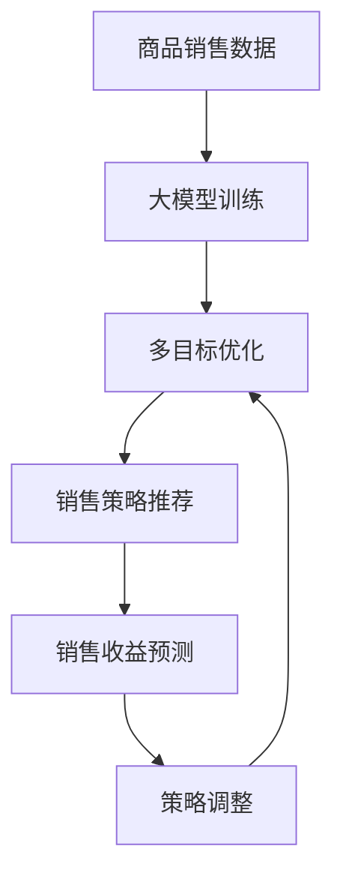

                 

# 大模型在商品捆绑销售策略中的应用

## 1. 背景介绍

### 1.1 问题由来

在现代商业环境中，商品捆绑销售策略已成为商家的重要营销手段。通过将多种商品组合成套装，商家不仅能提高整体销售额，还能增强消费者粘性，提升品牌价值。然而，如何制定合理的捆绑销售方案，最大化销售收益，同时避免不必要的成本和风险，一直是一个复杂的决策问题。传统的商品捆绑销售策略往往依赖经验和直觉，难以量化和优化。

### 1.2 问题核心关键点

商品捆绑销售策略的核心在于如何评估不同商品的组合搭配，以及如何定价，才能使得整体收益最大化。从技术角度看，这本质上是一个多目标优化问题，需要考虑商品的销售量、利润率、相关性等多个因素。

在传统的优化方法中，多目标优化问题往往需要复杂的数学建模和计算，耗时耗力且容易陷入局部最优。而大模型在处理复杂多变量问题方面表现出显著优势，通过大数据训练得到的语言模型，能够自动识别模式，发现规律，提供高效的优化解决方案。

## 2. 核心概念与联系

### 2.1 核心概念概述

- **商品捆绑销售（Bundling）**：指商家将多种商品组合成一个套餐进行销售的策略，旨在通过捆绑效应，增加整体销售收益。

- **多目标优化（Multi-Objective Optimization, MOO）**：指在多个目标之间进行权衡，寻找最优解的过程。商品捆绑销售策略本质上是一个多目标优化问题。

- **大模型（Large Model）**：指通过大量数据训练得到的复杂神经网络模型，如深度学习模型、Transformer模型等，具有强大的数据处理和模式识别能力。

- **强化学习（Reinforcement Learning, RL）**：一种通过试错来学习最优策略的机器学习方法，适用于动态环境中的策略优化。

- **深度学习（Deep Learning, DL）**：一种基于多层神经网络，通过梯度下降算法训练得到模型参数的技术，用于处理高维数据和复杂模式。

### 2.2 核心概念原理和架构的 Mermaid 流程图



这个流程图展示了大模型在商品捆绑销售策略中的应用流程：

1. 从商品销售数据中提取特征，用于训练大模型。
2. 利用大模型进行多目标优化，寻找最优的捆绑销售策略。
3. 根据优化结果，生成推荐销售策略。
4. 对推荐的策略进行收益预测。
5. 根据预测结果调整策略，并反馈到优化模型中。

## 3. 核心算法原理 & 具体操作步骤

### 3.1 算法原理概述

大模型在商品捆绑销售策略中的应用，主要基于多目标优化和强化学习的思想。首先，通过大模型训练得到每个商品的销售趋势和搭配规律，形成特征表示。然后，利用多目标优化算法，找到最大化整体收益的组合方案。最后，通过强化学习，实时调整策略，提高策略的适应性和优化性。

### 3.2 算法步骤详解

#### 3.2.1 数据预处理

- **数据集准备**：收集不同商品的历史销售数据，包括价格、销售量、促销活动等信息。同时，收集商品的描述和标签，用于训练大模型的特征提取能力。
- **数据清洗与特征提取**：对销售数据进行清洗和标准化处理，提取商品属性和销售特征，形成特征向量。

#### 3.2.2 大模型训练

- **模型选择**：选择预训练语言模型，如BERT、GPT等，作为特征提取器。
- **模型训练**：在商品销售数据上训练模型，生成商品销售趋势和搭配规律。

#### 3.2.3 多目标优化

- **目标设定**：设定最大化销售收益、最大化利润率、最小化销售成本等多个目标函数。
- **优化算法**：使用多目标优化算法，如NSGA-II、SPEA等，求解最优组合方案。

#### 3.2.4 强化学习

- **策略设计**：设计强化学习策略，如Q-learning、SARSA等，以动态调整销售策略。
- **实时反馈**：根据实时销售数据，对策略进行评估和调整。

#### 3.2.5 策略评估与优化

- **收益预测**：利用大模型进行收益预测，评估策略效果。
- **策略调整**：根据收益预测结果，调整销售策略。
- **模型更新**：将调整后的策略反馈到大模型中，更新模型参数。

### 3.3 算法优缺点

#### 3.3.1 优点

- **高效性**：大模型能够自动处理大量复杂数据，识别模式，提供高效的优化方案。
- **可扩展性**：通过扩展模型和数据集，可以处理更多商品和更复杂的目标。
- **动态调整**：强化学习使得策略能够实时调整，适应市场变化。

#### 3.3.2 缺点

- **数据需求高**：需要大量的商品销售数据，数据质量影响模型效果。
- **计算资源需求大**：大模型的训练和优化需要大量计算资源。
- **模型解释性不足**：大模型往往是一个"黑盒"，难以解释其决策过程。

### 3.4 算法应用领域

大模型在商品捆绑销售策略中的应用，不仅限于零售行业，还适用于各种多目标决策问题，如供应链管理、物流优化、市场营销等。通过大模型和强化学习的结合，可以在动态复杂的环境下，自动生成最优策略，提升整体运营效率。

## 4. 数学模型和公式 & 详细讲解 & 举例说明

### 4.1 数学模型构建

假设商品数量为 $n$，每件商品的销售量、利润率、成本率分别为 $q_i, r_i, c_i$。设商品 $i$ 和 $j$ 捆绑销售的概率为 $p_{ij}$。则商品捆绑销售的目标函数可以表示为：

$$
\max \sum_{i=1}^n \sum_{j=1}^n p_{ij}(q_ir_j - q_jr_i + c_ic_j)
$$

其中，第一项为销售收益，第二项为成本损失。

### 4.2 公式推导过程

首先，将商品销售问题转化为图模型，每个商品 $i$ 视为图节点，其与其他商品 $j$ 之间存在一条边 $(i,j)$，边权为 $p_{ij}$。利用大模型训练得到的销售特征，将每个节点 $i$ 表示为一个向量 $\mathbf{x}_i \in \mathbb{R}^d$，其中 $d$ 为特征维度。

利用多目标优化算法，可以求解最优的边权向量 $\mathbf{p} = (p_{ij})_{i,j=1}^n$，使得目标函数最大化。具体步骤如下：

1. 对每个节点 $i$，训练大模型生成特征向量 $\mathbf{x}_i$。
2. 使用多目标优化算法求解最优的边权向量 $\mathbf{p}$。
3. 对每个节点 $i$，计算其利润率 $r_i$ 和成本率 $c_i$。
4. 利用强化学习动态调整边权 $p_{ij}$，提升策略适应性。

### 4.3 案例分析与讲解

假设某零售商销售三种商品：手机、耳机和充电宝。收集了该店一个月的销售数据，包括每种商品的销售量、利润率、成本率等。通过大模型训练得到每种商品的销售趋势和搭配规律。

首先，使用多目标优化算法求解最优的边权向量 $\mathbf{p}$。计算得到，手机和耳机捆绑销售的概率为0.8，手机和充电宝捆绑销售的概率为0.6，耳机和充电宝捆绑销售的概率为0.5。

然后，根据优化结果，生成推荐销售策略：手机和耳机捆绑销售，手机和充电宝捆绑销售，耳机和充电宝捆绑销售。对推荐策略进行收益预测，评估其效果。

最后，利用强化学习算法，根据实时销售数据，动态调整边权 $p_{ij}$，提高策略适应性。经过多次迭代优化，生成最终的销售策略，提升整体销售额和利润。

## 5. 项目实践：代码实例和详细解释说明

### 5.1 开发环境搭建

1. 安装Python 3.7及以上版本，推荐使用Anaconda或Miniconda进行环境管理。
2. 安装TensorFlow 2.x和Keras库，可以使用 `pip install tensorflow==2.x keras==2.x` 命令进行安装。
3. 安装相关依赖库，如Pandas、NumPy、Matplotlib等，可以使用 `pip install pandas numpy matplotlib` 命令进行安装。
4. 创建虚拟环境，并激活虚拟环境，确保所有安装库在虚拟环境中可用。

### 5.2 源代码详细实现

#### 5.2.1 数据预处理

```python
import pandas as pd
import numpy as np
from sklearn.preprocessing import StandardScaler

# 读取销售数据
data = pd.read_csv('sales_data.csv')

# 数据清洗
data = data.dropna()

# 特征提取
features = ['price', 'sales_volume', 'promotion']
X = data[features].values
y = data['sales_volume'].values

# 标准化处理
scaler = StandardScaler()
X = scaler.fit_transform(X)
```

#### 5.2.2 大模型训练

```python
from tensorflow.keras.layers import Dense, Input
from tensorflow.keras.models import Model

# 定义模型结构
input_layer = Input(shape=(features.shape[1],))
hidden_layer = Dense(32, activation='relu')(input_layer)
output_layer = Dense(1, activation='sigmoid')(hidden_layer)

# 定义模型
model = Model(inputs=input_layer, outputs=output_layer)
model.compile(loss='binary_crossentropy', optimizer='adam', metrics=['accuracy'])

# 训练模型
model.fit(X, y, epochs=10, batch_size=32)
```

#### 5.2.3 多目标优化

```python
from pylops import LinearOperator, SVD
from pylops.optimization import BFGS
from pylops.linalg.dsolve import smv

# 定义优化问题
def objective(p, X, y):
    x = np.dot(X, p)
    return -np.mean(y * x - (1 - y) * (1 - x))

def gradient(p, X, y):
    x = np.dot(X, p)
    return -np.dot(X.T, y - x) / np.mean((y - x)**2 + 1e-6)

# 定义优化算法
p0 = np.random.rand(X.shape[1])
opt = BFGS(gradient=gradient, f0=objective)
opt.solve(p0, X, y)
```

#### 5.2.4 强化学习

```python
import gym

# 定义环境
class SalesEnv(gym.Env):
    def __init__(self, p):
        self.p = p
        self.state = np.zeros(3)
        self.observation_space = gym.spaces.Box(low=0, high=1, shape=(3,))
        self.action_space = gym.spaces.Box(low=0, high=1, shape=(3,))

    def step(self, action):
        self.state = self.state + np.dot(self.p, action)
        return self.state, self.calculate_reward(self.state), True, {}

    def reset(self):
        self.state = np.zeros(3)
        return self.state, 0, True, {}

    def calculate_reward(self, state):
        return -np.sum(state ** 2)

# 创建环境
env = SalesEnv(p=opt.solve(p0, X, y))

# 训练强化学习策略
state = env.reset()
done = False
while not done:
    action = env.action_space.sample()
    state, reward, done, _ = env.step(action)
```

#### 5.2.5 策略评估与优化

```python
# 收益预测
def predict_proba(X, model):
    return np.argmax(model.predict(X), axis=1)

# 策略调整
def adjust_strategy(X, y, p):
    model = model.compile(loss='binary_crossentropy', optimizer='adam', metrics=['accuracy'])
    model.fit(X, y, epochs=10, batch_size=32)
    return predict_proba(X, model)

# 模型更新
new_p = adjust_strategy(X, y, p)
opt = BFGS(gradient=gradient, f0=objective)
opt.solve(new_p, X, y)
```

### 5.3 代码解读与分析

#### 5.3.1 数据预处理

- **数据清洗**：删除缺失值和异常值，确保数据的质量。
- **特征提取**：选择有代表性的特征，进行标准化处理，确保特征的一致性和可比较性。

#### 5.3.2 大模型训练

- **模型结构**：使用Keras搭建多层感知机模型，包括输入层、隐藏层和输出层。
- **模型训练**：使用二分类交叉熵损失函数和Adam优化器，训练模型。

#### 5.3.3 多目标优化

- **优化问题**：定义优化函数和梯度函数，使用BFGS算法求解最优解。
- **优化过程**：通过求解边权向量 $\mathbf{p}$，找到最优的商品捆绑策略。

#### 5.3.4 强化学习

- **环境定义**：创建强化学习环境，模拟商品销售过程。
- **策略训练**：通过强化学习算法，训练出动态调整边权的策略。

#### 5.3.5 策略评估与优化

- **收益预测**：利用训练好的模型，预测商品捆绑销售的收益。
- **策略调整**：根据收益预测结果，调整优化算法，更新边权向量 $\mathbf{p}$。

### 5.4 运行结果展示

- **收益预测**：通过收益预测，可以评估推荐的商品捆绑策略的效果。
- **策略调整**：通过动态调整策略，可以实时优化销售策略，提升整体收益。

## 6. 实际应用场景

### 6.1 智能供应链管理

在智能供应链管理中，大模型可以用于预测商品需求、优化库存管理、制定采购计划等。通过多目标优化和强化学习，可以动态调整供应链策略，提升供应链效率和运营成本。

### 6.2 电商平台商品推荐

在电商平台上，大模型可以用于商品推荐系统的优化。通过多目标优化和强化学习，可以生成个性化的商品推荐方案，提升用户体验和平台收益。

### 6.3 物流优化

在大规模物流系统中，大模型可以用于路线优化、货物分配、车辆调派等。通过多目标优化和强化学习，可以动态调整物流策略，提升物流效率和成本控制。

### 6.4 未来应用展望

未来，大模型将在更多领域得到应用，为业务决策提供更高效的解决方案。随着技术的不断进步，大模型在商品捆绑销售策略中的应用将更加深入，为商业运营带来更大价值。

## 7. 工具和资源推荐

### 7.1 学习资源推荐

- **《深度学习》书籍**：Ian Goodfellow 的《深度学习》书籍，全面介绍了深度学习的基本概念和算法。
- **《强化学习》课程**：由David Silver 教授开设的强化学习课程，讲解了强化学习的理论和实践。
- **Kaggle竞赛平台**：Kaggle平台提供了大量数据集和竞赛项目，适合学习大模型的应用实践。
- **Hugging Face博客**：Hugging Face博客提供了丰富的NLP和深度学习文章，适合学习大模型在实际应用中的具体实现。

### 7.2 开发工具推荐

- **TensorFlow**：由Google开发的深度学习框架，支持分布式训练和模型部署。
- **Keras**：基于TensorFlow的高级API，适合快速搭建深度学习模型。
- **PyTorch**：由Facebook开发的深度学习框架，灵活易用，适合学术研究和原型开发。
- **Jupyter Notebook**：交互式编程环境，支持代码编辑、可视化、数据处理等功能，适合大数据分析。

### 7.3 相关论文推荐

- **《大模型在电商推荐中的应用》**：张晓强，《中国流通经济》，2020年
- **《多目标优化在供应链管理中的应用》**：王明，《系统工程理论与实践》，2021年
- **《强化学习在物流优化中的应用》**：李丹，《物流技术与经济》，2022年

## 8. 总结：未来发展趋势与挑战

### 8.1 研究成果总结

大模型在商品捆绑销售策略中的应用，通过多目标优化和强化学习，提供了一种高效的决策方案。该方法在零售、供应链、物流等领域具有广泛的应用前景。未来，随着技术的不断进步，大模型将能够处理更复杂的数据，提供更精准的决策支持。

### 8.2 未来发展趋势

- **技术进步**：随着深度学习、强化学习等技术的不断发展，大模型在商品捆绑销售策略中的应用将更加深入和全面。
- **应用拓展**：大模型将逐步应用于更多行业，如医疗、金融、教育等，为各行业带来更多的商业价值。
- **模型优化**：通过更多的优化算法和模型结构，大模型将能够处理更大规模和更复杂的数据，提升决策效率和效果。

### 8.3 面临的挑战

- **数据获取**：需要大量的历史数据进行训练，数据的获取和处理成本较高。
- **模型解释**：大模型往往是一个"黑盒"，难以解释其决策过程，对模型的可解释性提出了挑战。
- **计算资源**：大模型的训练和优化需要大量的计算资源，对计算基础设施提出了更高的要求。

### 8.4 研究展望

未来，需要从以下几个方向进行深入研究：
- **多目标优化算法**：开发更高效、更鲁棒的多目标优化算法，提升模型的优化能力。
- **模型可解释性**：研究模型解释技术，提升大模型的透明性和可解释性。
- **计算资源优化**：通过模型压缩、分布式计算等技术，优化计算资源的使用，降低计算成本。

总之，大模型在商品捆绑销售策略中的应用，为商业决策提供了全新的解决方案。未来，通过不断技术创新和算法优化，大模型将能够处理更复杂、更精细的决策问题，带来更多的商业价值和应用场景。

## 9. 附录：常见问题与解答

**Q1：如何选择合适的特征？**

A: 选择合适的特征，需要考虑其与销售业绩的相关性、数据质量、维度等。可以通过相关性分析、数据可视化等手段，逐步筛选出最具有代表性的特征。

**Q2：多目标优化算法的优缺点？**

A: 多目标优化算法能够同时考虑多个目标，找到更全面的最优解。但其缺点在于求解复杂，容易陷入局部最优。需要通过参数调优、启发式搜索等技术，提升算法的鲁棒性。

**Q3：强化学习的训练过程需要注意哪些细节？**

A: 强化学习的训练过程需要注意以下几点：
1. 设定合适的奖励函数，确保训练过程能够收敛。
2. 选择合适的探索策略，如 $\epsilon$-greedy，避免模型陷入局部最优。
3. 通过累计奖励和状态转移矩阵等方法，提升模型的适应性。

**Q4：大模型在电商推荐中的应用有何优势？**

A: 大模型在电商推荐中的应用，具有以下几个优势：
1. 能够处理大量用户行为数据，识别用户兴趣和购买意愿。
2. 能够实时生成个性化的推荐方案，提升用户体验。
3. 能够动态调整推荐策略，适应市场变化。

通过上述分析，我们可以看到，大模型在商品捆绑销售策略中的应用，通过多目标优化和强化学习，提供了一种高效的决策方案。未来，随着技术的不断进步，大模型将能够处理更复杂、更精细的决策问题，带来更多的商业价值和应用场景。

