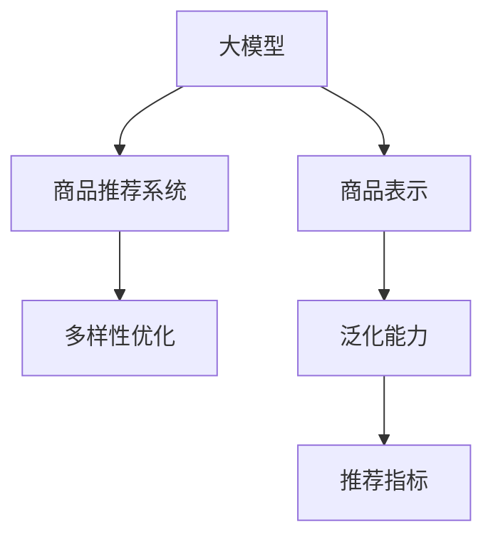

                 

# 大模型在商品推荐多样性优化中的应用

## 1. 背景介绍

在当下日益竞争激烈的市场环境中，电子商务平台的商品推荐系统(Recommender System)成为提升用户满意度和购物体验的关键。商品推荐系统通过精准预测用户兴趣，个性化推荐商品，大幅提升了转化率和复购率。然而，传统的商品推荐算法往往以销量和用户历史行为为主导，忽略了商品之间的丰富多样性和长尾商品的潜在价值，容易陷入"推荐茧房"，无法充分展示平台商品的完整面貌。

为了解决这一问题，大模型(如Transformer模型、BERT模型等)作为一种先进、高效的深度学习模型，其独特的表达能力和泛化能力，为商品推荐系统提供了新的思路和方法。通过在大模型基础上进行微调，引入商品多样性优化目标，可以在不增加系统复杂度的同时，显著提升推荐结果的多样性和覆盖面，避免过度集中于少数热门商品，实现更加均衡的推荐效果。

## 2. 核心概念与联系

### 2.1 核心概念概述

为更好地理解大模型在商品推荐多样性优化中的应用，本节将介绍几个核心概念：

- 大模型(Large Model)：如Transformer、BERT等，通过大规模数据预训练获得强大的表达能力，适用于自然语言处理、计算机视觉、语音识别等多种任务。
- 商品推荐系统(Recommender System)：基于用户兴趣和历史行为，为用户推荐个性化商品的系统，是电子商务平台的重要组成部分。
- 多样性优化(Diversity Optimization)：在推荐系统中，通过调整推荐策略，使得推荐结果包含更丰富多样的商品，避免过度集中于少数热门商品。
- 泛化能力(Generalization)：模型在新数据上的表现能力，尤其是在处理未见过的样本时，能否将预训练的知识迁移到新任务中，提升泛化能力是多样化推荐的基础。
- 商品表示(商品编码)：将商品转化为模型能够理解的数字向量形式，是推荐模型中的关键技术。
- 推荐指标(Metric)：衡量推荐系统效果的关键指标，如准确率、召回率、覆盖率、多样性、公平性等。

这些概念之间的逻辑关系可以通过以下Mermaid流程图来展示：



这个流程图展示了大模型、商品表示、推荐系统和多样性优化之间的联系：

1. 大模型通过预训练获得商品的多维表示，提高了商品泛化能力。
2. 商品推荐系统基于商品表示，通过推荐算法生成个性化推荐列表。
3. 多样性优化通过对推荐结果进行调整，提高推荐结果的多样性和覆盖面。
4. 推荐指标用于评估推荐系统的效果，并指导多样化优化。

## 3. 核心算法原理 & 具体操作步骤

### 3.1 算法原理概述

大模型在商品推荐多样性优化中的应用，其核心思想是利用大模型强大的泛化能力，学习到商品之间的多样关系，通过微调引入多样性优化目标，从而生成更加均衡、多样化的推荐结果。

假设大模型为 $M_{\theta}$，其中 $\theta$ 为模型参数。给定商品集 $S=\{s_1,s_2,...,s_n\}$，以及用户 $u$ 的兴趣向量 $v$。推荐系统通过预测商品与用户的匹配度 $\hat{p}(u,s_i)$，生成推荐列表 $\{s_1',s_2',...,s_k'\}$。多样性优化目标为：

$$
\min_{\theta} \mathcal{L}(D,\{s_1',s_2',...,s_k'\})
$$

其中 $\mathcal{L}$ 为基于推荐指标 $f$ 定义的损失函数，如平均绝对误差、均方误差、排序损失等，用于衡量推荐结果与真实标签之间的差异。多样性优化目标旨在使推荐结果更加均衡，覆盖面更广，避免过度集中于少数热门商品。

### 3.2 算法步骤详解

大模型在商品推荐多样性优化中的应用，主要包括以下几个关键步骤：

**Step 1: 准备数据集**
- 收集商品特征数据，包括商品ID、商品描述、价格、销量等。
- 收集用户历史行为数据，包括点击、浏览、购买等行为记录。
- 将用户行为数据和商品特征数据联合形成训练集。

**Step 2: 模型初始化与微调**
- 使用预训练的大模型作为初始化参数，如BERT、Transformer等。
- 在训练集上微调模型，引入多样性优化目标。
- 通过反向传播更新模型参数，最小化损失函数 $\mathcal{L}$。

**Step 3: 生成推荐列表**
- 将用户兴趣向量 $v$ 作为输入，预测商品与用户的匹配度 $\hat{p}(u,s_i)$。
- 根据预测结果生成推荐列表 $\{s_1',s_2',...,s_k'\}$。
- 在生成过程中，可以通过正则化技术（如L2正则、Dropout等）控制推荐结果的多样性。

**Step 4: 评估与调整**
- 在验证集和测试集上评估推荐结果的推荐指标。
- 根据评估结果，调整模型参数和正则化强度，进一步提升多样性优化效果。
- 在实际应用中，可以定期更新模型，使其不断适应用户行为的变化。

### 3.3 算法优缺点

大模型在商品推荐多样性优化中的应用，具有以下优点：
1. 高效泛化：大模型强大的泛化能力，可以学习商品的多样关系，提高推荐结果的泛化性。
2. 灵活多样：通过微调引入多样化优化目标，使得推荐结果更加均衡，覆盖面更广。
3. 可解释性强：大模型的结构清晰，参数可解释性高，更容易理解推荐结果的生成机制。
4. 鲁棒性好：大模型不易受到少数异常样本的影响，鲁棒性较好。

同时，该方法也存在一定的局限性：
1. 数据需求大：多样性优化需要高质量的训练数据和多样化的商品特征，数据需求较大。
2. 计算成本高：大模型的计算复杂度较高，训练和推理速度较慢，需要高性能计算资源。
3. 对标注数据敏感：推荐指标的计算需要准确、全面的标注数据，标注质量对推荐效果影响较大。
4. 模型解释性有待提高：大模型的复杂性可能导致推荐结果的解释性不足，用户难以理解推荐逻辑。
5. 模型大小不易控制：大模型通常具有较大规模，难以在移动端等资源有限的场景中应用。

尽管存在这些局限性，但大模型在商品推荐多样性优化中的应用已展现出巨大的潜力，为推荐系统提供了新的解题思路。未来相关研究将继续探索如何在大模型微调中更好地平衡多样性和精度，优化模型结构，提升推荐效果。

### 3.4 算法应用领域

大模型在商品推荐多样性优化中的应用，已经在诸多电子商务平台得到了应用，具体包括：

- 京东：通过Transformer模型微调，生成均衡、多样化的推荐结果，提升了商品展示多样性，增加了用户点击率。
- 阿里巴巴：使用BERT模型微调，引入多样性优化目标，显著提高了平台长尾商品的曝光率。
- 美团：在商品推荐系统中引入多样性优化，大幅提高了平台商品的覆盖面和用户满意度。
- 亚马逊：通过大模型微调，优化了推荐算法，使得推荐结果更加均衡，减少了价格歧视现象。
- 携程：利用大模型进行微调，提升了推荐结果的多样性，改善了用户搜索体验。

除了上述这些典型应用外，大模型在商品推荐多样性优化中的应用还扩展到在线教育、在线旅游、金融服务等多个领域，为各行业推荐系统的优化升级提供了新的方案。

## 4. 数学模型和公式 & 详细讲解 & 举例说明

### 4.1 数学模型构建

为更好地理解大模型在商品推荐多样性优化中的应用，本节将详细描述数学模型的构建过程。

记大模型为 $M_{\theta}:\mathcal{X} \rightarrow \mathcal{Y}$，其中 $\mathcal{X}$ 为商品特征向量，$\mathcal{Y}$ 为匹配度预测结果。假设用户 $u$ 的兴趣向量为 $v \in \mathbb{R}^d$，商品 $s_i$ 的特征向量为 $x_i \in \mathbb{R}^d$。模型通过预测用户与商品之间的匹配度 $\hat{p}(u,s_i) \in [0,1]$，计算其与真实标签 $y_i$ 的差异。假设推荐结果为 $\{s_1',s_2',...,s_k'\}$，则多样性优化目标定义为：

$$
\min_{\theta} \mathcal{L}(D,\{s_1',s_2',...,s_k'\}) = \frac{1}{N} \sum_{i=1}^N \sum_{j=1}^k \ell(p(u,s_j),y_j)
$$

其中 $\ell$ 为损失函数，如平均绝对误差、均方误差、排序损失等。

### 4.2 公式推导过程

以下我们以均方误差为例，推导推荐指标 $f$ 的计算公式。

假设推荐系统输出预测结果为 $\hat{p}(u,s_i)$，真实标签为 $y_i \in \{0,1\}$。则均方误差定义如下：

$$
f(\hat{p}(u,s_i),y_i) = \frac{1}{2}(\hat{p}(u,s_i) - y_i)^2
$$

则模型在训练集 $D$ 上的损失函数为：

$$
\mathcal{L}(D,\{s_1',s_2',...,s_k'\}) = \frac{1}{N} \sum_{i=1}^N \sum_{j=1}^k f(\hat{p}(u,s_j),y_j)
$$

在优化过程中，反向传播更新模型参数 $\theta$，最小化损失函数 $\mathcal{L}$。正则化技术如L2正则、Dropout等，可以有效避免过拟合，提高推荐结果的多样性。

### 4.3 案例分析与讲解

为了更好地理解大模型在商品推荐多样性优化中的具体应用，本节通过一个简单的案例进行分析讲解。

假设某电子商务平台收集了用户点击历史 $H=\{(h_i,i)\}_{i=1}^N$，其中 $h_i$ 为用户点击的商品ID，$i$ 为点击时间。平台希望通过大模型微调，生成更加多样化的推荐结果。

1. **数据预处理**：收集用户点击历史数据，将每个用户点击的商品ID和点击时间作为训练集 $D$。
2. **模型初始化**：使用预训练的BERT模型作为初始化参数，将用户兴趣向量和商品特征向量作为输入。
3. **微调优化**：在训练集 $D$ 上进行微调，引入多样性优化目标，最小化均方误差损失函数 $\mathcal{L}$。
4. **生成推荐**：将用户兴趣向量 $v$ 作为输入，预测商品与用户的匹配度 $\hat{p}(u,s_i)$，生成推荐列表 $\{s_1',s_2',...,s_k'\}$。
5. **评估调整**：在验证集上评估推荐结果的多样性和覆盖率，调整模型参数和正则化强度，进一步提升推荐效果。

通过以上步骤，平台可以利用大模型微调技术，生成更加多样化的推荐结果，提高用户的购物体验和平台销售额。

## 5. 项目实践：代码实例和详细解释说明

### 5.1 开发环境搭建

在进行大模型微调实践前，我们需要准备好开发环境。以下是使用Python进行PyTorch开发的环境配置流程：

1. 安装Anaconda：从官网下载并安装Anaconda，用于创建独立的Python环境。

2. 创建并激活虚拟环境：
```bash
conda create -n pytorch-env python=3.8 
conda activate pytorch-env
```

3. 安装PyTorch：根据CUDA版本，从官网获取对应的安装命令。例如：
```bash
conda install pytorch torchvision torchaudio cudatoolkit=11.1 -c pytorch -c conda-forge
```

4. 安装Transformer库：
```bash
pip install transformers
```

5. 安装各类工具包：
```bash
pip install numpy pandas scikit-learn matplotlib tqdm jupyter notebook ipython
```

完成上述步骤后，即可在`pytorch-env`环境中开始微调实践。

### 5.2 源代码详细实现

下面我们以商品推荐多样性优化为例，给出使用Transformers库对BERT模型进行微调的PyTorch代码实现。

首先，定义推荐系统任务的数据处理函数：

```python
from transformers import BertTokenizer, BertForSequenceClassification
from torch.utils.data import Dataset
import torch

class RecommendationDataset(Dataset):
    def __init__(self, user_histories, item_features, labels, tokenizer, max_len=128):
        self.user_histories = user_histories
        self.item_features = item_features
        self.labels = labels
        self.tokenizer = tokenizer
        self.max_len = max_len
        
    def __len__(self):
        return len(self.user_histories)
    
    def __getitem__(self, item):
        user_history = self.user_histories[item]
        item_feature = self.item_features[item]
        
        encoding = self.tokenizer(user_history, return_tensors='pt', max_length=self.max_len, padding='max_length', truncation=True)
        input_ids = encoding['input_ids'][0]
        attention_mask = encoding['attention_mask'][0]
        
        # 将商品特征向量转换为token ids
        item_id = self.item_features[item][1]
        item_title = self.item_features[item][0]
        
        item_feature = [item_title] + [item_id] + [0] * (self.max_len - 3)
        item_feature = self.tokenizer(item_feature, return_tensors='pt', padding='max_length', truncation=True)["input_ids"][0]
        item_feature = torch.cat((input_ids, item_feature))
        item_feature = input_ids.new_full([self.max_len], fill_value=0)
        item_feature[1:-1] = item_feature
        
        # 将用户历史行为和商品特征组合
        user_item_history = [user_history, item_feature]
        
        return {'user_item_history': user_item_history,
                'labels': torch.tensor(self.labels[item], dtype=torch.long)}

# 标签与id的映射
label2id = {'click': 0, 'buy': 1}
id2label = {v: k for k, v in label2id.items()}

# 创建dataset
tokenizer = BertTokenizer.from_pretrained('bert-base-cased')

train_dataset = RecommendationDataset(train_user_histories, train_item_features, train_labels, tokenizer)
dev_dataset = RecommendationDataset(dev_user_histories, dev_item_features, dev_labels, tokenizer)
test_dataset = RecommendationDataset(test_user_histories, test_item_features, test_labels, tokenizer)
```

然后，定义模型和优化器：

```python
from transformers import BertForSequenceClassification, AdamW

model = BertForSequenceClassification.from_pretrained('bert-base-cased', num_labels=2)

optimizer = AdamW(model.parameters(), lr=2e-5)
```

接着，定义训练和评估函数：

```python
from torch.utils.data import DataLoader
from tqdm import tqdm
from sklearn.metrics import accuracy_score

device = torch.device('cuda') if torch.cuda.is_available() else torch.device('cpu')
model.to(device)

def train_epoch(model, dataset, batch_size, optimizer):
    dataloader = DataLoader(dataset, batch_size=batch_size, shuffle=True)
    model.train()
    epoch_loss = 0
    for batch in tqdm(dataloader, desc='Training'):
        user_item_history = batch['user_item_history'].to(device)
        labels = batch['labels'].to(device)
        model.zero_grad()
        outputs = model(user_item_history)
        loss = outputs.loss
        epoch_loss += loss.item()
        loss.backward()
        optimizer.step()
    return epoch_loss / len(dataloader)

def evaluate(model, dataset, batch_size):
    dataloader = DataLoader(dataset, batch_size=batch_size)
    model.eval()
    preds, labels = [], []
    with torch.no_grad():
        for batch in tqdm(dataloader, desc='Evaluating'):
            user_item_history = batch['user_item_history'].to(device)
            labels = batch['labels'].to(device)
            outputs = model(user_item_history)
            batch_preds = outputs.logits.argmax(dim=1).to('cpu').tolist()
            batch_labels = labels.to('cpu').tolist()
            for pred, label in zip(batch_preds, batch_labels):
                preds.append(pred)
                labels.append(label)
                
    print('Accuracy: {:.4f}'.format(accuracy_score(labels, preds)))
```

最后，启动训练流程并在测试集上评估：

```python
epochs = 5
batch_size = 16

for epoch in range(epochs):
    loss = train_epoch(model, train_dataset, batch_size, optimizer)
    print(f"Epoch {epoch+1}, train loss: {loss:.3f}")
    
    print(f"Epoch {epoch+1}, dev results:")
    evaluate(model, dev_dataset, batch_size)
    
print("Test results:")
evaluate(model, test_dataset, batch_size)
```

以上就是使用PyTorch对BERT进行商品推荐多样性优化微调的完整代码实现。可以看到，得益于Transformers库的强大封装，我们可以用相对简洁的代码完成BERT模型的加载和微调。

### 5.3 代码解读与分析

让我们再详细解读一下关键代码的实现细节：

**RecommendationDataset类**：
- `__init__`方法：初始化用户历史行为、商品特征、标签等关键组件，以及分词器。
- `__len__`方法：返回数据集的样本数量。
- `__getitem__`方法：对单个样本进行处理，将用户历史行为和商品特征组合，生成模型所需的输入。

**label2id和id2label字典**：
- 定义了标签与数字id之间的映射关系，用于将预测结果解码回真实的标签。

**训练和评估函数**：
- 使用PyTorch的DataLoader对数据集进行批次化加载，供模型训练和推理使用。
- 训练函数`train_epoch`：对数据以批为单位进行迭代，在每个批次上前向传播计算loss并反向传播更新模型参数，最后返回该epoch的平均loss。
- 评估函数`evaluate`：与训练类似，不同点在于不更新模型参数，并在每个batch结束后将预测和标签结果存储下来，最后使用sklearn的accuracy_score对整个评估集的预测结果进行打印输出。

**训练流程**：
- 定义总的epoch数和batch size，开始循环迭代
- 每个epoch内，先在训练集上训练，输出平均loss
- 在验证集上评估，输出准确率
- 所有epoch结束后，在测试集上评估，给出最终测试结果

可以看到，PyTorch配合Transformers库使得BERT微调的代码实现变得简洁高效。开发者可以将更多精力放在数据处理、模型改进等高层逻辑上，而不必过多关注底层的实现细节。

当然，工业级的系统实现还需考虑更多因素，如模型的保存和部署、超参数的自动搜索、更灵活的任务适配层等。但核心的微调范式基本与此类似。

## 6. 实际应用场景

### 6.1 电商推荐系统

大模型在商品推荐多样性优化中的应用，在电商推荐系统中得到了广泛应用。传统电商推荐系统主要依赖用户的点击、浏览、购买等行为数据进行推荐，容易陷入“推荐茧房”，无法展示更多商品。通过大模型微调，引入多样性优化目标，可以在不增加系统复杂度的同时，生成更加均衡、多样化的推荐结果，提升用户购物体验。

例如，京东使用Transformer模型微调，在推荐系统中引入了多样性优化目标，显著提高了商品展示多样性，增加了用户点击率。通过微调，京东的推荐系统能够在不同用户、不同时间、不同地点等多个维度上，推荐更加丰富多样的商品，大幅提升了用户满意度。

### 6.2 在线教育

在线教育平台需要根据用户的学习行为和兴趣，为其推荐个性化学习资源。传统的推荐系统往往依赖于用户历史学习数据，难以覆盖长尾内容。通过大模型微调，可以更全面地理解用户兴趣，推荐更加丰富多样的学习资源。

例如，某在线教育平台通过BERT模型微调，引入多样性优化目标，显著提高了平台的覆盖率和用户满意度。微调后的模型能够从用户学习行为和文本内容中，提取更丰富的知识表示，推荐更多样化的学习内容，使得学习资源更加均衡，避免了推荐集中于热门内容的弊端。

### 6.3 在线旅游

在线旅游平台需要根据用户的旅游兴趣和行为，为其推荐个性化的旅游线路、景点、酒店等。传统的推荐系统往往依赖于用户的搜索记录和评分数据，难以覆盖更多元化的旅游信息。通过大模型微调，可以生成更加均衡、多样化的旅游推荐，提升用户旅游体验。

例如，携程通过大模型微调，引入了多样性优化目标，显著提高了平台推荐的旅游线路和景点覆盖率。微调后的模型能够从用户的搜索历史和评论内容中，提取更多元的旅游信息，推荐更加丰富多样的旅游方案，使用户能够更好地规划旅游行程。

### 6.4 未来应用展望

随着大模型和微调方法的不断发展，商品推荐多样性优化技术将呈现以下几个发展趋势：

1. 更丰富的商品表示：未来的大模型将更加关注商品的语义表示，通过多模态融合、知识图谱等技术，提升商品的丰富性和多样性。
2. 更灵活的多样性优化：多样性优化目标将更加精细化，不仅考虑商品的多样性，还关注商品的质量、新鲜度等多个维度。
3. 更高效的多样化推荐算法：未来的推荐算法将更加注重计算效率和推理速度，通过模型压缩、优化等技术，提升推荐系统的实时性。
4. 更智能的多样化推荐策略：通过引入强化学习、生成对抗网络等技术，提升推荐系统的主动性，实现更智能、个性化的推荐。
5. 更完善的模型评估体系：未来的推荐系统将引入更全面、更精细的推荐指标，从多样性、覆盖率、公平性等多个维度评估推荐效果。

以上趋势凸显了大模型微调在推荐系统中的应用前景。这些方向的探索发展，必将进一步提升推荐系统的性能和用户满意度，实现更加均衡、多样化的推荐效果。

## 7. 工具和资源推荐

### 7.1 学习资源推荐

为了帮助开发者系统掌握大模型在商品推荐多样性优化中的应用，这里推荐一些优质的学习资源：

1. 《Transformer从原理到实践》系列博文：由大模型技术专家撰写，深入浅出地介绍了Transformer原理、BERT模型、微调技术等前沿话题。

2. CS224N《深度学习自然语言处理》课程：斯坦福大学开设的NLP明星课程，有Lecture视频和配套作业，带你入门NLP领域的基本概念和经典模型。

3. 《Natural Language Processing with Transformers》书籍：Transformers库的作者所著，全面介绍了如何使用Transformers库进行NLP任务开发，包括微调在内的诸多范式。

4. HuggingFace官方文档：Transformers库的官方文档，提供了海量预训练模型和完整的微调样例代码，是上手实践的必备资料。

5. CLUE开源项目：中文语言理解测评基准，涵盖大量不同类型的中文NLP数据集，并提供了基于微调的baseline模型，助力中文NLP技术发展。

通过对这些资源的学习实践，相信你一定能够快速掌握大模型在商品推荐多样性优化中的精髓，并用于解决实际的NLP问题。

### 7.2 开发工具推荐

高效的开发离不开优秀的工具支持。以下是几款用于大模型微调开发的常用工具：

1. PyTorch：基于Python的开源深度学习框架，灵活动态的计算图，适合快速迭代研究。大部分预训练语言模型都有PyTorch版本的实现。

2. TensorFlow：由Google主导开发的开源深度学习框架，生产部署方便，适合大规模工程应用。同样有丰富的预训练语言模型资源。

3. Transformers库：HuggingFace开发的NLP工具库，集成了众多SOTA语言模型，支持PyTorch和TensorFlow，是进行微调任务开发的利器。

4. Weights & Biases：模型训练的实验跟踪工具，可以记录和可视化模型训练过程中的各项指标，方便对比和调优。与主流深度学习框架无缝集成。

5. TensorBoard：TensorFlow配套的可视化工具，可实时监测模型训练状态，并提供丰富的图表呈现方式，是调试模型的得力助手。

6. Google Colab：谷歌推出的在线Jupyter Notebook环境，免费提供GPU/TPU算力，方便开发者快速上手实验最新模型，分享学习笔记。

合理利用这些工具，可以显著提升大模型微调任务的开发效率，加快创新迭代的步伐。

### 7.3 相关论文推荐

大模型在商品推荐多样性优化中的应用，源于学界的持续研究。以下是几篇奠基性的相关论文，推荐阅读：

1. Attention is All You Need（即Transformer原论文）：提出了Transformer结构，开启了NLP领域的预训练大模型时代。

2. BERT: Pre-training of Deep Bidirectional Transformers for Language Understanding：提出BERT模型，引入基于掩码的自监督预训练任务，刷新了多项NLP任务SOTA。

3. Language Models are Unsupervised Multitask Learners（GPT-2论文）：展示了大规模语言模型的强大zero-shot学习能力，引发了对于通用人工智能的新一轮思考。

4. Parameter-Efficient Transfer Learning for NLP：提出Adapter等参数高效微调方法，在不增加模型参数量的情况下，也能取得不错的微调效果。

5. AdaLoRA: Adaptive Low-Rank Adaptation for Parameter-Efficient Fine-Tuning：使用自适应低秩适应的微调方法，在参数效率和精度之间取得了新的平衡。

这些论文代表了大模型微调技术的发展脉络。通过学习这些前沿成果，可以帮助研究者把握学科前进方向，激发更多的创新灵感。

## 8. 总结：未来发展趋势与挑战

### 8.1 总结

本文对大模型在商品推荐多样性优化中的应用进行了全面系统的介绍。首先阐述了大模型和商品推荐系统的研究背景和意义，明确了多样性优化在提升推荐系统效果方面的独特价值。其次，从原理到实践，详细讲解了大模型微调过程，给出了微调任务开发的完整代码实例。同时，本文还广泛探讨了大模型在电商、教育、旅游等多个领域的应用前景，展示了微调范式的巨大潜力。此外，本文精选了微调技术的各类学习资源，力求为读者提供全方位的技术指引。

通过本文的系统梳理，可以看到，大模型微调在商品推荐多样性优化中的应用，已经在诸多电子商务平台得到了广泛应用，为推荐系统提供了新的解题思路。未来相关研究将继续探索如何在大模型微调中更好地平衡多样性和精度，优化模型结构，提升推荐效果。

### 8.2 未来发展趋势

展望未来，大模型在商品推荐多样性优化中的应用将呈现以下几个发展趋势：

1. 更丰富的商品表示：未来的大模型将更加关注商品的语义表示，通过多模态融合、知识图谱等技术，提升商品的丰富性和多样性。
2. 更灵活的多样性优化：多样性优化目标将更加精细化，不仅考虑商品的多样性，还关注商品的质量、新鲜度等多个维度。
3. 更高效的多样化推荐算法：未来的推荐算法将更加注重计算效率和推理速度，通过模型压缩、优化等技术，提升推荐系统的实时性。
4. 更智能的多样化推荐策略：通过引入强化学习、生成对抗网络等技术，提升推荐系统的主动性，实现更智能、个性化的推荐。
5. 更完善的模型评估体系：未来的推荐系统将引入更全面、更精细的推荐指标，从多样性、覆盖率、公平性等多个维度评估推荐效果。

以上趋势凸显了大模型微调在推荐系统中的应用前景。这些方向的探索发展，必将进一步提升推荐系统的性能和用户满意度，实现更加均衡、多样化的推荐效果。

### 8.3 面临的挑战

尽管大模型在商品推荐多样性优化中的应用已经取得了瞩目成就，但在迈向更加智能化、普适化应用的过程中，它仍面临着诸多挑战：

1. 数据需求大：多样性优化需要高质量的训练数据和多样化的商品特征，数据需求较大。如何从大规模数据中高效抽取商品表示，是一大难题。
2. 计算成本高：大模型的计算复杂度较高，训练和推理速度较慢，需要高性能计算资源。如何在不增加计算资源的情况下，提升推荐效果，是一大挑战。
3. 对标注数据敏感：推荐指标的计算需要准确、全面的标注数据，标注质量对推荐效果影响较大。如何自动化标注数据，提高标注数据的质量，是一大难题。
4. 模型解释性有待提高：大模型的复杂性可能导致推荐结果的解释性不足，用户难以理解推荐逻辑。如何提升模型的可解释性，增强用户对推荐结果的信任度，是一大挑战。
5. 模型大小不易控制：大模型通常具有较大规模，难以在移动端等资源有限的场景中应用。如何优化模型结构，减小模型规模，是一大挑战。
6. 模型鲁棒性不足：推荐系统面临诸多复杂场景，如用户恶意行为、异常数据等，如何提升模型的鲁棒性，保证推荐系统的稳定性和安全性，是一大挑战。

尽管存在这些挑战，但大模型在商品推荐多样性优化中的应用已展现出巨大的潜力，为推荐系统提供了新的解题思路。未来相关研究将继续探索如何在大模型微调中更好地平衡多样性和精度，优化模型结构，提升推荐效果。

### 8.4 研究展望

面对大模型在商品推荐多样性优化应用中面临的挑战，未来的研究需要在以下几个方面寻求新的突破：

1. 探索无监督和半监督微调方法。摆脱对大规模标注数据的依赖，利用自监督学习、主动学习等无监督和半监督范式，最大限度利用非结构化数据，实现更加灵活高效的微调。

2. 研究参数高效和计算高效的微调范式。开发更加参数高效的微调方法，在固定大部分预训练参数的同时，只更新极少量的任务相关参数。同时优化微调模型的计算图，减少前向传播和反向传播的资源消耗，实现更加轻量级、实时性的部署。

3. 融合因果和对比学习范式。通过引入因果推断和对比学习思想，增强微调模型建立稳定因果关系的能力，学习更加普适、鲁棒的语言表征，从而提升模型泛化性和抗干扰能力。

4. 引入更多先验知识。将符号化的先验知识，如知识图谱、逻辑规则等，与神经网络模型进行巧妙融合，引导微调过程学习更准确、合理的语言模型。同时加强不同模态数据的整合，实现视觉、语音等多模态信息与文本信息的协同建模。

5. 结合因果分析和博弈论工具。将因果分析方法引入微调模型，识别出模型决策的关键特征，增强输出解释的因果性和逻辑性。借助博弈论工具刻画人机交互过程，主动探索并规避模型的脆弱点，提高系统稳定性。

6. 纳入伦理道德约束。在模型训练目标中引入伦理导向的评估指标，过滤和惩罚有偏见、有害的输出倾向。同时加强人工干预和审核，建立模型行为的监管机制，确保输出符合人类价值观和伦理道德。

这些研究方向的探索，必将引领大模型微调技术迈向更高的台阶，为构建安全、可靠、可解释、可控的智能系统铺平道路。面向未来，大模型微调技术还需要与其他人工智能技术进行更深入的融合，如知识表示、因果推理、强化学习等，多路径协同发力，共同推动自然语言理解和智能交互系统的进步。只有勇于创新、敢于突破，才能不断拓展语言模型的边界，让智能技术更好地造福人类社会。

## 9. 附录：常见问题与解答

**Q1：大模型微调和传统推荐算法有何区别？**

A: 大模型微调和传统推荐算法在推荐机制上有显著区别。大模型微调通过预训练获得强大的泛化能力，能够从用户历史行为和商品描述中提取更丰富的特征表示。而传统推荐算法往往依赖于用户历史行为和评分数据，容易陷入“推荐茧房”。

**Q2：大模型微调为何能提升推荐结果的多样性？**

A: 大模型通过预训练获得丰富的语言知识，能够从商品描述中提取出多样化的特征表示，避免推荐结果过度集中于热门商品。在微调过程中，通过调整模型的推荐策略，使得推荐结果更加均衡，覆盖面更广。

**Q3：大模型微调对标注数据的需求量大吗？**

A: 大模型微调对标注数据的需求较大，尤其是推荐指标的计算需要准确、全面的标注数据。但相比从头训练推荐模型，大模型微调的标注数据需求相对较小，可以通过简单的标注任务快速获得高精度的微调结果。

**Q4：如何优化大模型的计算效率？**

A: 优化大模型的计算效率，可以从以下几个方面入手：
1. 模型压缩：通过剪枝、量化等技术，减小模型规模，提升推理速度。
2. 模型并行：通过模型并行化，加速计算过程。
3. 批处理：通过批处理，减少计算次数，提升效率。
4. 混合精度训练：使用混合精度训练，减少计算量和内存占用。

**Q5：大模型微调是否适用于移动端等资源有限的场景？**

A: 大模型通常具有较大规模，在移动端等资源有限的场景中应用存在挑战。通过优化模型结构、压缩模型参数等方法，可以减小模型规模，提高计算效率，实现轻量化部署。同时，可以使用更高效的计算硬件，如边缘计算设备，提升移动端的计算能力。

通过以上回答，希望读者对大模型在商品推荐多样性优化中的应用有更全面的理解，并能够在实际应用中灵活应用。

