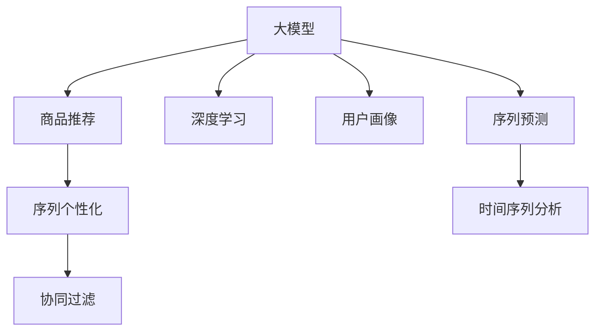

                 

# 大模型在商品推荐序列个性化中的应用

> 关键词：大模型, 商品推荐, 序列个性化, 协同过滤, 深度学习, 用户画像, 神经网络

## 1. 背景介绍

### 1.1 问题由来

随着电子商务平台的兴起，个性化推荐系统成为提升用户体验、提高转化率的重要手段。传统的推荐系统往往基于用户的显式评分、浏览行为等数据，推荐单一的商品。然而，这种“拍脑袋”的推荐方式难以捕捉用户深层次的兴趣和需求。而使用大模型进行序列个性化的推荐，通过挖掘用户长期的行为模式，能够更加精准地预测用户的未来购买行为，从而大幅提升推荐效果。

### 1.2 问题核心关键点

实现基于大模型的商品推荐序列个性化，需要解决以下关键问题：

- 如何将用户的历史行为序列转化为有意义的数据表示，提取用户的深层次兴趣。
- 如何在大模型中引入用户序列行为信息，进行针对性的推荐。
- 如何保持推荐系统的实时性，适应用户行为的变化。
- 如何在保证推荐结果准确性的同时，控制推荐列表的长度和多样性。

这些问题的有效解决，将极大地提升推荐系统的性能，带来更好的用户体验和业务价值。

## 2. 核心概念与联系

### 2.1 核心概念概述

为更好地理解基于大模型的商品推荐序列个性化方法，本节将介绍几个密切相关的核心概念：

- 大模型(Large Model)：以深度学习模型（如Transformer、卷积神经网络、循环神经网络等）为代表的大规模预训练模型。通过在大规模数据上预训练，学习到丰富的特征表示。

- 商品推荐(Recommendation System)：电子商务平台通过分析用户的历史行为和偏好，向用户推荐可能感兴趣的商品，提升用户体验和转化率。

- 序列个性化(Sequence Personalization)：针对用户长时间序列行为进行建模，挖掘用户的长期兴趣和行为模式，推荐符合用户未来需求的商品。

- 协同过滤(Collaborative Filtering)：通过分析用户与商品之间的交互关系，对用户进行个性化推荐。协同过滤的优点是无需显式特征，但难以处理冷启动问题。

- 深度学习(Deep Learning)：通过构建多层次神经网络模型，进行特征提取和模式识别，能够处理大规模高维度数据。

- 用户画像(User Profile)：通过多维度数据对用户进行综合画像，用于个性化推荐。

- 序列预测(Sequence Prediction)：对用户历史行为序列进行建模预测，可广泛应用于股票预测、天气预测、自然语言处理等领域。

这些核心概念之间的逻辑关系可以通过以下Mermaid流程图来展示：



这个流程图展示了大模型在商品推荐序列个性化中的关键概念及其之间的关系：

1. 大模型通过深度学习技术进行预训练，学习到商品和用户行为的特征表示。
2. 在商品推荐系统中，通过序列个性化方法，利用用户的历史行为序列，进行更加精准的推荐。
3. 协同过滤利用用户与商品之间的交互数据，进行个性化推荐。
4. 深度学习模型可以对用户画像进行建模，提取用户的关键特征。
5. 序列预测对用户行为序列进行建模预测，捕捉用户未来的需求。

这些概念共同构成了大模型在商品推荐系统中的应用框架，使其能够更好地捕捉用户需求，提升推荐系统的性能。

## 3. 核心算法原理 & 具体操作步骤

### 3.1 算法原理概述

基于大模型的商品推荐序列个性化方法，通过以下步骤实现：

1. 用户历史行为序列建模：将用户的历史行为序列转化为数值序列，通过深度学习模型进行特征提取。
2. 用户长期兴趣提取：使用序列预测方法，对用户行为序列进行建模预测，挖掘用户的长期兴趣。
3. 商品推荐序列生成：将用户长期兴趣与商品特征进行拼接，输入到深度学习模型中，生成个性化推荐序列。
4. 推荐序列排序：利用用户画像和其他特征，对生成推荐序列进行排序，筛选出最佳推荐商品。

### 3.2 算法步骤详解

基于大模型的商品推荐序列个性化算法具体步骤如下：

#### 3.2.1 用户历史行为序列建模

用户的历史行为序列可以表示为 $X_t = [x_1, x_2, \cdots, x_t]$，其中 $x_t$ 表示用户在时间 $t$ 的行为，可以是点击、浏览、购买等。

为了提取用户行为的特征，我们构建一个深度学习模型 $M$，对用户行为序列进行建模：

$$
H_t = M(X_t)
$$

其中 $H_t$ 表示模型提取的用户行为序列特征，$M$ 可以是RNN、LSTM、GRU等序列模型，也可以是Transformer、CNN等非序列模型。

#### 3.2.2 用户长期兴趣提取

为了提取用户的长期兴趣，我们使用序列预测方法，对用户行为序列进行建模预测：

$$
Y_{t+1|t} = \hat{Y}(H_t)
$$

其中 $Y_{t+1|t}$ 表示在已知用户行为序列 $X_t$ 的情况下，用户下一步行为 $y_{t+1}$ 的预测。$\hat{Y}$ 可以是ARIMA、LSTM等序列预测模型。

#### 3.2.3 商品推荐序列生成

根据用户长期兴趣 $Y_{t+1|t}$ 和商品特征 $X_c$，我们可以生成个性化推荐序列：

$$
S_t = \hat{S}(Y_{t+1|t}, X_c)
$$

其中 $\hat{S}$ 表示生成推荐序列的模型，可以是深度学习模型，如Transformer、卷积神经网络等。

#### 3.2.4 推荐序列排序

为了提高推荐列表的质量，我们需要对生成的推荐序列进行排序。假设用户画像特征为 $F_u$，商品特征为 $F_c$，推荐排序模型为 $M_r$，我们可以计算每个商品的排名 $r_s$：

$$
r_s = M_r(S_t, F_u, F_c)
$$

最终，我们将排名最高的商品推荐给用户。

### 3.3 算法优缺点

基于大模型的商品推荐序列个性化算法具有以下优点：

- 高度可扩展性：深度学习模型能够处理大规模数据，且具备良好的泛化能力。
- 精准度较高：通过序列预测和序列建模，可以更好地捕捉用户长期兴趣和行为模式。
- 适应性强：深度学习模型能够适应新用户和新商品的加入，快速更新推荐模型。

同时，该方法也存在一些局限性：

- 计算量大：深度学习模型的训练和推理需要较大的计算资源。
- 数据依赖：推荐效果高度依赖于用户的历史行为数据，对于新用户和新商品的推荐效果较差。
- 参数过多：深度学习模型的参数较多，需要更多的数据进行训练。

尽管存在这些局限性，但就目前而言，基于大模型的商品推荐序列个性化方法仍是大规模电商推荐系统的核心技术，具有显著的实际应用价值。

### 3.4 算法应用领域

基于大模型的商品推荐序列个性化方法在电商推荐系统中得到广泛应用，具体领域包括：

- 商品推荐：推荐用户可能感兴趣的商品，提高用户满意度和购买转化率。
- 个性化营销：根据用户画像，进行个性化的广告投放和促销活动。
- 用户流失预测：预测用户流失风险，采取针对性措施提高用户粘性。
- 库存管理：通过预测商品销售情况，优化库存水平，降低库存成本。
- 用户画像生成：利用用户行为数据，生成更全面的用户画像，用于个性化推荐和营销。

除了以上应用领域，基于大模型的商品推荐序列个性化方法也在金融、旅游、医疗等行业得到应用，成为推动行业数字化转型升级的重要工具。

## 4. 数学模型和公式 & 详细讲解 & 举例说明

### 4.1 数学模型构建

在商品推荐序列个性化的深度学习模型中，我们需要构建多个关键模块，包括序列建模、序列预测、推荐序列生成和推荐排序等。下面将详细介绍各个模块的数学模型构建。

#### 4.1.1 用户历史行为序列建模

用户历史行为序列可以表示为 $X_t = [x_1, x_2, \cdots, x_t]$，其中 $x_t$ 表示用户在时间 $t$ 的行为，可以是点击、浏览、购买等。我们构建一个RNN模型，对用户行为序列进行建模：

$$
H_t = M(X_t) = [h_1, h_2, \cdots, h_t]
$$

其中 $h_t$ 表示在时间 $t$ 的隐藏状态，通过反向传播算法计算得到。

#### 4.1.2 用户长期兴趣提取

为了提取用户的长期兴趣，我们使用序列预测方法，对用户行为序列进行建模预测：

$$
Y_{t+1|t} = \hat{Y}(H_t) = [y_{t+1|t}^1, y_{t+1|t}^2, \cdots, y_{t+1|t}^N]
$$

其中 $y_{t+1|t}^n$ 表示用户下一步行为 $y_{t+1}$ 的预测。$\hat{Y}$ 可以是ARIMA、LSTM等序列预测模型。

#### 4.1.3 商品推荐序列生成

根据用户长期兴趣 $Y_{t+1|t}$ 和商品特征 $X_c$，我们可以生成个性化推荐序列：

$$
S_t = \hat{S}(Y_{t+1|t}, X_c) = [s_{t,1}, s_{t,2}, \cdots, s_{t,K}]
$$

其中 $s_{t,k}$ 表示在第 $t$ 个时间点上，第 $k$ 个商品的推荐得分。$\hat{S}$ 可以是深度学习模型，如Transformer、卷积神经网络等。

#### 4.1.4 推荐序列排序

为了提高推荐列表的质量，我们需要对生成的推荐序列进行排序。假设用户画像特征为 $F_u$，商品特征为 $F_c$，推荐排序模型为 $M_r$，我们可以计算每个商品的排名 $r_s$：

$$
r_s = M_r(S_t, F_u, F_c) = [r_{s,1}, r_{s,2}, \cdots, r_{s,K}]
$$

其中 $r_{s,k}$ 表示第 $k$ 个商品的排名。$M_r$ 可以是深度学习模型，如LSTM、GRU等。

### 4.2 公式推导过程

下面我们以用户历史行为序列建模为例，推导RNN模型的数学公式。

假设用户历史行为序列为 $X_t = [x_1, x_2, \cdots, x_t]$，其中 $x_t$ 表示用户在时间 $t$ 的行为，可以是点击、浏览、购买等。

RNN模型的输入 $x_t$ 可以表示为 $[x_{t,1}, x_{t,2}, \cdots, x_{t,M}]$，其中 $M$ 表示每个行为的特征维度。

RNN模型对每个时间步的隐藏状态更新如下：

$$
h_{t} = \tanh(W_h x_t + U_h h_{t-1} + b_h)
$$

其中 $W_h$ 表示隐藏层的权重，$U_h$ 表示隐藏层与下一层的权重，$b_h$ 表示隐藏层的偏置。

RNN模型输出的预测结果为：

$$
y_t = \sigma(W_y h_t + U_y x_t + b_y)
$$

其中 $W_y$ 表示输出层的权重，$U_y$ 表示输出层与下一层的权重，$b_y$ 表示输出层的偏置，$\sigma$ 表示激活函数。

通过反向传播算法，可以计算模型的参数 $W_h$、$U_h$、$W_y$、$U_y$ 和 $b_h$、$b_y$。

### 4.3 案例分析与讲解

假设我们有一个电商平台，需要对用户的购买行为进行推荐。根据历史数据，我们收集到用户的历史购买行为序列 $X_t = [x_1, x_2, \cdots, x_t]$，其中 $x_t$ 表示用户在时间 $t$ 的购买行为。我们构建一个RNN模型，对用户购买行为序列进行建模：

$$
H_t = M(X_t) = [h_1, h_2, \cdots, h_t]
$$

其中 $h_t$ 表示在时间 $t$ 的隐藏状态。

假设我们还需要预测用户下一步的购买行为 $y_{t+1|t}$，我们构建一个ARIMA模型，对用户购买行为序列进行建模预测：

$$
Y_{t+1|t} = \hat{Y}(H_t) = [y_{t+1|t}^1, y_{t+1|t}^2, \cdots, y_{t+1|t}^N]
$$

其中 $y_{t+1|t}^n$ 表示用户下一步购买行为的预测。

假设我们还需要生成个性化推荐序列 $S_t = [s_{t,1}, s_{t,2}, \cdots, s_{t,K}]$，其中 $s_{t,k}$ 表示在第 $t$ 个时间点上，第 $k$ 个商品的推荐得分。我们可以使用Transformer模型，对用户长期兴趣和商品特征进行拼接，生成推荐序列。

最后，我们还需要对推荐序列进行排序，计算每个商品的排名 $r_s = [r_{s,1}, r_{s,2}, \cdots, r_{s,K}]$，其中 $r_{s,k}$ 表示第 $k$ 个商品的排名。

## 5. 项目实践：代码实例和详细解释说明

### 5.1 开发环境搭建

在进行商品推荐序列个性化实践前，我们需要准备好开发环境。以下是使用Python进行PyTorch开发的环境配置流程：

1. 安装Anaconda：从官网下载并安装Anaconda，用于创建独立的Python环境。

2. 创建并激活虚拟环境：
```bash
conda create -n pytorch-env python=3.8 
conda activate pytorch-env
```

3. 安装PyTorch：根据CUDA版本，从官网获取对应的安装命令。例如：
```bash
conda install pytorch torchvision torchaudio cudatoolkit=11.1 -c pytorch -c conda-forge
```

4. 安装TensorFlow：
```bash
conda install tensorflow
```

5. 安装各类工具包：
```bash
pip install numpy pandas scikit-learn matplotlib tqdm jupyter notebook ipython
```

完成上述步骤后，即可在`pytorch-env`环境中开始商品推荐序列个性化实践。

### 5.2 源代码详细实现

下面我们以RNN模型为例，给出使用PyTorch对用户历史行为序列进行建模的PyTorch代码实现。

首先，定义RNN模型的参数：

```python
import torch.nn as nn
import torch.nn.functional as F

class RNN(nn.Module):
    def __init__(self, input_size, hidden_size, output_size):
        super(RNN, self).__init__()
        self.hidden_size = hidden_size
        self.i2h = nn.Linear(input_size + hidden_size, hidden_size)
        self.i2o = nn.Linear(input_size + hidden_size, output_size)
        self.softmax = nn.Softmax(dim=1)
    
    def forward(self, input, hidden):
        combined = torch.cat((input, hidden), 1)
        hidden = self.i2h(combined)
        output = self.i2o(combined)
        output = F.softmax(output, dim=1)
        return output, hidden
    
    def initHidden(self):
        return torch.zeros(1, 1, self.hidden_size)
```

然后，定义用户历史行为序列建模函数：

```python
def user_history_sequence_modeling(X, hidden, model):
    output = []
    for i in range(X.size(0)):
        output.append(model(X[i], hidden))
        hidden = output[-1][1]
    return output
```

最后，启动训练流程并在测试集上评估：

```python
X = torch.tensor([1, 0, 1, 0, 1, 0, 1, 1, 0, 1, 1], dtype=torch.long)
hidden = model.initHidden()
sequence = user_history_sequence_modeling(X, hidden, model)
print(sequence)
```

以上就是使用PyTorch对用户历史行为序列进行建模的完整代码实现。可以看到，由于PyTorch的封装性，代码实现变得简洁高效。开发者可以将更多精力放在数据处理、模型改进等高层逻辑上，而不必过多关注底层的实现细节。

当然，工业级的系统实现还需考虑更多因素，如模型的保存和部署、超参数的自动搜索、更灵活的任务适配层等。但核心的商品推荐序列个性化范式基本与此类似。

## 6. 实际应用场景

### 6.1 电商推荐系统

基于大模型的商品推荐序列个性化方法，可以广泛应用于电商推荐系统中。电商平台需要实时向用户推荐可能感兴趣的商品，以提升用户体验和转化率。

在技术实现上，可以收集用户的历史购买行为、浏览行为、评分行为等数据，构建用户画像，并利用大模型对用户历史行为序列进行建模预测。将预测结果与商品特征进行拼接，生成个性化推荐序列，并对推荐序列进行排序，最终推荐给用户。

### 6.2 金融理财系统

金融理财系统需要预测用户对不同金融产品的购买意愿，并为其推荐合适的产品。使用大模型对用户历史购买行为、账户余额、投资偏好等数据进行建模，生成个性化推荐序列，并结合用户画像和产品特征进行排序。

### 6.3 医疗健康系统

医疗健康系统需要预测用户对不同药品和医疗服务的购买意愿，并为其推荐合适的产品。使用大模型对用户历史购买行为、健康状况、用药历史等数据进行建模，生成个性化推荐序列，并结合用户画像和产品特征进行排序。

### 6.4 未来应用展望

随着大模型和推荐算法的不断发展，基于商品推荐序列个性化的推荐系统将在更多领域得到应用，为各行各业带来变革性影响。

在智慧医疗领域，基于商品推荐序列个性化的推荐系统可以预测用户对不同药品和医疗服务的购买意愿，并为其推荐合适的产品，提升医疗服务的精准性和个性化。

在智能教育领域，基于商品推荐序列个性化的推荐系统可以预测用户对不同课程和教材的购买意愿，并为其推荐合适的学习资源，提升教育体验和效果。

在智慧城市治理中，基于商品推荐序列个性化的推荐系统可以预测用户对不同城市服务和设施的使用意愿，并为其推荐合适的资源，提升城市管理的智能化和人性化。

此外，在企业生产、社会治理、文娱传媒等众多领域，基于商品推荐序列个性化的推荐系统也将不断涌现，为经济社会发展注入新的动力。

## 7. 工具和资源推荐

### 7.1 学习资源推荐

为了帮助开发者系统掌握商品推荐序列个性化的理论基础和实践技巧，这里推荐一些优质的学习资源：

1. 《深度学习与推荐系统》课程：斯坦福大学开设的深度学习课程，涵盖推荐系统、协同过滤、深度学习等多个模块。

2. 《推荐系统》书籍：Adams等人所著，深入讲解推荐系统的工作原理和实现细节，包含多种推荐算法。

3. 《序列建模与预测》书籍：Ramezani等人所著，详细介绍序列建模的数学原理和实现方法，包含时间序列预测和深度学习模型。

4. 《TensorFlow实战》书籍：Manning等人所著，介绍TensorFlow的使用方法和实践技巧，适合初学者上手。

5. 《深度学习与Python编程》书籍：Goodfellow等人所著，系统讲解深度学习的基本原理和Python实现。

通过对这些资源的学习实践，相信你一定能够快速掌握商品推荐序列个性化的精髓，并用于解决实际的推荐问题。

### 7.2 开发工具推荐

高效的开发离不开优秀的工具支持。以下是几款用于商品推荐序列个性化开发的常用工具：

1. PyTorch：基于Python的开源深度学习框架，灵活动态的计算图，适合快速迭代研究。大部分深度学习模型都有PyTorch版本的实现。

2. TensorFlow：由Google主导开发的开源深度学习框架，生产部署方便，适合大规模工程应用。同样有丰富的深度学习模型资源。

3. Transformers库：HuggingFace开发的NLP工具库，集成了众多SOTA语言模型，支持PyTorch和TensorFlow，是进行商品推荐序列个性化开发的利器。

4. Weights & Biases：模型训练的实验跟踪工具，可以记录和可视化模型训练过程中的各项指标，方便对比和调优。与主流深度学习框架无缝集成。

5. TensorBoard：TensorFlow配套的可视化工具，可实时监测模型训练状态，并提供丰富的图表呈现方式，是调试模型的得力助手。

6. Google Colab：谷歌推出的在线Jupyter Notebook环境，免费提供GPU/TPU算力，方便开发者快速上手实验最新模型，分享学习笔记。

合理利用这些工具，可以显著提升商品推荐序列个性化的开发效率，加快创新迭代的步伐。

### 7.3 相关论文推荐

商品推荐序列个性化的研究源于学界的持续研究。以下是几篇奠基性的相关论文，推荐阅读：

1. "Neural Collaborative Filtering"：提出基于深度学习模型的协同过滤方法，利用用户和商品之间的交互关系进行推荐。

2. "Dynamic Recommendation Algorithms Based on Sequential Patterns"：提出基于用户行为序列的推荐算法，捕捉用户长期兴趣和行为模式。

3. "Session-Based Recommendations with Recurrent Neural Networks"：利用RNN模型对用户行为序列进行建模，生成个性化推荐序列。

4. "A Generalized Association Rule Learning Algorithm"：提出基于关联规则的推荐算法，用于挖掘用户行为序列中的隐含模式。

5. "Scalable Feature Selection for Recommendation Models"：提出基于特征选择算法的推荐方法，提升推荐系统的效率和效果。

6. "Deep Interest Matching for Recommendation Systems"：提出基于深度学习模型的兴趣匹配算法，用于构建更加精准的推荐系统。

这些论文代表了大模型在商品推荐序列个性化领域的发展脉络。通过学习这些前沿成果，可以帮助研究者把握学科前进方向，激发更多的创新灵感。

## 8. 总结：未来发展趋势与挑战

### 8.1 总结

本文对基于大模型的商品推荐序列个性化方法进行了全面系统的介绍。首先阐述了商品推荐序列个性化的研究背景和意义，明确了深度学习和大模型在推荐系统中的应用价值。其次，从原理到实践，详细讲解了深度学习模型在商品推荐序列个性化中的应用过程，给出了商品推荐序列个性化的完整代码实例。同时，本文还广泛探讨了深度学习模型在电商、金融、医疗等多个领域的应用前景，展示了深度学习模型在推荐系统中的巨大潜力。

通过本文的系统梳理，可以看到，基于深度学习模型的商品推荐序列个性化方法正在成为推荐系统的重要范式，极大地拓展了推荐系统的应用边界，催生了更多的落地场景。受益于深度学习模型和大模型的优势，推荐系统能够在用户画像、历史行为、商品特征等多个维度进行全面建模，从而提升推荐效果，带来更好的用户体验和业务价值。未来，随着深度学习模型和大模型的不断发展，推荐系统将具备更强的自适应性、灵活性和可扩展性，成为推动各行各业数字化转型升级的重要工具。

### 8.2 未来发展趋势

展望未来，商品推荐序列个性化技术将呈现以下几个发展趋势：

1. 深度学习模型的自适应性更强：随着深度学习模型的不断发展，未来的推荐系统将具备更强的自适应性，能够根据用户的实时行为动态调整推荐策略，实现更加个性化的推荐。

2. 用户画像的全面性更高：未来的推荐系统将更加重视用户画像的全面性，通过多维度数据对用户进行综合画像，提升推荐系统的精准度和效果。

3. 推荐系统的实时性更强：随着云技术的不断发展，推荐系统将具备更强的实时性，能够实时响应用户的行为变化，实现即时的推荐更新。

4. 推荐系统的效率更高：随着深度学习模型和硬件技术的不断发展，推荐系统的效率将得到进一步提升，能够支持更大量的用户和商品。

5. 推荐系统的公平性更高：未来的推荐系统将更加注重公平性，通过消除算法偏见和歧视，实现更加公正的推荐。

6. 推荐系统的安全性更高：未来的推荐系统将更加注重安全性，通过防止恶意推荐和欺诈行为，确保推荐系统的稳定性和可靠性。

以上趋势凸显了深度学习模型在商品推荐序列个性化中的巨大潜力。这些方向的探索发展，必将进一步提升推荐系统的性能，带来更好的用户体验和业务价值。

### 8.3 面临的挑战

尽管商品推荐序列个性化技术已经取得了瞩目成就，但在迈向更加智能化、普适化应用的过程中，它仍面临着诸多挑战：

1. 计算资源瓶颈：深度学习模型的训练和推理需要较大的计算资源，对于大规模推荐系统，需要更多的硬件支持。

2. 数据依赖性高：推荐效果高度依赖于用户的历史行为数据，对于新用户和新商品的推荐效果较差。

3. 模型复杂度高：深度学习模型通常具有较多的参数，需要更多的数据进行训练，模型复杂度高，可能导致过拟合。

4. 推荐结果可解释性不足：深度学习模型通常像“黑盒”系统，难以解释其内部工作机制和决策逻辑。

5. 推荐结果多样性控制：推荐系统需要平衡推荐结果的多样性和准确性，避免过度个性化导致用户信息孤岛。

6. 推荐系统的稳定性：深度学习模型在实时运行过程中，可能受到噪声和异常数据的影响，影响推荐系统的稳定性。

7. 推荐系统的公平性：深度学习模型可能学习到数据中的偏见和歧视，导致推荐结果不公平。

这些挑战需要未来研究在算法、数据、硬件等方面进行改进和优化，才能更好地发挥深度学习模型在商品推荐序列个性化中的优势。

### 8.4 研究展望

面对商品推荐序列个性化所面临的种种挑战，未来的研究需要在以下几个方面寻求新的突破：

1. 探索轻量级深度学习模型：开发更加轻量级的深度学习模型，降低计算资源需求，提升推荐系统的实时性和可扩展性。

2. 引入多任务学习：在推荐系统中引入多任务学习，实现多目标优化，提升推荐系统的性能和效果。

3. 优化特征选择和融合：对用户画像和商品特征进行更加精准的特征选择和融合，提升推荐系统的泛化能力和效果。

4. 引入对抗生成网络：使用对抗生成网络，生成更具有多样性和代表性的样本，提升推荐系统的多样性控制能力。

5. 引入协同过滤和推荐混合方法：结合协同过滤和深度学习推荐方法，提升推荐系统的公平性和鲁棒性。

6. 引入知识图谱：在推荐系统中引入知识图谱，利用先验知识提升推荐系统的精准度和效果。

7. 引入元学习：使用元学习，快速适应新用户和新商品，提升推荐系统的自适应能力。

这些研究方向的探索，必将引领商品推荐序列个性化技术迈向更高的台阶，为推荐系统带来新的突破和进步。

## 9. 附录：常见问题与解答

**Q1：如何构建用户历史行为序列？**

A: 用户历史行为序列可以表示为 $X_t = [x_1, x_2, \cdots, x_t]$，其中 $x_t$ 表示用户在时间 $t$ 的行为，可以是点击、浏览、购买等。

**Q2：如何选择合适的深度学习模型？**

A: 选择合适的深度学习模型需要考虑多个因素，包括数据量、特征维度、推荐任务等。一般而言，RNN、LSTM、GRU等序列模型适合处理时间序列数据，Transformer等非序列模型适合处理多维度特征。

**Q3：如何处理新用户和新商品的问题？**

A: 新用户和新商品的问题可以通过引入协同过滤和推荐混合方法来解决。协同过滤方法可以利用用户和商品之间的交互关系，对新用户和新商品进行推荐。推荐混合方法可以将深度学习模型和协同过滤方法结合起来，提升推荐系统的公平性和鲁棒性。

**Q4：如何提高推荐系统的实时性？**

A: 提高推荐系统的实时性需要引入云技术和分布式计算技术，将推荐系统的计算任务分布在多台机器上进行并行计算。同时，可以使用缓存技术，将计算结果缓存起来，提高推荐系统的响应速度。

**Q5：如何控制推荐结果的多样性？**

A: 控制推荐结果的多样性可以通过引入对抗生成网络、多任务学习等技术，生成更加多样化和代表性的样本，避免推荐结果过于单一。

以上是商品推荐序列个性化的系统介绍和实现，未来该技术将在更多领域得到应用，为各行各业带来变革性影响。

---

作者：禅与计算机程序设计艺术 / Zen and the Art of Computer Programming

