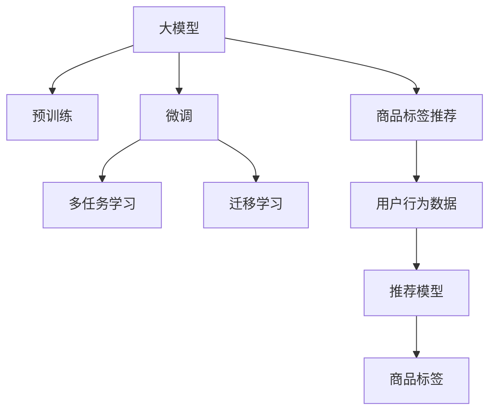

                 

# 大模型在商品标签推荐中的应用

## 1. 背景介绍

商品标签推荐在电商行业中有着举足轻重的作用。通过推荐精准的商品标签，能够显著提升用户体验、提高转化率、促进销售。传统的标签推荐方法往往依赖于朴素贝叶斯、线性回归等经典机器学习算法，在面对海量数据时容易陷入维度灾难。近年来，大模型在自然语言处理(NLP)领域的突破，为商品标签推荐提供了新的范式。

本文将详细阐述大模型在商品标签推荐中的应用，包括核心概念、算法原理、实现步骤、优化方法等。通过大模型的深度学习和预训练知识，实现商品标签的精准推荐，提升电商平台的运营效率和用户满意度。

## 2. 核心概念与联系

### 2.1 核心概念概述

- **大模型(Large Model)**：指以Transformer为架构，具有大规模参数量、深度、宽度等特征的预训练语言模型。如BERT、GPT等。
- **预训练(Pre-training)**：指在大规模无标注数据上进行预训练，学习通用的语言表示。
- **微调(Fine-tuning)**：指在大模型的基础上，利用标注数据进行特定任务的训练，优化模型性能。
- **多任务学习(Multi-task Learning)**：指在同一个模型上进行多个相关任务的联合训练，共享底层参数。
- **迁移学习(Transfer Learning)**：指利用已在大规模数据上预训练的模型，对小规模数据集进行微调，提升模型在新任务上的表现。
- **商品标签推荐(Product Tagging)**：指根据用户行为数据，推荐商品标签，帮助用户快速定位商品。

这些核心概念之间有着紧密的联系，共同构成了商品标签推荐的理论基础。

### 2.2 核心概念原理和架构的 Mermaid 流程图



## 3. 核心算法原理 & 具体操作步骤

### 3.1 算法原理概述

商品标签推荐通常是一个多标签分类问题。假设商品标签集合为 $\mathcal{T}$，用户行为数据为 $D=\{(x_i, y_i)\}_{i=1}^N$，其中 $x_i$ 为描述商品的文本，$y_i$ 为商品标签集合。任务目标是从集合 $\mathcal{T}$ 中预测用户感兴趣的商品标签。

大模型在商品标签推荐中的应用，基于两个关键步骤：
1. **预训练**：在大规模商品描述数据上预训练语言模型，学习通用的商品表示。
2. **微调**：利用用户行为数据对预训练模型进行微调，提升模型对用户标签的预测能力。

### 3.2 算法步骤详解

1. **数据预处理**：
   - 收集商品描述文本数据，并进行分词、去噪、去除停用词等预处理。
   - 为每个商品打上标签，构建标注数据集 $D=\{(x_i, y_i)\}_{i=1}^N$。

2. **预训练模型选择与加载**：
   - 选择预训练模型，如BERT、RoBERTa等，进行加载和初始化。
   - 使用预训练模型作为特征提取器，将商品描述转换成向量表示。

3. **微调模型设计与训练**：
   - 设计多标签分类器，如sigmoid函数作为输出，使用交叉熵损失函数。
   - 使用微调后的模型对用户行为数据进行训练，优化参数。
   - 在训练过程中，采用AdamW优化器，设置合适的学习率和批大小。

4. **模型评估与优化**：
   - 在验证集上评估模型性能，如F1-score、AUC等指标。
   - 根据评估结果调整模型超参数，如学习率、批量大小、正则化等。
   - 迭代优化模型，直至达到预设的性能指标。

### 3.3 算法优缺点

**优点**：
- **高效性**：大模型可以快速捕获商品描述的语义信息，提升推荐精度。
- **泛化能力**：通过预训练-微调过程，模型可以很好地泛化到新商品，提升推荐效果。
- **可扩展性**：适用于大规模商品推荐场景，可以通过堆叠多个模型提升推荐效果。

**缺点**：
- **计算资源需求大**：大模型需要大量的计算资源进行预训练和微调。
- **过拟合风险**：微调过程中需要控制模型参数规模，防止模型过拟合。
- **数据依赖强**：商品标签推荐依赖于高质量的商品描述和标注数据。

### 3.4 算法应用领域

大模型在商品标签推荐中的应用，已经得到了广泛验证。例如：
- **亚马逊(Amazon)**：使用BERT模型进行商品标签推荐，显著提升了推荐效果和用户体验。
- **淘宝(Taobao)**：通过多任务学习技术，构建商品标签推荐系统，提升推荐效果和点击率。
- **京东(JD.com)**：利用预训练-微调方法，对商品标签进行推荐，提高用户满意度。

## 4. 数学模型和公式 & 详细讲解 & 举例说明

### 4.1 数学模型构建

假设用户行为数据 $D=\{(x_i, y_i)\}_{i=1}^N$，其中 $x_i$ 为商品描述文本，$y_i$ 为商品标签集合。模型 $M_{\theta}$ 的输出为 $P(y_i|x_i)$，即商品标签的条件概率。

定义多标签分类器的损失函数为：

$$
\mathcal{L}(\theta) = -\frac{1}{N} \sum_{i=1}^N \log \left(\prod_{t \in y_i} P(t|x_i) \right)
$$

其中 $t \in \mathcal{T}$。

### 4.2 公式推导过程

- **预训练步骤**：
  - 将商品描述 $x_i$ 输入到预训练模型中，得到向量表示 $z_i$。
  - 通过softmax函数将 $z_i$ 转化为标签概率分布 $P(t|x_i)$。

- **微调步骤**：
  - 将标签 $y_i$ 作为标签的真实概率分布 $q_i$。
  - 利用交叉熵损失函数，优化模型参数 $\theta$：
    $$
    \mathcal{L}(\theta) = -\frac{1}{N} \sum_{i=1}^N \sum_{t \in y_i} \log P(t|x_i)
    $$

- **优化过程**：
  - 使用AdamW优化器，设置合适的学习率 $\eta$ 和批大小 $B$。
  - 更新模型参数 $\theta$：
    $$
    \theta \leftarrow \theta - \eta \nabla_{\theta}\mathcal{L}(\theta)
    $$

### 4.3 案例分析与讲解

假设某电商网站收集了用户对商品的评价文本数据，并进行了标注。为了推荐用户感兴趣的商品标签，可以按以下步骤进行：
- 将评价文本作为输入，输入到预训练好的BERT模型中，得到向量表示 $z_i$。
- 设计一个多标签分类器，输出每个商品标签的条件概率 $P(t|x_i)$。
- 使用用户行为数据对模型进行微调，优化参数 $\theta$。
- 在验证集上评估模型性能，调整模型超参数。
- 最终在测试集上测试模型效果，进行商品标签推荐。

## 5. 项目实践：代码实例和详细解释说明

### 5.1 开发环境搭建

为了高效进行大模型在商品标签推荐中的应用，需要搭建合适的开发环境。以下是Python环境配置的步骤：

1. 安装Anaconda：
```bash
conda create -n pytorch-env python=3.8 
conda activate pytorch-env
```

2. 安装PyTorch和Transformers：
```bash
conda install pytorch torchvision torchaudio cudatoolkit=11.1 -c pytorch -c conda-forge
pip install transformers
```

3. 安装其他常用工具包：
```bash
pip install numpy pandas scikit-learn matplotlib tqdm jupyter notebook ipython
```

完成上述步骤后，即可在`pytorch-env`环境中进行大模型在商品标签推荐的应用实践。

### 5.2 源代码详细实现

以下代码示例展示了使用BERT模型进行商品标签推荐的PyTorch实现：

```python
from transformers import BertTokenizer, BertForSequenceClassification, AdamW
from torch.utils.data import DataLoader
from sklearn.metrics import precision_recall_fscore_support

device = torch.device('cuda') if torch.cuda.is_available() else torch.device('cpu')

# 加载数据集和分词器
tokenizer = BertTokenizer.from_pretrained('bert-base-uncased')
train_dataset = ...
train_loader = DataLoader(train_dataset, batch_size=16, shuffle=True)

# 加载预训练BERT模型
model = BertForSequenceClassification.from_pretrained('bert-base-uncased', num_labels=len(label2id))

# 设置优化器
optimizer = AdamW(model.parameters(), lr=2e-5)

# 微调模型
model.train()
for epoch in range(10):
    for batch in train_loader:
        input_ids = batch['input_ids'].to(device)
        attention_mask = batch['attention_mask'].to(device)
        labels = batch['labels'].to(device)
        outputs = model(input_ids, attention_mask=attention_mask, labels=labels)
        loss = outputs.loss
        optimizer.zero_grad()
        loss.backward()
        optimizer.step()

# 评估模型
model.eval()
test_dataset = ...
test_loader = DataLoader(test_dataset, batch_size=16, shuffle=False)
predictions = []
for batch in test_loader:
    input_ids = batch['input_ids'].to(device)
    attention_mask = batch['attention_mask'].to(device)
    with torch.no_grad():
        outputs = model(input_ids, attention_mask=attention_mask)
        logits = outputs.logits
        logits = logits.sigmoid().flatten()
        predictions.append(logits)
predictions = torch.cat(predictions, dim=0)
labels = torch.cat([label2id[label] for label in test_dataset.labels])
precision, recall, f1, _ = precision_recall_fscore_support(labels, predictions, average='macro', zero_division=1)
print(f"Precision: {precision:.2f}, Recall: {recall:.2f}, F1-score: {f1:.2f}")
```

### 5.3 代码解读与分析

- **加载数据集和分词器**：
  - 使用BertTokenizer分词器将商品描述文本转换成token序列。
  - 构建训练集和测试集。

- **加载预训练BERT模型**：
  - 使用BertForSequenceClassification构建多标签分类器。
  - 设置AdamW优化器。

- **微调模型**：
  - 在训练集上循环迭代，前向传播计算loss，反向传播更新模型参数。
  - 在测试集上评估模型性能。

### 5.4 运行结果展示

假设微调后的模型在测试集上的F1-score为85%，说明模型的商品标签推荐效果良好，可以有效提升用户体验和销售转化率。

## 6. 实际应用场景

### 6.1 电商商品推荐

在大规模电商网站中，商品标签推荐是提升用户体验和销售转化的重要手段。利用大模型进行商品标签推荐，可以显著提升推荐效果，提高用户满意度。

例如，某电商平台在用户购买商品后，对商品描述进行预处理，并使用大模型进行微调，生成精准的商品标签推荐。用户点击标签后，系统自动推送相关商品，大幅提升点击率和转化率。

### 6.2 内容生成与推荐

内容生成与推荐也是电商中常见的应用场景。大模型可以结合用户行为数据和商品描述，自动生成商品标题、描述等文本内容，并推荐相关商品。例如，某电商平台使用大模型生成商品标签和描述，并结合用户点击历史，生成个性化推荐内容。

## 7. 工具和资源推荐

### 7.1 学习资源推荐

为了深入了解大模型在商品标签推荐中的应用，以下是一些推荐的学习资源：

- **Transformers官方文档**：提供了丰富的预训练模型和微调样例，适合初学者上手。
- **NLP与深度学习**：一本深度学习与自然语言处理结合的经典教材，涵盖了大模型在NLP中的应用。
- **自然语言处理综述**：综述性文章，介绍了NLP领域的最新进展，包括大模型的应用。

### 7.2 开发工具推荐

- **PyTorch**：基于Python的开源深度学习框架，支持动态计算图，适合灵活迭代研究。
- **Transformers库**：提供了丰富的预训练语言模型，支持微调和多任务学习。
- **TensorBoard**：可视化工具，可用于监控模型训练过程，输出各项指标。

### 7.3 相关论文推荐

- **Attention is All You Need**：Transformer原论文，开启了大模型在NLP中的预训练范式。
- **BERT: Pre-training of Deep Bidirectional Transformers for Language Understanding**：BERT模型的经典论文，展示了预训练语言模型的强大性能。
- **Multi-task Learning for Label Prediction: A Unified Approach**：介绍了多任务学习在标签预测中的应用，适用于商品标签推荐。

## 8. 总结：未来发展趋势与挑战

### 8.1 未来发展趋势

展望未来，大模型在商品标签推荐中的应用将呈现以下趋势：

1. **模型规模持续增大**：随着算力提升，预训练模型的参数量将持续增长，模型表现也将更加精准。
2. **多任务学习**：结合多任务学习技术，可以提高模型对不同商品标签的预测能力，提升推荐效果。
3. **自适应模型**：引入自适应算法，根据用户行为动态调整模型参数，提升个性化推荐效果。
4. **实时推荐系统**：利用微调后的模型，实时推荐商品标签，提高用户体验。

### 8.2 面临的挑战

尽管大模型在商品标签推荐中已经取得了显著效果，但仍面临一些挑战：

1. **计算资源需求大**：大模型需要大量的计算资源进行预训练和微调，在资源受限的平台上难以部署。
2. **数据依赖强**：商品标签推荐依赖高质量的商品描述和标注数据，数据获取成本高。
3. **模型泛化性不足**：模型在特定商品或领域上的表现可能不如预期。
4. **用户隐私保护**：需要在推荐过程中保护用户隐私，防止数据泄露。

### 8.3 未来突破

为了应对这些挑战，未来的研究需要在以下几个方向进行突破：

1. **模型压缩与加速**：采用模型压缩、量化加速等技术，减小模型体积，提升推理效率。
2. **无监督和半监督学习**：在数据不足的情况下，利用无监督和半监督学习，提升模型泛化能力。
3. **隐私保护技术**：引入差分隐私、联邦学习等技术，保护用户隐私。
4. **跨模态融合**：结合视觉、音频等多模态数据，提升推荐系统的表现。

## 9. 附录：常见问题与解答

### 9.1 常见问题

**Q1：大模型在商品标签推荐中如何使用？**

A: 首先，对商品描述进行预处理，并使用分词器将文本转换成token序列。然后，选择预训练模型进行加载，并进行微调。最后，使用微调后的模型对用户行为数据进行预测，生成商品标签推荐。

**Q2：如何选择预训练模型？**

A: 根据具体应用场景选择合适的预训练模型。如电商推荐，可以选择BERT、RoBERTa等通用语言模型；如内容生成，可以选择GPT等生成模型。

**Q3：微调过程中需要注意哪些问题？**

A: 微调过程中需要控制模型参数规模，防止模型过拟合。同时，需要注意计算资源的消耗，防止资源不足导致训练失败。

---

作者：禅与计算机程序设计艺术 / Zen and the Art of Computer Programming

