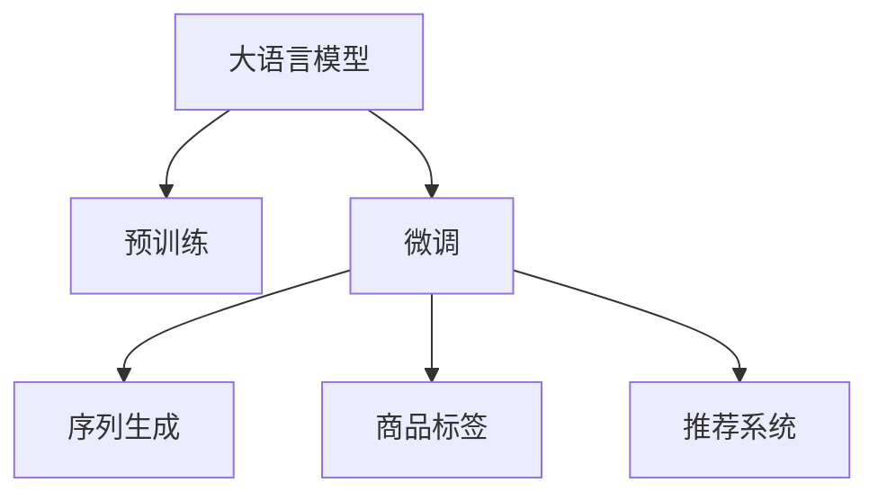

                 

# 大模型在商品标签自动生成中的应用

> 关键词：大模型,自动生成,商品标签,推荐系统,自然语言处理,深度学习,算法优化

## 1. 背景介绍

### 1.1 问题由来

在电子商务领域，商品标签自动生成是一个重要且复杂的问题。传统的手动标注商品标签方式效率低下，成本高昂，且难以保证标注的质量和一致性。而利用深度学习技术进行商品标签自动生成，可以大幅提升标注效率和准确度，同时为商品推荐、搜索等应用提供更丰富的语义信息。

近年来，随着大语言模型和大规模预训练技术的发展，利用大模型进行商品标签自动生成成为了可能。大模型如BERT、GPT等，通过在海量无标签文本数据上进行预训练，学习到了丰富的语言表示，具备强大的自然语言理解和生成能力，可以灵活地应用于商品标签自动生成等自然语言处理任务中。

### 1.2 问题核心关键点

商品标签自动生成的核心在于将商品的描述信息转换成特定的标签，以便更好地用于推荐、搜索等应用场景。大模型通过在商品描述文本上进行微调，能够自动学习商品标签的生成规则，进而生成高质量的商品标签。

主要问题包括：
1. 如何选择合适的模型进行微调。
2. 如何设计合理的损失函数和任务适配层。
3. 如何在有限的数据集上获得较好的生成效果。
4. 如何平衡生成的标签多样性和准确性。
5. 如何进一步提升生成效率和可解释性。

## 2. 核心概念与联系

### 2.1 核心概念概述

为更好地理解基于大模型的商品标签自动生成方法，本节将介绍几个密切相关的核心概念：

- 大语言模型(Large Language Model, LLM)：以BERT、GPT为代表的大规模预训练语言模型。通过在海量无标签文本语料上进行预训练，学习通用的语言表示，具备强大的语言理解和生成能力。

- 预训练(Pre-training)：指在大规模无标签文本语料上，通过自监督学习任务训练通用语言模型的过程。常见的预训练任务包括言语建模、掩码语言模型等。

- 微调(Fine-tuning)：指在预训练模型的基础上，使用下游任务的少量标注数据，通过有监督地训练优化模型在特定任务上的性能。通常只需要调整顶层分类器或解码器，并以较小的学习率更新全部或部分的模型参数。

- 自然语言处理(Natural Language Processing, NLP)：涉及计算机对自然语言的理解和生成，涵盖语言模型、语义理解、文本生成等多个领域。

- 深度学习(Deep Learning)：一种基于神经网络的机器学习方法，通过多层次的特征提取和变换，实现对复杂数据结构的建模。

- 推荐系统(Recommendation System)：通过分析用户行为和商品特征，为用户推荐感兴趣的商品，提升用户体验和满意度。

- 序列生成(Sequence Generation)：指根据输入序列生成相应的输出序列，如文本生成、语音合成等。

这些核心概念之间的逻辑关系可以通过以下Mermaid流程图来展示：



这个流程图展示了大语言模型的核心概念及其之间的关系：

1. 大语言模型通过预训练获得基础能力。
2. 微调是对预训练模型进行任务特定的优化，可以为商品标签自动生成提供模型基础。
3. 商品标签自动生成可以看作一种序列生成任务。
4. 推荐系统可以利用生成的商品标签进行推荐。

这些概念共同构成了大模型在商品标签自动生成任务中的应用框架，使其能够在各种场景下发挥强大的语言理解和生成能力。通过理解这些核心概念，我们可以更好地把握大模型在商品标签自动生成中的工作原理和优化方向。

## 3. 核心算法原理 & 具体操作步骤
### 3.1 算法原理概述

基于大模型的商品标签自动生成方法，本质上是一种序列生成问题。其核心思想是：将商品的描述信息作为输入序列，通过大模型预测生成相应的标签序列，从而完成商品标签自动生成任务。

形式化地，假设大模型为 $M_{\theta}$，其中 $\theta$ 为模型参数。给定商品描述 $x=\{x_i\}_{i=1}^n$，商品标签序列 $y=\{y_i\}_{i=1}^m$，商品标签自动生成的目标是最小化预测标签与真实标签之间的差异，即：

$$
\min_{\theta} \sum_{i=1}^m \ell(y_i, \hat{y}_i) 
$$

其中 $\hat{y}_i = M_{\theta}(x_{i-1})$ 为模型在输入 $x_{i-1}$ 上的预测输出。$\ell$ 为损失函数，可以是交叉熵损失、均方误差损失等。

通过梯度下降等优化算法，微调过程不断更新模型参数 $\theta$，最小化上述损失函数，使得模型输出逼近真实标签。由于 $\theta$ 已经通过预训练获得了较好的初始化，因此即便在小规模数据集上，也能较快收敛到理想的模型参数。

### 3.2 算法步骤详解

基于大模型的商品标签自动生成方法一般包括以下几个关键步骤：

**Step 1: 准备预训练模型和数据集**
- 选择合适的预训练语言模型 $M_{\theta}$ 作为初始化参数，如 BERT、GPT等。
- 准备商品描述数据集 $D=\{(x_i, y_i)\}_{i=1}^N$，其中 $x_i$ 为商品描述文本，$y_i$ 为对应标签序列。

**Step 2: 添加任务适配层**
- 根据商品标签自动生成任务的特点，在预训练模型顶层设计合适的输出层和损失函数。
- 对于分类任务，通常在顶层添加线性分类器和交叉熵损失函数。
- 对于生成任务，通常使用语言模型的解码器输出概率分布，并以负对数似然为损失函数。

**Step 3: 设置微调超参数**
- 选择合适的优化算法及其参数，如 AdamW、SGD 等，设置学习率、批大小、迭代轮数等。
- 设置正则化技术及强度，包括权重衰减、Dropout、Early Stopping 等。
- 确定冻结预训练参数的策略，如仅微调顶层，或全部参数都参与微调。

**Step 4: 执行梯度训练**
- 将商品描述数据分批次输入模型，前向传播计算损失函数。
- 反向传播计算参数梯度，根据设定的优化算法和学习率更新模型参数。
- 周期性在验证集上评估模型性能，根据性能指标决定是否触发 Early Stopping。
- 重复上述步骤直到满足预设的迭代轮数或 Early Stopping 条件。

**Step 5: 测试和部署**
- 在测试集上评估微调后模型 $M_{\hat{\theta}}$ 的性能，对比微调前后的精度提升。
- 使用微调后的模型对新商品描述进行预测，生成相应的商品标签序列。
- 持续收集新的商品描述数据，定期重新微调模型，以适应数据分布的变化。

以上是基于大模型进行商品标签自动生成的一般流程。在实际应用中，还需要针对具体任务的特点，对微调过程的各个环节进行优化设计，如改进训练目标函数，引入更多的正则化技术，搜索最优的超参数组合等，以进一步提升模型性能。

### 3.3 算法优缺点

基于大模型的商品标签自动生成方法具有以下优点：
1. 精度高：大模型通过预训练学习到了丰富的语言知识，在微调后能较好地捕捉商品描述中的语义信息，生成高质量的商品标签。
2. 灵活性强：适用于各种类型的商品描述，如文本、图片、音频等，具有较强的泛化能力。
3. 可解释性好：大模型可以根据输入描述直接生成标签序列，无需额外的标注数据，有助于理解生成过程。

同时，该方法也存在一定的局限性：
1. 数据依赖性强：生成效果依赖于商品描述数据的质量和多样性，如果商品描述过于简单或重复，模型性能可能受到影响。
2. 资源消耗大：大规模语言模型的计算资源消耗大，训练和推理成本较高。
3. 模型复杂度高：大模型参数量庞大，推理速度较慢，难以在大规模实时系统中部署。
4. 对抗样本敏感：大模型可能对输入的对抗样本（如噪声、恶意描述等）较敏感，影响生成质量。

尽管存在这些局限性，但就目前而言，基于大模型的商品标签自动生成方法仍是一种高效、准确的解决方案。未来相关研究的重点在于如何进一步降低资源消耗，提高生成效率和鲁棒性，同时兼顾可解释性和灵活性等因素。

### 3.4 算法应用领域

基于大模型的商品标签自动生成方法，已经在商品推荐、搜索、广告等多个电商领域得到了广泛应用，提升了用户体验和商家的营销效果。

具体而言，商品标签自动生成可以应用于以下场景：

- 商品推荐：为个性化推荐系统提供更丰富的商品标签信息，提高推荐准确率和多样性。
- 商品搜索：自动生成商品标签，作为商品信息的一部分，供搜索引擎索引和匹配。
- 广告投放：根据商品描述自动生成标签，提高广告定向的精确性和效果。
- 内容生成：自动生成商品标签，辅助文本生成、图像标注等内容的生成。

除了上述这些经典应用外，大模型的商品标签自动生成方法还在个性化广告推荐、营销文案生成、客服机器人对话等创新场景中得到应用，拓展了电商领域的智能应用边界。

## 4. 数学模型和公式 & 详细讲解  
### 4.1 数学模型构建

本节将使用数学语言对基于大模型的商品标签自动生成过程进行更加严格的刻画。

记大模型为 $M_{\theta}$，其中 $\theta$ 为模型参数。给定商品描述 $x=\{x_i\}_{i=1}^n$，商品标签序列 $y=\{y_i\}_{i=1}^m$。商品标签自动生成的目标是最小化预测标签与真实标签之间的差异，即：

$$
\min_{\theta} \sum_{i=1}^m \ell(y_i, \hat{y}_i) 
$$

其中 $\hat{y}_i = M_{\theta}(x_{i-1})$ 为模型在输入 $x_{i-1}$ 上的预测输出。$\ell$ 为损失函数，可以是交叉熵损失、均方误差损失等。

通过梯度下降等优化算法，微调过程不断更新模型参数 $\theta$，最小化上述损失函数，使得模型输出逼近真实标签。由于 $\theta$ 已经通过预训练获得了较好的初始化，因此即便在小规模数据集上，也能较快收敛到理想的模型参数。

### 4.2 公式推导过程

以下我们以分类任务为例，推导交叉熵损失函数及其梯度的计算公式。

假设模型 $M_{\theta}$ 在输入 $x$ 上的输出为 $\hat{y}=M_{\theta}(x) \in [0,1]$，表示样本属于类别 $k$ 的概率。真实标签 $y \in \{0,1\}$。则分类任务交叉熵损失函数定义为：

$$
\ell(M_{\theta}(x),y) = -y\log \hat{y} + (1-y)\log (1-\hat{y})
$$

将其代入目标函数，得：

$$
\mathcal{L}(\theta) = -\frac{1}{N}\sum_{i=1}^N \sum_{j=1}^m [y_{ij}\log \hat{y}_{ij} + (1-y_{ij})\log (1-\hat{y}_{ij})]
$$

其中 $y_{ij}$ 表示商品描述 $x_i$ 中第 $j$ 个标签 $y_j$。根据链式法则，损失函数对参数 $\theta_k$ 的梯度为：

$$
\frac{\partial \mathcal{L}(\theta)}{\partial \theta_k} = -\frac{1}{N}\sum_{i=1}^N \sum_{j=1}^m \left(\frac{y_{ij}}{\hat{y}_{ij}}-\frac{1-y_{ij}}{1-\hat{y}_{ij}}\right) \frac{\partial M_{\theta}(x_i)}{\partial \theta_k}
$$

其中 $\frac{\partial M_{\theta}(x_i)}{\partial \theta_k}$ 可进一步递归展开，利用自动微分技术完成计算。

在得到损失函数的梯度后，即可带入参数更新公式，完成模型的迭代优化。重复上述过程直至收敛，最终得到适应商品标签自动生成任务的最优模型参数 $\theta^*$。

## 5. 项目实践：代码实例和详细解释说明
### 5.1 开发环境搭建

在进行商品标签自动生成实践前，我们需要准备好开发环境。以下是使用Python进行PyTorch开发的环境配置流程：

1. 安装Anaconda：从官网下载并安装Anaconda，用于创建独立的Python环境。

2. 创建并激活虚拟环境：
```bash
conda create -n pytorch-env python=3.8 
conda activate pytorch-env
```

3. 安装PyTorch：根据CUDA版本，从官网获取对应的安装命令。例如：
```bash
conda install pytorch torchvision torchaudio cudatoolkit=11.1 -c pytorch -c conda-forge
```

4. 安装Transformers库：
```bash
pip install transformers
```

5. 安装各类工具包：
```bash
pip install numpy pandas scikit-learn matplotlib tqdm jupyter notebook ipython
```

完成上述步骤后，即可在`pytorch-env`环境中开始商品标签自动生成实践。

### 5.2 源代码详细实现

下面我们以商品描述分类任务为例，给出使用Transformers库对BERT模型进行商品标签自动生成的PyTorch代码实现。

首先，定义分类任务的数据处理函数：

```python
from transformers import BertTokenizer
from torch.utils.data import Dataset
import torch

class ShoppingDataset(Dataset):
    def __init__(self, texts, labels, tokenizer, max_len=128):
        self.texts = texts
        self.labels = labels
        self.tokenizer = tokenizer
        self.max_len = max_len
        
    def __len__(self):
        return len(self.texts)
    
    def __getitem__(self, item):
        text = self.texts[item]
        label = self.labels[item]
        
        encoding = self.tokenizer(text, return_tensors='pt', max_length=self.max_len, padding='max_length', truncation=True)
        input_ids = encoding['input_ids'][0]
        attention_mask = encoding['attention_mask'][0]
        
        # 对label进行编码
        label_ids = [label2id[label] for label in label]
        label_ids.extend([label2id['O']] * (self.max_len - len(label_ids)))
        labels = torch.tensor(label_ids, dtype=torch.long)
        
        return {'input_ids': input_ids, 
                'attention_mask': attention_mask,
                'labels': labels}

# 标签与id的映射
label2id = {'O': 0, 'A': 1, 'B': 2, 'C': 3, 'D': 4}
id2label = {v: k for k, v in label2id.items()}

# 创建dataset
tokenizer = BertTokenizer.from_pretrained('bert-base-cased')

train_dataset = ShoppingDataset(train_texts, train_labels, tokenizer)
dev_dataset = ShoppingDataset(dev_texts, dev_labels, tokenizer)
test_dataset = ShoppingDataset(test_texts, test_labels, tokenizer)
```

然后，定义模型和优化器：

```python
from transformers import BertForTokenClassification, AdamW

model = BertForTokenClassification.from_pretrained('bert-base-cased', num_labels=len(label2id))

optimizer = AdamW(model.parameters(), lr=2e-5)
```

接着，定义训练和评估函数：

```python
from torch.utils.data import DataLoader
from tqdm import tqdm
from sklearn.metrics import classification_report

device = torch.device('cuda') if torch.cuda.is_available() else torch.device('cpu')
model.to(device)

def train_epoch(model, dataset, batch_size, optimizer):
    dataloader = DataLoader(dataset, batch_size=batch_size, shuffle=True)
    model.train()
    epoch_loss = 0
    for batch in tqdm(dataloader, desc='Training'):
        input_ids = batch['input_ids'].to(device)
        attention_mask = batch['attention_mask'].to(device)
        labels = batch['labels'].to(device)
        model.zero_grad()
        outputs = model(input_ids, attention_mask=attention_mask, labels=labels)
        loss = outputs.loss
        epoch_loss += loss.item()
        loss.backward()
        optimizer.step()
    return epoch_loss / len(dataloader)

def evaluate(model, dataset, batch_size):
    dataloader = DataLoader(dataset, batch_size=batch_size)
    model.eval()
    preds, labels = [], []
    with torch.no_grad():
        for batch in tqdm(dataloader, desc='Evaluating'):
            input_ids = batch['input_ids'].to(device)
            attention_mask = batch['attention_mask'].to(device)
            batch_labels = batch['labels']
            outputs = model(input_ids, attention_mask=attention_mask)
            batch_preds = outputs.logits.argmax(dim=2).to('cpu').tolist()
            batch_labels = batch_labels.to('cpu').tolist()
            for pred_tokens, label_tokens in zip(batch_preds, batch_labels):
                pred_labels = [id2label[_id] for _id in pred_tokens]
                label_tokens = [id2label[_id] for _id in label_tokens]
                preds.append(pred_labels[:len(label_tokens)])
                labels.append(label_tokens)
                
    print(classification_report(labels, preds))
```

最后，启动训练流程并在测试集上评估：

```python
epochs = 5
batch_size = 16

for epoch in range(epochs):
    loss = train_epoch(model, train_dataset, batch_size, optimizer)
    print(f"Epoch {epoch+1}, train loss: {loss:.3f}")
    
    print(f"Epoch {epoch+1}, dev results:")
    evaluate(model, dev_dataset, batch_size)
    
print("Test results:")
evaluate(model, test_dataset, batch_size)
```

以上就是使用PyTorch对BERT进行商品标签分类任务微调的完整代码实现。可以看到，得益于Transformers库的强大封装，我们可以用相对简洁的代码完成BERT模型的加载和微调。

### 5.3 代码解读与分析

让我们再详细解读一下关键代码的实现细节：

**ShoppingDataset类**：
- `__init__`方法：初始化商品描述、标签、分词器等关键组件。
- `__len__`方法：返回数据集的样本数量。
- `__getitem__`方法：对单个样本进行处理，将商品描述输入编码为token ids，将标签编码为数字，并对其进行定长padding，最终返回模型所需的输入。

**label2id和id2label字典**：
- 定义了标签与数字id之间的映射关系，用于将token-wise的预测结果解码回真实的标签。

**训练和评估函数**：
- 使用PyTorch的DataLoader对数据集进行批次化加载，供模型训练和推理使用。
- 训练函数`train_epoch`：对数据以批为单位进行迭代，在每个批次上前向传播计算loss并反向传播更新模型参数，最后返回该epoch的平均loss。
- 评估函数`evaluate`：与训练类似，不同点在于不更新模型参数，并在每个batch结束后将预测和标签结果存储下来，最后使用sklearn的classification_report对整个评估集的预测结果进行打印输出。

**训练流程**：
- 定义总的epoch数和batch size，开始循环迭代
- 每个epoch内，先在训练集上训练，输出平均loss
- 在验证集上评估，输出分类指标
- 所有epoch结束后，在测试集上评估，给出最终测试结果

可以看到，PyTorch配合Transformers库使得BERT微调的代码实现变得简洁高效。开发者可以将更多精力放在数据处理、模型改进等高层逻辑上，而不必过多关注底层的实现细节。

当然，工业级的系统实现还需考虑更多因素，如模型的保存和部署、超参数的自动搜索、更灵活的任务适配层等。但核心的微调范式基本与此类似。

## 6. 实际应用场景
### 6.1 智能推荐系统

商品标签自动生成在智能推荐系统中具有重要应用。传统的商品推荐系统主要依赖用户的历史行为数据进行推荐，难以充分挖掘商品描述中的语义信息。利用商品标签自动生成，可以更好地理解商品的属性、特点、价格等信息，从而提升推荐效果。

具体而言，商品标签自动生成可以为推荐系统提供多维度、高精度的商品特征，如商品类别、品牌、材质等。通过将商品描述自动编码为标签序列，推荐系统可以更准确地捕捉商品之间的关联关系，为用户推荐更多相似、互补的商品，提高用户的满意度。

### 6.2 搜索排序优化

电子商务平台每天需要处理海量的搜索请求，高效的搜索排序算法至关重要。传统的搜索结果排序算法主要依赖关键词匹配，难以充分理解商品描述的语义信息。利用商品标签自动生成，可以为搜索排序提供更丰富的语义信息，提升搜索结果的相关性和准确性。

具体而言，商品标签自动生成可以自动解析商品描述中的关键信息，如商品名称、型号、功能等，作为搜索结果中的辅助信息。通过将商品描述自动编码为标签序列，搜索排序算法可以根据标签信息对搜索结果进行排序，提高搜索结果的相关性和召回率，提升用户的搜索体验。

### 6.3 广告投放优化

广告投放是电商平台的重要营收来源。传统的广告投放主要依赖关键词匹配，难以充分理解广告素材的语义信息。利用商品标签自动生成，可以为广告投放提供更丰富的语义信息，提升广告投放的效果。

具体而言，商品标签自动生成可以自动解析商品描述中的关键信息，如商品名称、型号、功能等，作为广告素材的一部分。通过将商品描述自动编码为标签序列，广告投放系统可以根据标签信息对广告素材进行筛选，选择与用户兴趣更匹配的广告，提升广告的点击率和转化率，提高广告投放的ROI。

### 6.4 未来应用展望

随着大模型和微调技术的不断发展，基于大模型的商品标签自动生成方法将在更多领域得到应用，为电商产业带来变革性影响。

在智能客服系统、广告投放优化、个性化推荐、营销文案生成等领域，商品标签自动生成将成为不可或缺的关键技术。利用商品标签自动生成，电商平台可以更好地理解用户需求，精准匹配商品，提升用户体验和商家营收。

## 7. 工具和资源推荐
### 7.1 学习资源推荐

为了帮助开发者系统掌握大模型进行商品标签自动生成的理论基础和实践技巧，这里推荐一些优质的学习资源：

1. 《Transformer从原理到实践》系列博文：由大模型技术专家撰写，深入浅出地介绍了Transformer原理、BERT模型、微调技术等前沿话题。

2. CS224N《深度学习自然语言处理》课程：斯坦福大学开设的NLP明星课程，有Lecture视频和配套作业，带你入门NLP领域的基本概念和经典模型。

3. 《Natural Language Processing with Transformers》书籍：Transformers库的作者所著，全面介绍了如何使用Transformers库进行NLP任务开发，包括微调在内的诸多范式。

4. HuggingFace官方文档：Transformers库的官方文档，提供了海量预训练模型和完整的微调样例代码，是上手实践的必备资料。

5. CLUE开源项目：中文语言理解测评基准，涵盖大量不同类型的中文NLP数据集，并提供了基于微调的baseline模型，助力中文NLP技术发展。

通过对这些资源的学习实践，相信你一定能够快速掌握大模型在商品标签自动生成中的精髓，并用于解决实际的NLP问题。
###  7.2 开发工具推荐

高效的开发离不开优秀的工具支持。以下是几款用于大模型商品标签自动生成开发的常用工具：

1. PyTorch：基于Python的开源深度学习框架，灵活动态的计算图，适合快速迭代研究。大部分预训练语言模型都有PyTorch版本的实现。

2. TensorFlow：由Google主导开发的开源深度学习框架，生产部署方便，适合大规模工程应用。同样有丰富的预训练语言模型资源。

3. Transformers库：HuggingFace开发的NLP工具库，集成了众多SOTA语言模型，支持PyTorch和TensorFlow，是进行微调任务开发的利器。

4. Weights & Biases：模型训练的实验跟踪工具，可以记录和可视化模型训练过程中的各项指标，方便对比和调优。与主流深度学习框架无缝集成。

5. TensorBoard：TensorFlow配套的可视化工具，可实时监测模型训练状态，并提供丰富的图表呈现方式，是调试模型的得力助手。

6. Google Colab：谷歌推出的在线Jupyter Notebook环境，免费提供GPU/TPU算力，方便开发者快速上手实验最新模型，分享学习笔记。

合理利用这些工具，可以显著提升大模型商品标签自动生成任务的开发效率，加快创新迭代的步伐。

### 7.3 相关论文推荐

大模型和商品标签自动生成技术的发展源于学界的持续研究。以下是几篇奠基性的相关论文，推荐阅读：

1. Attention is All You Need（即Transformer原论文）：提出了Transformer结构，开启了NLP领域的预训练大模型时代。

2. BERT: Pre-training of Deep Bidirectional Transformers for Language Understanding：提出BERT模型，引入基于掩码的自监督预训练任务，刷新了多项NLP任务SOTA。

3. Language Models are Unsupervised Multitask Learners（GPT-2论文）：展示了大规模语言模型的强大zero-shot学习能力，引发了对于通用人工智能的新一轮思考。

4. Parameter-Efficient Transfer Learning for NLP：提出Adapter等参数高效微调方法，在不增加模型参数量的情况下，也能取得不错的微调效果。

5. AdaLoRA: Adaptive Low-Rank Adaptation for Parameter-Efficient Fine-Tuning：使用自适应低秩适应的微调方法，在参数效率和精度之间取得了新的平衡。

这些论文代表了大模型和微调技术的发展脉络。通过学习这些前沿成果，可以帮助研究者把握学科前进方向，激发更多的创新灵感。

## 8. 总结：未来发展趋势与挑战
### 8.1 总结

本文对基于大模型的商品标签自动生成方法进行了全面系统的介绍。首先阐述了商品标签自动生成的背景和重要性，明确了商品标签自动生成在大模型微调中的核心地位。其次，从原理到实践，详细讲解了商品标签自动生成的数学原理和关键步骤，给出了商品标签自动生成的完整代码实例。同时，本文还广泛探讨了商品标签自动生成在智能推荐、搜索排序、广告投放等电商领域的应用前景，展示了商品标签自动生成的巨大潜力。此外，本文精选了商品标签自动生成的各类学习资源，力求为读者提供全方位的技术指引。

通过本文的系统梳理，可以看到，基于大模型的商品标签自动生成方法正在成为电商领域的重要技术范式，极大地提升了电商系统的智能化和精准化程度，提升了用户的体验和商家的营收。未来，伴随大模型和微调方法的持续演进，相信商品标签自动生成必将在更多领域得到应用，为各行各业带来更深刻的变革。

### 8.2 未来发展趋势

展望未来，基于大模型的商品标签自动生成技术将呈现以下几个发展趋势：

1. 模型规模持续增大。随着算力成本的下降和数据规模的扩张，预训练语言模型的参数量还将持续增长。超大规模语言模型蕴含的丰富语言知识，有望支撑更加复杂多变的商品标签自动生成任务。

2. 微调方法日趋多样。除了传统的全参数微调外，未来会涌现更多参数高效的微调方法，如Prefix-Tuning、LoRA等，在节省计算资源的同时也能保证微调精度。

3. 序列生成性能提升。未来的模型将更擅长生成高质量、多样化的商品标签序列，减少生成结果的重复性和离群值。

4. 鲁棒性增强。大模型将更适应不同来源、不同风格的商品描述，减少对输入文本的敏感性，提升生成任务的鲁棒性。

5. 实时化部署。未来的商品标签自动生成系统将具备更强的计算性能，支持实时化的商品描述分析和标签生成，满足电商平台的动态需求。

6. 与知识图谱融合。未来的商品标签自动生成将更紧密地结合外部知识图谱，整合更多背景信息，提升生成结果的准确性和可靠性。

以上趋势凸显了大模型在商品标签自动生成中的广阔前景。这些方向的探索发展，必将进一步提升电商系统的智能程度，带来更优质的用户体验和更高的商业价值。

### 8.3 面临的挑战

尽管基于大模型的商品标签自动生成技术已经取得了显著成就，但在迈向更加智能化、普适化应用的过程中，它仍面临着诸多挑战：

1. 数据依赖性强。生成效果依赖于商品描述数据的质量和多样性，如果商品描述过于简单或重复，模型性能可能受到影响。如何进一步降低数据依赖，提高模型的泛化能力，还需要更多研究和优化。

2. 资源消耗大。大规模语言模型的计算资源消耗大，训练和推理成本较高。如何在保证生成效果的前提下，降低计算资源消耗，仍是未来需要解决的重要问题。

3. 模型复杂度高。大模型参数量庞大，推理速度较慢，难以在大规模实时系统中部署。如何降低模型复杂度，提升推理速度，优化资源占用，将是重要的优化方向。

4. 对抗样本敏感。大模型可能对输入的对抗样本（如噪声、恶意描述等）较敏感，影响生成质量。如何增强模型的鲁棒性，降低对抗攻击的风险，是未来研究的重要方向。

5. 可解释性不足。当前大模型生成的商品标签难以解释，用户和商家难以理解其生成过程和逻辑。如何赋予商品标签自动生成更强的可解释性，将是亟待攻克的难题。

6. 安全性有待保障。预训练语言模型难免会学习到有偏见、有害的信息，通过商品标签自动生成传递到电商系统，可能带来安全隐患。如何从数据和算法层面消除模型偏见，避免恶意用途，确保系统的安全性，也将是重要的研究课题。

尽管存在这些挑战，但随着大模型和微调技术的不断演进，基于大模型的商品标签自动生成必将在电商产业得到更广泛的应用，为电子商务带来更深远的影响。

### 8.4 未来突破

面对基于大模型的商品标签自动生成所面临的种种挑战，未来的研究需要在以下几个方面寻求新的突破：

1. 探索无监督和半监督微调方法。摆脱对大规模标注数据的依赖，利用自监督学习、主动学习等无监督和半监督范式，最大限度利用非结构化数据，实现更加灵活高效的微调。

2. 研究参数高效和计算高效的微调范式。开发更加参数高效的微调方法，在固定大部分预训练参数的同时，只更新极少量的任务相关参数。同时优化微调模型的计算图，减少前向传播和反向传播的资源消耗，实现更加轻量级、实时性的部署。

3. 引入更多先验知识。将符号化的先验知识，如知识图谱、逻辑规则等，与神经网络模型进行巧妙融合，引导微调过程学习更准确、合理的商品标签。同时加强不同模态数据的整合，实现视觉、语音等多模态信息与文本信息的协同建模。

4. 结合因果分析和博弈论工具。将因果分析方法引入商品标签自动生成，识别出模型决策的关键特征，增强生成结果的因果性和逻辑性。借助博弈论工具刻画用户和商家的互动过程，主动探索并规避模型的脆弱点，提高系统稳定性。

5. 纳入伦理道德约束。在商品标签自动生成的训练目标中引入伦理导向的评估指标，过滤和惩罚有偏见、有害的输出倾向。同时加强人工干预和审核，建立商品标签自动生成的监管机制，确保输出符合人类价值观和伦理道德。

这些研究方向的探索，必将引领基于大模型的商品标签自动生成技术迈向更高的台阶，为构建安全、可靠、可解释、可控的智能系统铺平道路。面向未来，基于大模型的商品标签自动生成技术还需要与其他人工智能技术进行更深入的融合，如知识表示、因果推理、强化学习等，多路径协同发力，共同推动自然语言理解和智能交互系统的进步。只有勇于创新、敢于突破，才能不断拓展大模型的边界，让智能技术更好地造福人类社会。

## 9. 附录：常见问题与解答

**Q1：大模型进行商品标签自动生成的效果如何？**

A: 大模型进行商品标签自动生成的效果通常非常好，尤其是在大规模语料上进行预训练后，模型能够自动学习到丰富的语言知识，生成的商品标签序列能够较好地反映商品描述的语义信息。但需要注意的是，生成的效果也受到商品描述数据的质量和多样性的影响，如果商品描述过于简单或重复，模型性能可能受到影响。

**Q2：大模型进行商品标签自动生成是否需要标注数据？**

A: 大模型进行商品标签自动生成通常不需要标注数据，可以利用自监督学习任务进行预训练，然后再在商品描述数据上进行微调。这样可以最大限度地利用非结构化数据，避免标注数据的成本和风险。但需要注意的是，微调过程中的超参数和损失函数设计对生成效果影响较大，需要根据具体任务进行调整。

**Q3：大模型进行商品标签自动生成的计算资源消耗大吗？**

A: 大模型进行商品标签自动生成的计算资源消耗确实较大，特别是在大规模预训练和微调过程中，需要大量的计算资源和时间。但随着算力设备的不断提升和优化，许多大模型已经在GPU/TPU等高性能设备上实现了高效部署，可以在短时间内完成大规模预训练和微调。因此，计算资源消耗虽然大，但并不是不可克服的难题。

**Q4：大模型进行商品标签自动生成的对抗样本敏感吗？**

A: 大模型进行商品标签自动生成对对抗样本可能较敏感，尤其是在对抗样本攻击下，生成的商品标签序列可能会出现错误。因此，增强模型的鲁棒性，降低对抗攻击的风险，是未来研究的重要方向。可以通过引入对抗训练、正则化等技术，提高模型对输入噪声的容忍度，增强模型的鲁棒性。

**Q5：大模型进行商品标签自动生成的可解释性如何？**

A: 大模型进行商品标签自动生成的过程通常较难解释，用户和商家难以理解其生成逻辑。因此，赋予商品标签自动生成更强的可解释性，是未来研究的重要方向。可以通过引入基于规则的推理、逻辑解释等方法，增强模型的可解释性，帮助用户和商家更好地理解生成过程和结果。

这些问题的解答，希望能帮助你更好地理解基于大模型的商品标签自动生成技术，解决实际应用中的问题。

