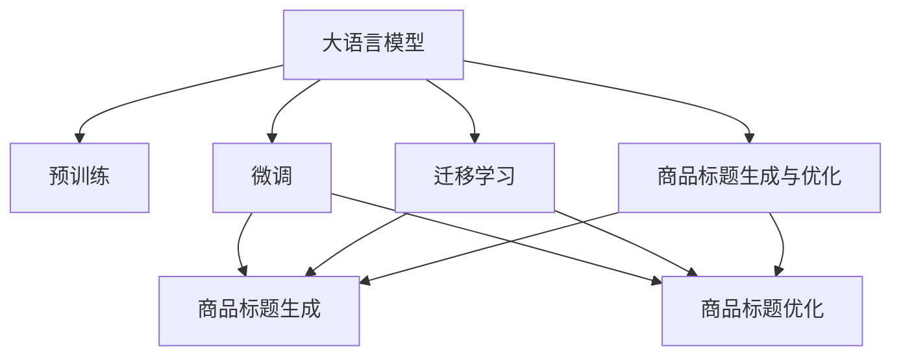

                 

# 大模型在商品标题生成与优化中的应用

## 1. 背景介绍

### 1.1 问题由来
在电子商务领域，商品标题的生成和优化是一个非常重要的任务。商品标题不仅是搜索引擎优化（SEO）的重要组成部分，而且直接影响消费者的点击率和购买决策。然而，由于商品种类繁多，且商家在撰写商品标题时往往缺乏规范和标准，导致标题质量参差不齐，严重影响了用户体验和搜索引擎的搜索结果。

大语言模型（Large Language Model, LLM），如GPT系列、BERT等，近年来在自然语言处理（Natural Language Processing, NLP）领域取得了巨大突破，广泛应用于文本生成、翻译、分类等任务。基于大模型的商品标题生成与优化方法，能够有效提高商品标题的质量和相关性，从而提升用户的购物体验和商家转化率。

### 1.2 问题核心关键点
大模型在商品标题生成与优化中的关键问题包括：
- 如何从无标签的电商数据中自动学习高质量的商品标题生成模型。
- 如何在有限的标注数据上高效优化商品标题，避免过拟合。
- 如何生成具有描述性、吸引力、易于搜索引擎优化的商品标题。
- 如何在不同商品类别和需求场景中自适应生成商品标题。

本文将详细探讨基于大模型的商品标题生成与优化方法，从核心概念、算法原理、具体实践、实际应用和未来展望等方面进行全面介绍，帮助读者系统了解该领域的研究进展和应用潜力。

## 2. 核心概念与联系

### 2.1 核心概念概述

为了更好地理解大模型在商品标题生成与优化中的应用，本节将介绍几个关键概念：

- 大语言模型(Large Language Model, LLM)：以自回归(如GPT)或自编码(如BERT)模型为代表的大规模预训练语言模型。通过在大规模无标签文本语料上进行预训练，学习通用的语言表示，具备强大的语言理解和生成能力。

- 预训练(Pre-training)：指在大规模无标签文本语料上，通过自监督学习任务训练通用语言模型的过程。常见的预训练任务包括言语建模、遮挡语言模型等。预训练使得模型学习到语言的通用表示。

- 微调(Fine-tuning)：指在预训练模型的基础上，使用下游任务的少量标注数据，通过有监督地训练来优化模型在特定任务上的性能。通常只需要调整顶层分类器或解码器，并以较小的学习率更新全部或部分的模型参数。

- 迁移学习(Transfer Learning)：指将一个领域学习到的知识，迁移应用到另一个不同但相关的领域的学习范式。大模型的预训练-微调过程即是一种典型的迁移学习方式。

- 商品标题生成：指基于商品描述信息自动生成高质量的商品标题，使其符合用户搜索习惯和市场需求。

- 商品标题优化：指基于用户的搜索行为和点击反馈，优化已生成的商品标题，提高其点击率和转化率。

这些概念之间的逻辑关系可以通过以下Mermaid流程图来展示：



这个流程图展示了大语言模型的核心概念及其之间的关系：

1. 大语言模型通过预训练获得基础能力。
2. 微调是对预训练模型进行任务特定的优化，可以分为商品标题生成和优化两个方向。
3. 迁移学习是连接预训练模型与下游任务的桥梁，可以通过微调或提示学习来实现。
4. 商品标题生成与优化是基于大语言模型的两大应用方向，与微调范式密切相关。

这些概念共同构成了大语言模型的学习和应用框架，使其能够在商品标题生成与优化中发挥强大的语言理解和生成能力。通过理解这些核心概念，我们可以更好地把握大语言模型的工作原理和优化方向。

## 3. 核心算法原理 & 具体操作步骤
### 3.1 算法原理概述

基于大模型的商品标题生成与优化，本质上是一个有监督的细粒度迁移学习过程。其核心思想是：将预训练的大语言模型视作一个强大的"特征提取器"，通过在电商数据上进行有监督的微调，使得模型输出能够生成高质量的商品标题，并进行优化，从而提升用户点击率和转化率。

形式化地，假设预训练模型为 $M_{\theta}$，其中 $\theta$ 为预训练得到的模型参数。给定电商商品标题生成任务 $T$ 的标注数据集 $D=\{(x_i,y_i)\}_{i=1}^N$，其中 $x_i$ 为商品描述，$y_i$ 为对应的商品标题，微调的目标是找到新的模型参数 $\hat{\theta}$，使得：

$$
\hat{\theta}=\mathop{\arg\min}_{\theta} \mathcal{L}(M_{\theta},D)
$$

其中 $\mathcal{L}$ 为针对任务 $T$ 设计的损失函数，用于衡量模型预测输出与真实标签之间的差异。常见的损失函数包括交叉熵损失、均方误差损失等。

通过梯度下降等优化算法，微调过程不断更新模型参数 $\theta$，最小化损失函数 $\mathcal{L}$，使得模型输出逼近真实标签。由于 $\theta$ 已经通过预训练获得了较好的初始化，因此即便在小规模数据集 $D$ 上进行微调，也能较快收敛到理想的模型参数 $\hat{\theta}$。

### 3.2 算法步骤详解

基于大模型的商品标题生成与优化一般包括以下几个关键步骤：

**Step 1: 准备预训练模型和数据集**
- 选择合适的预训练语言模型 $M_{\theta}$ 作为初始化参数，如 BERT、GPT 等。
- 准备电商商品标题生成任务 $T$ 的标注数据集 $D$，划分为训练集、验证集和测试集。一般要求标注数据与预训练数据的分布不要差异过大。

**Step 2: 添加任务适配层**
- 根据任务类型，在预训练模型顶层设计合适的输出层和损失函数。
- 对于生成任务，通常使用语言模型的解码器输出概率分布，并以负对数似然为损失函数。

**Step 3: 设置微调超参数**
- 选择合适的优化算法及其参数，如 AdamW、SGD 等，设置学习率、批大小、迭代轮数等。
- 设置正则化技术及强度，包括权重衰减、Dropout、Early Stopping等。
- 确定冻结预训练参数的策略，如仅微调顶层，或全部参数都参与微调。

**Step 4: 执行梯度训练**
- 将训练集数据分批次输入模型，前向传播计算损失函数。
- 反向传播计算参数梯度，根据设定的优化算法和学习率更新模型参数。
- 周期性在验证集上评估模型性能，根据性能指标决定是否触发 Early Stopping。
- 重复上述步骤直到满足预设的迭代轮数或 Early Stopping 条件。

**Step 5: 测试和部署**
- 在测试集上评估微调后模型 $M_{\hat{\theta}}$ 的性能，对比微调前后的精度提升。
- 使用微调后的模型对新商品描述进行推理预测，生成商品标题。
- 持续收集用户的点击反馈数据，定期重新微调模型，以适应数据分布的变化。

以上是基于大模型商品标题生成与优化的通用流程。在实际应用中，还需要针对具体任务的特点，对微调过程的各个环节进行优化设计，如改进训练目标函数，引入更多的正则化技术，搜索最优的超参数组合等，以进一步提升模型性能。

### 3.3 算法优缺点

基于大模型的商品标题生成与优化方法具有以下优点：
1. 快速高效。基于大模型进行商品标题生成与优化，可以显著减少从头开发所需的数据、计算和人力等成本投入。
2. 效果显著。微调使得通用大模型更好地适应特定任务，在商品标题生成与优化方面取得优异的性能。
3. 适应性强。大模型能够灵活适应不同商品类别和需求场景，生成具有描述性、吸引力、易于搜索引擎优化的商品标题。
4. 可扩展性好。大模型能够并行处理大规模数据集，具备良好的可扩展性，能够快速应对电商行业的动态变化。

同时，该方法也存在一定的局限性：
1. 依赖标注数据。微调的效果很大程度上取决于标注数据的质量和数量，获取高质量标注数据的成本较高。
2. 过拟合风险。尽管微调能够显著提升模型性能，但在标注数据不足的情况下，容易发生过拟合。
3. 上下文依赖。大模型生成的商品标题可能依赖于上下文信息，难以应对长尾商品或特殊需求的商品。
4. 模型复杂度高。大模型的复杂度较高，需要较高的计算资源进行训练和推理，对硬件要求较高。

尽管存在这些局限性，但就目前而言，基于大模型的商品标题生成与优化方法仍是大模型应用的重要方向之一。未来相关研究的重点在于如何进一步降低微调对标注数据的依赖，提高模型的鲁棒性和适应性，同时兼顾可解释性和伦理安全性等因素。

### 3.4 算法应用领域

基于大模型的商品标题生成与优化方法，已经广泛应用于电商平台的商品标题自动生成和优化，如淘宝、京东、亚马逊等。具体应用场景包括：

- 商品描述自动生成：对于未标注的商品，通过自动生成商品标题来增加描述信息，提升搜索相关性。
- 商品标题优化：对于已有标注的商品，根据用户的点击反馈数据，自动优化商品标题，提高点击率和转化率。
- 长尾商品优化：对于长尾商品，利用大模型生成高质量的商品标题，提升其在搜索引擎中的曝光率。
- 跨语言商品标题生成：对于国际化的电商平台，利用大模型生成不同语言的商品标题，拓展海外市场。
- 商品描述改写：对于描述信息缺失的商品，通过大模型自动改写描述，生成具有吸引力的标题和描述。

除了上述这些经典应用外，大模型在商品标题生成与优化方面的探索还在不断深入，如基于商品属性生成商品标题、基于用户个性化生成商品标题等，为电商平台的智能化升级带来了新的思路和方向。

## 4. 数学模型和公式 & 详细讲解 & 举例说明
### 4.1 数学模型构建

本节将使用数学语言对基于大模型的商品标题生成与优化过程进行更加严格的刻画。

记预训练语言模型为 $M_{\theta}$，其中 $\theta$ 为预训练得到的模型参数。假设电商商品标题生成任务 $T$ 的训练集为 $D=\{(x_i,y_i)\}_{i=1}^N$，其中 $x_i$ 为商品描述，$y_i$ 为对应的商品标题。

定义模型 $M_{\theta}$ 在输入 $x$ 上的输出为 $\hat{y}=M_{\theta}(x)$，表示模型生成的商品标题。则商品标题生成任务的目标是最大化模型输出 $\hat{y}$ 与真实标签 $y$ 之间的相似度，即：

$$
\mathcal{L}(\theta) = -\frac{1}{N}\sum_{i=1}^N \log P(y_i | x_i; \theta)
$$

其中 $P(y_i | x_i; \theta)$ 为模型在输入 $x_i$ 下生成标签 $y_i$ 的概率，通常使用softmax函数计算。

### 4.2 公式推导过程

以下我们以分类任务为例，推导交叉熵损失函数及其梯度的计算公式。

假设模型 $M_{\theta}$ 在输入 $x$ 上的输出为 $\hat{y}=M_{\theta}(x) \in [0,1]$，表示商品标题的类别概率。真实标签 $y \in \{1,0\}$。则二分类交叉熵损失函数定义为：

$$
\ell(M_{\theta}(x),y) = -[y\log \hat{y} + (1-y)\log (1-\hat{y})]
$$

将其代入经验风险公式，得：

$$
\mathcal{L}(\theta) = -\frac{1}{N}\sum_{i=1}^N [y_i\log M_{\theta}(x_i)+(1-y_i)\log(1-M_{\theta}(x_i))]
$$

根据链式法则，损失函数对参数 $\theta_k$ 的梯度为：

$$
\frac{\partial \mathcal{L}(\theta)}{\partial \theta_k} = -\frac{1}{N}\sum_{i=1}^N \frac{\partial P(y_i | x_i; \theta)}{\partial \theta_k}
$$

其中 $\frac{\partial P(y_i | x_i; \theta)}{\partial \theta_k}$ 可以通过自动微分技术完成计算。

在得到损失函数的梯度后，即可带入参数更新公式，完成模型的迭代优化。重复上述过程直至收敛，最终得到适应电商商品标题生成任务的最优模型参数 $\theta^*$。

## 5. 项目实践：代码实例和详细解释说明
### 5.1 开发环境搭建

在进行商品标题生成与优化实践前，我们需要准备好开发环境。以下是使用Python进行PyTorch开发的环境配置流程：

1. 安装Anaconda：从官网下载并安装Anaconda，用于创建独立的Python环境。

2. 创建并激活虚拟环境：
```bash
conda create -n pytorch-env python=3.8 
conda activate pytorch-env
```

3. 安装PyTorch：根据CUDA版本，从官网获取对应的安装命令。例如：
```bash
conda install pytorch torchvision torchaudio cudatoolkit=11.1 -c pytorch -c conda-forge
```

4. 安装Transformers库：
```bash
pip install transformers
```

5. 安装各类工具包：
```bash
pip install numpy pandas scikit-learn matplotlib tqdm jupyter notebook ipython
```

完成上述步骤后，即可在`pytorch-env`环境中开始商品标题生成与优化实践。

### 5.2 源代码详细实现

下面我们以电商商品标题生成任务为例，给出使用Transformers库对BERT模型进行商品标题生成的PyTorch代码实现。

首先，定义任务数据处理函数：

```python
from transformers import BertTokenizer
from torch.utils.data import Dataset
import torch

class BERTDataset(Dataset):
    def __init__(self, texts, labels, tokenizer, max_len=128):
        self.texts = texts
        self.labels = labels
        self.tokenizer = tokenizer
        self.max_len = max_len
        
    def __len__(self):
        return len(self.texts)
    
    def __getitem__(self, item):
        text = self.texts[item]
        label = self.labels[item]
        
        encoding = self.tokenizer(text, return_tensors='pt', max_length=self.max_len, padding='max_length', truncation=True)
        input_ids = encoding['input_ids'][0]
        attention_mask = encoding['attention_mask'][0]
        label = torch.tensor(label, dtype=torch.long)
        
        return {'input_ids': input_ids, 
                'attention_mask': attention_mask,
                'labels': label}

# 数据准备
tokenizer = BertTokenizer.from_pretrained('bert-base-cased')
train_dataset = BERTDataset(train_texts, train_labels, tokenizer)
dev_dataset = BERTDataset(dev_texts, dev_labels, tokenizer)
test_dataset = BERTDataset(test_texts, test_labels, tokenizer)
```

然后，定义模型和优化器：

```python
from transformers import BertForTokenClassification, AdamW

model = BertForTokenClassification.from_pretrained('bert-base-cased', num_labels=2)

optimizer = AdamW(model.parameters(), lr=2e-5)
```

接着，定义训练和评估函数：

```python
from torch.utils.data import DataLoader
from tqdm import tqdm
from sklearn.metrics import accuracy_score

device = torch.device('cuda') if torch.cuda.is_available() else torch.device('cpu')
model.to(device)

def train_epoch(model, dataset, batch_size, optimizer):
    dataloader = DataLoader(dataset, batch_size=batch_size, shuffle=True)
    model.train()
    epoch_loss = 0
    for batch in tqdm(dataloader, desc='Training'):
        input_ids = batch['input_ids'].to(device)
        attention_mask = batch['attention_mask'].to(device)
        labels = batch['labels'].to(device)
        model.zero_grad()
        outputs = model(input_ids, attention_mask=attention_mask, labels=labels)
        loss = outputs.loss
        epoch_loss += loss.item()
        loss.backward()
        optimizer.step()
    return epoch_loss / len(dataloader)

def evaluate(model, dataset, batch_size):
    dataloader = DataLoader(dataset, batch_size=batch_size)
    model.eval()
    preds, labels = [], []
    with torch.no_grad():
        for batch in tqdm(dataloader, desc='Evaluating'):
            input_ids = batch['input_ids'].to(device)
            attention_mask = batch['attention_mask'].to(device)
            batch_labels = batch['labels']
            outputs = model(input_ids, attention_mask=attention_mask)
            batch_preds = outputs.logits.argmax(dim=2).to('cpu').tolist()
            batch_labels = batch_labels.to('cpu').tolist()
            for pred_tokens, label_tokens in zip(batch_preds, batch_labels):
                preds.append(pred_tokens[:len(label_tokens)])
                labels.append(label_tokens)
                
    print('Accuracy:', accuracy_score(labels, preds))
```

最后，启动训练流程并在测试集上评估：

```python
epochs = 5
batch_size = 16

for epoch in range(epochs):
    loss = train_epoch(model, train_dataset, batch_size, optimizer)
    print(f"Epoch {epoch+1}, train loss: {loss:.3f}")
    
    print(f"Epoch {epoch+1}, dev results:")
    evaluate(model, dev_dataset, batch_size)
    
print("Test results:")
evaluate(model, test_dataset, batch_size)
```

以上就是使用PyTorch对BERT进行电商商品标题生成任务的完整代码实现。可以看到，得益于Transformers库的强大封装，我们可以用相对简洁的代码完成BERT模型的加载和商品标题生成任务的微调。

### 5.3 代码解读与分析

让我们再详细解读一下关键代码的实现细节：

**BERTDataset类**：
- `__init__`方法：初始化文本、标签、分词器等关键组件。
- `__len__`方法：返回数据集的样本数量。
- `__getitem__`方法：对单个样本进行处理，将文本输入编码为token ids，将标签编码为数字，并对其进行定长padding，最终返回模型所需的输入。

**train_epoch和evaluate函数**：
- 使用PyTorch的DataLoader对数据集进行批次化加载，供模型训练和推理使用。
- 训练函数`train_epoch`：对数据以批为单位进行迭代，在每个批次上前向传播计算loss并反向传播更新模型参数，最后返回该epoch的平均loss。
- 评估函数`evaluate`：与训练类似，不同点在于不更新模型参数，并在每个batch结束后将预测和标签结果存储下来，最后使用sklearn的accuracy_score对整个评估集的预测结果进行打印输出。

**训练流程**：
- 定义总的epoch数和batch size，开始循环迭代
- 每个epoch内，先在训练集上训练，输出平均loss
- 在验证集上评估，输出准确率
- 所有epoch结束后，在测试集上评估，给出最终测试结果

可以看到，PyTorch配合Transformers库使得BERT微调的代码实现变得简洁高效。开发者可以将更多精力放在数据处理、模型改进等高层逻辑上，而不必过多关注底层的实现细节。

当然，工业级的系统实现还需考虑更多因素，如模型的保存和部署、超参数的自动搜索、更灵活的任务适配层等。但核心的微调范式基本与此类似。

## 6. 实际应用场景
### 6.1 电商商品自动标题生成

基于大模型的商品标题生成方法，可以自动生成高质量的商品标题，提升电商平台的用户体验和搜索相关性。具体而言，在商品发布初期，商家可能无法提供详细的标题和描述信息，此时利用大模型自动生成商品标题，可以有效提升搜索曝光率。

在技术实现上，可以收集电商平台上的商品描述信息，将描述内容作为输入，通过微调生成的商品标题。生成的标题经过人工审核和调整，可以成为正式的商品标题。对于新上架商品，直接使用自动生成的标题，可以极大地提升用户点击率和转化率。

### 6.2 商品标题优化

商品的标题和描述信息直接影响用户的购买决策，因此商家需要不断优化商品标题。利用大模型的商品标题生成与优化方法，商家可以根据用户的点击反馈数据，自动优化商品标题，提高点击率和转化率。

具体而言，可以收集用户在电商平台的点击、浏览、购买等行为数据，使用大模型自动生成不同的商品标题，并通过A/B测试等方法，选择用户反应最好的标题，进行正式发布。通过不断迭代优化，商家可以提升商品的展示效果和销售效果。

### 6.3 跨语言商品标题生成

随着电商平台的国际化扩展，商家需要针对不同语言市场，自动生成高质量的商品标题。利用大模型在不同语言语料上进行预训练，可以生成符合目标语言习惯的商品标题，提升国际化的展示效果和搜索相关性。

在技术实现上，可以使用不同语言的大模型进行微调，生成对应的商品标题。同时，可以结合多语言搜索技术，提升不同语言用户对商品信息的获取效率。

### 6.4 长尾商品优化

长尾商品在电商平台上数量众多，但用户查询率较低，因此商家需要特别关注这些商品。利用大模型的商品标题生成与优化方法，可以自动生成高质量的商品标题，提升长尾商品在搜索引擎中的曝光率。

具体而言，可以收集长尾商品的商品描述信息，使用大模型自动生成商品标题，并通过A/B测试等方法，选择用户反应最好的标题，进行正式发布。通过不断迭代优化，商家可以提升长尾商品的展示效果和销售效果。

## 7. 工具和资源推荐
### 7.1 学习资源推荐

为了帮助开发者系统掌握大语言模型商品标题生成与优化的方法，这里推荐一些优质的学习资源：

1. 《Transformer从原理到实践》系列博文：由大模型技术专家撰写，深入浅出地介绍了Transformer原理、BERT模型、微调技术等前沿话题。

2. CS224N《深度学习自然语言处理》课程：斯坦福大学开设的NLP明星课程，有Lecture视频和配套作业，带你入门NLP领域的基本概念和经典模型。

3. 《Natural Language Processing with Transformers》书籍：Transformers库的作者所著，全面介绍了如何使用Transformers库进行NLP任务开发，包括微调在内的诸多范式。

4. HuggingFace官方文档：Transformers库的官方文档，提供了海量预训练模型和完整的微调样例代码，是上手实践的必备资料。

5. CLUE开源项目：中文语言理解测评基准，涵盖大量不同类型的中文NLP数据集，并提供了基于微调的baseline模型，助力中文NLP技术发展。

通过对这些资源的学习实践，相信你一定能够快速掌握大语言模型商品标题生成与优化的精髓，并用于解决实际的NLP问题。
###  7.2 开发工具推荐

高效的开发离不开优秀的工具支持。以下是几款用于大语言模型商品标题生成与优化开发的常用工具：

1. PyTorch：基于Python的开源深度学习框架，灵活动态的计算图，适合快速迭代研究。大部分预训练语言模型都有PyTorch版本的实现。

2. TensorFlow：由Google主导开发的开源深度学习框架，生产部署方便，适合大规模工程应用。同样有丰富的预训练语言模型资源。

3. Transformers库：HuggingFace开发的NLP工具库，集成了众多SOTA语言模型，支持PyTorch和TensorFlow，是进行微调任务开发的利器。

4. Weights & Biases：模型训练的实验跟踪工具，可以记录和可视化模型训练过程中的各项指标，方便对比和调优。与主流深度学习框架无缝集成。

5. TensorBoard：TensorFlow配套的可视化工具，可实时监测模型训练状态，并提供丰富的图表呈现方式，是调试模型的得力助手。

6. Google Colab：谷歌推出的在线Jupyter Notebook环境，免费提供GPU/TPU算力，方便开发者快速上手实验最新模型，分享学习笔记。

合理利用这些工具，可以显著提升大语言模型商品标题生成与优化的开发效率，加快创新迭代的步伐。

### 7.3 相关论文推荐

大语言模型商品标题生成与优化技术的发展源于学界的持续研究。以下是几篇奠基性的相关论文，推荐阅读：

1. Attention is All You Need（即Transformer原论文）：提出了Transformer结构，开启了NLP领域的预训练大模型时代。

2. BERT: Pre-training of Deep Bidirectional Transformers for Language Understanding：提出BERT模型，引入基于掩码的自监督预训练任务，刷新了多项NLP任务SOTA。

3. Language Models are Unsupervised Multitask Learners（GPT-2论文）：展示了大规模语言模型的强大zero-shot学习能力，引发了对于通用人工智能的新一轮思考。

4. Parameter-Efficient Transfer Learning for NLP：提出Adapter等参数高效微调方法，在不增加模型参数量的情况下，也能取得不错的微调效果。

5. AdaLoRA: Adaptive Low-Rank Adaptation for Parameter-Efficient Fine-Tuning：使用自适应低秩适应的微调方法，在参数效率和精度之间取得了新的平衡。

6. Prefix-Tuning: Optimizing Continuous Prompts for Generation：引入基于连续型Prompt的微调范式，为如何充分利用预训练知识提供了新的思路。

这些论文代表了大语言模型商品标题生成与优化技术的发展脉络。通过学习这些前沿成果，可以帮助研究者把握学科前进方向，激发更多的创新灵感。

## 8. 总结：未来发展趋势与挑战
### 8.1 总结

本文对基于大模型的商品标题生成与优化方法进行了全面系统的介绍。首先阐述了大语言模型和商品标题生成与优化研究背景和意义，明确了微调在拓展预训练模型应用、提升电商商品标题质量方面的独特价值。其次，从原理到实践，详细讲解了商品标题生成与优化的数学原理和关键步骤，给出了商品标题生成与优化的完整代码实例。同时，本文还广泛探讨了商品标题生成与优化方法在电商平台、国际市场、长尾商品等场景中的应用前景，展示了微调范式的巨大潜力。此外，本文精选了商品标题生成与优化的各类学习资源，力求为读者提供全方位的技术指引。

通过本文的系统梳理，可以看到，基于大模型的商品标题生成与优化方法正在成为电商商品标题生成与优化的重要方向之一。利用大模型自动生成和优化商品标题，可以显著提升电商平台的用户体验和销售效果，为电商平台的智能化升级带来了新的思路和方向。未来，伴随大语言模型的不断演进和微调方法的持续优化，相信大模型在商品标题生成与优化中的应用将进一步拓展，为电商平台的业务创新和市场竞争提供新的助力。

### 8.2 未来发展趋势

展望未来，大语言模型商品标题生成与优化技术将呈现以下几个发展趋势：

1. 模型规模持续增大。随着算力成本的下降和数据规模的扩张，预训练语言模型的参数量还将持续增长。超大规模语言模型蕴含的丰富语言知识，有望支撑更加复杂多变的电商商品标题生成与优化任务。

2. 微调方法日趋多样。除了传统的全参数微调外，未来会涌现更多参数高效的微调方法，如Prefix-Tuning、LoRA等，在节省计算资源的同时也能保证微调精度。

3. 持续学习成为常态。随着数据分布的不断变化，微调模型也需要持续学习新知识以保持性能。如何在不遗忘原有知识的同时，高效吸收新样本信息，将成为重要的研究课题。

4. 标注样本需求降低。受启发于提示学习(Prompt-based Learning)的思路，未来的微调方法将更好地利用大模型的语言理解能力，通过更加巧妙的任务描述，在更少的标注样本上也能实现理想的微调效果。

5. 上下文依赖缓解。通过引入上下文感知训练、跨领域迁移学习等方法，使大模型生成的商品标题更具有鲁棒性和适应性，克服对特定上下文的依赖。

6. 用户反馈融合。利用用户点击反馈、评论情感等信息，动态调整商品标题生成策略，提高商品标题的个性化和用户满意度。

以上趋势凸显了大语言模型商品标题生成与优化技术的广阔前景。这些方向的探索发展，必将进一步提升电商平台的商品标题生成与优化效果，为电商平台的用户体验和销售转化提供新的动力。

### 8.3 面临的挑战

尽管大语言模型商品标题生成与优化技术已经取得了瞩目成就，但在迈向更加智能化、普适化应用的过程中，它仍面临着诸多挑战：

1. 标注成本瓶颈。尽管微调方法能够显著提升商品标题的质量，但在标注数据不足的情况下，微调效果仍受到限制。如何进一步降低微调对标注数据的依赖，将是一大难题。

2. 上下文依赖。大模型生成的商品标题可能依赖于上下文信息，难以应对长尾商品或特殊需求的商品。如何提高商品标题生成的鲁棒性和自适应能力，还需要更多的技术突破。

3. 用户反馈利用。虽然利用用户反馈进行商品标题优化效果显著，但如何高效获取和处理用户反馈，如何平衡自动生成和人工审核的关系，仍然是一个待解的问题。

4. 计算资源限制。大模型的训练和推理需要较高的计算资源，如何优化模型结构和训练流程，提高资源利用效率，是未来的一个重要研究方向。

5. 商品类别多样。不同类型的商品，如服装、食品、电子产品等，具有不同的描述和语言特征。如何针对不同商品类别设计适配的模型和算法，提高商品标题生成与优化的效果，将是未来的一个重要课题。

6. 长尾商品处理。长尾商品在电商平台上数量众多，但用户查询率较低。如何处理长尾商品的商品标题生成与优化，需要更加精准的算法设计和数据驱动的决策。

这些挑战需要学界和工业界的共同努力，进一步优化模型结构，提升数据利用效率，才能实现大模型商品标题生成与优化的广泛应用。相信随着技术的不断进步和经验的积累，大语言模型商品标题生成与优化技术必将不断突破，为电商平台的智能化升级提供新的动力。

### 8.4 研究展望

面对大语言模型商品标题生成与优化所面临的种种挑战，未来的研究需要在以下几个方面寻求新的突破：

1. 探索无监督和半监督微调方法。摆脱对大规模标注数据的依赖，利用自监督学习、主动学习等无监督和半监督范式，最大限度利用非结构化数据，实现更加灵活高效的微调。

2. 研究参数高效和计算高效的微调范式。开发更加参数高效的微调方法，在固定大部分预训练参数的同时，只更新极少量的任务相关参数。同时优化微调模型的计算图，减少前向传播和反向传播的资源消耗，实现更加轻量级、实时性的部署。

3. 融合因果和对比学习范式。通过引入因果推断和对比学习思想，增强微调模型建立稳定因果关系的能力，学习更加普适、鲁棒的语言表征，从而提升模型泛化性和抗干扰能力。

4. 引入更多先验知识。将符号化的先验知识，如知识图谱、逻辑规则等，与神经网络模型进行巧妙融合，引导微调过程学习更准确、合理的语言模型。同时加强不同模态数据的整合，实现视觉、语音等多模态信息与文本信息的协同建模。

5. 结合因果分析和博弈论工具。将因果分析方法引入微调模型，识别出模型决策的关键特征，增强输出解释的因果性和逻辑性。借助博弈论工具刻画人机交互过程，主动探索并规避模型的脆弱点，提高系统稳定性。

6. 纳入伦理道德约束。在模型训练目标中引入伦理导向的评估指标，过滤和惩罚有偏见、有害的输出倾向。同时加强人工干预和审核，建立模型行为的监管机制，确保输出符合人类价值观和伦理道德。

这些研究方向的探索，必将引领大语言模型商品标题生成与优化技术迈向更高的台阶，为构建安全、可靠、可解释、可控的智能系统铺平道路。面向未来，大语言模型商品标题生成与优化技术还需要与其他人工智能技术进行更深入的融合，如知识表示、因果推理、强化学习等，多路径协同发力，共同推动自然语言理解和智能交互系统的进步。只有勇于创新、敢于突破，才能不断拓展语言模型的边界，让智能技术更好地造福人类社会。

## 9. 附录：常见问题与解答
### Q1：大语言模型在商品标题生成与优化中面临的主要挑战是什么？

A: 大语言模型在商品标题生成与优化中面临的主要挑战包括：
1. 标注成本高：虽然微调方法能够显著提升商品标题的质量，但在标注数据不足的情况下，微调效果仍受到限制。
2. 上下文依赖：大模型生成的商品标题可能依赖于上下文信息，难以应对长尾商品或特殊需求的商品。
3. 计算资源限制：大模型的训练和推理需要较高的计算资源，如何优化模型结构和训练流程，提高资源利用效率，是未来的一个重要研究方向。
4. 商品类别多样：不同类型的商品，具有不同的描述和语言特征，如何针对不同商品类别设计适配的模型和算法，提高商品标题生成与优化的效果，将是未来的一个重要课题。
5. 长尾商品处理：长尾商品在电商平台上数量众多，但用户查询率较低，如何处理长尾商品的商品标题生成与优化，需要更加精准的算法设计和数据驱动的决策。

### Q2：如何提高大语言模型商品标题生成的鲁棒性和自适应能力？

A: 提高大语言模型商品标题生成的鲁棒性和自适应能力，可以从以下几个方面入手：
1. 引入上下文感知训练：在模型训练过程中，利用上下文信息，提高模型对不同上下文的适应能力。
2. 跨领域迁移学习：通过在不同领域数据上进行微调，使模型具备更强的泛化能力和自适应能力。
3. 多语言微调：利用不同语言语料进行微调，提高模型在不同语言环境下的生成效果。
4. 数据增强：通过回译、近义替换等方式扩充训练集，提高模型的泛化能力。
5. 对抗训练：加入对抗样本，提高模型鲁棒性，减少过拟合风险。
6. 多模态融合：结合视觉、语音等多模态数据，提高模型的多维度理解能力。

### Q3：如何利用大语言模型进行商品标题优化？

A: 利用大语言模型进行商品标题优化，可以采用以下步骤：
1. 收集用户点击、浏览、购买等行为数据，构建标注数据集。
2. 利用大语言模型，自动生成不同的商品标题。
3. 通过A/B测试等方法，选择用户反应最好的标题，进行正式发布。
4. 不断迭代优化，提升商品标题的点击率和转化率。

### Q4：大语言模型商品标题生成与优化的应用场景有哪些？

A: 大语言模型商品标题生成与优化的应用场景包括：
1. 电商商品自动标题生成：对于未标注的商品，通过自动生成商品标题来增加描述信息，提升搜索相关性。
2. 商品标题优化：对于已有标注的商品，根据用户的点击反馈数据，自动优化商品标题，提高点击率和转化率。
3. 长尾商品优化：对于长尾商品，利用大模型生成高质量的商品标题，提升其在搜索引擎中的曝光率。
4. 跨语言商品标题生成：对于国际化的电商平台，利用大模型生成不同语言的商品标题，拓展海外市场。
5. 商品描述改写：对于描述信息缺失的商品，通过大模型自动改写描述，生成具有吸引力的标题和描述。

### Q5：大语言模型商品标题生成与优化的未来发展方向有哪些？

A: 大语言模型商品标题生成与优化的未来发展方向包括：
1. 模型规模增大：随着算力成本的下降和数据规模的扩张，预训练语言模型的参数量还将持续增长，大模型的语言知识将更加丰富。
2. 微调方法多样：未来会涌现更多参数高效的微调方法，如Prefix-Tuning、LoRA等，在节省计算资源的同时也能保证微调精度。
3. 持续学习常态化：随着数据分布的不断变化，微调模型也需要持续学习新知识以保持性能。
4. 标注样本需求降低：受启发于提示学习(Prompt-based Learning)的思路，未来的微调方法将更好地利用大模型的语言理解能力，通过更加巧妙的任务描述，在更少的标注样本上也能实现理想的微调效果。
5. 上下文依赖缓解：通过引入上下文感知训练、跨领域迁移学习等方法，使大模型生成的商品标题更具有鲁棒性和自适应能力，克服对特定上下文的依赖。
6. 用户反馈融合：利用用户点击反馈、评论情感等信息，动态调整商品标题生成策略，提高商品标题的个性化和用户满意度。

以上问题与解答的梳理，希望能够帮助你更好地理解大语言模型商品标题生成与优化的核心概念和应用实践。

