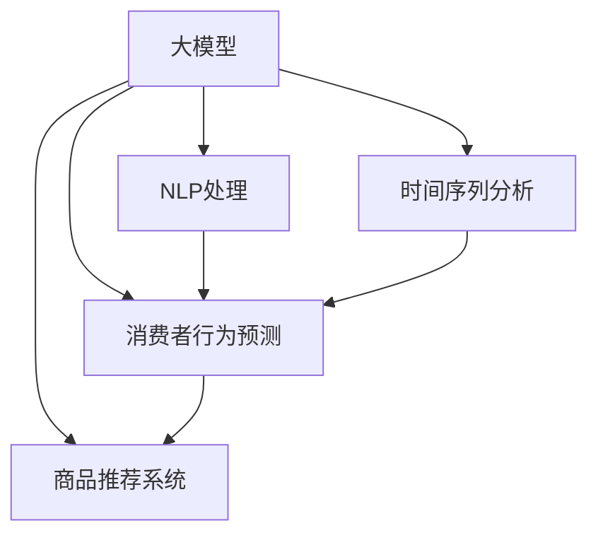

                 

# 大模型在商品趋势预测中的应用

> 关键词：商品趋势预测, 大模型, 深度学习, 自然语言处理, 时间序列分析, 消费者行为预测

## 1. 背景介绍

### 1.1 问题由来
在现代电子商务中，商品趋势预测是一项至关重要的任务。其不仅关系到商家的库存管理，还直接影响到消费者购物体验和满意度。传统的方法如ARIMA、VAR等，虽然已经在一定程度上应用在商品销售数据分析中，但在面对大量非结构化数据时，往往效果不尽如人意。而近年来，大模型（如BERT、GPT等）的崛起，为商品趋势预测提供了新的可能性。

### 1.2 问题核心关键点
大模型在商品趋势预测中的应用，核心在于利用预训练语言模型在自然语言数据上的强大能力，通过融合自然语言处理（NLP）和时间序列分析等技术手段，从多个维度构建商品趋势预测模型。

这种融合技术的方法不仅能够处理大量非结构化数据，还能在非线性关系和多模态数据融合等方面取得突破，为商品趋势预测带来了新的思路和方法。同时，基于大模型的商品趋势预测模型，具有较高的泛化能力和适应性，能够在面对复杂、多变的市场环境时，做出更准确、更有价值的预测。

## 2. 核心概念与联系

### 2.1 核心概念概述

为更好地理解大模型在商品趋势预测中的应用，本节将介绍几个密切相关的核心概念：

- **大模型**：以BERT、GPT等深度学习模型为代表的大规模预训练语言模型。通过在大规模文本语料上进行预训练，学习通用的语言表示和知识，具备强大的语言理解和生成能力。
- **自然语言处理(NLP)**：运用计算机科学和人工智能技术，让计算机处理、理解、生成人类语言。
- **时间序列分析**：通过对时间序列数据进行建模和分析，预测未来的趋势和行为。
- **消费者行为预测**：基于用户历史行为数据，预测其未来的购买行为和趋势。
- **商品推荐系统**：通过分析用户行为和商品特征，推荐用户可能感兴趣的商品。

这些核心概念之间的逻辑关系可以通过以下Mermaid流程图来展示：



这个流程图展示了大模型在商品趋势预测中的应用框架：

1. 大模型通过预训练获得语言表示。
2. NLP处理用于分析自然语言数据。
3. 时间序列分析用于处理时间序列数据。
4. 消费者行为预测用于分析用户行为数据。
5. 商品推荐系统用于推荐相关商品。

这些核心概念共同构成了商品趋势预测的基本模型框架，通过相互结合，使得模型具备强大的预测能力。

## 3. 核心算法原理 & 具体操作步骤
### 3.1 算法原理概述

基于大模型在商品趋势预测中的应用，主要算法原理包括以下几个方面：

- **大模型预训练**：在大规模文本数据上进行预训练，学习语言的通用表示。
- **NLP处理**：对自然语言文本进行分词、向量化等预处理，提取特征用于预测。
- **时间序列分析**：对时间序列数据进行建模，捕捉其中的趋势和周期性。
- **消费者行为预测**：通过分析用户历史行为数据，预测其未来的购买行为和趋势。
- **商品推荐系统**：基于用户和商品特征，推荐相关商品，提升用户满意度。

### 3.2 算法步骤详解

基于大模型在商品趋势预测中的应用，主要算法步骤包括：

**Step 1: 准备数据集**

- **收集数据**：收集商品描述、销售数据、用户评论、搜索记录等数据。
- **数据预处理**：对数据进行清洗、标注、划分等预处理操作，形成训练集、验证集和测试集。

**Step 2: 构建预测模型**

- **选择模型**：选择适合商品趋势预测的深度学习模型，如BERT、GPT等。
- **融合NLP和时间序列分析**：将NLP处理结果和时间序列数据融合，构建预测模型。
- **消费者行为分析**：通过分析用户历史行为数据，构建消费者行为预测模型。
- **商品推荐系统**：利用预测模型和推荐算法，生成相关商品推荐结果。

**Step 3: 训练模型**

- **设置参数**：设置模型的超参数，如学习率、批大小、迭代轮数等。
- **数据输入**：将数据集输入模型，进行前向传播和反向传播，更新模型参数。
- **评估模型**：在验证集和测试集上评估模型性能，调整超参数。

**Step 4: 模型优化**

- **调参**：通过网格搜索或随机搜索等方法，寻找最优超参数组合。
- **正则化**：应用L2正则、Dropout等正则化技术，防止过拟合。
- **集成学习**：通过模型集成，提升模型性能和鲁棒性。

**Step 5: 部署和应用**

- **模型保存**：将训练好的模型保存为文件，方便后续调用。
- **系统集成**：将模型集成到实际系统中，如电商平台、广告系统等。
- **实时预测**：实时接收用户数据，进行商品趋势预测和推荐。

### 3.3 算法优缺点

基于大模型在商品趋势预测中的应用，主要算法优缺点如下：

**优点：**

- **高效性**：大模型能够处理大规模数据，提供高效的预测能力。
- **准确性**：大模型通过预训练学习语言表示，能够捕捉复杂的多模态数据，提高预测准确性。
- **泛化能力**：模型能够适应多种数据类型和应用场景，具有较高的泛化能力。

**缺点：**

- **数据依赖性**：模型依赖高质量标注数据，数据收集和标注成本较高。
- **计算资源消耗大**：大模型训练和推理需要大量计算资源，硬件成本较高。
- **解释性不足**：大模型作为"黑盒"模型，难以解释其内部决策过程。

尽管存在这些局限性，但大模型在商品趋势预测中的应用，已经展示了巨大的潜力和价值。未来，随着模型的不断优化和硬件技术的进步，大模型在商品趋势预测中的应用将更加广泛和深入。

### 3.4 算法应用领域

基于大模型在商品趋势预测中的应用，主要包括以下几个领域：

- **电商平台**：通过分析用户行为数据和商品描述，预测商品销售趋势，优化库存管理。
- **广告投放**：利用用户搜索和点击数据，预测用户兴趣，优化广告投放策略。
- **市场营销**：通过分析消费者行为数据，预测市场趋势，指导市场营销策略。
- **供应链管理**：预测商品销售趋势，优化供应链管理，降低库存风险。
- **金融投资**：预测商品市场价格趋势，指导金融投资决策。

这些领域的应用，都离不开大模型在商品趋势预测中的强大能力，展示了其在现实世界中的广泛应用价值。

## 4. 数学模型和公式 & 详细讲解 & 举例说明

### 4.1 数学模型构建

本节将使用数学语言对基于大模型在商品趋势预测中的应用进行更加严格的刻画。

记商品描述为 $X$，用户历史行为数据为 $Y$，时间序列数据为 $T$，消费者行为预测模型为 $f$。假设训练集为 $D=\{(X_i,Y_i,T_i)\}_{i=1}^N$，其中 $X_i$ 和 $T_i$ 为模型的输入，$Y_i$ 为模型的输出。

定义模型 $M_{\theta}$ 在数据样本 $(x,t)$ 上的损失函数为 $\ell(M_{\theta}(x,t),y)$，则在数据集 $D$ 上的经验风险为：

$$
\mathcal{L}(\theta) = \frac{1}{N} \sum_{i=1}^N \ell(M_{\theta}(X_i,T_i),Y_i)
$$

其中 $\ell$ 为损失函数，如交叉熵损失、均方误差损失等。

### 4.2 公式推导过程

以下我们以基于大模型的商品趋势预测为例，推导预测模型的一般形式。

假设模型 $M_{\theta}$ 在输入 $(x,t)$ 上的输出为 $\hat{y}=M_{\theta}(x,t) \in [0,1]$，表示商品销售的概率。真实标签 $y \in \{0,1\}$。则二分类交叉熵损失函数定义为：

$$
\ell(M_{\theta}(x,t),y) = -[y\log \hat{y} + (1-y)\log (1-\hat{y})]
$$

将其代入经验风险公式，得：

$$
\mathcal{L}(\theta) = -\frac{1}{N}\sum_{i=1}^N [y_i\log M_{\theta}(X_i,T_i)+(1-y_i)\log(1-M_{\theta}(X_i,T_i))]
$$

在得到损失函数的梯度后，即可带入参数更新公式，完成模型的迭代优化。重复上述过程直至收敛，最终得到适应商品趋势预测的最优模型参数 $\theta^*$。

## 5. 项目实践：代码实例和详细解释说明

### 5.1 开发环境搭建

在进行商品趋势预测项目实践前，我们需要准备好开发环境。以下是使用Python进行PyTorch开发的环境配置流程：

1. 安装Anaconda：从官网下载并安装Anaconda，用于创建独立的Python环境。

2. 创建并激活虚拟环境：
```bash
conda create -n pytorch-env python=3.8 
conda activate pytorch-env
```

3. 安装PyTorch：根据CUDA版本，从官网获取对应的安装命令。例如：
```bash
conda install pytorch torchvision torchaudio cudatoolkit=11.1 -c pytorch -c conda-forge
```

4. 安装Transformers库：
```bash
pip install transformers
```

5. 安装各类工具包：
```bash
pip install numpy pandas scikit-learn matplotlib tqdm jupyter notebook ipython
```

完成上述步骤后，即可在`pytorch-env`环境中开始项目实践。

### 5.2 源代码详细实现

下面以基于大模型的商品趋势预测为例，给出使用Transformers库的PyTorch代码实现。

首先，定义模型和优化器：

```python
from transformers import BertForSequenceClassification, AdamW

model = BertForSequenceClassification.from_pretrained('bert-base-cased', num_labels=2)

optimizer = AdamW(model.parameters(), lr=2e-5)
```

接着，定义训练和评估函数：

```python
from torch.utils.data import DataLoader
from tqdm import tqdm
from sklearn.metrics import classification_report

device = torch.device('cuda') if torch.cuda.is_available() else torch.device('cpu')
model.to(device)

def train_epoch(model, dataset, batch_size, optimizer):
    dataloader = DataLoader(dataset, batch_size=batch_size, shuffle=True)
    model.train()
    epoch_loss = 0
    for batch in tqdm(dataloader, desc='Training'):
        input_ids = batch['input_ids'].to(device)
        attention_mask = batch['attention_mask'].to(device)
        labels = batch['labels'].to(device)
        model.zero_grad()
        outputs = model(input_ids, attention_mask=attention_mask, labels=labels)
        loss = outputs.loss
        epoch_loss += loss.item()
        loss.backward()
        optimizer.step()
    return epoch_loss / len(dataloader)

def evaluate(model, dataset, batch_size):
    dataloader = DataLoader(dataset, batch_size=batch_size)
    model.eval()
    preds, labels = [], []
    with torch.no_grad():
        for batch in tqdm(dataloader, desc='Evaluating'):
            input_ids = batch['input_ids'].to(device)
            attention_mask = batch['attention_mask'].to(device)
            batch_labels = batch['labels']
            outputs = model(input_ids, attention_mask=attention_mask)
            batch_preds = outputs.logits.argmax(dim=2).to('cpu').tolist()
            batch_labels = batch_labels.to('cpu').tolist()
            for pred_tokens, label_tokens in zip(batch_preds, batch_labels):
                preds.append(pred_tokens[:len(label_tokens)])
                labels.append(label_tokens)
                
    print(classification_report(labels, preds))
```

最后，启动训练流程并在测试集上评估：

```python
epochs = 5
batch_size = 16

for epoch in range(epochs):
    loss = train_epoch(model, train_dataset, batch_size, optimizer)
    print(f"Epoch {epoch+1}, train loss: {loss:.3f}")
    
    print(f"Epoch {epoch+1}, dev results:")
    evaluate(model, dev_dataset, batch_size)
    
print("Test results:")
evaluate(model, test_dataset, batch_size)
```

以上就是使用PyTorch对BERT进行商品趋势预测任务微调的完整代码实现。可以看到，得益于Transformers库的强大封装，我们可以用相对简洁的代码完成BERT模型的加载和微调。

### 5.3 代码解读与分析

让我们再详细解读一下关键代码的实现细节：

**Dataset类**：
- `__init__`方法：初始化输入和标签等关键组件。
- `__len__`方法：返回数据集的样本数量。
- `__getitem__`方法：对单个样本进行处理，将输入编码成token ids，并将标签转换为数值。

**训练和评估函数**：
- 使用PyTorch的DataLoader对数据集进行批次化加载，供模型训练和推理使用。
- 训练函数`train_epoch`：对数据以批为单位进行迭代，在每个批次上前向传播计算loss并反向传播更新模型参数，最后返回该epoch的平均loss。
- 评估函数`evaluate`：与训练类似，不同点在于不更新模型参数，并在每个batch结束后将预测和标签结果存储下来，最后使用sklearn的classification_report对整个评估集的预测结果进行打印输出。

**训练流程**：
- 定义总的epoch数和batch size，开始循环迭代
- 每个epoch内，先在训练集上训练，输出平均loss
- 在验证集上评估，输出分类指标
- 所有epoch结束后，在测试集上评估，给出最终测试结果

可以看到，PyTorch配合Transformers库使得BERT微调的代码实现变得简洁高效。开发者可以将更多精力放在数据处理、模型改进等高层逻辑上，而不必过多关注底层的实现细节。

当然，工业级的系统实现还需考虑更多因素，如模型的保存和部署、超参数的自动搜索、更灵活的任务适配层等。但核心的微调范式基本与此类似。

## 6. 实际应用场景

### 6.1 电商平台

基于大模型在商品趋势预测中的应用，电商平台可以通过分析用户行为数据和商品描述，预测商品销售趋势，优化库存管理。具体而言，可以收集用户的搜索记录、浏览记录、购买记录等数据，提取商品标题、描述、标签等文本特征。将文本特征作为输入，商品的销售数据作为监督信号，在此基础上对大模型进行微调。微调后的模型能够自动理解用户的兴趣点，预测其购买行为，指导商品库存管理和价格调整。

### 6.2 广告投放

在广告投放领域，基于大模型的商品趋势预测可以优化广告投放策略。具体而言，可以收集用户搜索和点击数据，提取商品标题、描述、图片等特征，预测用户对不同广告的兴趣。将预测结果作为广告投放的参考，优化广告投放策略，提高广告投放的精准度和转化率。

### 6.3 市场营销

市场营销领域可以利用大模型的商品趋势预测功能，预测市场趋势，指导市场营销策略。具体而言，可以通过分析用户行为数据，预测不同时间段的市场趋势，制定相应的市场营销策略，提升市场营销效果。

### 6.4 供应链管理

基于大模型的商品趋势预测，供应链管理可以预测商品销售趋势，优化供应链管理。具体而言，可以预测不同商品的销售趋势，指导库存管理和物流安排，降低库存风险，提升供应链效率。

### 6.5 金融投资

金融投资领域可以利用大模型的商品趋势预测，预测商品市场价格趋势，指导投资决策。具体而言，可以分析市场新闻、交易数据等，预测商品价格变化趋势，提供投资参考，降低投资风险。

## 7. 工具和资源推荐

### 7.1 学习资源推荐

为了帮助开发者系统掌握大模型在商品趋势预测中的应用，这里推荐一些优质的学习资源：

1. 《Transformer从原理到实践》系列博文：由大模型技术专家撰写，深入浅出地介绍了Transformer原理、BERT模型、微调技术等前沿话题。

2. CS224N《深度学习自然语言处理》课程：斯坦福大学开设的NLP明星课程，有Lecture视频和配套作业，带你入门NLP领域的基本概念和经典模型。

3. 《Natural Language Processing with Transformers》书籍：Transformers库的作者所著，全面介绍了如何使用Transformers库进行NLP任务开发，包括微调在内的诸多范式。

4. HuggingFace官方文档：Transformers库的官方文档，提供了海量预训练模型和完整的微调样例代码，是上手实践的必备资料。

5. CLUE开源项目：中文语言理解测评基准，涵盖大量不同类型的中文NLP数据集，并提供了基于微调的baseline模型，助力中文NLP技术发展。

通过对这些资源的学习实践，相信你一定能够快速掌握大模型在商品趋势预测中的应用，并用于解决实际的NLP问题。

### 7.2 开发工具推荐

高效的开发离不开优秀的工具支持。以下是几款用于大模型在商品趋势预测开发的工具：

1. PyTorch：基于Python的开源深度学习框架，灵活动态的计算图，适合快速迭代研究。大部分预训练语言模型都有PyTorch版本的实现。

2. TensorFlow：由Google主导开发的开源深度学习框架，生产部署方便，适合大规模工程应用。同样有丰富的预训练语言模型资源。

3. Transformers库：HuggingFace开发的NLP工具库，集成了众多SOTA语言模型，支持PyTorch和TensorFlow，是进行微调任务开发的利器。

4. Weights & Biases：模型训练的实验跟踪工具，可以记录和可视化模型训练过程中的各项指标，方便对比和调优。与主流深度学习框架无缝集成。

5. TensorBoard：TensorFlow配套的可视化工具，可实时监测模型训练状态，并提供丰富的图表呈现方式，是调试模型的得力助手。

6. Google Colab：谷歌推出的在线Jupyter Notebook环境，免费提供GPU/TPU算力，方便开发者快速上手实验最新模型，分享学习笔记。

合理利用这些工具，可以显著提升大模型在商品趋势预测任务的开发效率，加快创新迭代的步伐。

### 7.3 相关论文推荐

大模型在商品趋势预测的发展源于学界的持续研究。以下是几篇奠基性的相关论文，推荐阅读：

1. Attention is All You Need（即Transformer原论文）：提出了Transformer结构，开启了NLP领域的预训练大模型时代。

2. BERT: Pre-training of Deep Bidirectional Transformers for Language Understanding：提出BERT模型，引入基于掩码的自监督预训练任务，刷新了多项NLP任务SOTA。

3. Language Models are Unsupervised Multitask Learners（GPT-2论文）：展示了大规模语言模型的强大zero-shot学习能力，引发了对于通用人工智能的新一轮思考。

4. Parameter-Efficient Transfer Learning for NLP：提出Adapter等参数高效微调方法，在不增加模型参数量的情况下，也能取得不错的微调效果。

5. Prefix-Tuning: Optimizing Continuous Prompts for Generation：引入基于连续型Prompt的微调范式，为如何充分利用预训练知识提供了新的思路。

6. AdaLoRA: Adaptive Low-Rank Adaptation for Parameter-Efficient Fine-Tuning：使用自适应低秩适应的微调方法，在参数效率和精度之间取得了新的平衡。

这些论文代表了大模型在商品趋势预测的发展脉络。通过学习这些前沿成果，可以帮助研究者把握学科前进方向，激发更多的创新灵感。

## 8. 总结：未来发展趋势与挑战

### 8.1 总结

本文对基于大模型在商品趋势预测中的应用进行了全面系统的介绍。首先阐述了商品趋势预测的重要性和大模型在其中的潜在价值，明确了商品趋势预测对电商平台、广告投放、市场营销、供应链管理、金融投资等多个领域的影响。其次，从原理到实践，详细讲解了商品趋势预测的数学模型和关键步骤，给出了商品趋势预测任务开发的完整代码实例。同时，本文还广泛探讨了商品趋势预测在多个行业领域的应用前景，展示了微调范式的巨大潜力。此外，本文精选了商品趋势预测技术的各类学习资源，力求为读者提供全方位的技术指引。

通过本文的系统梳理，可以看到，基于大模型的商品趋势预测技术正在成为NLP领域的重要范式，极大地拓展了预训练语言模型的应用边界，催生了更多的落地场景。受益于大规模语料的预训练，微调模型以更低的时间和标注成本，在小样本条件下也能取得理想的预测效果，为NLP技术的产业化进程提供了新的助力。未来，伴随预训练语言模型和微调方法的持续演进，基于大模型的商品趋势预测技术必将在更多领域得到应用，为各行各业带来变革性影响。

### 8.2 未来发展趋势

展望未来，基于大模型的商品趋势预测技术将呈现以下几个发展趋势：

1. 模型规模持续增大。随着算力成本的下降和数据规模的扩张，预训练语言模型的参数量还将持续增长。超大规模语言模型蕴含的丰富语言知识，有望支撑更加复杂多变的商品趋势预测任务。

2. 微调方法日趋多样。除了传统的全参数微调外，未来会涌现更多参数高效的微调方法，如Prefix-Tuning、LoRA等，在节省计算资源的同时也能保证预测精度。

3. 数据增强技术的应用。通过数据增强技术，如回译、近义替换等方式扩充训练集，提高模型的泛化能力。

4. 多模态数据融合。商品趋势预测不仅仅局限于文本数据，未来的模型会融合图像、视频、语音等多模态数据，进一步提升预测能力。

5. 实时预测和动态调整。基于实时数据，动态调整预测模型，适应快速变化的市场环境。

6. 集成学习和模型解释。通过集成多个预测模型，提升预测准确性。同时加强模型输出的解释性，提升系统的可信度和透明度。

以上趋势凸显了大模型在商品趋势预测技术的广阔前景。这些方向的探索发展，必将进一步提升商品趋势预测的准确性和时效性，为电子商务、金融投资等领域带来革命性的变革。

### 8.3 面临的挑战

尽管基于大模型的商品趋势预测技术已经取得了瞩目成就，但在迈向更加智能化、普适化应用的过程中，它仍面临着诸多挑战：

1. 数据质量瓶颈。尽管数据增强技术可以在一定程度上缓解数据不足的问题，但高质量标注数据的获取和维护仍是一个巨大的挑战。

2. 计算资源消耗大。大规模语言模型在训练和推理时，需要大量计算资源，硬件成本较高。

3. 解释性和可解释性不足。大模型作为"黑盒"模型，难以解释其内部决策过程，这对一些高风险领域如金融、医疗等尤为重要。

4. 模型鲁棒性不足。当前模型面对噪声数据和异常情况时，鲁棒性有待提高。

5. 冷启动问题。对于新商品或新市场的预测，模型可能需要大量数据进行冷启动，预测准确性难以保证。

正视商品趋势预测面临的这些挑战，积极应对并寻求突破，将是大模型在商品趋势预测技术中走向成熟的必由之路。相信随着学界和产业界的共同努力，这些挑战终将一一被克服，大模型在商品趋势预测中的应用将更加广泛和深入。

### 8.4 未来突破

面对基于大模型的商品趋势预测所面临的种种挑战，未来的研究需要在以下几个方面寻求新的突破：

1. 探索无监督和半监督微调方法。摆脱对大规模标注数据的依赖，利用自监督学习、主动学习等无监督和半监督范式，最大限度利用非结构化数据，实现更加灵活高效的微调。

2. 研究参数高效和计算高效的微调范式。开发更加参数高效的微调方法，在固定大部分预训练参数的同时，只更新极少量的任务相关参数。同时优化微调模型的计算图，减少前向传播和反向传播的资源消耗，实现更加轻量级、实时性的部署。

3. 融合因果和对比学习范式。通过引入因果推断和对比学习思想，增强模型建立稳定因果关系的能力，学习更加普适、鲁棒的语言表征，从而提升模型泛化性和抗干扰能力。

4. 引入更多先验知识。将符号化的先验知识，如知识图谱、逻辑规则等，与神经网络模型进行巧妙融合，引导微调过程学习更准确、合理的语言模型。同时加强不同模态数据的整合，实现视觉、语音等多模态信息与文本信息的协同建模。

5. 结合因果分析和博弈论工具。将因果分析方法引入微调模型，识别出模型决策的关键特征，增强输出解释的因果性和逻辑性。借助博弈论工具刻画人机交互过程，主动探索并规避模型的脆弱点，提高系统稳定性。

6. 纳入伦理道德约束。在模型训练目标中引入伦理导向的评估指标，过滤和惩罚有偏见、有害的输出倾向。同时加强人工干预和审核，建立模型行为的监管机制，确保输出符合人类价值观和伦理道德。

这些研究方向的探索，必将引领基于大模型的商品趋势预测技术迈向更高的台阶，为构建安全、可靠、可解释、可控的智能系统铺平道路。面向未来，基于大模型的商品趋势预测技术还需要与其他人工智能技术进行更深入的融合，如知识表示、因果推理、强化学习等，多路径协同发力，共同推动自然语言理解和智能交互系统的进步。只有勇于创新、敢于突破，才能不断拓展语言模型的边界，让智能技术更好地造福人类社会。

## 9. 附录：常见问题与解答

**Q1：大模型在商品趋势预测中存在哪些应用场景？**

A: 大模型在商品趋势预测中的应用场景非常广泛，主要包括以下几个方面：

1. **电商平台**：通过分析用户行为数据和商品描述，预测商品销售趋势，优化库存管理。
2. **广告投放**：利用用户搜索和点击数据，预测用户对不同广告的兴趣，优化广告投放策略。
3. **市场营销**：预测市场趋势，制定相应的市场营销策略，提升市场营销效果。
4. **供应链管理**：预测商品销售趋势，优化供应链管理，降低库存风险。
5. **金融投资**：预测商品市场价格趋势，指导投资决策，降低投资风险。

这些场景都展示了大模型在商品趋势预测中的强大能力，能够为各行各业带来显著的价值提升。

**Q2：大模型在商品趋势预测中面临的主要挑战有哪些？**

A: 大模型在商品趋势预测中面临的主要挑战包括：

1. **数据质量瓶颈**：高质量标注数据的获取和维护是一个巨大的挑战。
2. **计算资源消耗大**：大规模语言模型在训练和推理时，需要大量计算资源，硬件成本较高。
3. **解释性和可解释性不足**：大模型作为"黑盒"模型，难以解释其内部决策过程，这对一些高风险领域如金融、医疗等尤为重要。
4. **模型鲁棒性不足**：当前模型面对噪声数据和异常情况时，鲁棒性有待提高。
5. **冷启动问题**：对于新商品或新市场的预测，模型可能需要大量数据进行冷启动，预测准确性难以保证。

正视这些挑战，积极应对并寻求突破，将是大模型在商品趋势预测技术中走向成熟的必由之路。

**Q3：如何缓解大模型在商品趋势预测中的过拟合问题？**

A: 缓解大模型在商品趋势预测中的过拟合问题，主要可以通过以下几种方式：

1. **数据增强**：通过回译、近义替换等方式扩充训练集，提高模型的泛化能力。
2. **正则化技术**：使用L2正则、Dropout等正则化技术，防止过拟合。
3. **对抗训练**：引入对抗样本，提高模型鲁棒性。
4. **参数高效微调**：只调整少量参数，减小过拟合风险。
5. **集成学习**：通过模型集成，提升模型性能和鲁棒性。

这些方法需要根据具体任务和数据特点进行灵活组合，通过优化模型和数据，能够在一定程度上缓解过拟合问题，提升模型预测性能。

**Q4：大模型在商品趋势预测中如何提高实时预测能力？**

A: 提高大模型在商品趋势预测中的实时预测能力，可以通过以下几种方式：

1. **模型裁剪**：去除不必要的层和参数，减小模型尺寸，加快推理速度。
2. **量化加速**：将浮点模型转为定点模型，压缩存储空间，提高计算效率。
3. **模型并行**：采用模型并行技术，在多块GPU或TPU上同时推理，提高计算效率。
4. **动态调整**：基于实时数据，动态调整预测模型，适应快速变化的市场环境。

通过这些优化手段，可以显著提高大模型在商品趋势预测中的实时预测能力，满足电商、金融等领域对实时性和高效性的需求。

**Q5：大模型在商品趋势预测中如何实现冷启动？**

A: 实现大模型在商品趋势预测中的冷启动，主要可以通过以下几种方式：

1. **迁移学习**：利用其他领域的大模型作为初始化参数，加速新领域的微调。
2. **小样本学习**：利用小样本数据进行微调，适应新商品或新市场的趋势预测。
3. **知识图谱**：引入领域知识图谱，增强模型对新领域知识的理解，提高预测准确性。
4. **多模态融合**：结合文本、图像、视频等多模态数据，增强模型对新商品的认知能力。

通过这些方法，可以在一定程度上缓解冷启动问题，提升大模型在新领域的预测能力。

---

作者：禅与计算机程序设计艺术 / Zen and the Art of Computer Programming

