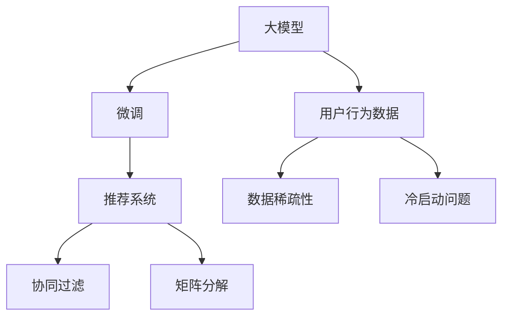

                 

# 大模型在推荐系统中的关键作用

## 1. 背景介绍

在当今信息爆炸的时代，推荐系统已深入各行各业，为人们提供了大量个性化的信息和服务。从电商购物、新闻阅读到视频观看，推荐系统无处不在，成为了连接用户与内容的桥梁。传统的推荐系统依赖于用户行为数据，如浏览记录、评分历史等，使用协同过滤、矩阵分解等方法，为用户推荐相关物品。但这种基于行为数据的推荐方式，难以覆盖新用户、长尾商品，且对标注数据的依赖较大，易受到数据稀疏性和冷启动问题的困扰。

近年来，基于大模型的推荐系统异军突起，逐渐成为行业关注的焦点。使用大规模预训练语言模型，如BERT、GPT等，通过微调学习用户行为数据背后的语言特征，能够突破数据稀疏性和冷启动问题的限制，实现更加灵活、泛化的推荐。本文将系统介绍大模型在推荐系统中的应用原理、实现步骤和关键技术，帮助读者深入理解这一前沿范式，探讨其未来的发展前景。

## 2. 核心概念与联系

为了更好地理解大模型在推荐系统中的作用，本节将介绍几个关键概念及其联系：

### 2.1 核心概念概述

- **大模型**：如BERT、GPT等，通过自监督预训练学习到大规模的通用知识，具备强大的语言理解能力。
- **微调**：在大模型上，使用推荐数据进行任务特定的优化，学习物品与用户之间的关联关系。
- **推荐系统**：通过分析用户行为数据，为用户推荐相关物品的系统，提高用户满意度。
- **协同过滤**：基于用户行为数据的推荐算法，通过相似性匹配推荐相关物品。
- **矩阵分解**：通过将用户-物品评分矩阵分解为用户和物品的特征表示，实现推荐。
- **用户行为数据**：用户在推荐系统中的浏览、评分、购买等行为数据。
- **数据稀疏性**：用户行为数据往往较为稀疏，难以全面覆盖所有用户和物品。
- **冷启动问题**：新用户或新物品在推荐系统中缺乏历史行为数据，难以进行推荐。

这些概念之间的逻辑关系可以通过以下Mermaid流程图来展示：



这个流程图展示了大模型在推荐系统中的应用路径：通过微调学习用户行为数据背后的语言特征，辅助协同过滤和矩阵分解等推荐算法，缓解数据稀疏性和冷启动问题，实现更加精准、个性化的推荐。

## 3. 核心算法原理 & 具体操作步骤

### 3.1 算法原理概述

基于大模型的推荐系统，其核心思想是通过预训练模型学习用户行为数据背后的语言特征，然后利用微调的方法，学习物品与用户之间的关联关系。其基本框架如下：

1. **预训练**：使用大规模无标签文本数据对大模型进行预训练，学习通用的语言知识。
2. **微调**：在预训练模型的基础上，使用推荐数据进行微调，学习用户行为数据背后的语言特征。
3. **推荐**：将微调后的模型应用于推荐算法中，实现个性化的物品推荐。

### 3.2 算法步骤详解

基于大模型的推荐系统一般包括以下几个关键步骤：

#### Step 1: 准备预训练模型和数据集
- 选择合适的预训练语言模型，如BERT、GPT等。
- 收集推荐数据集，划分为训练集、验证集和测试集。

#### Step 2: 添加任务适配层
- 根据推荐任务类型，在预训练模型顶层设计合适的输出层和损失函数。
- 对于推荐任务，通常使用加权平均或交叉熵损失函数。

#### Step 3: 设置微调超参数
- 选择合适的优化算法及其参数，如AdamW、SGD等，设置学习率、批大小、迭代轮数等。
- 设置正则化技术及强度，包括权重衰减、Dropout、Early Stopping等。

#### Step 4: 执行梯度训练
- 将训练集数据分批次输入模型，前向传播计算损失函数。
- 反向传播计算参数梯度，根据设定的优化算法和学习率更新模型参数。
- 周期性在验证集上评估模型性能，根据性能指标决定是否触发 Early Stopping。
- 重复上述步骤直到满足预设的迭代轮数或 Early Stopping 条件。

#### Step 5: 测试和部署
- 在测试集上评估微调后模型，对比微调前后的精度提升。
- 使用微调后的模型对新样本进行推荐，集成到实际的应用系统中。
- 持续收集新的数据，定期重新微调模型，以适应数据分布的变化。

### 3.3 算法优缺点

基于大模型的推荐系统具有以下优点：
- 泛化能力强：大模型具备强大的语言理解能力，能学习到更加复杂的用户行为模式。
- 推荐结果精准：微调能够将语言特征与推荐任务相结合，提高推荐结果的准确性。
- 冷启动效果好：大模型能处理新用户和长尾物品，缓解冷启动问题。
- 数据稀疏性低：通过预训练学习通用语言知识，对推荐数据的要求不高。

同时，该方法也存在一定的局限性：
- 训练成本高：大模型的预训练和微调需要大量计算资源和时间。
- 模型复杂度高：大模型的结构复杂，推理速度较慢。
- 模型风险高：大模型可能会引入偏见，导致推荐结果存在偏差。
- 可解释性差：大模型的决策过程难以解释，缺乏透明度。

尽管存在这些局限性，但就目前而言，基于大模型的推荐系统仍是大数据时代推荐的典型范式，具有良好的应用前景。未来相关研究的重点在于如何进一步降低计算成本，提高推荐效率，同时兼顾模型的可解释性和鲁棒性。

### 3.4 算法应用领域

基于大模型的推荐系统已经在多个领域得到了广泛的应用，如电商推荐、新闻推荐、视频推荐等，取得了显著的成果。

- **电商推荐**：通过分析用户的浏览记录和购买历史，为用户推荐相关商品，提高转化率和用户满意度。
- **新闻推荐**：根据用户的阅读历史和兴趣标签，为用户推荐相关新闻文章，增加用户粘性。
- **视频推荐**：根据用户的观看历史和评分数据，为用户推荐相关视频，提升用户观看时长。

除了上述这些经典领域，大模型在音乐推荐、电影推荐、旅行推荐等多个场景中，也展现了强大的推荐能力，推动了相关行业的数字化转型。

## 4. 数学模型和公式 & 详细讲解 & 举例说明

### 4.1 数学模型构建

在推荐系统中，大模型的微调过程可以建模为以下形式：

假设预训练语言模型为 $M_{\theta}$，推荐数据集为 $D=\{(x_i,y_i)\}_{i=1}^N$，其中 $x_i$ 为用户的推荐数据，$y_i$ 为物品的评分或是否观看。定义模型 $M_{\theta}$ 在数据样本 $(x,y)$ 上的损失函数为 $\ell(M_{\theta}(x),y)$，则在数据集 $D$ 上的经验风险为：

$$
\mathcal{L}(\theta) = \frac{1}{N} \sum_{i=1}^N \ell(M_{\theta}(x_i),y_i)
$$

其中 $\ell$ 为推荐任务设计的损失函数，如均方误差、交叉熵等。

通过梯度下降等优化算法，微调过程不断更新模型参数 $\theta$，最小化损失函数 $\mathcal{L}$，使得模型输出逼近真实标签。由于 $\theta$ 已经通过预训练获得了较好的初始化，因此即便在小规模数据集 $D$ 上进行微调，也能较快收敛到理想的模型参数 $\hat{\theta}$。

### 4.2 公式推导过程

以电商推荐任务为例，假设模型 $M_{\theta}$ 在用户 $x$ 的推荐数据上输出物品 $y$ 的评分 $s$，则推荐任务的目标是最大化用户对物品的评分。设 $y_i$ 为物品 $y$ 的真实评分，$y_h$ 为用户对物品 $y$ 的期望评分，则推荐目标可表示为：

$$
\max_{\theta} \sum_{i=1}^N \log P(y_i|M_{\theta}(x_i))
$$

其中 $P$ 为模型输出的概率分布，$N$ 为推荐数据集的大小。推荐损失函数可以表示为：

$$
\ell(M_{\theta}(x),y) = -y\log P(y|M_{\theta}(x))
$$

在数据集 $D$ 上的经验风险为：

$$
\mathcal{L}(\theta) = \frac{1}{N} \sum_{i=1}^N \ell(M_{\theta}(x_i),y_i)
$$

通过反向传播算法，可以高效计算损失函数的梯度，进而更新模型参数 $\theta$：

$$
\theta \leftarrow \theta - \eta \nabla_{\theta}\mathcal{L}(\theta)
$$

其中 $\eta$ 为学习率，$\nabla_{\theta}\mathcal{L}(\theta)$ 为损失函数对参数 $\theta$ 的梯度。

在得到损失函数的梯度后，即可带入参数更新公式，完成模型的迭代优化。重复上述过程直至收敛，最终得到适应推荐任务的最优模型参数 $\theta^*$。

### 4.3 案例分析与讲解

以YouTube视频推荐为例，假设用户 $u$ 对视频 $v$ 的评分 $s$ 表示为：

$$
s = f(\text{BERT}(\text{title}, \text{description}, \text{tags}, \text{user_profile}), \text{Video}(v))
$$

其中 $\text{BERT}$ 表示预训练的BERT模型，$\text{Video}$ 表示视频的特征表示，$\text{title}$、$\text{description}$、$\text{tags}$ 和 $\text{user_profile}$ 分别表示视频的标题、描述、标签和用户的信息。通过微调BERT模型，可以学习到用户对视频的评分预测模型，并结合协同过滤等推荐算法，实现更加精准的视频推荐。

## 5. 项目实践：代码实例和详细解释说明

### 5.1 开发环境搭建

在进行推荐系统微调实践前，我们需要准备好开发环境。以下是使用Python进行PyTorch开发的环境配置流程：

1. 安装Anaconda：从官网下载并安装Anaconda，用于创建独立的Python环境。

2. 创建并激活虚拟环境：
```bash
conda create -n pytorch-env python=3.8 
conda activate pytorch-env
```

3. 安装PyTorch：根据CUDA版本，从官网获取对应的安装命令。例如：
```bash
conda install pytorch torchvision torchaudio cudatoolkit=11.1 -c pytorch -c conda-forge
```

4. 安装各类工具包：
```bash
pip install numpy pandas scikit-learn matplotlib tqdm jupyter notebook ipython
```

完成上述步骤后，即可在`pytorch-env`环境中开始微调实践。

### 5.2 源代码详细实现

这里我们以电商平台商品推荐任务为例，给出使用Transformers库对BERT模型进行推荐微调的PyTorch代码实现。

首先，定义推荐任务的数据处理函数：

```python
from transformers import BertTokenizer
from torch.utils.data import Dataset
import torch

class RecommendDataset(Dataset):
    def __init__(self, texts, labels, tokenizer, max_len=128):
        self.texts = texts
        self.labels = labels
        self.tokenizer = tokenizer
        self.max_len = max_len
        
    def __len__(self):
        return len(self.texts)
    
    def __getitem__(self, item):
        text = self.texts[item]
        label = self.labels[item]
        
        encoding = self.tokenizer(text, return_tensors='pt', max_length=self.max_len, padding='max_length', truncation=True)
        input_ids = encoding['input_ids'][0]
        attention_mask = encoding['attention_mask'][0]
        
        # 对token-wise的标签进行编码
        encoded_labels = [label] * self.max_len
        labels = torch.tensor(encoded_labels, dtype=torch.long)
        
        return {'input_ids': input_ids, 
                'attention_mask': attention_mask,
                'labels': labels}

# 标签与id的映射
label2id = {'positive': 1, 'negative': 0}
id2label = {v: k for k, v in label2id.items()}

# 创建dataset
tokenizer = BertTokenizer.from_pretrained('bert-base-cased')

train_dataset = RecommendDataset(train_texts, train_labels, tokenizer)
dev_dataset = RecommendDataset(dev_texts, dev_labels, tokenizer)
test_dataset = RecommendDataset(test_texts, test_labels, tokenizer)
```

然后，定义模型和优化器：

```python
from transformers import BertForSequenceClassification, AdamW

model = BertForSequenceClassification.from_pretrained('bert-base-cased', num_labels=len(label2id))

optimizer = AdamW(model.parameters(), lr=2e-5)
```

接着，定义训练和评估函数：

```python
from torch.utils.data import DataLoader
from tqdm import tqdm
from sklearn.metrics import classification_report

device = torch.device('cuda') if torch.cuda.is_available() else torch.device('cpu')
model.to(device)

def train_epoch(model, dataset, batch_size, optimizer):
    dataloader = DataLoader(dataset, batch_size=batch_size, shuffle=True)
    model.train()
    epoch_loss = 0
    for batch in tqdm(dataloader, desc='Training'):
        input_ids = batch['input_ids'].to(device)
        attention_mask = batch['attention_mask'].to(device)
        labels = batch['labels'].to(device)
        model.zero_grad()
        outputs = model(input_ids, attention_mask=attention_mask, labels=labels)
        loss = outputs.loss
        epoch_loss += loss.item()
        loss.backward()
        optimizer.step()
    return epoch_loss / len(dataloader)

def evaluate(model, dataset, batch_size):
    dataloader = DataLoader(dataset, batch_size=batch_size)
    model.eval()
    preds, labels = [], []
    with torch.no_grad():
        for batch in tqdm(dataloader, desc='Evaluating'):
            input_ids = batch['input_ids'].to(device)
            attention_mask = batch['attention_mask'].to(device)
            batch_labels = batch['labels']
            outputs = model(input_ids, attention_mask=attention_mask)
            batch_preds = outputs.logits.argmax(dim=2).to('cpu').tolist()
            batch_labels = batch_labels.to('cpu').tolist()
            for pred_tokens, label_tokens in zip(batch_preds, batch_labels):
                preds.append(pred_tokens[:len(label_tokens)])
                labels.append(label_tokens)
                
    print(classification_report(labels, preds))
```

最后，启动训练流程并在测试集上评估：

```python
epochs = 5
batch_size = 16

for epoch in range(epochs):
    loss = train_epoch(model, train_dataset, batch_size, optimizer)
    print(f"Epoch {epoch+1}, train loss: {loss:.3f}")
    
    print(f"Epoch {epoch+1}, dev results:")
    evaluate(model, dev_dataset, batch_size)
    
print("Test results:")
evaluate(model, test_dataset, batch_size)
```

以上就是使用PyTorch对BERT进行推荐任务微调的完整代码实现。可以看到，得益于Transformers库的强大封装，我们可以用相对简洁的代码完成BERT模型的加载和微调。

### 5.3 代码解读与分析

让我们再详细解读一下关键代码的实现细节：

**RecommendDataset类**：
- `__init__`方法：初始化文本、标签、分词器等关键组件。
- `__len__`方法：返回数据集的样本数量。
- `__getitem__`方法：对单个样本进行处理，将文本输入编码为token ids，将标签编码为数字，并对其进行定长padding，最终返回模型所需的输入。

**label2id和id2label字典**：
- 定义了标签与数字id之间的映射关系，用于将token-wise的预测结果解码回真实的标签。

**训练和评估函数**：
- 使用PyTorch的DataLoader对数据集进行批次化加载，供模型训练和推理使用。
- 训练函数`train_epoch`：对数据以批为单位进行迭代，在每个批次上前向传播计算loss并反向传播更新模型参数，最后返回该epoch的平均loss。
- 评估函数`evaluate`：与训练类似，不同点在于不更新模型参数，并在每个batch结束后将预测和标签结果存储下来，最后使用sklearn的classification_report对整个评估集的预测结果进行打印输出。

**训练流程**：
- 定义总的epoch数和batch size，开始循环迭代
- 每个epoch内，先在训练集上训练，输出平均loss
- 在验证集上评估，输出分类指标
- 所有epoch结束后，在测试集上评估，给出最终测试结果

可以看到，PyTorch配合Transformers库使得BERT微调的代码实现变得简洁高效。开发者可以将更多精力放在数据处理、模型改进等高层逻辑上，而不必过多关注底层的实现细节。

当然，工业级的系统实现还需考虑更多因素，如模型的保存和部署、超参数的自动搜索、更灵活的任务适配层等。但核心的微调范式基本与此类似。

## 6. 实际应用场景

### 6.1 智能客服系统

基于大模型的推荐系统，可以广泛应用于智能客服系统的构建。传统客服往往需要配备大量人力，高峰期响应缓慢，且一致性和专业性难以保证。而使用推荐系统，可以7x24小时不间断服务，快速响应客户咨询，用推荐结果引导用户自助解决常见问题。

在技术实现上，可以收集企业内部的历史客服对话记录，将问题和最佳答复构建成监督数据，在此基础上对预训练推荐模型进行微调。微调后的推荐模型能够自动理解用户意图，匹配最合适的答复模板进行推荐。对于客户提出的新问题，还可以接入检索系统实时搜索相关内容，动态生成推荐答案。如此构建的智能客服系统，能大幅提升客户咨询体验和问题解决效率。

### 6.2 金融舆情监测

金融机构需要实时监测市场舆论动向，以便及时应对负面信息传播，规避金融风险。传统的人工监测方式成本高、效率低，难以应对网络时代海量信息爆发的挑战。基于大模型的推荐系统，可以用于金融舆情监测，提高数据监测的效率和准确性。

具体而言，可以收集金融领域相关的新闻、报道、评论等文本数据，并对其进行主题标注和情感标注。在此基础上对预训练语言模型进行微调，使其能够自动判断文本属于何种主题，情感倾向是正面、中性还是负面。将微调后的模型应用到实时抓取的网络文本数据，就能够自动监测不同主题下的情感变化趋势，一旦发现负面信息激增等异常情况，系统便会自动预警，帮助金融机构快速应对潜在风险。

### 6.3 个性化推荐系统

当前的推荐系统往往只依赖用户的历史行为数据进行物品推荐，无法深入理解用户的真实兴趣偏好。基于大模型的推荐系统，可以更好地挖掘用户行为数据背后的语义信息，从而实现更加精准、个性化的推荐。

在实践中，可以收集用户浏览、点击、评论、分享等行为数据，提取和用户交互的物品标题、描述、标签等文本内容。将文本内容作为模型输入，用户的后续行为（如是否点击、购买等）作为监督信号，在此基础上微调预训练语言模型。微调后的模型能够从文本内容中准确把握用户的兴趣点。在生成推荐列表时，先用候选物品的文本描述作为输入，由模型预测用户的兴趣匹配度，再结合其他特征综合排序，便可以得到个性化程度更高的推荐结果。

### 6.4 未来应用展望

随着大语言模型和推荐系统的不断发展，基于微调范式将在更多领域得到应用，为各行各业带来变革性影响。

在智慧医疗领域，基于微调的推荐系统可以用于病历分析、药物推荐等，辅助医生诊疗，加速新药开发进程。

在智能教育领域，推荐系统可应用于作业批改、学情分析、知识推荐等方面，因材施教，促进教育公平，提高教学质量。

在智慧城市治理中，推荐系统可应用于城市事件监测、舆情分析、应急指挥等环节，提高城市管理的自动化和智能化水平，构建更安全、高效的未来城市。

此外，在企业生产、社会治理、文娱传媒等众多领域，基于大模型的推荐系统也将不断涌现，为NLP技术带来了全新的突破。相信随着预训练语言模型和推荐方法的不断进步，基于微调范式必将在构建人机协同的智能时代中扮演越来越重要的角色。

## 7. 工具和资源推荐

### 7.1 学习资源推荐

为了帮助开发者系统掌握大模型在推荐系统中的应用原理和实践技巧，这里推荐一些优质的学习资源：

1. 《Transformer from the Top to the Bottom》系列博文：由大模型技术专家撰写，深入浅出地介绍了Transformer原理、BERT模型、推荐技术等前沿话题。

2. CS244《深度学习与自然语言处理》课程：斯坦福大学开设的深度学习课程，包含大量推荐系统的经典案例，值得学习。

3. 《Neural Information Retrieval with BERT》论文：谷歌提出的基于BERT的推荐系统，为推荐系统应用大模型提供了重要参考。

4. 《TensorFlow Recommenders》教程：TensorFlow提供的推荐系统开源库，包含丰富的推荐算法和代码示例。

5. 《Hands-On Recommendation Systems with Deep Learning》书籍：详细介绍了基于深度学习的推荐系统，涵盖推荐模型、算法和优化等各个方面。

通过对这些资源的学习实践，相信你一定能够快速掌握大模型在推荐系统中的应用，并用于解决实际的推荐问题。

### 7.2 开发工具推荐

高效的开发离不开优秀的工具支持。以下是几款用于大模型推荐系统开发的常用工具：

1. PyTorch：基于Python的开源深度学习框架，灵活动态的计算图，适合快速迭代研究。大部分预训练语言模型都有PyTorch版本的实现。

2. TensorFlow：由Google主导开发的开源深度学习框架，生产部署方便，适合大规模工程应用。同样有丰富的预训练语言模型资源。

3. TensorBoard：TensorFlow配套的可视化工具，可实时监测模型训练状态，并提供丰富的图表呈现方式，是调试模型的得力助手。

4. Weights & Biases：模型训练的实验跟踪工具，可以记录和可视化模型训练过程中的各项指标，方便对比和调优。与主流深度学习框架无缝集成。

5. Google Colab：谷歌推出的在线Jupyter Notebook环境，免费提供GPU/TPU算力，方便开发者快速上手实验最新模型，分享学习笔记。

合理利用这些工具，可以显著提升大模型推荐系统的开发效率，加快创新迭代的步伐。

### 7.3 相关论文推荐

大模型和推荐系统的发展源于学界的持续研究。以下是几篇奠基性的相关论文，推荐阅读：

1. Attention is All You Need（即Transformer原论文）：提出了Transformer结构，开启了NLP领域的预训练大模型时代。

2. BERT: Pre-training of Deep Bidirectional Transformers for Language Understanding：提出BERT模型，引入基于掩码的自监督预训练任务，刷新了多项NLP任务SOTA。

3. Deep Interest Networks for Recommender Systems：提出兴趣网络模型，将兴趣建模和推荐算法结合，取得了显著的推荐效果。

4. Multi-task Learning with Multiple Objectives for Personalized Recommendation：提出多任务学习框架，融合多种推荐任务，提升推荐系统的泛化能力。

5. Knowledge Graphs for Recommendation：引入知识图谱增强推荐系统，提升推荐结果的质量和多样性。

这些论文代表了大模型在推荐系统中的研究进展，通过学习这些前沿成果，可以帮助研究者把握学科前进方向，激发更多的创新灵感。

## 8. 总结：未来发展趋势与挑战

### 8.1 总结

本文对基于大模型的推荐系统进行了全面系统的介绍。首先阐述了推荐系统的背景和挑战，明确了微调在缓解数据稀疏性和冷启动问题中的独特价值。其次，从原理到实践，详细讲解了推荐微调的数学原理和关键步骤，给出了推荐任务微调的完整代码实例。同时，本文还广泛探讨了微调方法在智能客服、金融舆情、个性化推荐等多个领域的应用前景，展示了微调范式的巨大潜力。此外，本文精选了推荐系统相关的学习资源，力求为读者提供全方位的技术指引。

通过本文的系统梳理，可以看到，基于大模型的推荐系统正在成为推荐系统的典型范式，极大地拓展了推荐算法的应用边界，催生了更多的落地场景。得益于大规模语料的预训练，推荐模型能够处理新用户和长尾物品，缓解冷启动问题，实现更加精准、个性化的推荐。未来，伴随大语言模型和推荐方法的不断进步，基于微调范式必将在构建人机协同的智能时代中扮演越来越重要的角色。

### 8.2 未来发展趋势

展望未来，大模型在推荐系统中的应用将呈现以下几个发展趋势：

1. 模型规模持续增大。随着算力成本的下降和数据规模的扩张，推荐模型也将逐渐向大模型方向发展，学习更加丰富的语义特征。
2. 推荐结果泛化性增强。大模型具备强大的语言理解能力，能够学习到更加复杂的用户行为模式，提升推荐结果的泛化性能。
3. 推荐系统智能化水平提升。基于大模型的推荐系统能够自动理解用户意图，实时动态推荐，提升用户体验和满意度。
4. 推荐模型可解释性增强。通过引入因果分析和博弈论工具，增强推荐模型的透明度和可信度。
5. 推荐系统服务化水平提升。将推荐模型封装为标准化服务接口，方便业务系统调用，提升服务效率和稳定性。

以上趋势凸显了大模型在推荐系统中的应用前景。这些方向的探索发展，必将进一步提升推荐系统的性能和应用范围，为人工智能技术落地应用提供新的技术路径。

### 8.3 面临的挑战

尽管基于大模型的推荐系统已经取得了瞩目成就，但在迈向更加智能化、普适化应用的过程中，它仍面临着诸多挑战：

1. 推荐结果质量保障。尽管大模型具备较强的泛化能力，但推荐结果的精度和多样性仍需进一步优化，避免出现偏差和重复。
2. 模型复杂性管理。大模型参数量巨大，推理速度较慢，难以满足实时推荐的要求。如何简化模型结构，提高推荐效率，是重要的优化方向。
3. 数据隐私保护。推荐模型需要收集和处理大量的用户数据，如何保护用户隐私，防止数据泄露，是亟待解决的问题。
4. 推荐系统鲁棒性提升。推荐模型需要应对异常数据和恶意攻击，提升系统的鲁棒性和稳定性。
5. 推荐系统可解释性增强。推荐系统的决策过程难以解释，缺乏透明度，如何提高系统的可解释性和可信任度，是重要的研究方向。

这些挑战需要学术界和产业界共同努力，通过不断的技术创新和工程实践，才能逐步克服。唯有在推荐模型精度、效率、隐私、鲁棒性和可解释性等方面不断突破，才能真正实现人工智能技术在推荐系统中的广泛应用。

### 8.4 研究展望

面对推荐系统所面临的种种挑战，未来的研究需要在以下几个方面寻求新的突破：

1. 探索无监督和半监督推荐方法。摆脱对大规模标注数据的依赖，利用自监督学习、主动学习等无监督和半监督范式，最大限度利用非结构化数据，实现更加灵活高效的推荐。
2. 研究参数高效和计算高效的推荐算法。开发更加参数高效的推荐方法，在固定大部分预训练参数的情况下，只更新极少量的任务相关参数。同时优化推荐模型的计算图，减少前向传播和反向传播的资源消耗，实现更加轻量级、实时性的部署。
3. 融合因果和对比学习范式。通过引入因果推断和对比学习思想，增强推荐模型建立稳定因果关系的能力，学习更加普适、鲁棒的用户行为模式。
4. 引入更多先验知识。将符号化的先验知识，如知识图谱、逻辑规则等，与神经网络模型进行巧妙融合，引导推荐过程学习更准确、合理的用户行为模式。同时加强不同模态数据的整合，实现视觉、语音等多模态信息与文本信息的协同建模。
5. 结合因果分析和博弈论工具。将因果分析方法引入推荐模型，识别出模型决策的关键特征，增强推荐结果的因果性和逻辑性。借助博弈论工具刻画人机交互过程，主动探索并规避模型的脆弱点，提高系统稳定性。

这些研究方向的探索，必将引领推荐系统向更加智能化、普适化和可解释化方向发展，为构建安全、可靠、可解释、可控的智能推荐系统提供新的技术支持。面向未来，推荐系统需要在精度、效率、隐私、鲁棒性和可解释性等方面进行协同优化，才能真正实现人工智能技术的落地应用。

## 9. 附录：常见问题与解答

**Q1：推荐系统中的大模型如何处理冷启动问题？**

A: 大模型在推荐系统中可以处理冷启动问题，主要通过以下几种方式：
1. 多任务学习：在推荐数据上进行多任务学习，学习用户和物品的多种特征表示，缓解冷启动问题。
2. 先验知识融合：将知识图谱、逻辑规则等先验知识与神经网络模型结合，提升推荐结果的质量。
3. 推荐策略融合：将基于模型的推荐与基于规则的推荐策略结合，弥补模型的冷启动性能。
4. 推荐系统集成：通过集成多个推荐模型，提升推荐系统的鲁棒性和泛化能力。

这些方法可以互相结合，共同提升推荐系统的冷启动性能。

**Q2：大模型在推荐系统中的推荐结果是否具有可解释性？**

A: 大模型在推荐系统中的推荐结果具有一定的可解释性，主要通过以下几种方式：
1. 特征可视化：通过特征可视化工具，展示推荐模型中各个特征对推荐结果的影响。
2. 交互可视化：通过用户行为数据的可视化，揭示用户偏好和行为模式。
3. 推理路径分析：通过分析推荐模型的推理路径，理解推荐结果的生成逻辑。
4. 用户反馈机制：引入用户反馈机制，收集用户对推荐结果的评价，不断优化推荐系统。

这些方式可以帮助用户理解推荐系统的推荐逻辑和决策依据，提高系统的透明度和可信度。

**Q3：推荐系统中的大模型是否存在偏差问题？**

A: 大模型在推荐系统中存在一定的偏差问题，主要体现在以下几个方面：
1. 数据偏差：推荐数据本身可能存在偏差，如数据分布不均衡、标注错误等。
2. 模型偏差：大模型可能会学习到数据中的固有偏见，导致推荐结果存在偏差。
3. 使用偏差：推荐系统在实际应用中可能存在使用偏差，如推荐模型在使用过程中被误用，导致推荐结果的偏差。

为缓解偏差问题，可以采用以下方法：
1. 数据清洗：对推荐数据进行清洗，去除异常数据和噪声数据。
2. 公平性约束：在推荐模型的训练过程中加入公平性约束，避免对特定群体或物品的歧视。
3. 对抗训练：引入对抗样本，提升推荐模型的鲁棒性，减少模型偏差的影响。
4. 多模型集成：通过集成多个推荐模型，降低单个模型的偏差。

通过这些方法，可以逐步缓解大模型在推荐系统中的偏差问题，提升系统的公平性和鲁棒性。

**Q4：推荐系统中的大模型是否适用于所有推荐任务？**

A: 大模型在推荐系统中可以适用于大部分推荐任务，但对于一些特定类型的推荐任务，如个性化广告推荐、推荐系统集成等，需要针对性地进行优化。

1. 个性化广告推荐：大模型可以处理长尾物品推荐，但广告推荐需要优化点击率等指标，需要引入点击率预估等任务。
2. 推荐系统集成：通过集成多个推荐模型，可以提升系统的鲁棒性和泛化能力，但需要设计合理的集成策略。
3. 推荐结果解释：大模型在推荐系统中具有一定的可解释性，但需要进一步改进，如引入因果分析、博弈论工具等。

因此，大模型在推荐系统中的应用需要根据具体任务和场景进行优化和改进。

**Q5：推荐系统中的大模型如何处理异常数据？**

A: 大模型在推荐系统中可以通过以下几种方式处理异常数据：
1. 数据清洗：对推荐数据进行清洗，去除异常数据和噪声数据，确保数据质量。
2. 异常检测：引入异常检测算法，识别并处理异常数据。
3. 鲁棒优化：在推荐模型的训练过程中加入鲁棒优化技术，提升模型的鲁棒性，减少异常数据的影响。
4. 对抗训练：引入对抗样本，提升推荐模型的鲁棒性，减少异常数据的影响。

这些方法可以互相结合，共同提升推荐系统的鲁棒性和稳定性。

**Q6：推荐系统中的大模型如何提升推荐效率？**

A: 大模型在推荐系统中可以通过以下几种方式提升推荐效率：
1. 模型压缩：通过模型压缩技术，如知识蒸馏、剪枝等，减少模型参数量，提升推理速度。
2. 混合精度训练：使用混合精度训练技术，降低计算量，提升训练效率。
3. 硬件加速：利用GPU/TPU等硬件加速设备，提升模型训练和推理速度。
4. 分布式训练：利用分布式训练技术，加速模型的训练过程。
5. 模型并行：利用模型并行技术，提升模型的推理速度。

这些方法可以互相结合，共同提升推荐系统的效率和性能。

**Q7：推荐系统中的大模型如何保护用户隐私？**

A: 大模型在推荐系统中可以通过以下几种方式保护用户隐私：
1. 数据匿名化：对推荐数据进行匿名化处理，保护用户隐私。
2. 差分隐私：在推荐模型的训练过程中加入差分隐私技术，保护用户隐私。
3. 联邦学习：通过联邦学习技术，将模型训练在用户设备上进行，保护用户隐私。
4. 数据加密：对推荐数据进行加密处理，保护用户隐私。

这些方法可以互相结合，共同提升推荐系统的隐私保护能力。

总之，大模型在推荐系统中的应用前景广阔，但需要克服诸多挑战。通过不断的技术创新和工程实践，未来的大模型推荐系统必将在各个领域大放异彩，推动人工智能技术的广泛应用。

