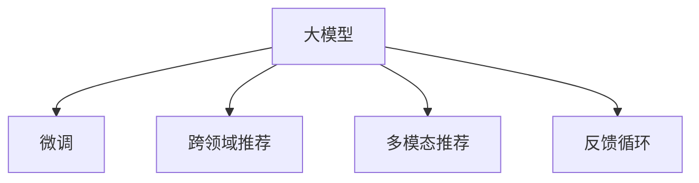

                 

# 大模型在推荐系统反馈循环中的作用

## 1. 背景介绍

随着互联网技术的不断进步和用户需求的多样化，推荐系统在电商、视频、社交媒体等诸多领域的应用越来越广泛。推荐系统通过精准地为用户推荐商品、内容或服务，极大地提升了用户体验和业务价值。传统的协同过滤、基于内容的推荐算法等方法，在数据量较小的情况下效果显著，但随着数据量的增大，推荐系统的性能瓶颈逐渐显现，特别是在跨领域推荐和多模态推荐方面表现不足。

近年来，随着预训练语言模型和大模型技术的发展，基于深度学习的推荐系统取得了突破性进展。大模型通过在大规模无标签数据上进行预训练，学习到了丰富的语义信息和通用知识，具备了更强的泛化能力和跨领域适应性。在此基础上，通过在大模型上微调，可以实现高质量的推荐效果，适应新数据、新任务和新需求。本文将深入探讨大模型在推荐系统中的应用，分析其在推荐系统反馈循环中的作用和优化方法，以期为推荐系统的发展提供新的思路。

## 2. 核心概念与联系

### 2.1 核心概念概述

本节将介绍几个与大模型在推荐系统中应用密切相关的核心概念：

- **大模型(Pretrained Models)**：以Transformer、BERT等为代表的大规模预训练语言模型。通过在大规模无标签文本数据上进行预训练，学习到了丰富的语义知识和常识，具备了强大的语言理解和生成能力。

- **微调(Fine-tuning)**：指在预训练模型的基础上，使用推荐系统的数据集，通过有监督学习优化模型在该推荐任务上的性能。通常只需要调整顶层分类器或解码器，并以较小的学习率更新全部或部分的模型参数。

- **跨领域推荐(Cross-domain Recommendation)**：指在多个不同领域的推荐系统中共享预训练模型，提升模型在不同领域之间的泛化能力。

- **多模态推荐(Multimodal Recommendation)**：指结合文本、图像、视频、音频等多模态数据，构建更全面、更准确的推荐模型。

- **反馈循环(Feedback Loop)**：推荐系统通过不断地获取用户反馈，动态调整推荐算法，使得推荐效果不断提升，形成了正向的反馈循环。

这些核心概念之间的逻辑关系可以通过以下Mermaid流程图来展示：



这个流程图展示了大模型在推荐系统中的核心概念及其之间的关系：

1. 大模型通过预训练获得基础能力。
2. 微调使得通用大模型更好地适应特定推荐任务，提升模型性能。
3. 跨领域推荐和多模态推荐丰富了模型输入数据，提升泛化能力。
4. 反馈循环利用用户反馈动态调整模型，实现推荐效果的持续提升。

## 3. 核心算法原理 & 具体操作步骤

### 3.1 算法原理概述

基于大模型的推荐系统，核心思想是利用大模型的语言理解和生成能力，结合推荐系统的用户行为数据，构建推荐模型，并通过微调不断优化模型参数，提高推荐效果。具体来说，包括以下几个步骤：

1. **预训练模型选择**：选择预训练模型作为初始化参数，如BERT、GPT等。
2. **微调任务适配**：根据推荐系统的特定任务，设计适当的任务适配层，如分类头、交叉熵损失等。
3. **微调数据准备**：准备推荐系统的数据集，将其划分为训练集、验证集和测试集。
4. **模型初始化**：将预训练模型作为初始化参数，加载到推荐系统中。
5. **微调过程**：使用推荐系统的数据集，通过有监督学习优化模型在特定推荐任务上的性能。
6. **反馈调整**：收集用户反馈数据，通过A/B测试、在线实验等方法，动态调整推荐算法，实现推荐效果的持续提升。

### 3.2 算法步骤详解

**Step 1: 准备预训练模型和数据集**

- 选择合适的预训练语言模型 $M_{\theta}$ 作为初始化参数，如 BERT、GPT等。
- 准备推荐系统的训练集、验证集和测试集，通常使用用户行为数据（如点击、购买、评分等）和物品特征数据。

**Step 2: 添加任务适配层**

- 根据推荐任务类型，在预训练模型顶层设计合适的输出层和损失函数。例如，对于点击率预测任务，通常添加二分类输出层和交叉熵损失函数。

**Step 3: 设置微调超参数**

- 选择合适的优化算法及其参数，如 AdamW、SGD 等，设置学习率、批大小、迭代轮数等。
- 设置正则化技术及强度，包括权重衰减、Dropout、Early Stopping 等。
- 确定冻结预训练参数的策略，如仅微调顶层，或全部参数都参与微调。

**Step 4: 执行梯度训练**

- 将训练集数据分批次输入模型，前向传播计算损失函数。
- 反向传播计算参数梯度，根据设定的优化算法和学习率更新模型参数。
- 周期性在验证集上评估模型性能，根据性能指标决定是否触发 Early Stopping。
- 重复上述步骤直到满足预设的迭代轮数或 Early Stopping 条件。

**Step 5: 测试和部署**

- 在测试集上评估微调后模型 $M_{\hat{\theta}}$ 的性能，对比微调前后的精度提升。
- 使用微调后的模型对新样本进行推理预测，集成到实际的应用系统中。
- 持续收集新的数据，定期重新微调模型，以适应数据分布的变化。

### 3.3 算法优缺点

基于大模型的推荐系统具有以下优点：

1. **泛化能力强**：大模型通过大规模预训练，学习到了丰富的语义知识和常识，具备了强大的泛化能力，可以适应多种推荐任务。
2. **跨领域适应性**：大模型可以通过微调在不同领域之间共享知识，提升跨领域的推荐效果。
3. **高精度推荐**：大模型的语言理解能力，使得推荐系统能够理解用户的意图和需求，生成高质量的推荐结果。
4. **动态调整**：大模型具备强大的灵活性，可以动态地适应用户反馈，不断优化推荐算法。

同时，该方法也存在一定的局限性：

1. **数据依赖度高**：推荐系统的效果很大程度上依赖于数据的质量和数量，标注数据和行为数据的获取成本较高。
2. **计算成本高**：大模型通常需要大量的计算资源，微调过程耗时较长。
3. **可解释性不足**：推荐系统的决策过程通常缺乏可解释性，难以对其推理逻辑进行分析和调试。

尽管存在这些局限性，但就目前而言，基于大模型的推荐系统依然是大数据推荐领域的领先技术，广泛应用于电商、视频、社交媒体等多个领域。未来相关研究的重点在于如何进一步降低计算成本，提高推荐系统的实时性和可解释性，同时兼顾可扩展性和跨领域适应性。

### 3.4 算法应用领域

基于大模型的推荐系统已经在电商推荐、内容推荐、广告推荐等诸多领域取得了优异的效果，成为推荐系统领域的主流技术。

**电商推荐系统**：通过分析用户浏览、点击、购买等行为数据，生成个性化的商品推荐列表，提升用户体验和销售转化率。例如，亚马逊、淘宝等电商平台的推荐系统，都使用了大模型的微调技术。

**内容推荐系统**：通过分析用户阅读、观看、点赞等行为数据，生成个性化的视频、文章等内容的推荐，提升用户满意度。例如，YouTube、Netflix等平台的内容推荐系统，都采用了大模型的微调技术。

**广告推荐系统**：通过分析用户的点击、曝光、停留等行为数据，生成个性化的广告推荐，提高广告投放的精准度和转化率。例如，Facebook、谷歌等平台的广告推荐系统，都使用了大模型的微调技术。

除了上述这些经典领域外，大模型推荐系统还被创新性地应用到更多场景中，如可控推荐、兴趣点推荐、活动推荐等，为推荐系统带来了全新的突破。

## 4. 数学模型和公式 & 详细讲解 & 举例说明

### 4.1 数学模型构建

假设推荐系统中的物品为 $X$，用户为 $Y$，用户对物品 $x$ 的评分 $r$ 为 $(x,y)$。推荐系统的目标是预测用户对物品的评分，并根据评分生成推荐列表。

定义推荐系统中的预测模型为 $M_{\theta}:\mathcal{X} \rightarrow \mathcal{Y}$，其中 $\mathcal{X}$ 为物品集合，$\mathcal{Y}$ 为评分空间，$\theta$ 为模型参数。假设微调任务的训练集为 $D=\{(x_i,y_i)\}_{i=1}^N$，其中 $x_i \in \mathcal{X}, y_i \in \mathcal{Y}$。

推荐系统的损失函数 $\mathcal{L}$ 定义为：

$$
\mathcal{L}(\theta) = \frac{1}{N} \sum_{i=1}^N \ell(r_i, M_{\theta}(x_i))
$$

其中 $\ell$ 为损失函数，通常使用均方误差或交叉熵损失。

通过梯度下降等优化算法，微调过程不断更新模型参数 $\theta$，最小化损失函数 $\mathcal{L}$，使得模型输出逼近真实评分。

### 4.2 公式推导过程

以均方误差损失为例，预测模型 $M_{\theta}$ 在物品 $x_i$ 上的预测评分 $r_i'$ 为：

$$
r_i' = M_{\theta}(x_i)
$$

定义预测值与真实值之间的均方误差为：

$$
\ell(r_i, r_i') = \frac{1}{2}(r_i - r_i')^2
$$

因此，推荐系统的损失函数可以写为：

$$
\mathcal{L}(\theta) = \frac{1}{N} \sum_{i=1}^N \frac{1}{2}(y_i - M_{\theta}(x_i))^2
$$

通过梯度下降算法，最小化损失函数，可以得到模型的更新公式：

$$
\theta \leftarrow \theta - \eta \nabla_{\theta}\mathcal{L}(\theta) 
$$

其中 $\eta$ 为学习率，$\nabla_{\theta}\mathcal{L}(\theta)$ 为损失函数对模型参数 $\theta$ 的梯度。

### 4.3 案例分析与讲解

**案例1: 电商商品推荐**

电商推荐系统需要根据用户的历史购买行为，预测其对商品的评分，并生成个性化的推荐列表。假设用户 $i$ 对商品 $j$ 的评分 $r_{ij}$ 为：

$$
r_{ij} = \theta^T \phi(x_i) \cdot \phi(x_j)
$$

其中 $\theta$ 为模型参数，$\phi(x_i)$ 和 $\phi(x_j)$ 为商品 $x_i$ 和 $x_j$ 的特征表示。

定义电商推荐系统的损失函数为均方误差损失：

$$
\mathcal{L}(\theta) = \frac{1}{N} \sum_{i=1}^N \frac{1}{2}(r_{ij} - \theta^T \phi(x_i) \cdot \phi(x_j))^2
$$

通过微调优化模型参数 $\theta$，使得模型能够准确预测用户的评分，生成高质量的推荐列表。

**案例2: 内容推荐系统**

内容推荐系统需要根据用户的历史行为数据，预测其对视频的评分，并生成个性化的视频推荐列表。假设用户 $i$ 对视频 $j$ 的评分 $r_{ij}$ 为：

$$
r_{ij} = \theta^T \phi(x_i) \cdot \phi(x_j)
$$

其中 $\theta$ 为模型参数，$\phi(x_i)$ 和 $\phi(x_j)$ 为用户 $x_i$ 和视频 $x_j$ 的特征表示。

定义内容推荐系统的损失函数为交叉熵损失：

$$
\mathcal{L}(\theta) = -\frac{1}{N} \sum_{i=1}^N \sum_{j=1}^M y_{ij} \log M_{\theta}(x_i \rightarrow x_j) + (1 - y_{ij}) \log (1 - M_{\theta}(x_i \rightarrow x_j))
$$

其中 $M_{\theta}(x_i \rightarrow x_j)$ 表示用户 $i$ 对视频 $j$ 的评分预测，$y_{ij}$ 为真实评分。

通过微调优化模型参数 $\theta$，使得模型能够准确预测用户的评分，生成高质量的视频推荐列表。

## 5. 项目实践：代码实例和详细解释说明

### 5.1 开发环境搭建

在进行推荐系统微调实践前，我们需要准备好开发环境。以下是使用Python进行PyTorch开发的环境配置流程：

1. 安装Anaconda：从官网下载并安装Anaconda，用于创建独立的Python环境。

2. 创建并激活虚拟环境：
```bash
conda create -n pytorch-env python=3.8 
conda activate pytorch-env
```

3. 安装PyTorch：根据CUDA版本，从官网获取对应的安装命令。例如：
```bash
conda install pytorch torchvision torchaudio cudatoolkit=11.1 -c pytorch -c conda-forge
```

4. 安装TensorFlow：
```bash
pip install tensorflow==2.5
```

5. 安装TensorBoard：
```bash
pip install tensorboard
```

6. 安装PyTorch官方库：
```bash
pip install torch
```

完成上述步骤后，即可在`pytorch-env`环境中开始推荐系统微调实践。

### 5.2 源代码详细实现

下面以内容推荐系统为例，给出使用PyTorch对BERT模型进行微调的代码实现。

首先，定义推荐系统的数据处理函数：

```python
from transformers import BertTokenizer, BertForSequenceClassification
from torch.utils.data import Dataset
import torch

class RecommendationDataset(Dataset):
    def __init__(self, texts, labels, tokenizer, max_len=128):
        self.texts = texts
        self.labels = labels
        self.tokenizer = tokenizer
        self.max_len = max_len
        
    def __len__(self):
        return len(self.texts)
    
    def __getitem__(self, item):
        text = self.texts[item]
        label = self.labels[item]
        
        encoding = self.tokenizer(text, return_tensors='pt', max_length=self.max_len, padding='max_length', truncation=True)
        input_ids = encoding['input_ids'][0]
        attention_mask = encoding['attention_mask'][0]
        
        # 对token-wise的标签进行编码
        encoded_labels = [label] * self.max_len
        labels = torch.tensor(encoded_labels, dtype=torch.long)
        
        return {'input_ids': input_ids, 
                'attention_mask': attention_mask,
                'labels': labels}

# 定义标签与id的映射
label2id = {0: 0, 1: 1}
id2label = {v: k for k, v in label2id.items()}

# 创建dataset
tokenizer = BertTokenizer.from_pretrained('bert-base-cased')

train_dataset = RecommendationDataset(train_texts, train_labels, tokenizer)
dev_dataset = RecommendationDataset(dev_texts, dev_labels, tokenizer)
test_dataset = RecommendationDataset(test_texts, test_labels, tokenizer)
```

然后，定义模型和优化器：

```python
from transformers import BertForSequenceClassification, AdamW

model = BertForSequenceClassification.from_pretrained('bert-base-cased', num_labels=len(label2id))

optimizer = AdamW(model.parameters(), lr=2e-5)
```

接着，定义训练和评估函数：

```python
from torch.utils.data import DataLoader
from tqdm import tqdm
from sklearn.metrics import classification_report

device = torch.device('cuda') if torch.cuda.is_available() else torch.device('cpu')
model.to(device)

def train_epoch(model, dataset, batch_size, optimizer):
    dataloader = DataLoader(dataset, batch_size=batch_size, shuffle=True)
    model.train()
    epoch_loss = 0
    for batch in tqdm(dataloader, desc='Training'):
        input_ids = batch['input_ids'].to(device)
        attention_mask = batch['attention_mask'].to(device)
        labels = batch['labels'].to(device)
        model.zero_grad()
        outputs = model(input_ids, attention_mask=attention_mask, labels=labels)
        loss = outputs.loss
        epoch_loss += loss.item()
        loss.backward()
        optimizer.step()
    return epoch_loss / len(dataloader)

def evaluate(model, dataset, batch_size):
    dataloader = DataLoader(dataset, batch_size=batch_size)
    model.eval()
    preds, labels = [], []
    with torch.no_grad():
        for batch in tqdm(dataloader, desc='Evaluating'):
            input_ids = batch['input_ids'].to(device)
            attention_mask = batch['attention_mask'].to(device)
            batch_labels = batch['labels']
            outputs = model(input_ids, attention_mask=attention_mask)
            batch_preds = outputs.logits.argmax(dim=2).to('cpu').tolist()
            batch_labels = batch_labels.to('cpu').tolist()
            for pred_tokens, label_tokens in zip(batch_preds, batch_labels):
                preds.append(pred_tokens)
                labels.append(label_tokens)
                
    print(classification_report(labels, preds))
```

最后，启动训练流程并在测试集上评估：

```python
epochs = 5
batch_size = 16

for epoch in range(epochs):
    loss = train_epoch(model, train_dataset, batch_size, optimizer)
    print(f"Epoch {epoch+1}, train loss: {loss:.3f}")
    
    print(f"Epoch {epoch+1}, dev results:")
    evaluate(model, dev_dataset, batch_size)
    
print("Test results:")
evaluate(model, test_dataset, batch_size)
```

以上就是使用PyTorch对BERT进行内容推荐任务微调的完整代码实现。可以看到，得益于Transformers库的强大封装，我们可以用相对简洁的代码完成BERT模型的加载和微调。

### 5.3 代码解读与分析

让我们再详细解读一下关键代码的实现细节：

**RecommendationDataset类**：
- `__init__`方法：初始化文本、标签、分词器等关键组件。
- `__len__`方法：返回数据集的样本数量。
- `__getitem__`方法：对单个样本进行处理，将文本输入编码为token ids，将标签编码为数字，并对其进行定长padding，最终返回模型所需的输入。

**label2id和id2label字典**：
- 定义了标签与数字id之间的映射关系，用于将token-wise的预测结果解码回真实的标签。

**训练和评估函数**：
- 使用PyTorch的DataLoader对数据集进行批次化加载，供模型训练和推理使用。
- 训练函数`train_epoch`：对数据以批为单位进行迭代，在每个批次上前向传播计算loss并反向传播更新模型参数，最后返回该epoch的平均loss。
- 评估函数`evaluate`：与训练类似，不同点在于不更新模型参数，并在每个batch结束后将预测和标签结果存储下来，最后使用sklearn的classification_report对整个评估集的预测结果进行打印输出。

**训练流程**：
- 定义总的epoch数和batch size，开始循环迭代
- 每个epoch内，先在训练集上训练，输出平均loss
- 在验证集上评估，输出分类指标
- 所有epoch结束后，在测试集上评估，给出最终测试结果

可以看到，PyTorch配合Transformers库使得BERT微调的代码实现变得简洁高效。开发者可以将更多精力放在数据处理、模型改进等高层逻辑上，而不必过多关注底层的实现细节。

当然，工业级的系统实现还需考虑更多因素，如模型的保存和部署、超参数的自动搜索、更灵活的任务适配层等。但核心的微调范式基本与此类似。

## 6. 实际应用场景

### 6.1 电商平台商品推荐

基于大模型的电商平台推荐系统，能够根据用户的浏览、点击、购买等行为数据，生成个性化的商品推荐列表。通过在电商平台的数据集上微调BERT等大模型，可以大幅提升推荐系统的精准度和用户满意度。

例如，亚马逊AWS SageMaker提供了BERT推荐系统框架，可以直接在电商推荐任务上进行微调。用户可以根据实际需求，选择不同的任务适配层和损失函数，并设置合适的超参数，快速搭建高效的推荐系统。

### 6.2 视频内容推荐

内容推荐系统需要根据用户的历史行为数据，预测其对视频的评分，并生成个性化的视频推荐列表。通过在视频内容推荐任务上微调BERT等大模型，可以显著提升推荐系统的效果，提升用户观看视频的时长和满意度。

例如，Netflix的推荐系统采用了深度学习和大模型技术，通过分析用户的观看行为，生成个性化的视频推荐列表。在实际应用中，Netflix通过动态调整模型参数，不断优化推荐算法，使得用户体验持续提升。

### 6.3 广告推荐系统

广告推荐系统需要根据用户的点击、曝光、停留等行为数据，生成个性化的广告推荐，提高广告投放的精准度和转化率。通过在大模型的广告推荐任务上进行微调，可以构建更加高效的广告推荐系统，降低广告投放成本，提升广告投放效果。

例如，谷歌的显示广告推荐系统采用了BERT等大模型，通过分析用户的点击行为，生成个性化的广告推荐，显著提高了广告投放的转化率。

除了上述这些经典场景外，大模型推荐系统还被创新性地应用到更多领域，如金融推荐、医疗推荐等，为推荐系统带来了新的突破。

## 7. 工具和资源推荐

### 7.1 学习资源推荐

为了帮助开发者系统掌握大模型在推荐系统中的应用，这里推荐一些优质的学习资源：

1. **《深度学习与自然语言处理》课程**：由斯坦福大学开设的NLP明星课程，涵盖了NLP领域的经典理论和最新进展，包括深度学习在推荐系统中的应用。

2. **《自然语言处理与深度学习》书籍**：作者为AI领域知名专家，系统介绍了深度学习在NLP中的各种应用，包括推荐系统。

3. **Transformers官方文档**：提供了丰富的预训练模型和微调样例，是入门深度学习在NLP中的应用不可或缺的资料。

4. **DeepMind博客**：DeepMind的官方博客，分享了其在大模型推荐系统中的最新研究成果，具有很高的参考价值。

5. **ACL会议论文**：推荐系统的顶级会议，每年发布大量高质量的推荐系统论文，涵盖了大模型在推荐系统中的应用。

通过对这些资源的学习实践，相信你一定能够快速掌握大模型在推荐系统中的应用，并用于解决实际的推荐问题。

### 7.2 开发工具推荐

高效的开发离不开优秀的工具支持。以下是几款用于大模型推荐系统微调开发的常用工具：

1. **PyTorch**：基于Python的开源深度学习框架，灵活动态的计算图，适合快速迭代研究。大部分预训练语言模型都有PyTorch版本的实现。

2. **TensorFlow**：由Google主导开发的开源深度学习框架，生产部署方便，适合大规模工程应用。同样有丰富的预训练语言模型资源。

3. **Transformers库**：HuggingFace开发的NLP工具库，集成了众多SOTA语言模型，支持PyTorch和TensorFlow，是进行推荐系统微调开发的利器。

4. **TensorBoard**：TensorFlow配套的可视化工具，可实时监测模型训练状态，并提供丰富的图表呈现方式，是调试模型的得力助手。

5. **Weights & Biases**：模型训练的实验跟踪工具，可以记录和可视化模型训练过程中的各项指标，方便对比和调优。与主流深度学习框架无缝集成。

合理利用这些工具，可以显著提升大模型推荐系统的开发效率，加快创新迭代的步伐。

### 7.3 相关论文推荐

大模型在推荐系统中的应用源于学界的持续研究。以下是几篇奠基性的相关论文，推荐阅读：

1. **《Attention Is All You Need》**：提出Transformer结构，开启了NLP领域的预训练大模型时代。

2. **《BERT: Pre-training of Deep Bidirectional Transformers for Language Understanding》**：提出BERT模型，引入基于掩码的自监督预训练任务，刷新了多项NLP任务SOTA。

3. **《Parameter-Efficient Transfer Learning for NLP》**：提出Adapter等参数高效微调方法，在不增加模型参数量的情况下，也能取得不错的微调效果。

4. **《Model-Based Recommender Systems》**：介绍基于深度学习推荐系统的最新进展，包括大模型在推荐系统中的应用。

5. **《Deep Learning Recommendation Systems: A Survey》**：总结了深度学习在推荐系统中的应用，包括大模型在推荐系统中的作用。

这些论文代表了大模型在推荐系统中的应用发展脉络。通过学习这些前沿成果，可以帮助研究者把握学科前进方向，激发更多的创新灵感。

## 8. 总结：未来发展趋势与挑战

### 8.1 总结

本文对大模型在推荐系统中的应用进行了全面系统的介绍。首先阐述了大模型和微调技术的研究背景和意义，明确了大模型在推荐系统中的作用。其次，从原理到实践，详细讲解了大模型推荐系统的数学原理和关键步骤，给出了推荐系统微调的完整代码实现。同时，本文还广泛探讨了大模型在电商、视频、广告等领域的实际应用场景，展示了其在推荐系统中的广泛应用前景。

通过本文的系统梳理，可以看到，大模型在推荐系统中的应用不仅能够提升推荐系统的性能，还能适应新数据、新任务和新需求，推动推荐系统的持续进步。未来，随着大模型和微调技术的不断演进，大模型推荐系统必将在更多的领域发挥更大的作用，为各行各业带来变革性影响。

### 8.2 未来发展趋势

展望未来，大模型在推荐系统中的应用将呈现以下几个发展趋势：

1. **跨领域推荐能力的提升**：随着预训练模型的语义表示能力增强，大模型推荐系统将具备更强的跨领域推荐能力，能够更好地适应不同领域之间的推荐任务。

2. **多模态推荐系统的普及**：结合文本、图像、视频、音频等多模态数据，构建更全面、更准确的推荐模型，提升推荐系统的多样性和准确性。

3. **实时推荐系统的构建**：随着计算资源的提高，大模型推荐系统将能够实现实时推荐，及时响应用户需求，提升用户体验。

4. **可解释性和透明度增强**：推荐系统的可解释性和透明度对于金融、医疗等高风险领域尤为重要，未来大模型推荐系统将更多地融入可解释性和透明度相关的技术。

5. **个性化推荐系统的优化**：通过优化用户画像、推荐列表排序等，提升个性化推荐系统的效果，实现更加精准的推荐。

6. **推荐系统伦理和安全的保障**：大模型推荐系统在推荐内容的多样性和中立性方面面临挑战，未来需要更多地关注推荐系统的伦理和安全性，避免偏见和歧视。

以上趋势凸显了大模型在推荐系统中的应用前景，相信随着技术的不断进步，大模型推荐系统必将在更多领域发挥更大的作用，为推荐系统带来新的突破。

### 8.3 面临的挑战

尽管大模型推荐系统已经取得了显著成果，但在迈向更加智能化、普适化应用的过程中，它仍面临诸多挑战：

1. **数据依赖性高**：推荐系统的效果很大程度上依赖于数据的质量和数量，标注数据和行为数据的获取成本较高。如何降低对标注数据的依赖，提高数据的多样性和质量，将是未来需要解决的重要问题。

2. **计算成本高**：大模型通常需要大量的计算资源，微调过程耗时较长。如何降低计算成本，提高推荐系统的实时性和可扩展性，将是未来的研究重点。

3. **可解释性不足**：推荐系统的决策过程通常缺乏可解释性，难以对其推理逻辑进行分析和调试。如何增强推荐系统的可解释性，提高用户信任度，将是未来的重要研究方向。

4. **鲁棒性问题**：推荐系统在面对新数据和新任务时，泛化能力往往不足，容易产生过拟合现象。如何提高推荐系统的鲁棒性，避免灾难性遗忘，将是未来的研究重点。

5. **安全性问题**：大模型推荐系统在推荐内容的多样性和中立性方面面临挑战，容易产生有害信息的推荐。如何保障推荐系统的安全性，避免恶意推荐，将是未来的重要研究方向。

6. **伦理和隐私问题**：推荐系统在推荐内容的多样性和中立性方面面临挑战，容易产生有害信息的推荐。如何保障推荐系统的安全性，避免恶意推荐，将是未来的重要研究方向。

这些挑战凸显了大模型推荐系统的技术难点，未来的研究需要在算法、数据、工程等多个方面进行全面优化，才能实现推荐系统的真正落地。

### 8.4 研究展望

面对大模型推荐系统所面临的挑战，未来的研究需要在以下几个方面寻求新的突破：

1. **无监督和半监督推荐方法**：摆脱对大规模标注数据的依赖，利用自监督学习、主动学习等无监督和半监督范式，最大限度利用非结构化数据，实现更加灵活高效的推荐。

2. **参数高效和计算高效推荐方法**：开发更加参数高效的推荐方法，在固定大部分预训练参数的同时，只更新极少量的任务相关参数。同时优化推荐系统的计算图，减少前向传播和反向传播的资源消耗，实现更加轻量级、实时性的部署。

3. **多模态推荐方法的融合**：结合文本、图像、视频、音频等多模态数据，构建更全面、更准确的推荐模型，提升推荐系统的多样性和准确性。

4. **因果推理与推荐系统的融合**：通过引入因果推断方法，增强推荐系统建立稳定因果关系的能力，学习更加普适、鲁棒的语言表征，从而提升推荐系统的泛化性和抗干扰能力。

5. **可解释性和透明度增强**：推荐系统的可解释性和透明度对于金融、医疗等高风险领域尤为重要，未来需要更多地关注推荐系统的可解释性和透明度，提高用户信任度。

6. **推荐系统伦理和安全的保障**：推荐系统在推荐内容的多样性和中立性方面面临挑战，容易产生有害信息的推荐。未来需要更多地关注推荐系统的伦理和安全性，避免恶意推荐。

这些研究方向将引领大模型推荐系统迈向更高的台阶，为推荐系统的发展带来新的突破。只有勇于创新、敢于突破，才能不断拓展大模型推荐系统的边界，推动推荐系统的持续进步。

## 9. 附录：常见问题与解答

**Q1: 大模型在推荐系统中的作用是什么？**

A: 大模型在推荐系统中的作用主要体现在以下几个方面：

1. **丰富的语义知识**：大模型通过在大规模无标签文本数据上进行预训练，学习到了丰富的语义知识和常识，具备了强大的泛化能力，能够适应多种推荐任务。

2. **高效的多模态融合**：大模型能够结合文本、图像、视频、音频等多模态数据，构建更全面、更准确的推荐模型，提升推荐系统的多样性和准确性。

3. **动态推荐系统的构建**：大模型能够动态地适应用户反馈，不断优化推荐算法，实现推荐系统的持续进步。

4. **跨领域推荐能力的提升**：大模型推荐系统将具备更强的跨领域推荐能力，能够更好地适应不同领域之间的推荐任务。

**Q2: 大模型推荐系统中的损失函数有哪些？**

A: 大模型推荐系统中的损失函数主要包括以下几种：

1. **均方误差损失**：适用于回归任务，如预测用户对物品的评分。

2. **交叉熵损失**：适用于分类任务，如预测用户是否点击某个物品。

3. **最大似然损失**：适用于序列数据，如预测用户是否购买某个物品序列。

4. **平均绝对误差损失**：适用于回归任务，如预测用户对物品评分的绝对值。

5. **对数损失函数**：适用于二分类任务，如预测用户是否对某个物品感兴趣。

不同的任务和数据类型需要选择合适的损失函数，以提高推荐系统的性能。

**Q3: 大模型推荐系统如何进行微调？**

A: 大模型推荐系统进行微调的步骤如下：

1. **预训练模型选择**：选择合适的预训练语言模型 $M_{\theta}$ 作为初始化参数，如 BERT、GPT等。

2. **微调任务适配**：根据推荐任务类型，设计适当的任务适配层，如分类头、交叉熵损失等。

3. **微调数据准备**：准备推荐系统的数据集，将其划分为训练集、验证集和测试集。

4. **模型初始化**：将预训练模型作为初始化参数，加载到推荐系统中。

5. **微调过程**：使用推荐系统的数据集，通过有监督学习优化模型在特定推荐任务上的性能。

6. **反馈调整**：收集用户反馈数据，通过A/B测试、在线实验等方法，动态调整推荐算法，实现推荐效果的持续提升。

7. **模型保存和部署**：将微调后的模型保存并部署到实际应用系统中，实现高效的推荐服务。

通过微调优化模型参数，大模型推荐系统能够更好地适应新数据、新任务和新需求，提升推荐系统的精准度和用户满意度。

**Q4: 如何优化大模型推荐系统的性能？**

A: 大模型推荐系统的性能优化可以从以下几个方面入手：

1. **数据质量提升**：提高推荐系统的数据质量和多样性，利用多源数据融合技术，增强推荐系统的泛化能力。

2. **模型参数优化**：通过调整学习率、批大小、迭代轮数等超参数，优化模型训练过程，提升推荐系统的精度和效率。

3. **正则化和Dropout技术**：应用L2正则、Dropout等正则化技术，防止模型过拟合，提升推荐系统的鲁棒性。

4. **动态调整算法**：根据用户反馈数据，动态调整推荐算法，实现推荐系统的持续进步。

5. **模型压缩和优化**：通过模型压缩、稀疏化等技术，减小模型的计算量和存储空间，提高推荐系统的实时性和可扩展性。

6. **跨领域推荐方法**：利用跨领域推荐方法，提升大模型推荐系统的泛化能力和跨领域适应性。

通过这些优化方法，可以进一步提升大模型推荐系统的性能，实现更高质量的推荐服务。

---

作者：禅与计算机程序设计艺术 / Zen and the Art of Computer Programming

