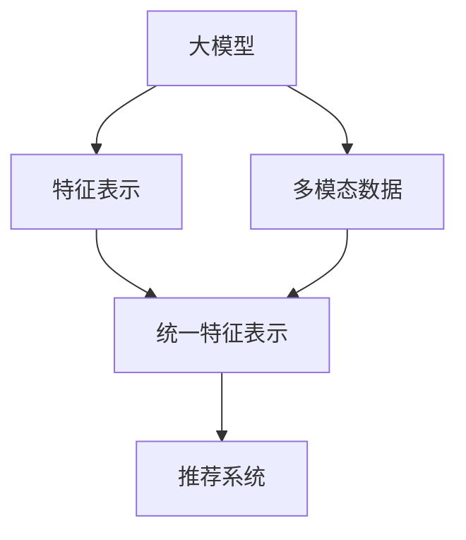

                 

# 大模型在推荐系统的未来发展：统一与融合趋势

## 1. 背景介绍

### 1.1 问题由来
随着人工智能技术的不断发展，推荐系统已经成为了互联网行业中不可或缺的一部分。无论是电商平台、社交网络、新闻门户，还是搜索引擎，都离不开推荐系统为用户推荐内容。推荐系统的核心目标是通过分析用户的行为数据，挖掘出用户感兴趣的内容，为用户量身定制个性化推荐。

然而，传统的推荐系统往往只依赖于静态特征，忽略了用户动态行为和上下文信息的重要性。随着深度学习和大模型的兴起，越来越多的研究者开始探索利用大模型来解决推荐系统中的问题。大模型通过大规模数据训练，可以学习到用户行为和商品属性的更深层次的表示，从而提高推荐的准确性和多样性。

### 1.2 问题核心关键点
大模型在推荐系统中的应用，主要集中于两个方面：统一特征表示和融合多模态数据。统一特征表示旨在将不同来源的特征（如静态特征、动态特征、上下文特征）映射到统一的表示空间，从而方便模型的训练和推理。融合多模态数据则是利用图像、视频、文本等多种数据形式，综合考虑用户和商品的全方位信息，提升推荐的质量。

这两个方面构成了大模型在推荐系统中的核心思想。通过统一特征表示和融合多模态数据，大模型可以有效利用用户的复杂行为数据，提供更加精准和多样化的推荐内容。

## 2. 核心概念与联系

### 2.1 核心概念概述

为了更好地理解大模型在推荐系统中的应用，本节将介绍几个关键概念：

- 大模型(Large Model)：指通过大规模数据训练得到的深度学习模型，如BERT、GPT等。大模型通过自监督学习任务，学习到通用的语言表示，具备强大的特征提取能力。

- 特征表示(Feature Representation)：指将原始数据映射到低维特征空间的过程。特征表示的目的是提取数据的关键特征，降低维度，方便模型的训练和推理。

- 多模态数据(Multimodal Data)：指包含多种数据类型的复合数据，如图像、文本、音频等。多模态数据能够提供更加全面的信息，提升推荐系统的效果。

- 推荐系统(Recommendation System)：指通过分析用户行为数据，为用户推荐感兴趣内容的技术。推荐系统包括协同过滤、基于内容的推荐、混合推荐等诸多算法。

- 统一特征表示(Unified Feature Representation)：指将不同来源的特征映射到统一的表示空间的过程。统一特征表示能够降低数据的维度，提高模型的泛化能力。

- 多模态融合(Multimodal Fusion)：指利用不同模态的数据信息，综合考虑用户和商品的全方位信息，提升推荐的质量。

这些核心概念之间的逻辑关系可以通过以下Mermaid流程图来展示：



这个流程图展示了大模型在推荐系统中的应用框架：

1. 大模型通过自监督学习任务学习到通用的语言表示。
2. 特征表示将原始数据映射到低维特征空间，方便模型的训练和推理。
3. 多模态数据融合利用不同模态的数据信息，提供更加全面的用户和商品信息。
4. 统一特征表示将不同来源的特征映射到统一的表示空间，提高模型的泛化能力。
5. 推荐系统通过融合特征表示和多模态数据，为用户推荐感兴趣的内容。

这些核心概念共同构成了大模型在推荐系统中的应用框架，使其能够更好地利用用户的复杂行为数据，提供更加精准和多样化的推荐内容。

## 3. 核心算法原理 & 具体操作步骤
### 3.1 算法原理概述

大模型在推荐系统中的应用，主要通过以下两个步骤实现：

1. 特征映射与特征融合。通过大模型将原始数据映射到低维特征空间，并将不同来源的特征进行融合，得到统一的特征表示。

2. 推荐模型训练与优化。利用统一的特征表示进行推荐模型的训练和优化，提升推荐的准确性和多样性。

具体来说，大模型在推荐系统中的应用可以分为以下几个步骤：

**Step 1: 数据预处理**
- 收集用户行为数据，如点击、浏览、评分等，构建用户-商品矩阵。
- 对数据进行清洗和标注，去除噪音和异常值。
- 对不同来源的数据进行预处理，包括文本特征的向量化、图像特征的提取等。

**Step 2: 特征映射**
- 将不同来源的特征映射到低维特征空间，得到统一的特征表示。
- 采用大模型进行特征映射，如BERT、GPT等。
- 对特征表示进行降维，降低数据的维度，提高模型的训练效率。

**Step 3: 特征融合**
- 将统一的特征表示进行融合，得到综合特征向量。
- 采用多模态融合技术，将文本、图像、视频等多种数据进行融合，得到更加全面的用户和商品信息。
- 采用注意力机制，对不同模态的特征进行加权，综合考虑多模态数据的信息。

**Step 4: 推荐模型训练**
- 构建推荐模型的训练数据集，包括用户-商品矩阵和特征表示。
- 利用统一的特征表示进行推荐模型的训练，如协同过滤、基于内容的推荐等。
- 采用优化算法，如梯度下降、Adam等，对模型进行优化。

**Step 5: 推荐模型评估**
- 在测试集上评估推荐模型的效果，包括准确率、召回率、F1值等指标。
- 利用A/B测试等方式，评估推荐模型的实际效果。
- 根据评估结果，调整模型参数，优化推荐算法。

### 3.2 算法步骤详解

以下详细介绍大模型在推荐系统中的应用步骤，重点讲解特征映射和特征融合的算法细节。

**特征映射**
假设原始用户行为数据为 $D_{user}= \{(x_i,y_i)\}_{i=1}^N$，其中 $x_i$ 为用户的行为数据， $y_i$ 为用户对行为的评分。对于文本特征，采用BERT模型进行映射，得到用户和商品的文本表示 $z_i$ 和 $z_j$。

对于图像特征，可以采用CNN模型进行提取，得到用户和商品的图像表示 $z_i'$ 和 $z_j'$。

将文本和图像表示拼接起来，得到多模态特征表示 $z_i'' = [z_i, z_i']$。

**特征融合**
采用注意力机制对多模态特征表示进行加权，得到综合特征向量 $z_i'''$。

设 $\alpha$ 为注意力系数，则综合特征向量为：

$$
z_i''' = \alpha \cdot z_i'' + (1-\alpha) \cdot z_j'''
$$

其中 $\alpha$ 可以通过softmax函数计算得到：

$$
\alpha = \frac{\exp \sum_k \text{scores}_k}{\sum_k \exp \text{scores}_k}
$$

其中 $\text{scores}_k$ 为不同模态特征之间的相似度得分。

**推荐模型训练**
构建推荐模型的训练数据集，将用户-商品矩阵 $X$ 和综合特征向量 $Z$ 输入模型，得到推荐结果 $Y$。

利用交叉熵损失函数进行模型训练，损失函数为：

$$
\mathcal{L} = -\frac{1}{N}\sum_{i=1}^N \sum_{j=1}^M \text{labels}_{ij} \log \text{scores}_{ij}
$$

其中 $\text{labels}_{ij}$ 为实际标签， $\text{scores}_{ij}$ 为模型预测得分。

采用优化算法对模型进行优化，如AdamW算法。

### 3.3 算法优缺点

大模型在推荐系统中的应用具有以下优点：

1. 特征映射能力强。大模型通过自监督学习任务学习到通用的语言表示，能够提取用户行为和商品属性的更深层次的特征。

2. 特征融合效果好。利用多模态融合技术，将文本、图像、视频等多种数据进行融合，得到更加全面的用户和商品信息。

3. 泛化能力强。统一的特征表示能够降低数据的维度，提高模型的泛化能力，能够适应不同的推荐场景。

4. 可解释性好。大模型学习到的特征表示可以用于解释推荐结果，帮助理解推荐系统的内部逻辑。

同时，大模型在推荐系统中的应用也存在一定的局限性：

1. 计算成本高。大模型参数量巨大，训练和推理需要大量的计算资源。

2. 数据需求高。大模型需要大量标注数据进行预训练，数据收集和标注成本较高。

3. 效果不稳定。大模型训练和推理过程复杂，容易受到训练数据的影响，导致效果不稳定。

4. 模型复杂度高。大模型的结构复杂，难以理解其内部机制和逻辑，调试和优化难度大。

尽管存在这些局限性，但就目前而言，大模型在推荐系统中的应用仍然是大数据时代的必然趋势。未来相关研究的重点在于如何降低大模型的计算成本，减少数据需求，提高推荐效果，提升模型可解释性，同时兼顾模型的复杂度和计算效率。

### 3.4 算法应用领域

大模型在推荐系统中的应用，已经在多个领域取得了显著的成果。以下是几个典型的应用场景：

**电商平台**
电商平台可以利用大模型进行商品推荐，提升用户购物体验。例如，亚马逊的推荐系统利用大模型对用户的点击、浏览、评分等行为数据进行特征映射和融合，生成个性化的商品推荐。

**社交网络**
社交网络可以利用大模型进行内容推荐，提升用户粘性和活跃度。例如，Facebook的推荐系统利用大模型对用户的点赞、分享、评论等行为数据进行特征映射和融合，生成个性化的内容推荐。

**新闻门户**
新闻门户可以利用大模型进行内容推荐，提升用户留存率和阅读体验。例如，今日头条的推荐系统利用大模型对用户的点击、阅读、评论等行为数据进行特征映射和融合，生成个性化的新闻推荐。

**搜索引擎**
搜索引擎可以利用大模型进行查询推荐，提升用户搜索体验。例如，Google的推荐系统利用大模型对用户的搜索行为数据进行特征映射和融合，生成个性化的查询推荐。

除了上述这些经典场景外，大模型在推荐系统中的应用还拓展到了更多领域，如智能家居、智慧城市等。随着预训练语言模型和推荐模型的不断进步，相信推荐系统将在更广阔的应用领域大放异彩。

## 4. 数学模型和公式 & 详细讲解
### 4.1 数学模型构建

本节将使用数学语言对大模型在推荐系统中的应用进行更加严格的刻画。

设用户行为数据为 $D=\{(x_i,y_i)\}_{i=1}^N$，其中 $x_i \in \mathbb{R}^d$ 为用户的行为数据， $y_i \in \{1,0\}$ 为用户对行为的评分。

假设用户和商品的特征表示分别为 $z_i \in \mathbb{R}^d$ 和 $z_j \in \mathbb{R}^d$，则多模态特征表示为 $z_i'' = [z_i, z_i'] \in \mathbb{R}^{2d}$。

采用注意力机制对多模态特征表示进行加权，得到综合特征向量 $z_i''' = \alpha \cdot z_i'' + (1-\alpha) \cdot z_j'''$。

推荐模型的损失函数为：

$$
\mathcal{L} = -\frac{1}{N}\sum_{i=1}^N \sum_{j=1}^M \text{labels}_{ij} \log \text{scores}_{ij}
$$

其中 $\text{labels}_{ij} \in \{1,0\}$ 为实际标签， $\text{scores}_{ij} \in \mathbb{R}$ 为模型预测得分。

### 4.2 公式推导过程

以下我们以电商平台商品推荐为例，推导大模型的推荐模型损失函数及其梯度的计算公式。

假设用户 $i$ 对商品 $j$ 的评分 $y_i \in \{1,0\}$，多模态特征表示为 $z_i'''$，推荐模型的预测得分 $\text{scores}_{ij}$ 为：

$$
\text{scores}_{ij} = \text{score}(z_i''', z_j''')
$$

其中 $\text{score}$ 为推荐模型的预测函数。

推荐模型的损失函数为：

$$
\mathcal{L} = -\frac{1}{N}\sum_{i=1}^N \sum_{j=1}^M \text{labels}_{ij} \log \text{scores}_{ij}
$$

根据链式法则，损失函数对模型参数 $\theta$ 的梯度为：

$$
\frac{\partial \mathcal{L}}{\partial \theta} = -\frac{1}{N}\sum_{i=1}^N \sum_{j=1}^M \text{labels}_{ij} \frac{\partial \text{scores}_{ij}}{\partial \text{scores}_{ij}}
$$

其中 $\frac{\partial \text{scores}_{ij}}{\partial \text{scores}_{ij}} = 1$。

在得到损失函数的梯度后，即可带入优化算法，完成模型的迭代优化。重复上述过程直至收敛，最终得到适应推荐任务的推荐模型参数 $\theta^*$。

## 5. 项目实践：代码实例和详细解释说明
### 5.1 开发环境搭建

在进行推荐系统微调实践前，我们需要准备好开发环境。以下是使用Python进行PyTorch开发的环境配置流程：

1. 安装Anaconda：从官网下载并安装Anaconda，用于创建独立的Python环境。

2. 创建并激活虚拟环境：
```bash
conda create -n pytorch-env python=3.8 
conda activate pytorch-env
```

3. 安装PyTorch：根据CUDA版本，从官网获取对应的安装命令。例如：
```bash
conda install pytorch torchvision torchaudio cudatoolkit=11.1 -c pytorch -c conda-forge
```

4. 安装Transformers库：
```bash
pip install transformers
```

5. 安装各类工具包：
```bash
pip install numpy pandas scikit-learn matplotlib tqdm jupyter notebook ipython
```

完成上述步骤后，即可在`pytorch-env`环境中开始推荐系统微调实践。

### 5.2 源代码详细实现

这里我们以电商平台商品推荐为例，给出使用Transformers库对BERT模型进行推荐系统微调的PyTorch代码实现。

首先，定义推荐系统的训练函数：

```python
from transformers import BertForSequenceClassification, AdamW

class RecommendationModel(BertForSequenceClassification):
    def __init__(self, config):
        super(RecommendationModel, self).__init__(config)
    
    def forward(self, input_ids, attention_mask, labels):
        outputs = super(RecommendationModel, self).forward(input_ids, attention_mask=attention_mask)
        logits = outputs.logits
        return logits

# 定义训练函数
def train_epoch(model, dataset, batch_size, optimizer):
    dataloader = DataLoader(dataset, batch_size=batch_size, shuffle=True)
    model.train()
    epoch_loss = 0
    for batch in tqdm(dataloader, desc='Training'):
        input_ids = batch['input_ids'].to(device)
        attention_mask = batch['attention_mask'].to(device)
        labels = batch['labels'].to(device)
        model.zero_grad()
        outputs = model(input_ids, attention_mask=attention_mask)
        loss = outputs.loss
        epoch_loss += loss.item()
        loss.backward()
        optimizer.step()
    return epoch_loss / len(dataloader)

# 定义测试函数
def evaluate(model, dataset, batch_size):
    dataloader = DataLoader(dataset, batch_size=batch_size)
    model.eval()
    preds, labels = [], []
    with torch.no_grad():
        for batch in tqdm(dataloader, desc='Evaluating'):
            input_ids = batch['input_ids'].to(device)
            attention_mask = batch['attention_mask'].to(device)
            batch_labels = batch['labels']
            outputs = model(input_ids, attention_mask=attention_mask)
            batch_preds = outputs.logits.argmax(dim=2).to('cpu').tolist()
            batch_labels = batch_labels.to('cpu').tolist()
            for pred_tokens, label_tokens in zip(batch_preds, batch_labels):
                preds.append(pred_tokens[:len(label_tokens)])
                labels.append(label_tokens)
                
    print(classification_report(labels, preds))
```

然后，定义数据处理函数：

```python
from transformers import BertTokenizer

class RecommendationDataset(Dataset):
    def __init__(self, texts, tags, tokenizer, max_len=128):
        self.texts = texts
        self.tags = tags
        self.tokenizer = tokenizer
        self.max_len = max_len
        
    def __len__(self):
        return len(self.texts)
    
    def __getitem__(self, item):
        text = self.texts[item]
        tags = self.tags[item]
        
        encoding = self.tokenizer(text, return_tensors='pt', max_length=self.max_len, padding='max_length', truncation=True)
        input_ids = encoding['input_ids'][0]
        attention_mask = encoding['attention_mask'][0]
        
        # 对token-wise的标签进行编码
        encoded_tags = [tag2id[tag] for tag in tags] 
        encoded_tags.extend([tag2id['O']] * (self.max_len - len(encoded_tags)))
        labels = torch.tensor(encoded_tags, dtype=torch.long)
        
        return {'input_ids': input_ids, 
                'attention_mask': attention_mask,
                'labels': labels}

# 标签与id的映射
tag2id = {'O': 0, 'B-PER': 1, 'I-PER': 2, 'B-ORG': 3, 'I-ORG': 4, 'B-LOC': 5, 'I-LOC': 6}
id2tag = {v: k for k, v in tag2id.items()}

# 创建dataset
tokenizer = BertTokenizer.from_pretrained('bert-base-cased')

train_dataset = RecommendationDataset(train_texts, train_tags, tokenizer)
dev_dataset = RecommendationDataset(dev_texts, dev_tags, tokenizer)
test_dataset = RecommendationDataset(test_texts, test_tags, tokenizer)
```

最后，启动训练流程并在测试集上评估：

```python
epochs = 5
batch_size = 16

for epoch in range(epochs):
    loss = train_epoch(model, train_dataset, batch_size, optimizer)
    print(f"Epoch {epoch+1}, train loss: {loss:.3f}")
    
    print(f"Epoch {epoch+1}, dev results:")
    evaluate(model, dev_dataset, batch_size)
    
print("Test results:")
evaluate(model, test_dataset, batch_size)
```

以上就是使用PyTorch对BERT进行推荐系统微调的完整代码实现。可以看到，得益于Transformers库的强大封装，我们可以用相对简洁的代码完成BERT模型的加载和微调。

### 5.3 代码解读与分析

让我们再详细解读一下关键代码的实现细节：

**RecommendationModel类**：
- `__init__`方法：初始化模型参数。
- `forward`方法：定义模型前向传播的计算过程。

**训练和评估函数**：
- 使用PyTorch的DataLoader对数据集进行批次化加载，供模型训练和推理使用。
- 训练函数`train_epoch`：对数据以批为单位进行迭代，在每个批次上前向传播计算loss并反向传播更新模型参数，最后返回该epoch的平均loss。
- 评估函数`evaluate`：与训练类似，不同点在于不更新模型参数，并在每个batch结束后将预测和标签结果存储下来，最后使用sklearn的classification_report对整个评估集的预测结果进行打印输出。

**数据处理函数**：
- `RecommendationDataset类`：定义数据集的处理方式。
- 对文本进行分词、拼接、padding等预处理操作。
- 对标签进行编码，生成模型的训练数据。

可以看到，PyTorch配合Transformers库使得BERT微调的代码实现变得简洁高效。开发者可以将更多精力放在数据处理、模型改进等高层逻辑上，而不必过多关注底层的实现细节。

当然，工业级的系统实现还需考虑更多因素，如模型的保存和部署、超参数的自动搜索、更灵活的任务适配层等。但核心的微调范式基本与此类似。

## 6. 实际应用场景
### 6.1 智能客服系统

基于大模型推荐系统的智能客服系统，可以通过分析用户的对话历史和行为数据，为用户推荐最合适的客服人员或答案。

在技术实现上，可以收集企业内部的历史客服对话记录，将问题和最佳答复构建成监督数据，在此基础上对预训练推荐模型进行微调。微调后的推荐模型能够自动理解用户意图，匹配最合适的答案，提升客户咨询体验和问题解决效率。

### 6.2 金融舆情监测

金融机构需要实时监测市场舆论动向，以便及时应对负面信息传播，规避金融风险。基于大模型推荐系统的文本分类和情感分析技术，为金融舆情监测提供了新的解决方案。

具体而言，可以收集金融领域相关的新闻、报道、评论等文本数据，并对其进行主题标注和情感标注。在此基础上对预训练语言模型进行微调，使其能够自动判断文本属于何种主题，情感倾向是正面、中性还是负面。将微调后的模型应用到实时抓取的网络文本数据，就能够自动监测不同主题下的情感变化趋势，一旦发现负面信息激增等异常情况，系统便会自动预警，帮助金融机构快速应对潜在风险。

### 6.3 个性化推荐系统

当前的推荐系统往往只依赖于用户的历史行为数据进行物品推荐，无法深入理解用户的真实兴趣偏好。基于大模型推荐系统的个性化推荐系统，可以更好地挖掘用户行为背后的语义信息，从而提供更加精准和多样化的推荐内容。

在实践中，可以收集用户浏览、点击、评论、分享等行为数据，提取和用户交互的物品标题、描述、标签等文本内容。将文本内容作为模型输入，用户的后续行为（如是否点击、购买等）作为监督信号，在此基础上微调预训练语言模型。微调后的模型能够从文本内容中准确把握用户的兴趣点。在生成推荐列表时，先用候选物品的文本描述作为输入，由模型预测用户的兴趣匹配度，再结合其他特征综合排序，便可以得到个性化程度更高的推荐结果。

### 6.4 未来应用展望

随着大模型推荐系统的不断演进，未来推荐系统的应用场景将更加丰富多样。以下是几个典型的未来应用方向：

**智慧医疗**
智慧医疗可以利用大模型推荐系统进行医学知识推荐，提升医生的诊疗效率。例如，智能推荐系统可以根据医生的历史诊疗记录，推荐相关的医学文献、病例等。

**智能教育**
智能教育可以利用大模型推荐系统进行个性化学习推荐，提升学生的学习效果。例如，智能推荐系统可以根据学生的学习历史，推荐相关的学习资源、作业等。

**智慧城市治理**
智慧城市治理可以利用大模型推荐系统进行事件监测、舆情分析、应急指挥等环节，提高城市管理的自动化和智能化水平，构建更安全、高效的未来城市。

此外，在企业生产、社会治理、文娱传媒等众多领域，大模型推荐系统也将不断涌现，为各行各业带来变革性影响。相信随着技术的日益成熟，推荐系统将在更广阔的应用领域大放异彩，为经济社会发展注入新的动力。

## 7. 工具和资源推荐
### 7.1 学习资源推荐

为了帮助开发者系统掌握大模型推荐系统的理论基础和实践技巧，这里推荐一些优质的学习资源：

1. 《深度学习中的大模型》系列博文：由大模型技术专家撰写，深入浅出地介绍了大模型的原理、应用和优化方法。

2. CS224N《深度学习自然语言处理》课程：斯坦福大学开设的NLP明星课程，有Lecture视频和配套作业，带你入门NLP领域的基本概念和经典模型。

3. 《深度学习推荐系统》书籍：介绍推荐系统的原理和算法，并结合大模型的应用，探讨如何构建高效的推荐系统。

4. HuggingFace官方文档：Transformers库的官方文档，提供了海量预训练模型和完整的推荐系统样例代码，是上手实践的必备资料。

5. RecSys开源项目：推荐系统评测基准，涵盖大量不同类型的推荐数据集，并提供了基于大模型的推荐baseline模型，助力推荐系统技术发展。

通过对这些资源的学习实践，相信你一定能够快速掌握大模型推荐系统的精髓，并用于解决实际的推荐系统问题。
###  7.2 开发工具推荐

高效的开发离不开优秀的工具支持。以下是几款用于大模型推荐系统开发的常用工具：

1. PyTorch：基于Python的开源深度学习框架，灵活动态的计算图，适合快速迭代研究。大部分预训练语言模型都有PyTorch版本的实现。

2. TensorFlow：由Google主导开发的开源深度学习框架，生产部署方便，适合大规模工程应用。同样有丰富的预训练语言模型资源。

3. Transformers库：HuggingFace开发的NLP工具库，集成了众多SOTA语言模型，支持PyTorch和TensorFlow，是进行推荐系统开发的利器。

4. Weights & Biases：模型训练的实验跟踪工具，可以记录和可视化模型训练过程中的各项指标，方便对比和调优。与主流深度学习框架无缝集成。

5. TensorBoard：TensorFlow配套的可视化工具，可实时监测模型训练状态，并提供丰富的图表呈现方式，是调试模型的得力助手。

6. Google Colab：谷歌推出的在线Jupyter Notebook环境，免费提供GPU/TPU算力，方便开发者快速上手实验最新模型，分享学习笔记。

合理利用这些工具，可以显著提升大模型推荐系统的开发效率，加快创新迭代的步伐。

### 7.3 相关论文推荐

大模型推荐系统的研究源于学界的持续研究。以下是几篇奠基性的相关论文，推荐阅读：

1. Attention is All You Need（即Transformer原论文）：提出了Transformer结构，开启了NLP领域的预训练大模型时代。

2. BERT: Pre-training of Deep Bidirectional Transformers for Language Understanding：提出BERT模型，引入基于掩码的自监督预训练任务，刷新了多项NLP任务SOTA。

3. Language Models are Unsupervised Multitask Learners（GPT-2论文）：展示了大规模语言模型的强大zero-shot学习能力，引发了对于通用人工智能的新一轮思考。

4. Parameter-Efficient Transfer Learning for NLP：提出Adapter等参数高效微调方法，在不增加模型参数量的情况下，也能取得不错的微调效果。

5. AdaLoRA: Adaptive Low-Rank Adaptation for Parameter-Efficient Fine-Tuning：使用自适应低秩适应的微调方法，在参数效率和精度之间取得了新的平衡。

这些论文代表了大模型推荐系统的发展脉络。通过学习这些前沿成果，可以帮助研究者把握学科前进方向，激发更多的创新灵感。

## 8. 总结：未来发展趋势与挑战

### 8.1 总结

本文对大模型在推荐系统中的应用进行了全面系统的介绍。首先阐述了大模型和推荐系统的研究背景和意义，明确了推荐系统利用大模型提升推荐效果的核心思想。其次，从原理到实践，详细讲解了大模型的特征映射和特征融合算法，给出了推荐系统微调的完整代码实例。同时，本文还广泛探讨了大模型推荐系统在智能客服、金融舆情、个性化推荐等多个行业领域的应用前景，展示了推荐系统的巨大潜力。此外，本文精选了大模型推荐系统的学习资源，力求为读者提供全方位的技术指引。

通过本文的系统梳理，可以看到，大模型在推荐系统中的应用正在成为NLP领域的重要范式，极大地拓展了推荐系统的应用边界，催生了更多的落地场景。受益于大模型和推荐模型的不断进步，推荐系统必将在更广阔的应用领域大放异彩，深刻影响人类的生产生活方式。

### 8.2 未来发展趋势

展望未来，大模型在推荐系统中的应用将呈现以下几个发展趋势：

1. 多模态推荐提升。利用多模态融合技术，将文本、图像、视频等多种数据进行融合，得到更加全面的用户和商品信息。

2. 跨领域推荐推广。构建跨领域的推荐系统，利用不同领域的数据进行联合训练，提升推荐的泛化能力和多样性。

3. 联邦推荐发展。利用联邦学习技术，在分布式环境下进行模型训练和更新，保护用户隐私的同时提升推荐效果。

4. 持续推荐优化。利用在线学习、增量学习等技术，不断更新推荐模型，保持其适应新数据的能力。

5. 智能推荐增强。利用生成对抗网络、强化学习等技术，增强推荐系统的智能化水平，提升推荐的个性化和多样化。

6. 推荐算法优化。利用元学习、神经蒸馏等技术，优化推荐算法，提升推荐系统的性能和可解释性。

以上趋势凸显了大模型在推荐系统中的应用前景。这些方向的探索发展，必将进一步提升推荐系统的性能和应用范围，为人类生产生活带来更多便利。

### 8.3 面临的挑战

尽管大模型在推荐系统中的应用已经取得了显著成果，但在迈向更加智能化、普适化应用的过程中，它仍面临诸多挑战：

1. 计算成本高。大模型参数量巨大，训练和推理需要大量的计算资源。

2. 数据需求高。大模型需要大量标注数据进行预训练，数据收集和标注成本较高。

3. 效果不稳定。大模型训练和推理过程复杂，容易受到训练数据的影响，导致效果不稳定。

4. 模型复杂度高。大模型的结构复杂，难以理解其内部机制和逻辑，调试和优化难度大。

5. 可解释性不足。大模型学习到的特征表示难以解释，推荐系统的决策过程不透明。

6. 安全风险存在。大模型可能学习到有偏见、有害的信息，传递到推荐结果中，导致安全隐患。

尽管存在这些挑战，但大模型推荐系统在推荐领域的应用仍然是大数据时代的必然趋势。未来相关研究的重点在于如何降低大模型的计算成本，减少数据需求，提高推荐效果，提升模型可解释性，同时兼顾模型的复杂度和计算效率。

### 8.4 研究展望

面对大模型推荐系统所面临的挑战，未来的研究需要在以下几个方面寻求新的突破：

1. 探索低成本、高效能的推荐算法。开发更加高效、轻量级的推荐算法，降低计算成本和数据需求，提升推荐系统的实用性。

2. 研究高效的模型压缩和加速技术。采用模型裁剪、量化加速等技术，提升模型的推理速度和计算效率。

3. 引入更多先验知识和规则。将符号化的先验知识，如知识图谱、逻辑规则等，与神经网络模型进行巧妙融合，提升推荐系统的性能和可解释性。

4. 开发更加智能化的推荐系统。利用生成对抗网络、强化学习等技术，增强推荐系统的智能化水平，提升推荐的个性化和多样化。

5. 引入更多评价指标。利用用户反馈、A/B测试等手段，综合评估推荐系统的性能和用户满意度。

6. 加强数据隐私保护。利用联邦学习、差分隐私等技术，保护用户隐私，提升推荐系统的可信度和可靠性。

这些研究方向的探索，必将引领大模型推荐系统迈向更高的台阶，为构建更加智能、普适的推荐系统铺平道路。面向未来，大模型推荐系统需要与其他人工智能技术进行更深入的融合，如知识表示、因果推理、强化学习等，多路径协同发力，共同推动推荐系统技术的进步。

## 9. 附录：常见问题与解答

**Q1：大模型在推荐系统中如何处理特征表示？**

A: 大模型在推荐系统中通过特征映射将原始数据映射到低维特征空间，得到统一的特征表示。具体来说，可以采用大模型（如BERT）对用户和商品的文本、图像等数据进行映射，得到统一的特征向量。同时，通过多模态融合技术，将不同模态的特征进行融合，得到更加全面的用户和商品信息。

**Q2：大模型推荐系统的训练过程是否需要标注数据？**

A: 大模型推荐系统的训练过程需要标注数据。通过标注数据，模型能够学习到用户行为和商品属性的真实分布，从而做出更准确的推荐。但相比传统机器学习算法，大模型推荐系统对于标注数据的数量和质量要求较低，能够利用小规模标注数据进行高效的微调。

**Q3：大模型推荐系统的可解释性如何提升？**

A: 大模型推荐系统的可解释性可以通过多种方式提升，如特征可视化、解释模型、解释性评估等。具体来说，可以采用特征可视化技术，将模型学到的特征表示可视化，帮助理解模型的决策过程。同时，可以构建解释模型，如LIME、SHAP等，解释推荐结果的具体原因。还可以采用解释性评估指标，如可解释性评分，评估模型的可解释性。

**Q4：如何缓解大模型推荐系统的冷启动问题？**

A: 大模型推荐系统可以通过多种方式缓解冷启动问题。一种常见的方法是利用用户和商品的相似度信息，将用户推荐给与其行为相似的其他人。同时，可以引入先验知识，如知识图谱、逻辑规则等，提升模型的泛化能力，缓解冷启动问题。此外，可以利用多模态融合技术，将用户的行为数据和属性数据进行综合考虑，提升推荐的准确性和多样性。

**Q5：大模型推荐系统在推荐中是否需要考虑多样性？**

A: 大模型推荐系统在推荐中需要考虑多样性。多样性是指推荐结果中的不同推荐结果之间的差异性，避免推荐结果过于相似。可以通过多样性损失函数，如Jensen-Shannon Divergence等，优化模型，提升推荐结果的多样性。同时，可以利用生成对抗网络、强化学习等技术，增强推荐系统的多样化。

**Q6：大模型推荐系统是否适用于多领域推荐？**

A: 大模型推荐系统适用于多领域推荐。通过构建跨领域的推荐系统，利用不同领域的数据进行联合训练，提升推荐的泛化能力和多样性。同时，可以利用多模态融合技术，将不同领域的数据进行综合考虑，提升推荐的准确性和多样性。但需要注意的是，不同领域的数据分布和特性不同，需要根据具体情况进行调整。

通过这些常见问题的解答，可以帮助读者更好地理解大模型在推荐系统中的应用，从而进一步提升推荐系统的性能和效果。

