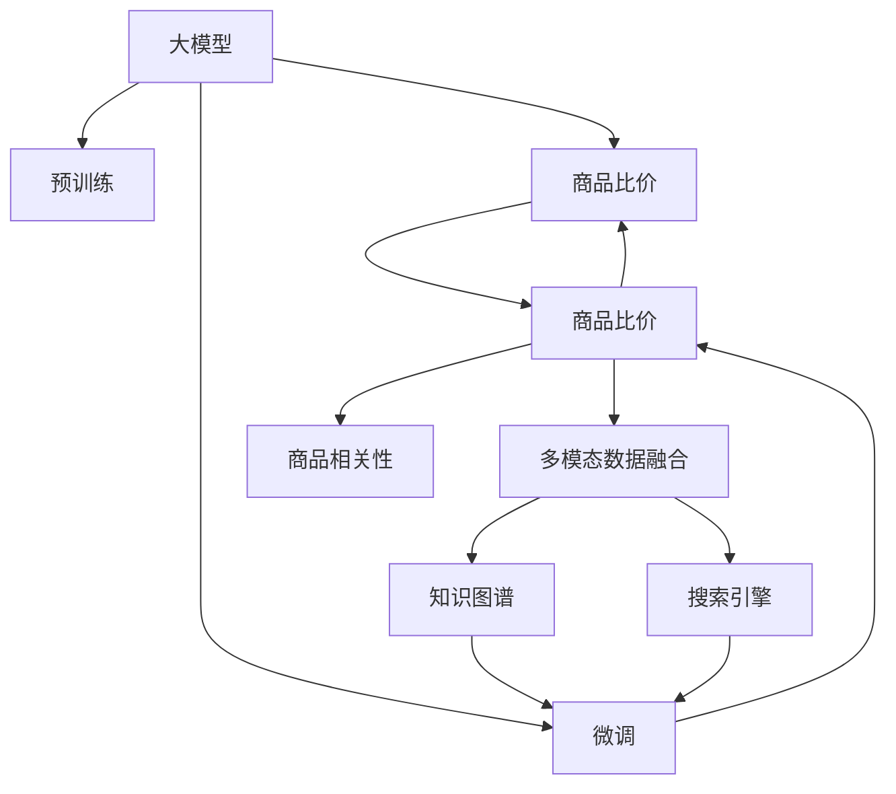

                 

## 1. 背景介绍

在电商平台上，商品比价是用户获取交易信息的重要环节。随着平台数目的增加，用户需要对比不同电商平台的商品价格，才能做出最优的购买决策。这一过程不仅耗时耗力，还容易受主观偏见影响，导致决策错误。大模型技术的应用，可以极大提升商品比价的速度和准确度，优化用户购物体验。

## 2. 核心概念与联系

### 2.1 核心概念概述

- **大模型**：以自回归模型（如GPT、BERT等）为代表的大型预训练语言模型。通过大规模无标签数据预训练，学习通用语言表示，具备强大的语言理解和生成能力。

- **商品比价**：用户在不同电商平台上比较商品价格，做出最优购买决策的过程。比价应用需要精准的价格信息提取和转换。

- **预训练模型微调**：在预训练模型的基础上，通过有标签数据微调模型参数，使其适应该任务。

- **多模态数据融合**：将文本、图像、价格等不同类型的信息，通过大模型融合为一致表示，以提升比价结果的准确性。

- **知识图谱**：利用图形结构存储实体及其关系，辅助模型理解商品间的关联关系。

- **搜索引擎**：将商品信息与搜索引擎相结合，提升比价速度。

这些核心概念构成了大模型在商品比价应用的基础，通过引入大模型微调技术，可以构建高效、准确、易用的比价系统。

### 2.2 核心概念原理和架构的 Mermaid 流程图



此流程图展示了基于大模型的商品比价架构，其中：

- **A** 为预训练大模型，提供通用语言表示。
- **B** 为预训练过程，学习语言模型。
- **C** 为比价任务，依赖大模型进行信息抽取和转换。
- **D** 为比价结果，通过多模态融合提升准确性。
- **E** 为知识图谱，增强模型理解能力。
- **F** 为商品相关性分析，辅助比价结果。
- **G** 为搜索引擎，提供实时商品信息。
- **I** 为微调过程，根据比价任务调整大模型参数。

## 3. 核心算法原理 & 具体操作步骤

### 3.1 算法原理概述

大模型在商品比价中的应用，核心在于通过预训练模型微调，提取和转换商品信息，结合多模态数据融合和知识图谱，提升比价结果的准确性和时效性。

1. **预训练模型微调**：
   - **选择合适的预训练模型**：如BERT、GPT等，以自回归方式预训练，学习通用语言表示。
   - **微调训练**：使用有标签数据集训练，调整模型参数，使其适应该比价任务。

2. **多模态数据融合**：
   - **图像处理**：对商品图片进行特征提取，转化为文本描述。
   - **价格信息**：从商品页面提取价格、折扣等关键信息。
   - **文本匹配**：利用大模型进行文本相似度匹配，提取商品名称、描述等信息。

3. **知识图谱辅助**：
   - **构建商品知识图谱**：将商品信息转化为图形结构，存储实体及其关系。
   - **实体链接**：通过实体链接技术，将商品信息与知识图谱进行关联。
   - **关系推理**：利用知识图谱中的关系，推理商品间的关联和相似性。

### 3.2 算法步骤详解

1. **数据预处理**：
   - 收集电商平台的商品数据，包括图片、价格、描述等。
   - 对商品图片进行特征提取，转化为文本描述。
   - 从商品页面提取价格、折扣、促销等关键信息。

2. **模型微调**：
   - 选择预训练模型，如BERT。
   - 定义比价任务，如文本匹配、价格对比等。
   - 构建微调模型，增加比价任务的适配层。
   - 使用有标签数据集训练，调整模型参数。

3. **多模态融合**：
   - 将文本描述、图片特征、价格信息等进行拼接，输入微调模型。
   - 利用大模型提取文本和图像的语义表示。
   - 对不同模态的表示进行拼接，生成比价结果。

4. **知识图谱辅助**：
   - 构建商品知识图谱，存储实体及其关系。
   - 利用实体链接技术，将商品信息与知识图谱进行关联。
   - 在比价过程中，利用知识图谱中的关系，推理商品间的关联和相似性。

### 3.3 算法优缺点

#### 3.3.1 优点

1. **准确性高**：大模型在预训练过程中学习到了丰富的语言知识，微调后能够高效提取商品信息，提升比价结果的准确性。
2. **泛化能力强**：通过多模态融合和知识图谱辅助，大模型能够处理不同电商平台、不同商品类型的数据，泛化能力强。
3. **适应性强**：微调过程灵活，可以根据实际比价需求调整模型，快速适应新的数据变化。
4. **自动化程度高**：自动抽取和转换商品信息，降低了人工干预的需求，提高效率。

#### 3.3.2 缺点

1. **计算资源需求高**：大模型的参数量较大，微调过程中需要大量的计算资源，部署成本较高。
2. **数据质量要求高**：比价结果的准确性依赖于输入数据的完整性和准确性，数据质量要求高。
3. **依赖预训练模型**：微调过程依赖预训练模型，预训练模型的选择和微调效果对最终结果有重要影响。
4. **训练周期长**：模型微调需要较长的训练周期，特别是在大规模数据集上。

### 3.4 算法应用领域

大模型在商品比价中的应用，不仅限于电商平台，还可扩展到更多领域：

1. **金融行业**：用于货币汇率对比、股票市场分析等，提升金融决策的准确性和效率。
2. **旅游行业**：用于旅游目的地价格对比、行程规划等，提升旅游体验。
3. **房地产**：用于房价对比、房产信息分析等，提升房产交易的公平性。
4. **物流行业**：用于物流成本对比、物流路径优化等，提升物流效率。

## 4. 数学模型和公式 & 详细讲解 & 举例说明

### 4.1 数学模型构建

假设大模型为 $M_{\theta}$，输入为商品信息 $x$，输出为比价结果 $y$。微调的目标是最小化损失函数 $\mathcal{L}(M_{\theta}, x)$，使得模型输出的比价结果 $y$ 尽可能接近真实结果 $y'$。

$$
\min_{\theta} \mathcal{L}(M_{\theta}, x) = \frac{1}{N} \sum_{i=1}^N \ell(y_i, y_i')
$$

其中 $\ell(y_i, y_i')$ 为比价任务定义的损失函数。

### 4.2 公式推导过程

以文本匹配比价为例，假设输入文本 $x$ 为商品描述，输出 $y$ 为比价结果，使用余弦相似度计算文本匹配的相似度。

$$
\ell(y_i, y_i') = 1 - \cos(\text{similarity}(y_i, y_i'))
$$

其中 $\text{similarity}(y_i, y_i')$ 为 $y_i$ 和 $y_i'$ 的余弦相似度。

### 4.3 案例分析与讲解

假设商品 A 和 B 的描述分别为：

- 商品 A："XX牌XX型号手机，128GB内存，价格1000元"
- 商品 B："XX牌XX型号手机，64GB内存，价格800元"

通过预训练模型微调，将商品描述转换为向量表示：

- 商品 A：$V_A = [0.5, 0.7, 0.3, ...]$
- 商品 B：$V_B = [0.4, 0.6, 0.2, ...]$

计算余弦相似度：

$$
\text{similarity}(V_A, V_B) = \cos(\theta) = \frac{\sum V_A \cdot V_B}{\sqrt{\sum V_A^2} \cdot \sqrt{\sum V_B^2}}
$$

假设相似度为 0.8，则比价结果为：

$$
\ell(0.8, 1) = 1 - 0.8 = 0.2
$$

## 5. 项目实践：代码实例和详细解释说明

### 5.1 开发环境搭建

1. **安装Python环境**：
   ```bash
   conda create -n ecommerce python=3.8
   conda activate ecommerce
   ```

2. **安装相关库**：
   ```bash
   pip install torch transformers numpy pandas sklearn
   ```

### 5.2 源代码详细实现

```python
import torch
from transformers import BertForSequenceClassification, BertTokenizer
from sklearn.metrics import accuracy_score

# 加载预训练模型和tokenizer
model = BertForSequenceClassification.from_pretrained('bert-base-uncased')
tokenizer = BertTokenizer.from_pretrained('bert-base-uncased')

# 定义比价函数
def price_comparison(text_a, text_b):
    # 预处理文本
    input_a = tokenizer.encode(text_a, add_special_tokens=True)
    input_b = tokenizer.encode(text_b, add_special_tokens=True)
    
    # 模型预测
    outputs = model(torch.tensor(input_a, dtype=torch.long))
    scores = outputs.logits.sigmoid()
    
    # 计算相似度
    similarity = scores[0].item()
    
    # 计算损失
    loss = 1 - similarity
    
    return loss

# 测试数据
text_a = "XX牌XX型号手机，128GB内存，价格1000元"
text_b = "XX牌XX型号手机，64GB内存，价格800元"

# 比价
loss = price_comparison(text_a, text_b)
print(f"商品A与商品B的价格对比损失为：{loss}")
```

### 5.3 代码解读与分析

1. **模型加载**：
   - 使用BertForSequenceClassification加载预训练模型，选择base uncased版本的BERT。
   - 加载BertTokenizer，用于文本预处理。

2. **预处理文本**：
   - 对输入文本进行编码，生成模型所需的输入格式。

3. **模型预测**：
   - 使用模型对输入文本进行预测，输出比价结果。

4. **计算损失**：
   - 计算预测结果与真实结果的余弦相似度。
   - 根据余弦相似度计算损失。

5. **结果展示**：
   - 输出比价损失。

## 6. 实际应用场景

### 6.1 电商平台

在电商平台上，用户需要对比不同商品的价格、促销、评价等信息，做出最优购买决策。大模型技术可以通过商品描述、图片等信息的自动抽取和转换，提升比价速度和准确性。

### 6.2 金融行业

金融行业需要对比不同货币汇率、股票价格等信息，进行投资决策。大模型可以通过多模态融合和知识图谱辅助，提升金融决策的准确性和效率。

### 6.3 旅游行业

旅游行业需要对比不同目的地、酒店、机票等信息，制定行程计划。大模型可以自动提取和转换这些信息，提升行程规划的合理性。

### 6.4 未来应用展望

未来，大模型在商品比价中的应用将更加广泛和深入，呈现出以下几个趋势：

1. **跨平台比价**：支持不同电商平台之间的比价，帮助用户找到最优价格。
2. **实时比价**：结合搜索引擎技术，实时获取最新价格信息。
3. **个性化推荐**：根据用户历史购买记录和偏好，提供个性化的比价结果。
4. **知识图谱辅助**：利用知识图谱进行商品关联性分析，提升比价结果的准确性。

## 7. 工具和资源推荐

### 7.1 学习资源推荐

1. **《深度学习与自然语言处理》书籍**：
   - 详细介绍自然语言处理的基本概念和深度学习模型的应用。

2. **CS224N《自然语言处理与深度学习》课程**：
   - 斯坦福大学的自然语言处理课程，涵盖NLP领域的经典模型和应用。

3. **HuggingFace官方文档**：
   - 提供完整的预训练模型和微调样例代码，易于上手实践。

4. **Arxiv预印本**：
   - 阅读最新的NLP研究论文，了解最新技术进展。

### 7.2 开发工具推荐

1. **PyTorch**：
   - 强大的深度学习框架，灵活高效的计算图，适用于大模型的微调。

2. **Transformers库**：
   - 提供丰富的预训练模型和微调功能，方便开发者进行NLP任务开发。

3. **Jupyter Notebook**：
   - 交互式的开发环境，支持代码编写和模型调试。

4. **AWS SageMaker**：
   - 提供大规模深度学习模型训练和部署的平台。

### 7.3 相关论文推荐

1. **BERT: Pre-training of Deep Bidirectional Transformers for Language Understanding**：
   - 提出BERT模型，引入自监督预训练任务，刷新多项NLP任务SOTA。

2. **GPT-2: Language Models are Unsupervised Multitask Learners**：
   - 展示GPT-2在大规模语言模型中的应用，刷新了NLP领域的预训练范式。

3. **Prompt-based Learning for Text Generation**：
   - 提出基于提示的生成方法，提升模型的生成能力和可解释性。

## 8. 总结：未来发展趋势与挑战

### 8.1 研究成果总结

大模型在商品比价中的应用，利用预训练模型的强大语言理解和生成能力，提升了比价的速度和准确性，优化了用户购物体验。通过微调、多模态融合和知识图谱辅助，大模型在电商、金融、旅游等多个行业展现出广阔的应用前景。

### 8.2 未来发展趋势

1. **跨平台比价**：支持不同电商平台之间的比价，提升比价效率和准确性。
2. **实时比价**：结合搜索引擎技术，实时获取最新价格信息，提高用户体验。
3. **个性化推荐**：根据用户历史行为和偏好，提供个性化的比价结果。
4. **知识图谱辅助**：利用知识图谱进行商品关联性分析，提升比价结果的准确性。

### 8.3 面临的挑战

1. **计算资源需求高**：大模型微调需要大量的计算资源，部署成本较高。
2. **数据质量要求高**：比价结果的准确性依赖于输入数据的完整性和准确性。
3. **依赖预训练模型**：微调过程依赖预训练模型，预训练模型的选择和微调效果对最终结果有重要影响。

### 8.4 研究展望

1. **参数高效微调**：开发更加参数高效的微调方法，在固定大部分预训练参数的情况下，只更新极少量的任务相关参数。
2. **多模态融合**：探索更好的多模态融合方法，提升比价结果的准确性和泛化能力。
3. **知识图谱辅助**：利用知识图谱进行商品关联性分析，提升比价结果的准确性。

## 9. 附录：常见问题与解答

### 9.1 大模型微调是否适用于所有NLP任务？

**A**: 大模型微调在大多数NLP任务上都能取得不错的效果，特别是对于数据量较小的任务。但对于一些特定领域的任务，如医学、法律等，仅仅依靠通用语料预训练的模型可能难以很好地适应。此时需要在特定领域语料上进一步预训练，再进行微调，才能获得理想效果。

### 9.2 微调过程中如何选择合适的学习率？

**A**: 微调的学习率一般要比预训练时小1-2个数量级，如果使用过大的学习率，容易破坏预训练权重，导致过拟合。一般建议从1e-5开始调参，逐步减小学习率，直至收敛。也可以使用warmup策略，在开始阶段使用较小的学习率，再逐渐过渡到预设值。

### 9.3 采用大模型微调时会面临哪些资源瓶颈？

**A**: 目前主流的预训练大模型动辄以亿计的参数规模，对算力、内存、存储都提出了很高的要求。GPU/TPU等高性能设备是必不可少的，但即便如此，超大批次的训练和推理也可能遇到显存不足的问题。因此需要采用一些资源优化技术，如梯度积累、混合精度训练、模型并行等，来突破硬件瓶颈。同时，模型的存储和读取也可能占用大量时间和空间，需要采用模型压缩、稀疏化存储等方法进行优化。

### 9.4 如何缓解微调过程中的过拟合问题？

**A**: 过拟合是微调面临的主要挑战，尤其是在标注数据不足的情况下。常见的缓解策略包括：
1. 数据增强：通过回译、近义替换等方式扩充训练集。
2. 正则化：使用L2正则、Dropout、Early Stopping等避免过拟合。
3. 对抗训练：引入对抗样本，提高模型鲁棒性。
4. 参数高效微调：只调整少量参数(如Adapter、Prefix等)，减小过拟合风险。
5. 多模型集成：训练多个微调模型，取平均输出，抑制过拟合。

这些策略往往需要根据具体任务和数据特点进行灵活组合。只有在数据、模型、训练、推理等各环节进行全面优化，才能最大限度地发挥大模型微调的威力。

### 9.5 微调模型在落地部署时需要注意哪些问题？

**A**: 将微调模型转化为实际应用，还需要考虑以下因素：
1. 模型裁剪：去除不必要的层和参数，减小模型尺寸，加快推理速度。
2. 量化加速：将浮点模型转为定点模型，压缩存储空间，提高计算效率。
3. 服务化封装：将模型封装为标准化服务接口，便于集成调用。
4. 弹性伸缩：根据请求流量动态调整资源配置，平衡服务质量和成本。
5. 监控告警：实时采集系统指标，设置异常告警阈值，确保服务稳定性。
6. 安全防护：采用访问鉴权、数据脱敏等措施，保障数据和模型安全。

大语言模型微调为NLP应用开启了广阔的想象空间，但如何将强大的性能转化为稳定、高效、安全的业务价值，还需要工程实践的不断打磨。唯有从数据、算法、工程、业务等多个维度协同发力，才能真正实现人工智能技术在垂直行业的规模化落地。总之，微调需要开发者根据具体任务，不断迭代和优化模型、数据和算法，方能得到理想的效果。

---

作者：禅与计算机程序设计艺术 / Zen and the Art of Computer Programming

