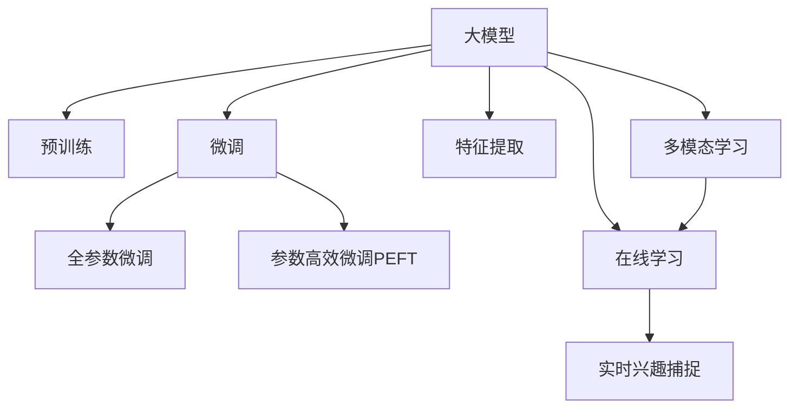

                 

# 大模型在电商平台用户兴趣迁移捕捉中的应用

## 1. 背景介绍

### 1.1 问题由来
电商平台需要实时捕捉用户兴趣的变化，以便推荐系统能够精准地匹配用户的浏览、购买和搜索行为，提升用户体验和平台转化率。然而，用户的兴趣并非一成不变，而是随时间、场景和环境等因素动态变化。传统的用户兴趣捕捉方法依赖于历史行为数据，无法及时响应兴趣的变化，且难以捕捉到长尾兴趣和突发兴趣。

大模型凭借其强大的自监督学习和迁移学习能力，可以在更短的训练周期内，捕捉到用户兴趣的微妙变化，实现高精度的用户兴趣迁移捕捉。通过大模型的预训练和微调，能够在海量的电商数据上学习用户行为模式，并快速适应用户兴趣的变化。

### 1.2 问题核心关键点
大模型在电商平台用户兴趣迁移捕捉中的应用，主要包括以下几个关键点：

1. **数据准备**：收集和处理电商平台的交易记录、浏览记录、搜索记录等，构建用户行为和兴趣数据集。
2. **预训练与微调**：在大规模无标签电商数据上进行预训练，然后使用用户行为数据进行微调，以适应电商平台的用户兴趣变化。
3. **特征提取与表示学习**：通过大模型提取用户行为和兴趣的特征表示，捕捉用户兴趣的迁移轨迹。
4. **多模态数据融合**：结合图像、音频、文本等多模态数据，增强用户兴趣捕捉的准确性和丰富度。
5. **实时兴趣捕捉**：通过在线学习（online learning）技术，实现用户兴趣的实时捕捉和更新。

这些关键点共同构成了一个完整的大模型应用框架，使得电商平台能够高效、实时地捕捉用户兴趣的变化，提升推荐系统的精准度和用户体验。

## 2. 核心概念与联系

### 2.1 核心概念概述

为更好地理解大模型在电商平台用户兴趣迁移捕捉中的应用，本节将介绍几个密切相关的核心概念：

- **大模型**：以自回归（如GPT）或自编码（如BERT）模型为代表的大规模预训练语言模型。通过在大规模无标签文本语料上进行预训练，学习通用的语言表示，具备强大的语言理解和生成能力。

- **预训练**：指在大规模无标签文本语料上，通过自监督学习任务训练通用语言模型的过程。常见的预训练任务包括言语建模、掩码语言模型等。预训练使得模型学习到语言的通用表示。

- **微调**：指在预训练模型的基础上，使用下游任务的少量标注数据，通过有监督地训练来优化模型在特定任务上的性能。通常只需要调整顶层分类器或解码器，并以较小的学习率更新全部或部分的模型参数。

- **迁移学习**：指将一个领域学习到的知识，迁移应用到另一个不同但相关的领域的学习范式。大模型的预训练-微调过程即是一种典型的迁移学习方式。

- **特征提取**：指将输入数据映射为高维特征向量，以供模型进一步处理和分析。

- **在线学习**：指模型在每次接收到新数据时，不断更新模型参数，以适应数据分布的变化。

- **多模态学习**：指结合图像、音频、文本等多种数据源，提升模型对复杂场景的认知能力。

这些核心概念之间的逻辑关系可以通过以下Mermaid流程图来展示：



这个流程图展示了大模型的核心概念及其之间的关系：

1. 大模型通过预训练获得基础能力。
2. 微调是对预训练模型进行任务特定的优化，可以分为全参数微调和参数高效微调（PEFT）。
3. 特征提取将输入数据转化为高维特征，供模型学习。
4. 在线学习使模型能够实时捕捉用户兴趣的变化。
5. 多模态学习通过融合多种数据源，增强模型对用户兴趣的全面理解。

这些概念共同构成了大模型在电商平台用户兴趣迁移捕捉中的工作原理和优化方向。通过理解这些核心概念，我们可以更好地把握大模型的工作机制和应用方法。

## 3. 核心算法原理 & 具体操作步骤
### 3.1 算法原理概述

大模型在电商平台用户兴趣迁移捕捉中的应用，本质上是一个有监督的迁移学习过程。其核心思想是：将大模型视作一个强大的"特征提取器"，通过在海量电商数据上进行预训练，学习用户行为和兴趣的通用特征表示。然后使用电商平台的交易记录、浏览记录等用户行为数据进行微调，使得模型能够捕捉到用户兴趣的迁移轨迹，从而实现高精度的用户兴趣捕捉。

形式化地，假设大模型为 $M_{\theta}$，其中 $\theta$ 为预训练得到的模型参数。给定电商平台的用户行为数据集 $D=\{(x_i,y_i)\}_{i=1}^N$，其中 $x_i$ 为行为特征向量，$y_i$ 为用户兴趣标签。微调的目标是找到新的模型参数 $\hat{\theta}$，使得：

$$
\hat{\theta}=\mathop{\arg\min}_{\theta} \mathcal{L}(M_{\theta},D)
$$

其中 $\mathcal{L}$ 为针对电商平台用户兴趣捕捉设计的损失函数，用于衡量模型预测输出与真实标签之间的差异。常见的损失函数包括交叉熵损失、均方误差损失等。

通过梯度下降等优化算法，微调过程不断更新模型参数 $\theta$，最小化损失函数 $\mathcal{L}$，使得模型输出逼近真实标签。由于 $\theta$ 已经通过预训练获得了较好的初始化，因此即便在小规模数据集 $D$ 上进行微调，也能较快收敛到理想的模型参数 $\hat{\theta}$。

### 3.2 算法步骤详解

大模型在电商平台用户兴趣迁移捕捉的应用流程主要包括以下几个步骤：

**Step 1: 数据准备**

- 收集电商平台的交易记录、浏览记录、搜索记录等，构建用户行为和兴趣数据集。数据集应包含用户的特征向量（如商品ID、浏览时长、搜索关键词等）和相应的兴趣标签（如购买、收藏、关注等）。
- 对数据集进行预处理，包括数据清洗、特征工程等。确保数据的完整性和一致性，去除异常值和噪声。

**Step 2: 预训练模型选择**

- 选择合适的预训练语言模型 $M_{\theta}$，如BERT、GPT、RoBERTa等。
- 在大规模无标签电商数据上进行预训练，学习用户行为和兴趣的通用特征表示。

**Step 3: 添加任务适配层**

- 根据电商平台的用户兴趣捕捉任务，设计合适的输出层和损失函数。
- 对于分类任务，通常在顶层添加线性分类器或逻辑回归，使用交叉熵损失。
- 对于回归任务，通常使用MSE（均方误差）或MAE（平均绝对误差）损失。

**Step 4: 设置微调超参数**

- 选择合适的优化算法及其参数，如Adam、SGD等，设置学习率、批大小、迭代轮数等。
- 设置正则化技术及强度，包括权重衰减、Dropout、Early Stopping等。
- 确定冻结预训练参数的策略，如仅微调顶层，或全部参数都参与微调。

**Step 5: 执行梯度训练**

- 将电商平台的交易记录、浏览记录等用户行为数据分批次输入模型，前向传播计算损失函数。
- 反向传播计算参数梯度，根据设定的优化算法和学习率更新模型参数。
- 周期性在验证集上评估模型性能，根据性能指标决定是否触发 Early Stopping。
- 重复上述步骤直到满足预设的迭代轮数或 Early Stopping 条件。

**Step 6: 特征提取与表示学习**

- 使用微调后的模型，对用户行为数据进行特征提取，生成用户兴趣表示向量。
- 利用表示向量捕捉用户兴趣的迁移轨迹，可以通过时间序列分析、聚类分析等方法，挖掘用户兴趣的变化规律。

**Step 7: 多模态数据融合**

- 结合图像、音频、文本等多种数据源，增强用户兴趣捕捉的准确性和丰富度。例如，可以通过用户浏览的商品图片、视频介绍、商品描述等，丰富用户兴趣表示。

**Step 8: 实时兴趣捕捉**

- 使用在线学习技术，实时捕捉用户兴趣的变化。每次用户行为数据产生时，立即更新模型参数，确保模型能够捕捉最新的兴趣变化。

**Step 9: 测试和部署**

- 在测试集上评估微调后模型 $M_{\hat{\theta}}$ 的性能，对比微调前后的精度提升。
- 使用微调后的模型对新样本进行推理预测，集成到电商平台推荐系统中。
- 持续收集新的用户行为数据，定期重新微调模型，以适应数据分布的变化。

以上是电商平台用户兴趣迁移捕捉的完整流程。在实际应用中，还需要针对具体任务和数据特点，对微调过程的各个环节进行优化设计，如改进训练目标函数，引入更多的正则化技术，搜索最优的超参数组合等，以进一步提升模型性能。

### 3.3 算法优缺点

大模型在电商平台用户兴趣迁移捕捉的应用具有以下优点：

1. **高效捕捉用户兴趣**：大模型能够在短时间内，捕捉到用户兴趣的微妙变化，提升推荐系统的精准度。
2. **泛化能力强**：大模型通过大规模预训练，具备较强的泛化能力，能够适应不同用户和场景的兴趣变化。
3. **实时性高**：通过在线学习技术，模型能够实时捕捉用户兴趣的变化，确保推荐内容的及时性。
4. **多模态融合**：结合多模态数据，增强用户兴趣捕捉的准确性和丰富度。

同时，该方法也存在一定的局限性：

1. **数据依赖**：大模型对数据质量要求高，数据集需要足够大且分布均匀。
2. **计算资源消耗大**：大模型的预训练和微调需要大量的计算资源，包括高性能GPU/TPU等设备。
3. **模型复杂度高**：大模型参数量巨大，模型结构复杂，推理速度较慢。
4. **可解释性不足**：大模型的决策过程难以解释，难以进行模型调试和优化。

尽管存在这些局限性，但就目前而言，大模型在电商平台用户兴趣迁移捕捉中的应用仍是大数据时代的必然选择。未来相关研究的重点在于如何进一步降低计算成本，提高模型实时性和可解释性，同时兼顾数据多样性和泛化能力。

### 3.4 算法应用领域

大模型在电商平台用户兴趣迁移捕捉的应用，已经在多个电商领域得到了广泛的应用，包括：

- **个性化推荐**：利用用户行为数据，通过微调后的大模型，生成个性化的商品推荐。
- **用户画像构建**：从用户的浏览、购买行为中，学习用户的兴趣和偏好，构建详细的用户画像。
- **广告投放优化**：根据用户的兴趣和行为，优化广告投放策略，提升广告转化率。
- **情感分析**：分析用户对商品和服务的情感倾向，优化产品设计和用户体验。
- **异常行为检测**：检测用户的异常行为，防止欺诈和不良行为。

除了上述这些经典应用外，大模型还可以在电商平台中创新性地应用到更多场景中，如风险管理、用户流失预测、内容生成等，为电商平台带来新的突破。

## 4. 数学模型和公式 & 详细讲解  
### 4.1 数学模型构建

本节将使用数学语言对电商平台用户兴趣迁移捕捉的微调过程进行更加严格的刻画。

记大模型为 $M_{\theta}$，其中 $\theta$ 为预训练得到的模型参数。假设电商平台的用户行为数据集为 $D=\{(x_i,y_i)\}_{i=1}^N$，其中 $x_i$ 为行为特征向量，$y_i$ 为用户兴趣标签。

定义模型 $M_{\theta}$ 在数据样本 $(x,y)$ 上的损失函数为 $\ell(M_{\theta}(x),y)$，则在数据集 $D$ 上的经验风险为：

$$
\mathcal{L}(\theta) = \frac{1}{N} \sum_{i=1}^N \ell(M_{\theta}(x_i),y_i)
$$

微调的优化目标是最小化经验风险，即找到最优参数：

$$
\theta^* = \mathop{\arg\min}_{\theta} \mathcal{L}(\theta)
$$

在实践中，我们通常使用基于梯度的优化算法（如SGD、Adam等）来近似求解上述最优化问题。设 $\eta$ 为学习率，$\lambda$ 为正则化系数，则参数的更新公式为：

$$
\theta \leftarrow \theta - \eta \nabla_{\theta}\mathcal{L}(\theta) - \eta\lambda\theta
$$

其中 $\nabla_{\theta}\mathcal{L}(\theta)$ 为损失函数对参数 $\theta$ 的梯度，可通过反向传播算法高效计算。

### 4.2 公式推导过程

以下我们以电商平台的用户兴趣分类任务为例，推导交叉熵损失函数及其梯度的计算公式。

假设模型 $M_{\theta}$ 在输入 $x$ 上的输出为 $\hat{y}=M_{\theta}(x) \in [0,1]$，表示用户对商品 $x$ 的兴趣概率。真实标签 $y \in \{0,1\}$。则二分类交叉熵损失函数定义为：

$$
\ell(M_{\theta}(x),y) = -[y\log \hat{y} + (1-y)\log (1-\hat{y})]
$$

将其代入经验风险公式，得：

$$
\mathcal{L}(\theta) = -\frac{1}{N}\sum_{i=1}^N [y_i\log M_{\theta}(x_i)+(1-y_i)\log(1-M_{\theta}(x_i))]
$$

根据链式法则，损失函数对参数 $\theta_k$ 的梯度为：

$$
\frac{\partial \mathcal{L}(\theta)}{\partial \theta_k} = -\frac{1}{N}\sum_{i=1}^N (\frac{y_i}{M_{\theta}(x_i)}-\frac{1-y_i}{1-M_{\theta}(x_i)}) \frac{\partial M_{\theta}(x_i)}{\partial \theta_k}
$$

其中 $\frac{\partial M_{\theta}(x_i)}{\partial \theta_k}$ 可进一步递归展开，利用自动微分技术完成计算。

在得到损失函数的梯度后，即可带入参数更新公式，完成模型的迭代优化。重复上述过程直至收敛，最终得到适应电商平台用户兴趣捕捉任务的最优模型参数 $\theta^*$。

## 5. 项目实践：代码实例和详细解释说明
### 5.1 开发环境搭建

在进行微调实践前，我们需要准备好开发环境。以下是使用Python进行PyTorch开发的环境配置流程：

1. 安装Anaconda：从官网下载并安装Anaconda，用于创建独立的Python环境。

2. 创建并激活虚拟环境：
```bash
conda create -n pytorch-env python=3.8 
conda activate pytorch-env
```

3. 安装PyTorch：根据CUDA版本，从官网获取对应的安装命令。例如：
```bash
conda install pytorch torchvision torchaudio cudatoolkit=11.1 -c pytorch -c conda-forge
```

4. 安装Transformers库：
```bash
pip install transformers
```

5. 安装各类工具包：
```bash
pip install numpy pandas scikit-learn matplotlib tqdm jupyter notebook ipython
```

完成上述步骤后，即可在`pytorch-env`环境中开始微调实践。

### 5.2 源代码详细实现

下面我们以电商平台的用户兴趣分类任务为例，给出使用Transformers库对BERT模型进行微调的PyTorch代码实现。

首先，定义数据处理函数：

```python
from transformers import BertTokenizer
from torch.utils.data import Dataset
import torch

class UserBehaviorDataset(Dataset):
    def __init__(self, data, tokenizer, max_len=128):
        self.data = data
        self.tokenizer = tokenizer
        self.max_len = max_len
        
    def __len__(self):
        return len(self.data)
    
    def __getitem__(self, item):
        input_ids, attention_mask, labels = self.data[item]
        
        encoding = self.tokenizer(input_ids, attention_mask=attention_mask, return_tensors='pt', max_length=self.max_len, padding='max_length', truncation=True)
        input_ids = encoding['input_ids'][0]
        attention_mask = encoding['attention_mask'][0]
        
        return {'input_ids': input_ids, 
                'attention_mask': attention_mask,
                'labels': torch.tensor(labels, dtype=torch.long)}
```

然后，定义模型和优化器：

```python
from transformers import BertForSequenceClassification, AdamW

model = BertForSequenceClassification.from_pretrained('bert-base-cased', num_labels=2)

optimizer = AdamW(model.parameters(), lr=2e-5)
```

接着，定义训练和评估函数：

```python
from torch.utils.data import DataLoader
from tqdm import tqdm
from sklearn.metrics import classification_report

device = torch.device('cuda') if torch.cuda.is_available() else torch.device('cpu')
model.to(device)

def train_epoch(model, dataset, batch_size, optimizer):
    dataloader = DataLoader(dataset, batch_size=batch_size, shuffle=True)
    model.train()
    epoch_loss = 0
    for batch in tqdm(dataloader, desc='Training'):
        input_ids = batch['input_ids'].to(device)
        attention_mask = batch['attention_mask'].to(device)
        labels = batch['labels'].to(device)
        model.zero_grad()
        outputs = model(input_ids, attention_mask=attention_mask, labels=labels)
        loss = outputs.loss
        epoch_loss += loss.item()
        loss.backward()
        optimizer.step()
    return epoch_loss / len(dataloader)

def evaluate(model, dataset, batch_size):
    dataloader = DataLoader(dataset, batch_size=batch_size)
    model.eval()
    preds, labels = [], []
    with torch.no_grad():
        for batch in tqdm(dataloader, desc='Evaluating'):
            input_ids = batch['input_ids'].to(device)
            attention_mask = batch['attention_mask'].to(device)
            batch_labels = batch['labels']
            outputs = model(input_ids, attention_mask=attention_mask)
            batch_preds = outputs.logits.argmax(dim=2).to('cpu').tolist()
            batch_labels = batch_labels.to('cpu').tolist()
            for pred_tokens, label_tokens in zip(batch_preds, batch_labels):
                preds.append(pred_tokens[:len(label_tokens)])
                labels.append(label_tokens)
                
    print(classification_report(labels, preds))
```

最后，启动训练流程并在测试集上评估：

```python
epochs = 5
batch_size = 16

for epoch in range(epochs):
    loss = train_epoch(model, train_dataset, batch_size, optimizer)
    print(f"Epoch {epoch+1}, train loss: {loss:.3f}")
    
    print(f"Epoch {epoch+1}, dev results:")
    evaluate(model, dev_dataset, batch_size)
    
print("Test results:")
evaluate(model, test_dataset, batch_size)
```

以上就是使用PyTorch对BERT进行电商平台用户兴趣分类任务微调的完整代码实现。可以看到，得益于Transformers库的强大封装，我们可以用相对简洁的代码完成BERT模型的加载和微调。

### 5.3 代码解读与分析

让我们再详细解读一下关键代码的实现细节：

**UserBehaviorDataset类**：
- `__init__`方法：初始化数据、分词器等关键组件，并生成预处理后的输入特征。
- `__len__`方法：返回数据集的样本数量。
- `__getitem__`方法：对单个样本进行处理，将文本输入编码为token ids，并将标签转换为数字，并对其进行定长padding，最终返回模型所需的输入。

**训练和评估函数**：
- 使用PyTorch的DataLoader对数据集进行批次化加载，供模型训练和推理使用。
- 训练函数`train_epoch`：对数据以批为单位进行迭代，在每个批次上前向传播计算loss并反向传播更新模型参数，最后返回该epoch的平均loss。
- 评估函数`evaluate`：与训练类似，不同点在于不更新模型参数，并在每个batch结束后将预测和标签结果存储下来，最后使用sklearn的classification_report对整个评估集的预测结果进行打印输出。

**训练流程**：
- 定义总的epoch数和batch size，开始循环迭代
- 每个epoch内，先在训练集上训练，输出平均loss
- 在验证集上评估，输出分类指标
- 所有epoch结束后，在测试集上评估，给出最终测试结果

可以看到，PyTorch配合Transformers库使得BERT微调的代码实现变得简洁高效。开发者可以将更多精力放在数据处理、模型改进等高层逻辑上，而不必过多关注底层的实现细节。

当然，工业级的系统实现还需考虑更多因素，如模型的保存和部署、超参数的自动搜索、更灵活的任务适配层等。但核心的微调范式基本与此类似。

## 6. 实际应用场景
### 6.1 电商平台个性化推荐

基于大模型的电商平台个性化推荐系统，可以显著提升用户满意度，增加平台销售额。通过用户行为数据的实时捕捉和分析，系统能够及时推荐符合用户兴趣的商品，实现个性化推荐。

具体而言，可以使用大模型对用户的浏览、搜索、点击等行为进行建模，学习用户的兴趣和偏好。然后结合商品的属性、评分、评论等信息，通过微调后的模型生成个性化的商品推荐。通过不断收集和更新用户行为数据，微调模型能够实时捕捉用户的兴趣变化，提供精准的推荐服务。

### 6.2 用户画像构建

电商平台需要对用户进行详细的画像构建，以便进行更精准的市场细分和用户分组。传统的方法依赖于问卷调查、用户注册信息等，难以全面覆盖用户行为和兴趣。而使用大模型进行用户画像构建，可以充分利用用户的电商行为数据，学习用户的兴趣和偏好，构建更为丰富的用户画像。

通过大模型的预训练和微调，可以在海量的电商数据上学习用户行为和兴趣的通用特征表示。然后结合多模态数据（如浏览图片、商品评论等），增强用户画像的准确性和全面性。用户画像的构建，将为电商平台的精准营销、客户细分、用户管理等提供有力支持。

### 6.3 广告投放优化

电商平台需要进行精准的广告投放，以提升广告的转化率和ROI。大模型可以通过对用户兴趣的实时捕捉和分析，优化广告投放策略，提高广告的效果和回报。

在广告投放前，可以收集用户的行为数据和兴趣标签，通过微调后的模型预测用户的点击概率。然后根据预测结果，调整广告的投放位置、频率和内容，提升广告的精准度和效果。通过不断的反馈和优化，系统能够实时调整广告策略，最大化广告投放的效果。

### 6.4 用户行为分析

电商平台需要实时监控和分析用户的浏览、购买行为，以便及时发现和解决问题。大模型可以实时捕捉用户兴趣的变化，为电商平台的运营和优化提供数据支持。

通过大模型的预训练和微调，可以捕捉用户行为的微妙变化，及时发现用户兴趣的变化趋势。例如，在用户流失前，系统可以检测到用户的兴趣变化，发出预警并提供相应的解决方案。通过实时监控和分析，电商平台可以及时调整运营策略，提升用户满意度和平台黏性。

### 6.5 未来应用展望

随着大模型和微调方法的不断发展，其在电商平台用户兴趣迁移捕捉中的应用将呈现以下几个发展趋势：

1. **数据驱动的决策**：通过实时捕捉用户兴趣的变化，电商平台能够更加智能化地进行决策，提升运营效率和效果。
2. **个性化推荐系统**：利用大模型的强大预测能力，电商平台能够提供更加精准的个性化推荐服务，提升用户满意度和平台转化率。
3. **用户画像构建**：通过多模态数据的融合，电商平台能够构建更加全面、准确的用户画像，实现精准的客户细分和用户管理。
4. **广告投放优化**：利用实时用户兴趣的数据，电商平台能够优化广告投放策略，提高广告的精准度和效果。
5. **异常行为检测**：通过实时监控和分析用户行为，电商平台能够及时发现和解决异常问题，提升平台的安全性和稳定性。

未来，大模型在电商平台用户兴趣迁移捕捉中的应用将更加深入和广泛，为电商平台的数字化转型升级提供新的技术路径。

## 7. 工具和资源推荐
### 7.1 学习资源推荐

为了帮助开发者系统掌握大模型在电商平台用户兴趣迁移捕捉中的应用，这里推荐一些优质的学习资源：

1. 《Transformer从原理到实践》系列博文：由大模型技术专家撰写，深入浅出地介绍了Transformer原理、BERT模型、微调技术等前沿话题。

2. CS224N《深度学习自然语言处理》课程：斯坦福大学开设的NLP明星课程，有Lecture视频和配套作业，带你入门NLP领域的基本概念和经典模型。

3. 《Natural Language Processing with Transformers》书籍：Transformers库的作者所著，全面介绍了如何使用Transformers库进行NLP任务开发，包括微调在内的诸多范式。

4. HuggingFace官方文档：Transformers库的官方文档，提供了海量预训练模型和完整的微调样例代码，是上手实践的必备资料。

5. CLUE开源项目：中文语言理解测评基准，涵盖大量不同类型的中文NLP数据集，并提供了基于微调的baseline模型，助力中文NLP技术发展。

通过对这些资源的学习实践，相信你一定能够快速掌握大模型在电商平台用户兴趣迁移捕捉的应用，并用于解决实际的电商问题。
###  7.2 开发工具推荐

高效的开发离不开优秀的工具支持。以下是几款用于大模型在电商平台用户兴趣迁移捕捉应用的常用工具：

1. PyTorch：基于Python的开源深度学习框架，灵活动态的计算图，适合快速迭代研究。大部分预训练语言模型都有PyTorch版本的实现。

2. TensorFlow：由Google主导开发的开源深度学习框架，生产部署方便，适合大规模工程应用。同样有丰富的预训练语言模型资源。

3. Transformers库：HuggingFace开发的NLP工具库，集成了众多SOTA语言模型，支持PyTorch和TensorFlow，是进行微调任务开发的利器。

4. Weights & Biases：模型训练的实验跟踪工具，可以记录和可视化模型训练过程中的各项指标，方便对比和调优。与主流深度学习框架无缝集成。

5. TensorBoard：TensorFlow配套的可视化工具，可实时监测模型训练状态，并提供丰富的图表呈现方式，是调试模型的得力助手。

6. Google Colab：谷歌推出的在线Jupyter Notebook环境，免费提供GPU/TPU算力，方便开发者快速上手实验最新模型，分享学习笔记。

合理利用这些工具，可以显著提升大模型在电商平台用户兴趣迁移捕捉应用的开发效率，加快创新迭代的步伐。

### 7.3 相关论文推荐

大模型和微调技术的发展源于学界的持续研究。以下是几篇奠基性的相关论文，推荐阅读：

1. Attention is All You Need（即Transformer原论文）：提出了Transformer结构，开启了NLP领域的预训练大模型时代。

2. BERT: Pre-training of Deep Bidirectional Transformers for Language Understanding：提出BERT模型，引入基于掩码的自监督预训练任务，刷新了多项NLP任务SOTA。

3. Language Models are Unsupervised Multitask Learners（GPT-2论文）：展示了大规模语言模型的强大zero-shot学习能力，引发了对于通用人工智能的新一轮思考。

4. Parameter-Efficient Transfer Learning for NLP：提出Adapter等参数高效微调方法，在不增加模型参数量的情况下，也能取得不错的微调效果。

5. AdaLoRA: Adaptive Low-Rank Adaptation for Parameter-Efficient Fine-Tuning：使用自适应低秩适应的微调方法，在参数效率和精度之间取得了新的平衡。

这些论文代表了大模型在电商平台用户兴趣迁移捕捉技术的发展脉络。通过学习这些前沿成果，可以帮助研究者把握学科前进方向，激发更多的创新灵感。

## 8. 总结：未来发展趋势与挑战
### 8.1 总结

本文对大模型在电商平台用户兴趣迁移捕捉中的应用进行了全面系统的介绍。首先阐述了大模型和微调技术的研究背景和意义，明确了微调在电商平台用户兴趣迁移捕捉中的独特价值。其次，从原理到实践，详细讲解了微调的数学原理和关键步骤，给出了微调任务开发的完整代码实例。同时，本文还广泛探讨了大模型在电商平台用户兴趣迁移捕捉中的应用场景，展示了微调范式的巨大潜力。此外，本文精选了微调技术的各类学习资源，力求为读者提供全方位的技术指引。

通过本文的系统梳理，可以看到，大模型在电商平台用户兴趣迁移捕捉中的应用具有广泛的应用前景和强大的性能提升潜力。它不仅能够实时捕捉用户兴趣的变化，还能通过多模态数据的融合，增强用户兴趣捕捉的准确性和丰富度。然而，大模型的应用也面临一些挑战，如数据依赖、计算资源消耗大、模型复杂度高、可解释性不足等。未来，相关研究需要在这些方面寻求新的突破，以实现大模型在电商平台中的更广泛应用。

### 8.2 未来发展趋势

展望未来，大模型在电商平台用户兴趣迁移捕捉的应用将呈现以下几个发展趋势：

1. **实时捕捉兴趣变化**：通过在线学习技术，实现用户兴趣的实时捕捉和更新，提升推荐系统的动态性和精准度。
2. **多模态数据融合**：结合图像、音频、文本等多种数据源，增强用户兴趣捕捉的准确性和全面性。
3. **个性化推荐系统**：利用大模型的强大预测能力，提供更加精准的个性化推荐服务，提升用户满意度和平台转化率。
4. **用户画像构建**：通过多模态数据的融合，构建更加全面、准确的用户画像，实现精准的客户细分和用户管理。
5. **广告投放优化**：利用实时用户兴趣的数据，优化广告投放策略，提高广告的精准度和效果。
6. **异常行为检测**：通过实时监控和分析用户行为，及时发现和解决异常问题，提升平台的安全性和稳定性。

以上趋势凸显了大模型在电商平台用户兴趣迁移捕捉中的广阔前景。这些方向的探索发展，必将进一步提升推荐系统的性能和用户体验，为电商平台的数字化转型升级提供新的技术路径。

### 8.3 面临的挑战

尽管大模型在电商平台用户兴趣迁移捕捉的应用已经取得了显著进展，但在迈向更加智能化、普适化应用的过程中，它仍面临一些挑战：

1. **数据依赖**：大模型对数据质量要求高，数据集需要足够大且分布均匀。电商数据的获取和处理成本较高，且不同用户和场景的数据质量差异较大。
2. **计算资源消耗大**：大模型的预训练和微调需要大量的计算资源，包括高性能GPU/TPU等设备。对于中小型电商平台，计算资源成本较高。
3. **模型复杂度高**：大模型参数量巨大，模型结构复杂，推理速度较慢。对于实时性要求高的电商平台，模型的复杂度成为瓶颈。
4. **可解释性不足**：大模型的决策过程难以解释，难以进行模型调试和优化。对于需要解释和可控的电商应用，可解释性不足成为重要问题。
5. **用户隐私保护**：电商平台涉及大量用户隐私数据，如何在保证隐私保护的前提下，实现用户兴趣的捕捉和分析，成为重要的研究方向。

尽管存在这些挑战，但大模型在电商平台用户兴趣迁移捕捉中的应用前景广阔。未来研究需要在这些方面寻求新的突破，以实现大模型在电商平台中的更广泛应用。

### 8.4 研究展望

未来，大模型在电商平台用户兴趣迁移捕捉中的应用，需要在以下几个方面寻求新的突破：

1. **数据驱动的决策**：通过实时捕捉用户兴趣的变化，电商平台能够更加智能化地进行决策，提升运营效率和效果。
2. **个性化推荐系统**：利用大模型的强大预测能力，提供更加精准的个性化推荐服务，提升用户满意度和平台转化率。
3. **用户画像构建**：通过多模态数据的融合，构建更加全面、准确的用户画像，实现精准的客户细分和用户管理。
4. **广告投放优化**：利用实时用户兴趣的数据，优化广告投放策略，提高广告的精准度和效果。
5. **异常行为检测**：通过实时监控和分析用户行为，及时发现和解决异常问题，提升平台的安全性和稳定性。
6. **模型优化与压缩**：开发更加参数高效的微调方法，在固定大部分预训练参数的同时，只更新极少量的任务相关参数。同时优化模型计算图，减少前向传播和反向传播的资源消耗，实现更加轻量级、实时性的部署。

这些研究方向的探索，必将引领大模型在电商平台用户兴趣迁移捕捉中的应用走向更高的台阶，为电商平台的数字化转型升级提供新的技术路径。相信随着技术的日益成熟，大模型将在大数据驱动的电商决策中发挥越来越重要的作用。

## 9. 附录：常见问题与解答

**Q1：大模型在电商平台用户兴趣迁移捕捉中的应用有哪些？**

A: 大模型在电商平台用户兴趣迁移捕捉中的应用主要包括：

1. **个性化推荐**：利用用户行为数据，通过微调后的大模型，生成个性化的商品推荐。
2. **用户画像构建**：从用户的浏览、购买行为中，学习用户的兴趣和偏好，构建详细的用户画像。
3. **广告投放优化**：根据用户的兴趣和行为，优化广告投放策略，提升广告的精准度和效果。
4. **用户行为分析**：实时监控和分析用户的浏览、购买行为，及时发现和解决问题。

**Q2：大模型在电商平台用户兴趣迁移捕捉中如何进行特征提取？**

A: 大模型在电商平台用户兴趣迁移捕捉中的应用，需要从用户行为数据中提取特征。具体步骤如下：

1. 对用户行为数据进行预处理，包括数据清洗、特征工程等。
2. 将预处理后的数据输入微调后的模型，进行特征提取。
3. 将模型输出的特征向量作为用户兴趣表示，捕捉用户兴趣的迁移轨迹。

特征提取是电商平台用户兴趣迁移捕捉中的关键步骤，通过高维特征向量的学习，大模型能够捕捉到用户兴趣的微妙变化，提升推荐系统的精准度。

**Q3：大模型在电商平台用户兴趣迁移捕捉中的实时捕捉机制如何实现？**

A: 大模型在电商平台用户兴趣迁移捕捉中的实时捕捉机制，主要通过在线学习技术实现。具体步骤如下：

1. 收集用户行为数据，包括浏览、购买、搜索等行为。
2. 将新产生的数据实时输入微调后的模型，进行特征提取和推理。
3. 根据模型推理结果，调整用户兴趣标签，更新用户画像和推荐策略。
4. 不断收集和更新用户行为数据，循环执行以上步骤，实现实时捕捉和更新。

通过在线学习技术，大模型能够实时捕捉用户兴趣的变化，提升推荐系统的动态性和精准度。

**Q4：大模型在电商平台用户兴趣迁移捕捉中如何应对数据分布变化？**

A: 大模型在电商平台用户兴趣迁移捕捉中应对数据分布变化，主要通过以下措施：

1. 持续收集和更新用户行为数据，确保模型能够捕捉到最新的用户兴趣变化。
2. 使用在线学习技术，每次新数据产生时，立即更新模型参数，以适应数据分布的变化。
3. 结合多模态数据，增强模型对复杂场景的认知能力，提升模型泛化性能。
4. 定期重新微调模型，保持模型的性能和适应性。

通过持续收集和更新数据，结合在线学习和多模态数据融合，大模型能够应对数据分布的变化，提升模型的稳定性和鲁棒性。

---

作者：禅与计算机程序设计艺术 / Zen and the Art of Computer Programming

