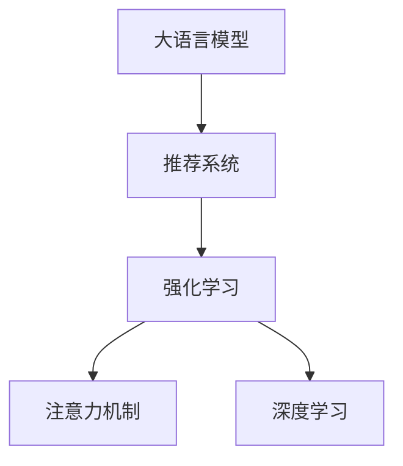

                 

# 大模型在社交网络推荐中的应用前景

> 关键词：社交网络推荐,大语言模型,推荐系统,强化学习,注意力机制,深度学习

## 1. 背景介绍

### 1.1 问题由来

随着社交媒体的普及，用户之间的交流和互动日趋频繁，社交网络平台积累了海量的用户行为数据。如何利用这些数据，为每个用户推荐最相关的信息，提升用户体验和平台活跃度，成为社交网络推荐系统的核心挑战。传统的推荐方法，如协同过滤、基于内容的推荐等，在大规模数据下常常面临计算资源消耗高、冷启动问题难以解决等难题。

大语言模型作为深度学习技术的重要里程碑，近年来在自然语言处理（NLP）领域取得重大进展。这类模型通过在大规模文本数据上预训练，学习到了强大的语言理解和生成能力，能够准确捕捉和表达语言中的语义信息。因此，大语言模型逐渐被引入推荐系统领域，与深度学习相结合，探索新的推荐范式。

### 1.2 问题核心关键点

大语言模型在推荐系统中的应用，涉及多模态信息融合、深度学习模型的优化训练、实时推荐等关键技术点。其核心思想是利用大语言模型的语言理解能力，结合社交网络中的用户行为数据，提供更加精准、个性化的推荐结果。

在实际应用中，大语言模型需要解决以下关键问题：
- 如何将大语言模型融入推荐系统，利用其语言理解能力优化推荐模型。
- 如何处理社交网络数据的多样性，充分利用用户行为和社交关系。
- 如何高效地训练和部署大语言模型，保证推荐系统的实时性。
- 如何应对模型偏见和公平性问题，确保推荐系统的公正性。

### 1.3 问题研究意义

大语言模型在推荐系统中的应用，将推动社交网络推荐技术进入新的阶段。通过引入深度学习和大语言模型，推荐系统可以更灵活地处理复杂多变的用户需求，提升推荐的精准度和个性化程度。同时，大语言模型的强大推理能力，也能为推荐系统的实时性提供新的技术支撑。

大语言模型在推荐系统中的应用，对于构建更加智能、个性化的社交网络平台，提升用户体验和平台活跃度，具有重要的实践意义。未来，大语言模型将成为社交网络推荐系统的重要技术手段，推动社交媒体平台在新闻阅读、娱乐推荐、电商购物等多个场景的智能化发展。

## 2. 核心概念与联系

### 2.1 核心概念概述

本节将介绍几个与大语言模型在社交网络推荐中应用密切相关的核心概念：

- **大语言模型 (Large Language Model, LLM)**：基于Transformer架构的深度学习模型，通过在大规模无标签文本上预训练，学习到了强大的语言理解和生成能力。常用的模型包括GPT-3、BERT等。

- **推荐系统 (Recommender System)**：根据用户的历史行为和偏好，推荐最相关的物品或内容的技术体系。推荐系统广泛应用于电子商务、社交媒体、新闻阅读等多个领域。

- **强化学习 (Reinforcement Learning)**：一种通过环境反馈指导智能体（如推荐系统）学习最优策略的机器学习范式。强化学习模型能够自适应地优化推荐策略，提升推荐效果。

- **注意力机制 (Attention Mechanism)**：在深度学习中用于捕捉数据间关系的机制，用于动态调整不同特征的权重，提高模型处理复杂输入的能力。

- **深度学习 (Deep Learning)**：基于神经网络的机器学习范式，通过多层次特征提取，能够处理高维、非线性数据。深度学习在图像识别、语音处理、自然语言处理等领域广泛应用。

这些核心概念之间的逻辑关系可以通过以下Mermaid流程图来展示：



这个流程图展示了各个核心概念之间的关联关系：

1. 大语言模型通过预训练学习语言知识，为推荐系统提供强大的语义理解能力。
2. 强化学习通过用户反馈不断优化推荐策略，提升推荐系统的效率和准确性。
3. 注意力机制用于动态调整不同特征的权重，提高模型对复杂输入的处理能力。
4. 深度学习通过多层次特征提取，增强模型的表达能力和泛化能力。

通过理解这些核心概念，我们可以更好地把握大语言模型在社交网络推荐中的应用原理和优化方向。

## 3. 核心算法原理 & 具体操作步骤

### 3.1 算法原理概述

大语言模型在社交网络推荐中的应用，主要基于监督学习和强化学习的结合。其核心思想是利用大语言模型的语言理解能力，结合社交网络中的用户行为数据，通过有监督的微调和强化学习训练，优化推荐模型的预测能力。

假设社交网络平台有$N$个用户，每个用户关注了$M$个物品。设$U$为用户集合，$I$为物品集合。用户对物品的评分$R_{ui}$可以通过两种方式获取：
1. 显式评分：用户直接给物品评分。
2. 隐式评分：通过用户的点击、浏览、互动等行为数据，推断用户对物品的评分。

推荐系统的目标是最小化用户和物品之间的评分误差，即最小化$R_{ui}$与$R_{ui'}$之间的差异，其中$u$为用户，$i$和$i'$为物品。

形式化地，设$W$为模型的权重参数，推荐系统的优化目标为：
$$
\min_{W} \sum_{u=1}^N \sum_{i=1}^M \left(R_{ui} - f(u, i; W)\right)^2
$$
其中$f(u, i; W)$表示模型对用户$u$对物品$i$的评分预测，通常使用一个简单的线性函数$f(u, i; W) = \sum_{j=1}^K W_j x_{ujj}i_j$，其中$x_{ujj}$表示用户$u$对物品$j$的特征表示，$W_j$为模型权重。

### 3.2 算法步骤详解

基于大语言模型在社交网络推荐中的应用，一般包括以下几个关键步骤：

**Step 1: 准备数据集**
- 收集社交网络平台上的用户行为数据，如浏览、点击、评论等。
- 使用用户-物品评分数据构建监督数据集，将显式评分和隐式评分统一标注。
- 进行数据预处理，包括数据清洗、特征工程等。

**Step 2: 模型设计**
- 选择合适的大语言模型架构，如GPT-3、BERT等，作为推荐系统的基础模型。
- 设计推荐模型的输出层，通常使用线性分类器或回归器。
- 定义损失函数，如均方误差损失或交叉熵损失，衡量预测评分与真实评分之间的差异。

**Step 3: 训练和优化**
- 使用优化器（如Adam、SGD等）对模型进行梯度下降训练，最小化损失函数。
- 在训练过程中，通过正则化技术（如L2正则、Dropout等）防止过拟合。
- 在训练过程中，使用强化学习算法（如Proximal Policy Optimization、Trust Region Policy Optimization等）优化推荐策略。
- 对模型进行评估，如使用准确率、召回率、F1分数等指标评估模型性能。

**Step 4: 推理和部署**
- 在测试集上对训练好的模型进行推理，评估模型的泛化能力。
- 将训练好的模型部署到生产环境中，用于实时推荐。
- 根据用户行为数据实时更新模型参数，保证推荐系统能够自适应地更新推荐策略。

### 3.3 算法优缺点

大语言模型在社交网络推荐系统中的应用，具有以下优点：
1. 强大的语义理解能力。大语言模型能够准确捕捉用户行为数据中的语义信息，提高推荐模型的泛化能力。
2. 高效的多模态信息融合。通过融合用户行为数据和社交网络数据，能够提供更加全面、准确的推荐结果。
3. 灵活的推荐策略优化。通过强化学习算法，可以自适应地优化推荐策略，提升推荐效果。

同时，该方法也存在一定的局限性：
1. 数据需求量大。收集高质量的用户行为数据和社交网络数据需要投入大量人力物力。
2. 模型训练时间长。大语言模型的参数量巨大，训练过程耗时较长。
3. 模型解释性不足。大语言模型的内部工作机制难以解释，可能影响用户信任度。
4. 模型复杂度高。大语言模型参数量多，推理复杂度高，部署时需注意性能优化。

尽管存在这些局限性，但大语言模型在社交网络推荐系统中的应用，正逐步被学术界和工业界接受和应用，成为推荐系统领域的新范式。未来相关研究将更多关注如何降低数据和计算成本，提高模型的可解释性和部署效率，同时兼顾模型的泛化能力和鲁棒性。

### 3.4 算法应用领域

大语言模型在社交网络推荐系统中的应用，已经覆盖了多个领域，以下是几个典型应用场景：

- **新闻阅读推荐**：利用用户的历史阅读行为数据和社交网络关系，推荐用户感兴趣的新闻文章。
- **商品推荐**：利用用户的历史购买记录和社交网络关系，推荐用户可能感兴趣的商品。
- **个性化视频推荐**：利用用户的观看历史和社交网络关系，推荐用户感兴趣的视频内容。
- **活动推荐**：利用用户的行为数据和社交网络关系，推荐用户感兴趣的活动或事件。

此外，大语言模型在社交网络推荐系统中的应用，还包括社交网络关系推荐、用户画像生成等，为社交网络平台提供更加精准和个性化的服务。

## 4. 数学模型和公式 & 详细讲解

### 4.1 数学模型构建

在社交网络推荐系统中，大语言模型的应用涉及多个模型的组合，包括用户模型、物品模型和推荐模型。下面以新闻阅读推荐为例，详细描述数学模型的构建过程。

设用户$u$的历史阅读新闻$X_u=\{x_1,x_2,...,x_k\}$，其中$x_j$为新闻$j$的特征表示。用户$u$对新闻$j$的评分$R_{uj}$可以通过大语言模型$f(u, j; \theta)$预测得到，即$R_{uj}=f(u, j; \theta)$，其中$\theta$为模型参数。

假设新闻$j$的特征表示为$x_j=[x_{j1},x_{j2},...,x_{jn}]$，其中$x_{jk}$为第$k$个特征。用户$u$对新闻$j$的评分$R_{uj}$可以表示为：
$$
R_{uj} = \sum_{i=1}^n w_{uj}x_{jki}
$$
其中$w_{uj}$为特征$x_{jki}$对用户$u$的权重，可以通过大语言模型训练得到。

### 4.2 公式推导过程

大语言模型在推荐系统中的应用，主要涉及两个关键过程：预训练和微调。预训练过程在无标签数据上进行，学习到通用的语言表示；微调过程在有标签数据上进行，利用语言理解能力优化推荐模型的预测能力。

在预训练阶段，假设大语言模型为$M_{\theta}$，其优化目标为最小化语言建模损失，即：
$$
\min_{\theta} \frac{1}{N}\sum_{i=1}^N \ell_{LM}(M_{\theta}, x_i)
$$
其中$\ell_{LM}$为语言建模损失函数，$x_i$为输入的文本。

在微调阶段，假设用户$u$的历史阅读新闻$X_u$为有标签数据集，推荐模型的优化目标为最小化评分误差损失，即：
$$
\min_{\theta} \frac{1}{N}\sum_{i=1}^N \left(R_{ui} - f(u, i; \theta)\right)^2
$$

将用户$u$的阅读历史$X_u$输入大语言模型$f(u, j; \theta)$，得到用户$u$对新闻$j$的评分预测$R_{uj}$。将$R_{uj}$与真实评分$R_{uj}$进行对比，计算评分误差，进行反向传播更新模型参数$\theta$。

### 4.3 案例分析与讲解

以一个简单的例子来说明大语言模型在推荐系统中的应用：

假设有一个社交网络平台，有$U=1000$个用户，$I=1000$个新闻。每个用户关注了$M=50$个新闻，用户对新闻的评分通过隐式评分得到。

1. **数据准备**：收集用户的历史阅读行为数据，包括用户点击的新闻、阅读时长等。将用户-新闻评分数据统一标注，作为监督数据集。
2. **模型设计**：选择GPT-3作为推荐模型的基础模型，设计线性回归器作为输出层，均方误差损失函数作为优化目标。
3. **预训练和微调**：在大规模无标签新闻数据上预训练GPT-3，学习语言表示。在用户-新闻评分数据上进行微调，优化推荐模型的预测能力。
4. **推理和部署**：在测试集上评估微调后推荐模型的性能，部署到生产环境中，实时推荐新闻。

## 5. 项目实践：代码实例和详细解释说明

### 5.1 开发环境搭建

在进行推荐系统开发前，我们需要准备好开发环境。以下是使用Python进行PyTorch开发的环境配置流程：

1. 安装Anaconda：从官网下载并安装Anaconda，用于创建独立的Python环境。

2. 创建并激活虚拟环境：
```bash
conda create -n recommender-env python=3.8 
conda activate recommender-env
```

3. 安装PyTorch：根据CUDA版本，从官网获取对应的安装命令。例如：
```bash
conda install pytorch torchvision torchaudio cudatoolkit=11.1 -c pytorch -c conda-forge
```

4. 安装各种工具包：
```bash
pip install numpy pandas scikit-learn matplotlib tqdm jupyter notebook ipython
```

完成上述步骤后，即可在`recommender-env`环境中开始推荐系统开发。

### 5.2 源代码详细实现

下面我们以新闻阅读推荐为例，给出使用Transformers库对BERT模型进行微调的PyTorch代码实现。

首先，定义推荐系统的数据处理函数：

```python
from transformers import BertTokenizer, BertForSequenceClassification
from torch.utils.data import Dataset
import torch

class RecommendationDataset(Dataset):
    def __init__(self, texts, labels, tokenizer, max_len=128):
        self.texts = texts
        self.labels = labels
        self.tokenizer = tokenizer
        self.max_len = max_len
        
    def __len__(self):
        return len(self.texts)
    
    def __getitem__(self, item):
        text = self.texts[item]
        label = self.labels[item]
        
        encoding = self.tokenizer(text, return_tensors='pt', max_length=self.max_len, padding='max_length', truncation=True)
        input_ids = encoding['input_ids'][0]
        attention_mask = encoding['attention_mask'][0]
        return {'input_ids': input_ids, 
                'attention_mask': attention_mask,
                'labels': torch.tensor(label, dtype=torch.long)}
```

然后，定义模型和优化器：

```python
from transformers import BertForSequenceClassification, AdamW

model = BertForSequenceClassification.from_pretrained('bert-base-cased', num_labels=1)

optimizer = AdamW(model.parameters(), lr=2e-5)
```

接着，定义训练和评估函数：

```python
from torch.utils.data import DataLoader
from tqdm import tqdm
from sklearn.metrics import mean_squared_error

device = torch.device('cuda') if torch.cuda.is_available() else torch.device('cpu')
model.to(device)

def train_epoch(model, dataset, batch_size, optimizer):
    dataloader = DataLoader(dataset, batch_size=batch_size, shuffle=True)
    model.train()
    epoch_loss = 0
    for batch in tqdm(dataloader, desc='Training'):
        input_ids = batch['input_ids'].to(device)
        attention_mask = batch['attention_mask'].to(device)
        labels = batch['labels'].to(device)
        model.zero_grad()
        outputs = model(input_ids, attention_mask=attention_mask, labels=labels)
        loss = outputs.loss
        epoch_loss += loss.item()
        loss.backward()
        optimizer.step()
    return epoch_loss / len(dataloader)

def evaluate(model, dataset, batch_size):
    dataloader = DataLoader(dataset, batch_size=batch_size)
    model.eval()
    mse = 0
    with torch.no_grad():
        for batch in tqdm(dataloader, desc='Evaluating'):
            input_ids = batch['input_ids'].to(device)
            attention_mask = batch['attention_mask'].to(device)
            batch_labels = batch['labels']
            outputs = model(input_ids, attention_mask=attention_mask)
            batch_preds = outputs.logits.argmax(dim=1).to('cpu').tolist()
            batch_labels = batch_labels.to('cpu').tolist()
            mse += mean_squared_error(batch_labels, batch_preds)
        print(f'Mean Squared Error: {mse / len(dataloader):.3f}')
```

最后，启动训练流程并在测试集上评估：

```python
epochs = 5
batch_size = 16

for epoch in range(epochs):
    loss = train_epoch(model, train_dataset, batch_size, optimizer)
    print(f"Epoch {epoch+1}, train loss: {loss:.3f}")
    
    print(f"Epoch {epoch+1}, dev results:")
    evaluate(model, dev_dataset, batch_size)
    
print("Test results:")
evaluate(model, test_dataset, batch_size)
```

以上就是使用PyTorch对BERT进行新闻阅读推荐任务微调的完整代码实现。可以看到，得益于Transformers库的强大封装，我们可以用相对简洁的代码完成BERT模型的加载和微调。

### 5.3 代码解读与分析

让我们再详细解读一下关键代码的实现细节：

**RecommendationDataset类**：
- `__init__`方法：初始化文本、标签、分词器等关键组件。
- `__len__`方法：返回数据集的样本数量。
- `__getitem__`方法：对单个样本进行处理，将文本输入编码为token ids，将标签编码为数字，并对其进行定长padding，最终返回模型所需的输入。

**训练和评估函数**：
- 使用PyTorch的DataLoader对数据集进行批次化加载，供模型训练和推理使用。
- 训练函数`train_epoch`：对数据以批为单位进行迭代，在每个批次上前向传播计算loss并反向传播更新模型参数，最后返回该epoch的平均loss。
- 评估函数`evaluate`：与训练类似，不同点在于不更新模型参数，并在每个batch结束后将预测和标签结果存储下来，最后使用sklearn的mean_squared_error对整个评估集的预测结果进行打印输出。

**训练流程**：
- 定义总的epoch数和batch size，开始循环迭代
- 每个epoch内，先在训练集上训练，输出平均loss
- 在验证集上评估，输出平均误差
- 所有epoch结束后，在测试集上评估，给出最终测试结果

可以看到，PyTorch配合Transformers库使得BERT微调的代码实现变得简洁高效。开发者可以将更多精力放在数据处理、模型改进等高层逻辑上，而不必过多关注底层的实现细节。

当然，工业级的系统实现还需考虑更多因素，如模型的保存和部署、超参数的自动搜索、更灵活的任务适配层等。但核心的微调范式基本与此类似。

## 6. 实际应用场景

### 6.1 智能推荐系统

大语言模型在社交网络推荐中的应用，最典型的场景是智能推荐系统。通过融合用户行为数据和社交网络数据，智能推荐系统可以为用户推荐最相关的物品或内容。

在技术实现上，可以收集用户的历史行为数据，如浏览、点击、互动等，并利用大语言模型学习用户行为背后的语义信息。通过融合用户行为数据和社交网络数据，智能推荐系统可以提供更加精准、个性化的推荐结果。

例如，在新闻阅读推荐中，智能推荐系统可以推荐用户感兴趣的新闻文章，在电商购物推荐中，可以推荐用户可能感兴趣的商品。智能推荐系统已经成为社交网络平台的重要功能，为用户提供了更加丰富的信息和服务。

### 6.2 社交网络关系推荐

社交网络平台上的用户，往往通过关注、点赞、评论等方式建立关系。通过利用大语言模型，可以更好地捕捉用户之间的关系和语义信息，推荐用户感兴趣的其他用户或关系。

例如，在社交网络关系推荐中，可以推荐用户可能感兴趣的其他用户或好友，帮助用户发现更多的有价值信息。同时，可以通过大语言模型学习用户之间的语义关系，推荐用户可能感兴趣的活动或事件。

### 6.3 个性化视频推荐

在视频推荐系统中，利用用户的历史观看行为和社交网络数据，可以为用户推荐个性化的视频内容。通过大语言模型学习视频内容的语义信息，可以更好地匹配用户兴趣。

例如，在个性化视频推荐中，可以利用用户的历史观看记录和社交网络数据，推荐用户可能感兴趣的视频内容。同时，可以通过大语言模型学习视频内容的语义信息，推荐用户可能感兴趣的视频分类或主题。

### 6.4 用户画像生成

通过大语言模型，可以构建更加全面、准确的社交网络用户画像。利用用户的历史行为数据和社交网络数据，可以生成用户的多维度画像，用于推荐系统、广告投放、营销分析等场景。

例如，在用户画像生成中，可以融合用户的历史行为数据和社交网络数据，生成用户的兴趣偏好、关系网络等信息。利用这些信息，可以提供更加精准的推荐和广告服务。

## 7. 工具和资源推荐

### 7.1 学习资源推荐

为了帮助开发者系统掌握大语言模型在推荐系统中的应用，这里推荐一些优质的学习资源：

1. 《深度学习在推荐系统中的应用》系列博文：由深度学习领域专家撰写，详细介绍了深度学习在推荐系统中的应用范式和前沿技术。

2. CS295《推荐系统》课程：斯坦福大学开设的推荐系统课程，系统讲解了推荐系统的基本概念和经典算法。

3. 《推荐系统》书籍：谢向东所著，全面介绍了推荐系统的理论基础和实际应用，是学习推荐系统的经典参考书。

4. RecSys官网：推荐系统领域的顶级会议，收录了大量推荐系统的学术论文和技术文章，适合深入学习。

5. OpenRecsys社区：推荐系统的开源社区，汇集了全球推荐系统研究者的力量，提供了丰富的资源和工具。

通过对这些资源的学习实践，相信你一定能够快速掌握大语言模型在推荐系统中的应用，并用于解决实际的推荐问题。

### 7.2 开发工具推荐

高效的开发离不开优秀的工具支持。以下是几款用于大语言模型推荐系统开发的常用工具：

1. PyTorch：基于Python的开源深度学习框架，灵活动态的计算图，适合快速迭代研究。

2. TensorFlow：由Google主导开发的开源深度学习框架，生产部署方便，适合大规模工程应用。

3. Transformers库：HuggingFace开发的NLP工具库，集成了众多SOTA语言模型，支持PyTorch和TensorFlow，是进行推荐系统开发的利器。

4. Weights & Biases：模型训练的实验跟踪工具，可以记录和可视化模型训练过程中的各项指标，方便对比和调优。

5. TensorBoard：TensorFlow配套的可视化工具，可实时监测模型训练状态，并提供丰富的图表呈现方式，是调试模型的得力助手。

6. Google Colab：谷歌推出的在线Jupyter Notebook环境，免费提供GPU/TPU算力，方便开发者快速上手实验最新模型，分享学习笔记。

合理利用这些工具，可以显著提升大语言模型推荐系统的开发效率，加快创新迭代的步伐。

### 7.3 相关论文推荐

大语言模型在推荐系统中的应用，涉及深度学习、自然语言处理、强化学习等多个领域。以下是几篇奠基性的相关论文，推荐阅读：

1. Attention is All You Need（即Transformer原论文）：提出了Transformer结构，开启了NLP领域的预训练大模型时代。

2. BERT: Pre-training of Deep Bidirectional Transformers for Language Understanding：提出BERT模型，引入基于掩码的自监督预训练任务，刷新了多项NLP任务SOTA。

3. Model-Based Exploration for Recommendation：提出基于模型的推荐算法，利用大语言模型进行推荐策略的优化和探索。

4. Deep Reinforcement Learning for Personalized News Recommendation：利用强化学习算法，优化新闻推荐系统中的推荐策略。

5. Multi-Task Learning for Sequence Recommendation：提出多任务学习范式，融合不同任务的信息，提升推荐模型的泛化能力。

6. GPT-3 for Recommendation Systems：提出利用GPT-3模型进行推荐系统中的用户画像生成和个性化推荐。

这些论文代表了大语言模型在推荐系统中的应用研究进展，涵盖了推荐算法、用户画像、多任务学习等多个方向，适合深入学习。

## 8. 总结：未来发展趋势与挑战

### 8.1 总结

本文对大语言模型在社交网络推荐系统中的应用进行了全面系统的介绍。首先阐述了大语言模型和推荐系统的研究背景和意义，明确了两者结合的独特价值。其次，从原理到实践，详细讲解了大语言模型在推荐系统中的应用范式和关键技术点，给出了推荐系统开发的完整代码实例。同时，本文还广泛探讨了大语言模型在社交网络推荐系统中的多个应用场景，展示了其强大的潜力和应用前景。

通过本文的系统梳理，可以看到，大语言模型在社交网络推荐系统中正逐步被广泛应用，成为推荐系统领域的新范式。利用大语言模型的强大语言理解能力，结合社交网络数据的多样性，推荐系统可以提供更加精准、个性化的服务，提升用户满意度和平台活跃度。

### 8.2 未来发展趋势

展望未来，大语言模型在社交网络推荐系统中的应用将呈现以下几个发展趋势：

1. **多模态融合**：大语言模型可以处理文本、图像、语音等多种模态数据，通过多模态信息融合，能够提供更加全面、准确的推荐结果。

2. **深度强化学习**：利用深度强化学习算法，可以自适应地优化推荐策略，提升推荐效果。

3. **个性化推荐**：通过大语言模型学习用户行为背后的语义信息，可以提供更加精准、个性化的推荐结果。

4. **实时推荐**：通过大语言模型和深度学习模型的结合，可以实现实时推荐，提升推荐系统的响应速度和用户体验。

5. **跨领域迁移**：大语言模型可以在多个领域进行微调，实现跨领域迁移，提升推荐系统的通用性和适应性。

6. **主动推荐**：利用大语言模型进行主动推荐，通过智能化的推荐策略，提升推荐系统的个性化和实时性。

以上趋势凸显了大语言模型在社交网络推荐系统中的应用潜力，未来将逐步推动推荐系统的智能化和个性化发展。

### 8.3 面临的挑战

尽管大语言模型在社交网络推荐系统中的应用取得了显著进展，但仍面临诸多挑战：

1. **数据隐私和安全**：收集用户行为数据和社交网络数据涉及用户隐私，需要严格的数据隐私保护措施。同时，需要防止恶意用户利用推荐系统进行欺诈等行为。

2. **计算资源需求**：大语言模型参数量巨大，训练和推理需要大量计算资源。如何在保证效果的同时，降低计算成本，是一个重要的研究方向。

3. **模型公平性和公正性**：推荐系统可能存在偏见，如性别偏见、种族偏见等。需要在大语言模型中加入公平性约束，避免模型偏见。

4. **模型可解释性**：大语言模型的内部工作机制难以解释，可能影响用户信任度。需要探索如何增强推荐系统的可解释性。

5. **推荐系统的透明性**：推荐系统需要透明，用户可以理解和信任推荐结果。需要探索如何提高推荐系统的透明性。

6. **推荐系统的适应性**：推荐系统需要适应用户的偏好变化，进行动态调整。需要探索如何提高推荐系统的适应性。

这些挑战凸显了大语言模型在社交网络推荐系统中的应用难度，需要进一步的研究和技术创新来解决。

### 8.4 研究展望

面对大语言模型在社交网络推荐系统中的应用挑战，未来的研究需要在以下几个方向寻求新的突破：

1. **隐私保护技术**：探索如何在推荐系统中保护用户隐私，防止数据泄露和滥用。

2. **高效计算技术**：探索如何在保证效果的同时，降低计算资源需求，提高推荐系统的实时性。

3. **公平性研究**：探索如何在推荐系统中引入公平性约束，避免模型偏见，提升推荐系统的公正性。

4. **可解释性研究**：探索如何增强推荐系统的可解释性，提高用户信任度。

5. **透明性研究**：探索如何提高推荐系统的透明性，增强用户信任度。

6. **适应性研究**：探索如何提高推荐系统的适应性，适应用户的偏好变化。

这些研究方向将推动大语言模型在社交网络推荐系统中的广泛应用，为构建智能、公正、透明、可解释的推荐系统提供新的技术支撑。

## 9. 附录：常见问题与解答

**Q1：大语言模型在推荐系统中的主要优势是什么？**

A: 大语言模型在推荐系统中的主要优势在于其强大的语言理解能力，能够捕捉用户行为数据中的语义信息，提高推荐模型的泛化能力和准确性。同时，大语言模型可以处理多模态数据，融合文本、图像、语音等多种信息，提供更加全面、精准的推荐结果。

**Q2：大语言模型在推荐系统中的主要挑战是什么？**

A: 大语言模型在推荐系统中的主要挑战包括计算资源需求大、数据隐私和安全问题、模型公平性、模型可解释性、透明性等。需要在大语言模型的基础上，进一步优化算法和架构，提升推荐系统的性能和用户体验。

**Q3：大语言模型在推荐系统中的应用场景有哪些？**

A: 大语言模型在推荐系统中的应用场景包括新闻阅读推荐、商品推荐、个性化视频推荐、社交网络关系推荐、用户画像生成等。这些应用场景涵盖了社交网络平台的各种业务，能够为用户提供更加精准、个性化的服务。

**Q4：如何提升大语言模型在推荐系统中的效果？**

A: 提升大语言模型在推荐系统中的效果，可以通过以下方法：
1. 数据增强：通过回译、近义替换等方式扩充训练集。
2. 正则化：使用L2正则、Dropout、Early Stopping等防止过拟合。
3. 对抗训练：引入对抗样本，提高模型鲁棒性。
4. 参数高效微调：只调整少量参数，提高微调效率和模型性能。
5. 多模型集成：训练多个模型，取平均输出，提高推荐效果。

这些方法可以在保证效果的同时，提升推荐系统的性能和效率。

通过本文的系统梳理，可以看到，大语言模型在社交网络推荐系统中正逐步被广泛应用，成为推荐系统领域的新范式。利用大语言模型的强大语言理解能力，结合社交网络数据的多样性，推荐系统可以提供更加精准、个性化的服务，提升用户满意度和平台活跃度。未来，随着大语言模型技术的不断进步，推荐系统将在更多领域得到应用，为社会和经济带来更多的价值。

